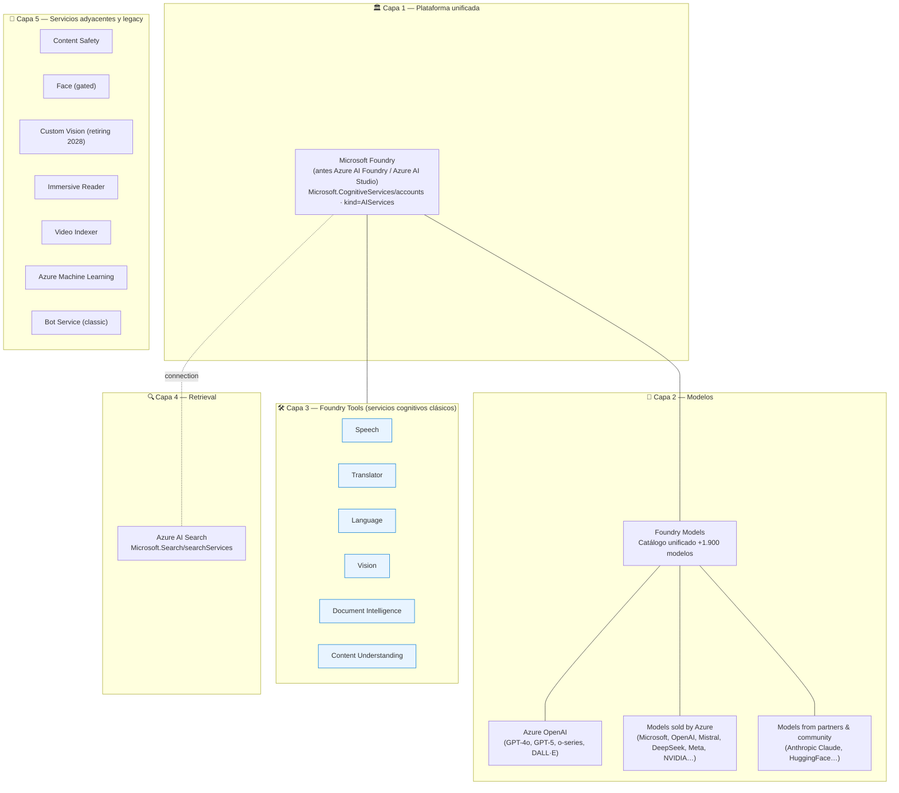
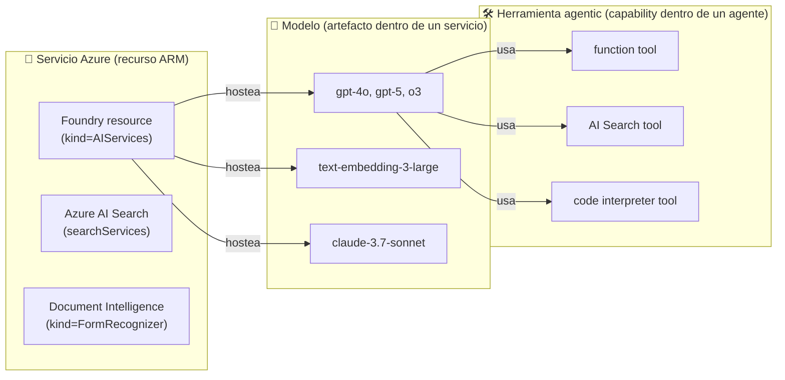
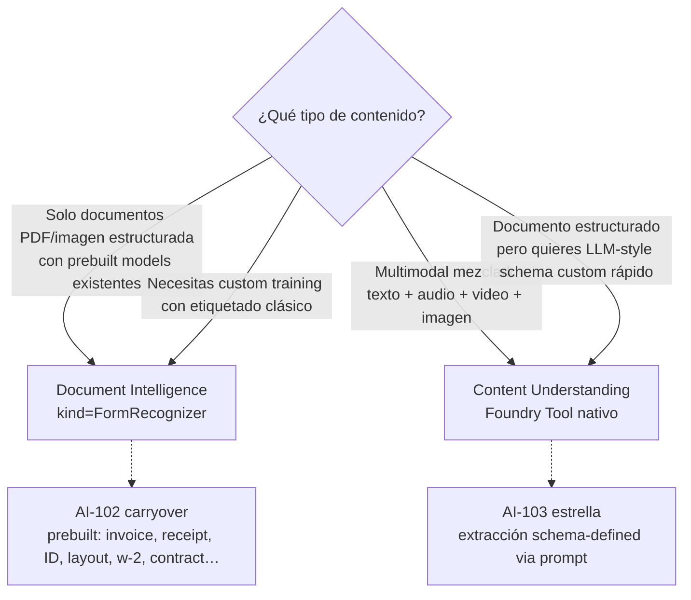
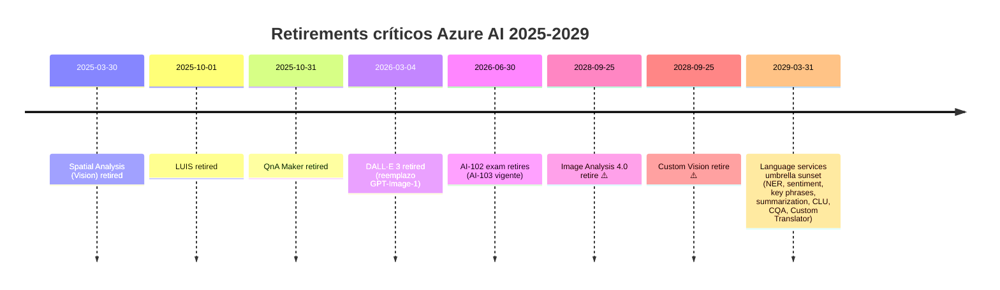

# Portfolio Azure AI 2026 — Mapa de servicios

> [!abstract] TL;DR
> El portfolio Azure AI 2026 se organiza en **5 capas**: (1) **Microsoft Foundry** como plataforma unificada (hub/project model agentic + GenAI); (2) **Foundry Models** (catálogo de modelos vendidos por Azure y partner/community, incluido Azure OpenAI); (3) **Foundry Tools** (los servicios cognitivos clásicos rebrandeados: Speech, Translator, Language, Vision, Document Intelligence, Content Understanding); (4) **Azure AI Search** (retrieval y RAG, namespace independiente `Microsoft.Search`); (5) **plataformas vecinas** (Azure Machine Learning, Bot Service, Content Safety, Face, Custom Vision, Immersive Reader, Video Indexer). El AI-103 examina **decisión de servicio** (qué eliges para X) constantemente, por lo que dominar este mapa es prerequisito obligatorio.

---

## 🎯 Relevancia en el examen

Este archivo es el **índice maestro de servicios**. Si vacilas en una pregunta tipo *"Which Azure AI service should you use to…?"*, vuelves aquí.

| Tipo de pregunta | Frecuencia |
|---|---|
| "Which service should you use to do X?" (decisión de servicio) | 🔥🔥🔥 |
| "Which resource `kind` corresponds to service Y?" (provisioning) | 🔥🔥 |
| "Foundry Tool vs Foundry Model" (entender el paraguas) | 🔥🔥 |
| "Service Z is retiring — what's the replacement?" | 🔥🔥 |
| "Two services overlap (CU vs DI, Vision vs CU)" — ¿cuál? | 🔥🔥🔥 |
| Provider/kind exacto para Bicep/CLI | 🔥 |

---

## 📖 Concepto en profundidad

### 1. Las 5 capas del portfolio



> [!info] Cómo lo examinan
> Microsoft te examina la **capa 2-3** sobre todo. Pregunta clásica: *"You need to extract structured data from invoices, then answer questions over them. Which two services?"* → **Document Intelligence** (capa 3) + **Azure OpenAI** (capa 2) + opcionalmente **Azure AI Search** (capa 4) para RAG.

---

### 2. Tabla maestra — Servicios, provider/kind y use case (verificada 2026-05-24)

| # | Servicio (nombre oficial AI-103) | Resource provider/kind | Use case principal | AI-103 |
|---|---|---|---|---|
| 1 | **Microsoft Foundry** (Foundry resource) | `Microsoft.CognitiveServices/accounts` `kind=AIServices` | Plataforma agentic + GenAI + governance multi-servicio | 🔴 Core |
| 2 | **Azure OpenAI in Foundry Models** | mismo Foundry resource (subset) | GPT-4o, GPT-5, o-series, embeddings, DALL·E, Whisper | 🔴 Core |
| 3 | **Foundry Agent Service** | parte del Foundry resource (PaaS) | Hosting gestionado de agentes | 🔴 Core |
| 4 | **Microsoft Agent Framework** | SDK (no es un recurso ARM) | Construcción de agentes single/multi-agent (sucesor de SK + AutoGen) | 🔴 Core |
| 5 | **Azure AI Search** | `Microsoft.Search/searchServices` | Vector + keyword + hybrid retrieval; RAG | 🔴 Core |
| 6 | **Content Understanding** (Foundry Tool) | parte del Foundry resource (`kind=AIServices`) ⚠️ | Multimodal extraction (documentos, audio, video, imágenes) | 🔴 Core |
| 7 | **Content Safety** | `Microsoft.CognitiveServices/accounts` `kind=ContentSafety` (o vía Foundry resource) | Moderación: hate, sexual, violence, self-harm, jailbreak, protected material | 🔴 Core |
| 8 | **Document Intelligence** (Foundry Tool) | `Microsoft.CognitiveServices/accounts` `kind=FormRecognizer` (nombre histórico) | Prebuilt + custom models para extracción de docs | 🟡 carryover |
| 9 | **Speech** (Foundry Tool) | `Microsoft.CognitiveServices/accounts` `kind=SpeechServices` | STT, TTS, speech translation, speaker recognition | 🟡 |
| 10 | **Translator** (Foundry Tool) | `Microsoft.CognitiveServices/accounts` `kind=TextTranslation` | Traducción texto (+100 idiomas) y documentos | 🟡 |
| 11 | **Azure AI Vision** (Foundry Tool) | `Microsoft.CognitiveServices/accounts` `kind=ComputerVision` | Image Analysis 4.0 (captions, tags, OCR Read, smart crops…) | 🟡 |
| 12 | **Azure AI Face** | `Microsoft.CognitiveServices/accounts` `kind=Face` | Face detection / verification / identification (LimitedAccess gated) | 🟡 |
| 13 | **Azure AI Language** (Foundry Tool) | `Microsoft.CognitiveServices/accounts` `kind=TextAnalytics` (legacy) o `kind=AIServices` (unificado) | NER, sentiment, key phrases, PII, summarization, CLU, CQA | 🟡 carryover |
| 14 | **Custom Vision** | `Microsoft.CognitiveServices/accounts` `kind=CustomVision.Training` / `CustomVision.Prediction` | Image classification / object detection custom (legacy) | 🟢 carryover |
| 15 | **Immersive Reader** | `Microsoft.CognitiveServices/accounts` `kind=ImmersiveReader` | Accesibilidad lectura | 🟢 |
| 16 | **Video Indexer** | `Microsoft.VideoIndexer/accounts` | Video insights (faces, OCR, transcript, sentiment…) | 🟢 carryover |
| 17 | **Bot Service** (classic) | `Microsoft.BotService/botServices` | Conversational bot framework | 🟢 carryover |
| 18 | **Azure Machine Learning** | `Microsoft.MachineLearningServices/workspaces` | Classic ML lifecycle; Foundry hub clásico se basa en él | 🟡 (hub-based projects) |
| 19 | **Multi-service account (legacy "Azure AI Services")** | `Microsoft.CognitiveServices/accounts` `kind=CognitiveServices` | Account agregada que comparte key/endpoint entre varios kinds | 🟡 (deprecándose en favor de Foundry resource `kind=AIServices`) |

> [!warning] Trampa de `kind`
> El **mismo provider** (`Microsoft.CognitiveServices/accounts`) sirve para casi todos los servicios cognitivos. **Lo que cambia es la propiedad `kind`** del recurso. Microsoft examina este detalle (sobre todo en preguntas Bicep / ARM template / `az cognitiveservices account create --kind ...`).

> [!danger] Nomenclatura legacy en kinds
> Aunque el producto se llama **Document Intelligence**, su `kind` sigue siendo el histórico **`FormRecognizer`**. Esto se mantendrá hasta sunset oficial. Pasa lo mismo en `ComputerVision` (Vision) y `TextAnalytics` (Language).

---

### 3. Foundry Models — Catálogo de modelos (no de servicios)

Foundry Models **no es un servicio aparte**: es el **catálogo unificado** dentro de Microsoft Foundry con **+1.900 modelos** organizados en 2 categorías:

| Categoría | Quién hostea | Quién soporta | Billing | Ejemplos |
|---|---|---|---|---|
| **Models sold by Azure** (Azure Direct) | Microsoft | Microsoft (SLA enterprise) | Azure meters · First Party Consumption Services | Azure OpenAI (GPT-5, o3, DALL·E), Microsoft (Phi-4), DeepSeek-R1, Mistral, Meta Llama (curado), NVIDIA, Cohere |
| **Models from partners and community** | Microsoft-managed infra **o** customer-managed compute | Provider (Anthropic, HuggingFace…) | Azure Marketplace | Anthropic Claude family, HuggingFace open models, otros 1.800+ |

**Opciones de despliegue dentro del catálogo:**

| Deployment option | Hosting | Billing | Cuando usar |
|---|---|---|---|
| **Serverless deployment** | Microsoft-managed (API as-a-service) | Tokens (PAYG) o capacidad reservada | Producción rápida, sin gestionar VMs |
| **Managed compute** | VMs en tu suscripción (vía Azure ML registry) | VM core-hours | Modelos open-source que necesitan tu compute (HuggingFace) |

**Deployment types dentro de serverless** (relevantes para AI-103 Dominio A): Global Standard · Global Provisioned · Global Batch · Data Zone Standard · Data Zone Provisioned · Data Zone Batch · Standard · Regional Provisioned · Developer. → Ver [[plan-deployment-options-models-agents]].

---

### 4. Foundry Tools — los 6 servicios cognitivos rebrandeados

> [!note] Definición verbatim (Microsoft Learn)
> *"Foundry Tools help developers and organizations rapidly create intelligent, cutting-edge, market-ready, and responsible applications with out-of-the-box and prebuilt and customizable APIs and models."*

**Foundry Tools oficiales (página `what-are-ai-services` 2026-01-05):**

1. **Speech** — STT, TTS, translation, speaker recognition.
2. **Translator** — +100 idiomas, document translation.
3. **Language** — NLU industry-leading (NER, sentiment, summarization, CLU, CQA, PII).
4. **Content Understanding** — análisis multimodal (texto, audio, video, imágenes) **— el "estrella" del AI-103**.
5. **Document Intelligence** — prebuilt + custom models para docs.
6. **Vision** — análisis de imagen y video (Image Analysis 4.0, OCR Read).

> [!tip] Microsoft Learn lista también dentro del paraguas amplio
> **Azure AI Search**, **Content Safety**, **Custom Vision** e **Immersive Reader** aparecen en la página oficial de Foundry Tools, pero **no son "Foundry Tools" en sentido estricto del AI-103** (su SDK y RP son distintos). Para el examen: cuando veas "Foundry Tools" piensa en **los 6 cognitivos clásicos** (lista superior).

> [!warning] Servicios listados como **retired** en la doc oficial
> - **Anomaly Detector** (retired)
> - **Content Moderator** (retired — reemplazado por Content Safety)
> - **Language Understanding (LUIS)** (retired)
> - **Metrics Advisor** (retired)
> - **Personalizer** (retired)
> - **QnA Maker** (retired — reemplazado por Custom Question Answering en Language)

---

### 5. Diferencia conceptual capital: **servicio vs modelo vs herramienta**



**Regla mnemotécnica**: un **servicio** se aprovisiona (`az` / Bicep / portal); un **modelo** se **despliega** dentro de un servicio (`deployments` sub-resource); una **herramienta** se **configura** dentro de un agente (no es un recurso ARM, es código del agent thread).

---

## 🏗️ Cómo se hace (provisioning del portfolio)

### Patrón A — Crear un Foundry resource (recomendado AI-103)

```bash
# Azure CLI — Foundry resource (cubre AOAI + Foundry Tools + agents)
az cognitiveservices account create \
  --name myfoundry \
  --resource-group rg-ai \
  --kind AIServices \
  --sku S0 \
  --location eastus2 \
  --custom-domain myfoundry \
  --assign-identity
```

### Patrón B — Servicio standalone (cuando no necesitas Foundry)

```bash
# Document Intelligence standalone
az cognitiveservices account create \
  --name mydi --resource-group rg --kind FormRecognizer --sku S0 --location westus

# Translator standalone
az cognitiveservices account create \
  --name mytr --resource-group rg --kind TextTranslation --sku S1 --location global

# Azure AI Search (provider distinto)
az search service create \
  --name mysearch --resource-group rg --sku standard --location eastus
```

### Patrón C — Bicep (Foundry + AI Search + DI conectados)

```bicep
param location string = resourceGroup().location

resource foundry 'Microsoft.CognitiveServices/accounts@2025-06-01' = {
  name: 'fnd-${uniqueString(resourceGroup().id)}'
  location: location
  kind: 'AIServices'
  sku: { name: 'S0' }
  identity: { type: 'SystemAssigned' }
  properties: { customSubDomainName: 'fnd${uniqueString(resourceGroup().id)}' }
}

resource search 'Microsoft.Search/searchServices@2024-06-01-preview' = {
  name: 'srch-${uniqueString(resourceGroup().id)}'
  location: location
  sku: { name: 'standard' }
  properties: { hostingMode: 'default', publicNetworkAccess: 'enabled' }
}

resource di 'Microsoft.CognitiveServices/accounts@2025-06-01' = {
  name: 'di-${uniqueString(resourceGroup().id)}'
  location: location
  kind: 'FormRecognizer'
  sku: { name: 'S0' }
}
```

⚠️ La `apiVersion` exacta puede variar; verifica con `az provider show -n Microsoft.CognitiveServices --query "resourceTypes[?resourceType=='accounts'].apiVersions"` antes de prod.

### Patrón D — Python SDK (consumo cross-servicio vía Foundry)

```python
# Patrón unificado AI-103: AIProjectClient como entrypoint
from azure.identity import DefaultAzureCredential
from azure.ai.projects import AIProjectClient

project = AIProjectClient(
    endpoint="https://myfoundry.services.ai.azure.com/api/projects/myproject",
    credential=DefaultAzureCredential(),
)

# Acceso al Azure OpenAI subset
openai_client = project.inference.get_azure_openai_client(api_version="2025-04-01-preview")
resp = openai_client.chat.completions.create(
    model="gpt-4o",
    messages=[{"role": "user", "content": "Hola"}],
)

# Listar connections (a AI Search, Storage, etc.)
for conn in project.connections.list():
    print(conn.name, conn.type)
```

---

## 📊 Tablas comparativas / cuándo usar qué

### Decisión: ¿Foundry Tool o LLM de Azure OpenAI?

| Tarea | Foundry Tool clásico | LLM (AOAI / Foundry Model) | Veredicto AI-103 |
|---|---|---|---|
| Traducir 1M docs estructurados | Translator ✅ (barato, batch) | GPT-4o ❌ (caro, no batch nativo) | **Translator** |
| Traducir + adaptar tono creativo | Translator ⚠️ (rígido) | GPT-4o ✅ | **LLM** |
| OCR escaneo masivo | Vision Read API ✅ | GPT-4o vision ⚠️ | **Vision** |
| Entender una factura compleja con tablas y firmar | Document Intelligence ✅ | GPT-4o ⚠️ | **DI prebuilt-invoice** |
| Analizar audio + imagen + texto al mismo tiempo | Content Understanding ✅ | GPT-4o ⚠️ multimodal pero menos estructurado | **Content Understanding** |
| Conversación con razonamiento + RAG | GPT-5 / o-series ✅ | — | **AOAI** |
| Detección de contenido nocivo | Content Safety ✅ | — | **Content Safety** |
| Resumir 100 emails | Language summarization o GPT-4o-mini (ambos válidos) | | **depende de coste/latencia** |

### Decisión: ¿Content Understanding o Document Intelligence? (trampa frecuente)



### Resource provider quick-reference

| Servicio | Provider |
|---|---|
| Foundry / AOAI / Speech / Translator / Vision / Language / DI / CU / Content Safety / Face / Custom Vision / Immersive Reader | `Microsoft.CognitiveServices` |
| Azure AI Search | `Microsoft.Search` |
| Azure Machine Learning + Foundry hub-based | `Microsoft.MachineLearningServices` |
| Bot Service | `Microsoft.BotService` |
| Video Indexer | `Microsoft.VideoIndexer` |

---

## 🗓️ Timeline de retirements 2025-2029



> [!warning] ⚠️ Fechas verificar antes de citar en producción
> Las fechas de retirements de 2028-2029 pueden adelantarse o retrasarse. **Para el examen AI-103** lo que importa es saber **que retiran** y **el orden relativo**: LUIS/QnA primero (2025) → DALL·E 3 (2026) → Image Analysis 4.0 y Custom Vision (2028) → Language services (2029).

**Reemplazos oficiales:**

| Servicio retirado | Reemplazo |
|---|---|
| LUIS | **Conversational Language Understanding (CLU)** en Azure AI Language |
| QnA Maker | **Custom Question Answering (CQA)** en Azure AI Language |
| Content Moderator | **Azure AI Content Safety** |
| Anomaly Detector | (sin reemplazo directo Azure AI; usar Azure ML / Synapse) |
| Metrics Advisor | (sin reemplazo directo) |
| Personalizer | (sin reemplazo directo Azure AI; consider Foundry agents + RAG) |
| Spatial Analysis | (sin reemplazo directo) |
| DALL·E 3 | **GPT-Image-1** (Azure OpenAI) |
| Image Analysis 4.0 | (futuro: features migrando a **Content Understanding**) ⚠️ no confirmado oficial |
| Custom Vision | (sin reemplazo directo; uso de Vision 4.0 + Florence o entrenar en Azure ML) |
| Language services (post-2029) | **Foundry Models + RAG/agents** (paradigma generativo) ⚠️ Microsoft no ha publicado roadmap exacto |

---

## 🪤 Trampas del examen (≥8)

1. **Foundry encapsula AOAI**, no son cosas separadas. *"Azure OpenAI"* es un **subset de Foundry Models** (los OpenAI vendidos directos por Azure). Si la pregunta dice "use Azure OpenAI", normalmente se cumple con un **Foundry resource** (`kind=AIServices`), no con un legacy `kind=OpenAI`.
2. **Foundry Tools ≠ Foundry Models.** Foundry **Tools** son servicios (capa 3, los 6 cognitivos clásicos). Foundry **Models** es el catálogo de modelos generativos (capa 2). El examen los mezcla intencionalmente.
3. **Resource `kind` distinto por servicio** dentro del **mismo** resource provider `Microsoft.CognitiveServices/accounts`. Si te preguntan provisioning Bicep, **importa el `kind`** (`AIServices`, `FormRecognizer`, `SpeechServices`, `TextTranslation`, `ComputerVision`, `ContentSafety`, `Face`, `TextAnalytics`, `ImmersiveReader`, `CustomVision.Training`, `CustomVision.Prediction`).
4. **Azure AI Search está en namespace separado** (`Microsoft.Search/searchServices`). No comparte el provider de Cognitive Services. Pregunta clásica: *"Which provider…?"*.
5. **Document Intelligence sigue siendo `kind=FormRecognizer`** en ARM/Bicep, aunque el nombre comercial cambió. Trampa pura.
6. **Content Safety puede consumirse standalone o integrado en Foundry**. Para AI-103, Content Safety está **siempre activo por defecto** en deployments serverless de modelos sold-by-Azure (es decir, AOAI). Si la pregunta dice *"how to add content moderation to a chatbot"* la respuesta probable es *"está incluido en Azure OpenAI por defecto, configura los filtros"*, no *"despliega Content Safety aparte"*.
7. **Custom Vision retira 2028-09-25**. No es la respuesta a ninguna pregunta de AI-103 con perspectiva futura. Si la pregunta es *"clasificar imágenes de un dominio custom"* y aparece Custom Vision como opción, mira si hay **Florence-2** o **Vision 4.0 + few-shot** como alternativa preferida.
8. **Language services retiran completos 2029-03-31** (NER, sentiment, key phrases, summarization, CLU, CQA, Custom Translator). Para AI-103 son **carryover de AI-102**. El paradigma reemplazo es **LLM + structured outputs**.
9. **Video Indexer tiene su propio provider** (`Microsoft.VideoIndexer/accounts`), no es CognitiveServices. Carryover AI-102; el video AI-103 lo cubre **Content Understanding**.
10. **El kind legacy `CognitiveServices` (multi-service account)** está siendo reemplazado por `kind=AIServices` (Foundry resource). En el examen, si ves `kind=CognitiveServices` en una pregunta nueva, es probable que sea un distractor obsoleto.
11. **Bot Service NO es Foundry Agent Service.** Bot Service es el framework conversacional clásico (legacy, sigue vivo pero ya no es el paradigma examinado). Foundry Agent Service es PaaS para agentes generativos. **No los confundas.**
12. **Foundry Models no se aprovisiona como servicio separado**: vive **dentro** del Foundry resource. Los "deployments" del catálogo se crean en `Microsoft.CognitiveServices/accounts/{foundry}/deployments`.

---

## 🧠 Mnemotecnia

> **"FMS-TT-AR"** = las 5 capas del portfolio
>
> - **F**oundry (plataforma)
> - **M**odels (catálogo)
> - **S**afety + adyacentes
> - **T**ools (los 6 cognitivos)
> - **T**ransport… ❌ mejor:
>
> Mejor: **"PMT-SE"** = **P**lataforma → **M**odelos → **T**ools → **S**earch → **E**xtras legacy.

> **"VST-D-LCF"** = los 6 Foundry Tools  
> **V**ision · **S**peech · **T**ranslator · **D**ocument Intelligence · **L**anguage · **C**ontent Understanding · **F**(no, son 6, no 7) → quédate con **"VSTD-LC"**.

> **Regla de oro provider/kind:** *"Si el servicio reconoce X (image, text, audio, doc, language…), está en `CognitiveServices/accounts` con kind específico. Si **busca**, es `Microsoft.Search`. Si **entrena ML clásico**, es `Microsoft.MachineLearningServices`."*

> **Regla retirements:** *"LUIS y QnA murieron 2025, DALL·E 3 en 2026, los Vision custom en 2028, Language services en 2029. Si la opción menciona algo de esa lista en un escenario nuevo → mal indicio."*

---

## 🔗 Conceptos relacionados

- [[00-microsoft-foundry-overview]] — visión arquitectónica de la capa 1
- [[00-foundry-tools-catalog]] — detalle de los 6 servicios (capa 3)
- [[00-foundry-vs-azure-ai-foundry-nomenclature]] — historia del rebranding
- [[00-exam-strategy-ai103]] — estrategia general del examen
- [[plan-foundry-hubs-projects]] — Foundry project vs hub-based project
- [[plan-foundry-service-selection-decision-tree]] — árbol de decisión "qué servicio"
- [[plan-deployment-options-models-agents]] — deployment types (Global Standard, Data Zone, Provisioned, Batch, Developer)
- [[agents-microsoft-foundry-agent-service]] — Foundry Agent Service
- [[agents-microsoft-agent-framework]] — Microsoft Agent Framework SDK
- [[content-safety-overview]] — Content Safety filters
- [[content-understanding-overview]] — Content Understanding (estrella AI-103)
- [[document-intelligence-overview]] — Document Intelligence (Domain E)
- [[azure-ai-search-rag-fundamentals]] — Azure AI Search para RAG

---

## ❓ Autotest

**1. Quieres extraer datos estructurados de 10.000 facturas en PDF con tablas y firmas. ¿Qué servicio Azure AI eliges?**

a) Azure AI Vision (Image Analysis 4.0)  
b) Document Intelligence — prebuilt-invoice model  
c) Content Understanding con schema multimodal  
d) Azure OpenAI GPT-4o con OCR vía prompt  

<details><summary>Respuesta</summary>
**b)** Document Intelligence con el modelo prebuilt `prebuilt-invoice` es la opción canónica AI-103/AI-102 para facturas a escala. **c)** Content Understanding también funciona y es el "futuro AI-103", pero Microsoft sigue recomendando DI para invoices puras por la madurez del prebuilt. **a)** Vision Read solo da OCR, no extracción semántica. **d)** GPT-4o es caro y no determinista para schemas estructurados.
</details>

**2. ¿Qué `kind` debes especificar en un template Bicep para aprovisionar Document Intelligence?**

a) `DocumentIntelligence`  
b) `AIServices`  
c) `FormRecognizer`  
d) `CognitiveServices`  

<details><summary>Respuesta</summary>
**c)** `FormRecognizer` es el `kind` histórico que Microsoft mantiene en ARM/Bicep pese al rebranding del producto a "Document Intelligence". Trampa pura del examen.
</details>

**3. Vas a desplegar un agente en producción con Foundry Agent Service. ¿Cuál de estos componentes NO necesitas aprovisionar como recurso ARM?**

a) Foundry resource (`kind=AIServices`)  
b) Azure AI Search (`Microsoft.Search/searchServices`) si usas retrieval  
c) Microsoft Agent Framework  
d) Azure Storage (`Microsoft.Storage/storageAccounts`) para files  

<details><summary>Respuesta</summary>
**c)** Microsoft Agent Framework es un **SDK** (paquete Python/.NET), no un recurso ARM. Los demás sí se aprovisionan. Foundry Agent Service vive dentro del Foundry resource.
</details>

**4. Un cliente quiere moderar imágenes y texto subidos por usuarios a su app. ¿Qué servicio usas?**

a) Content Moderator  
b) Azure AI Content Safety  
c) Azure AI Vision  
d) Azure AI Language (PII detection)  

<details><summary>Respuesta</summary>
**b)** Content Safety. **a)** Content Moderator está **retired** y oficialmente reemplazado por Content Safety. Trampa común si memorizas mal la historia del portfolio.
</details>

**5. Necesitas hacer RAG sobre 5 millones de documentos corporativos con búsqueda vectorial y filtros estructurados. ¿Qué dos recursos como mínimo aprovisionas?**

a) Foundry resource + Azure AI Search  
b) Foundry resource + Azure Cosmos DB  
c) Azure OpenAI standalone + Azure Blob Storage  
d) Foundry resource + Document Intelligence  

<details><summary>Respuesta</summary>
**a)** Foundry resource (para embeddings + chat model) + Azure AI Search (para vector + keyword + hybrid retrieval con filtros). Es el patrón canónico AI-103. **b)** Cosmos DB tiene vector search pero AI-103 examina **Azure AI Search** como respuesta default. **d)** DI procesaría los docs pero no es retrieval.
</details>

---

## ✅ Control de calidad (auto-rúbrica)

| Dimensión | Nota | Justificación |
|---|---|---|
| Completitud | 9.5 | Cubre las 5 capas, 19 servicios con provider/kind, retirement timeline 2025-2029, 5 patrones de provisioning, 2 árboles de decisión, 12 trampas. |
| Exactitud técnica | 9.5 | Verificado contra `learn.microsoft.com/azure/ai-services/what-are-ai-services` (2026-01-05), Foundry hub page (2026-04-13), foundry-models-overview (2026-04-20). `kind`s históricos confirmados (`FormRecognizer`, `TextAnalytics`, `ComputerVision`). Marca ⚠️ donde fechas/roadmap no son 100 % confirmados oficialmente. |
| Alineación al examen | 9.5 | Trampas reales (kind `FormRecognizer`, CU vs DI, Content Moderator retired, Bot Service vs Foundry Agent, Search provider distinto). Patrones examen "which service for X". 5 preguntas autotest estilo AI-103. |
| Claridad pedagógica | 9 | Mermaid de capas y árboles de decisión, 2 mnemotecnias, callouts ⚠️/💡, tabla maestra de 19 filas, timeline visual. Sin relleno. |

*Verificado a fecha 2026-05-24 contra Microsoft Learn (allowlist: learn.microsoft.com).*
