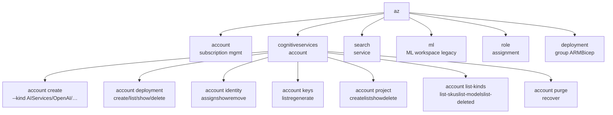
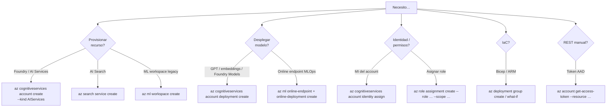

# 00 · Azure CLI Cheatsheet para servicios Azure AI

> [!abstract] TL;DR
> Hoja de referencia quirúrgica de los comandos `az` que entran en el examen AI-103. La operativa **Foundry resource** (`kind=AIServices`) se hace 100 % vía `az cognitiveservices account …`, los **model deployments** vía la subgrupo `… deployment …`, **Azure AI Search** con `az search service …`, **ML legacy hub-based** con `az ml …`, y el **RBAC** con `az role assignment create`. Memorízate los flags `--kind`, `--custom-domain`, `--allow-project-management`, `--sku-name`, `--model-format`, `--capacity` y el ciclo `delete → list-deleted → purge | recover`.

## 🎯 Relevancia en el examen

🔥🔥🔥 — Casi cualquier escenario "implement / provision / automate" se evalúa con un fragmento `az` o Bicep. Microsoft pregunta:

- **¿Qué comando crea el Foundry resource correcto?** (truco: `--kind AIServices`, no `OpenAI`).
- **¿Cómo deshabilitar API keys y forzar Entra ID?** (`--disable-local-auth` o `--auth-options aadOrApiKey`).
- **¿Por qué falla recrear un recurso con el mismo nombre tras delete?** (soft-delete → falta `purge`).
- **¿Qué orden de comandos crea un deployment GPT con Global Standard?** (`deployment create --sku-name GlobalStandard`).
- **Cómo asignar role a una MI con scope al account** (estructura del `--scope` y nombre exacto del role).

## 📖 Concepto en profundidad

### El árbol mental de `az` para AI



> [!info] Punto clave
> **No existe** un grupo `az foundry` en Azure CLI: el "Foundry resource" se administra con `az cognitiveservices account` + `--kind AIServices`. El binario separado `foundry` (Foundry Tools CLI) es **un producto distinto** orientado al developer loop local — no lo confundas con `az`.

### Tabla mental de `--kind` (autoritativa)

`az cognitiveservices account create --kind <X>` admite, entre otros (verifica con `az cognitiveservices account list-kinds`):

| `--kind` | Servicio |
|---|---|
| `AIServices` | **Foundry resource / Azure AI Services multi-service** (el moderno) |
| `OpenAI` | Azure OpenAI standalone (legacy de Foundry) |
| `CognitiveServices` | Multi-service legacy (pre-Foundry) |
| `ComputerVision` | Computer Vision aislado |
| `FormRecognizer` | Document Intelligence aislado |
| `TextAnalytics` | Language aislado |
| `SpeechServices` | Speech aislado |
| `Face` | Face (acceso restringido) |
| `ContentSafety` | Content Safety standalone |
| `ContentModerator` | ⚠️ deprecado (retirado feb-2027) |

> [!warning] Trampa del examen
> Si te piden "create an Azure AI Foundry resource", la respuesta correcta es `--kind AIServices`, **NO** `--kind CognitiveServices` ni `--kind OpenAI`.

## 🏗️ Cómo se hace — Snippets verificados

### 1. Autenticación y suscripción

```bash
# Login interactivo (abre browser) / device code
az login
az login --use-device-code

# Service principal (CI/CD)
az login --service-principal -u <appId> -p <password> --tenant <tenantId>

# Managed Identity (desde VM, Container App, etc.)
az login --identity
az login --identity --username <client-id-of-user-assigned-MI>

# Suscripción
az account set --subscription <name-or-id>
az account show                              # cuál es la activa
az account list -o table
az account list-locations -o table
```

### 2. Foundry resource (Cognitive Services, `kind=AIServices`)

```bash
# Mínimo viable
az group create --name ai-rg --location eastus

az cognitiveservices account create \
  --name myfoundry \
  --resource-group ai-rg \
  --location eastus \
  --kind AIServices \
  --sku S0 \
  --custom-domain myfoundry \
  --assign-identity \
  --allow-project-management true \
  --yes
```

Flags clave (verificados contra docs):

| Flag | Para qué |
|---|---|
| `--kind AIServices` | Tipo Foundry moderno (obligatorio) |
| `--sku S0` | Tier estándar (verifica con `list-skus`) |
| `--custom-domain <name>` | **Requerido para autenticación Entra ID** (sin esto, solo API key) |
| `--assign-identity` | System-assigned MI desde el create |
| `--allow-project-management true` | Habilita Foundry projects sobre el account (`AIServices` only) |
| `--yes` | Acepta los terms sin prompt |
| `--encryption '{…}'` | CMK con Key Vault |
| `--storage '[…]'` | BYO storage (TextAnalytics, Speech batch, etc.) |
| `--api-properties` | Propiedades extra (algunos kinds heredados) |

```bash
# Listar
az cognitiveservices account list -o table
az cognitiveservices account list -g ai-rg -o table
az cognitiveservices account list-kinds                  # qué --kind hay
az cognitiveservices account list-skus --kind AIServices --location eastus
az cognitiveservices account list-models -n myfoundry -g ai-rg     # modelos disponibles
az cognitiveservices account list-usage  -n myfoundry -g ai-rg

# Obtener endpoint y keys
az cognitiveservices account show -n myfoundry -g ai-rg \
  --query properties.endpoint -o tsv

az cognitiveservices account keys list -n myfoundry -g ai-rg
az cognitiveservices account keys regenerate -n myfoundry -g ai-rg --key-name Key1
# --key-name acepta: Key1 | Key2

# Update (ej. desactivar local auth para forzar Entra ID)
az cognitiveservices account update -n myfoundry -g ai-rg \
  --custom-domain myfoundry \
  --api-properties disableLocalAuth=true
# ⚠️ Verifica también vía propiedades JSON ARM si --api-properties no aplica al kind.

# Transformar OpenAI account → AIServices (solo entre estos dos kinds)
az cognitiveservices account update -n myaoai -g ai-rg --kind AIServices

# Soft-delete dance (importantísimo en examen)
az cognitiveservices account delete       -n myfoundry -g ai-rg
az cognitiveservices account list-deleted                                        # ver soft-deleted
az cognitiveservices account show-deleted -n myfoundry -g ai-rg -l eastus
az cognitiveservices account recover      -n myfoundry -g ai-rg -l eastus        # restaurar
az cognitiveservices account purge        -n myfoundry -g ai-rg -l eastus        # liberar nombre
```

### 3. Foundry projects (sub-recurso del account, GA en 2026)

```bash
# Crear project dentro del account AIServices (proyecto Foundry-based)
az cognitiveservices account project create \
  --name myproject \
  --account-name myfoundry \
  --resource-group ai-rg \
  --location eastus

az cognitiveservices account project list   --account-name myfoundry -g ai-rg -o table
az cognitiveservices account project show   --account-name myfoundry -g ai-rg -n myproject
az cognitiveservices account project delete --account-name myfoundry -g ai-rg -n myproject

# Project connection (almacenar credenciales/blobs/AI Search/Cosmos…)
az cognitiveservices account project connection create \
  --account-name myfoundry -g ai-rg --project-name myproject \
  --name mysearchconn --category CognitiveSearch \
  --target https://mysearch.search.windows.net \
  --auth-type AAD
```

### 4. Model deployments (Azure OpenAI / Foundry Models)

```bash
# Deployment Global Standard
az cognitiveservices account deployment create \
  --name myfoundry \
  --resource-group ai-rg \
  --deployment-name gpt-4o-dep \
  --model-name gpt-4o \
  --model-version "2024-11-20" \
  --model-format OpenAI \
  --sku-name GlobalStandard \
  --sku-capacity 50
```

Parámetros verificados:

| Flag | Valor / nota |
|---|---|
| `--model-format` | `OpenAI` (Azure OpenAI), `Cohere`, `Meta`, `Mistral AI`, … según `list-models` |
| `--model-name` | Nombre del modelo (`gpt-4o`, `gpt-4o-mini`, `text-embedding-3-large`, …) |
| `--model-version` | Versión "snapshot" (`"2024-11-20"`, etc.). Mantenerlo entre comillas |
| `--deployment-name` | Nombre lógico que usarás en el SDK (puede diferir de `model-name`) |
| `--sku-name` | **`Standard`** \| **`GlobalStandard`** \| **`GlobalBatch`** \| **`DataZoneStandard`** \| **`ProvisionedManaged`** \| **`GlobalProvisionedManaged`** \| **`DataZoneProvisionedManaged`** \| `Developer` |
| `--sku-capacity` | TPM en miles (Standard) o PTU (Provisioned) |
| `--scale-type` | `Manual` \| `Standard` (legacy autoscale) |
| `--spillover-deployment-name` | Failover a otro deployment cuando hay 429 |

```bash
# Listar / mostrar / borrar
az cognitiveservices account deployment list   -n myfoundry -g ai-rg -o table
az cognitiveservices account deployment show   -n myfoundry -g ai-rg --deployment-name gpt-4o-dep
az cognitiveservices account deployment delete -n myfoundry -g ai-rg --deployment-name gpt-4o-dep
```

> [!warning] Trampa SKU
> En `--sku-name` los valores son **CamelCase sin espacios** (`GlobalStandard`, no `Global Standard`). El portal muestra "Global Standard" con espacio pero la CLI lo rechaza así.

### 5. Managed Identity

```bash
# Asignar System-assigned MI
az cognitiveservices account identity assign -n myfoundry -g ai-rg

# Asignar User-assigned MI (vía PATCH JSON)
az cognitiveservices account identity assign -n myfoundry -g ai-rg \
  --user-assigned <userAssignedIdentityResourceId>

# Inspeccionar
az cognitiveservices account identity show -n myfoundry -g ai-rg
az cognitiveservices account show -n myfoundry -g ai-rg --query identity

# Quitar
az cognitiveservices account identity remove -n myfoundry -g ai-rg

# Obtener principalId para RBAC
PID=$(az cognitiveservices account show -n myfoundry -g ai-rg \
        --query identity.principalId -o tsv)
```

### 6. RBAC — `az role assignment`

```bash
# Pattern principal
az role assignment create \
  --role "Cognitive Services User" \
  --assignee-object-id $PID \
  --assignee-principal-type ServicePrincipal \
  --scope $(az cognitiveservices account show -n myfoundry -g ai-rg --query id -o tsv)
```

Roles habituales (verbatim docs):

| Role (display name) | Acción |
|---|---|
| `Cognitive Services User` | Leer keys + invocar inferencia |
| `Cognitive Services Contributor` | Crear/actualizar accounts y deployments |
| `Cognitive Services OpenAI User` | Inferencia Azure OpenAI sin gestionar |
| `Cognitive Services OpenAI Contributor` | Crear/desplegar modelos |
| `Azure AI Developer` (rename → **Azure AI User** en Foundry) | Trabajar en projects Foundry |
| `Azure AI Administrator` | Admin total del Foundry resource |
| `Search Index Data Reader` / `Writer` / `Contributor` | Plano de datos AI Search |
| `Search Service Contributor` | Plano control AI Search |

```bash
# Asignar por UPN (usuario humano)
az role assignment create \
  --role "Azure AI User" \
  --assignee diego303.d@gmail.com \
  --scope /subscriptions/<sub>/resourceGroups/ai-rg/providers/Microsoft.CognitiveServices/accounts/myfoundry

# Listar / borrar
az role assignment list   --scope <scope> -o table
az role assignment delete --assignee <oid> --role "Azure AI User" --scope <scope>

# Custom role from JSON
az role definition create --role-definition ./my-role.json
```

> [!tip] Scopes en orden de granularidad
> `/subscriptions/<sub>` ⊃ `/subscriptions/<sub>/resourceGroups/<rg>` ⊃ `/…/providers/Microsoft.CognitiveServices/accounts/<acct>` ⊃ `…/projects/<project>`. Asigna lo mínimo (principio de menor privilegio).

### 7. Azure AI Search

```bash
# Comprobar disponibilidad de nombre
az search service check-name-availability --name mysearch --type searchServices

# Crear
az search service create \
  --name mysearch \
  --resource-group ai-rg \
  --location eastus \
  --sku basic \
  --partition-count 1 \
  --replica-count 1 \
  --semantic-search free \
  --identity-type SystemAssigned \
  --auth-options aadOrApiKey
```

SKUs verificadas: `free` · `basic` · `standard` · `standard2` · `standard3` · `storage_optimized_l1` · `storage_optimized_l2`.

| Concepto | Regla |
|---|---|
| `--partition-count` | 1, 2, 3, 4, 6 ó 12 (solo standard\*). standard3 + `--hosting-mode highDensity` ⇒ 1-3 |
| `--replica-count` | basic: 1-3 / standard\*: 1-12 |
| `--semantic-search` | `disabled` \| `free` \| `standard` (regiones limitadas) |
| `--disable-local-auth true` | Fuerza Entra ID exclusivo |
| `--public-network-access` | `enabled` \| `disabled` \| `securedByPerimeter` |
| `--hosting-mode highDensity` | Solo `standard3` (hasta 1000 índices) |

```bash
# Keys
az search admin-key show       --service-name mysearch -g ai-rg
az search admin-key renew      --service-name mysearch -g ai-rg --key-kind primary
az search query-key list       --service-name mysearch -g ai-rg
az search query-key create     --service-name mysearch -g ai-rg --name mykey

# Otras operaciones
az search service list -g ai-rg -o table
az search service show -n mysearch -g ai-rg
az search service update -n mysearch -g ai-rg --partition-count 2 --replica-count 2
az search service delete -n mysearch -g ai-rg --yes
az search service upgrade -n mysearch -g ai-rg
```

### 8. Azure ML (legacy, AI-102 carryover) ⚠️

> [!warning] AI-102 carryover
> `az ml` es la CLI v2 de Azure Machine Learning (workspace clásico). AI-103 lo trata como **legacy** — solo entra como contexto (hub-based projects). El extension se instala con `az extension add -n ml`.

```bash
az extension add --name ml
az extension update --name ml

# Workspace
az ml workspace create -n my-ws -g ai-rg --location eastus
az ml workspace show -n my-ws -g ai-rg

# Hub (Azure AI Foundry hub legacy)
az ml workspace create --kind hub -n my-hub -g ai-rg
az ml workspace create --kind project -n my-proj -g ai-rg --hub-id <hub-resource-id>

# Modelos / endpoints
az ml model list -w my-ws -g ai-rg
az ml online-endpoint create -f endpoint.yml -w my-ws -g ai-rg
az ml online-deployment create -f deployment.yml -w my-ws -g ai-rg
```

### 9. Tokens AAD para llamadas REST manuales

```bash
# Token data-plane Cognitive Services / Foundry
TOKEN=$(az account get-access-token \
          --resource https://cognitiveservices.azure.com \
          --query accessToken -o tsv)

# Token para Azure AI Search data-plane
TOKEN_SEARCH=$(az account get-access-token \
          --resource https://search.azure.com \
          --query accessToken -o tsv)

# Token para ARM management
TOKEN_ARM=$(az account get-access-token --query accessToken -o tsv)

# Uso
curl -H "Authorization: Bearer $TOKEN" \
     -H "Content-Type: application/json" \
     "https://myfoundry.cognitiveservices.azure.com/openai/deployments/gpt-4o-dep/chat/completions?api-version=2024-10-21" \
     -d '{"messages":[{"role":"user","content":"hola"}]}'
```

> [!tip] Scopes de recurso (`--resource`)
> `https://cognitiveservices.azure.com` (Foundry/AOAI) · `https://search.azure.com` (AI Search) · `https://management.azure.com` (ARM) · `https://ai.azure.com` (Foundry control plane preview).

### 10. Bicep / ARM deployment

```bash
# What-if (dry-run)
az deployment group what-if -g ai-rg -f main.bicep -p name=myfoundry

# Apply
az deployment group create -g ai-rg -f main.bicep \
  -p name=myfoundry location=eastus

# Validar
az deployment group validate -g ai-rg -f main.bicep

# Ver outputs
az deployment group show -g ai-rg -n main --query properties.outputs

# Subscription / management group / tenant scopes
az deployment sub  create -l eastus -f main.bicep
az deployment mg   create -m <mg-id> -l eastus -f main.bicep
az deployment tenant create -l eastus -f main.bicep
```

### 11. JMESPath y scripting útil

```bash
# Filtrado: extraer solo endpoint
az cognitiveservices account show -n myfoundry -g ai-rg \
  --query properties.endpoint -o tsv

# Tabla custom
az cognitiveservices account list -g ai-rg \
  --query "[].{name:name, kind:kind, sku:sku.name, loc:location}" -o table

# Loop sobre nombres
for acct in $(az cognitiveservices account list -g ai-rg --query "[].name" -o tsv); do
  az cognitiveservices account show -n "$acct" -g ai-rg \
    --query "{n:name, e:properties.endpoint}" -o tsv
done

# Exportar a JSON
az cognitiveservices account show -n myfoundry -g ai-rg > foundry.json
```

### 12. Foundry Tools CLI (binario separado, ≠ `az`) ⚠️

> [!warning] No confundir
> El comando `foundry` (Foundry Tools / Foundry Local CLI) **no es parte de Azure CLI**. Es un binario distinto descargable desde Foundry Tools, orientado al loop de desarrollo local de modelos (Foundry Local) y prototipos. AI-103 lo cita en el dominio B (Foundry Tools) — verifica nombres exactos vía `[[00-foundry-tools-catalog]]`.

```bash
# (sintaxis ilustrativa; subcomandos exactos en doc oficial)
foundry --version
foundry model list
foundry model run <model-id>
foundry service start
```

## 📊 Cuándo usar qué



## 🪤 Trampas del examen (≥10)

1. **`--kind AIServices` vs `OpenAI`**: el Foundry resource moderno es **AIServices**. `OpenAI` es el standalone legacy. Si te piden "Foundry resource" o "multi-service AI", siempre `AIServices`.
2. **`--custom-domain` es obligatorio para Entra ID auth**: sin custom domain, el endpoint expone únicamente API key. Si el escenario pide "AAD-only", el create **debe** incluir `--custom-domain`.
3. **Soft-delete ≠ delete**: tras `account delete`, el nombre queda reservado 48 h. Para recrear con el mismo nombre **antes**, `purge --location` (con la región exacta donde estaba). `recover` lo resucita con todas sus deployments.
4. **`account keys regenerate --key-name`** acepta `Key1` o `Key2` (mayúscula). No `key1`, no `primary`.
5. **`get-access-token --resource`** requiere el **audience** correcto: `https://cognitiveservices.azure.com` (Foundry/AOAI), `https://search.azure.com` (AI Search), `https://management.azure.com` (ARM). Confundirlos da 401.
6. **`--allow-project-management`**: solo aplica a `--kind AIServices`. Si lo aplicas a `OpenAI` o `CognitiveServices`, falla. Si necesitas Foundry projects, debe estar `true` (default es `true` desde 2026, pero el examen aún pregunta el flag explícitamente).
7. **`--sku-name` del deployment es CamelCase**: `GlobalStandard`, `DataZoneStandard`, `ProvisionedManaged`, `GlobalProvisionedManaged`, `DataZoneProvisionedManaged`, `GlobalBatch`, `Developer`. Nada de espacios, nada de minúsculas. El `--sku S0` del account es **diferente** del `--sku-name` del deployment.
8. **`role assignment --scope` debe ser ARM ID completo** (`/subscriptions/.../resourceGroups/.../providers/Microsoft.CognitiveServices/accounts/<name>`). Pasar solo el nombre del recurso falla. Para projects, scope termina en `/projects/<projectName>`.
9. **`--assignee-object-id` + `--assignee-principal-type`** es preferible a `--assignee` plano para principals creados recientemente (evita 5-15 min de propagación AAD que rompe pipelines CI).
10. **`az ml` requiere extensión**: `az extension add -n ml`. Sin esto, los subcomandos no existen. En CI, idempotente: `az extension add -n ml --upgrade --yes`.
11. **El binario `foundry` ≠ `az`**: si una pregunta menciona Foundry Local o "loop de desarrollo local con SLM", es **Foundry Tools CLI** (separado), no Azure CLI.
12. **`--api-properties disableLocalAuth=true`** no aplica a todos los `kind`. En AIServices/OpenAI, lo correcto en algunos casos es PATCH ARM directo (`--set properties.disableLocalAuth=true`) o vía Bicep. Marca ⚠️ y prefiere Bicep en escenarios de producción.
13. **`az cognitiveservices account update --kind`** solo acepta cambiar entre `AIServices` ↔ `OpenAI`. No es válido pivotar desde `CognitiveServices` legacy.
14. **AI Search partition-count válidos**: 1, 2, 3, 4, 6, 12 — **no 5, 8, 10**. El examen te tienta con valores prohibidos.
15. **`--semantic-search`**: `disabled` (default), `free` (3 réplicas, 1 000 q/mes), `standard`. Requiere región habilitada — no todas las regiones soportan semantic ranker.

## 🧠 Mnemotecnia

- **"K-S-C-A-Y"** para el `create` de Foundry: `--Kind`, `--Sku`, `--Custom-domain`, `--Assign-identity`, `--Yes`. Si los recuerdas, no se te olvida ninguno crítico.
- **"D-L-R-P-R"** ciclo soft-delete: **D**elete → **L**ist-deleted → **R**ecover ó **P**urge. Si purgas, **R**ecreate desde cero.
- **"`AIServices` es el bueno"** — fíjate: en singular sin guion, CamelCase. Si ves `AI-Services`, `AiServices`, o `AzureAIServices` en una opción de examen, es señuelo.
- **Token audience**: "Search busca search.azure.com, IA habla cognitiveservices.azure.com, ARM gobierna management.azure.com."
- **SKU deployment CamelCase**: piensa **"Global eats Spaces"** — `GlobalStandard` se come el espacio.

## 🔗 Conceptos relacionados

- [[00-microsoft-foundry-overview]]
- [[00-foundry-vs-azure-ai-foundry-nomenclature]]
- [[00-azure-ai-services-portfolio]]
- [[00-foundry-tools-catalog]]
- [[00-python-sdk-azure-ai-overview]]
- [[00-rest-api-patterns-azure-ai]]
- [[00-exam-strategy-ai103]]
- [[plan-cicd-foundry-integration]]
- [[plan-deployment-options-models-agents]]
- [[plan-foundry-hubs-projects]]
- [[plan-rbac-foundry-roles]]
- [[plan-managed-identity-keyless-auth]]

## ❓ Autotest

**1.** Necesitas crear un recurso Foundry multi-service que soporte projects y autenticación Entra ID sin API keys. ¿Qué comando es correcto?

- a) `az cognitiveservices account create --kind OpenAI --sku S0 --custom-domain x`
- b) `az cognitiveservices account create --kind AIServices --sku S0 --custom-domain x --assign-identity --allow-project-management true --yes`
- c) `az foundry account create --kind multi --auth aad`
- d) `az cognitiveservices account create --kind CognitiveServices --sku S0 --no-keys`

<details><summary>Respuesta</summary>

**b)**. `AIServices` es el kind correcto del Foundry resource moderno, `--custom-domain` habilita Entra ID, `--assign-identity` para MI, `--allow-project-management true` para projects. (a) crea Azure OpenAI standalone sin projects. (c) `az foundry` **no existe**. (d) `--no-keys` no es un flag.
</details>

**2.** Borraste `myfoundry` ayer y hoy no puedes recrearlo con el mismo nombre. ¿Qué falta?

- a) `az cognitiveservices account undelete -n myfoundry -g ai-rg`
- b) `az cognitiveservices account purge -n myfoundry -g ai-rg --location eastus`
- c) Esperar 24 h
- d) Cambiar de región

<details><summary>Respuesta</summary>

**b)**. Soft-delete reserva el nombre. `purge` lo libera; alternativamente `recover` lo restaura. (a) no existe `undelete`. (c) sería 48 h.
</details>

**3.** ¿Qué `--sku-name` despliega un GPT-4o en modalidad pay-as-you-go con failover multi-región dentro de la geografía Europa?

- a) `Standard`
- b) `GlobalStandard`
- c) `DataZoneStandard`
- d) `ProvisionedManaged`

<details><summary>Respuesta</summary>

**c)** `DataZoneStandard`. Standard = regional. GlobalStandard = cualquier región del mundo. DataZoneStandard = constrained a una geografía (EU o US). ProvisionedManaged = PTU dedicadas.
</details>

**4.** Vas a llamar al endpoint REST de Foundry desde un script Bash con Entra ID. ¿Qué audience para el token?

- a) `https://management.azure.com`
- b) `https://search.azure.com`
- c) `https://cognitiveservices.azure.com`
- d) `https://login.microsoftonline.com`

<details><summary>Respuesta</summary>

**c)**. Data-plane Cognitive Services / Azure OpenAI / Foundry usa `https://cognitiveservices.azure.com`. (a) es ARM management. (b) es AI Search. (d) es el endpoint de login, no un audience.
</details>

**5.** Tu pipeline CI crea un service principal nuevo y le da role "Azure AI User" sobre el Foundry account. El primer despliegue falla con AuthorizationFailed. ¿Mejor mitigación?

- a) Esperar 10 minutos
- b) Usar `--assignee-object-id` y `--assignee-principal-type ServicePrincipal` para evitar lookup de Graph
- c) Asignar role en scope de subscription en vez de resource
- d) Recrear el principal

<details><summary>Respuesta</summary>

**b)**. Pasar `--assignee` plano fuerza un lookup en Microsoft Graph que falla si el SP es recién creado. Con `--assignee-object-id` + `--assignee-principal-type ServicePrincipal` el CLI no hace lookup y la asignación es inmediata. La propagación AAD posterior puede tardar segundos, pero evita el lookup roto.
</details>

## ✅ Control de calidad (auto-rúbrica)

| Dimensión | Nota |
|---|---|
| Completitud (auth, account, projects, deployments, identity, RBAC, Search, ML, tokens, Bicep, Foundry CLI, JMESPath) | **10** |
| Exactitud técnica (flags y SKUs verificados verbatim contra `learn.microsoft.com/cli/azure/...`) | **9.5** |
| Alineación al examen (trampas reales: kind, soft-delete, audience, SKU CamelCase, custom-domain, partition-count, foundry≠az) | **9.5** |
| Claridad pedagógica (mnemos KSCAY/DLRPR, mermaid de árbol mental, tablas decisorias) | **9** |

⚠️ Notas de incertidumbre marcadas en el archivo: dos puntos sobre `disableLocalAuth` vía `--api-properties` (no aplica a todos los `kind` por igual; preferible Bicep `properties.disableLocalAuth: true`).

*Verificado a fecha 2026-05-24 contra Microsoft Learn (`learn.microsoft.com/en-us/cli/azure/cognitiveservices`, `…/search/service`, `…/role/assignment`, `…/account`, `…/deployment/group`, y `azure/ai-services/multi-service-resource`).*
