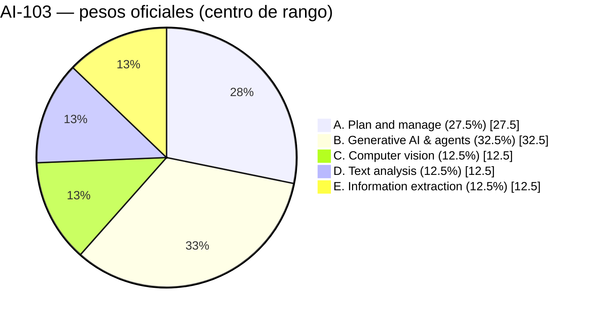
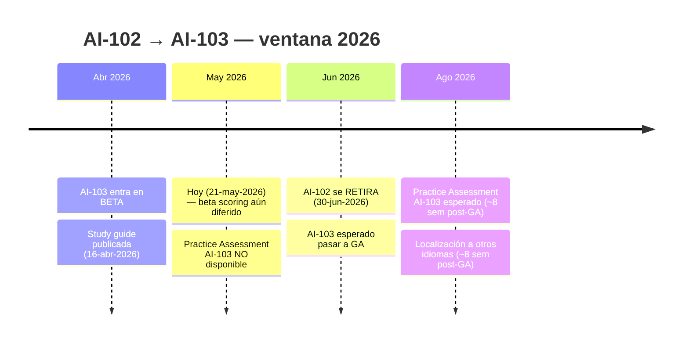
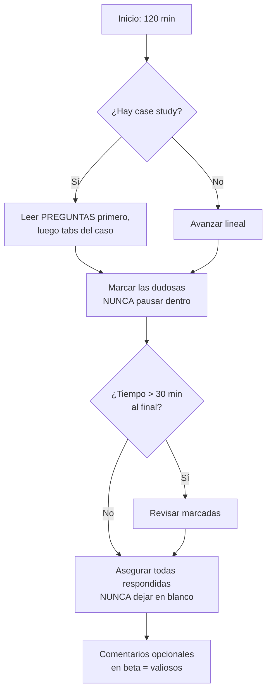

# Estrategia integral del examen AI-103

> [!abstract] TL;DR
> AI-103 ("Developing AI Apps and Agents on Azure") está en **beta** en mayo 2026: 120 min, ~40–60 preguntas, **passing score 700/1000 escalado**, **solo inglés** durante beta, **scoring diferido** (≈10 días tras GA → hasta 14 semanas desde tu intento). Sustituye a AI-102, que se **retira el 30-jun-2026** y todavía es **scored inmediato y multi-idioma**. Distribución oficial de peso: A 25–30 %, **B 30–35 %** (dominante), C/D/E 10–15 % cada uno. Mnemónico: **B > A > (C = D = E)**.

## 🎯 Relevancia en el examen

Archivo **meta**: ninguna pregunta del AI-103 te preguntará por su propio formato, pero **gestionar bien las 120 min** y entender el **scoring diferido** marca la diferencia entre aprobar o repetir con costes. Úsalo como **briefing del día 0** y **checklist del día anterior**.

## 📖 Concepto en profundidad

### Identidad del examen (mayo 2026)

| Campo                        | Valor verificado                                                                                                |
| ---------------------------- | --------------------------------------------------------------------------------------------------------------- |
| Código                       | **AI-103**                                                                                                      |
| Título oficial               | Developing AI Apps and Agents on Azure                                                                          |
| Certificación que otorga     | Microsoft Certified: **Azure AI Apps and Agents Developer Associate (beta)**                                    |
| Nivel                        | Intermediate (Associate)                                                                                        |
| Estado                       | **Beta** (study guide actualizada 16-abr-2026)                                                                  |
| Duración del examen          | **120 min** de exam time                                                                                        |
| Seat time típico             | ~140 min (incluye instrucciones, NDA, comentarios)                                                              |
| Nº preguntas (estimación MS) | 40–60 (Microsoft no publica el número exacto)                                                                   |
| Passing score                | **700/1000** (escalado — no equivale a 70 % de aciertos)                                                        |
| Pausa sin solicitud previa   | 5 min incluidos, pero el **reloj NO se detiene**                                                                |
| Idiomas (durante beta)       | **Solo English**                                                                                                |
| Idiomas previstos tras GA    | Otros idiomas se localizan **≈8 semanas** tras la actualización en inglés                                       |
| Provider                     | Pearson VUE (presencial o online OnVUE)                                                                         |
| Sandbox UI                   | <https://aka.ms/examdemo>                                                                                       |
| Práctica oficial             | ⚠️ **Practice Assessment AI-103 NO disponible aún** — suele publicarse hasta 8 semanas tras GA                  |

### Scoring diferido en beta — la trampa nº 1

Cuando terminas un examen **beta** NO recibes resultado al instante. Microsoft necesita los datos psicométricos de ≈400 candidatos antes de fijar el modelo de scoring. Línea temporal real:

1. Periodo beta abierto (3–4 semanas con cupos descontados al 80 %; resto a precio normal).
2. La beta termina y el examen pasa a **live** ("goes live").
3. **≈10 días** después de live recibes tu resultado.
4. Desde que **TÚ** tomas el examen hasta tu resultado pueden pasar **hasta 14 semanas** según en qué momento del beta entraste.
5. Si pasa la beta cuenta para la certificación; **NO necesitas repetir** la versión live.

### Retake policy — distinta para beta vs live

| Escenario                       | Regla                                                                                          |
| ------------------------------- | ---------------------------------------------------------------------------------------------- |
| Beta — todos                    | Solo **una toma** durante la ventana beta                                                      |
| Beta suspendida → live          | Esperar a que el examen sea live; aplica política normal                                       |
| Live — 1er fail                 | **24 h** de espera                                                                             |
| Live — 2º a 5º fail             | **14 días** entre cada intento                                                                 |
| Live — límite anual             | **5 intentos** en 12 meses desde el 1er intento                                                |
| Live — ya aprobado              | No puedes repetir salvo que expire la certificación                                            |

### Tipos de pregunta (verificados en sandbox)

| Tipo                  | Mecánica                                                                                              | Riesgo / consejo                                                                  |
| --------------------- | ----------------------------------------------------------------------------------------------------- | --------------------------------------------------------------------------------- |
| **Multiple choice**   | 1 correcta entre 4                                                                                    | La rápida; no la sobre-pienses                                                    |
| **Multiple response** | "Select all that apply" o "Select 2"                                                                  | Sin parcial salvo que el enunciado lo diga                                        |
| **Case study**        | Escenario largo + 4–7 preguntas vinculadas; tabs con requisitos, infra, código                        | **Lee las preguntas PRIMERO**, luego escanea el caso                              |
| **Drag and drop**     | Ordenar elementos en zonas o emparejar                                                                | Suele evaluar pasos de despliegue / arquitectura                                  |
| **Sequence/ordering** | Build list: pasos en orden correcto                                                                   | Memoriza secuencias canónicas (deploy de RAG, registro de agentes, etc.)          |
| **Hot area**          | Click en zonas de captura o tabla                                                                     | Examina UI Foundry portal / az CLI flags                                          |
| **Build list**        | Construir lista a partir de un pool                                                                   | Igual que sequence pero sin exigir orden                                          |
| **Active screen**     | Interactuar con UI simulada (configurar campos)                                                       | Valida portal Foundry / Azure portal                                              |
| **Labs** (posible)    | Tarea real en Azure (rara en AI-103, posible)                                                         | Si hay labs → seat time sube a ~140 min                                           |

> [!warning] Tras una pausa NO puedes volver a las preguntas ya vistas, ni siquiera dentro de un case study. Marca y resuelve **antes** de pausar.

### Precio y descuentos

- Precio base: depende del país (Pearson VUE muestra el de tu región al agendar).
- **Cupón beta 80 % off**: Microsoft publica un código en el [Microsoft Learn Blog](https://aka.ms/learningblog) al abrir la beta; first-come, first-served. Si lo usaste y **realmente diste el examen** recibes además un voucher del 25 % off para tu próximo examen ~2 semanas después del live.
- **Exam Replay**: bundle de pago que incluye una repetición en caso de fail. Compatible con AI-103 (link en la propia página de certificación).
- **No elegibles para descuento beta**: residentes en China, India, Pakistán o Türkiye.

### Accommodations (ajustes)

| Tipo                            | Ejemplos                                                                              |
| ------------------------------- | ------------------------------------------------------------------------------------- |
| Additional time                 | +30 min si tu idioma materno no está disponible (durante beta esto es **todo el que no hable inglés nativo**) — vía **ESL form** de Pearson VUE |
| Assistive technology            | Screen readers, ZoomText, Dragon                                                      |
| Another person                  | Reader, scribe, PCA                                                                   |
| Sensory                         | Headphones no-Bluetooth, lectura en voz alta, snacks                                  |
| Tiempo de aprobación            | Hasta **10 días hábiles**; debe pedirse **antes** de agendar                          |

> [!tip] El formulario **English as a Second Language (ESL)** es el camino oficial para los +30 min si el examen no está en tu idioma — y en beta AI-103 **solo existe en inglés**, así que cualquier no-anglófono nativo aplica.

### Distribución de peso por dominio (AI-103)

| Dominio                                        | Peso oficial | Centro | Énfasis Foundry                                          |
| ---------------------------------------------- | ------------ | ------ | -------------------------------------------------------- |
| **A** — Plan and manage an Azure AI solution   | **25–30 %**  | 27.5 % | Foundry resource model, RBAC, redes, monitoring          |
| **B** — Implement generative AI and agentic    | **30–35 %**  | 32.5 % | RAG, agents, multi-agent, eval, Foundry SDK              |
| **C** — Implement computer vision              | **10–15 %**  | 12.5 % | Image/video gen, Content Understanding multimodal        |
| **D** — Implement text analysis                | **10–15 %**  | 12.5 % | LLM-based extraction, Translator, Speech                 |
| **E** — Implement information extraction       | **10–15 %**  | 12.5 % | RAG ingestion, Search, Document Intelligence, OCR        |

### Línea temporal de hitos

### Estrategia de time management

| Heurística                        | Regla                                                                                |
| --------------------------------- | ------------------------------------------------------------------------------------ |
| Tiempo medio por pregunta         | **120 min / ~55 preg ≈ 2 min/pregunta**                                              |
| Buffer para case studies          | Asignar **~5–8 min** al primer case + ~3 min cada pregunta extra del mismo caso      |
| Buffer de revisión final          | Reservar **~10–15 min** para preguntas marcadas                                      |
| Pausas                            | **Evitar** si el reloj sigue corriendo; usar solo en emergencia                      |
| Microsoft Learn dentro del examen | Disponible para AI-103 (role-based), **NO añade tiempo** — úsalo quirúrgicamente     |
| Sin penalización por adivinar     | **Nunca dejes una pregunta en blanco**                                               |

## 🏗️ Cómo se hace (proceso de inscripción)

> Este archivo es meta — sin SDK code. Operativa de inscripción:

1. **Crear MSA personal** (no AAD del trabajo: si dejas la empresa pierdes los registros).
2. Visitar la [página de la certificación](https://learn.microsoft.com/credentials/certifications/azure-ai-apps-and-agents-developer-associate/).
3. (Opcional) Solicitar accommodations vía Pearson VUE **antes** de agendar.
4. (Opcional) Si vas a por descuento beta: monitorizar el [Microsoft Learn Blog](https://aka.ms/learningblog) y, si calificas, unirte a la [SME Profile database](https://www.linkedin.com/groups/13561088/).
5. Click **Schedule exam** → Pearson VUE → elegir presencial u OnVUE (online proctored).
6. Practicar UI en [aka.ms/examdemo](https://aka.ms/examdemo).
7. (Beta) Esperar resultado tras "goes live" — no contactar a soporte hasta **2 semanas tras live** sin score visible.

## 📊 AI-102 vs AI-103 (comparativa ejecutiva)

⚠️ **AI-102 carryover**: AI-103 hereda dominios y muchos conceptos, pero el examen es nuevo, en beta y con énfasis explícito en **Foundry** y **agents**.

| Aspecto                            | AI-102 (legacy)                                                                              | **AI-103 (actual, beta)**                                                |
| ---------------------------------- | -------------------------------------------------------------------------------------------- | ------------------------------------------------------------------------ |
| Estado                             | GA — **se retira 30-jun-2026** ⚠️                                                            | **Beta** desde abril 2026                                                |
| Duración                           | 100 min                                                                                      | **120 min**                                                              |
| Idiomas                            | EN, JP, ZH-CN, KR, DE, FR, ES, PT-BR, ZH-TW, IT                                              | **Solo EN durante beta**                                                 |
| Scoring                            | **Inmediato** (~24 h en perfil)                                                              | **Diferido** hasta ~14 semanas                                           |
| Passing score                      | 700/1000                                                                                     | 700/1000                                                                 |
| Practice Assessment                | Disponible                                                                                   | ⚠️ **NO disponible aún**                                                 |
| Renewal                            | Cada 12 meses (gratis en Learn)                                                              | Idem                                                                     |
| Énfasis temático                   | Cognitive Services + Azure OpenAI                                                            | **Microsoft Foundry**, agents, Foundry Tools                             |
| Languages SDK destacado            | Python + C#                                                                                  | **Python only** (oficial)                                                |
| ¿Cuál tomar hoy (mayo 2026)?       | Si necesitas badge YA y scoring inmediato                                                    | Si vas largo plazo y aceptas scoring diferido                            |

> [!info] La certificación **Azure AI Engineer Associate** (vía AI-102) y **Azure AI Apps and Agents Developer Associate** (vía AI-103) son **distintas credenciales**. AI-103 NO renueva automáticamente AI-102.

## 🪤 Trampas del examen

1. **Beta = scoring diferido.** Sales del centro sin saber si pasaste. Muchos creen que han fallado y agendan retake (no permitido en beta) o piden refund. **Espera ≈10 días tras "goes live" + hasta 14 semanas desde tu fecha.**
2. **AI-102 sigue vigente hasta 30-jun-2026.** Si necesitas la credencial **ya**, AI-102 es la vía con scoring inmediato y multi-idioma. ⚠️ Hora exacta de retiro no publicada por Microsoft — planifica el examen al menos 24 h antes del 30-jun-2026 para evitar sorpresas.
3. **Foundry renombró roles RBAC.** "Azure AI Developer" / "Azure AI User" (modelo antiguo hub-based) ↔ "Foundry Developer" / "Foundry User" (modelo Foundry resource). En las preguntas, lenguaje como *"Foundry resource"* o *"Foundry project"* delata el modelo nuevo; *"hub"* o *"Azure AI hub"* el legacy. Cf. [[00-foundry-vs-azure-ai-foundry-nomenclature]].
4. **Case studies son carísimos en tiempo.** Si entras "de frente" leyendo todo el caso antes de las preguntas, gastas 8–10 min antes de la primera respuesta. **Lee las preguntas primero**, salta a las pestañas relevantes.
5. **Pausa = punto de no retorno.** Una vez pulsas "Start Break", **NO** puedes volver a las preguntas ya vistas. El reloj sigue corriendo. Solo pausa si es absolutamente necesario.
6. **Sin penalización por adivinar.** Nunca dejes en blanco. En "select 2", si solo conoces 1 con certeza, escoge la 2ª que mejor encaje — punto parcial por componente correcto.
7. **Microsoft Learn integrado NO añade tiempo.** Es útil para 1–2 lookups quirúrgicos (nombre exacto de un rol, sintaxis CLI). Si lo usas en 10 preguntas, te quedarás sin tiempo.
8. **Practice Assessment AI-103 no existe aún (mayo 2026)** — el primer "syllabus" fiable es la **study guide oficial** + el examen sandbox. Cuidado con simuladores third-party que aún están adaptados a AI-102.

## 🧠 Mnemotecnia

> **"B > A > (C = D = E)"** — distribución de peso AI-103.
>
> **B**eat **A**zure **C**loud's **D**ifficulty **E**xam.
> Donde el primer dígito (B) es la "joya de la corona" (generative + agents 30–35 %) y A le sigue (planificar/gestionar 25–30 %).

> **"120 / 700 / 1 / 8"** — los cuatro números del examen:
> **120** min · **700** passing · **1** idioma (en beta) · **8** semanas tras GA hasta localización y Practice Assessment.

> **"PIP-CT-IE"** — orden de dominios (A→E):
> **P**lan, **I**mplement gen-AI + agents, **P**icture (vision), **CT** (Conversational/Text), **IE** (Information Extraction).

## 🗓️ Checklist del día anterior

- [ ] MSA personal verificada y vinculada a Learn profile.
- [ ] Confirmación de Pearson VUE recibida; webcam + micro probados si es OnVUE.
- [ ] Documento de identidad oficial a mano (idéntico al nombre del registro).
- [ ] Escritorio despejado: sin papeles, monitores extra desconectados, móvil fuera de la habitación.
- [ ] Sandbox revisado al menos una vez (UI de pausas, marca, Microsoft Learn integrado).
- [ ] Estrategia de tiempo definida: **2 min/pregunta**, **5 min/case study leyendo preguntas**, buffer final 10–15 min.
- [ ] Hidratación + baño antes de empezar (pausa = reloj sigue).
- [ ] **No** estudiar nada nuevo: revisión de mnemónicos y trampas, no contenido fresco.

## 🔗 Conceptos relacionados

- [[INDICE-MAESTRO]] — índice de todos los apuntes AI-103.
- [[00-microsoft-foundry-overview]] — qué es Foundry y por qué pesa tanto en el examen.
- [[00-foundry-vs-azure-ai-foundry-nomenclature]] — distinción Foundry resource vs hub-based crítica para preguntas.
- [[00-foundry-tools-catalog]] — catálogo de Foundry Tools, base del dominio B.

## ❓ Autotest

**1. Acabas de salir del examen AI-103 en mayo 2026 y no ves ninguna puntuación en tu Learn profile. ¿Qué haces?**

Ver respuesta

**Espera.** AI-103 está en **beta**, así que el scoring está diferido. El resultado llega ≈10 días **después** de que el examen pase a GA ("goes live") — pueden ser hasta 14 semanas desde tu fecha. Solo contacta a Credentials Support si han pasado **≥2 semanas tras live** sin score.

**2. ¿Qué porcentaje pesa el dominio "Implement generative AI and agentic solutions" en AI-103?**

A) 10–15 %
B) 25–30 %
C) **30–35 %**
D) 40–50 %

Ver respuesta

**C) 30–35 %** — es el dominio más pesado (B), por encima de "Plan and manage" (25–30 %). Mnemónico: **B > A > (C = D = E)**.

**3. Vas a tomar AI-103 y tu lengua materna es español. ¿Qué accommodation aplica?**

Ver respuesta

El formulario **English as a Second Language (ESL)** de Pearson VUE para +30 min adicionales. Durante la beta el examen está **solo en inglés**, así que cualquier candidato cuya lengua materna no sea inglés califica. Debe solicitarse **antes** de agendar (hasta 10 días hábiles de aprobación).

**4. Suspendes el AI-103 en beta. ¿Cuándo puedes repetir?**

A) 24 horas después
B) 14 días después
C) **Cuando el examen pase a live (goes live)**
D) Nunca, debes tomar otro código

Ver respuesta

**C)** La política beta supersede la general: solo **una toma** durante la ventana beta. Si suspendes, debes esperar a que el examen pase a live, y entonces aplica la política normal (24 h tras el 1er fail live, 14 días en subsiguientes).

**5. En medio de un case study, llevas 4 preguntas vistas y 2 marcadas para revisar. Decides pausar. ¿Qué pierdes?**

Ver respuesta

**Pierdes el acceso a las 4 preguntas vistas (incluidas las 2 marcadas) y el reloj sigue corriendo durante la pausa.** Las pausas dentro de case studies son permitidas pero no puedes regresar a preguntas previas, ni siquiera marcadas. Regla operativa: **nunca pauses dentro de un case study** salvo emergencia.

## ✅ Control de calidad (auto-rúbrica)

| Dimensión           | Nota | Comentario                                                                              |
| ------------------- | ---- | --------------------------------------------------------------------------------------- |
| Completitud         | 9.5  | Cubre los 13 sub-puntos del brief + mermaid extras + checklist día anterior             |
| Exactitud técnica   | 9.5  | Verificado contra 7 URLs oficiales de Microsoft Learn (16-abr-2026 + 21-may-2026)       |
| Alineación examen   | 9    | Foca en time management, trampas concretas (beta scoring, pausas, case studies, ESL)    |
| Claridad pedagógica | 9    | Mnemónicos (B>A>CDE, 120/700/1/8, PIP-CT-IE), tablas, autotest con 5 preguntas          |

⚠️ **Marcas explícitas**: (a) Hora exacta de retiro de AI-102 el 30-jun-2026 **no publicada por Microsoft** (el brief mencionaba 23:59 CST — no he encontrado esa hora oficial en learn.microsoft.com; planifica antes del 30-jun por seguridad). (b) Número exacto de preguntas AI-103 no publicado; estimación 40–60 basada en patrón role-based estándar.

*Verificado a fecha 2026-05-21 contra Microsoft Learn (study guide AI-103 actualizada 16-abr-2026).*
