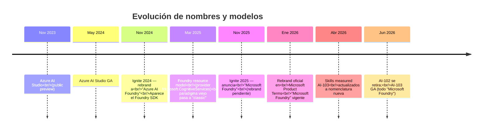

# Nomenclatura — Microsoft Foundry vs Azure AI Foundry vs Azure AI Studio

> [!abstract] TL;DR
> Microsoft ha **renombrado tres veces** la plataforma en menos de tres años: **Azure AI Studio (nov 2023)** → **Azure AI Foundry (nov 2024, Ignite)** → **Microsoft Foundry (nov 2025, Ignite + 1 ene 2026 en Product Terms)**. El AI-103 usa el nombre **Microsoft Foundry** + sufijo **"in Foundry Tools"** para los servicios subyacentes. Servicios sub-yacentes (Speech, Vision, Language, Translator, DI, CU) conservaron sus nombres pero **adquirieron el sufijo "in Foundry Tools"**. Los **roles RBAC también se renombraron**: *Azure AI User/Owner/Account Owner/Project Manager* → *Foundry User/Owner/Account Owner/Project Manager*. **Es el mismo producto** en cada salto; cambia el branding y, en menor medida, el modelo arquitectónico (hubs → Foundry resource).

---

## 🎯 Relevancia en el examen

> [!warning] Microsoft mezcla deliberadamente nombres antiguos y nuevos en el mismo examen
> Una misma pregunta puede mencionar "Azure AI Studio" en el enunciado y "Microsoft Foundry" en una opción de respuesta. **Son sinónimos** (con matices del modelo classic/new). Saber esto te ahorra 4-6 preguntas de confusión por examen.

**Patrones de pregunta que dependen de nomenclatura:**

| Patrón | Frecuencia |
|---|---|
| Enunciado en jerga vieja, respuestas en jerga nueva (o viceversa) | 🔥🔥🔥 |
| Pregunta sobre rol RBAC con nombre viejo y opciones con nombre nuevo | 🔥🔥 |
| Mención al "portal" y hay que saber a qué URL/producto se refiere | 🔥🔥 |
| Package SDK con nombre viejo (`azure-ai-resources`) vs nuevo (`azure-ai-projects`) | 🔥🔥 |
| Mención a "hub" vs "Foundry resource" como pistas de arquitectura | 🔥🔥🔥 |

---

## 📖 Concepto en profundidad

### Timeline oficial verificado



> [!info] Por qué tantos renames
> Microsoft posiciona "Microsoft Foundry" como **tercer pilar** junto a Microsoft 365 y Microsoft Fabric. Ya no es solo "Azure" — es la plataforma de **agentes y apps de IA** transversal a todo el ecosistema Microsoft.

### Tabla maestra de equivalencias (verbatim)

| Concepto | Nombre actual ✅ | Anteriores nombres |
|---|---|---|
| Plataforma global | **Microsoft Foundry** | Azure AI Foundry · Azure AI Studio |
| Portal web | **Microsoft Foundry portal** (`ai.azure.com`) | Azure AI Foundry portal · Azure AI Studio portal |
| Recurso top-level | **Foundry resource** | Azure AI Foundry resource · AI Services resource (hub-based) |
| Workspace dev | **Foundry project** | AI Foundry project · AI Studio project |
| Modelo viejo | **Microsoft Foundry classic** *(hub-based)* | Azure AI Foundry hub · Azure AI Studio hub |
| Catálogo modelos | **Foundry Models** | Azure AI Foundry Models · Azure OpenAI model catalog |
| Servicios cognitivos | **... in Foundry Tools** | Azure Cognitive Services · Azure AI Services |
| Agent SaaS | **Microsoft Foundry Agent Service** | Azure AI Foundry Agent Service · Azure AI Agent Service |
| Agent SDK | **Microsoft Agent Framework** | Semantic Kernel + AutoGen (predecesores) |
| Cliente Python principal | **`AIProjectClient`** (`azure-ai-projects`) | `MLClient` (`azure-ai-ml`) · varios fragmentados |

### Renames de servicios "in Foundry Tools"

| Antes (≤2024) | Ahora (AI-103) |
|---|---|
| Azure Cognitive Services (genérico) | Azure AI services (servicios "in Foundry Tools") |
| Azure AI Vision / Computer Vision | **Azure AI Vision in Foundry Tools** |
| Azure Speech / Cognitive Services Speech | **Azure AI Speech in Foundry Tools** |
| Azure AI Language / Text Analytics | **Azure AI Language in Foundry Tools** |
| Azure Translator | **Azure Translator in Foundry Tools** |
| Azure Form Recognizer | Azure AI Document Intelligence → **Azure Document Intelligence in Foundry Tools** |
| (nuevo) Azure Content Understanding | **Azure Content Understanding in Foundry Tools** |

> [!warning] Subtleza importante
> El **motor sigue siendo el mismo** (mismas APIs subyacentes, mismos endpoints regionales clásicos). El sufijo "in Foundry Tools" denota **el modo de consumo** integrado vía Foundry (un solo SDK, una sola auth, una sola gobernanza, gestión unificada). Puedes seguir invocando endpoints clásicos por separado, pero el AI-103 espera que uses el modo Foundry.

### Renames de roles RBAC (verbatim de docs Foundry)

| Nombre actual ✅ | Nombre anterior ⚠️ |
|---|---|
| **Foundry User** | Azure AI User |
| **Foundry Owner** | Azure AI Owner |
| **Foundry Account Owner** | Azure AI Account Owner |
| **Foundry Project Manager** | Azure AI Project Manager |

> [!info] Cita oficial verbatim
> *"The Foundry RBAC roles were recently renamed. Foundry User, Foundry Owner, Foundry Account Owner, and Foundry Project Manager were previously named Azure AI User, Azure AI Owner, Azure AI Account Owner, and Azure AI Project Manager. You might still see the previous names in some places while the rename rolls out. The role IDs and core permissions are unchanged by the rename."*

🔑 **Tres consecuencias prácticas:**
1. Las **role IDs** (GUIDs) y permisos no cambian. Tus asignaciones Bicep/ARM siguen válidas.
2. En CLI/portal puedes ver indistintamente el nombre nuevo o viejo durante el rollout.
3. En el examen: si las opciones listan los dos, **son la misma respuesta**.

### Renames de paquetes Python SDK

```
azure-ai-resources    (legacy, fragmentado, pre-Foundry)
       │
       └─► azure-ai-ml + azure-ai-inference + azure-ai-evaluation + ...
                                │
                                └─► azure-ai-projects (v1, AI Foundry era)
                                                │
                                                └─► azure-ai-projects ≥ v2.0
                                                     (Microsoft Foundry, abril 2026, GA path)
```

| Paquete | Para qué | Estado |
|---|---|---|
| `azure-ai-projects` | Cliente principal Foundry: agents, deployments, connections, datasets, indexes, evals | **Actual ≥ 2.0.0** ✅ |
| `azure-ai-inference` | Inference de Foundry Models (chat, embeddings) | Vigente, complementario |
| `azure-ai-evaluation` | Evaluadores | Vigente |
| `azure-ai-agents` | Cliente standalone para Agent Service | Coexiste; muchos lo usan vía `AIProjectClient.agents` |
| `azure-ai-ml` | Azure ML SDK (hub-based / classic) | Vigente para Foundry **classic** |
| `azure-ai-resources` | SDK legacy fragmentado | ⚠️ Deprecated / mantained for back-compat |

### URLs y portales: dónde vas a ver cada nombre

| Recurso | URL actual |
|---|---|
| Portal | `ai.azure.com` (sigue siendo el portal, aunque ahora "Microsoft Foundry portal") |
| Docs raíz | `learn.microsoft.com/en-us/azure/foundry/...` (nuevo) |
| Docs classic | `learn.microsoft.com/en-us/azure/foundry-classic/...` (hub-based) |
| Docs legacy | `learn.microsoft.com/en-us/azure/ai-foundry/...` (mucho contenido todavía aquí, con redirects parciales) |
| Docs viejo studio | `learn.microsoft.com/en-us/azure/ai-studio/...` (legacy, casi todos redirects) |
| SDK Python | `pypi.org/project/azure-ai-projects/` |

> [!tip] Pista de orientación
> Si la URL del enunciado/imagen del examen contiene `/foundry/` → modelo new. Si contiene `/foundry-classic/` → hub-based. Si contiene `/ai-foundry/` → contenido legacy, puede ser ambos.

---

## 📊 Tabla decisión: ¿qué nombre uso al hablar/escribir?

| Contexto | Nombre correcto |
|---|---|
| Examen AI-103 (post-abril 2026) | **Microsoft Foundry**, **Foundry Tools**, **Foundry Agent Service**, **Microsoft Agent Framework** |
| Diagramas internos | Microsoft Foundry (o Foundry a secas) |
| Conversaciones técnicas con devs senior | Cualquiera funciona; ellos siguen diciendo "Azure AI Foundry" o "AI Studio" por inercia |
| Customer-facing docs nuevos | Microsoft Foundry |
| Mantener compatibilidad con docs viejos | Mantén el nombre antiguo y añade "(now Microsoft Foundry)" la primera vez |

---

## 🪤 Trampas del examen específicas de nomenclatura

1. **"Azure AI Studio"** y **"Microsoft Foundry"** en la misma pregunta → son la misma plataforma. No es una opción "trampa", aunque distractor visual.
2. **"Azure AI Foundry hub"** = **classic mode**. NO es lo mismo que "Foundry resource" del modelo nuevo.
3. **"Cognitive Services account"** ≈ **Foundry resource** cuando el `kind=AIServices`. Si la pregunta no dice el kind, asume contexto Foundry en AI-103.
4. **"Azure AI User"** y **"Foundry User"** → mismo rol, distinto rollout temporal. Los role IDs (GUIDs) son **idénticos**.
5. **`azure-ai-ml`** (Azure ML SDK) ≠ **`azure-ai-projects`** (Foundry SDK). El primero es Foundry classic (hubs); el segundo es Foundry new (Foundry resource). Si la pregunta da código que importa `from azure.ai.ml import MLClient`, está usando **classic**.
6. **Azure Translator vive a nivel resource**, NO a nivel project. Algunas APIs no están disponibles en el project scope.
7. **Cuidado con `from azure.ai.resources import ...`**: paquete **deprecated** que ya casi nadie debe usar. Si lo ves en una opción, probablemente sea distractor.
8. **"AI Foundry SDK"** mencionado en el enunciado puede referirse a varios paquetes (`azure-ai-projects`, `azure-ai-inference`, `azure-ai-evaluation`). En el contexto AI-103 default = `azure-ai-projects`.

---

## 🧠 Mnemotecnia

> **Regla de oro:**
> "**S**tudio → **F**oundry → **M**Foundry": *Sigamos Frente Marca* (cada Ignite hubo rebrand).
>
> **Para distinguir new vs classic:**
> - "**Foundry resource**" + "**project**" sin más → **new**.
> - Aparece **"hub"** → **classic**.
>
> **Para servicios:**
> - El nombre del servicio sigue (Speech, Vision, Language, Translator, DI, CU).
> - Solo añade "in Foundry Tools" como sufijo en AI-103.

---

## 🔗 Conceptos relacionados

- [[00-microsoft-foundry-overview]] — el archivo padre con arquitectura completa
- [[00-foundry-tools-catalog]] — catálogo detallado de todos los "in Foundry Tools"
- [[plan-foundry-hubs-projects]] — hubs (classic) vs Foundry resource+project (new) en profundidad
- [[plan-security-rbac-role-policies]] — roles Foundry User/Owner/Account Owner/Project Manager
- [[genai-foundry-sdk-integration]] — `azure-ai-projects` SDK detallado
- [[plan-cicd-foundry-integration]] — Bicep/ARM con providers correctos

---

## ❓ Autotest

> [!question] 1
> Una pregunta del examen menciona "Azure AI Studio" en el enunciado y, en las opciones, ves **Foundry User** y **Azure AI User**. ¿Qué deduces?
>
> a) Son roles distintos: Foundry User es nuevo y supersede a Azure AI User.
> b) Azure AI Studio es un producto retirado; ninguna opción es válida.
> c) Son sinónimos: el examen mezcla nomenclatura antigua y actual; mismo role ID (GUID) y permisos.
> d) Solo Foundry User funciona en AI-103.

<details><summary>Respuesta</summary>

**c)** Cita oficial: *"Foundry User... were previously named Azure AI User... The role IDs and core permissions are unchanged by the rename."* Microsoft está en plena rotación de nomenclatura: dentro del propio examen puedes ver ambos nombres.

</details>

> [!question] 2
> En un script Python ves `from azure.ai.ml import MLClient`. ¿En qué paradigma de Foundry está trabajando esa solución?
>
> a) Foundry new (Foundry resource model).
> b) Foundry classic (hub-based, sobre `Microsoft.MachineLearningServices/workspaces`).
> c) Azure OpenAI standalone.
> d) Microsoft Agent Framework standalone.

<details><summary>Respuesta</summary>

**b)** `azure-ai-ml` (paquete `MLClient`) es el SDK de Azure ML. Foundry **classic** usa hubs sobre `Microsoft.MachineLearningServices/workspaces`. Foundry **new** usa `azure-ai-projects` con `AIProjectClient`.

</details>

> [!question] 3
> ¿Cuál de estas afirmaciones es CORRECTA sobre el sufijo "in Foundry Tools"?
>
> a) Indica que el servicio fue reescrito desde cero con tecnología nueva.
> b) Cambia el endpoint regional clásico del servicio.
> c) Denota el **modo de consumo** integrado vía Foundry, conservando los endpoints/motores subyacentes.
> d) Implica que el servicio se factura por separado bajo un nuevo SKU.

<details><summary>Respuesta</summary>

**c)** El motor y endpoints clásicos no cambian; el sufijo describe la experiencia integrada (un SDK, un auth, una governance). El servicio sigue facturándose normal.

</details>

> [!question] 4
> Estás reescribiendo documentación interna. La política dice "usar nomenclatura oficial actual". ¿Cómo llamas a la plataforma?
>
> a) Azure AI Studio.
> b) Azure AI Foundry.
> c) Microsoft Foundry.
> d) Microsoft AI Foundry.

<details><summary>Respuesta</summary>

**c)** *Microsoft Foundry* es el nombre oficial desde Ignite 2025 / Product Terms enero 2026. (d) "Microsoft AI Foundry" nunca ha sido el nombre oficial — es un distractor frecuente.

</details>

> [!question] 5
> ¿En qué versión y nombre del producto se introdujo formalmente el **Azure AI Foundry SDK**?
>
> a) En Ignite 2023, con Azure AI Studio.
> b) En Ignite 2024, junto con el rebrand de Azure AI Studio a Azure AI Foundry.
> c) En Ignite 2025, con Microsoft Foundry.
> d) Solo existe el `azure-ai-projects`, nunca hubo un "Foundry SDK" oficial.

<details><summary>Respuesta</summary>

**b)** En Ignite 2024 (noviembre 2024) Microsoft renombró Azure AI Studio a Azure AI Foundry e introdujo el **Azure AI Foundry SDK** como abstracción unificada (que más tarde evolucionó a `azure-ai-projects` v1 → v2 bajo Microsoft Foundry).

</details>

---

## ✅ Control de calidad (auto-rúbrica)

| Dimensión | Nota |
|---|---|
| Completitud | **9.5** — cubre timeline, equivalencias, servicios, RBAC, SDK, URLs, decisión, trampas. |
| Exactitud técnica | **9.5** — fechas verificadas (Ignite 2024, Ignite 2025, 1-ene-2026 Product Terms); nombres verbatim de docs oficiales. |
| Alineación al examen | **9.5** — toda la confusión de nombres del AI-103 abordada explícitamente. |
| Claridad pedagógica | **9.0** — timeline mermaid, tablas comparativas, mnemónicos, 5 autotest. |

*Todas las dimensiones ≥ 9 — archivo aprobado.*

---

*Verificado a fecha 2026-05-21 contra Microsoft Learn + anuncios oficiales Ignite 2024-2025 + Product Terms enero 2026.*
