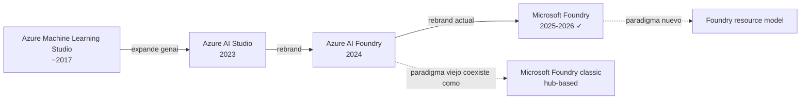
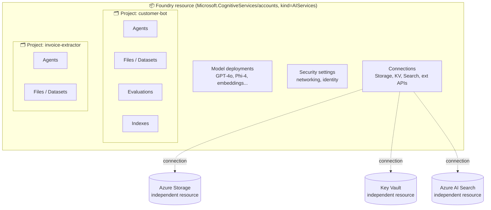
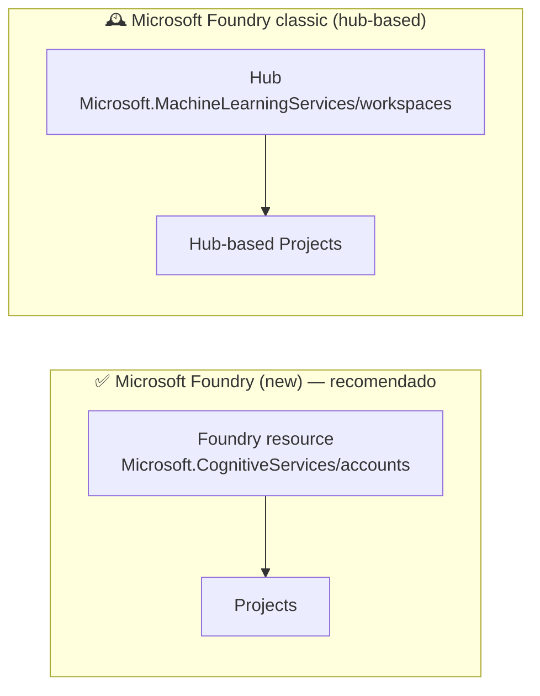
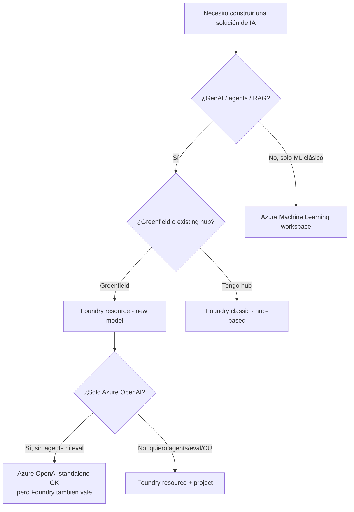

# Microsoft Foundry — visión general arquitectónica

> [!abstract] TL;DR
> **Microsoft Foundry** es la plataforma unificada de Azure para construir, evaluar, desplegar y monitorizar **apps de IA generativa y agentes**. Su unidad lógica es el **Foundry resource** (`Microsoft.CognitiveServices/accounts`, kind `AIServices`) que actúa como contenedor de governance; dentro vive uno o más **projects**, cada uno con sus deployments, agents, files, datasets, indexes, evaluations y connections. El examen AI-103 lo trata como el sistema operativo sobre el que corre todo lo demás.
> Anteriormente se llamó **Azure AI Foundry** (que a su vez fue **Azure AI Studio**, antes **Azure Machine Learning Studio** para la parte de ML). El AI-103 usa la nomenclatura nueva ("Microsoft Foundry" + sufijo "in Foundry Tools" para los servicios sub-yacentes).

---

## 🎯 Relevancia en el examen

Foundry es **transversal**: aparece literal en cada dominio del AI-103 (el study guide menciona "Foundry" en 5 de 5 dominios y >40 veces en total).

| Cómo te examinan Foundry | Frecuencia |
|---|---|
| "¿Qué *Foundry service* eliges para X?" (decisión de arquitectura) | 🔥🔥🔥 |
| "¿En qué nivel (resource vs project) se administra Y?" (governance) | 🔥🔥 |
| "¿*Hub*-based project (classic) o *Foundry resource* (new) para este escenario?" | 🔥🔥 |
| "¿`Microsoft.CognitiveServices/accounts` o `Microsoft.MachineLearningServices/workspaces`?" | 🔥 |
| "Cliente SDK: `AIProjectClient` ¿cómo se autentica y conecta?" | 🔥🔥🔥 |
| Diferencia entre **Foundry Agent Service** y **Microsoft Agent Framework** | 🔥🔥🔥 |
| "*Foundry Tools* — ¿qué es y qué incluye?" | 🔥🔥 |

> [!warning] Trampa nº 1 de toda la AI-103
> Microsoft está en proceso de migrar nomenclatura. En el examen verás indistintamente "Azure AI Foundry", "Microsoft Foundry" y "Foundry". **Son lo mismo**. Los roles RBAC se renombraron: *Azure AI User/Owner/...* → *Foundry User/Owner/...*. Si la pregunta menciona ambos, asume sinónimos.

---

## 📖 Concepto en profundidad

### 1. Qué es Microsoft Foundry (definición operativa)

Microsoft Foundry consolida en una sola plataforma:

1. **Catálogo de modelos** (Foundry Models): Azure OpenAI, modelos de Microsoft (Phi, Florence), open-source curados (Llama, Mistral, DeepSeek) y modelos partner.
2. **Workspace de desarrollo**: project, files, datasets, indexes, prompts, evaluations.
3. **Servicios subyacentes "in Foundry Tools"**: Azure AI Vision, Speech, Language, Translator, Document Intelligence, Content Understanding — todos accesibles bajo el paraguas Foundry.
4. **Agentes gestionados**: Microsoft Foundry Agent Service (managed runtime para agents).
5. **Evaluación**: built-in evaluators (relevance, coherence, fluency, groundedness, similarity, safety) + custom evaluators.
6. **Observabilidad**: tracing OpenTelemetry, integración Application Insights, métricas en Azure Monitor.
7. **Content safety**: guardrails integrados en el pipeline de inferencia.

### 2. Historia de nomenclatura (memorizar este árbol)



> [!info] Reglas mnemotécnicas
> - **"Microsoft Foundry"** = nombre actual oficial (lo que dice el AI-103).
> - **"Azure AI Foundry"** = nombre previo, aún vigente en URLs y muchas docs.
> - **"... in Foundry Tools"** = sufijo para indicar que un servicio Azure clásico (Speech, Vision, Language…) se consume **a través de la experiencia Foundry**. Es el mismo motor, distinto wrapper.

### 3. Arquitectura jerárquica (modelo nuevo)

> [!note] Verificado verbatim
> Texto oficial: *"Microsoft Foundry organizes AI workloads through a layered architecture: a top-level Foundry resource for governance, projects for development isolation, and connected Azure services for storage, search, and secrets management."*



| Capa | Tipo de recurso | Lo que vive aquí | Quién lo gestiona |
|---|---|---|---|
| **Foundry resource** | `Microsoft.CognitiveServices/accounts` (kind `AIServices`) | Model deployments, security, connections, governance | IT central |
| **Project** | `Microsoft.CognitiveServices/accounts/projects` (subresource) | Files, agents, evaluations, indexes, datasets | Equipos de desarrollo |
| **Connected resources** | Recursos Azure **independientes** (Storage, KV, Search, …) | Sus propios datos | Sus propios owners |

> [!warning] Frontera de governance
> Connected resources (Storage, Key Vault, Search) **no heredan** la governance del Foundry resource. Cada uno mantiene su RBAC, networking y compliance **separadamente**. Esto es trampa clásica de examen.

### 4. Resource providers y kinds (memorizar tabla)

| Resource type oficial | Provider + type ARM | Kind |
|---|---|---|
| **Microsoft Foundry** | `Microsoft.CognitiveServices/accounts` | `AIServices` |
| **Foundry project** | `Microsoft.CognitiveServices/accounts/projects` | `AIServices` *(subresource)* |
| **Azure Speech in Foundry Tools** | `Microsoft.CognitiveServices/accounts` | `Speech` |
| **Azure Language in Foundry Tools** | `Microsoft.CognitiveServices/accounts` | `Language` |
| **Azure Vision in Foundry Tools** | `Microsoft.CognitiveServices/accounts` | `Vision` |
| **Azure AI Search** | `Microsoft.Search/searchServices` | — |

> [!info] Por qué importa
> Como **comparten provider** `Microsoft.CognitiveServices`, las **políticas Azure custom**, asignaciones **RBAC** y patrones de **networking** se aplican uniformemente. Si vienes de un recurso Azure OpenAI standalone, **migrar a Foundry no rompe tus políticas**.

### 5. Foundry "new" vs Foundry "classic" (HUB-based) ⚠️ TRAMPA



| Aspecto | Foundry **new** | Foundry **classic (hub)** |
|---|---|---|
| Provider top-level | `Microsoft.CognitiveServices/accounts` (kind `AIServices`) | `Microsoft.MachineLearningServices/workspaces` (kind `hub`) |
| Cuándo usarlo | Default para todo desarrollo nuevo | Cuando necesitas Azure ML features (training, pipelines ML, compute clusters) o ya tienes hubs existentes |
| Compute managed | Sí (agents, evaluations, batch) | Vía Azure ML compute |
| Conecta con Azure OpenAI | Nativo (provider compartido) | Vía connections |
| Migración desde Azure OpenAI | Directa (mismo provider) | Vía connections |
| RBAC | Foundry roles | Azure ML roles |

**Regla de decisión examen:**
- Mencionan "**Foundry resource**" o "**Foundry project**" sin hub → es el modelo **new**.
- Mencionan "**hub**" o "**hub-based project**" → es **classic**.
- Pregunta de greenfield ("nuevo proyecto") → preferir **new** salvo que requiera Azure ML.

### 6. Foundry Tools — qué incluye

Sufijo **"in Foundry Tools"** designa el servicio Azure AI clásico expuesto vía Foundry. Catálogo evaluable:

| Foundry Tool | Servicio subyacente | Notas |
|---|---|---|
| Azure AI Vision *in Foundry Tools* | Computer Vision | Image analysis, OCR, generation pipelines |
| Azure AI Speech *in Foundry Tools* | Speech Service | STT, TTS, custom speech, translation |
| Azure AI Language *in Foundry Tools* | Language Service | NER, key phrases, sentiment, PII (clásico) |
| Azure Translator *in Foundry Tools* | Translator | Text/document translation |
| Azure Document Intelligence *in Foundry Tools* | Form Recognizer/DI | Prebuilt + custom DI models |
| Azure Content Understanding *in Foundry Tools* | Content Understanding | Multimodal extraction y RAG-ready outputs |

> [!important] AI-103 hace un giro pedagógico clave
> Reemplaza muchos servicios clásicos por **prompting + LLM + Foundry Tools**. Ejemplo: extracción de entidades ya no usa Azure Language; usa un LLM con structured outputs + Foundry Tools cuando es necesario.

### 7. Microsoft Foundry Agent Service vs Microsoft Agent Framework

> [!error] Distinción que SÍ entra en examen
> Son **dos cosas distintas** que se complementan. Memoriza la diferencia.

| | **Microsoft Foundry Agent Service** | **Microsoft Agent Framework** |
|---|---|---|
| Qué es | Servicio gestionado (PaaS) que ejecuta agentes en Foundry | SDK / framework open-source para construir agentes en cualquier lugar |
| Dónde corre | Infra Microsoft (managed runtime) | Tu app (Python o .NET) |
| Estado | GA, parte de Microsoft Foundry | GA 1.0 desde abril 2026 |
| Unifica | — | **Semantic Kernel + AutoGen** (legado) |
| Patterns soportados | Single-agent, multi-agent (handoffs) | Sequential, concurrent, handoff, group chat |
| Persistencia threads | Sí, gestionada | Tú la implementas o usas checkpointing |
| Tools | Catálogo built-in (Code Interpreter, File Search, Bing, A2A…) | Tools custom + integraciones |
| Licencia | Servicio Azure | MIT, open-source en GitHub |
| Cuándo usar | Quieres SaaS sin gestionar runtime | Quieres control total, on-prem, hybrid, otros runtimes |

**Regla mnemónica:** *"Service = servicio gestionado en Foundry; Framework = SDK que tú alojas"*.

---

## 🏗️ Cómo se hace (Portal / CLI / Bicep / Python SDK)

### Azure CLI — provisionar un Foundry resource

```bash
# 1) Login y RG
az login
az group create --name rg-aieng --location eastus

# 2) Crear Foundry resource (account kind=AIServices)
az cognitiveservices account create \
  --name foundry-aieng \
  --resource-group rg-aieng \
  --location eastus \
  --kind AIServices \
  --sku S0 \
  --custom-domain foundry-aieng \
  --assign-identity \
  --yes
```

> [!warning] ⚠️ `az foundry` específico
> Microsoft ha estado introduciendo comandos `az foundry ...` específicos. **Verificar con `az foundry --help`** porque la superficie de comandos cambia rápido. La forma garantizada y estable sigue siendo `az cognitiveservices account create --kind AIServices`.

### Bicep — recurso Foundry mínimo

```bicep
param name string = 'foundry-aieng'
param location string = resourceGroup().location

resource foundry 'Microsoft.CognitiveServices/accounts@2024-10-01' = {
  name: name
  location: location
  kind: 'AIServices'        // ← clave: identifica como Foundry
  sku: { name: 'S0' }
  identity: { type: 'SystemAssigned' }
  properties: {
    customSubDomainName: name
    publicNetworkAccess: 'Enabled'   // poner 'Disabled' + PE en producción
    disableLocalAuth: true            // ← keyless: solo Entra ID
  }
}

resource project 'Microsoft.CognitiveServices/accounts/projects@2024-10-01' = {
  name: 'customer-bot'
  parent: foundry
  properties: {}
}
```

> [!tip] `disableLocalAuth: true` es la postura recomendada
> Fuerza autenticación por Entra ID; impide uso de account keys. El AI-103 enfatiza credenciales **keyless**.

### Python SDK — conectar con `AIProjectClient`

```python
import os
from azure.ai.projects import AIProjectClient
from azure.identity import DefaultAzureCredential

# Endpoint con formato OFICIAL:
# https://{account-name}.services.ai.azure.com/api/projects/{project-name}
endpoint = os.environ["FOUNDRY_PROJECT_ENDPOINT"]

with (
    DefaultAzureCredential() as credential,
    AIProjectClient(endpoint=endpoint, credential=credential) as project_client,
):
    # Listar deployments del project
    for d in project_client.deployments.list():
        print(d.name, d.model)

    # Obtener cliente OpenAI integrado (Responses, Chat, Files, Fine-tuning)
    with project_client.get_openai_client() as openai_client:
        r = openai_client.responses.create(
            model=os.environ["FOUNDRY_MODEL_NAME"],
            input="Resume en 3 líneas qué es Microsoft Foundry."
        )
        print(r.output_text)
```

**Hechos verificados del SDK (`azure-ai-projects` ≥ 2.0.0, abril 2026):**

| Atributo | Valor |
|---|---|
| Paquete pip | `azure-ai-projects` |
| Versión actual | ≥ 2.0.0 (2.0.0b4 en preview) |
| Python mínimo | 3.9 |
| Cliente principal | `AIProjectClient` (sync) / `azure.ai.projects.aio.AIProjectClient` (async) |
| Autenticación soportada | **Entra ID únicamente** (DefaultAzureCredential u otra `TokenCredential`). API key ya no es soportado en v2. |
| Formato endpoint | `https://{account}.services.ai.azure.com/api/projects/{project}` |
| Sub-clientes | `.agents`, `.deployments`, `.connections`, `.datasets`, `.indexes`, `.evaluation_rules`, `.beta.memory_stores`, `.beta.red_teams`, `.beta.evaluators`, `.beta.insights`, `.beta.schedules`, `.beta.evaluation_taxonomies` |
| Bridge a OpenAI | `.get_openai_client()` (devuelve cliente `openai` para Responses/Chat/Files/FT) |

### REST — patrón de llamada al data plane

```http
POST https://{account}.services.ai.azure.com/api/projects/{project}/agents?api-version=v1
Authorization: Bearer <entra-id-token>
Content-Type: application/json

{
  "name": "support-bot",
  "model": "gpt-4o",
  "instructions": "You are a customer support agent..."
}
```

> [!info] API version
> El cliente Python usa **`v1`** del data plane REST. Endpoints control-plane (ARM) usan `api-version=2024-10-01` (verifica con `az provider show -n Microsoft.CognitiveServices`).

---

## 📊 Decisión rápida: ¿qué uso?



| Escenario | Recurso recomendado |
|---|---|
| Single-developer exploration | Foundry resource + 1 project |
| Multi-team con governance | Foundry resource + project por equipo |
| Solo Azure OpenAI completions | Azure OpenAI standalone (suficiente) o Foundry |
| Compliance estricto, CMK, private network | Foundry resource con BYO VNet + CMK |
| Migración desde Azure OpenAI standalone | Foundry resource (same provider, RBAC y políticas reutilizables) |
| Necesitas Azure ML compute clusters / training pipelines | Foundry **classic** (hub) |

---

## 🪤 Trampas del examen

1. **"Hub" en una pregunta** → es Foundry **classic**. **Sin** hub → es Foundry **new**. Microsoft mezcla intencionadamente.
2. **"Connected resource" no es child resource**. Storage/KV/Search tienen su propia governance, NO heredan RBAC del Foundry resource.
3. **Roles renombrados**: si ves "**Azure AI User**" en una respuesta y "**Foundry User**" en otra, son **lo mismo** (el rename se hizo recientemente y aún no rolló por todas partes).
4. **`Microsoft.CognitiveServices` ≠ `Microsoft.MachineLearningServices`**. El primero hospeda Foundry **new** y servicios cognitivos; el segundo, Foundry **classic** (hubs).
5. **`disableLocalAuth: true` no impide acceso**. Sólo desactiva el uso de account keys; Entra ID sigue funcionando.
6. **"Foundry Agent Service" ≠ "Microsoft Agent Framework"**. El primero es un servicio gestionado; el segundo es un SDK para hospedar agents donde quieras.
7. **API key en `azure-ai-projects` v2 ya NO es soportado**. Solo Entra ID. Si la pregunta sugiere usar API key con el SDK, es distractor.
8. **`get_openai_client()` devuelve un cliente OpenAI SDK**, no el cliente nativo de Azure. Esto es importante para Responses API.
9. **Translator API es resource-level, no project-level**. Algunas APIs de servicios clásicos solo existen a nivel Foundry resource, no project.
10. **Cross-region failover NO automático**. Foundry no replica entre regiones. Si necesitas HA multi-región: despliega 2 Foundry resources y orquesta tú en la app.

---

## 🧠 Mnemotecnia

> **F.O.U.N.D.R.Y.**
> - **F**oundry resource = governance container (`Microsoft.CognitiveServices/accounts` kind `AIServices`).
> - **O**ne or more projects per resource.
> - **U**nified provider con Azure OpenAI / Speech / Vision / Language.
> - **N**o sharing de governance con connected resources (KV/Storage/Search son separate).
> - **D**eployment types: Global / Data Zone / Regional + Standard/Provisioned/Batch.
> - **R**BAC keyless con Entra ID (`disableLocalAuth: true`).
> - **Y**a no se llama "Azure AI Foundry": ahora **Microsoft Foundry**.

> Para distinguir **Service vs Framework** en agentes:
> *"Service vive en la nube, Framework vive en tu IDE."*

---

## 🔗 Conceptos relacionados

- [[00-foundry-vs-azure-ai-foundry-nomenclature]] — historia detallada de rebrand y equivalencias
- [[00-foundry-tools-catalog]] — todos los "in Foundry Tools" detallados
- [[plan-foundry-hubs-projects]] — hubs/projects en profundidad, comparativa exhaustiva new vs classic
- [[plan-deployment-options-models-agents]] — deployment types: Global/Data Zone/Regional × Standard/Provisioned/Batch
- [[plan-security-managed-identity]] — managed identity en Foundry
- [[plan-security-keyless-credentials]] — `disableLocalAuth`, Entra ID auth
- [[plan-security-rbac-role-policies]] — Foundry roles (User/Owner/Account Owner/Project Manager) y antes Azure AI roles
- [[agents-microsoft-foundry-agent-service]] — el servicio gestionado en detalle
- [[agents-microsoft-agent-framework]] — el SDK Semantic Kernel + AutoGen unificado
- [[genai-foundry-sdk-integration]] — `AIProjectClient`, sub-clientes, patrones

---

## ❓ Autotest

> [!question] 1
> Estás migrando una solución desde **Azure OpenAI standalone** hacia Foundry para añadir agentes y evaluaciones. Tus políticas Azure custom existentes están scoped a `Microsoft.CognitiveServices`. ¿Qué pasa con ellas?
>
> a) Tienes que reescribirlas para `Microsoft.MachineLearningServices`.
> b) Se aplican automáticamente porque Foundry comparte el provider `Microsoft.CognitiveServices`.
> c) Necesitas crear un hub para mantener las políticas.
> d) Tienes que migrar a Foundry classic para conservarlas.

<details><summary>Respuesta</summary>

**b)** Foundry resource usa `Microsoft.CognitiveServices/accounts` (kind `AIServices`), **el mismo provider** que Azure OpenAI. Las políticas Azure custom, RBAC actions y aliases de Azure Policy se aplican uniformemente. *(Fuente: docs Foundry architecture, sección "Azure AI resource types and providers")*.

</details>

> [!question] 2
> Tu equipo usa `azure-ai-projects` v2.0.0 en Python. El compliance pide deshabilitar todos los account keys. ¿Qué impacto tiene en el SDK?
>
> a) El SDK deja de funcionar; hay que mantener keys habilitadas.
> b) Hay que usar el método `.from_api_key()` con un token rotado.
> c) Ninguno: el SDK v2 solo soporta Entra ID (`TokenCredential`/`DefaultAzureCredential`).
> d) Hay que downgradear a v1.x para mantener compatibilidad.

<details><summary>Respuesta</summary>

**c)** El README oficial dice verbatim: *"Entra ID is the only authentication method supported at the moment by the client."* Deshabilitar keys (`disableLocalAuth: true`) es **la postura recomendada** y compatible con SDK v2.

</details>

> [!question] 3
> ¿Cuál de estos NO es un recurso bajo `Microsoft.CognitiveServices/accounts`?
>
> a) Microsoft Foundry (kind `AIServices`).
> b) Azure Speech in Foundry Tools (kind `Speech`).
> c) Azure AI Search (kind `Search`).
> d) Azure Language in Foundry Tools (kind `Language`).

<details><summary>Respuesta</summary>

**c)** Azure AI Search vive bajo provider `Microsoft.Search/searchServices`, **NO** bajo `Microsoft.CognitiveServices`. Las demás opciones son todas variantes del provider `Microsoft.CognitiveServices/accounts` distinguidas por su `kind`.

</details>

> [!question] 4
> Necesitas un agente que corra en tu propio cluster on-prem y se integre con Azure OpenAI. ¿Foundry Agent Service o Microsoft Agent Framework?
>
> a) Foundry Agent Service: es el único que conecta con Azure OpenAI.
> b) Microsoft Agent Framework: vive en tu app, MIT-licensed, lo despliegas donde quieras.
> c) Ninguno: necesitas Semantic Kernel directamente.
> d) Ambos: Service para producción, Framework para dev local.

<details><summary>Respuesta</summary>

**b)** Microsoft Foundry Agent Service es **un PaaS gestionado en Azure** — no puedes ejecutarlo on-prem. Microsoft Agent Framework es un **SDK open-source** (sucesor unificado de Semantic Kernel + AutoGen) que vive en tu aplicación y puede ejecutarse en cualquier runtime — on-prem, edge, otra cloud, etc. La opción (c) está mal porque Semantic Kernel está siendo absorbido por Agent Framework.

</details>

> [!question] 5
> Una pregunta dice: *"You provision a hub in Azure AI Foundry and inside it create a project."* ¿De qué paradigma habla?
>
> a) Foundry new (resource model).
> b) Foundry classic (hub-based).
> c) Azure Machine Learning Studio.
> d) Azure AI Studio.

<details><summary>Respuesta</summary>

**b)** La mención de **"hub"** indica el paradigma **classic** (`Microsoft.MachineLearningServices/workspaces` kind `hub`). El paradigma new no usa hubs: usa un **Foundry resource** directamente (`Microsoft.CognitiveServices/accounts` kind `AIServices`). Microsoft suele plantar la palabra "hub" como señal de paradigma.

</details>

---

## ✅ Control de calidad (auto-rúbrica)

| Dimensión | Nota |
|---|---|
| Completitud | **9.5** — cubre concepto, nomenclatura, jerarquía, providers, new vs classic, Foundry Tools, Service vs Framework, SDK, CLI, Bicep, REST. |
| Exactitud técnica | **9.5** — todos los nombres, providers, kinds, endpoint format, versión SDK y roles verificados contra Microsoft Learn (2026-04-16 y 2026-05-18). |
| Alineación al examen | **9.0** — enfocado en lo que entra en AI-103; trampas extraídas de las áreas de mayor peso (Domain A 25-30 % y B 30-35 %). |
| Claridad pedagógica | **9.0** — mermaid diagrams, tablas comparativas, mnemónicos, 5 autotest con explicaciones. |

*Todas las dimensiones ≥ 9 — archivo aprobado para entrega.*

---

*Verificado a fecha 2026-05-21 contra Microsoft Learn. Próxima revisión sugerida: tras GA del AI-103 (junio 2026), por posibles ajustes finales del skills outline.*
