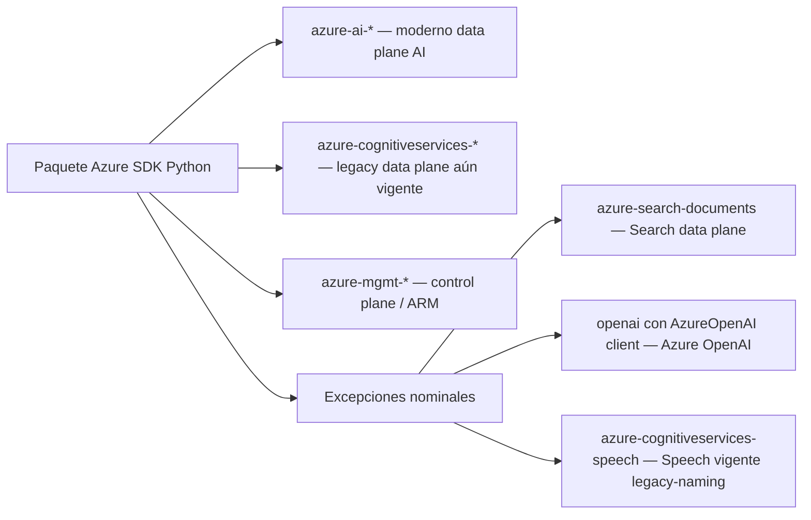
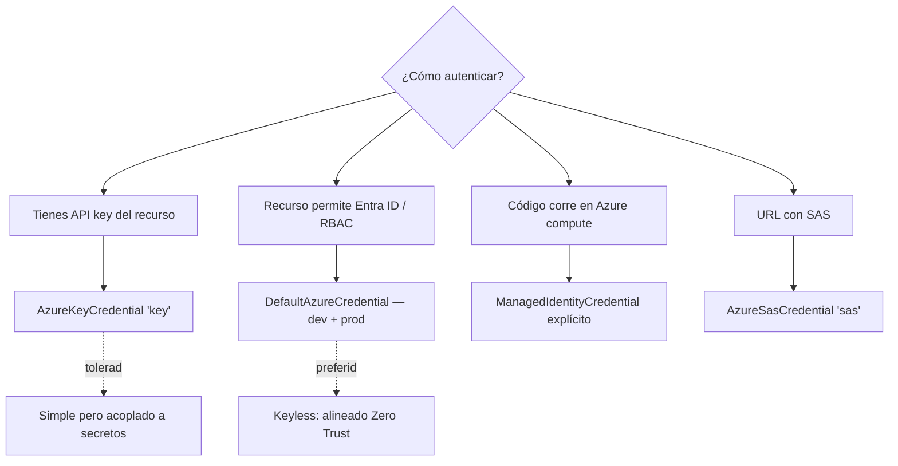

# Python SDK `azure-ai-*` — Overview transversal AI-103

> [!abstract] TL;DR
> El examen AI-103 evalúa Python como lenguaje de referencia. Todo snippet sigue un **patrón canónico** en 4 pasos: (1) `pip install azure-ai-<servicio>` + `azure-identity`, (2) construir un `credential` (`DefaultAzureCredential` preferido o `AzureKeyCredential` para data plane con clave), (3) instanciar `<Service>Client(endpoint=..., credential=...)`, (4) invocar la operación (síncrona, `begin_*` para LRO o `aio` para asíncrona) y capturar `azure.core.exceptions.HttpResponseError`. Conocer **nombres exactos de paquetes**, **scopes de token**, **orden de la cadena `DefaultAzureCredential`** y **convención `begin_*`** es lo que diferencia respuestas correctas de distractores.

## Relevancia en el examen

- Tipos de pregunta más vistos: completar import + construcción de cliente, elegir el paquete pip correcto, identificar el credential correcto para un escenario (key vs Entra ID vs Managed Identity), distinguir sync vs `aio`, identificar el scope OAuth correcto, manejar 429 / 401 / `HttpResponseError`.
- Frecuencia: 🔥🔥🔥 — aparece **incrustado** en preguntas de **todos los dominios** (A, B, C, D, E). No suele ser pregunta pura del SDK, sino requisito previo para responder cualquier escenario de código.
- Trampa Microsoft favorita: confundir `azure-ai-search` (no existe) con `azure-search-documents` (correcto), o `azure-openai` (no existe) con el paquete `openai` configurado en modo Azure (`AzureOpenAI`).

## Concepto en profundidad

### 1. Anatomía del nombre de paquete

La SDK para Python sigue tres convenciones de nomenclatura que **coexisten** y que el examen testea:



- **`azure-ai-*`** (moderno): `azure-ai-projects`, `azure-ai-inference`, `azure-ai-evaluation`, `azure-ai-contentsafety`, `azure-ai-vision-imageanalysis`, `azure-ai-vision-face`, `azure-ai-translation-text`, `azure-ai-translation-document`, `azure-ai-language-conversations`, `azure-ai-language-questionanswering`, `azure-ai-textanalytics`, `azure-ai-documentintelligence`, `azure-ai-contentunderstanding`.
- **`azure-cognitiveservices-*`** (legacy pero **vigente para Speech**): `azure-cognitiveservices-speech` es el paquete oficial actual del Speech SDK; Microsoft **no** lo ha migrado a `azure-ai-speech`. ⚠️ Trampa clásica.
- **`azure-mgmt-*`** (control plane): para crear/configurar el recurso vía ARM (`azure-mgmt-cognitiveservices`, etc.). No confundir con data plane.
- **Excepciones nominales clave**:
  - **`azure-search-documents`** para Azure AI Search (no existe `azure-ai-search`).
  - **`openai`** (paquete oficial OpenAI con clase `AzureOpenAI`) para Azure OpenAI; **no** existe `azure-openai` ni `azure-ai-openai` como paquete instalable canónico.

### 2. Tabla de paquetes `azure-ai-*` por dominio AI-103

| Paquete pip | Cliente principal | Submódulo `aio` | Dominio AI-103 |
|---|---|---|---|
| `azure-ai-projects` | `AIProjectClient` | `azure.ai.projects.aio` | A, B (Foundry projects, agents, connections, evaluations, datasets, indexes) |
| `azure-ai-inference` | `ChatCompletionsClient`, `EmbeddingsClient`, `ImageEmbeddingsClient` | `azure.ai.inference.aio` | B (model catalog, GitHub Models, serverless/managed compute, Azure OpenAI) |
| `azure-ai-evaluation` | `evaluate`, `GroundednessEvaluator`, `RelevanceEvaluator`, … | (parcial) | B (evaluación generativa) |
| `azure-ai-contentsafety` | `ContentSafetyClient`, `BlocklistClient` | `azure.ai.contentsafety.aio` | B (moderación text + image) |
| `azure-ai-vision-imageanalysis` | `ImageAnalysisClient` | `azure.ai.vision.imageanalysis.aio` | C (Image Analysis 4.0) |
| `azure-ai-vision-face` | `FaceClient`, `FaceAdministrationClient` | `azure.ai.vision.face.aio` | C (Face) |
| `azure-ai-translation-text` | `TextTranslationClient` | `azure.ai.translation.text.aio` | D (Translator) |
| `azure-ai-translation-document` | `DocumentTranslationClient`, `SingleDocumentTranslationClient` | `azure.ai.translation.document.aio` | D (Document Translation LRO) |
| `azure-ai-language-conversations` | `ConversationAnalysisClient`, `ConversationAuthoringClient` | `azure.ai.language.conversations.aio` | D (CLU + Orchestration) |
| `azure-ai-language-questionanswering` | `QuestionAnsweringClient`, `QuestionAnsweringAuthoringClient` | `azure.ai.language.questionanswering.aio` | D (CQA) |
| `azure-ai-textanalytics` | `TextAnalyticsClient` | `azure.ai.textanalytics.aio` | D (NER, sentiment, PII, key phrases, language detection, healthcare) |
| `azure-ai-documentintelligence` | `DocumentIntelligenceClient`, `DocumentIntelligenceAdministrationClient` | `azure.ai.documentintelligence.aio` | E (Document Intelligence 4.0) |
| `azure-ai-contentunderstanding` ⚠️ | `ContentUnderstandingClient` | parcial | E (multimodal extraction — verificar release status en PyPI a fecha de examen) |
| `azure-cognitiveservices-speech` | `SpeechRecognizer`, `SpeechSynthesizer`, `TranslationRecognizer`, … | n/a (modelo de callbacks) | D (Speech to Text / Text to Speech / Speech Translation) |
| `azure-search-documents` | `SearchClient`, `SearchIndexClient`, `SearchIndexerClient` | `azure.search.documents.aio` | B (RAG retrieval), E (indexers + skillsets) |
| `openai` (configurado para Azure) | `AzureOpenAI`, `AsyncAzureOpenAI` | nativo `AsyncAzureOpenAI` | B (Azure OpenAI Service direct) |
| `azure-identity` | `DefaultAzureCredential`, `ManagedIdentityCredential`, … | `azure.identity.aio` | transversal (auth Entra ID) |

> [!warning] `azure-ai-contentunderstanding` está en evolución activa
> A 2026-05-24, el paquete `azure-ai-contentunderstanding` puede aparecer como **preview** o no estar publicado todavía en PyPI según release schedule. Si el examen pregunta por Content Understanding y el snippet usa Python, lo más común es que use **REST directo** o `azure-ai-contentunderstanding` en preview. Verifica en PyPI antes del examen.

### 3. El patrón canónico (memorizar literalmente)

```python
# 1. Imports
from azure.ai.<service> import <Service>Client
from azure.identity import DefaultAzureCredential

# 2. Credential
credential = DefaultAzureCredential()

# 3. Cliente data plane
client = <Service>Client(endpoint=ENDPOINT, credential=credential)

# 4. Operación
result = client.<operation>(...)
```

**Cuatro pasos. Cuatro líneas conceptuales.** Cualquier desviación (otro nombre de paquete, otro credential, otra firma) levanta sospecha en una respuesta de examen.

### 4. Patrones de autenticación



#### 4.1 `DefaultAzureCredential` — la cadena oficial (verbatim de Microsoft Learn)

> "The identity it uses depends on the environment. When an access token is needed, it requests one using these identities in turn, stopping when one provides a token"

Orden de la cadena (memorizar):

1. **EnvironmentCredential** — service principal vía env vars (`AZURE_CLIENT_ID`, `AZURE_TENANT_ID`, `AZURE_CLIENT_SECRET` o `AZURE_CLIENT_CERTIFICATE_PATH`).
2. **WorkloadIdentityCredential** — si el Azure workload identity webhook ha inyectado las env vars (típico en AKS con Workload Identity).
3. **ManagedIdentityCredential** — system-assigned o user-assigned (lee `AZURE_CLIENT_ID` para user-assigned).
4. **SharedTokenCacheCredential** — solo Windows; identidad cacheada de aplicaciones Microsoft (p. ej. Visual Studio); seleccionable con `AZURE_USERNAME`.
5. **VisualStudioCodeCredential** — identidad logueada en VS Code con la **Azure Resources extension**.
6. **AzureCliCredential** — `az login` activo.
7. **AzurePowerShellCredential** — `Connect-AzAccount` activo.
8. **AzureDeveloperCliCredential** — `azd auth login` activo.
9. **InteractiveBrowserCredential** — **excluido por defecto** (`exclude_interactive_browser_credential=True`).
10. **BrokerCredential** — solo Windows / WSL si está instalado el paquete `azure-identity-broker` (WAM).

> [!tip] Mnemónico para la cadena
> **"Env → Workload → MI → Cache → Code → CLI → PoSh → AzDev → (Browser opt-in) → Broker"** = **"E-W-M-C-C-C-P-A-(B)-B"** → *"Every Working Machine Caches Code, CLI, PowerShell, AzDev — Browser is Banned"*.

```python
from azure.identity import DefaultAzureCredential

# Por defecto: browser excluido
credential = DefaultAzureCredential()

# Forzar opt-in del browser (útil en dev local sin az login)
credential = DefaultAzureCredential(exclude_interactive_browser_credential=False)

# Excluir managed identity (debug local — evita timeouts en máquinas sin MI)
credential = DefaultAzureCredential(exclude_managed_identity_credential=True)

# Restringir a un user-assigned managed identity concreto
credential = DefaultAzureCredential(managed_identity_client_id="<uami-client-id>")
```

> [!warning] `require_envvar=True` (novedad 2026)
> El parámetro `require_envvar` fuerza que la env var `AZURE_TOKEN_CREDENTIALS` esté seteada o `DefaultAzureCredential` lanza `ValueError`. Sirve para hacer **determinista** el credencial elegido en producción y evitar fallbacks sorpresa.

#### 4.2 `AzureKeyCredential` — API keys del data plane

```python
from azure.core.credentials import AzureKeyCredential
from azure.ai.textanalytics import TextAnalyticsClient

client = TextAnalyticsClient(
    endpoint="https://<resource>.cognitiveservices.azure.com/",
    credential=AzureKeyCredential("<key>"),
)
```

- Sirve para servicios cognitive multi-tenant que exponen claves (`key1`, `key2`).
- **Diferencia clave con `AzureSasCredential`**: `AzureKeyCredential` envía la clave en header `Ocp-Apim-Subscription-Key`; `AzureSasCredential` se usa para endpoints que esperan un SAS token (Event Hubs, Service Bus, Storage data plane — **raro en AI**).

#### 4.3 `get_bearer_token_provider` — patrón obligatorio para `AzureOpenAI` con Entra ID

El paquete `openai` (no Azure SDK estándar) no acepta directamente un `TokenCredential`. Microsoft expone un helper:

```python
from azure.identity import DefaultAzureCredential, get_bearer_token_provider
from openai import AzureOpenAI

token_provider = get_bearer_token_provider(
    DefaultAzureCredential(),
    "https://cognitiveservices.azure.com/.default",
)

client = AzureOpenAI(
    azure_endpoint="https://<resource>.openai.azure.com/",
    azure_ad_token_provider=token_provider,
    api_version="2024-10-21",
)

response = client.chat.completions.create(
    model="gpt-4o",  # nombre del deployment, no del modelo base
    messages=[{"role": "user", "content": "Hola"}],
)
```

> [!danger] Trampa frecuente
> El parámetro **`model`** en `AzureOpenAI.chat.completions.create` es el **deployment name** de Azure, no el nombre del modelo base. En OpenAI público sería al revés.

### 5. Token scopes (resource = …/.default)

| Servicio / endpoint | Scope OAuth |
|---|---|
| La mayoría de Azure AI Services (Language, Vision, Document Intelligence, Content Safety, Translator, Speech vía REST, Azure OpenAI) | `https://cognitiveservices.azure.com/.default` |
| Microsoft Foundry data plane (v1 REST: agents, projects, evaluations) | `https://ai.azure.com/.default` |
| Azure AI Search data plane (query + indexing) | `https://search.azure.com/.default` |
| ARM (creación/gestión de recursos) | `https://management.azure.com/.default` |

> [!info] Cuando el SDK ya añade el scope correcto
> Si construyes un `<Service>Client(endpoint=..., credential=DefaultAzureCredential())`, el SDK **inyecta automáticamente** el scope correcto. Solo necesitas pasar el scope manualmente al usar `get_bearer_token_provider`, `get_token()` directo, o al construir el `openai.AzureOpenAI` con `azure_ad_token_provider`.

### 6. Sync vs Async — el submódulo `aio`

```python
# Sync
from azure.ai.inference import ChatCompletionsClient
from azure.core.credentials import AzureKeyCredential

client = ChatCompletionsClient(endpoint=ENDPOINT, credential=AzureKeyCredential(KEY))
response = client.complete(messages=[...])
client.close()
```

```python
# Async — observa azure.ai.inference.aio y azure.identity.aio
import asyncio
from azure.ai.inference.aio import ChatCompletionsClient
from azure.identity.aio import DefaultAzureCredential

async def main():
    async with DefaultAzureCredential() as cred, \
               ChatCompletionsClient(endpoint=ENDPOINT, credential=cred) as client:
        response = await client.complete(messages=[...])
        print(response.choices[0].message.content)

asyncio.run(main())
```

- **Regla**: cada paquete `azure-ai-X` con soporte asíncrono expone un submódulo `azure.ai.X.aio` con los **mismos nombres de cliente**.
- **`azure-identity` también tiene `aio`**: `from azure.identity.aio import DefaultAzureCredential`. Si combinas un cliente async con un credential sync, funciona pero pierdes la ventaja async durante la adquisición del token.
- **Dependencia**: el modo async requiere `pip install aiohttp` (transport asíncrono).
- **Speech SDK no usa `aio`**: `azure-cognitiveservices-speech` tiene su propio modelo asíncrono basado en callbacks y eventos (`recognized`, `canceled`, `session_started`), no `async/await`.

### 7. Long-Running Operations (LRO) — el prefijo `begin_*`

Operaciones largas (Document Translation batch, Document Intelligence `analyze_document`, Custom Speech training, Vision custom training, etc.) siguen el patrón **poller**.

```python
# Sync LRO
poller = client.begin_analyze_document(model_id="prebuilt-layout", body=document_bytes)
result = poller.result()  # bloquea hasta completar
```

```python
# Async LRO
poller = await client.begin_analyze_document(model_id="prebuilt-layout", body=document_bytes)
result = await poller.result()
```

Métodos útiles del poller:

- `poller.status()` → `"NotStarted"`, `"Running"`, `"Succeeded"`, `"Failed"`, `"Canceled"`.
- `poller.done()` → bool.
- `poller.wait(timeout=...)` → bloquea con timeout.
- `poller.continuation_token()` → reanudar más tarde con `<Client>.<begin_method>(continuation_token=...)`.

> [!warning] `begin_*` ≠ async
> `begin_` indica **LRO**, no asincronía. Un método `begin_X` síncrono devuelve un `LROPoller` que se puede `.result()`. Para LRO + async, usas `azure.ai.X.aio` y obtienes un `AsyncLROPoller`.

### 8. Paginación

Operaciones de listado devuelven **iterables perezosos** (`ItemPaged` / `AsyncItemPaged`).

```python
# Sync
for connection in project_client.connections.list():
    print(connection.name)

# Acceso por páginas explícito
for page in project_client.connections.list().by_page():
    for item in page:
        ...
```

### 9. Manejo de errores

Toda excepción HTTP del data plane hereda de `azure.core.exceptions.HttpResponseError`.

```python
from azure.core.exceptions import (
    HttpResponseError,
    ResourceNotFoundError,    # 404
    ResourceExistsError,      # 409 conflict en create
    ClientAuthenticationError, # 401 desde el credential chain
    ServiceRequestError,      # error de transporte (DNS, TLS, timeout)
    ServiceResponseError,     # respuesta inválida del servicio
)

try:
    result = client.complete(messages=[...])
except ClientAuthenticationError as e:
    # Token chain falló (todos los credenciales rechazados)
    print(e.message)
except HttpResponseError as e:
    print(f"Status: {e.status_code} ({e.reason})")
    print(f"Error code: {e.error.code if e.error else 'unknown'}")
    print(e.message)
```

- **Throttling (429)**: el cliente respeta automáticamente el header `Retry-After` mediante la `RetryPolicy` por defecto (3 reintentos con back-off). Si la sobreescribes, configurar `retry_total`, `retry_backoff_factor` en el constructor.
- **`ClientAuthenticationError`** ≠ `HttpResponseError 401`. La primera la lanza `azure-identity` cuando **toda la cadena** falla (no llega a hacer request); la segunda la lanza el servicio cuando rechaza un token concreto.

## Cómo se hace — patrones cliente por servicio

### `AIProjectClient` (Foundry) — verificado contra Microsoft Learn

```python
import os
from azure.ai.projects import AIProjectClient
from azure.identity import DefaultAzureCredential

with (
    DefaultAzureCredential() as credential,
    AIProjectClient(
        endpoint=os.environ["FOUNDRY_PROJECT_ENDPOINT"],
        # Forma: https://<account>.services.ai.azure.com/api/projects/<project>
        credential=credential,
    ) as project_client,
):
    # OpenAI client embebido para Responses/Chat/Embeddings/Fine-Tuning
    with project_client.get_openai_client() as openai_client:
        response = openai_client.responses.create(
            model=os.environ["FOUNDRY_MODEL_NAME"],
            input="What is the size of France in square miles?",
        )
        print(response.output_text)
```

> [!info] AIProjectClient v2.0+ obliga Entra ID
> Microsoft Learn lo dice verbatim: **"Entra ID is the only authentication method supported at the moment by the client."** No hay forma de pasar `AzureKeyCredential` al `AIProjectClient` v2; la API key del proyecto solo se usa en flujos REST directos o en clientes derivados.

### `ChatCompletionsClient` (azure-ai-inference) — multi-backend

```python
from azure.ai.inference import ChatCompletionsClient
from azure.ai.inference.models import SystemMessage, UserMessage
from azure.core.credentials import AzureKeyCredential

client = ChatCompletionsClient(
    endpoint="https://<host>.<region>.models.ai.azure.com",
    credential=AzureKeyCredential(KEY),
)

response = client.complete(
    messages=[
        SystemMessage("You are a helpful assistant."),
        UserMessage("How many feet are in a mile?"),
    ],
)
print(response.choices[0].message.content)
```

- Funciona con **GitHub Models**, **Serverless/Managed Compute deployed from Foundry** y **Azure OpenAI** (con `api_version`).
- Entra ID disponible para **Managed Compute** y **Azure OpenAI**; **no** para GitHub Models (que usa GitHub PAT).

### `AzureOpenAI` (paquete `openai`) — patrón estándar

```python
from openai import AzureOpenAI
from azure.identity import DefaultAzureCredential, get_bearer_token_provider

token_provider = get_bearer_token_provider(
    DefaultAzureCredential(),
    "https://cognitiveservices.azure.com/.default",
)

client = AzureOpenAI(
    azure_endpoint=os.environ["AZURE_OPENAI_ENDPOINT"],
    azure_ad_token_provider=token_provider,
    api_version="2024-10-21",
)

resp = client.chat.completions.create(
    model="my-gpt4o-deployment",  # deployment name
    messages=[{"role": "user", "content": "Hola"}],
)
```

### `SearchClient` (azure-search-documents) — el "outsider"

```python
from azure.search.documents import SearchClient
from azure.identity import DefaultAzureCredential

search_client = SearchClient(
    endpoint="https://<search>.search.windows.net",
    index_name="my-index",
    credential=DefaultAzureCredential(),
)

results = search_client.search(search_text="quarterly revenue", top=5)
for r in results:
    print(r["@search.score"], r["title"])
```

Su scope OAuth es **distinto**: `https://search.azure.com/.default`.

## Tabla comparativa de credenciales

| Credential | Cuándo usarlo | Pros | Contras |
|---|---|---|---|
| `DefaultAzureCredential` | Casi siempre (dev local + prod en Azure) | Funciona en VS Code, `az login`, MI, Workload Identity sin cambiar código | Cadena puede tardar; orden no obvio si var de entorno errante |
| `ManagedIdentityCredential` explícito | Prod en Azure (App Service, AKS, VM, Container Apps) | Determinista; sin secretos | Solo funciona en Azure compute |
| `WorkloadIdentityCredential` | AKS con federated identity | Sin secretos; cumple Zero Trust | Solo AKS con Workload Identity habilitado |
| `EnvironmentCredential` | CI/CD pipelines con SP | Sencillo de inyectar | Maneja secretos |
| `ClientSecretCredential` | SP explícito (no recomendado para AI) | Control total | Secret rotation manual |
| `AzureCliCredential` | Dev local rápido | Reutiliza `az login` | No portable a prod |
| `AzureKeyCredential` | Servicios cognitive con key (legacy) | Cero setup | Secret en código / KV; no Zero Trust |
| `get_bearer_token_provider` | `AzureOpenAI` client de paquete `openai` | Adapta `TokenCredential` a la firma del paquete `openai` | Necesitas saber el scope manualmente |

## Trampas del examen

1. **`azure-ai-search` NO existe**. El paquete correcto es **`azure-search-documents`**. Cualquier opción que diga `pip install azure-ai-search` o `from azure.ai.search import ...` es **distractor**.
2. **`azure-openai` NO existe como paquete**. Para Azure OpenAI desde Python usas el paquete **`openai`** (oficial OpenAI) instanciado como **`AzureOpenAI`** (no `OpenAI`).
3. **Speech mantiene naming legacy**: el paquete es **`azure-cognitiveservices-speech`** (no `azure-ai-speech`). Microsoft no lo ha migrado. Si ves `pip install azure-ai-speech` en una opción, es trampa.
4. **`AzureKeyCredential` ≠ `AzureSasCredential`**. Ambos viven en `azure.core.credentials`. El primero envía la clave como subscription-key; el segundo envía un SAS token (raro en AI; usado en Storage, Event Hubs).
5. **`DefaultAzureCredential` excluye el browser por defecto**. Para forzar login interactivo en dev, hay que pasar `exclude_interactive_browser_credential=False`.
6. **El parámetro `model` en `AzureOpenAI` es el deployment name, no el modelo base**. Si una opción pasa `model="gpt-4o"` cuando el deployment se llama `prod-gpt4o`, está mal salvo que el deployment se llame exactamente así.
7. **`begin_*` no implica async**. Indica **Long-Running Operation**. Para async hay que importar de `azure.ai.X.aio` y devuelve `AsyncLROPoller`.
8. **`azure.identity.aio` existe**. Si combinas un cliente async con `DefaultAzureCredential` síncrono, funciona pero pierdes paralelismo durante la adquisición del token.
9. **`AIProjectClient` v2 NO acepta `AzureKeyCredential`**. Solo Entra ID. Si una pregunta muestra `AIProjectClient(endpoint=..., credential=AzureKeyCredential(key))`, está mal.
10. **El scope del data plane Foundry es `https://ai.azure.com/.default`**, no `cognitiveservices.azure.com/.default`. Pero los SDKs lo gestionan internamente; solo te toca conocerlo si llamas a REST con un `get_bearer_token_provider`.
11. **`AZURE_USERNAME` ≠ `AZURE_CLIENT_ID`**. El primero selecciona identidad en `SharedTokenCacheCredential`; el segundo es la app registration o user-assigned MI.
12. **`process_timeout` default = 10 s** para `AzureCliCredential` y `AzurePowerShellCredential`. En máquinas lentas, `az` puede timeoutear y la cadena pasa al siguiente credential.
13. **`HttpResponseError.status_code` vs `error.code`**. `status_code` es el HTTP (401, 429, 500). `error.code` es el código de error del servicio (`"InvalidRequest"`, `"ContentFilter"`, etc.). Microsoft examina la diferencia.
14. **Foundry endpoint format**: `https://<account>.services.ai.azure.com/api/projects/<project>`. Cualquier otro formato (`<account>.cognitiveservices.azure.com`, `<project>.ai.azure.com`) es **incorrecto** para `AIProjectClient`.
15. **Async requiere `aiohttp`**. Sin él, el constructor del cliente async lanza `ImportError`. La instrucción `pip install azure-ai-X` no instala `aiohttp` por defecto.

## Mnemotecnia

- **El patrón de 4 pasos**: **PIP → CRED → CLIENT → CALL**.
- **Cadena DAC** ("**E-W-M-C-C-C-P-A-(B)-B**"): **E**nv, **W**orkload, **M**anaged Identity, shared **C**ache, VS **C**ode, **C**LI, **P**owerShell, **A**zDev, (interactive **B**rowser opt-in), **B**roker WAM.
- **Tres scopes a memorizar**: `cognitiveservices.azure.com/.default` (cog), `ai.azure.com/.default` (Foundry), `search.azure.com/.default` (Search). Mnemo: **"Cog–Ai–Search"** = "**CAS** scopes".
- **`begin_X` = LRO, no async**. "**Begin = bottle**" (paciencia, embotellado).
- **Speech es la oveja negra**: `azure-cognitiveservices-speech` retiene el naming antiguo. Mnemo: *"Speech speaks legacy"*.
- **Search es el outsider**: `azure-search-documents`. Mnemo: *"Search has documents, not AI"*.
- **OpenAI viene de fuera**: paquete `openai`, clase `AzureOpenAI`. Mnemo: *"OpenAI brings its own suitcase"*.

## Conceptos relacionados

- [[00-azure-ai-services-portfolio]] — mapa completo de servicios y cuándo aplican.
- [[00-rest-api-patterns-azure-ai]] — REST y `api-version` cuando el SDK no basta.
- [[plan-security-keyless-credentials]] — Zero Trust con DAC y MI.
- [[plan-security-managed-identity]] — SAMI/UAMI, federated credentials, RBAC roles.
- [[genai-foundry-sdk-integration]] — uso profundo de `AIProjectClient` con agents.
- [[00-microsoft-foundry-overview]] — endpoints, projects y arquitectura Foundry.
- [[00-foundry-tools-catalog]] — tool catalog para agentes (Code Interpreter, File Search, MCP…).

## Autotest

**1.** Una aplicación Python en Azure Container Apps necesita llamar a Azure AI Language Service usando una user-assigned managed identity con client ID `abc-123`. ¿Qué construcción es **correcta**?

- a) `DefaultAzureCredential(client_id="abc-123")`
- b) `DefaultAzureCredential(managed_identity_client_id="abc-123")`
- c) `ManagedIdentityCredential(user_assigned_id="abc-123")`
- d) `AzureKeyCredential("abc-123")`

<details><summary>Respuesta</summary>

**b)**. El parámetro keyword es `managed_identity_client_id` en `DefaultAzureCredential` (o `client_id` si usas `ManagedIdentityCredential` directamente — pero esa opción no existe en a). La opción a) usa una key incorrecta; c) tiene un parámetro inexistente (`user_assigned_id`); d) confunde key con identity. Doc: `azure.identity.DefaultAzureCredential` constructor keyword `managed_identity_client_id`.

</details>

**2.** ¿Cuál es el paquete pip correcto para indexar y consultar un índice de Azure AI Search desde Python?

- a) `pip install azure-ai-search`
- b) `pip install azure-search`
- c) `pip install azure-search-documents`
- d) `pip install azure-ai-search-documents`

<details><summary>Respuesta</summary>

**c)** `azure-search-documents`. Es la excepción nominal más examinada: Azure AI Search **no** sigue la convención `azure-ai-*` en Python. Las otras opciones no existen en PyPI.

</details>

**3.** Quieres usar Azure OpenAI desde Python autenticando con Entra ID (sin keys). ¿Qué combinación es correcta?

- a) `AzureOpenAI(api_key=DefaultAzureCredential())`
- b) `AzureOpenAI(azure_ad_token=DefaultAzureCredential())`
- c) `AzureOpenAI(azure_ad_token_provider=get_bearer_token_provider(DefaultAzureCredential(), "https://cognitiveservices.azure.com/.default"))`
- d) `AzureOpenAI(credential=DefaultAzureCredential())`

<details><summary>Respuesta</summary>

**c)**. El paquete `openai` no acepta `TokenCredential` directamente; usa el helper `get_bearer_token_provider` del paquete `azure-identity` para producir una función `() -> str` que el cliente `AzureOpenAI` invoca antes de cada request. El scope obligatorio para Azure OpenAI es `https://cognitiveservices.azure.com/.default`.

</details>

**4.** ¿Qué afirmación sobre `begin_analyze_document` en `azure-ai-documentintelligence` es **correcta**?

- a) Es una llamada asíncrona que debe usarse con `await`.
- b) Devuelve un `LROPoller` y debes llamar `.result()` para obtener el resultado.
- c) `begin_*` solo se usa en clientes del submódulo `aio`.
- d) Bloquea inmediatamente hasta que la operación termina.

<details><summary>Respuesta</summary>

**b)**. El prefijo `begin_` indica una **Long-Running Operation** (no async). Devuelve un `LROPoller` síncrono cuyo `.result()` bloquea hasta completar. La versión asíncrona vive en `azure.ai.documentintelligence.aio` y devuelve un `AsyncLROPoller` (entonces sí se usa `await poller.result()`).

</details>

**5.** Un test local recibe `ClientAuthenticationError` al instanciar un cliente con `DefaultAzureCredential()` desde una terminal donde el desarrollador acaba de hacer `az login`. ¿Causa más probable?

- a) `az login` no fue exitoso.
- b) El proceso `az` superó `process_timeout` (default 10 s) y la cadena falló sin probar siguiente credential.
- c) Falta el header `Ocp-Apim-Subscription-Key`.
- d) `DefaultAzureCredential` no soporta CLI; hay que usar `AzureCliCredential`.

<details><summary>Respuesta</summary>

**b)**. En máquinas lentas (WSL, contenedores), el subproceso `az account get-access-token` puede tardar más que el `process_timeout` de 10 s y devolver fallo, terminando la cadena con `ClientAuthenticationError`. Solución: aumentar `process_timeout=30`. La opción d) es falsa: DAC sí incluye `AzureCliCredential` en la cadena.

</details>

## Control de calidad (auto-rúbrica)

| Dimensión | Nota | Justificación |
|---|---|---|
| Completitud | 9.5 | Cubre familia de paquetes, auth (3 patrones), scopes, sync/async, LRO, paginación, errores, 15 trampas, ejemplos por servicio. |
| Exactitud técnica | 9.5 | Cadena DAC, scopes, AIProjectClient endpoint format y restricción a Entra ID verificados verbatim contra Microsoft Learn 2026-04 / 2026-05; ⚠️ marcado en `azure-ai-contentunderstanding` por release status volátil. |
| Alineación al examen | 9 | 15 trampas Microsoft-específicas, autotest con distractores reales, mnemónicos prácticos. |
| Claridad pedagógica | 9 | Mermaid, tablas, callouts, patrón de 4 pasos, mnemónicos memorizables. |

*Verificado a fecha 2026-05-24 contra Microsoft Learn (azure-sdk-overview ms.date 2026-02-28, DefaultAzureCredential updated 2026-05-19, ai-projects-readme ms.date 2026-04-20).*
