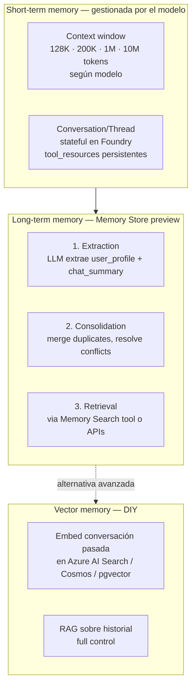
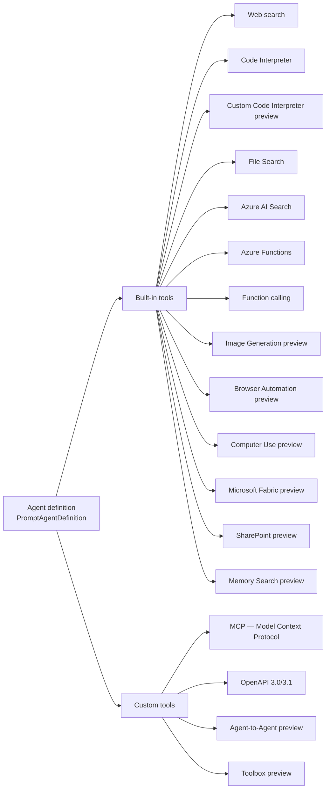

# Selección de memory, tools y knowledge integration services para agentes

> [!abstract] TL;DR
> Un agente en **Microsoft Foundry Agent Service** se diseña combinando tres pilares: **(1) memory** (short-term = thread/conversation; long-term = managed Memory Store preview con extracción, consolidación y retrieval automáticos), **(2) tools** (built-in: File Search, Code Interpreter, Web Search, Azure AI Search, Image Generation, Browser Automation, Computer Use, Fabric, SharePoint, Azure Functions, Function calling; custom: MCP, OpenAPI, A2A, Toolbox), y **(3) knowledge integration** (File Search para uploads simples ≤10 000 files × 512 MB, Azure AI Search para índices custom, Content Understanding para multimodal, Bing/Web Search para web live, SharePoint/Fabric para datos corporativos vía Entra). El examen AI-103 valida que sepas mapear cada requisito funcional al servicio correcto y conocer límites, status preview/GA, auth, y trade-offs.

## 🎯 Relevancia en el examen

| Tipo de pregunta | Frecuencia | Escenarios |
|---|---|---|
| "Choose the right tool for…" | 🔥🔥🔥 | RAG corporativo vs uploads vs web live vs multimodal |
| "Which memory option for cross-session continuity?" | 🔥🔥 | Memory Store preview vs vector store custom vs thread context |
| "Configure auth for tool X" | 🔥🔥 | MCP (Entra/OAuth/API key), OpenAPI, SharePoint, Fabric |
| Identificar limits (File Search 10 000 files, 512 MB) | 🔥🔥🔥 | Trampa clásica vs Azure AI Search ilimitado |
| Preview vs GA | 🔥🔥 | Memory, Computer Use, A2A, Browser Automation, Image Generation, SharePoint, Fabric — todos preview |

> [!warning] El examen AI-103 (Domain A 25-30 %) **discrimina** entre File Search built-in y Azure AI Search tool. Si la pregunta menciona "existing index", la respuesta es **siempre** Azure AI Search tool, no File Search.

## 📖 Concepto en profundidad

Un agente Foundry no "sabe" nada por sí solo más allá del prompt + window context del modelo. Su utilidad emerge cuando le añades:

- **Memory** → continuidad temporal (sesión y entre sesiones).
- **Tools** → capacidad de **acción** (ejecutar código, llamar API, buscar web).
- **Knowledge** → acceso a **datos** (corporativos, públicos, multimodales).

La pregunta de diseño en AI-103 es: **dado el escenario funcional, ¿qué combinación elijo y por qué?**.

### Pilar 1 — Memory



**Short-term (sesión actual)**:
- Gestionado por la **Responses API** y el objeto `Conversation` (anteriormente "thread" en la Assistants API classic). El servicio guarda los mensajes en `conversation.id` y se los re-inyecta al modelo en cada `responses.create`.
- Límite duro = **context window** del modelo (gpt-4.1-mini 1 M, gpt-5-mini 400 K aprox, gpt-4o 128 K — verificar siempre antes del examen). Cuando se aproxima, el servicio o tú aplicas estrategias de truncation / summarization.

**Long-term (Memory preview, abril-mayo 2026)**:
- Servicio **gestionado** dentro de Foundry Agent Service. Crea un **Memory Store** y lo asocia a un agente.
- Dos tipos de memoria que extrae automáticamente:
  - `user_profile_details` → "static" (alergias, idioma, preferencias). Recuperar al inicio de cada conversación.
  - `chat_summary` (campo `chat_summary_enabled: true`) → resumen distilado por hilo/tópico para continuar entre sesiones.
- Tres fases internas: **Extraction → Consolidation → Retrieval**. La consolidación usa LLM para fusionar/resolver conflictos (ej. nueva alergia sobrescribe antigua).
- **Scope** (`{{$userId}}` o explícito) determina la partición lógica: 100 scopes max por store, 10 000 memorias max por scope.
- Quotas: **1 000 RPM** search y **1 000 RPM** update.
- Requiere **Azure OpenAI chat + embedding model deployments compatibles** (text-embedding-3-large típicamente).
- Dos APIs de consumo: **Memory Search tool** (built-in, fácil) o **Memory Store APIs** (low-level, control total).

> [!danger] Memory está en **public preview**, NO GA. Si una pregunta exige "GA, production-ready, supported", la opción correcta no es Memory Store sino un vector store propio en Azure AI Search.

**Vector memory DIY (alternativa GA)**: embedding manual de la historia en Azure AI Search/Cosmos DB con pgvector, retrieval con tool custom. Lo eliges cuando necesitas (a) GA, (b) consultas complejas multi-tenant, (c) compliance estricto sobre dónde residen las memorias.

### Pilar 2 — Tools (catálogo completo verificado)



**Tabla maestra — todos los built-in (verbatim Microsoft Learn, abril 2026):**

| Tool | Status | Categoría | Para qué sirve |
|---|---|---|---|
| Web search | GA | Knowledge | Recomendado para web grounding genérico; respuestas con inline citations |
| Code Interpreter | GA | Action | Python sandbox aislado (sin internet) para data analysis y charts |
| Custom Code Interpreter | preview | Action | Personalizar packages, Container Apps environment |
| File Search | GA | Knowledge | Vector search sobre archivos uploaded |
| Azure AI Search | GA | Knowledge | Ground sobre índice AI Search existente |
| Azure Functions | GA | Action | Llamar a tus Azure Functions |
| Function calling | GA | Action | Función Python local que tu app ejecuta |
| Image Generation | preview | Action | Generar imágenes en la conversación |
| Browser Automation | preview | Action | Ejecutar tareas en browser vía natural language |
| Computer Use | preview | Action | Interactuar con UI de sistemas (alto riesgo) |
| Microsoft Fabric | preview | Knowledge | Conexión a un **Fabric data agent** para analytics |
| SharePoint | preview | Knowledge | Chat con documentos privados de SharePoint |
| Memory Search | preview | Memory | Lee/escribe en el Memory Store del agente |

**Custom tools:**

| Tool | Status | Para qué |
|---|---|---|
| Model Context Protocol (MCP) | GA core (servers individuales varían) | Conectar a servidor MCP remoto/local |
| OpenAPI 3.0/3.1 | GA | APIs externas via spec OpenAPI |
| Agent-to-Agent (A2A) | preview | Comunicación entre agents A2A-compatible |
| Toolbox | preview | Bundle de tools expuesto como un solo endpoint MCP |

> [!note] **Grounding with Bing tools** sigue existiendo como tool para escenarios avanzados (market-specific filtering), pero Microsoft recomienda **Web search** como default para web grounding general.

### Pilar 3 — Knowledge integration

Knowledge = "¿de dónde saca el agente los hechos para responder?". Cinco familias canónicas:

| Familia | Servicio Foundry | Cuándo elegirlo | Límites duros |
|---|---|---|---|
| Uploads simples (PDF, DOCX, MD, código) | **File Search tool** | Pocos docs, sin infra propia | 10 000 files/store; 1 vector store/agent; 1 vector store/conversation; 512 MB/file; 5 M tokens/file |
| Índice corporativo custom (hybrid/semantic/vector) | **Azure AI Search tool** | RAG empresarial maduro, filtros, security trimming | Sin límite duro de servicio (sí cuotas del SKU AI Search) |
| Contenido multimodal estructurado (PDF + imagen + audio) | **Content Understanding** → output a AI Search o File Search | Documentos complejos con tablas, figuras, audio | Ver pricing CU |
| Información live web | **Web search** (o Bing Grounding avanzado) | Datos recientes fuera del corpus propio | Por uso, billing aparte |
| Datos corporativos SaaS | **SharePoint** (preview) / **Fabric** (preview) | Docs SP Online; lakehouse/SQL warehouse | Requieren connection Entra |

> [!important] **File Search vs Azure AI Search**: pregunta clásica del examen.
> - File Search → "**managed** vector store, **no setup**, uploads ad-hoc". Microsoft gestiona chunking (800 tokens, overlap 400), embeddings (text-embedding-3-large 256 dim), reranking. Top hybrid search out-of-the-box.
> - Azure AI Search tool → "**ground sobre índice existente**". Tú controlas schema, skillsets, indexers, security trimming, scoring profiles. Necesario para multi-source, ACL por usuario, índices >10 000 docs.

### Default chunking de File Search (verbatim docs)

| Setting | Default value |
|---|---|
| Chunk size | **800 tokens** |
| Chunk overlap | **400 tokens** |
| Embedding model | **text-embedding-3-large (256 dimensions)** |
| Max chunks in context | **20** |

## 🏗️ Cómo se hace

### Python — Agent con múltiples tools (File Search + Function + Web search)

```python
from azure.ai.projects import AIProjectClient
from azure.ai.projects.models import (
    PromptAgentDefinition,
    FileSearchTool,
    WebSearchTool,
    FunctionTool,
)
from azure.identity import DefaultAzureCredential

PROJECT_ENDPOINT = "https://my-foundry.ai.azure.com/api/projects/my-proj"

project = AIProjectClient(endpoint=PROJECT_ENDPOINT, credential=DefaultAzureCredential())
openai = project.get_openai_client()

# 1) Vector store para File Search
vector_store = openai.vector_stores.create(name="ProductDocs")
with open("./catalog.pdf", "rb") as f:
    openai.vector_stores.files.upload_and_poll(vector_store_id=vector_store.id, file=f)

# 2) Custom function (schema JSON estricto — la describes, tu app la ejecuta)
def get_order_status(order_id: str) -> dict:
    # tu lógica real
    return {"order_id": order_id, "status": "shipped"}

custom_fn = FunctionTool(
    name="get_order_status",
    description="Devuelve el estado de un pedido por su ID.",
    parameters={
        "type": "object",
        "properties": {"order_id": {"type": "string"}},
        "required": ["order_id"],
    },
)

# 3) Crear agent con los tres tools
agent = project.agents.create_version(
    agent_name="support-agent",
    definition=PromptAgentDefinition(
        model="gpt-5-mini",
        instructions=(
            "Eres soporte. Usa file_search para docs internos, "
            "web_search para noticias y get_order_status para pedidos."
        ),
        tools=[
            FileSearchTool(vector_store_ids=[vector_store.id]),
            WebSearchTool(),
            custom_fn,
        ],
    ),
)
```

### Python — Memory Store (preview)

```python
# Crear memory store + agent con Memory Search tool
from azure.ai.projects.models import MemorySearchTool

# Crear el memory store (preview API)
memory_store = project.memory_stores.create(
    name="user-prefs-store",
    user_profile_details=True,    # extrae preferencias estables
    chat_summary_enabled=True,    # resúmenes por hilo
    # modelo chat + embedding requeridos (compatibles)
    chat_model="gpt-4.1-mini",
    embedding_model="text-embedding-3-large",
)

agent = project.agents.create_version(
    agent_name="personal-assistant",
    definition=PromptAgentDefinition(
        model="gpt-5-mini",
        instructions="Recuerda preferencias entre sesiones; usa memory_search.",
        tools=[
            MemorySearchTool(
                memory_store_id=memory_store.id,
                scope="{{$userId}}",  # partición lógica por usuario
            ),
        ],
    ),
)
# ⚠️ Sintaxis de Memory APIs en preview — verificar versión del SDK.
```

### Python — MCP con auth Entra

```python
from azure.ai.projects.models import MCPTool

mcp = MCPTool(
    server_label="github",
    server_url="https://api.githubcopilot.com/mcp",
    require_approval="always",
    project_connection_id="my-github-connection",  # connection con credenciales
)
```

### Azure CLI — listar tools configurados de un proyecto

```bash
az extension add --name ai-foundry --upgrade
az foundry agent list --project-endpoint $FOUNDRY_PROJECT_ENDPOINT
# ⚠️ Verifica nombre exacto del comando contra `az foundry --help` —
#    la CLI Foundry está evolucionando rápidamente.
```

## 📊 Árbol de decisión: ¿qué servicio para qué?

```mermaid
flowchart TD
    START[Requisito funcional]
    START --> Q1{¿Necesito recordar<br/>entre sesiones?}
    Q1 -->|sí, GA prod| VEC[Vector memory custom<br/>Azure AI Search]
    Q1 -->|sí, ok preview| MEM[Memory Store + Memory Search tool<br/>preview]
    Q1 -->|no, solo sesión actual| THR[Conversation/thread<br/>context window]

    START --> Q2{¿Qué tipo<br/>de knowledge?}
    Q2 -->|uploads pocos docs| FS[File Search<br/>10 000 files · 512 MB]
    Q2 -->|índice corporativo existente| AIS[Azure AI Search tool]
    Q2 -->|multimodal PDF+img+audio| CU[Content Understanding<br/>+ AI Search]
    Q2 -->|web live, noticias| WS[Web search built-in]
    Q2 -->|SharePoint Online| SP[SharePoint tool preview]
    Q2 -->|Fabric lakehouse/SQL| FAB[Microsoft Fabric tool preview]

    START --> Q3{¿Qué tipo<br/>de acción?}
    Q3 -->|Python sandbox| CI[Code Interpreter<br/>sin internet]
    Q3 -->|API REST con OpenAPI spec| OA[OpenAPI tool]
    Q3 -->|función Python en tu app| FC[Function calling]
    Q3 -->|Azure Function existente| AF[Azure Functions tool]
    Q3 -->|server compartido entre equipos| MCP[MCP tool]
    Q3 -->|comunicación entre agents| A2A[A2A preview]
    Q3 -->|controlar UI/browser| CU2[Computer Use / Browser Automation<br/>preview, alto riesgo]
    Q3 -->|generar imágenes| IG[Image Generation preview]
```



## 🪤 Trampas del examen

1. **File Search ≠ Azure AI Search tool.** File Search es managed con vector store interno (10 000 files, 512 MB/file, chunk 800/overlap 400). Azure AI Search tool conecta a tu índice **existente** y te da control total (security trimming, hybrid+semantic, custom skillsets). Si el enunciado dice "existing index" o "security trimming", la respuesta **siempre** es Azure AI Search tool.
2. **1 vector store / agent, 1 vector store / conversation.** Es un límite **duro**. Si necesitas más fuentes, usa Azure AI Search.
3. **Memory está en preview**: no la elijas para escenarios "production, GA, supported". La alternativa GA es vector memory propia en Azure AI Search.
4. **Code Interpreter sandbox NO tiene acceso a internet.** Si necesitas web durante ejecución de código → no es Code Interpreter; combina Function calling + Web search.
5. **Computer Use y Browser Automation (preview) → alto riesgo**. Microsoft exige approval workflows / human-in-the-loop. Trampa: si el enunciado describe "no human supervision", descártalos.
6. **MCP es protocolo, no servicio managed**. Tú o un tercero hospeda el servidor; Foundry sólo lo consume. Trampa: confundir MCP con tool built-in alojado por Microsoft.
7. **SharePoint y Fabric tools requieren connection con Entra ID auth**. No funcionan con API key. Configura en Foundry portal `Build → Connections`.
8. **Function calling vs Azure Functions tool**: NO son lo mismo. Function calling = tu app local ejecuta y devuelve el resultado. Azure Functions tool = el servicio llama directamente a tu Azure Function HTTP trigger (managed integration).
9. **Web search (built-in) vs Grounding with Bing**: Web search es el recomendado default. Bing tools quedan para market-specific filtering o necesidades avanzadas.
10. **Memory Store quotas**: 100 scopes max, 10 000 memorias/scope, 1000 RPM search/update. Memorízalo.
11. **Memory requiere Azure OpenAI chat + embedding compatibles**. Si tu deployment es un modelo de partner (Mistral, Cohere) sin embedding compatible, Memory no funciona.
12. **Toolbox (preview) expone un endpoint MCP-compatible**: cualquier runtime MCP (Agent Framework, LangGraph, Copilot SDK) lo consume. Trampa: pensar que Toolbox sólo sirve dentro de Foundry.
13. **Vector store de conversación expira a los 7 días sin actividad** (default). Si una pregunta dice "run falla porque no encuentra el vector store después de días", esa es la causa.
14. **File Search hace hybrid search automático** (keyword + semantic + rerank). No tienes que configurarlo. Si el examen pregunta "¿qué hace File Search bajo el capó?", la respuesta incluye **rewrite → parallel → hybrid → rerank**.
15. **A2A vs MCP**: A2A es para que agents se comuniquen entre sí; MCP es para que un agent consuma herramientas. Diferente abstracción.

## 🧠 Mnemotecnia

- **"WAC-FAFI-IBC-FSM"** — built-in tools por orden: **W**eb search, **A**zure AI Search, **C**ode Interpreter, **F**ile Search, **A**zure Functions, **F**unction calling, **I**mage Gen, **B**rowser Automation, **C**omputer Use, **F**abric, **S**harePoint, **M**emory Search.
- **Custom = "MOAT"**: **M**CP, **O**penAPI, **A**2A, **T**oolbox.
- **File Search ABCs**: **A**utomatic chunking (800/400), **B**ig limit (10 000 files × 512 MB), **C**hange to AI Search si necesitas más control.
- **Memory phases** = **E.C.R.** → **E**xtraction, **C**onsolidation, **R**etrieval.
- **Knowledge ladder** (de menos a más control): **Web → File Search → AI Search → Content Understanding + AI Search**.
- Regla de oro: **"Si está en preview, no es la respuesta correcta cuando el escenario dice production"**.

## 🔗 Conceptos relacionados

- [[agents-microsoft-foundry-agent-service]]
- [[agents-microsoft-agent-framework]]
- [[agents-tools-search-integration]]
- [[agents-tools-knowledge-stores]]
- [[agents-tools-custom-functions]]
- [[agents-conversation-memory]]
- [[search-as-agent-tool]]
- [[extract-content-understanding-overview]]
- [[plan-foundry-service-selection-decision-tree]]
- [[plan-retrieval-indexing-method-selection]]
- [[00-foundry-tools-catalog]]
- [[plan-security-rbac-role-policies]]

## ❓ Autotest

**1.** Necesitas que un agente responda preguntas sobre 50 000 documentos corporativos con security trimming por usuario. ¿Qué tool eliges?
a) File Search built-in con múltiples vector stores
b) Azure AI Search tool conectado a un índice existente con security filters
c) SharePoint tool
d) Memory Store con scope por usuario

<details><summary>Respuesta</summary>
**b)** File Search tiene un límite de 10 000 files y 1 vector store por agent, y no hace security trimming. Azure AI Search tool permite conectar a un índice ya configurado con security filters por usuario y volúmenes ilimitados. SharePoint (preview) sería opción si los docs viven en SP Online, pero la pregunta no lo especifica.
</details>

**2.** Un escenario exige "production-ready, GA, supported" continuidad de preferencias del usuario entre sesiones. ¿Qué eliges?
a) Memory Store + Memory Search tool
b) Vector store custom en Azure AI Search con embeddings de la conversación
c) Conversation/thread con context window grande
d) Code Interpreter persistente

<details><summary>Respuesta</summary>
**b)** Memory Store está en preview (no GA), así que se descarta para "production-ready GA". El thread/conversation no persiste entre sesiones de forma estructurada para preferencias. Code Interpreter no es memory. La opción GA es vector memory propio en Azure AI Search.
</details>

**3.** ¿Cuál es el chunk_size default y chunk_overlap default de File Search?
a) 512 / 256 tokens
b) 800 / 400 tokens
c) 1024 / 200 tokens
d) 2048 / 512 tokens

<details><summary>Respuesta</summary>
**b)** Microsoft Learn documenta **800 tokens** chunk size, **400 tokens** overlap, embedding model **text-embedding-3-large** con 256 dimensiones y máximo 20 chunks en contexto.
</details>

**4.** Un agente debe ejecutar código Python que descargue datos de una URL pública y los grafique. ¿Qué combinación de tools?
a) Solo Code Interpreter
b) Code Interpreter + Web search
c) Function calling + Code Interpreter
d) Code Interpreter + OpenAPI

<details><summary>Respuesta</summary>
**c)** Code Interpreter es sandbox **sin internet**. Para traer datos de fuera necesitas otra tool que haga la llamada (Function calling en tu app, o un OpenAPI/Azure Functions que devuelva el dato), y luego Code Interpreter procesa y grafica.
</details>

**5.** Quieres exponer un conjunto curado de tools (web search + AI Search + un MCP server) como un único endpoint reutilizable por agents en Foundry, Agent Framework y LangGraph. ¿Qué construyes?
a) Un agent compuesto con A2A
b) Un Toolbox (preview)
c) Un MCP server local custom
d) Una Foundry connection

<details><summary>Respuesta</summary>
**b)** Toolbox (preview) es exactamente eso: bundle de tools expuesto como **endpoint MCP-compatible** que cualquier runtime MCP-capable consume. A2A es para comunicación entre agents distintos. Construir un MCP server propio sería reinventar Toolbox.
</details>

## ✅ Control de calidad (auto-rúbrica)

| Dimensión | Nota | Justificación |
|---|---|---|
| Completitud | 9.5 | Cubre los 3 pilares (memory, tools, knowledge) con catálogo verbatim, límites, status preview/GA, snippets y decision tree. |
| Exactitud técnica | 9.5 | Todos los nombres de tools, límites (10 000 files, 512 MB, 800/400 chunks, 100 scopes, 10 000 memorias, 1000 RPM) y clases SDK verificados contra Microsoft Learn (mayo 2026). |
| Alineación al examen | 9.5 | Trampas (≥15) reales: File Search vs AI Search, preview vs GA, MCP vs Toolbox, Code Interpreter sin internet, Function vs Azure Functions tool. |
| Claridad pedagógica | 9.0 | Mermaid de pilares, decision tree, mnemónicos (WAC-FAFI-IBC-FSM, MOAT, E.C.R.), tablas comparativas, autotest con explicaciones. |

*Verificado a fecha 2026-05-22 contra Microsoft Learn (Foundry Agent Service tool catalog, Memory preview, File Search how-to).*
