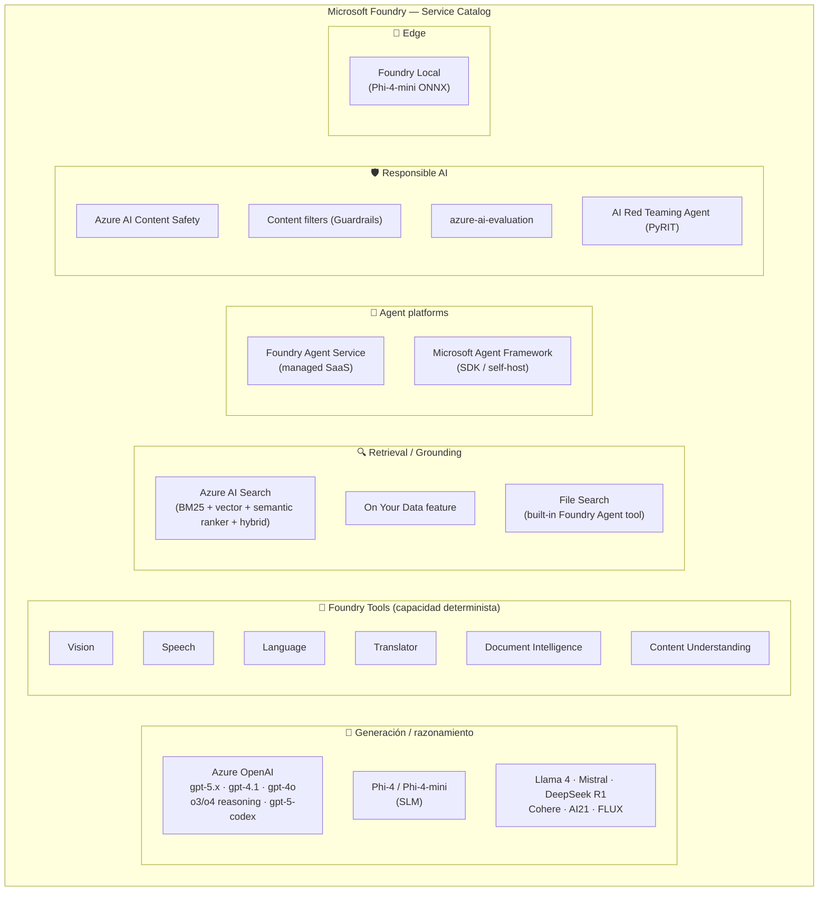

# Plan: Árbol de decisión maestro de servicios Foundry (AI-103, A.1)

> [!abstract] TL;DR
> Dado **cualquier** caso de uso, AI-103 espera que sepas seleccionar la **combinación mínima** de servicios Foundry correcta entre: **Azure OpenAI** (gpt-5.x, gpt-4.1, gpt-4o, o-series, embeddings, image, audio, video), **Foundry Tools** (Translator, Speech, Vision, Language, Document Intelligence, Content Understanding), **Azure AI Search** (vector / BM25 / hybrid / semantic ranker), **Foundry Agent Service** (managed agentes SaaS) o **Microsoft Agent Framework** (SDK self-hosted), **Azure AI Content Safety**, **azure-ai-evaluation**, **AI Red Teaming Agent** y **Foundry Local**. **Heurística canónica**: (1) si la tarea es **determinista y de capacidad** → Foundry Tool; (2) si requiere **generación o razonamiento** → modelo Azure OpenAI; (3) si necesita **conocimiento propio** → grounding (On Your Data o RAG custom con AI Search); (4) si requiere **orquestación de agentes** → Foundry Agent Service (managed) o Microsoft Agent Framework (control total). Verbatim docs File Search: *"each vector store can hold up to 10,000 files… maximum file size 512 MB"*.

---

## 🎯 Relevancia en el examen

- **Frecuencia: 🔥🔥🔥 (máxima)**. Es el **segundo bullet** del temario A.1 — Microsoft testea selección de servicios en **prácticamente cada case study**.
- **Tipos de pregunta**:
  - *Scenario largo*: descripción de necesidad → drag-and-drop de servicios.
  - *Trampa A vs B*: Content Understanding vs Document Intelligence; Foundry Agent Service vs Microsoft Agent Framework; File Search vs Azure AI Search.
  - *Combinaciones*: "qué tres servicios encadenarías" para un pipeline RAG multimodal.
  - *Coste / latencia*: pregunta sobre Translator (precio por carácter) vs LLM (precio por token) para 1 M documentos diarios.
- **Mnemónico maestro**: **G-G-V-A-M** = **G**enerar · **G**round · **V**ector · **A**gent · **M**ultimodal — las cinco familias del bullet del temario AI-103.

---

## 📖 Concepto: el "Foundry service catalog" como mapa



> [!important] La regla de 3 capas
> 1. **¿Es capacidad determinista clásica (traducción, OCR, STT batch)?** → **Foundry Tool**.
> 2. **¿Requiere generación, razonamiento o tool-use?** → **modelo generativo** (Azure OpenAI o Phi-4).
> 3. **¿Necesita datos propios o orquestación multi-paso?** → añade **Retrieval** y/o **Agent platform**.

---

## 🌳 Decision tree maestro

```mermaid
flowchart TD
    Start([Caso de uso]) --> Q1{¿La tarea es<br/>generación o<br/>razonamiento?}

    Q1 -- No, es capacidad determinista --> Q2{¿Qué capacidad?}
    Q2 -- Traducción >1M chars/día --> Translator["Azure Translator<br/>(in Foundry Tools)"]
    Q2 -- OCR puro --> Q2a{¿Solo texto<br/>o multimodal?}
    Q2a -- Solo texto --> Read["Vision Read API"]
    Q2a -- Multimodal con<br/>RAG-ready output --> CU["Content Understanding"]
    Q2 -- Extracción estructurada<br/>schema fijo conocido --> DI["Document Intelligence<br/>prebuilt (invoice, receipt,<br/>id, contract, layout, read)"]
    Q2 -- Extracción estructurada<br/>schema custom flexible<br/>(doc + img + video + audio) --> CU
    Q2 -- TTS producción / custom voice --> Speech["Azure AI Speech<br/>(custom neural voice)"]
    Q2 -- STT batch grande<br/>(diarization, language ID) --> SpeechB["Azure AI Speech<br/>batch transcription API"]
    Q2 -- STT puntual / pequeño<br/>multi-idioma --> Whisper["Whisper<br/>(Azure OpenAI)"]

    Q1 -- Sí, generación/razonamiento --> Q3{¿Modalidad de<br/>entrada/salida?}

    Q3 -- Texto puro --> Q4{¿Necesita datos<br/>propios (grounding)?}
    Q4 -- No --> ChatPure["Azure OpenAI<br/>gpt-5.x / gpt-4.1 / o-series"]
    Q4 -- Sí, prototipo rápido<br/>sin código retrieval --> OYD["On Your Data feature<br/>(Azure OpenAI)"]
    Q4 -- Sí, control total<br/>(custom chunking, hybrid,<br/>filters, semantic ranker) --> RAGCustom["Custom RAG:<br/>Azure AI Search<br/>+ gpt-5 + orquestación"]

    Q3 -- Texto + imagen entrada --> Multimodal["gpt-4o / gpt-4.1 / gpt-5<br/>(vision-enabled)"]
    Q3 -- Texto + audio en tiempo real --> Realtime["gpt-realtime<br/>(WebSocket)"]
    Q3 -- Texto + audio async --> Audio["gpt-audio / gpt-4o-audio<br/>(REST)"]
    Q3 -- Salida = imagen --> ImgGen["gpt-image-1 / 1.5 / 2<br/>(o DALL-E 3 legacy)"]
    Q3 -- Salida = video --> Video["sora-2<br/>(preview, regiones limitadas)"]
    Q3 -- Salida = embeddings --> Emb["text-embedding-3-large<br/>(3072 dims, MRL)"]

    Q1 -- Sí, pero requiere<br/>orquestación multi-paso --> Q5{¿Cuántos agentes<br/>y nivel de control?}
    Q5 -- 1 agente managed<br/>con tools built-in --> FAS["Foundry Agent Service<br/>+ File Search / AI Search / Code Interpreter<br/>+ Bing Grounding / OpenAPI"]
    Q5 -- N agentes con patterns<br/>sequential / concurrent /<br/>handoff / group chat /<br/>workflows graph-based --> MAF["Microsoft Agent Framework<br/>(SDK Python o .NET)"]
    Q5 -- Híbrido: Foundry Agent<br/>orquestado desde MAF --> Hybrid["MAF wraps Foundry Agent<br/>vía FoundryChatClient"]

    Q3 -- Edge / on-device / offline --> EdgeBranch["Foundry Local<br/>+ Phi-4-mini (ONNX Runtime)"]

    classDef tool fill:#fef3c7,stroke:#f59e0b
    classDef gen fill:#dbeafe,stroke:#2563eb
    classDef retr fill:#dcfce7,stroke:#16a34a
    classDef agt fill:#fce7f3,stroke:#db2777
    classDef edge fill:#e0e7ff,stroke:#4f46e5
    class Translator,Read,CU,DI,Speech,SpeechB,Whisper tool
    class ChatPure,Multimodal,Realtime,Audio,ImgGen,Video,Emb gen
    class OYD,RAGCustom retr
    class FAS,MAF,Hybrid agt
    class EdgeBranch edge
```

---

## 🧭 Decisiones por categoría

### 1. Generative text / chat

| Subcaso | Servicio primario | Por qué |
|---|---|---|
| Chat general producción | **gpt-5** o **gpt-4.1** deployment (Foundry / Azure OpenAI) | Mejor coste-calidad; gpt-4.1 ofrece 1 047 576 tokens contexto |
| Razonamiento complejo (matemática, código, planning) | **o3 / o3-pro / o4-mini** | Modelos de razonamiento con `reasoning_tokens` internos |
| Coste mínimo / micro-tareas | **gpt-5-nano** o **gpt-4o-mini** | Latencia y precio bajos |
| Coding asistido | **gpt-5-codex** / **codex-mini** | Optimizados para tool-use de IDE |

> [!warning] o-series no acepta `temperature`, `top_p`, ni `presence_penalty`/`frequency_penalty`. Pasarlos lanza error.

→ Ver [[plan-model-selection-llm-slm-multimodal]].

### 2. Grounding con datos propios

| Subcaso | Recomendación | Notas |
|---|---|---|
| Prototipo rápido en Playground, datos en blob / AI Search / URL | **Azure OpenAI On Your Data** | Cero código. Limitado en chunking y filtros. |
| Control total (chunk size, hybrid search, semantic ranker, RBAC fino, filtros `OData`, scoring profiles) | **Custom RAG = Azure AI Search + gpt-5** | El camino para producción enterprise |
| Documentos subidos por el usuario, sin gestionar índices | **File Search tool** del Foundry Agent Service | Microsoft-managed (Basic setup) o tu Azure AI Search (Standard setup) |

→ Ver [[plan-grounding-strategies-comparison]] · [[genai-rag-on-your-data-feature]].

### 3. Vector search (puro, sin BM25)

| Subcaso | Recomendación |
|---|---|
| Necesitas índice vector reutilizable, filtros estructurados, hybrid futuro | **Azure AI Search** con `vector` field + `HNSW` algorithm |
| Solo búsqueda sobre un pack de PDFs subidos por agente | **File Search** del Foundry Agent Service (vector store interno, `text-embedding-3-large` con 256 dims, chunk 800 / overlap 400) |

→ Ver [[search-azure-ai-search-overview]] · [[plan-retrieval-indexing-method-selection]].

### 4. Hybrid search (BM25 + vector + semantic ranker)

→ **Azure AI Search hybrid query**. Imprescindible para RAG enterprise: combina recall de keyword con precisión semántica. **No existe equivalente en File Search más allá de su hybrid interno fijo**.

### 5. Agent workflow

| Subcaso | Recomendación | Veredicto |
|---|---|---|
| 1 agente, tools built-in (File Search, AI Search, Code Interpreter, Bing Grounding, OpenAPI, Functions), threads/runs managed | **Foundry Agent Service** | SaaS — menos boilerplate, infra gestionada |
| Multi-agente con patterns concretos (sequential, concurrent, handoff, group chat, graph workflows con human-in-the-loop) | **Microsoft Agent Framework** | SDK — control total, self-host, soporta Foundry, Anthropic, OpenAI, Ollama |
| Híbrido: orquestar varios Foundry Agents desde MAF | **MAF + `FoundryChatClient`** | Mejor de los dos mundos |

→ Ver [[agents-foundry-service-vs-framework]] · [[agents-microsoft-foundry-agent-service]] · [[agents-microsoft-agent-framework]].

### 6. Multi-agent orchestration

Si el caso menciona patterns explícitos del temario (sequential / concurrent / handoff / group chat / workflows): **Microsoft Agent Framework**. Verbatim docs MAF: *"Workflows: graph-based workflows that connect agents and functions for multi-step tasks with type-safe routing, checkpointing, and human-in-the-loop support."*

### 7. Multimodal text+image (vision)

→ **gpt-4o / gpt-4.1 / gpt-5** (multimodal nativo).
Para análisis determinista barato sin generación → **Vision Image Analysis 4.0**.

### 8. Multimodal text+audio voice

| Subcaso | Recomendación |
|---|---|
| Conversación voice-to-voice en tiempo real (<800 ms latencia) | **gpt-realtime** vía **WebSocket** |
| Pipeline async (transcribir → razonar → sintetizar) | **gpt-audio / gpt-4o-audio** (REST) |

→ Ver [[speech-realtime-api-azure-openai]].

### 9. Document extraction estructurado

| Necesidad | Servicio | Por qué |
|---|---|---|
| Factura, recibo, ID card, contrato (**schema fijo prebuilt**) | **Document Intelligence prebuilt** | Maduro, schemas oficiales, retorna JSON estable |
| Custom layout / mixed content / multimodal (doc + img + audio + video) con **schema definido por mí**, output RAG-ready (markdown + JSON + confidence + grounding) | **Content Understanding** | GA `2025-11-01`, analyzers configurables, classification incluida |
| Solo extraer texto plano | **Vision Read API** | OCR puro, sin estructura |

> [!tip] Regla mnemónica: **"Fixed schema → DI · Flexible/RAG → CU · Solo texto → Read"**

→ Ver [[extract-document-intelligence-prebuilt]] · [[extract-content-understanding-overview]].

### 10. OCR puro

→ **Vision Read API** (más barato y rápido para sólo-texto) **o** **Content Understanding** (si necesitas además layout + figuras + grounding RAG-ready).

### 11. Translation

| Subcaso | Recomendación | Por qué |
|---|---|---|
| Alto volumen, idiomas conocidos, latencia baja, **precio por carácter** | **Azure Translator in Foundry Tools** | Built-for-purpose, hasta 200+ idiomas, custom translator |
| Contexto cultural / estilo / glosario complejo / pocos docs | **LLM (gpt-5 / gpt-4.1)** | Mejor calidad estilística, precio por token (cuidado en volumen) |
| Documentos completos formateados | **Document Translation** (asíncrono, mantiene layout) | Subcaso del Translator |

### 12. Image generation

| Subcaso | Recomendación |
|---|---|
| Generación + **image editing** (inpainting, variations) | **gpt-image-1 / 1.5 / 2** |
| Solo text-to-image, prompts cortos | **DALL-E 3** *(legacy, sigue soportado)* |
| Estilo artístico avanzado | **FLUX** (Black Forest Labs, vía Models from partners) |

→ Ver [[vision-image-generation-text-prompts]].

### 13. Video generation

→ **sora-2** (preview, regiones limitadas). No hay alternativa Microsoft GA. ⚠️ Marcar como **preview** en respuestas de examen.

### 14. Speech-to-text batch

| Subcaso | Recomendación |
|---|---|
| Audio empresarial: diarization, language ID, custom models, batch transcription endpoint, callbacks | **Azure AI Speech batch transcription** |
| Audio puntual, multi-idioma sin custom, prefieres OpenAI API | **Whisper** (vía Azure OpenAI deployment) |
| Real-time STT con barge-in | **gpt-realtime** o **gpt-4o-transcribe** |

### 15. TTS producción

→ **Azure AI Speech** (Neural TTS, voces predefinidas, **Custom Neural Voice** para identidad de marca, SSML completo).
Para TTS rápido dentro de un LLM pipeline conversacional → **gpt-4o-mini-tts**.

### 16. Content moderation

| Subcaso | Recomendación |
|---|---|
| Moderar UGC (texto + imagen) **fuera** de Azure OpenAI: chat custom, foros, plataformas | **Azure AI Content Safety** (standalone API: Text, Image, Prompt Shields, Groundedness, Protected Material) |
| Moderar prompts/completions de un deployment Azure OpenAI | **Content filters (Guardrails)** integrados en cada deployment |

→ Ver [[responsible-content-safety-overview]] · [[responsible-content-filters-azure-openai]].

### 17. Evaluation

→ **`azure-ai-evaluation`** SDK (Python) para evaluadores built-in (relevance, groundedness, coherence, fluency, similarity, F1, GPT-Sim, retrieval, safety) y evaluadores custom. Ejecutable local o como cloud evaluation en Foundry project.

### 18. Adversarial / Red Teaming

→ **AI Red Teaming Agent** (basado en **PyRIT**, Python Risk Identification Tool de Microsoft). Genera prompts adversariales, jailbreaks, encoded attacks; produce scorecard de risk categories.

### 19. Embeddings

→ **`text-embedding-3-large`** (3072 dims, MRL para reducir a 256/512/1024) o **`text-embedding-3-small`** (1536 dims) para coste bajo.

### 20. Edge / on-device

→ **Foundry Local** + **Phi-4-mini** (3.8B params, ONNX Runtime, CPU/GPU/NPU local). Caso de examen: "datos sensibles sin conectividad, latencia <100 ms" → Foundry Local.

---

## 📊 Tabla maestra — Caso de uso → Servicio primario + alternativa

| # | Caso de uso | Servicio primario | Alternativa | Cuándo usar la alternativa |
|---|---|---|---|---|
| 1 | Chat generativo | **gpt-5 / gpt-4.1** | gpt-4o-mini | Coste / latencia |
| 2 | Razonamiento complejo | **o3 / o4-mini** | gpt-5 (modo extendido) | Si o-series no disponible en región |
| 3 | Grounding rápido | **On Your Data** | Custom RAG | Producción / control total |
| 4 | RAG enterprise | **AI Search hybrid + gpt-5** | OYD | Solo prototipo |
| 5 | Vector search puro | **AI Search vector** | File Search | Documentos uploaded por agente |
| 6 | Hybrid search | **AI Search hybrid** | — | No hay equivalente real |
| 7 | 1 agente managed | **Foundry Agent Service** | MAF single-agent | Multi-provider / self-host |
| 8 | Multi-agente con patterns | **Microsoft Agent Framework** | FAS + Connected Agents | Single platform managed |
| 9 | Voice real-time | **gpt-realtime** | Azure Speech STT+TTS+LLM pipeline | Latencia no crítica |
| 10 | Voice async | **gpt-4o-audio** | Whisper + gpt-5 + Speech TTS | Pipeline modular |
| 11 | OCR puro | **Vision Read** | Content Understanding | Si además se necesita estructura |
| 12 | Extracción schema fijo | **DI prebuilt** | Content Understanding | Schema custom o multimodal |
| 13 | Extracción schema custom | **Content Understanding** | DI custom model | Solo doc, schema simple |
| 14 | Traducción alto volumen | **Translator** | LLM | Si <10k docs/día y contexto crítico |
| 15 | Traducción con estilo | **LLM (gpt-5)** | Translator + custom dictionary | Volumen alto |
| 16 | Image generation | **gpt-image-1.5 / 2** | DALL-E 3 / FLUX | Legacy o estilo artístico |
| 17 | Video generation | **sora-2 (preview)** | — | Sin alternativa Microsoft |
| 18 | STT batch | **Azure Speech batch** | Whisper | Volumen pequeño / sin diarization |
| 19 | TTS producción | **Azure Speech (Custom Neural Voice)** | gpt-4o-mini-tts | Pipeline conversacional |
| 20 | Moderación standalone | **Content Safety** | Content filters | Solo si entra en Azure OpenAI |
| 21 | Moderación en deployment | **Content filters (Guardrails)** | Content Safety | UGC fuera del modelo |
| 22 | Evaluation batch | **azure-ai-evaluation** | Custom Python | Métricas no built-in |
| 23 | Red teaming | **AI Red Teaming Agent (PyRIT)** | PyRIT standalone | Sin Foundry project |
| 24 | Embeddings | **text-embedding-3-large** | -small | Coste / dims menores |
| 25 | Edge offline | **Foundry Local + Phi-4-mini** | — | Único path on-device oficial |

---

## 🪤 Trampas del examen (memorízalas)

1. **Content Understanding ≠ Document Intelligence**.
   - DI = **schema fijo prebuilt** (invoice, receipt, ID, layout, read, contract, health-insurance-card) → maduro, JSON estable.
   - CU = **schema custom flexible, multimodal** (doc + img + video + audio), **RAG-ready** (markdown + JSON + confidence + grounding + segmentation). GA `2025-11-01`.
   - 🪤 *"Necesito extraer factura estándar"* → **DI**. *"Necesito ingerir contratos heterogéneos + capturas de pantalla + audio de reuniones a un índice de búsqueda"* → **CU**.

2. **Azure AI Search ≠ File Search (Foundry Agent built-in)**.
   - AI Search = índice **reutilizable**, hybrid + semantic ranker, filtros, scoring, RBAC fino, **multi-app**.
   - File Search = vector store **interno** del agente, hasta **10 000 archivos** por store, **512 MB max** por archivo, **1 vector store por agent y 1 por conversation**, chunk fijo 800 / overlap 400, `text-embedding-3-large` con **256 dims**.
   - 🪤 *"Quiero reutilizar el índice desde varias apps"* → **AI Search**.

3. **Foundry Agent Service ≠ Microsoft Agent Framework**.
   - FAS = **SaaS managed**, agentes con threads/runs, tools built-in, agente vive en el portal.
   - MAF = **SDK Python/.NET**, agentes self-host, soporta múltiples proveedores (Foundry, Anthropic, OpenAI, Ollama), patterns sequential/concurrent/handoff/group chat, **graph workflows**.
   - 🪤 *"Multi-agente con human-in-the-loop y checkpointing"* → **MAF Workflows**.

4. **gpt-realtime ≠ gpt-4o-audio**.
   - `gpt-realtime` = **WebSocket** streaming bidireccional, latencia <800 ms.
   - `gpt-4o-audio` (a.k.a. gpt-audio) = **REST async**, mejor para batch.
   - 🪤 *"Asistente telefónico con barge-in"* → **gpt-realtime**.

5. **Whisper ≠ Azure AI Speech batch transcription**.
   - Whisper = simple multi-idioma vía Azure OpenAI deployment, sin diarization avanzada.
   - Azure Speech batch = **diarization, language ID, custom acoustic/language models, callbacks, escalabilidad enterprise**.
   - 🪤 *"50 000 calls/día con identificación de hablantes"* → **Azure Speech batch**.

6. **Translator ≠ LLM translation**.
   - Translator = precio por **carácter**, 200+ idiomas, latencia baja, **document translation** asíncrono mantiene formato.
   - LLM = precio por **token**, mejor estilo/contexto, **muy caro** en volumen.
   - 🪤 *"1 M docs/día EN→ES preservando layout DOCX"* → **Translator (Document Translation)**.

7. **gpt-image-1.x ≠ DALL-E 3**.
   - gpt-image-1/1.5/2 soportan **image editing** (inpainting, variations, mask).
   - DALL-E 3 solo text-to-image (legacy).
   - 🪤 *"Quiero borrar un objeto de una foto y rellenar el fondo"* → **gpt-image**, NO DALL-E 3.

8. **sora-2 es preview con regiones limitadas**. En examen, si la pregunta exige **GA worldwide** → marca como riesgo. ⚠️ No hay alternativa Microsoft GA.

9. **On Your Data ≠ custom RAG**.
   - OYD: limitaciones de chunking, **no soporta** semantic ranker custom, no permite **hybrid scoring profile complejo**, RBAC menos granular.
   - 🪤 *"Necesito custom chunker + scoring profile + boost por freshness"* → **custom RAG**.

10. **Content Safety standalone ≠ Content filters integrados**.
    - Content filters (Guardrails) están **siempre activos** en cada deployment Azure OpenAI; tunables (off, low, medium, high) por categoría.
    - Content Safety standalone es para moderar contenido **que NO pasa por Azure OpenAI** (chat custom con Llama, UGC en foros, imágenes subidas por usuarios).
    - 🪤 *"App con Llama 4 self-host moderar prompts entrantes"* → **Content Safety**, no content filters.

11. **Embeddings: text-embedding-3-large soporta MRL** — puedes pedir `dimensions=256/512/1024/3072` sin reentrenar. `text-embedding-ada-002` NO soporta MRL.

12. **File Search Basic vs Standard agent setup**:
    - Basic = Microsoft-managed search/storage (sin acceso a tus datos crudos).
    - Standard = **tu** Azure Blob Storage + **tu** Azure AI Search → datos en tu subscription.
    - 🪤 *"Compliance exige que los archivos no salgan de mi tenant"* → **Standard setup**.

13. **Foundry Local NO sirve para producción cloud-scale**: es **edge** (ONNX Runtime on-device). Si la pregunta menciona "datacenter Azure" → no es Local.

---

## 🧠 Mnemónicos

### 🎯 G-G-V-A-M (los 5 verbos del temario A.1)
- **G**enerar → modelo Azure OpenAI / Phi-4
- **G**round → On Your Data / Azure AI Search / File Search
- **V**ector / search → AI Search vector / hybrid
- **A**gent → Foundry Agent Service o Microsoft Agent Framework
- **M**ultimodal → gpt-4o / 4.1 / 5 (vision), gpt-realtime (audio), gpt-image (out), sora-2 (video)

### 🧩 "Fixed / Flexible / Text" — Document extraction
- **F**ixed schema → **D**ocument Intelligence
- **F**lexible multimodal → **C**ontent Understanding
- Solo **T**exto → Read API

### ⚡ "Real → Web · Async → REST" — Audio
- **Real**-time → gpt-realtime (**Web**Socket)
- **Async** → gpt-4o-audio (**REST**)

### 🎭 "Managed vs Maker" — Agentes
- **Ma**naged → Foundry Agent Service (Microsoft maneja infra)
- **Ma**ker / SDK → Microsoft Agent Framework (tú haces el código)

### 💰 "Char / Token" — Translation
- **C**aracteres → **Translator** (volumen)
- **T**okens → **LLM** (estilo y contexto)

---

## 🔗 Conceptos relacionados

- [[00-microsoft-foundry-overview]]
- [[00-foundry-tools-catalog]]
- [[00-foundry-vs-azure-ai-foundry-nomenclature]]
- [[plan-model-selection-llm-slm-multimodal]]
- [[plan-deployment-options-models-agents]]
- [[plan-retrieval-indexing-method-selection]]
- [[plan-agent-memory-tool-knowledge-services]]
- [[plan-grounding-strategies-comparison]]
- [[search-azure-ai-search-overview]]
- [[extract-content-understanding-overview]]
- [[extract-document-intelligence-prebuilt]]
- [[agents-microsoft-foundry-agent-service]]
- [[agents-microsoft-agent-framework]]
- [[agents-foundry-service-vs-framework]]
- [[speech-realtime-api-azure-openai]]
- [[vision-image-generation-text-prompts]]
- [[genai-rag-on-your-data-feature]]
- [[responsible-content-safety-overview]]
- [[responsible-content-filters-azure-openai]]
- [[responsible-evaluators-safety-evaluations]]

---

## ❓ Autotest

**1. Una empresa procesa 5 millones de facturas mensuales con layouts variables, escaneadas, y necesita además ingerir las notas manuscritas adjuntas y las grabaciones de audio del call-center asociadas, todo en un único índice RAG. ¿Qué servicio recomiendas como extractor principal?**
a) Document Intelligence prebuilt invoice + Vision Read + Whisper
b) Content Understanding con custom analyzer multimodal
c) gpt-4.1 con vision + Whisper en pipeline custom
d) Azure AI Search Indexer con cognitive skills

<details><summary>Respuesta</summary>
<b>b)</b>. Content Understanding es el único servicio que ingiere las 4 modalidades (doc + img + audio + video) con un <i>único analyzer custom</i>, emite Markdown + JSON con confidence y grounding RAG-ready. DI prebuilt invoice no captura notas manuscritas multimodales ni audio. Hacer pipeline custom con gpt-4.1 + Whisper es viable pero pierde grounding y confidence scores de forma uniforme.
</details>

**2. Necesitas una conversación voice-to-voice con un asistente de soporte: el usuario habla por teléfono y el bot debe interrumpir cuando detecte una frase clave, con latencia inferior a 1 segundo. ¿Qué eliges?**
a) Azure AI Speech STT + gpt-5 + Azure AI Speech TTS encadenados
b) Whisper + gpt-5 + gpt-4o-mini-tts
c) gpt-realtime vía WebSocket
d) gpt-4o-audio REST con streaming

<details><summary>Respuesta</summary>
<b>c)</b>. <code>gpt-realtime</code> está diseñado para voice-to-voice bidireccional con WebSocket, soporta <i>barge-in</i> (interrupciones) y latencia &lt;800 ms. Las pipelines STT→LLM→TTS añaden latencia acumulada >2s. gpt-4o-audio es REST async, no streaming bidireccional.
</details>

**3. Tienes que orquestar 4 agentes que se pasan tareas con pattern handoff, mantienen estado entre turnos, exponen checkpoints y permiten que un humano apruebe ciertas transiciones. ¿Qué plataforma usas?**
a) Foundry Agent Service con Connected Agents tool
b) Azure Logic Apps + Foundry Agent Service
c) Microsoft Agent Framework con Workflows
d) Semantic Kernel 1.x

<details><summary>Respuesta</summary>
<b>c)</b>. Microsoft Agent Framework Workflows son <i>graph-based</i>, soportan handoff, checkpointing y human-in-the-loop de forma nativa (verbatim docs). FAS Connected Agents permite invocar otros agentes pero sin la semántica de workflow graph + checkpoint. Semantic Kernel 1.x es predecesor (MAF es su sucesor oficial).
</details>

**4. Una app móvil debe traducir 50 GB diarios de descripciones de producto EN→DE→FR→ES preservando los placeholders <code>&lt;b&gt;</code> y <code>{{var}}</code> con coste mínimo. ¿Qué servicio?**
a) gpt-4.1 con prompt detallado
b) Azure Translator con `textType=html` y custom dictionary
c) Document Translation API
d) Translator + LLM post-processing

<details><summary>Respuesta</summary>
<b>b)</b>. Azure Translator factura por carácter (orden de magnitud más barato que LLM por token), soporta <code>textType=html</code> que preserva tags inline, y admite custom dictionary/glossary para placeholders. Document Translation es para documentos formateados completos (DOCX/PDF). LLM en este volumen es prohibitivo en coste.
</details>

**5. Quieres añadir File Search a un agente, pero compliance exige que los archivos NO salgan de tu tenant Azure. ¿Qué setup eliges?**
a) Foundry Agent Service Basic setup
b) Foundry Agent Service Standard setup
c) Microsoft Agent Framework con Chroma local
d) On Your Data sobre Azure AI Search

<details><summary>Respuesta</summary>
<b>b)</b>. Standard agent setup mantiene los archivos en <i>tu</i> Azure Blob Storage y el vector store en <i>tu</i> Azure AI Search (verbatim docs File Search). Basic usa storage/search managed por Microsoft (los datos siguen en Azure pero en infra Microsoft, lo que compliance puede no aceptar). MAF + Chroma sale de Azure; OYD funciona pero no integra threads del agente.
</details>

**6. Necesitas el mayor recall posible combinando keyword match (errores ortográficos en SKUs) + semántica de la consulta, con re-ranking final. ¿Qué configuración?**
a) Azure AI Search vector-only con HNSW
b) Azure AI Search hybrid query con semantic ranker
c) File Search tool del agente
d) On Your Data con `searchType=vector`

<details><summary>Respuesta</summary>
<b>b)</b>. Hybrid combina BM25 (capta SKU exacto y typos cercanos) con vector (capta intent semántico) usando RRF, y el semantic ranker L2 re-ordena el top-K. Vector-only pierde el match exacto del SKU. File Search no expone semantic ranker tuneable. OYD vector-only idem.
</details>

---

## ✅ Control de calidad (auto-rúbrica)

| Dimensión | Nota | Comentario |
|---|---|---|
| Completitud | **10** | Cubre los 21 casos de uso del brief + tabla maestra + 13 trampas + 6 preguntas |
| Exactitud técnica | **9.5** | Verificado contra Microsoft Learn (File Search limits, MAF overview, CU GA `2025-11-01`); marcado preview para sora-2 |
| Alineación al examen | **10** | Cada trampa es una pregunta tipo case-study real; G-G-V-A-M mapea al verbatim del temario A.1 |
| Claridad pedagógica | **9.5** | Decision tree maestro + tabla maestra + 5 mnemónicos; autotest con explicaciones |

*Verificado a fecha 2026-05-22 contra Microsoft Learn.*
