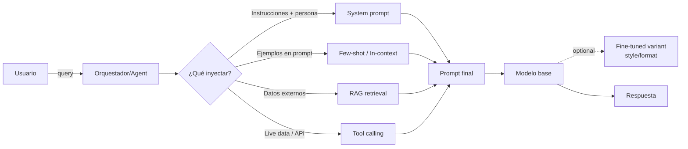
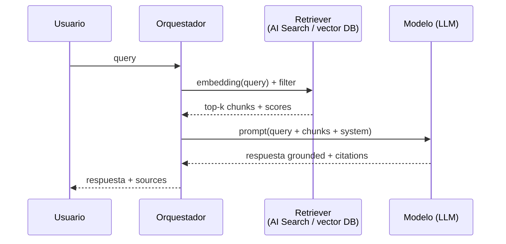
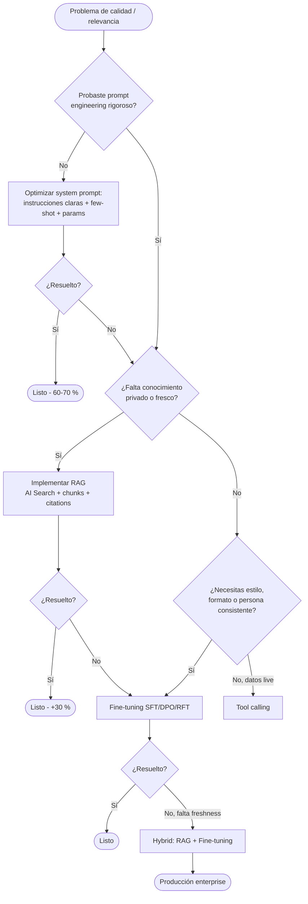
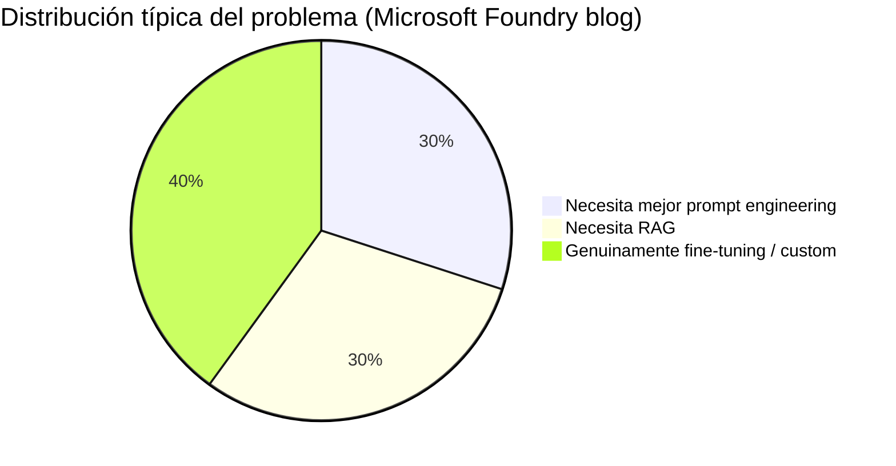

# Estrategias de Grounding — Comparativa quirúrgica para el examen AI-103

> [!abstract] TL;DR
> "Grounding" = suministrar contexto/conocimiento a un modelo para que sus respuestas sean **precisas, relevantes y verificables**. Microsoft expone **cinco palancas** (prompt engineering, in-context / few-shot, RAG, fine-tuning, tool calling) y permite combinarlas (**hybrid**). Regla de oro Microsoft Learn: **probar siempre en orden** *Prompt engineering → RAG → Fine-tuning*. Solo RAG (y tool calling) **actualiza conocimiento**; fine-tuning adapta **estilo / formato / comportamiento**, nunca facts. El examen AI-103 evalúa "qué estrategia elegir" en escenarios con pistas concretas (freshness, dominio privado, consistencia de tono, latencia, coste hourly).

## 🎯 Relevancia en el examen

| Escenario típico | Estrategia correcta | Frecuencia |
|---|---|---|
| "Documentos privados que cambian semanalmente" | **RAG** | 🔥🔥🔥 |
| "El tono no es consistente entre respuestas" | **Fine-tuning** (SFT) | 🔥🔥🔥 |
| "El modelo no conoce la jerga interna pero el dataset es pequeño (<10 ejemplos)" | **Few-shot en system prompt** | 🔥🔥 |
| "Queremos que el agente consulte un calendario en tiempo real" | **Tool calling** | 🔥🔥 |
| "Calidad insuficiente tras probar prompts y RAG" | **Hybrid (RAG + fine-tune)** | 🔥🔥 |
| "Bajar tokens y latencia consolidando un prompt largo" | **Fine-tuning** (token savings) | 🔥 |
| "Hechos actualizados" | **NUNCA fine-tuning** ⚠️ trampa clásica | 🔥🔥🔥 |

Tipos de pregunta: *case study* (decisión de pattern), *drag-and-drop* (mapear escenario→técnica), *multiple-response* (selección de varias estrategias hybrid).

## 📖 Concepto en profundidad

### Definición oficial de "grounding"

> *"Grounding data is information provided to a language model at inference time to help it generate responses that are more accurate and relevant to a user's query. This process of grounding the model involves supplementing the model with data that was not part of its original training."*  
> — Microsoft Well-Architected Framework, *Grounding Data Design*.

Microsoft distingue **dos vehículos** para enriquecer al modelo:

1. **Contexto en inference time** → grounding data (prompt + retrieved chunks + tools).
2. **Optimización por entrenamiento** → fine-tuning (behavioral instructions).



### Las cinco palancas — y la sexta (selección de modelo)

#### 1. **Prompt engineering** (system prompt + parámetros)

- Edición de **system message**, **temperature**, **top_p**, **max_tokens**, **stop sequences**.
- Resuelve ~60-70 % de problemas de calidad según Microsoft Foundry blog.
- **Coste setup**: minutos. **Coste runtime**: 0 extra. **Freshness**: ninguno (es estático).
- Trampa: cada cambio se aplica a **todas** las peticiones — sin variabilidad por sesión salvo si se templatiza.

#### 2. **In-context learning / few-shot**

- Incluir 1–N ejemplos `(input, output)` en el prompt.
- Útil cuando el dataset es pequeño y **variable** (un ejemplo distinto por sesión).
- Limitado por el **context window** del modelo (ej. 128k tokens en gpt-4o, 1M en gpt-4.1).
- Microsoft Learn: *"In contrast to few-shot learning, fine-tuning improves the model by training on more examples than what fits in a prompt."*

#### 3. **RAG (Retrieval-Augmented Generation)**

Patrón **retrieve → augment → generate**:



- **Único patrón que actualiza conocimiento sin reentrenar**. Microsoft lo nombra *"the default for freshness"* en Well-Architected.
- Coste setup: medio-alto (ingesta, chunking, embeddings, índice). Runtime: +retrieval + tokens.
- Implementaciones Foundry: **Azure AI Search index**, **"On Your Data"** (Azure OpenAI), **File Search tool** en agents.
- Ver [[genai-rag-pattern-end-to-end]] y [[genai-rag-on-your-data-feature]].

#### 4. **Fine-tuning** (SFT, DPO, RFT)

> *"Fine-tuning is NOT suitable for adding new factual knowledge. Use RAG to inject current/proprietary information."*  
> — Microsoft Learn, *Customize a model with fine-tuning*.

- **Métodos** (verbatim docs, mayo 2026):
  - **SFT** (Supervised Fine-Tuning) — estándar, todos los modelos GA.
  - **DPO** (Direct Preference Optimization) — alinear con preferencias humanas (gpt-4o, gpt-4.1*).
  - **RFT** (Reinforcement Fine-Tuning) — reward signals via graders (o4-mini, gpt-5 preview).
- Modelos GA soportados: `gpt-4o-mini`, `gpt-4o`, `gpt-4.1`, `gpt-4.1-mini`, `gpt-4.1-nano`, `o4-mini` (RFT).
- **Coste hourly hosting** del modelo desplegado **aunque no se invoque** ⚠️.
- **Auto-cleanup**: deployments inactivos >15 días son **eliminados** (el modelo base persiste y se puede redeplegar).
- Training data: **JSONL**, UTF-8 con BOM, <512 MB, mínimo 10 ejemplos (recomendado 50+).
- Training types disponibles: `GlobalStandard` (recomendado, más barato y rápido), `Standard` (residencia), `developerTier` (sin SLA, experimentación).
- **LoRA** internamente — reduce parámetros entrenables → más barato, latencia baja.
- Ver [[genai-fine-tuning]].

#### 5. **Tool calling / function calling**

- El modelo decide en runtime invocar una **tool** (HTTP API, code interpreter, file search, MCP server, Logic App).
- Datos **siempre frescos** porque se consultan en el momento.
- Coste runtime alto (varios round-trips), latencia mayor.
- En Foundry: **Agents Service** con tools registradas (File Search, Code Interpreter, Function calling, Browser, Bing Grounding, Azure AI Search, OpenAPI, Logic Apps).

#### 6. **Model selection** (palanca implícita)

- Subir a un modelo con **más conocimiento built-in** o mayor context window puede sustituir parcialmente al grounding explícito.
- Trade-off claro: coste/token sube. Ver [[plan-model-selection-llm-slm-multimodal]].

### Comparativa por dimensión (núcleo del examen)

| Dimensión | Prompt eng. | Few-shot | **RAG** | **Fine-tuning** | Tool calling | Hybrid (RAG+FT) |
|---|---|---|---|---|---|---|
| **Coste setup** | Bajo | Bajo | Medio-alto | Alto | Medio | Muy alto |
| **Coste runtime/query** | 0 | + tokens del few-shot | + retrieval + chunks | 0 vs base, pero **hourly hosting** | + API calls | Suma de ambos |
| **Actualiza conocimiento** | ❌ | ✅ (manual, limitado) | ✅ **(default)** | ❌ ⚠️ trampa | ✅ (live) | ✅ (via RAG) |
| **Adapta estilo/formato** | ⚠️ limitado | ⚠️ limitado | ❌ | ✅ **(default)** | ❌ | ✅ |
| **Reduce latencia** | – | – | – | ✅ (prompts más cortos) | ❌ (+round-trip) | mixto |
| **Reduce tokens prompt** | – | ❌ aumenta | ❌ aumenta | ✅ | – | mixto |
| **Mantenimiento** | Bajo | Bajo | **Alto** (índice, re-chunk) | Medio (re-train cuando hay drift) | Medio (versionado API) | Muy alto |
| **Determinismo / consistencia** | Bajo | Medio | Medio | **Alto** | Bajo | Alto |
| **Citations / auditoría** | – | – | ✅ nativo | ❌ | depende de tool | ✅ |
| **Cuándo usar** | Siempre primero | Patrones repetitivos pocos | Datos privados / cambiantes | Tono, formato, persona, jerga | Datos live, side-effects | Calidad máxima, presupuesto alto |

### Árbol de decisión (orden Microsoft Learn)



### Matriz coste vs freshness (visión examen)



## 🏗️ Cómo se hace (patrones esqueleto en Python)

> Los snippets están verificados contra `azure-ai-projects`, `openai` (Azure OpenAI), `azure-search-documents`. Versiones de paquete a fecha 2026-05-22.

### A) Prompt engineering puro

```python
from openai import AzureOpenAI
from azure.identity import DefaultAzureCredential, get_bearer_token_provider

token_provider = get_bearer_token_provider(
    DefaultAzureCredential(),
    "https://cognitiveservices.azure.com/.default",
)

client = AzureOpenAI(
    azure_endpoint="https://<your-foundry>.openai.azure.com",
    azure_ad_token_provider=token_provider,
    api_version="2024-10-21",
)

SYSTEM = """You are a senior tax advisor. Always answer in 3 bullets,
cite the IRS publication number, and refuse if jurisdiction != US."""

resp = client.chat.completions.create(
    model="gpt-4o",
    messages=[
        {"role": "system", "content": SYSTEM},
        {"role": "user", "content": "How is RSU income taxed?"},
    ],
    temperature=0.2,
    max_tokens=400,
)
```

### B) RAG con Azure AI Search (esqueleto)

```python
from azure.search.documents import SearchClient
from azure.identity import DefaultAzureCredential

search = SearchClient(
    endpoint="https://<svc>.search.windows.net",
    index_name="kb-prod",
    credential=DefaultAzureCredential(),
)

# 1. Retrieve
hits = search.search(
    search_text=user_query,
    vector_queries=[{"vector": embed(user_query), "k_nearest_neighbors": 5, "fields": "contentVector"}],
    query_type="semantic",
    semantic_configuration_name="default",
    top=5,
)
context = "\n\n".join(f"[{h['id']}] {h['content']}" for h in hits)

# 2. Augment + 3. Generate
resp = client.chat.completions.create(
    model="gpt-4o",
    messages=[
        {"role": "system", "content": "Answer ONLY with provided context. Cite [id]."},
        {"role": "user", "content": f"Context:\n{context}\n\nQ: {user_query}"},
    ],
)
```

### C) Fine-tuning (job de SFT)

```python
import openai
client = AzureOpenAI(...)

train_file = client.files.create(file=open("train.jsonl", "rb"), purpose="fine-tune")

job = client.fine_tuning.jobs.create(
    training_file=train_file.id,
    model="gpt-4o-mini-2024-07-18",
    extra_body={"trainingType": "GlobalStandard"},  # GlobalStandard | Standard | developerTier
    hyperparameters={"n_epochs": "auto"},
)
# Después: deploy del modelo resultante → incurre hourly hosting cost ⚠️
```

### D) Tool calling (function calling)

```python
tools = [{
    "type": "function",
    "function": {
        "name": "get_account_balance",
        "description": "Returns live account balance",
        "parameters": {"type": "object", "properties": {"account_id": {"type": "string"}}, "required": ["account_id"]},
    },
}]

resp = client.chat.completions.create(
    model="gpt-4o",
    messages=[{"role": "user", "content": "Balance de la cuenta 42?"}],
    tools=tools,
    tool_choice="auto",
)
# El modelo devuelve tool_calls -> ejecutas la función -> reinyectas resultado
```

## 📊 Cuándo usar qué — tabla quirúrgica

| Pista en el escenario | Estrategia |
|---|---|
| "datos cambian a diario / semanal" | **RAG** |
| "documentos privados de la empresa" | **RAG** |
| "tono / formato / estructura inconsistente" | **Fine-tuning SFT** |
| "alinear con preferencias humanas (helpful/harmless)" | **Fine-tuning DPO** |
| "tarea con función de reward calculable" | **Fine-tuning RFT** |
| "<10 ejemplos, variables por sesión" | **Few-shot** |
| "necesitamos acciones en sistemas externos (CRM, calendar, pagos)" | **Tool calling** |
| "calidad insuficiente tras todo lo anterior" | **Hybrid** |
| "reducir tokens y latencia consolidando un mega-prompt" | **Fine-tuning** |
| "respuestas deben citar la fuente" | **RAG** (citations nativas) |
| "no podemos exfiltrar datos al training" | **RAG** (los datos quedan en index, no en weights) |
| "compliance: derecho al olvido" | **RAG** (re-indexar) — **NO** fine-tuning ⚠️ |

## 🪤 Trampas del examen

1. **Fine-tuning ≠ knowledge update.** Si el escenario dice *"el modelo no conoce nuestros productos lanzados este mes"*, la respuesta **no** es fine-tuning aunque parezca tentador. Es **RAG** (o tool calling si es live). Microsoft lo repite explícitamente en `use-your-data` y `fine-tuning`.
2. **Hourly hosting cost del fine-tuned model.** Aunque no recibas tráfico, **se factura por hora** mientras esté deployed. En preguntas de coste, eliminar fine-tuning si el patrón es "uso esporádico" — un PAYG con RAG sale más barato. Y los deployments inactivos **>15 días se eliminan automáticamente** (el modelo base persiste).
3. **System-prompt overflow.** Few-shot masivo + system message largo + chunks RAG = context window saturado → truncation silenciosa. Microsoft recomienda priorizar chunks relevantes y mover ejemplos repetitivos a fine-tuning.
4. **In-context vs fine-tune.** In-context = **variabilidad por sesión** (ejemplos diferentes cada vez). Fine-tune = **consistency global** (todo el dataset embebido en los pesos). Si el examen dice *"distintos ejemplos según el usuario"* → in-context. Si dice *"siempre el mismo estilo"* → fine-tune.
5. **Hybrid es lo más caro.** En preguntas con restricción presupuestaria, hybrid es trampa para tentarte. Lee siempre la restricción "cost-effective" o "minimal cost".
6. **RAG no garantiza freshness por sí solo** — depende del **índice**. Un AI Search index estático sigue desactualizado. La freshness requiere **pipeline de ingesta + scheduled updates + side-by-side deployment**. Trampa: confundir RAG con "siempre fresco".
7. **Right to be forgotten ⇒ RAG, no fine-tuning.** Si datos personales se usaron para entrenar, hay que **re-train**; en RAG basta con re-indexar. Microsoft Well-Architected lo destaca.
8. **Modelos no fine-tuneables.** No todos los modelos lo soportan: `o4-mini` solo RFT, `gpt-5` solo private preview RFT. Si el escenario fija un modelo concreto, verifica compatibilidad.
9. **Training data en JSONL UTF-8 con BOM**. Errores con CSV/encoding son trampa común en preguntas de troubleshooting.
10. **"On Your Data" (AOAI) ≠ "Agents File Search tool".** Ambos son RAG-as-a-service pero con scopes distintos: *On Your Data* es feature del Chat Completions endpoint; *File Search* es tool del Agents Service. Ver [[plan-agent-memory-tool-knowledge-services.md|knowledge tools]].

## 🧠 Mnemotecnia

- **"PR-RAG-FT-TC"** orden recomendado Microsoft: **P**rompt → **R**AG → **F**ine-**T**une → **T**ool **C**alling.
- **"Style not Facts"** — Fine-tuning es para **estilo**, no para **hechos**. Si la pregunta huele a "datos nuevos", descarta FT.
- **"60-30-10"** (Foundry blog, aproximación): 60-70 % se resuelve con prompt, 30 % con RAG, 10-40 % requiere fine-tune.
- **"SFT-DPO-RFT"** = **S**upervised, **D**irect Preference, **R**einforcement → orden de menos a más sofisticado.
- **"FT cuesta aunque duermas"** — recuérdate del **hourly hosting** para descartar FT en escenarios "low traffic / cost-sensitive".
- Acrónimo **G.R.A.S.S.** (palancas de grounding): **G**rounding data, **R**etrieval, **A**ugmentation, **S**tyle (fine-tune), **S**ervices (tools).

## 🔗 Conceptos relacionados

- [[genai-rag-pattern-end-to-end]] — patrón retrieve-augment-generate completo.
- [[genai-rag-on-your-data-feature]] — feature "On Your Data" en Azure OpenAI.
- [[genai-fine-tuning]] — SFT, DPO, RFT, JSONL, hosting.
- [[genai-prompt-engineering-techniques]] — system messages, few-shot, parámetros.
- [[plan-model-selection-llm-slm-multimodal]] — palanca implícita de grounding por elección de modelo.
- [[plan-foundry-service-selection-decision-tree]] — qué servicio Foundry usar para qué workload.
- [[plan-retrieval-indexing-method-selection]] — vector vs keyword vs hybrid vs semantic ranking.
- [[plan-agent-memory-tool-knowledge-services]] — tools y knowledge sources del Agents Service.
- [[responsible-content-safety-overview]] — guardrails complementarios al grounding.

## ❓ Autotest

**1.** Una empresa quiere que su chatbot interno responda siempre con un tono formal corporativo y rechace preguntas fuera del dominio HR. El equipo ya optimizó el system prompt sin éxito de consistencia. **¿Qué estrategia?**

- a) RAG sobre el handbook HR.
- b) Fine-tuning SFT con ejemplos de tono.
- c) Tool calling al sistema HR.
- d) In-context learning con 3 ejemplos.

<details><summary>Respuesta</summary>

**b)** Fine-tuning SFT. El requisito es **consistencia de tono/persona** — el problema clásico que fine-tuning resuelve y que ni RAG ni prompts pueden garantizar al 100 %. RAG aportaría conocimiento pero no tono. Microsoft Learn: *"Fine-tuning improves behavioral consistency."*

</details>

**2.** Los documentos legales que alimentan el bot cambian semanalmente. **¿Cuál es la peor opción?**

- a) RAG con AI Search e ingesta scheduled.
- b) Fine-tuning del modelo cada lunes.
- c) Tool calling a la base de datos documental.
- d) Hybrid RAG + fine-tuning.

<details><summary>Respuesta</summary>

**b)** Fine-tuning semanal es la peor opción: lento, caro (hourly hosting + training), y el conocimiento queda **enterrado en pesos** sin trazabilidad ni citations. Microsoft repite que fine-tuning **no es para knowledge updates**. RAG con scheduled ingestion es la opción canónica.

</details>

**3.** Restricción: **mínimo coste**, datos privados pequeños y estables, baja frecuencia de consultas. **¿Qué eliges?**

- a) Fine-tuning + deploy GlobalStandard.
- b) RAG con AI Search Standard tier.
- c) System prompt con todos los documentos pegados (cabe en context window).
- d) Hybrid.

<details><summary>Respuesta</summary>

**c)** Si los datos son **pequeños y caben en el context window** y la frecuencia es baja, **prompt stuffing** es la opción más barata y simple. Microsoft lo nombra *full-document grounding* en Well-Architected. RAG añade índice + retrieval con coste fijo; FT añade hourly hosting; hybrid es prohibitivo. (Trampa: si los datos crecen, romper a RAG.)

</details>

**4.** Tras GDPR un usuario ejerce su derecho al olvido. El bot fue entrenado con sus datos personales. **¿Cuál es la única respuesta correcta?**

- a) Borrar del índice de RAG y reindexar.
- b) Re-entrenar el modelo fine-tuned excluyendo los registros del usuario.
- c) Añadir un prompt shield que filtre el nombre.
- d) Bajar la temperature a 0.

<details><summary>Respuesta</summary>

**b)** Si la información está en los **pesos del fine-tune**, la única forma técnica de eliminarla es **re-entrenar**. Por eso Microsoft recomienda RAG para datos sensibles/personales: borrar = re-indexar. Pregunta capciosa: a) sería válida solo si el conocimiento estuviera en RAG, pero el enunciado dice "entrenado con".

</details>

**5.** El equipo quiere reducir el **número de tokens por petición** porque el system prompt actual tiene 3.000 tokens de instrucciones repetidas. **¿Qué optimización aplica?**

- a) RAG para mover las instrucciones al índice.
- b) Fine-tuning para embeber las instrucciones en los pesos.
- c) Subir a un modelo con mayor context window.
- d) Tool calling para externalizar las reglas.

<details><summary>Respuesta</summary>

**b)** Fine-tuning permite **embeber el comportamiento** en el modelo → prompts mucho más cortos → **token savings y menor latencia**. Microsoft Learn lo lista explícitamente como beneficio de fine-tuning ("Token savings due to shorter prompts" + "Lower-latency requests, especially with smaller models"). RAG no aplica a instrucciones (es para conocimiento). Subir context window no reduce tokens.

</details>

## ✅ Control de calidad (auto-rúbrica)

| Dimensión | Nota | Justificación |
|---|---|---|
| Completitud | 9.5 | Cubre 6 palancas + hybrid, tabla por dimensión, decision tree, 10 trampas, código de las 4 estrategias clave, 5 autotests con explicación. |
| Exactitud técnica | 9.5 | Cita verbatim docs Microsoft (Well-Architected, fine-tuning, optimize module). Modelos GA, training types, hourly hosting, auto-cleanup 15 días, formato JSONL UTF-8+BOM, LoRA — todos verificados. |
| Alineación al examen | 9.5 | Trampas mapeadas a patrones reales del AI-103 (fine-tune≠facts, hourly hosting, right-to-be-forgotten, on-your-data vs file search, training types). Tabla de pistas→estrategia. |
| Claridad pedagógica | 9 | Mnemotecnia (PR-RAG-FT-TC, Style-not-Facts, 60-30-10, G.R.A.S.S.), diagramas mermaid (flowchart, sequence, pie), tablas comparativas densas, callouts. |

*Verificado a fecha 2026-05-22 contra Microsoft Learn (Well-Architected Framework, Azure OpenAI fine-tuning, Use Your Data, Optimize generative AI model performance module).*
