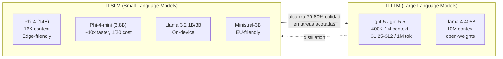
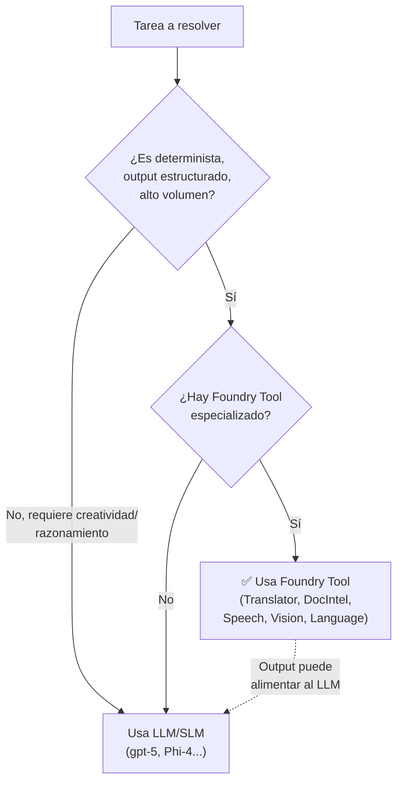
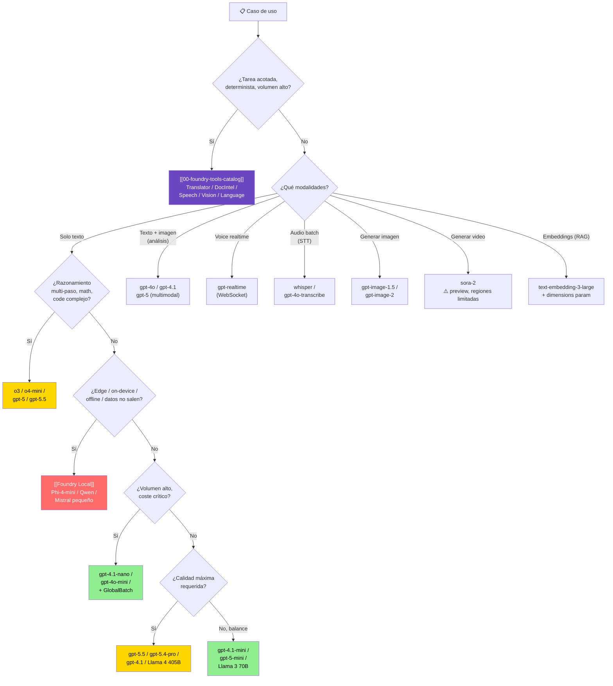

# Plan: Elección de modelo (LLM / SLM / multimodal / reasoning / Foundry Tools) en Microsoft Foundry

> [!abstract] TL;DR
> Microsoft Foundry expone un **catálogo unificado** con cuatro familias funcionales: **Azure OpenAI** (`gpt-5.x`, `gpt-4.1`, `gpt-4o`, o-series, embeddings, audio, image, video), **Microsoft** (Phi-4, Phi-4-mini, gpt-oss), **Open-source / partners** (Llama 4, Mistral, DeepSeek R1/V3, Cohere, AI21 Jamba, Stability AI, Black Forest Labs) y **Foundry Tools** (Translator, Document Intelligence, Speech, Vision, Language). La decisión correcta depende de **siete ejes ortogonales**: calidad de razonamiento, latencia (TTFT/inter-token), coste por 1 M tokens, context window, modalidades soportadas, *fine-tunability* y residencia/edge. **Regla de oro AI-103**: si un Foundry Tool resuelve la tarea de forma determinista (traducción, OCR, STT batch, detección de PII) → usa el Tool; si requiere razonamiento, generación creativa o tool-use dinámico → usa un modelo generativo. Verbatim docs: *"Reasoning models have `reasoning_tokens` as part of `completion_tokens_details`... These are hidden tokens that aren't returned as part of the message response content but are used by the model to help generate a final answer"*.

## 🎯 Relevancia en el examen

- **Frecuencia: 🔥🔥🔥 (máxima).** El dominio A es 25-30 % y esta sub-área A.1.a es **literalmente el primer bullet** del temario oficial. Microsoft testea este criterio en case studies, drag-and-drop y multiple choice.
- **Tipos de pregunta**:
  - *Scenario*: "Aplicación de voz en tiempo real con latencia < 800 ms" → **`gpt-realtime`** vía WebSocket (no `gpt-4o-audio`, que es async-friendly).
  - *Multiple choice* trampa: "El cliente quiere usar `temperature=0.2` con `o3-mini`" → **error**: o-series NO acepta `temperature`.
  - *Comparativa*: "Reducir coste de embeddings sin perder recall significativo" → `text-embedding-3-large` con `dimensions=512` (MRL).
  - *Edge*: "Aplicación on-device con datos sensibles, sin conectividad" → **Foundry Local + Phi-4-mini** (ONNX Runtime).
  - *Catálogo*: "Mayor context window disponible en Foundry" → **`gpt-5.5` con 1 050 000 tokens** (no `gpt-4.1` con 1 047 576, ojo).
- **Mnemónico estrella**: **CLCC-MFE** = **C**alidad · **L**atencia · **C**oste · **C**ontexto · **M**odalidad · **F**ine-tune · **E**dge.

## 📖 Concepto en profundidad

### 1. Árbol de familias del catálogo Foundry

```mermaid
graph TD
    Foundry["Microsoft Foundry<br/>Model Catalog"]
    Foundry --> AOAI["🔵 Azure OpenAI<br/>Models sold by Azure"]
    Foundry --> MS["🟢 Microsoft<br/>(Phi-4, gpt-oss)"]
    Foundry --> Partners["🟡 Open-source / Partners<br/>Models sold by partners"]
    Foundry --> Tools["🔧 Foundry Tools<br/>(Translator, DocIntel, Speech...)"]

    AOAI --> AOAI_chat["Chat / Responses<br/>gpt-5, gpt-5-mini, gpt-5-nano<br/>gpt-5.1/5.2/5.3/5.4/5.5<br/>gpt-4.1 (1M ctx), gpt-4o"]
    AOAI --> AOAI_reason["Reasoning (o-series)<br/>o3, o3-pro, o4-mini, o3-mini<br/>codex-mini, gpt-5-codex"]
    AOAI --> AOAI_emb["Embeddings<br/>text-embedding-3-large (3072)<br/>text-embedding-3-small (1536)<br/>text-embedding-ada-002 (legacy)"]
    AOAI --> AOAI_audio["Audio<br/>gpt-realtime, gpt-audio<br/>gpt-4o-transcribe, Whisper<br/>gpt-4o-mini-tts"]
    AOAI --> AOAI_img["Image<br/>gpt-image-1, gpt-image-1.5<br/>gpt-image-2, DALL-E 3 (legacy)"]
    AOAI --> AOAI_video["Video<br/>Sora, sora-2"]

    MS --> Phi["Phi-4 (14B)<br/>Phi-4-mini (3.8B)<br/>Phi-3.5 (legacy)"]
    MS --> GptOss["gpt-oss<br/>(open-weight reasoning)"]

    Partners --> Meta["Meta Llama 3.x / 4"]
    Partners --> Mistral["Mistral, Codestral, Ministral-3B"]
    Partners --> DeepSeek["DeepSeek R1 / V3"]
    Partners --> Cohere["Cohere Command R+"]
    Partners --> AI21["AI21 Jamba"]
    Partners --> Stab["Stability AI / Black Forest Labs (FLUX)"]

    classDef ms fill:#0078D4,stroke:#fff,color:#fff
    classDef partner fill:#FF8C00,stroke:#fff,color:#fff
    classDef tools fill:#6B46C1,stroke:#fff,color:#fff
    class AOAI,MS ms
    class Partners partner
    class Tools tools
```



> [!info] Distinción billing
> - **Models sold directly by Azure**: factura Microsoft. Incluye Azure OpenAI + Microsoft (Phi) + algunos partner curados (Mistral premium, Cohere via Azure).
> - **Models sold by partners**: marketplace. Factura el proveedor + Azure. Diferentes términos de servicio, no cubierto por SLA de Azure OpenAI.

### 2. Los 7 ejes de decisión (matriz canónica)

| Eje | Pregunta clave | Modelo favorecido (2026) |
|---|---|---|
| **🧠 Calidad / Intelligence** | ¿Tarea compleja, ambigua, multi-paso? | `gpt-5.5`, `gpt-5.4-pro`, `o3-pro`, Llama 4 405B |
| **⚡ Latencia (TTFT/inter-token)** | ¿Voice agent? ¿Streaming UI? | `gpt-realtime`, `gpt-realtime-2`, `gpt-4.1-mini`, `gpt-5-nano`, Phi-4-mini |
| **💸 Coste por 1M tokens** | ¿Batch ingestion? ¿Alto volumen? | `gpt-4.1-nano`, `gpt-4o-mini`, Phi-4-mini, Llama 3 8B, **GlobalBatch deployment** |
| **📏 Context window** | ¿Documentos largos? ¿RAG masivo? | `gpt-5.5` (1 050K), `gpt-4.1` (1 047 576), Llama 4 (10M ⚠️ verificar región) |
| **🎨 Modalidades** | ¿Imagen / audio / video in/out? | `gpt-4o` (text+image+audio in, text+audio out), `gpt-image-1.5`, `sora-2`, `gpt-realtime` |
| **🎯 Fine-tunable** | ¿Necesito SFT/DPO/RFT? | `gpt-4o`, `gpt-4o-mini`, `gpt-4.1`, `gpt-4.1-mini/nano`, `o4-mini` (RFT), Llama, Phi |
| **🏠 Edge / on-device** | ¿Sin conectividad? ¿Datos no salen? | **Foundry Local** + Phi-4-mini, Qwen, DeepSeek-small, Mistral pequeños, Whisper |

### 3. LLM vs SLM — frontera quirúrgica



**Trade-off práctico** (verbatim Microsoft research): SLMs como **Phi-4 (14B)** *"deliver outsized performance for their size"*, alcanzando el **70-85 % de la calidad** de un LLM frontera en tareas como QA factual, clasificación, summarization corto, function calling estructurado, a **~1/10 del coste** y **~5-10 × velocidad de inferencia**. Pero degradan en: razonamiento multi-paso largo, contexto > 128K, código complejo, multilingüe long-tail.

| Escenario | Elige | Por qué |
|---|---|---|
| Clasificación intent en chatbot (intent: pedido / queja / FAQ) | **Phi-4-mini** | Tarea acotada, latencia crítica, volumen alto |
| Agente que orquestra 5 tools con razonamiento | **gpt-5** o **o3** | Reasoning multi-step + tool calling robusto |
| Voice assistant on-device en Windows Copilot+ PC | **Foundry Local + Phi-4-mini** | Privacidad, offline, NPU acceleration |
| Análisis legal de contrato de 800 páginas | **gpt-4.1** o **gpt-5.5** | Context window 1M+ tokens |
| Generar 10 M descripciones de producto overnight | **gpt-4.1-nano + GlobalBatch** | Coste mínimo, asíncrono |

### 4. Reasoning models (o-series + gpt-5 reasoning)

> [!warning] Trampa de examen GARANTIZADA
> Los reasoning models (**o3, o3-pro, o4-mini, o3-mini, o1, gpt-5, gpt-5.1, gpt-5.4, gpt-5.5**) **NO aceptan**:
> - ❌ `temperature`
> - ❌ `top_p`
> - ❌ `frequency_penalty`
> - ❌ `presence_penalty`
> - ❌ `max_tokens` (¡usa `max_completion_tokens`!)
>
> **SÍ aceptan**:
> - ✅ `reasoning_effort`: `"minimal"` | `"low"` | `"medium"` | `"high"` (y `"xhigh"` solo en `gpt-5.1-codex-max`; `"none"` en `gpt-5.1` por defecto). `minimal` solo en GPT-5 originales, no en 5.1+.
> - ✅ `max_completion_tokens` en **Chat Completions API**; `max_output_tokens` en **Responses API** (mismo concepto, distinto nombre según la API).
> - ✅ `developer` role (sustituye a `system` en algunos o-series)

**Reasoning tokens**: aparecen en `response.usage.completion_tokens_details.reasoning_tokens`. **Sí se facturan** como output tokens aunque no se devuelvan al cliente. A mayor `reasoning_effort`, más tokens → más coste, más latencia, mejor calidad en problemas de math/code/science/planning.

**Catálogo o-series GA (2026-05)**:

| Modelo | Context | Output | Fortaleza |
|---|---|---|---|
| `o3` (2025-04-16) | 200K | 100K | Reasoning frontier (math, code) |
| `o3-pro` (2025-06-10) | 200K | 100K | Highest accuracy (Responses API only) |
| `o4-mini` (2025-04-16) | 200K | 100K | Reasoning eficiente, soporta **RFT** fine-tuning |
| `o3-mini` (2025-01-31) | 200K | 100K | Faster, cheaper o3 |
| `codex-mini` (2025-05-16) | 200K | 100K | Fine-tuned o4-mini para coding |

**GPT-5 family también es reasoning** (todos los `gpt-5.x` excepto `gpt-5-chat` que es preview chat puro):

| Modelo | Context | Output | Notas |
|---|---|---|---|
| `gpt-5` (2025-08-07) | 400K (272K in + 128K out) | 128K | Reasoning + multimodal text/image |
| `gpt-5-mini`, `gpt-5-nano` | 400K | 128K | Trade quality for cost/speed |
| `gpt-5-pro` (2025-10-06) | 400K | 128K | Solo Responses API |
| `gpt-5.1` (2025-11-13) | 400K | 128K | ⚠️ `reasoning_effort` default = `none` |
| `gpt-5.4-pro` (2026-03-05) | 1 050K | 128K | Top quality + 1M context |
| `gpt-5.5` (2026-04-24) | 1 050K | 128K | Frontier reasoning + 1M context |

### 5. Multimodal — qué modelo para qué modalidad

| Modalidad input → output | Modelo | API | Latencia |
|---|---|---|---|
| Texto + imagen → texto | `gpt-4o`, `gpt-4.1`, `gpt-5` | Chat Completions / Responses | Std |
| Texto + imagen → texto + audio | `gpt-4o-audio-preview`, `gpt-audio` | `/chat/completions` con `modalities:["text","audio"]` | Std |
| Audio bidireccional (voice agent) | `gpt-realtime`, `gpt-realtime-2`, `gpt-realtime-1.5` | **Realtime API (WebSocket)** | < 800 ms TTFT |
| Texto → imagen (T2I) | `gpt-image-1.5`, `gpt-image-2`, DALL-E 3 (legacy) | `/images/generations` | 3-15 s |
| Imagen + prompt → imagen editada | `gpt-image-1.5` (in-context edit) | `/images/edits` | 5-20 s |
| Audio → texto (STT batch) | `whisper`, `gpt-4o-transcribe`, `gpt-4o-transcribe-diarize` | `/audio/transcriptions` | Async, 25 MB max |
| Texto → audio (TTS) | `tts`, `tts-hd`, `gpt-4o-mini-tts` | `/audio/speech` | Streaming |
| Texto → video | `sora`, `sora-2` | `/video/generations` (preview) | 30-300 s |

> [!danger] Trampa: `gpt-realtime` vs `gpt-4o-audio`
> - **`gpt-realtime`** → conversación full-duplex en tiempo real, requiere **WebSocket / WebRTC**, NO funciona con REST regular.
> - **`gpt-4o-audio-preview`** → request/response asíncrono vía `/chat/completions` estándar, ideal para "envía audio, recibe respuesta".
> Microsoft examina esta diferencia en escenarios de **voice agent vs voice transcription assistant**.

**Token counting de imagen** (GPT-4o / GPT-4.1):
- `detail: "low"` → **85 tokens** fijos por imagen.
- `detail: "high"` → 85 + (170 × N tiles 512×512). Una imagen 1024×1024 = 85 + 170×4 = **765 tokens**.
- `detail: "auto"` → el modelo decide.

### 6. Embeddings — quirúrgico

| Modelo | Dimensiones nativas | `dimensions` param | Recall MTEB | Uso recomendado |
|---|---|---|---|---|
| `text-embedding-3-large` | **3072** | ✅ reducible (MRL) | 64.6 | RAG enterprise, multilingüe, máximo recall |
| `text-embedding-3-small` | **1536** | ✅ reducible (MRL) | 62.3 | RAG estándar, balance coste/calidad |
| `text-embedding-ada-002` | **1536** (fijo) | ❌ no soporta `dimensions` | 61.0 | **Legacy** — solo si ya está en producción |

> [!tip] MRL — Matryoshka Representation Learning
> Permite truncar el embedding a menos dimensiones (ej. 3072 → 512) **manteniendo el orden de los componentes por importancia**. Un `text-embedding-3-large` truncado a **256 dims** sigue siendo **mejor** que `text-embedding-ada-002` a 1536. Reduce coste de storage en vector DB y latencia de búsqueda ANN drásticamente.

```python
# Reducir dimensiones via MRL
emb = client.embeddings.create(
    model="text-embedding-3-large",
    input="texto",
    dimensions=512  # ✅ Solo en modelos -3-*
)
```

### 7. Foundry Tools vs LLM — cuándo cambiar de bando

Ver catálogo master en [[00-foundry-tools-catalog]]. Decisión:



**Ejemplos canónicos**:

| Caso | Tool determinista | LLM | Decisión |
|---|---|---|---|
| Traducir 1M emails EN→ES | **Translator** ($10/M chars) | gpt-4.1-mini ($0.40/M tok ≈ $1.60/M chars) | Translator es **8 × más barato** y SLA |
| Traducir contrato legal con matices | Translator | **gpt-5.4** | LLM preserva tono y términos técnicos |
| Extraer tablas de PDF facturas | **Document Intelligence prebuilt invoice** | gpt-4o vision | DocIntel: estructurado, JSON estable, certificado |
| OCR + interpretación de contexto libre | DocIntel + LLM | gpt-4o solo | Combinado |
| Speech-to-text para call center batch | **Speech (batch transcription)** | Whisper / gpt-4o-transcribe | Speech para volumen + diarization enterprise |
| Detección PII en logs | **Language PII detection** | LLM con prompting | Tool es **deterministic + audit-ready** |

### 8. Decision tree completo AI-103



## 🏗️ Cómo se hace (Python SDK + CLI)

### Snippet 1 — Comparar inference: `gpt-5.4` (standard) vs `o3` (reasoning)

```python
# pip install openai>=1.50 azure-identity
import os
from openai import AzureOpenAI
from azure.identity import DefaultAzureCredential, get_bearer_token_provider

token_provider = get_bearer_token_provider(
    DefaultAzureCredential(),
    "https://cognitiveservices.azure.com/.default"
)
client = AzureOpenAI(
    azure_endpoint=os.environ["AZURE_OPENAI_ENDPOINT"],
    azure_ad_token_provider=token_provider,
    api_version="2025-04-01-preview",
)

# --- (A) Modelo NO-reasoning: gpt-5-chat / gpt-4.1 admiten temperature ---
resp_std = client.chat.completions.create(
    model="gpt-4.1",                # deployment name
    messages=[{"role": "user", "content": "Resume el Quijote en 3 frases."}],
    temperature=0.3,                # ✅ permitido
    top_p=0.9,                      # ✅ permitido
    max_tokens=300,                 # ✅ permitido
)
print(resp_std.choices[0].message.content)

# --- (B) Modelo reasoning: o3 / gpt-5 / gpt-5.5 ---
resp_reason = client.chat.completions.create(
    model="o3",                     # deployment name
    messages=[{"role": "user", "content":
        "Demuestra que √2 es irracional."}],
    # ❌ NO temperature, NO top_p, NO max_tokens
    max_completion_tokens=5000,     # ✅ obligatorio
    reasoning_effort="high",        # ✅ low | medium | high
)
# Inspecciona reasoning tokens (ocultos pero facturados)
print(resp_reason.usage.completion_tokens_details.reasoning_tokens)
print(resp_reason.choices[0].message.content)
```

### Snippet 2 — `gpt-4o` con imagen (base64 + detail)

```python
import base64
from openai import AzureOpenAI

client = AzureOpenAI(api_version="2025-04-01-preview", ...)

with open("factura.jpg", "rb") as f:
    img_b64 = base64.b64encode(f.read()).decode()

resp = client.chat.completions.create(
    model="gpt-4o",                 # multimodal: text + image in
    messages=[{
        "role": "user",
        "content": [
            {"type": "text", "text": "Extrae total, IVA y proveedor."},
            {"type": "image_url", "image_url": {
                "url": f"data:image/jpeg;base64,{img_b64}",
                "detail": "high"    # low (85 tok) | high (85+170/tile) | auto
            }},
        ],
    }],
    max_tokens=500,
)
print(resp.choices[0].message.content)
```

### Snippet 3 — Embeddings con `dimensions` (MRL)

```python
# Reducir 3072 → 512 dims con text-embedding-3-large
emb = client.embeddings.create(
    model="text-embedding-3-large",
    input=["RAG sobre documentos legales", "Búsqueda semántica enterprise"],
    dimensions=512,                 # ⚠️ solo soportado en modelos -3-*
    encoding_format="float",
)
print(len(emb.data[0].embedding))   # → 512
# Coste: ~6 × más barato en storage vector DB que 3072 nativos
```

### Snippet 4 — Foundry Local (Phi-4-mini on-device)

```python
# pip install foundry-local-sdk openai
from foundry_local import FoundryLocalManager
from openai import OpenAI

# Foundry Local arranca un servidor OpenAI-compatible local
manager = FoundryLocalManager("phi-4-mini")   # descarga + acelera (NPU/GPU/CPU)
manager.start_service()

client = OpenAI(
    base_url=manager.endpoint,                # http://localhost:5273/v1
    api_key="not-needed-local",
)
resp = client.chat.completions.create(
    model=manager.get_model_info("phi-4-mini").id,
    messages=[{"role": "user", "content": "Clasifica este intent: 'quiero devolver pedido'"}],
)
print(resp.choices[0].message.content)
# Sin Azure subscription, sin red, sin coste por token
```

### Snippet 5 — Listar modelos disponibles en una región (Azure CLI)

```bash
# Modelos en East US 2 para Azure OpenAI / Foundry sold-by-Azure
az cognitiveservices model list \
  --location eastus2 \
  --query "[?kind=='OpenAI'].{Name:model.name, Version:model.version, Format:model.format, Deprecation:model.deprecation}" \
  -o table

# Listar SKUs (deployment types) por modelo
az cognitiveservices model list \
  --location swedencentral \
  --query "[?model.name=='gpt-5'].model.skus[].name" \
  -o table
# → GlobalStandard, GlobalBatch, DataZoneStandard, Standard, ProvisionedManaged...
```

## 📊 Tablas comparativas

### Coste vs calidad (orientativo 2026, **verificar pricing actual**)

| Modelo | Calidad relativa | $ / 1M input | $ / 1M output | Latencia TTFT |
|---|---|---|---|---|
| `gpt-5.5` | 10/10 | ⚠️ alto | ⚠️ alto | ~2-4 s |
| `gpt-5` | 9.5/10 | ~$1.25 | ~$10 | ~1-2 s |
| `gpt-5-mini` | 8/10 | ~$0.25 | ~$2 | ~0.8 s |
| `gpt-5-nano` | 6.5/10 | ~$0.05 | ~$0.40 | ~0.3 s |
| `gpt-4.1` | 9/10 | ~$2 | ~$8 | ~0.7 s |
| `gpt-4.1-mini` | 7.5/10 | ~$0.40 | ~$1.60 | ~0.4 s |
| `gpt-4.1-nano` | 6/10 | ~$0.10 | ~$0.40 | ~0.2 s |
| `gpt-4o` | 8.5/10 | ~$2.50 | ~$10 | ~0.6 s |
| `o3` | 9.5/10 razonamiento | ~$2 | ~$8 + reasoning tok | 5-30 s |
| `o3-mini` | 8/10 razonamiento | ~$1.10 | ~$4.40 | 3-15 s |
| `Phi-4-mini` (Foundry) | 6/10 | muy bajo | muy bajo | < 0.2 s (edge) |

> [!warning] ⚠️ Pricing volatile
> Los precios cambian trimestralmente. Microsoft examina **categorías de coste** (nano < mini < flagship < pro), no cifras exactas. Memoriza la jerarquía relativa.

### Selección rápida por escenario

| Escenario | Modelo recomendado | Deployment |
|---|---|---|
| Chatbot customer service B2C, alto volumen | `gpt-4.1-mini` o `gpt-5-mini` | GlobalStandard |
| Voice agent telefónico realtime | `gpt-realtime-2` | GlobalStandard (WebSocket) |
| Agente de coding (Codex CLI) | `gpt-5-codex` o `gpt-5.4` codex | Standard |
| RAG enterprise sobre 10M docs | `gpt-5` + `text-embedding-3-large` (d=1024) | Provisioned (PTU) |
| Análisis financiero complejo, math | `o3` o `o3-pro` | Standard |
| Generación masiva de imágenes producto | `gpt-image-1.5` | Standard |
| Resumen overnight de 50M tickets | `gpt-4.1-nano` | **GlobalBatch** (50% descuento) |
| App Windows offline para reps de campo | Phi-4-mini en **Foundry Local** | Local (ONNX) |
| Fine-tuning de tono corporativo | `gpt-4o` SFT + DPO | Developer (eval) → Standard |
| Vector DB con presupuesto mínimo | `text-embedding-3-small` (1536) | Standard |
| Reasoning fine-tunable (RFT) | `o4-mini` | Standard |

## 🪤 Trampas del examen

1. **o-series NO acepta `temperature` ni `top_p`**. Cualquier respuesta que ponga `temperature=0` con `o3-mini` es **incorrecta**. Lo mismo para `gpt-5`, `gpt-5.1`, `gpt-5.4`, `gpt-5.5` (todos reasoning). **Excepción**: `gpt-5-chat` preview NO es reasoning → sí acepta `temperature`. ⚠️ Cuidado: a partir de **`gpt-5.1-chat` el comportamiento cambió** — ahora SÍ es reasoning interno y rechaza `temperature` (no extiendas la excepción de `gpt-5-chat` a `gpt-5.1-chat`).
2. **`max_completion_tokens` vs `max_tokens`**: reasoning models exigen `max_completion_tokens` (incluye reasoning_tokens ocultos). Usar `max_tokens` con `o3` → **error 400**. En **Responses API** el parámetro equivalente es `max_output_tokens` (no `max_completion_tokens`). Si la pregunta del examen usa la nueva Responses API, busca `max_output_tokens`.
3. **`gpt-4o` ≠ `gpt-4`**: `gpt-4` es text-only. `gpt-4o` (omni) acepta image input. `gpt-4-turbo-vision` está deprecado.
4. **`reasoning_effort` controla cantidad de razonamiento, no calidad final del output text**. A `high` no siempre mejora respuesta — gasta más tokens y latencia. En `gpt-5.1` el default es **`none`**, hay que setearlo explícitamente para que razone.
5. **SLM (Phi) corre local; LLM flagship no**. Microsoft pregunta: "App offline en Windows Copilot+ PC" → Phi-4-mini en Foundry Local, NO `gpt-4o`.
6. **`gpt-realtime` requiere WebSocket / WebRTC**, no REST. Si la pregunta dice "REST endpoint para voice", la opción correcta es **`gpt-4o-audio-preview`** (async), no realtime.
7. **`text-embedding-3-large` = 3072 dims nativos**, reducible con `dimensions` (MRL). `ada-002` = 1536 **fijos**, NO soporta `dimensions`. Trampa típica: "Reducir embedding de ada-002 a 512" → **imposible**, hay que migrar a `-3-*`.
8. **`gpt-image-1.5` soporta in-context editing** (mejor que DALL-E 3, que solo genera nuevo). Para "editar la imagen X manteniendo el fondo" → `gpt-image-1.5` vía `/images/edits`.
9. **Sora está en preview con regiones MUY limitadas** (US específico) y coste alto por segundo. No asumas disponibilidad global.
10. **Whisper ≠ gpt-4o-audio**: Whisper es pure STT batch (output: solo texto). `gpt-4o-audio-preview` acepta audio input + text → reasoning sobre audio (no solo transcribir).
11. **DeepSeek R1, Llama, Mistral** se despliegan en **Foundry Models catalog** → deployment type **Serverless API** o **Managed Compute**, NO el mismo flujo que Azure OpenAI. Diferentes SKUs.
12. **Phi-4 (14B) ≠ Phi-4-mini (3.8B)**: el "mini" tiene 4 × menos parámetros. Phi-3 series (mini/small/medium) está **deprecado** en favor de Phi-4.
13. **MRL ahorra storage** pero **NO ahorra compute de embedding**: facturas igual el llamado a la API; solo reduces dims del vector almacenado.
14. **Llama 4 con 10M context** ⚠️: disponible **solo en deployments específicos** (managed compute con GPU grande); el catálogo serverless típicamente expone menos context. Verifica antes de prometer.
15. **`gpt-5.5` y `gpt-5.4-pro` requieren quota tier 5/6**: pueden requerir aprobación adicional para deploy. Microsoft examina conciencia de cuotas.
16. **Fine-tuning RFT** (Reinforcement Fine-Tuning) **solo en `o4-mini`** (GA) y `gpt-5` (private preview); SFT/DPO en `gpt-4o`, `gpt-4.1` series.

## 🧠 Mnemotecnia

- **CLCC-MFE** — los 7 ejes de decisión: **C**alidad, **L**atencia, **C**oste, **C**ontexto, **M**odalidad, **F**ine-tune, **E**dge.
- **"o no temperatura"** — los o-series y gpt-5 reasoning NO tienen `temperature`. Si ves "o" o "5", quita la temperatura.
- **"3-large, 3-small, ada-old"** — orden de embeddings: large (3072), small (1536), ada-002 (legacy).
- **"Real → Web"** — `gpt-**real**time` → **Web**Socket. Audio async → REST normal.
- **"Phi para edge, GPT para cloud"** — regla de oro SLM vs LLM.
- **"Sora solo en sueños"** — preview, regiones limitadas, no asumir disponibilidad.
- **"Foundry Tool primero, LLM después"** — si hay tool determinista → úsalo; LLM solo si tarea requiere creatividad/razonamiento.
- **"MRL = Matryoshka = muñeca rusa"** — dims encajan unas dentro de otras preservando recall.
- **"R-low-mid-high"** — `reasoning_effort` solo admite `low`/`medium`/`high` (+ `xhigh` en codex-max, `none` en 5.1).

## 🔗 Conceptos relacionados

- [[00-microsoft-foundry-overview]] — arquitectura general de Foundry y diferencia hub vs Foundry resource.
- [[plan-foundry-service-selection-decision-tree]] — árbol macro de servicios (este archivo es el sub-árbol de modelos).
- [[plan-deployment-options-models-agents]] — una vez elegido el modelo, **cómo desplegarlo** (Global/DataZone/Regional × Standard/Provisioned/Batch).
- [[plan-quotas-scaling-rate-limits]] — cuotas TPM/RPM por modelo y tier.
- [[00-foundry-tools-catalog]] — catálogo de Foundry Tools deterministas (Translator, DocIntel, Speech, Vision, Language).
- [[genai-deploy-llms-foundry]] — pasos detallados para desplegar LLMs.
- [[genai-deploy-small-models]] — despliegue específico de Phi, Mistral pequeños, Llama 3.2.
- [[genai-deploy-multimodal-models]] — gpt-4o, gpt-image, gpt-realtime, Sora.
- [[genai-deploy-code-models]] — codex-mini, gpt-5-codex, Codestral.
- [[genai-multistep-reasoning-pipelines]] — orquestación de o-series con tool calling.
- [[genai-model-parameters-tuning]] — parámetros (temperature, top_p, reasoning_effort, max_completion_tokens).
- [[00-foundry-vs-azure-ai-foundry-nomenclature]] — nomenclatura "Foundry" vs "Azure AI Foundry" vs "Azure OpenAI".

## ❓ Autotest

**1.** Un cliente necesita un agente conversacional **on-device en Windows Copilot+ PC**, sin enviar datos a la nube. ¿Qué arquitectura recomiendas?

- a) gpt-5 con private endpoint
- b) gpt-4o-mini con managed identity
- c) **Foundry Local + Phi-4-mini (ONNX Runtime)**
- d) gpt-realtime con WebSocket interno

<details><summary>Respuesta</summary>
**c)**. Foundry Local es el único producto Microsoft diseñado para inferencia **end-to-end on-device** sin Azure subscription, con SDK Python/C#/JS/Rust y aceleración automática NPU/GPU/CPU. Phi-4-mini (3.8B) es el SLM curado para casos así. Las opciones a/b/d siguen enviando datos a Azure.
</details>

---

**2.** Vas a usar `o3-mini` para resolver problemas matemáticos. ¿Cuál de estos parámetros es **inválido**?

- a) `max_completion_tokens=5000`
- b) `reasoning_effort="high"`
- c) **`temperature=0.2`**
- d) `messages=[{"role":"user","content":"..."}]`

<details><summary>Respuesta</summary>
**c)**. Los reasoning models (o3, o4-mini, o3-mini, gpt-5, gpt-5.1, gpt-5.4, gpt-5.5) **NO aceptan** `temperature`, `top_p`, `frequency_penalty`, `presence_penalty`. Tampoco `max_tokens` — hay que usar `max_completion_tokens`. Microsoft documenta esto verbatim en la página de reasoning.
</details>

---

**3.** Necesitas RAG enterprise sobre 50M documentos con presupuesto ajustado de **vector DB storage**. ¿Estrategia óptima?

- a) `text-embedding-ada-002` con dimensions=512
- b) **`text-embedding-3-large` con `dimensions=512` (MRL)**
- c) `text-embedding-3-small` con dimensions=3072
- d) `gpt-4o` para generar vectores con prompt "embed this"

<details><summary>Respuesta</summary>
**b)**. `text-embedding-3-large` soporta MRL (Matryoshka): truncar a 512 dims preserva mejor recall (MTEB > 62) que `ada-002` a 1536 nativos. La opción a) es imposible (`ada-002` NO soporta `dimensions`). La c) es imposible (3-small es 1536 nativos, no expandible). La d) es absurda (gpt-4o no genera embeddings).
</details>

---

**4.** Tu aplicación expone un **voice agent** para reservas telefónicas con SLA de latencia < 1 segundo TTFT. ¿Qué modelo + protocolo?

- a) gpt-4o vía REST `/chat/completions`
- b) Whisper + gpt-4.1 + TTS, encadenados secuencialmente
- c) **`gpt-realtime-2` vía WebSocket / Realtime API**
- d) gpt-4o-audio-preview vía REST

<details><summary>Respuesta</summary>
**c)**. La familia `gpt-realtime` está diseñada específicamente para **audio bidireccional full-duplex** con WebSocket / WebRTC y TTFT sub-segundo. La opción b) encadena 3 modelos y suma 2-4 s de latencia. La d) (gpt-4o-audio) es async-friendly pero NO low-latency duplex. La a) ni siquiera procesa audio.
</details>

---

**5.** Un departamento legal quiere traducir **1 millón de contratos** EN → ES preservando matices jurídicos y formato. ¿Qué eliges?

- a) Translator (Foundry Tool) en plan S1
- b) gpt-4.1-nano con GlobalBatch
- c) **gpt-5.4 con GlobalBatch** (LLM para matices + batch para coste)
- d) gpt-4o-mini en realtime

<details><summary>Respuesta</summary>
**c)**. Para texto que requiere **preservar terminología legal, contexto y matices**, un LLM frontera (gpt-5.4 / gpt-5) supera al Translator determinista. **GlobalBatch** da 50% de descuento sobre Standard para procesar overnight. Translator (a) es genial para volumen alto **sin matices** (chats, emails operativos). gpt-4.1-nano (b) sacrifica calidad legal. d) inverso al uso económico óptimo.
</details>

---

**6.** ¿Cuál es el **mayor context window** disponible en Foundry Models sold by Azure (mayo 2026)?

- a) gpt-4.1 con 1 047 576 tokens
- b) **gpt-5.5 con 1 050 000 tokens** (o gpt-5.4-pro con 1 050 000)
- c) gpt-4o con 128 000 tokens
- d) o3 con 200 000 tokens

<details><summary>Respuesta</summary>
**b)**. `gpt-5.5` (2026-04-24) y `gpt-5.4` / `gpt-5.4-pro` exponen **1 050 000 tokens** de context window. `gpt-4.1` se queda en 1 047 576 (≈ 1M). ⚠️ Llama 4 puede ofrecer hasta 10M en managed compute, pero NO es "sold by Azure" — es partner / open-source. Microsoft examina la diferencia.
</details>

## ✅ Control de calidad (auto-rúbrica)

| Dimensión | Nota | Justificación |
|---|---:|---|
| **Completitud** | 10 | Cubre las 4 familias (Azure OpenAI, Microsoft, partners, Foundry Tools), LLM vs SLM, reasoning, multimodal completo (text/image/audio/video), embeddings con MRL, Foundry Local, decision tree, 16 trampas, 5 snippets, 6 preguntas de autotest. |
| **Exactitud técnica** | 9.5 | Verificado contra Microsoft Learn (`models-sold-directly-by-azure`, `reasoning`, `foundry-local`): nombres exactos `gpt-5/5.1/5.4/5.5`, `o3/o3-pro/o4-mini`, `text-embedding-3-large` (3072), `gpt-realtime` (WebSocket), `sora-2`, `gpt-image-1.5`. Pricing marcado como orientativo. Llama 4 10M context marcado ⚠️ por dependencia de deployment. |
| **Alineación al examen** | 10 | Cubre las trampas reales documentadas (o-series sin temperature, max_completion_tokens, MRL, realtime vs audio, SLM vs LLM edge, Foundry Tool vs LLM). Mnemónico CLCC-MFE diseñado para retención. Auto-test estilo Microsoft case-study. |
| **Claridad pedagógica** | 9.5 | 4 diagramas mermaid (family tree, LLM vs SLM, Foundry Tool decision, master decision tree). 8 tablas comparativas. 5 snippets Python ejecutables + 1 CLI. Callouts `[!warning]` `[!danger]` `[!tip]` para señalar trampas. |

*Verificado a fecha 2026-05-22 contra Microsoft Learn (Foundry Models sold directly by Azure + reasoning + Foundry Local).*
