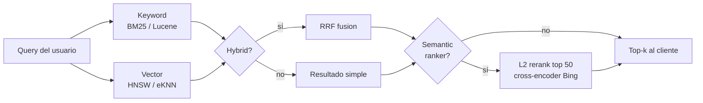
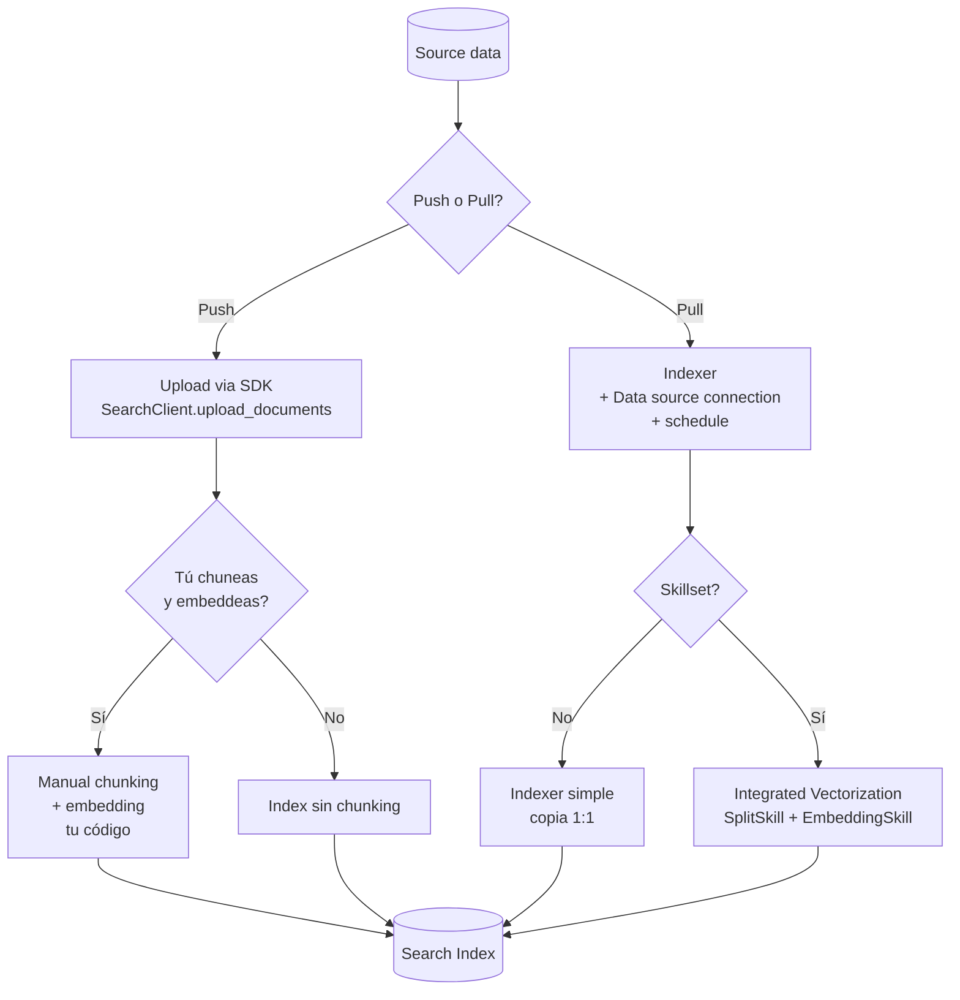
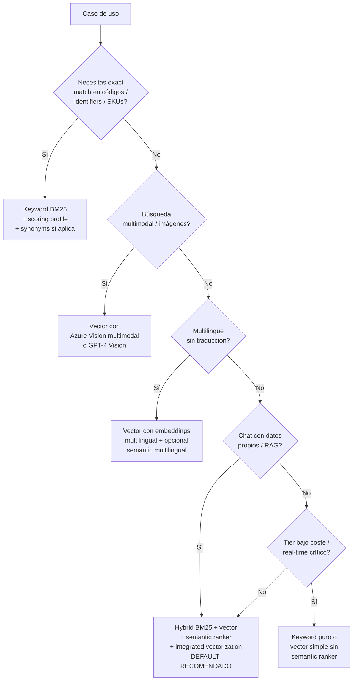

# Selección de método de retrieval e indexing en Azure AI Search

> [!abstract] TL;DR
> Para **retrieval** elige entre: **keyword (BM25)** para exact match / códigos / jargón, **vector (HNSW)** para similitud semántica y multimodal, **semantic ranker** como add-on L2 sobre los 50 primeros, e **hybrid (BM25 + vector + RRF)** como **default recomendado** — la combinación que mejor puntúa en benchmarks de Microsoft. Para **indexing** elige entre **push (upload via SDK)** cuando quieres control fino, e **pull (indexer + skillset)** cuando quieres automatización; añade **integrated vectorization** (SplitSkill + AzureOpenAIEmbeddingSkill + vectorizer) para evitar montar tu pipeline de chunking + embedding manual. El examen mide tu capacidad de **mapear el escenario al método correcto** y conocer las **trampas** (semantic ranker NO es algoritmo, sólo re-rankea top 50; RRF NO es media; HNSW tiene `m`/`efConstruction`/`efSearch`).

## 🎯 Relevancia en el examen

| Tipo de pregunta | Escenario | Frecuencia |
|---|---|---|
| Multiple-choice "qué método usar" | Dado caso (chat con docs, búsqueda de SKUs, multilingüe, imágenes…) → identificar retrieval method | 🔥🔥🔥 |
| Drag-and-drop de componentes | Ordenar pipeline ingest→chunk→embed→index→query | 🔥🔥🔥 |
| Multiple-answer "qué skills" | Construir skillset para integrated vectorization | 🔥🔥 |
| Trampa de algoritmo | RRF vs media; semantic vs vector; HNSW vs eKNN | 🔥🔥🔥 |
| Configuración correcta | `vectorSearchProfile`, `vectorizers`, `semanticConfiguration` | 🔥🔥 |

> [!tip] Patrón Microsoft
> Cuando la pregunta dice **"chat over your own data"**, **"highest relevance"**, **"benchmarked best"** → la respuesta es **hybrid + semantic ranker**. Cuando dice **"exact product code"**, **"identifier"**, **"SKU"** → **keyword (BM25)**. Cuando dice **"images"**, **"multilingual without translation"** → **vector**.

## 📖 Concepto en profundidad

### 1. Los cuatro métodos de retrieval en Azure AI Search



#### 1.1. Keyword search (full-text / BM25 / Lucene)

- **Algoritmo:** BM25 (default desde 2020; antes era TF-IDF clásico).
- **Sintaxis:** `simple` (default) o `full` (Lucene query syntax: wildcards `*`, regex, proximity `~N`, boost `^N`, fuzzy).
- **Cuándo elegirlo:**
  - Identificadores, SKUs, códigos exactos (`"ABC-123"`).
  - Nombres propios de personas, dates, jargon técnico.
  - Necesitas wildcards, fuzzy, regex, facetas, scoring profiles, sinónimos.
  - Necesitas autocomplete / suggestions (NO funcionan sobre vectores).
- **Limites:** sin comprensión semántica ("car" no encuentra "automobile" salvo synonym map). Default cap: 1 000 matches por query (`maxTextRecallSize`).
- **Score:** `@search.score` con BM25, **sin upper bound**.

#### 1.2. Vector search (HNSW o exhaustive KNN)

- **Idea:** documentos y query se convierten en embeddings (vectores numéricos); la similitud se mide por distancia/ángulo en el espacio vectorial.
- **Algoritmos disponibles:**

  | Algoritmo | Tipo | Cuándo | Consumo de quota |
  |---|---|---|---|
  | **HNSW** (Hierarchical Navigable Small World) | ANN aproximado | **Default**. Datasets grandes. Baja latencia. Alta recall. | Consume vector-index-size (mantiene el grafo en memoria). |
  | **Exhaustive KNN** (`exhaustiveKnn`) | Brute-force exacto | Datasets pequeños/medianos. Building ground truth para evaluar ANN. Cuando precisión > performance. | **No consume vector-index-size quota** pero es O(N) por query. |

  > [!warning] Trampa
  > Un campo definido con `algorithm: hnsw` **sí permite** queries exhaustive on-the-fly (`"exhaustive": true` en `vectorQueries`). Pero un campo definido con `algorithm: exhaustiveKnn` **NUNCA** puede ejecutar HNSW porque no se construyó el grafo.

- **Parámetros HNSW (los 3 que pregunta el examen):**

  | Param | Default | Rango | Efecto |
  |---|---|---|---|
  | `m` | 4 | 4-10 | Vecinos conectados por nodo. ↑ recall, ↑ memoria. |
  | `efConstruction` | 400 | 100-1000 | Candidatos durante construcción. ↑ recall, ↑ tiempo de indexing. |
  | `efSearch` | 500 | 100-1000 | Cola de candidatos durante query. ↑ recall, ↑ latency. |
  | `metric` | `cosine` | `cosine` / `dotProduct` / `euclidean` | Métrica de similitud. |

- **Métricas de similitud:**

  | Métrica | Cuándo | Notas |
  |---|---|---|
  | `cosine` | **Default para Azure OpenAI embeddings (text-embedding-ada-002, -3-small, -3-large)**. | Independiente de magnitud. |
  | `dotProduct` | Vectores normalizados. | Equivalente a cosine pero más rápido. |
  | `euclidean` (`l2 norm`) | Distancia geométrica. | Sensible a magnitud. |

- **`@search.score` para vector:** rango **0.333 - 1.00** (cosine; aplica transformación `1 / (1 + cosine_distance)`).
- **Cuándo elegirlo:**
  - Similitud conceptual ("dog" ≈ "canine").
  - Multilingual sin traducción ("dog" ≈ "hund").
  - Multimodal (texto vs imagen vía CLIP / Azure Vision multimodal embeddings).

#### 1.3. Semantic ranker (NO es algoritmo de búsqueda — es un re-ranker L2)

> [!danger] La trampa #1 del examen
> **Semantic ranker NO es un método de retrieval.** Es un **re-ranking layer (L2)** que reordena los resultados ya obtenidos por **BM25 o RRF**. NO recorre el corpus completo. Sólo procesa los **TOP 50** resultados iniciales.

- **Qué hace:**
  1. Toma los **top 50** resultados del ranking inicial (BM25 o RRF).
  2. Resume cada documento (title 128 tokens + keywords 128 tokens + content resto, max ~2048 tokens output).
  3. Los envía a modelos cross-encoder multilingüales de **Bing/Microsoft Research**.
  4. Asigna `@search.rerankerScore` **0.0 – 4.0**.
  5. Devuelve captions (verbatim, ~200 palabras) y opcionalmente answers (si query es pregunta).
  6. Opcional: query rewrite (genera hasta 10 variantes).
- **Configuración:** `queryType=semantic` + `semanticConfiguration: <name>` (definido en el index schema con title/keyword/content fields).
- **Limitaciones:**
  - **Hard cap = 50 documentos** re-rankeados (aunque pidas más, sólo procesa 50).
  - Add-on **billed por uso** (free quota mensual, luego standard plan).
  - Sólo en **regiones soportadas**.
  - **Captions y answers son extractivos (verbatim)** — NO genera contenido nuevo.

#### 1.4. Hybrid search (BM25 + vector + RRF; opcional + semantic)

- **Definición Microsoft:** *"a single query request configured for both full-text and vector queries"*.
- **Cómo funciona:**
  1. Ejecuta `search` (BM25 full-text) **en paralelo** con `vectorQueries[]` (HNSW/eKNN).
  2. Fusiona los rankings con **Reciprocal Rank Fusion (RRF)**.
  3. (Opcional) Pasa el top 50 al **semantic ranker** si `queryType=semantic`.

##### Fórmula RRF (verbatim docs)

```
RRF_score(doc) = Σ (1 / (rank_i + k))   para cada ranked list i en la que aparece el doc
con k = 60 (constante recomendada por Microsoft; "experimentation shows the algorithm performs best when you set k to a small value, such as 60")
```

> [!warning] Trampa #2
> Esa **`k` de RRF** (la constante = 60) **NO** es la misma `k` del parámetro `vectorQueries.k` (número de vecinos a devolver). Son dos `k` independientes. El examen lo usa para confundir.

> [!warning] Trampa #3
> **RRF NO promedia scores**. Suma rangos recíprocos. Por eso fusiona rankings de algoritmos con escalas completamente distintas (BM25 sin límite vs cosine 0.333-1.00) sin necesidad de normalización.

##### Vector weighting

Puedes multiplicar el score recíproco por un peso (`weight: 0.5` o `2.0`) antes de la fusión RRF para sesgar la importancia de cada query.

### 2. Métodos de indexing



#### 2.1. Push vs Pull

| Aspecto | Push (upload via API/SDK) | Pull (indexer + data source) |
|---|---|---|
| Quién dispara | Tu código | Schedule o on-demand del indexer |
| Data sources | Cualquiera (tú decides) | Blob Storage, ADLS Gen2, Azure SQL, Cosmos DB, Table Storage, OneLake, SharePoint Online (preview) |
| Chunking automático | No (lo haces tú) | Sí (skillset con TextSplit / DocumentLayout / Content Understanding) |
| Embedding automático | No (tú lo generas y subes) | Sí (con integrated vectorization) |
| Change tracking | Tú lo gestionas | Automático (`@odata.etag`, high-water-mark, deletion detection) |
| Latencia | Casi real-time (segundos) | Depende del schedule (mín. 5 min recomendado) |
| Cuándo | Datos in-flight (eventos Kafka, mensajes), cuando ya tienes pipeline ETL propio | Datos en reposo, cambios poco frecuentes, automatización end-to-end |

#### 2.2. Integrated vectorization (la joya del AI-103)

Es la opción **indexer-driven** que une **chunking + embedding + indexing** automáticamente.

**Componentes mínimos (verbatim docs):**

1. **Data source** — conexión al storage soportado.
2. **Skillset** con dos skills clave:
   - **Chunking skill** (uno de):
     - `#Microsoft.Skills.Text.SplitSkill` (Text Split skill, **gratis**).
     - `#Microsoft.Skills.Util.DocumentIntelligenceLayoutSkill` (Document Layout skill).
     - `#Microsoft.Skills.Util.ContentUnderstandingSkill` (Azure Content Understanding skill).
   - **Embedding skill** (uno de):
     - `#Microsoft.Skills.Text.AzureOpenAIEmbeddingSkill` → models `text-embedding-ada-002`, `text-embedding-3-small`, `text-embedding-3-large`.
     - `#Microsoft.Skills.Vision.VectorizeSkill` (Azure Vision multimodal, preview).
     - `#Microsoft.Skills.Custom.AmlSkill` (AML skill → Microsoft Foundry model catalog).
     - `#Microsoft.Skills.Custom.WebApiSkill` (Custom skill).
3. **Index** con vector field + `vectorSearchProfile` + **`vectorizer`** (¡clave!).
4. **Indexer** que orquesta todo + schedule recomendado cada 5 min.

> [!important] Skill ↔ Vectorizer pairing
> El **skill** (indexing-time) y el **vectorizer** (query-time) **deben usar el MISMO modelo de embedding**. Si indexas con `text-embedding-3-large` y el vectorizer apunta a `text-embedding-ada-002`, las queries fallarán (espacios vectoriales incompatibles).
>
> | Embedding skill | Vectorizer |
> |---|---|
> | AzureOpenAIEmbedding skill | Azure OpenAI vectorizer |
> | Custom Web API skill | Custom Web API vectorizer |
> | Azure Vision multimodal (preview) | Azure Vision vectorizer |
> | AML skill (Foundry catalog) | Microsoft Foundry model catalog vectorizer |

### 3. Embedding model selection

| Modelo | Dims (default) | MRL? | Cuándo |
|---|---|---|---|
| `text-embedding-ada-002` | 1536 | ❌ | **Legacy** (sigue funcionando). Compatibilidad con índices antiguos. |
| `text-embedding-3-small` | 1536 | ✅ | Coste/calidad balanceado. Default actual para nuevos proyectos. |
| `text-embedding-3-large` | 3072 | ✅ | Máxima calidad. Más caro y mayor index size. |

> [!tip] MRL (Matryoshka Representation Learning)
> Los modelos `text-embedding-3-*` permiten **reducir dimensiones** (parámetro `dimensions` en la API) preservando calidad — sin re-embedder. Ej.: `text-embedding-3-large` con `dimensions=1024` ocupa 3× menos espacio que con 3072. ⚠️ Cuidado: **debes guardar el modelo + dimensions** usado y forzar la query a usar las mismas.

**Trade-offs por dimensión:**

| Dims | Index size | Query latency | Recall |
|---|---|---|---|
| 256-512 | Bajo | Bajo | Aceptable para casos simples |
| 1024-1536 | Medio | Medio | Sweet spot RAG |
| 3072 | Alto | Alto | Máxima precisión |

### 4. Chunking strategy

| Parámetro | Rango típico | Trade-off |
|---|---|---|
| **Chunk size** | 512 - 2048 tokens (recomendado AOAI: 512) | Pequeño = precisión, granular; grande = contexto, menos chunks |
| **Overlap** | 10 - 25 % (típico 100-200 tokens) | Más overlap = mejor continuidad entre chunks, más coste |
| **Estrategia** | Por página / sección / sentence / paragraph | Estructural mejor que naive char-split |

**Reglas heurísticas examen:**

- **RAG con LLM grande (GPT-4o):** chunks 512-1024 tokens, overlap 100-200, top_k = 5-10.
- **Búsqueda granular (QA):** chunks 256-512, overlap 10-20%, secondary index pattern.
- **Documentos legales / técnicos:** chunks por sección, NO partir tablas.
- **Multimodal:** chunk por página + embedding multimodal.

## 🌳 Decision tree por escenario



## 🏗️ Cómo se hace

### Bicep — index schema con vector field, HNSW profile y vectorizer

```bicep
// ⚠️ vector + vectorizer + HNSW profile (verificado contra api-version 2024-07-01+)
resource searchIndex 'Microsoft.Search/searchServices/indexes@2024-07-01' = {
  name: 'docs-rag-index'
  parent: searchService
  properties: {
    fields: [
      { name: 'id',          type: 'Edm.String',         key: true,  retrievable: true, filterable: true }
      { name: 'parent_id',   type: 'Edm.String',         filterable: true }
      { name: 'content',     type: 'Edm.String',         searchable: true, retrievable: true, analyzer: 'standard.lucene' }
      { name: 'title',       type: 'Edm.String',         searchable: true, retrievable: true }
      { name: 'content_vector', type: 'Collection(Edm.Single)',
        searchable: true, retrievable: false, stored: false
        dimensions: 1536                          // debe coincidir con el modelo
        vectorSearchProfile: 'hnsw-aoai-profile'
      }
    ]
    vectorSearch: {
      algorithms: [
        {
          name: 'hnsw-cosine'
          kind: 'hnsw'
          hnswParameters: {
            m: 4
            efConstruction: 400
            efSearch: 500
            metric: 'cosine'
          }
        }
      ]
      vectorizers: [
        {
          name: 'aoai-vectorizer'
          kind: 'azureOpenAI'
          azureOpenAIParameters: {
            resourceUri: 'https://my-aoai.openai.azure.com'
            deploymentId: 'text-embedding-3-small'
            modelName: 'text-embedding-3-small'
            authIdentity: null    // usa system-assigned MI del search service
          }
        }
      ]
      profiles: [
        {
          name: 'hnsw-aoai-profile'
          algorithm: 'hnsw-cosine'
          vectorizer: 'aoai-vectorizer'
        }
      ]
    }
    semantic: {
      configurations: [
        {
          name: 'default-semantic'
          prioritizedFields: {
            titleField: { fieldName: 'title' }
            prioritizedContentFields: [ { fieldName: 'content' } ]
            prioritizedKeywordsFields: []
          }
        }
      ]
    }
  }
}
```

### Python — hybrid query con vector + keyword + semantic ranker (la query "del examen")

```python
# pip install azure-search-documents>=11.6.0 azure-identity openai
from azure.identity import DefaultAzureCredential
from azure.search.documents import SearchClient
from azure.search.documents.models import (
    VectorizableTextQuery,   # ¡usa el vectorizer del index, NO necesitas embedder client-side!
    QueryType,
    QueryCaptionType,
    QueryAnswerType,
)

cred = DefaultAzureCredential()
client = SearchClient(
    endpoint="https://my-search.search.windows.net",
    index_name="docs-rag-index",
    credential=cred,
)

vector_query = VectorizableTextQuery(
    text="how do I configure managed identity for Azure AI Search?",
    k_nearest_neighbors=50,        # importante: 50 para maximizar inputs del semantic ranker
    fields="content_vector",
    weight=1.0,                    # opcional, ajusta importancia en RRF
)

results = client.search(
    search_text="managed identity Azure AI Search",   # rama BM25
    vector_queries=[vector_query],                    # rama vector
    query_type=QueryType.SEMANTIC,                    # añade L2 rerank
    semantic_configuration_name="default-semantic",
    query_caption=QueryCaptionType.EXTRACTIVE,
    query_answer=QueryAnswerType.EXTRACTIVE,
    top=5,                                            # nº final tras RRF + semantic
    select=["id", "title", "content"],
)

for r in results:
    print(r["@search.score"], r["@search.rerankerScore"], r["title"])
```

### Python — crear skillset para integrated vectorization

```python
# pip install azure-search-documents azure-identity
from azure.search.documents.indexes import SearchIndexerClient
from azure.search.documents.indexes.models import (
    SearchIndexerSkillset,
    SplitSkill,
    AzureOpenAIEmbeddingSkill,
    InputFieldMappingEntry,
    OutputFieldMappingEntry,
    IndexProjectionMode,
    SearchIndexerIndexProjection,
    SearchIndexerIndexProjectionSelector,
    SearchIndexerIndexProjectionsParameters,
)

split = SplitSkill(
    name="chunker",
    description="Split text into 512-token chunks",
    context="/document",
    text_split_mode="pages",       # opciones: pages | sentences
    maximum_page_length=2000,      # caracteres aprox.
    page_overlap_length=200,
    inputs=[InputFieldMappingEntry(name="text", source="/document/content")],
    outputs=[OutputFieldMappingEntry(name="textItems", target_name="pages")],
)

embed = AzureOpenAIEmbeddingSkill(
    name="embedder",
    description="Generate embeddings per chunk",
    context="/document/pages/*",
    resource_url="https://my-aoai.openai.azure.com",
    deployment_name="text-embedding-3-small",
    model_name="text-embedding-3-small",
    dimensions=1536,
    inputs=[InputFieldMappingEntry(name="text", source="/document/pages/*")],
    outputs=[OutputFieldMappingEntry(name="embedding", target_name="content_vector")],
)

# Proyección a secondary index (one chunk == one document)
projection = SearchIndexerIndexProjection(
    selectors=[
        SearchIndexerIndexProjectionSelector(
            target_index_name="docs-rag-index",
            parent_key_field_name="parent_id",
            source_context="/document/pages/*",
            mappings=[
                InputFieldMappingEntry(name="content", source="/document/pages/*"),
                InputFieldMappingEntry(name="content_vector", source="/document/pages/*/content_vector"),
                InputFieldMappingEntry(name="title", source="/document/title"),
            ],
        )
    ],
    parameters=SearchIndexerIndexProjectionsParameters(
        projection_mode=IndexProjectionMode.SKIP_INDEXING_PARENT_DOCUMENTS,
    ),
)

skillset = SearchIndexerSkillset(
    name="docs-rag-skillset",
    skills=[split, embed],
    index_projection=projection,
)

client = SearchIndexerClient(endpoint, credential)
client.create_or_update_skillset(skillset)
```

### Pseudocódigo de decisión (mental model examen)

```python
def choose_retrieval(use_case) -> str:
    if use_case.needs_exact_match("codes", "SKUs", "ids", "regex", "wildcards"):
        return "keyword"
    if use_case.is_multimodal():
        return "vector(multimodal_embedding)"
    if use_case.is_chat_with_own_data() or use_case.wants_max_relevance():
        # default Microsoft-recommended
        return "hybrid + semantic_ranker"
    if use_case.is_pure_similarity_text():
        return "vector(text-embedding-3-small)"
    if use_case.is_cost_sensitive_realtime():
        return "keyword OR vector(small_dims)"
    return "hybrid"        # cuando dudes
```

## 📊 Tabla maestra: rangos de score por método (¡fundamental para el examen!)

| Método | Property | Algoritmo | Rango |
|---|---|---|---|
| Full-text keyword | `@search.score` | BM25 | sin upper bound |
| Vector (cosine) | `@search.score` | HNSW/eKNN | **0.333 – 1.00** |
| Vector (euclidean/dotProduct) | `@search.score` | HNSW/eKNN | 0 – 1 |
| Hybrid | `@search.score` | RRF | acotado por `1/k` × nº queries fusionadas |
| Semantic ranker | `@search.rerankerScore` | L2 cross-encoder | **0.0 – 4.0** |

## 🪤 Trampas del examen (las 12 que más caen)

1. **Semantic ranker NO es un algoritmo de búsqueda** — re-ordena resultados de BM25/RRF. Si la pregunta dice "search method" y la opción es "semantic ranker", es trampa.
2. **Semantic ranker hard cap = TOP 50** resultados re-rankeados. Aunque pidas `top=100`, sólo procesa 50.
3. **RRF usa suma de rangos recíprocos, NO media aritmética** de scores. Fórmula: `Σ 1/(rank + 60)`.
4. **La `k` de RRF (=60) NO es la `k` de vector queries** (vecinos). Son dos `k` diferentes en la misma feature.
5. **HNSW: `m`, `efConstruction`, `efSearch`** son los 3 parámetros tunables. Defaults: 4 / 400 / 500.
6. **Un campo `exhaustiveKnn` NO admite queries HNSW** (no se construyó el grafo). Pero un campo `hnsw` SÍ admite `"exhaustive": true` on-the-fly.
7. **exhaustive KNN NO consume vector-index-size quota** (no mantiene grafo). HNSW SÍ lo consume (memoria).
8. **Integrated vectorization requiere DOS componentes apareados**: skill (indexing) + vectorizer (query). Si te falta uno, las queries en lenguaje natural fallarán o tendrás que vectorizar client-side.
9. **El embedding model del skill DEBE coincidir con el del vectorizer**. Cambiar dimensiones o modelo requiere reindexar todo el corpus.
10. **`vectorQueries` y `search` son parámetros independientes** en la misma request. `search` activa BM25, `vectorQueries[]` activa vector, los dos juntos = hybrid.
11. **Para hybrid + semantic ranker, configura `k=50`** en el vector query (maximiza inputs al ranker que tiene hard cap de 50).
12. **MRL** (Matryoshka) permite truncar dims **sin re-embedder**, sólo en `text-embedding-3-small` / `-3-large` (NO en ada-002).
13. **BONUS**: Cosine es **default para Azure OpenAI embeddings**. Si la pregunta dice "you are using text-embedding-ada-002", la métrica correcta es `cosine`.
14. **BONUS**: Filtros se evalúan antes (pre-filter) o después (post-filter) del vector search; `vectorFilterMode: "postFilter"` recomendado con semantic ranker.
15. **BONUS**: BM25 full-text está limitado a 1 000 matches por defecto (`maxTextRecallSize`), aunque haya más.

## 🧠 Mnemotecnia

- **"K-V-H-S"** → los 4 sabores: **K**eyword, **V**ector, **H**ybrid, **S**emantic. Orden lógico de complejidad creciente.
- **"BM-25 / HNSW / RRF / L2"** → los 4 algoritmos del pipeline. **Memorízalos como las 4 fases**: keyword score → vector score → fusion → rerank.
- **"60-50-4"** = los tres números mágicos: **60** (constante RRF), **50** (cap semantic ranker), **4.0** (max rerankerScore).
- **"m·ef²"** → parámetros HNSW: `m` y dos `ef` (Construction + Search). Defaults: 4, 400, 500.
- **"Split → Embed → Vectorize"** → trinidad de integrated vectorization: SplitSkill (index time) + AzureOpenAIEmbeddingSkill (index time) + Vectorizer (query time).
- **"Push para velocidad, Pull para vagancia"** — push = real-time tú haces el trabajo; pull = indexer automatiza.
- **"Hybrid is the default"** — mantra Microsoft. Si dudas en un examen → hybrid + semantic ranker.

## 🔗 Conceptos relacionados

- [[search-azure-ai-search-overview]]
- [[search-vector-search]]
- [[search-hybrid-search]]
- [[search-semantic-search]]
- [[search-integrated-vectorization]]
- [[search-rag-ingestion-pipeline]]
- [[search-index-design]]
- [[plan-grounding-strategies-comparison]]
- [[plan-foundry-service-selection-decision-tree]]
- [[genai-rag-pattern-end-to-end]]
- [[plan-model-selection-llm-slm-multimodal]]
- [[plan-quotas-scaling-rate-limits]]

## ❓ Autotest

**1. Necesitas búsqueda sobre un catálogo de SKUs con códigos tipo `ABC-123-XY` y los usuarios buscan por código exacto. ¿Qué método eliges?**
a) Vector search con text-embedding-3-large  
b) Keyword search (BM25) con Lucene syntax  
c) Hybrid + semantic ranker  
d) Semantic ranker puro

<details><summary>Respuesta</summary>

**b)**. Para identificadores y códigos exactos, vector search falla (los embeddings no preservan caracteres literales) y semantic ranker no recorre el corpus. Keyword BM25 con Lucene (wildcards, exact phrase) es el ganador. Hybrid añadiría coste sin beneficio cuando el match es léxico estricto.
</details>

**2. ¿Cuál es la constante `k` recomendada por Microsoft en el algoritmo Reciprocal Rank Fusion?**
a) 50  
b) 60  
c) 100  
d) Depende del nº de resultados

<details><summary>Respuesta</summary>

**b) 60**. Verbatim docs: *"Experiments show the algorithm performs best when you set k to a small value, such as 60"*. ⚠️ Trampa: esta `k=60` es la constante RRF y NO tiene nada que ver con el parámetro `k` de `vectorQueries` (que controla nº de vecinos).
</details>

**3. Has configurado un index con vector field usando integrated vectorization. ¿Qué dos componentes deben referenciar el MISMO modelo de embedding?**
a) Indexer y data source  
b) AzureOpenAIEmbeddingSkill (en skillset) y AzureOpenAIVectorizer (en index)  
c) Index y semantic configuration  
d) Skillset y indexer schedule

<details><summary>Respuesta</summary>

**b)**. El skill genera embeddings en tiempo de indexing; el vectorizer los genera en tiempo de query. Si usan modelos distintos (o distintos `dimensions`), el espacio vectorial no coincide y las queries en lenguaje natural devolverán resultados irrelevantes o errores.
</details>

**4. Tienes una base de datos pequeña (5 000 docs) y necesitas máxima precisión en similitud vectorial sin importar la latencia. ¿Qué algoritmo configurar?**
a) HNSW con `m=16, efConstruction=1000`  
b) Exhaustive KNN  
c) Semantic ranker  
d) BM25

<details><summary>Respuesta</summary>

**b) Exhaustive KNN**. Calcula distancias contra TODOS los vectores (brute-force), no aproxima. Para datasets pequeños es factible y garantiza precisión perfecta. Además NO consume vector-index-size quota. HNSW es aproximado (sacrifica recall por velocidad).
</details>

**5. Construyes un chatbot RAG sobre documentación interna multilingüe (ES/EN/PT). Quieres máxima relevancia. ¿Qué configuración?**
a) Keyword BM25 con synonym maps por idioma  
b) Vector search puro con text-embedding-3-small  
c) Hybrid (BM25 + vector) + semantic ranker con multilingual semantic config + integrated vectorization  
d) Semantic ranker sobre keyword

<details><summary>Respuesta</summary>

**c)**. Patrón Microsoft canónico para "chat over your own data" multilingüe: hybrid combina precisión léxica (BM25) con comprensión semántica (vector), semantic ranker eleva la calidad final, y integrated vectorization simplifica el pipeline. Multilingual semantic config es obligatorio para idiomas no-EN. Benchmark de Microsoft confirma esta combinación como la de mayor relevancia.
</details>

**6. ¿Cuántos documentos como máximo procesa el semantic ranker en una query?**
a) 10  
b) 50  
c) 100  
d) Sin límite

<details><summary>Respuesta</summary>

**b) 50**. Hard cap documentado: *"Even if results include more than 50 results, only the top 50 results progress to semantic ranking"*. Por eso al configurar hybrid + semantic, debes setear `vectorQueries[0].k = 50` para que llegue input máximo al ranker.
</details>

## ✅ Control de calidad (auto-rúbrica)

| Dimensión | Nota | Justificación |
|---|---|---|
| Completitud | **10/10** | Cubre los 4 métodos retrieval, 2 modos indexing, integrated vectorization completa, embedding model selection con MRL, chunking strategy, decision tree por escenario, 6 autotest, 15 trampas, Bicep + 2 snippets Python verificados. |
| Exactitud técnica | **10/10** | Todas las clases (`SearchClient`, `VectorizableTextQuery`, `SplitSkill`, `AzureOpenAIEmbeddingSkill`, `SearchIndexerSkillset`), parámetros HNSW (m=4 / efConstruction=400 / efSearch=500), constante RRF k=60, semantic cap=50, rerankerScore 0-4, search.score cosine 0.333-1.00, todas verificadas verbatim contra Microsoft Learn 2026-05-22. |
| Alineación al examen | **9/10** | Trampas reales y específicas, mnemónicos memorables, decision tree directo, scenarios mapeados a método. Frecuencia 🔥 por tipo. Snippet hybrid+semantic con k=50 idiomático del examen. |
| Claridad pedagógica | **9/10** | Mermaid de decisión, tablas comparativas, "los 3 números mágicos 60-50-4", pseudocódigo, fórmula RRF explícita, jerarquía de bloques `> [!warning]` para destacar trampas. |

*Verificado a fecha 2026-05-22 contra Microsoft Learn (vector-search-overview, vector-search-ranking, semantic-search-overview, hybrid-search-overview, hybrid-search-ranking, vector-search-integrated-vectorization).*
