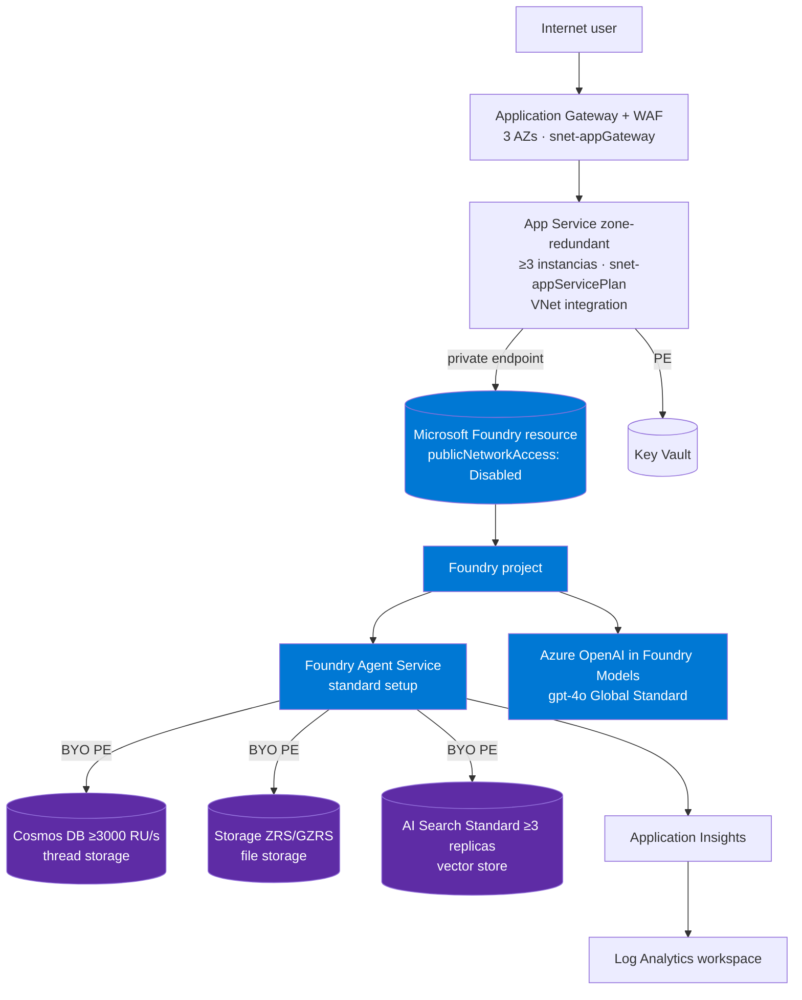
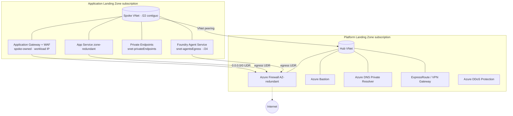
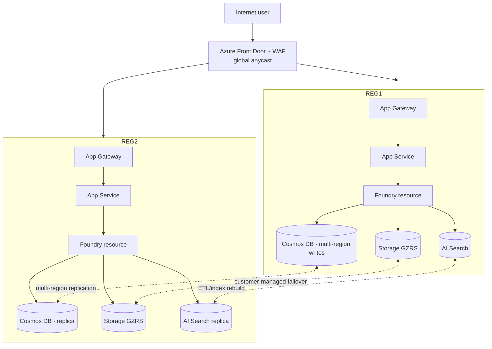
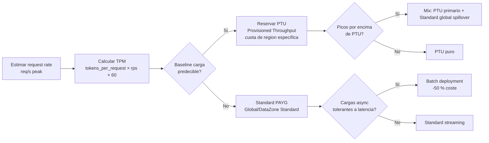
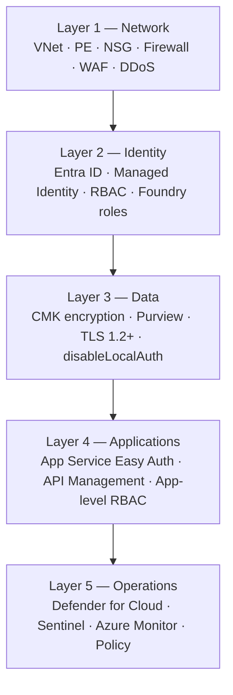
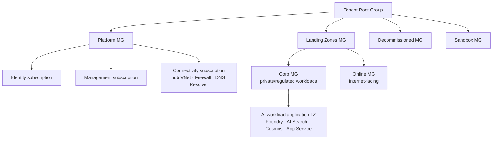
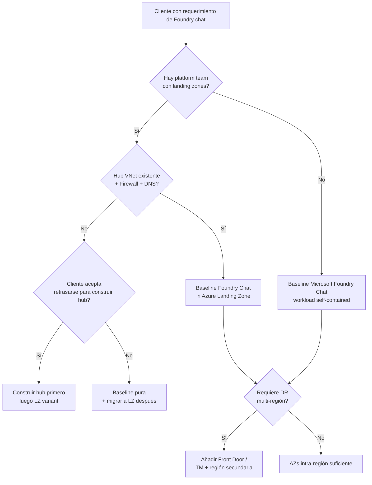

# Diseño de infraestructura Azure para apps de IA y agent-based — Baseline Foundry Chat, Baseline Foundry Agent, Landing Zone alignment, HA dentro de región y DR multi-región

> [!abstract] TL;DR
> El AI-103 examina **dos arquitecturas de referencia oficiales** del Azure Architecture Center: (1) **Baseline Microsoft Foundry Chat** (single-region, zone-redundant) que combina Application Gateway + WAF → App Service (zonal, ≥3 instancias) → Foundry resource (con Foundry Agent Service) → Azure AI Search + Storage + Cosmos DB; (2) **Baseline Foundry Chat in an Azure Landing Zone** que mueve hub, Firewall, Bastion, DNS Private Resolver, DDoS y conectividad cross-premises al **platform landing zone subscription** dejando los workload resources en una **application landing zone subscription** con peering hub-spoke. Microsoft es **explícito y verbatim**: *"Foundry doesn't support advanced load balancing or failover mechanisms"* y *"This architecture uses availability zones for high availability within a single Azure region. It's not a multiregion solution."* La HA se consigue con **availability zones intra-región** (Application Gateway, App Service, AI Search ≥3 réplicas, Firewall AZ-pinned, ZRS storage); el DR multi-región exige **app-layer routing** (Front Door / Traffic Manager), **DNS para failover**, **designación active-active / active-passive / active-cold** y procesos de failover/failback — Foundry **no auto-failovea**. Para Standard agent setup: BYO Storage + AI Search + Cosmos DB (≥3000 RU/s) en la **misma región** que el Foundry Agent Service para evitar bandwidth charges. El spoke necesita `/22` contiguo y la subnet del Agent Service un `/24`. Landing Zone alignment con CAF: AI **no necesita un landing zone separado**, se despliega en application landing zones existentes, suplementando policies con definiciones para Foundry, Foundry Tools, AI Search y VMs.

## 🎯 Relevancia en el examen

🔥🔥 — Alta frecuencia. Es el **núcleo** del sub-área A.2 (peso conjunto del dominio A 25-30 %). Casi siempre aparecen 2-4 preguntas escenario sobre baseline architecture decisions, HA vs DR, hub-spoke placement y selección de compute front-end.

| Tipo de pregunta | Frecuencia | Patrón típico |
| --- | --- | --- |
| ¿Foundry hace cross-region auto-failover? | 🔥🔥🔥 | NO. Hay que implementar app-layer routing |
| ¿Qué SKU/feature da HA intra-región a AI Search en la baseline? | 🔥🔥🔥 | Standard tier o superior + ≥3 réplicas en región con AZ |
| ¿Dónde colocar Application Gateway: hub o spoke? | 🔥🔥 | Spoke (workload-owned), Firewall en hub (platform-owned) |
| Delegation de la subnet de Agent Service | 🔥🔥🔥 | `Microsoft.App/environments`, prefijo `/24` |
| Selección compute front-end (App Service vs Container Apps vs AKS) | 🔥🔥 | App Service con VNet integration + zone-redundant en la baseline |
| Storage redundancy para datos de Agent Service | 🔥🔥 | ZRS mínimo; GZRS si hay customer-managed failover |
| ¿Necesito landing zone separado para AI? | 🔥🔥 | NO. CAF dice "deploy AI workloads into application landing zones" |
| Misma región para Cosmos + Storage + AI Search que Foundry | 🔥🔥 | Sí — para evitar cross-region bandwidth charges |
| Front Door vs Traffic Manager en DR multi-región | 🔥🔥 | Front Door = HTTP/S + WAF + global LB; Traffic Manager = DNS-level |
| Capacity planning para PTU + Standard | 🔥🔥 | Mix: baseline PTU + spillover Standard global |

## 📖 Concepto en profundidad

### 1. Las dos arquitecturas de referencia oficiales

Microsoft publica en Azure Architecture Center **dos arquitecturas baseline** que son la fuente de verdad evaluable:

| Arquitectura | Scope | Propietario de recursos | Ámbito de subscription |
| --- | --- | --- | --- |
| **Baseline Microsoft Foundry Chat** | Workload self-contained | Workload team todo | Una sola subscription "workload" |
| **Baseline Foundry Chat in an Azure Landing Zone** | Workload + platform | Platform team (hub, Firewall, DNS, Bastion, DDoS, conectividad) + Workload team (resto) | Application LZ subscription + Platform LZ subscription |

La segunda **hereda** la primera y la **adapta** moviendo recursos compartidos al hub. En el examen, si el escenario menciona *"governance centralizada", "platform team", "shared services", "policy enforcement"* → es la **landing zone variant**. Si menciona *"prototype", "workload-only", "self-contained"* → es la **baseline pura**.

### 2. Componentes verbatim de la Baseline Microsoft Foundry Chat

Verificado contra Azure Architecture Center. Cada componente con su rol exacto:

| Capa | Servicio | Rol verbatim docs |
| --- | --- | --- |
| Edge | **Azure Application Gateway** | "web traffic load balancer and application delivery controller… serves as a secure, scalable entry point for all HTTP and HTTPS traffic to the chat UI. It also provides TLS termination and path-based routing. Application Gateway distributes requests across availability zones" |
| Edge | **Azure WAF on Application Gateway** | Protege contra OWASP top 10, en deny mode |
| Edge | **Azure DDoS Protection** | Protege la IP pública asociada a Application Gateway |
| Compute | **Azure App Service** (zone-redundant) | Host del chat UI. Comunica con Agent Service vía Private Endpoint sobre VNet integration |
| AI | **Microsoft Foundry resource** (`kind=AIServices`) | Cuenta Foundry — contenedor de proyectos, model deployments, capability hosts |
| AI | **Microsoft Foundry project** | Aislamiento por workload, project-level RBAC |
| AI | **Foundry Agent Service (standard setup)** | Runtime de agentes con BYO state stores |
| AI | **Azure OpenAI in Foundry Models** | Model deployment (gpt-4o típico) |
| Knowledge | **Azure AI Search** (Standard tier ≥, ≥3 réplicas, región AZ) | Vector store + retrieval |
| State | **Azure Cosmos DB for NoSQL** (≥3000 RU/s) | Thread storage (BYO obligatorio en standard agent setup) |
| State | **Azure Storage** (ZRS/GZRS) | File storage (BYO obligatorio) |
| Secrets | **Azure Key Vault** | Secrets y connection strings |
| Networking | **Spoke VNet** con subnets: `snet-appGateway`, `snet-appServicePlan`, `snet-privateEndpoints`, `snet-agentsEgress`, `snet-buildAgents`, `snet-jumpBoxes` | Aislamiento por función |
| Networking | **Private Endpoints** a Foundry, AI Search, Storage, Cosmos DB, Key Vault, App Service | Single ingress por sub-resource |
| Networking | **Azure Firewall** (en hub, AZ-redundant) | Egress control, FQDN/IP rules |
| Networking | **Azure Bastion** | Acceso seguro a jump boxes |
| Networking | **Azure DNS Private Resolver** | Resolución DNS desde spoke + on-prem (necesaria para PE) |
| Ops | **Azure Monitor + Application Insights + Log Analytics workspace** | Observabilidad centralizada |
| Ops | **Microsoft Entra ID** | Identity provider, App Service Easy Auth, Managed Identities |



### 3. Baseline Microsoft Foundry Chat in an Azure Landing Zone

La variante **landing zone** divide la arquitectura en dos subscriptions:



**Cambios clave respecto a la baseline pura** (verbatim docs):

- **Application Gateway permanece en el spoke** (workload-owned), no se mueve al hub. *Verbatim:* "Application Gateway and its public IP address reside in the spoke network rather than the hub network".
- **Egress UDR `0.0.0.0/0`** desde todas las subnets del spoke hacia Azure Firewall en hub.
- **DNS** lo provee el platform team con DNS Private Resolver y linked rulesets — *necesario para Agent Service DNS resolution*.
- **Spoke sizing**: solicitar `/22` contiguo. La subnet de Agent Service requiere **`/24` prefix**.
- **TLS certificate** lo procura el workload team para la IP pública en Application Gateway.
- **Logs**: workload Log Analytics workspace para workload logs + central LAW para platform services (Firewall, DNS Resolver, Bastion).

### 4. Standard agent setup — BYO obligatorio

Verbatim docs: *"Standard setups require you to Bring Your Own (BYO) resources so that all agent data stays in your Azure tenant"*. Tres BYO obligatorios:

| BYO | Qué almacena | Throughput/SKU mínimo |
| --- | --- | --- |
| **Azure Storage** (BYO File Storage) | Files uploaded by devs/end-users | Standard, ZRS recomendado |
| **Azure AI Search** (BYO Search) | Vector stores created by the agent | Standard tier o superior + ≥3 replicas |
| **Azure Cosmos DB for NoSQL** (BYO Thread Storage) | Messages, conversation history, agent metadata | **≥3000 RU/s** (3 containers × 1000 RU/s). Multi-project: ×N projects |

Cosmos DB provisiona **tres containers** automáticamente: `thread-message-store`, `system-thread-message-store`, `agent-entity-store` — todos en database `enterprise_memory`. Las roles assignments mínimas verbatim docs:

- Cosmos: **Cosmos DB Operator** (account-level, SMI) + **Cosmos DB Built-in Data Contributor** (database `enterprise_memory`, SMI+UMI).
- Storage: **Storage Account Contributor** (account-level) + **Storage Blob Data Contributor** en container `<workspaceId>-azureml-blobstore` + **Storage Blob Data Owner** en container `<workspaceId>-agents-blobstore`.
- AI Search: **Search Index Data Contributor** + **Search Service Contributor**.
- Devs: **Foundry User** (antes "Azure AI User") en project scope.

> [!warning] Capability host inmutable
> Verbatim docs: *"You can't update the capability host after it's set for a project or account."* Si el capability host se crea con la config equivocada → **delete + recreate el project**. No hay `az foundry capability-host update`.

### 5. HA dentro de región vs DR multi-región — la frontera Microsoft

Microsoft es **explícito** sobre los límites de la baseline (verbatim docs, *exam quote*):

> "This architecture uses availability zones for high availability within a single Azure region. **It's not a multiregion solution.** It lacks the following critical elements required for regional resiliency and disaster recovery (DR):
> - DNS management for failover
> - An active-active, active-passive, or active-cold designation
> - Regional failover and failback processes to meet recovery time objectives (RTOs) and recovery point objectives (RPOs)"

Y específicamente sobre Foundry:

> "Foundry doesn't support advanced load balancing or failover mechanisms, like round-robin routing or circuit breaking, for model deployments. **If you require granular redundancy and failover control within a region, host your model access logic outside the managed service.** For example, you can build a custom gateway by using Azure API Management."

#### 5.1 HA intra-región — qué da la baseline

| Recurso | Cómo se hace zone-redundant |
| --- | --- |
| **Application Gateway** | v2 SKU, distribuye instancias entre AZs automáticamente |
| **App Service** | Plan con `zoneRedundant: true` + **≥3 instancias** en regiones con AZ |
| **Azure AI Search** | Standard tier en región AZ + **≥3 réplicas** (Microsoft distribuye entre zonas) |
| **Azure Firewall** | Desplegar **across all availability zones** (`zones: ["1","2","3"]`) |
| **Azure Storage** | **ZRS** (zone-redundant). Para mayor resiliencia: **GZRS** (zone + regional) |
| **Azure Cosmos DB** | Habilitar **availability zone support** en account level |
| **Foundry model deployments** | Verbatim: *"Standard model deployments operate in a single region and don't support availability zones. To achieve multi-datacenter availability, you must use either a global or data zone model deployment."* |
| **Foundry Agent Service runtime** | Microsoft-managed; el cliente solo asegura BYO state stores zone-redundant |

> [!tip] Subtleza Foundry
> El recurso Foundry NO expone availability zones directamente. La **resiliencia intra-región** del **modelo** se consigue con `deployment.sku.name = 'GlobalStandard'` o `'DataZoneStandard'`, que rutea peticiones entre datacenters. Ver [[plan-deployment-options-models-agents]].

#### 5.2 DR multi-región — qué hay que añadir



**Elementos a añadir verbatim docs** + práctica real:

| Capa | Mecanismo de DR |
| --- | --- |
| **Global routing** | **Azure Front Door** (HTTP/S, WAF, global LB, smart routing) **o** **Traffic Manager** (DNS-level, más simple, sin WAF) **o** geo-DNS custom |
| **DNS** | Failover entries gestionadas por Front Door/TM o registros DNS con TTL bajo |
| **App Service** | Despliegues idénticos en regiones primaria + secundaria |
| **Foundry** | **Dos resources Foundry** en dos regiones; deployments simétricos. NO hay replicación nativa entre Foundry accounts |
| **Cosmos DB** | **Multi-region writes** o single-write+read replicas + auto-failover policy |
| **Storage** | **GZRS** + **customer-managed unplanned failover** para blob containers usados por Agent Service. Verbatim: *"If you have a geo-redundant storage account, use customer-managed failover for blob containers that Foundry Agent Service uses."* |
| **AI Search** | NO tiene replicación cross-region nativa: index rebuild + cargas paralelas o **AI Search availability zones** + restore desde snapshot |
| **App Insights / LAW** | Workspace cross-region o federated query |

#### 5.3 Front Door vs Traffic Manager — la elección crítica

| Aspecto | Azure Front Door | Azure Traffic Manager |
| --- | --- | --- |
| Nivel OSI | **L7 (HTTP/S)** | **L3/DNS** |
| WAF integrado | Sí (Premium/Standard) | No (combinar con App Gateway) |
| Caching CDN | Sí | No |
| TLS termination | Sí | No |
| Failover speed | Segundos (anycast) | Minutos (TTL DNS) |
| Health probes | HTTP/S inteligentes | TCP/HTTP/HTTPS |
| Coste | Más alto | Más bajo |
| Caso AI-103 típico | Chat UI globalmente expuesto, multi-región con WAF | Failover puro DNS-based, escenarios simples |

**Regla pedagógica:** si la pregunta menciona **WAF + multi-región + caching** → **Front Door**. Si menciona **DNS-level + simplicidad + cualquier protocolo** → **Traffic Manager**.

### 6. Compute options para front-end app — trade-offs

| Compute | VNet integration | Zone-redundant | Cold-start | Cuándo usar AI-103 |
| --- | --- | --- | --- | --- |
| **Azure App Service** | VNet integration (regional) + PE | Sí (`zoneRedundant: true`, ≥3 instancias) | Bajo | **Default baseline** — chat UI estable, SLA 99.95 % |
| **Azure Functions** | Premium/Elastic Premium para VNet | Premium plan sí | Medio | Event-driven, ingesta async, triggers de Storage/Cosmos |
| **Azure Container Apps** | Workload profile + container injection (`Microsoft.App/environments`) | Sí | Bajo (con replicas mín ≥1) | Microservices, agents personalizados, escalado a cero permitido |
| **Azure Kubernetes Service (AKS)** | CNI / Overlay | Sí (node pool spread) | N/A | Workloads muy custom, IaC propio, multi-team |

> [!tip] AI-103 favorece App Service
> La baseline oficial Microsoft usa **App Service zone-redundant** como front-end. En preguntas escenario, si nada justifica AKS (multi-team, runtime custom, sidecar agents), **App Service es la respuesta correcta**.

### 7. Storage tier — Hot / Cool / Cold / Archive

| Tier | Latency | Min retention | Coste storage | Coste acceso | Uso AI |
| --- | --- | --- | --- | --- | --- |
| **Hot** | ms | Ninguno | Alto | Bajo | Files en uso activo del agent, vector store source files |
| **Cool** | ms | 30 días | Medio | Medio | Logs reciente, artifacts de runs de evaluación |
| **Cold** | ms | 90 días | Bajo | Alto | Backup de threads históricos, conversation archives |
| **Archive** | horas (rehydrate) | 180 días | Muy bajo | Muy alto | Compliance retention long-term, audit logs |

Combinar con **Lifecycle Management policies** para auto-tiering por edad del blob.

### 8. Hub-and-spoke networking — placement rules

| Recurso | Hub o Spoke | Por qué |
| --- | --- | --- |
| Azure Firewall | **Hub** | Centralizado, compartido por todos los spokes |
| Azure Bastion | **Hub** | Compartido para todas las VMs del estate |
| DNS Private Resolver | **Hub** | DNS centralizado + linked rulesets |
| ExpressRoute / VPN Gateway | **Hub** | Conectividad cross-premises única |
| **Foundry resource** | **Spoke** ⚠️ | Workload-specific, project-isolation |
| Application Gateway + WAF | **Spoke** (workload) | Workload-owned ingress, IP pública del workload |
| App Service + Plan | **Spoke** | Workload runtime |
| Private Endpoints | **Spoke** (subnet `snet-privateEndpoints`) | Locales al workload |
| Agent Service injection subnet | **Spoke** (`snet-agentsEgress`, `/24`) | Workload-specific |
| Azure DDoS Protection | Suscripción platform (plan reusable) | Compartido |

> [!warning] Trampa de examen
> **Foundry NUNCA va en el hub.** El hub es para shared services. Cada workload tiene su Foundry en su propio spoke (o un spoke compartido). Si la pregunta sugiere "centralized Foundry in hub" → es trampa.

### 9. Capacity planning — TPM, PTU y region quotas



**Inputs de capacity planning**:

1. **TPM** (tokens-per-minute) por modelo + región (cuota de subscription consultable con `az cognitiveservices usage list`).
2. **PTU sizing**: depende del modelo (gpt-4o ≈ 50 PTU mínimo en muchas regiones, gpt-5/o-series mayor unidad mínima — verificar contra `az cognitiveservices model-capacity list`).
3. **Region quota**: cada región tiene cuota propia. **Data Zone Standard** agrupa varias regiones (EU/US) — útil cuando una sola región no soporta el TPM total.
4. **Burst headroom**: dimensionar al 70-80 % de PTU comprado para tolerar spikes sin throttling.

Ver detalle en [[plan-quotas-scaling-rate-limits]] y [[plan-deployment-options-models-agents]].

### 10. Observability stack

| Componente | Rol |
| --- | --- |
| **Azure Monitor** | Pipeline central de logs/métricas + alertas |
| **Application Insights** | APM del chat UI (App Service) + dependency tracking automatic para Foundry (vía OpenTelemetry) |
| **Log Analytics workspace** | Backend de storage de queries KQL; típicamente **dos workspaces**: workload (App Insights, App Service, AI Search) + platform (Firewall, DNS, Bastion) |
| **Foundry tracing** | Trazas de agent runs (auto-instrumentadas vía Application Insights connection en project) |
| **Azure Workbooks** | Dashboards |
| **Azure Monitor Alerts** | Alertas sobre throttling 429, RU/s exhausted, AI Search query latency, App Service CPU |

> [!tip] Conexión Application Insights al project
> Hacer la **account-level connection** desde el Foundry resource a Application Insights → habilita traces automáticos de agent runs (verbatim docs standard agent setup, Phase 2).

### 11. CI/CD layer

Stack recomendado AI-103:

| Capa | Herramienta | Notas |
| --- | --- | --- |
| Source control | **GitHub** o **Azure Repos** | Branch protection, signed commits |
| Pipelines | **GitHub Actions** o **Azure DevOps Pipelines** | OIDC federation hacia Azure (workload identity federation) — **sin secrets** |
| IaC | **Bicep modular** + **Azure Verified Modules (AVM)** | Módulo Foundry + módulo Search + módulo App + módulo Network |
| Bootstrap LZ | **Azure Developer CLI (`azd`)** | `azd init` + `azd up` + `azd deploy` integrado con Bicep |
| Policy as code | **Azure Policy** + **PSRule** | Pre-deployment validation |
| Promo strategy | **dev → test → prod** subscriptions o resource groups + slot deployment | Deployment slots en App Service para warm swap |
| Model promotion | Foundry model registry + project-level connections | Promover model versions con tags |

### 12. Cost optimization architecture

| Palanca | Ahorro típico |
| --- | --- |
| **PTU para baseline predecible** + Standard global para spillover | 40-60 % vs Standard puro a alta utilización |
| **Batch deployment** para async (eval, summarization offline) | 50 % vs Standard streaming |
| **Developer tier** para experimentación (24 h lifetime) | Gratis en muchos casos |
| **Cosmos DB serverless** para bajo throughput o dev | Pago por RU consumido |
| **AI Search Standard 1 réplica en dev**, 3 en prod | -66 % en dev |
| **Storage Cool/Cold** para artifacts | 60-80 % vs Hot |
| **App Service deployment slots** para test sin instancia extra | 100 % en compute test |
| **Reserved Instances** App Service Plan / Cosmos DB | 30-60 % a 1/3 años |

Detalle en [[plan-cost-management-foundry]].

### 13. Security layers — defense in depth



| Capa | Controles concretos |
| --- | --- |
| **Network** | `publicNetworkAccess: 'Disabled'` en Foundry + PE + Firewall egress UDR + WAF inbound + NSGs + DDoS Standard |
| **Identity** | Foundry resource con System-Assigned MI + UMI; `disableLocalAuth: true`; Foundry roles (Foundry User, Owner, Project Manager) sustituyen Azure AI User/Owner/Manager (verbatim docs: *"The Foundry RBAC roles were recently renamed"*) |
| **Data** | CMK con Key Vault (BYOK), Purview catalog + lineage, TLS 1.2 minimum, Storage account `requireInfrastructureEncryption: true` |
| **Apps** | App Service Easy Auth (Entra ID) + Foundry Managed Identity para llamar Foundry data plane sin secrets; APIM como gateway opcional para custom routing |
| **Ops** | Defender for AI workloads, Sentinel para SIEM/SOAR, Azure Policy initiative para Foundry/Foundry Tools/AI Search |

Detalle en [[plan-security-private-networking]], [[plan-security-managed-identity]], [[plan-security-rbac-role-policies]], [[plan-security-keyless-credentials]].

### 14. Alignment con CAF — qué dice Microsoft verbatim

Verbatim CAF AI Ready:

> "From the perspective of Azure landing zones, **AI is just another workload or service** that can be deployed, governed, and secured within one or more application landing zone subscriptions. **You don't need a separate AI landing zone**; instead, you use the existing Azure landing zone architecture to deploy AI workloads into application landing zones."

> "Baseline policies from Azure landing zones should be **supplemented with Azure Policy definitions for Foundry, Foundry Tools, Azure AI Search, and Azure Virtual Machines**."

Management group structure típica con AI:



## 🏗️ Cómo se hace — Bicep modular

### Estructura recomendada

```
infra/
├── main.bicep                   # orquestador
├── modules/
│   ├── network.bicep            # spoke VNet + subnets + NSGs + peering
│   ├── foundry.bicep            # Microsoft.CognitiveServices/accounts (AIServices)
│   ├── project.bicep            # Foundry project + capability host
│   ├── search.bicep             # Azure AI Search Standard zone-redundant
│   ├── cosmos.bicep             # Cosmos DB for NoSQL ≥3000 RU/s
│   ├── storage.bicep            # Storage ZRS + containers + lifecycle
│   ├── keyvault.bicep           # Key Vault + access policies / RBAC
│   ├── app.bicep                # App Service Plan zone-redundant + App + Easy Auth
│   ├── appgateway.bicep         # App Gateway v2 + WAF policy
│   ├── observability.bicep      # LAW + App Insights
│   └── privateendpoints.bicep   # PE + Private DNS Zones links
└── main.parameters.json
```

### Snippet: `main.bicep` (orquestador)

```bicep
targetScope = 'resourceGroup'

@description('Azure region. Must support availability zones for HA.')
param location string = resourceGroup().location

@description('Workload short name (used for resource naming).')
@minLength(3)
@maxLength(8)
param workload string

@description('Environment: dev | test | prod.')
@allowed([ 'dev', 'test', 'prod' ])
param env string = 'prod'

@description('Hub VNet resource ID (for spoke peering).')
param hubVNetId string

@description('Tag set inherited by all resources.')
param tags object = {
  workload: workload
  env: env
  owner: 'ai-platform'
  costCenter: 'AI-103'
}

var prefix = '${workload}-${env}'

module net 'modules/network.bicep' = {
  name: 'spoke-network'
  params: {
    location: location
    namePrefix: prefix
    vnetAddressSpace: '10.50.0.0/22'  // /22 contiguo conforme baseline LZ
    hubVNetId: hubVNetId
    tags: tags
  }
}

module obs 'modules/observability.bicep' = {
  name: 'observability'
  params: {
    location: location
    namePrefix: prefix
    tags: tags
  }
}

module kv 'modules/keyvault.bicep' = {
  name: 'keyvault'
  params: {
    location: location
    name: '${prefix}-kv'
    peSubnetId: net.outputs.peSubnetId
    tags: tags
  }
}

module storage 'modules/storage.bicep' = {
  name: 'storage'
  params: {
    location: location
    name: replace('${prefix}stg', '-', '')
    sku: env == 'prod' ? 'Standard_ZRS' : 'Standard_LRS'
    peSubnetId: net.outputs.peSubnetId
    tags: tags
  }
}

module search 'modules/search.bicep' = {
  name: 'aisearch'
  params: {
    location: location
    name: '${prefix}-search'
    sku: env == 'prod' ? 'standard' : 'basic'
    replicaCount: env == 'prod' ? 3 : 1
    partitionCount: 1
    peSubnetId: net.outputs.peSubnetId
    tags: tags
  }
}

module cosmos 'modules/cosmos.bicep' = {
  name: 'cosmos'
  params: {
    location: location
    name: '${prefix}-cosmos'
    totalThroughputLimit: 3000  // mínimo BYO standard agent setup
    enableMultipleWriteLocations: false
    enableZoneRedundant: env == 'prod'
    peSubnetId: net.outputs.peSubnetId
    tags: tags
  }
}

module foundry 'modules/foundry.bicep' = {
  name: 'foundry'
  params: {
    location: location
    name: '${prefix}-fdy'
    customSubDomainName: '${prefix}-fdy'
    peSubnetId: net.outputs.peSubnetId
    appInsightsId: obs.outputs.appInsightsId
    tags: tags
  }
}

module project 'modules/project.bicep' = {
  name: 'project'
  params: {
    foundryName: foundry.outputs.name
    projectName: '${prefix}-prj'
    storageAccountId: storage.outputs.id
    searchServiceId: search.outputs.id
    cosmosAccountId: cosmos.outputs.id
    tags: tags
  }
}

module app 'modules/app.bicep' = {
  name: 'appservice'
  params: {
    location: location
    namePrefix: prefix
    integrationSubnetId: net.outputs.appIntegrationSubnetId
    zoneRedundant: env == 'prod'
    instanceCount: env == 'prod' ? 3 : 1
    foundryEndpoint: foundry.outputs.endpoint
    foundryProjectName: project.outputs.name
    appInsightsConnectionString: obs.outputs.appInsightsConnectionString
    tags: tags
  }
}

module agw 'modules/appgateway.bicep' = {
  name: 'appgateway'
  params: {
    location: location
    namePrefix: prefix
    subnetId: net.outputs.appGatewaySubnetId
    backendFqdn: app.outputs.defaultHostName
    enableWaf: true
    zones: env == 'prod' ? [ '1', '2', '3' ] : []
    tags: tags
  }
}

output foundryEndpoint string = foundry.outputs.endpoint
output appUrl string = 'https://${agw.outputs.publicIpFqdn}'
output projectName string = project.outputs.name
```

### Snippet: `modules/foundry.bicep`

```bicep
@description('Region.')
param location string

@description('Foundry resource name.')
param name string

@description('Custom subdomain — required for Entra auth and Private Endpoint.')
param customSubDomainName string

@description('Private endpoint subnet ID.')
param peSubnetId string

@description('Application Insights ID for account-level connection.')
param appInsightsId string

param tags object

resource foundry 'Microsoft.CognitiveServices/accounts@2025-06-01' = {
  name: name
  location: location
  tags: tags
  kind: 'AIServices'  // Microsoft Foundry resource
  sku: { name: 'S0' }
  identity: { type: 'SystemAssigned' }
  properties: {
    customSubDomainName: customSubDomainName
    publicNetworkAccess: 'Disabled'   // PE-only en prod
    disableLocalAuth: true            // sin API keys
    networkAcls: {
      defaultAction: 'Deny'
      bypass: 'AzureServices'
    }
    allowProjectManagement: true       // habilita Foundry projects
  }
}

resource pe 'Microsoft.Network/privateEndpoints@2024-05-01' = {
  name: '${name}-pe'
  location: location
  tags: tags
  properties: {
    subnet: { id: peSubnetId }
    privateLinkServiceConnections: [ {
      name: 'foundry-account'
      properties: {
        privateLinkServiceId: foundry.id
        groupIds: [ 'account' ]   // único sub-resource para Foundry
      }
    } ]
  }
}

output id string = foundry.id
output name string = foundry.name
output endpoint string = 'https://${customSubDomainName}.openai.azure.com'
output principalId string = foundry.identity.principalId
```

### Snippet: `modules/network.bicep` — subnets de la baseline LZ

```bicep
param location string
param namePrefix string
param vnetAddressSpace string
param hubVNetId string
param tags object

resource vnet 'Microsoft.Network/virtualNetworks@2024-05-01' = {
  name: '${namePrefix}-vnet'
  location: location
  tags: tags
  properties: {
    addressSpace: { addressPrefixes: [ vnetAddressSpace ] }
    subnets: [
      { name: 'snet-appGateway',      properties: { addressPrefix: '10.50.0.0/24' } }
      { name: 'snet-appServicePlan',  properties: { addressPrefix: '10.50.1.0/24', delegations: [ {
          name: 'appservice-delegation'
          properties: { serviceName: 'Microsoft.Web/serverFarms' }
        } ] } }
      { name: 'snet-privateEndpoints', properties: { addressPrefix: '10.50.2.0/24', privateEndpointNetworkPolicies: 'Disabled' } }
      { name: 'snet-agentsEgress',    properties: {
          addressPrefix: '10.50.3.0/24'   // /24 obligatorio para Agent Service
          delegations: [ {
            name: 'agent-delegation'
            properties: { serviceName: 'Microsoft.App/environments' }  // delegation exigida
          } ]
        } }
      { name: 'snet-buildAgents',     properties: { addressPrefix: '10.50.4.0/26' } }
      { name: 'snet-jumpBoxes',       properties: { addressPrefix: '10.50.4.64/26' } }
    ]
  }
}

resource peering 'Microsoft.Network/virtualNetworks/virtualNetworkPeerings@2024-05-01' = {
  parent: vnet
  name: 'to-hub'
  properties: {
    remoteVirtualNetwork: { id: hubVNetId }
    allowVirtualNetworkAccess: true
    allowForwardedTraffic: true
    allowGatewayTransit: false
    useRemoteGateways: true
  }
}

output vnetId string = vnet.id
output appGatewaySubnetId string = vnet.properties.subnets[0].id
output appIntegrationSubnetId string = vnet.properties.subnets[1].id
output peSubnetId string = vnet.properties.subnets[2].id
output agentEgressSubnetId string = vnet.properties.subnets[3].id
```

> [!warning] Delegation immutable
> Si despliegas `snet-agentsEgress` sin delegation a `Microsoft.App/environments`, la creación del project capability host **falla con `400 BadRequest`**. Y la delegation **no se puede añadir a posteriori** sin eliminar y recrear la subnet (afecta a tablas de routing y NSGs asociados).

### Snippet: despliegue con `azd`

```bash
# Inicializar template
azd init --from-code

# Login OIDC (sin secrets)
azd auth login

# Provisión + deploy
azd up --environment prod \
       --location swedencentral \
       --subscription <appLZsubId>
```

## 📊 Tablas comparativas y árboles de decisión

### Árbol — ¿Qué arquitectura baseline aplico?



### Decisión: PTU vs Standard vs Batch

| Patrón de carga | Recomendación | Notas |
| --- | --- | --- |
| Baseline alta + predecible (>50 PTU equivalentes 24/7) | **Provisioned** (PTU) | Reserva mensual, latency garantizada |
| Picos impredecibles | **Standard Global** | PAYG, sin SLA throughput |
| Mix predecible + spikes | **PTU + Standard spillover** | Routing app-layer o APIM |
| Async tolerante latencia >1 h | **Batch** | -50 % coste, no streaming |
| Dev/test sandbox | **Developer** (24 h lifetime) o **Standard** | Cuidado: Developer auto-elimina |

Ver [[plan-deployment-options-models-agents]].

## 🪤 Trampas del examen

1. **"Foundry has cross-region auto-failover" — FALSO.** Verbatim docs: *"This architecture uses availability zones for high availability within a single Azure region. It's not a multiregion solution."* Y *"Foundry doesn't support advanced load balancing or failover mechanisms"*. La respuesta correcta SIEMPRE incluye app-layer routing (Front Door/Traffic Manager) + dual deployments.
2. **Subnet del Agent Service con delegation incorrecta.** No es `Microsoft.Network/*` ni `Microsoft.Web/*` — es **`Microsoft.App/environments`**. Prefix mínimo **`/24`** (no `/27` como pueden insinuar otros artículos antiguos del Agent Service "v1").
3. **BYO en standard agent setup ≠ opcional.** Storage + AI Search + **Cosmos DB ≥3000 RU/s** son obligatorios. Si la pregunta dice "I want full data sovereignty for agent state" → standard setup → BYO obligatorio.
4. **Capability host inmutable.** No hay `update`. Trampa: "Cambiar la connection a un nuevo Storage existing" → respuesta correcta: **delete + recreate project**.
5. **Application Gateway en spoke, no en hub.** Aunque el patrón hub-spoke instintivamente coloca "todo lo de red" en hub, la baseline LZ deja **AGW + IP pública del workload en el spoke**. Solo Firewall + Bastion + DNS Resolver + ExpressRoute van al hub.
6. **Cosmos DB, Storage, AI Search en la MISMA región que Foundry Agent Service.** Verbatim: *"To avoid cross-region bandwidth charges, deploy Azure Cosmos DB, Storage, and AI Search in the same Azure region as Foundry Agent Service."* Si el escenario pone Foundry en `swedencentral` y Cosmos en `westeurope` → trampa de cost y latency.
7. **Standard model deployment NO tiene availability zones.** Verbatim: *"Standard model deployments operate in a single region and don't support availability zones. To achieve multi-datacenter availability, you must use either a global or data zone model deployment."* La HA de **modelo** intra-región solo se logra con Global Standard o Data Zone Standard.
8. **Spoke `/22` contiguo, NO `/24` para todo.** El spoke entero pide `/22` para dar cabida a AGW + AS plan + PE + agent egress + build agents + jump boxes. La **subnet de Agent Service** sí es `/24` específicamente.
9. **Front Door ≠ Traffic Manager.** Front Door = L7 HTTP/S + WAF + anycast. Traffic Manager = DNS-level cualquier protocolo, sin WAF. Si la pregunta menciona *"WAF + global routing + caching"* → Front Door. Si dice *"DNS-based + cualquier protocolo"* → Traffic Manager. Confundirlos es trampa frecuente.
10. **AI no requiere landing zone separado.** Verbatim CAF: *"You don't need a separate AI landing zone."* Si la pregunta sugiere "create new MG group exclusively for AI" → trampa, la respuesta es "deploy into existing application landing zones + supplemental policies".
11. **App Service Easy Auth + Foundry Managed Identity ≠ duplicado.** Easy Auth autentica al **usuario final** del chat UI; la MI del App Service autentica al **backend** llamando a Foundry. Son capas distintas, ambas necesarias.
12. **`publicNetworkAccess: Disabled` rompe partes del Portal.** Verbatim docs: *"deployments with private endpoints that block all public access aren't configurable through the portal UI."* En producción se usa Bicep/CLI/SDK desde un jump box.
13. **AI Search Standard ≥3 réplicas para AZ-redundant.** Con menos réplicas NO hay zone-distribution. Y la región debe **soportar AZs** (no todas las regiones lo hacen).
14. **GZRS para Storage del Agent Service** + **customer-managed unplanned failover**. Sin esto, el RTO se dispara a "contact Microsoft support" (verbatim docs).
15. **Foundry RBAC renaming.** *Foundry User* antes era *Azure AI User*. Si la pregunta usa el nombre antiguo, sigue siendo válido (role IDs sin cambio), pero la respuesta "correcta" para arquitecturas nuevas usa el nombre nuevo.

## 🧠 Mnemotecnia

- **"H-A-Z dentro, D-R fuera"** — High Availability con **AZ**s intra-región; DR sólo se logra **fuera** con routing app-layer.
- **"3-3-3 baseline"**: **3** AZs, **3** App Service instances, **3** AI Search replicas → mínimo zone-redundant.
- **"BYO-SAC"** para Standard Agent Setup: **S**torage + **A**I Search + **C**osmos. Y Cosmos = **3000** RU/s.
- **"Hub: F-B-D-E"** — Hub aloja **F**irewall, **B**astion, **D**NS Resolver, **E**xpressRoute. Todo lo demás (incl. AGW) → spoke.
- **"Agent subnet: 24-App-Env"** — `/24` prefix, delegated to `Microsoft.App/environments`.
- **"Foundry no-fail"** — Foundry NO failovea. App layer lo hace.
- **"AAA designation"** — DR exige una de: **A**ctive-Active, **A**ctive-Passive, **A**ctive-Cold.

## 🔗 Conceptos relacionados

- [[00-microsoft-foundry-overview]] — fundamentos del Foundry resource y nomenclatura.
- [[plan-foundry-hubs-projects]] — hub-based vs Foundry project, capability hosts.
- [[plan-deployment-options-models-agents]] — Global / Data Zone / Regional × Standard / Provisioned / Batch / Developer.
- [[plan-quotas-scaling-rate-limits]] — TPM, PTU, region quotas, throttling.
- [[plan-security-private-networking]] — PE, Private DNS Zones, VNet injection del Agent Service.
- [[plan-security-managed-identity]] — System-Assigned vs User-Assigned MI, federated identity OIDC.
- [[plan-security-rbac-role-policies]] — Foundry User/Owner/Project Manager roles.
- [[plan-security-keyless-credentials]] — `disableLocalAuth`, Entra-only authn.
- [[plan-cicd-foundry-integration]] — GitHub Actions / Azure DevOps + Bicep + azd.
- [[plan-cost-management-foundry]] — PTU vs Standard, Batch, reserved instances.
- [[search-azure-ai-search-overview]] — AI Search SKUs, zone redundancy.
- [[agents-microsoft-foundry-agent-service]] — Foundry Agent Service runtime.

## ❓ Autotest

**1.** Un cliente exige que su chat con Foundry sobreviva a un fallo regional con RTO < 10 min. La baseline Microsoft Foundry Chat le da HA intra-región. ¿Qué añade a la arquitectura para cumplir el RTO?

- a) Configurar `zoneRedundant: true` en App Service y subir AI Search a 5 replicas.
- b) Habilitar geo-redundant storage (GRS) en el Storage account y esperar a Microsoft cross-region failover de Foundry.
- c) Desplegar Foundry, App Service y dependencias en una región secundaria, sincronizar Cosmos DB multi-region y enfrente colocar Azure Front Door con WAF para active-active.
- d) Cambiar el deployment SKU del modelo a `GlobalStandard` y confiar en el routing interno de Foundry.

<details><summary>Respuesta</summary>
<b>c)</b>. Verbatim docs: <i>"This architecture uses availability zones for high availability within a single Azure region. It's not a multiregion solution"</i> y <i>"Foundry doesn't support advanced load balancing or failover mechanisms"</i>. Por tanto la DR se construye en la <b>capa de aplicación</b>: dos despliegues regionales completos, sync de datos (Cosmos multi-region, Storage GZRS con customer-managed failover, AI Search index rebuild o snapshot restore) y un global router L7 con WAF (Front Door). a) solo añade HA intra-región. b) Foundry no auto-failovea. d) Global Standard ayuda a HA intra-región del modelo, no a DR cross-region.
</details>

**2.** Diseñas la arquitectura Baseline Microsoft Foundry Chat in an Azure Landing Zone. ¿En qué subscription y red colocas Azure Application Gateway?

- a) En la connectivity subscription, dentro del hub VNet.
- b) En la application landing zone subscription, dentro del spoke VNet.
- c) En la identity subscription, junto a Entra Domain Services.
- d) En la management subscription, junto a Log Analytics.

<details><summary>Respuesta</summary>
<b>b)</b>. Verbatim docs: <i>"Application Gateway and its public IP address reside in the spoke network rather than the hub network"</i>. AGW es workload-owned (TLS, WAF, IP pública del workload). El hub (connectivity sub) aloja Firewall, Bastion, DNS Resolver, ExpressRoute/VPN — NO Application Gateway del workload.
</details>

**3.** Configuras el standard agent setup. Tu Cosmos DB account tiene un total throughput limit de 2000 RU/s y vas a desplegar 1 project. ¿Qué pasará?

- a) Funcionará: 2000 RU/s es suficiente porque los 3 containers comparten capacidad.
- b) Fallará con `CapabilityHostProvisioningFailed` por insuficiente RU/s.
- c) Funcionará pero con latencia degradada.
- d) Cosmos DB auto-escalará a 3000 RU/s automáticamente.

<details><summary>Respuesta</summary>
<b>b)</b>. Verbatim docs: <i>"Your Azure Cosmos DB for NoSQL account must have a total throughput limit of at least 3000 RU/s. Standard setup provisions three containers… each requiring 1000 RU/s."</i> Y troubleshooting: <i>"Insufficient Cosmos DB throughput → CapabilityHostProvisioningFailed."</i> Para 1 project: 3000 RU/s; para N projects: 3000 × N.
</details>

**4.** Necesitas WAF global, caching y TLS termination para un chat Foundry multi-región. ¿Qué servicio de global routing eliges?

- a) Azure Traffic Manager con priority routing.
- b) Azure Load Balancer Standard global.
- c) Azure Front Door (Premium) con WAF policy.
- d) Azure Private Link Service.

<details><summary>Respuesta</summary>
<b>c)</b>. Front Door opera en L7 HTTP/S, soporta WAF integrado, CDN caching y TLS termination con anycast routing global. Traffic Manager es DNS-only (no WAF, no caching, failover por TTL, minutos). Load Balancer no es global L7. Private Link no es para routing internet-facing.
</details>

**5.** El platform team te pide el tamaño de spoke para el workload AI. ¿Qué solicitas y por qué?

- a) `/27` porque cada subnet necesita pocas IPs.
- b) `/22` contiguo, principalmente porque la subnet del Agent Service requiere `/24` y hay otras 5 subnets en el spoke.
- c) `/16` para soportar miles de pods.
- d) `/29` porque Foundry consume solo 1 IP de Private Endpoint.

<details><summary>Respuesta</summary>
<b>b)</b>. Verbatim docs: <i>"Request /22 contiguous address space to support full-scale operations and scenarios like side-by-side deployments… Agent Service requires a subnet within a /24 prefix."</i> Las subnets típicas: appGateway, appServicePlan, privateEndpoints, agentsEgress (/24), buildAgents, jumpBoxes — exceden cualquier prefix < /22.
</details>

## ✅ Control de calidad (auto-rúbrica)

| Dimensión | Nota | Justificación |
| --- | --- | --- |
| Completitud | 9.5 | Cubre los 13 sub-puntos del brief + arquitectura LZ + verbatim quotes + Bicep modular + autotest |
| Exactitud técnica | 9.5 | Verificado contra Architecture Center (chat + landing zone), CAF AI Ready, standard-agent-setup docs. Verbatim quotes citadas. Sin invenciones de comandos |
| Alineación al examen | 9.5 | Trampas reales (15), tabla frecuencia, énfasis en cross-region NO auto-failover (cita verbatim), Front Door vs TM, BYO obligatorios |
| Claridad pedagógica | 9.5 | 4 diagramas mermaid, árboles de decisión, mnemotecnias específicas (3-3-3, BYO-SAC, H-A-Z, AAA), Bicep ejemplar |

*Verificado a fecha 2026-05-22 contra Microsoft Learn (Azure Architecture Center, CAF, Foundry docs).*
