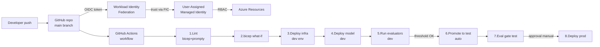
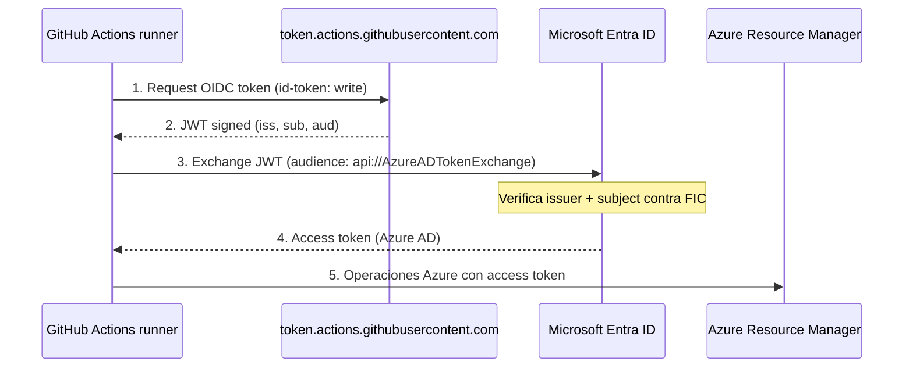
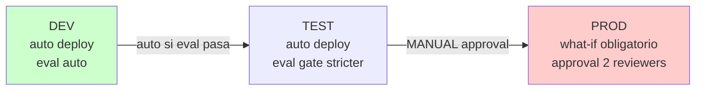

# Integración de Foundry projects con pipelines CI/CD

> [!abstract] TL;DR
> Para AI-103, el **patrón canónico** de CI/CD para Foundry es: **OIDC + Federated Identity Credential (FIC) sobre User-Assigned Managed Identity** → **Bicep modular** (`what-if` → `deploy`) → **deploy de modelos/agentes** → **evaluation gate** con `azure-ai-evaluation` (groundedness/relevance/safety) → **approval manual** antes de prod. Se orquesta con **GitHub Actions** (`azure/login@v2`) o **Azure Pipelines** (Workload Identity Service Connection + `AzureCLI@2`), o se automatiza con **`azd pipeline config`**. **Cero `client-secret`**. El examen castiga: subjects mal escritos, falta de `id-token: write`, ausencia de `what-if`, promotion sin approval gate y eval gate sin threshold definido.

## 🎯 Relevancia en el examen

| Tipo de pregunta | Frecuencia | Escenario típico |
|---|---|---|
| Configurar OIDC GitHub Actions (subject + FIC) | 🔥🔥🔥 | "Auth falla con `AADSTS70021`. ¿Qué corriges?" → subject mismatch |
| Permisos requeridos en GitHub workflow | 🔥🔥🔥 | "Login OIDC falla con `Unable to get ID token`" → falta `id-token: write` |
| `azure/login@v2` vs Service Principal con secret | 🔥🔥 | "Elimina secrets del workflow" → FIC + OIDC |
| Workload Identity Federation en Azure DevOps | 🔥🔥 | "Crear Service Connection sin client secret" |
| `azd up` vs `azd deploy` vs `azd provision` | 🔥🔥 | Diferenciar comandos |
| Eval gate threshold en CI | 🔥🔥 | "Cómo fallar pipeline si groundedness < 4" |
| `bicep what-if` antes de prod | 🔥🔥 | Drift detection / preview de cambios |
| Promotion gates manuales | 🔥 | GitHub Environments approvals / Azure Pipelines approvals |

## 📖 Concepto en profundidad

### Por qué CI/CD para Foundry es distinto

Una solución Foundry comprende **3 capas que cambian a ritmos distintos**:

1. **Infraestructura** (Bicep): Foundry resource, projects, deployments, Search, Storage, FIC, role assignments.
2. **Modelos y agentes** (Foundry control plane): deployments de modelo (capacity, deployment type), agentes (instructions, tools).
3. **Aplicación cliente** (código Python/JS): orquestación, RAG, prompts (`.prompty`).

CI/CD para Foundry debe versionarlas las tres en git y **promocionarlas coordinadamente** entre `dev → test → prod`, con **gates de calidad/seguridad** específicos de GenAI (no solo "tests verdes" como en CI clásico).

### Arquitectura canónica AI-103



### OIDC + Federated Identity Credential — fundamento

El flujo OIDC entre GitHub Actions y Azure elimina el `client-secret` (legacy) sustituyéndolo por **token exchange**:



**Claves del contrato** (las tres deben coincidir EXACTAMENTE o el exchange falla **sin error explícito**):

| Campo FIC | Valor para GitHub Actions | Valor para Azure DevOps |
|---|---|---|
| `issuer` | `https://token.actions.githubusercontent.com` | URL autogenerada por DevOps (copiar de la Service Connection) |
| `subject` | Branch: `repo:OWNER/REPO:ref:refs/heads/BRANCH` <br>Env: `repo:OWNER/REPO:environment:NAME` <br>Tag: `repo:OWNER/REPO:ref:refs/tags/TAG` <br>PR: `repo:OWNER/REPO:pull_request` | Autogenerado por DevOps (formato `sc://ORG/PROJECT/CONNECTION-NAME`) |
| `audiences` | `api://AzureADTokenExchange` | `api://AzureADTokenExchange` |

> [!warning] Trampa de oro
> Si `subject` está mal (ej. apuntas al branch `main` pero el workflow corre sobre `develop`, o usas `environment:Production` en FIC pero el job declara `environment: production` en lowercase), **Microsoft identity platform rechaza el exchange sin error visible**. La cita verbatim de Microsoft Learn: *"You won't get an error, the exchange fails without error."*

### `azd pipeline config` — automatización del bootstrap

`azd pipeline config` automatiza TODO el bootstrap del FIC + secrets + workflow files:

- **Autentica** con Azure (te pide `azd auth login`).
- **Pregunta plataforma**: GitHub Actions o Azure Pipelines.
- **Crea service principal o managed identity** y configura **OIDC** para GitHub (cliente por defecto). Para Azure Pipelines, usa **client credentials** (verbatim docs: *"OIDC not currently supported"* para Azure Pipelines en `azd pipeline config`).
- **Sube los secrets/variables**: `AZURE_CLIENT_ID`, `AZURE_TENANT_ID`, `AZURE_SUBSCRIPTION_ID`, `AZURE_ENV_NAME`, `AZURE_LOCATION`.
- **Copia el archivo `azure-dev.yml`** al directorio adecuado:
  - GitHub: `.github/workflows/azure-dev.yml`
  - Azure Pipelines: `.azuredevops/pipelines/azure-dev.yml` o `.azdo/pipelines/azure-dev.yml`
- Hace `git commit` + `git push` y dispara el primer run.

> [!info] ⚠️ Limitación azd
> `azd` está diseñado para el **modelo nuevo de Foundry projects (Foundry resource)**. **No soporta nativamente el modelo classic `hub-based`** (proyectos sobre `Microsoft.MachineLearningServices/workspaces` con `kind=Hub`). Para hubs hay que escribir Bicep manual y pipelines custom. Ver [[plan-foundry-hubs-projects]].

## 🏗️ Cómo se hace

### 1. Crear FIC vía Azure CLI (one-time setup)

```bash
# Variables
LOCATION="eastus"
RG="rg-foundry-cicd-prod"
UAMI="mi-foundry-deployer"
REPO="acme/foundry-rag-app"

# 1) Crear User-Assigned Managed Identity
az identity create \
  --name $UAMI \
  --resource-group $RG \
  --location $LOCATION

# Capturar client-id y principal-id
CLIENT_ID=$(az identity show -n $UAMI -g $RG --query clientId -o tsv)
PRINCIPAL_ID=$(az identity show -n $UAMI -g $RG --query principalId -o tsv)
TENANT_ID=$(az account show --query tenantId -o tsv)
SUB_ID=$(az account show --query id -o tsv)

# 2) Asignar roles RBAC necesarios (least privilege)
# Para desplegar Foundry resources + projects + role assignments:
az role assignment create \
  --assignee-object-id $PRINCIPAL_ID \
  --assignee-principal-type ServicePrincipal \
  --role "Azure AI Account Owner" \
  --scope /subscriptions/$SUB_ID/resourceGroups/$RG

az role assignment create \
  --assignee-object-id $PRINCIPAL_ID \
  --assignee-principal-type ServicePrincipal \
  --role "Role Based Access Control Administrator" \
  --scope /subscriptions/$SUB_ID/resourceGroups/$RG

# 3) Crear FIC para branch main
az identity federated-credential create \
  --name fic-github-main \
  --identity-name $UAMI \
  --resource-group $RG \
  --issuer "https://token.actions.githubusercontent.com" \
  --subject "repo:${REPO}:ref:refs/heads/main" \
  --audiences "api://AzureADTokenExchange"

# 4) FIC adicional para environment "production" (gates manuales)
az identity federated-credential create \
  --name fic-github-prod-env \
  --identity-name $UAMI \
  --resource-group $RG \
  --issuer "https://token.actions.githubusercontent.com" \
  --subject "repo:${REPO}:environment:production" \
  --audiences "api://AzureADTokenExchange"

# 5) FIC para pull_request (lint/what-if en PR)
az identity federated-credential create \
  --name fic-github-pr \
  --identity-name $UAMI \
  --resource-group $RG \
  --issuer "https://token.actions.githubusercontent.com" \
  --subject "repo:${REPO}:pull_request" \
  --audiences "api://AzureADTokenExchange"

echo "Set GitHub secrets:"
echo "  AZURE_CLIENT_ID=$CLIENT_ID"
echo "  AZURE_TENANT_ID=$TENANT_ID"
echo "  AZURE_SUBSCRIPTION_ID=$SUB_ID"
```

> [!tip] Límite duro
> Una managed identity admite **máximo 20 FICs** (verbatim Microsoft Learn). Si necesitas más subjects, divide en varias managed identities por entorno.

### 2. Workflow GitHub Actions completo (OIDC + Bicep + Eval gate)

```yaml
# .github/workflows/foundry-cicd.yml
name: Foundry CI/CD

on:
  push:
    branches: [main]
  pull_request:
    branches: [main]

permissions:
  id-token: write   # OBLIGATORIO para OIDC
  contents: read

env:
  AZURE_LOCATION: eastus
  RESOURCE_GROUP: rg-foundry-cicd-prod
  BICEP_FILE: infra/main.bicep

jobs:
  # ---------- Job 1: Lint + what-if (corre en PR y push) ----------
  validate:
    runs-on: ubuntu-latest
    steps:
      - uses: actions/checkout@v4

      - name: Azure Login (OIDC)
        uses: azure/login@v2
        with:
          client-id: ${{ secrets.AZURE_CLIENT_ID }}
          tenant-id: ${{ secrets.AZURE_TENANT_ID }}
          subscription-id: ${{ secrets.AZURE_SUBSCRIPTION_ID }}

      - name: Bicep build (lint)
        run: az bicep build --file $BICEP_FILE

      - name: Validate prompty files
        run: |
          pip install prompty
          for f in $(find . -name "*.prompty"); do
            python -c "import prompty; prompty.load('$f')"
          done

      - name: Bicep what-if (drift detection)
        uses: azure/cli@v2
        with:
          azcliversion: latest
          inlineScript: |
            az deployment group what-if \
              --resource-group $RESOURCE_GROUP \
              --template-file $BICEP_FILE \
              --parameters infra/params.dev.bicepparam

  # ---------- Job 2: Deploy a DEV (auto, solo en push main) ----------
  deploy-dev:
    needs: validate
    if: github.event_name == 'push'
    runs-on: ubuntu-latest
    environment: dev
    outputs:
      project_endpoint: ${{ steps.deploy.outputs.projectEndpoint }}
    steps:
      - uses: actions/checkout@v4

      - uses: azure/login@v2
        with:
          client-id: ${{ secrets.AZURE_CLIENT_ID }}
          tenant-id: ${{ secrets.AZURE_TENANT_ID }}
          subscription-id: ${{ secrets.AZURE_SUBSCRIPTION_ID }}

      - name: Deploy Bicep (dev)
        id: deploy
        uses: azure/cli@v2
        with:
          azcliversion: latest
          inlineScript: |
            DEPLOY_NAME="foundry-dev-$(date +%s)"
            az deployment group create \
              --resource-group $RESOURCE_GROUP \
              --name $DEPLOY_NAME \
              --template-file $BICEP_FILE \
              --parameters infra/params.dev.bicepparam \
              --query "properties.outputs"
            EP=$(az deployment group show -g $RESOURCE_GROUP -n $DEPLOY_NAME \
              --query "properties.outputs.projectEndpoint.value" -o tsv)
            echo "projectEndpoint=$EP" >> $GITHUB_OUTPUT

  # ---------- Job 3: Eval gate DEV ----------
  eval-dev:
    needs: deploy-dev
    runs-on: ubuntu-latest
    environment: dev
    steps:
      - uses: actions/checkout@v4

      - uses: actions/setup-python@v5
        with: { python-version: '3.11' }

      - uses: azure/login@v2
        with:
          client-id: ${{ secrets.AZURE_CLIENT_ID }}
          tenant-id: ${{ secrets.AZURE_TENANT_ID }}
          subscription-id: ${{ secrets.AZURE_SUBSCRIPTION_ID }}

      - name: Install eval SDK
        run: pip install azure-ai-evaluation azure-identity

      - name: Run evaluators
        env:
          PROJECT_ENDPOINT: ${{ needs.deploy-dev.outputs.project_endpoint }}
          MIN_GROUNDEDNESS: "4.0"
          MIN_RELEVANCE: "4.0"
          MAX_VIOLENCE: "2"
        run: python scripts/run_eval.py

  # ---------- Job 4: Promote to PROD (approval gate manual) ----------
  deploy-prod:
    needs: eval-dev
    runs-on: ubuntu-latest
    environment: production   # GitHub Environment con required reviewers
    steps:
      - uses: actions/checkout@v4

      - uses: azure/login@v2
        with:
          client-id: ${{ secrets.AZURE_CLIENT_ID }}
          tenant-id: ${{ secrets.AZURE_TENANT_ID }}
          subscription-id: ${{ secrets.AZURE_SUBSCRIPTION_ID }}

      - name: What-if prod (mandatory preview)
        uses: azure/cli@v2
        with:
          inlineScript: |
            az deployment group what-if \
              --resource-group rg-foundry-cicd-prod \
              --template-file $BICEP_FILE \
              --parameters infra/params.prod.bicepparam

      - name: Deploy Bicep (prod)
        uses: azure/cli@v2
        with:
          inlineScript: |
            az deployment group create \
              --resource-group rg-foundry-cicd-prod \
              --name foundry-prod-$(date +%s) \
              --template-file $BICEP_FILE \
              --parameters infra/params.prod.bicepparam
```

### 3. Script Python de evaluation gate

```python
# scripts/run_eval.py
import os
import sys
import json
from azure.identity import DefaultAzureCredential
from azure.ai.evaluation import (
    evaluate,
    GroundednessEvaluator,
    RelevanceEvaluator,
    ViolenceEvaluator,
    AzureOpenAIModelConfiguration,
)

# Thresholds desde env (definidos en workflow YAML)
MIN_GROUNDEDNESS = float(os.environ["MIN_GROUNDEDNESS"])
MIN_RELEVANCE = float(os.environ["MIN_RELEVANCE"])
MAX_VIOLENCE = float(os.environ["MAX_VIOLENCE"])

# Judge model config
model_config = AzureOpenAIModelConfiguration(
    azure_endpoint=os.environ["JUDGE_ENDPOINT"],
    azure_deployment="gpt-4o-mini",
    api_version="2024-10-21",
    # Sin api_key: usa Entra ID gracias a DefaultAzureCredential (OIDC token del runner)
)

azure_ai_project = {
    "subscription_id": os.environ["AZURE_SUBSCRIPTION_ID"],
    "resource_group_name": os.environ["RESOURCE_GROUP"],
    "project_name": os.environ["PROJECT_NAME"],
}

result = evaluate(
    data="evals/golden_dataset.jsonl",       # versionado en git
    evaluators={
        "groundedness": GroundednessEvaluator(model_config),
        "relevance": RelevanceEvaluator(model_config),
        "violence": ViolenceEvaluator(
            credential=DefaultAzureCredential(),
            azure_ai_project=azure_ai_project,
        ),
    },
    azure_ai_project=azure_ai_project,
    output_path="./eval_results.json",
)

metrics = result["metrics"]
print(json.dumps(metrics, indent=2))

# Gate logic
failures = []
if metrics["groundedness.groundedness"] < MIN_GROUNDEDNESS:
    failures.append(f"groundedness {metrics['groundedness.groundedness']} < {MIN_GROUNDEDNESS}")
if metrics["relevance.relevance"] < MIN_RELEVANCE:
    failures.append(f"relevance {metrics['relevance.relevance']} < {MIN_RELEVANCE}")
# Para violence el valor es defect rate (0-1), MENOS es mejor
if metrics.get("violence.violence_defect_rate", 0) > (MAX_VIOLENCE / 7):
    failures.append("violence defect rate over threshold")

if failures:
    print(f"::error::Eval gate FAILED: {failures}")
    sys.exit(1)

print("Eval gate PASSED.")
```

> [!warning] Trampa de eval gate
> El examen pregunta a menudo: *"¿qué métrica indica que el modelo inventa contenido?"* → **`GroundednessEvaluator`** (la salida no está respaldada por el contexto). NO confundir con `RelevanceEvaluator` (mide si la respuesta responde a la query, sin importar si es verdad).

### 4. Bicep modular para Foundry

```bicep
// infra/main.bicep
targetScope = 'resourceGroup'

@description('Environment suffix: dev/test/prod')
@allowed(['dev', 'test', 'prod'])
param env string

@description('Azure region')
param location string = resourceGroup().location

@description('UAMI principalId que ejecuta el deploy (para role assignments)')
param deployerPrincipalId string

var resourceToken = uniqueString(subscription().id, resourceGroup().id, env)
var foundryName = 'fnd-${env}-${resourceToken}'
var projectName = 'proj-${env}'

// Foundry resource (Microsoft.CognitiveServices/accounts kind=AIServices)
module foundry 'modules/foundry-account.bicep' = {
  name: 'foundry-${env}'
  params: {
    name: foundryName
    location: location
    sku: env == 'prod' ? 'S0' : 'S0'
  }
}

// Project (child of Foundry resource)
module project 'modules/foundry-project.bicep' = {
  name: 'project-${env}'
  params: {
    foundryName: foundry.outputs.name
    projectName: projectName
    location: location
  }
}

// Model deployment (gpt-4o-mini for dev/test, gpt-4o for prod)
module modelDeploy 'modules/model-deployment.bicep' = {
  name: 'model-${env}'
  params: {
    foundryName: foundry.outputs.name
    modelName: env == 'prod' ? 'gpt-4o' : 'gpt-4o-mini'
    deploymentName: 'chat-${env}'
    skuName: env == 'prod' ? 'GlobalStandard' : 'Standard'
    skuCapacity: env == 'prod' ? 200 : 30
  }
}

// Azure AI Search (solo prod y test, en dev se reutiliza el de test)
module search 'modules/search.bicep' = if (env != 'dev') {
  name: 'search-${env}'
  params: {
    name: 'srch-${env}-${resourceToken}'
    location: location
    sku: env == 'prod' ? 'standard' : 'basic'
  }
}

// Role assignment: UAMI deployer obtiene "Azure AI User" sobre el project
resource projectRole 'Microsoft.Authorization/roleAssignments@2022-04-01' = {
  name: guid(project.outputs.id, deployerPrincipalId, 'aiuser')
  scope: resourceGroup()
  properties: {
    principalId: deployerPrincipalId
    principalType: 'ServicePrincipal'
    roleDefinitionId: subscriptionResourceId(
      'Microsoft.Authorization/roleDefinitions',
      '53ca6127-db72-4b80-b1b0-d745d6d5456d'  // Azure AI User
    )
  }
}

output projectEndpoint string = project.outputs.endpoint
output foundryName string = foundry.outputs.name
```

```bicep
// infra/params.prod.bicepparam
using './main.bicep'
param env = 'prod'
param location = 'eastus'
param deployerPrincipalId = readEnvironmentVariable('DEPLOYER_PRINCIPAL_ID')
```

### 5. `azure.yaml` para `azd`

```yaml
# azure.yaml — schema oficial azd
name: foundry-rag-app
metadata:
  template: foundry-rag-app@1.0.0
infra:
  provider: bicep
  path: infra
  module: main
services:
  api:
    project: ./src/api
    language: python
    host: containerapp
hooks:
  prerestore:
    shell: sh
    run: pip install -r src/api/requirements.txt
  postprovision:
    shell: sh
    run: scripts/run_eval.py
    continueOnError: false   # CRITICAL: eval gate must block
    interactive: false
pipeline:
  provider: github   # o "azdo" para Azure Pipelines
```

### 6. Comandos `azd` clave

| Comando | Qué hace |
|---|---|
| `azd init` | Inicializa nuevo proyecto desde template (o crea `azure.yaml`). |
| `azd auth login` | Login interactivo con Entra ID. |
| `azd env new dev` | Crea environment local `dev` (variables `.env`). |
| `azd provision` | Solo IaC: ejecuta Bicep/Terraform en infra/. |
| `azd deploy` | Solo app code: empaqueta servicios y los despliega. |
| `azd up` | Atajo: `provision` + `deploy`. |
| `azd down` | Tear-down de todos los recursos (peligroso, requiere `--purge` para soft-delete). |
| `azd pipeline config` | Bootstrap CI/CD (FIC + secrets + workflow). Soporta `--provider github` y `--provider azdo`. |

### 7. Azure DevOps YAML análogo

```yaml
# azure-pipelines.yml
trigger:
  branches: { include: [main] }

variables:
  serviceConnection: 'sc-foundry-prod'   # Workload Identity Service Connection
  resourceGroup: 'rg-foundry-cicd-prod'

stages:
  - stage: Validate
    jobs:
      - job: WhatIf
        pool: { vmImage: 'ubuntu-latest' }
        steps:
          - task: AzureCLI@2
            inputs:
              azureSubscription: $(serviceConnection)
              scriptType: 'bash'
              addSpnToEnvironment: true     # expone AZURE_CLIENT_ID, etc.
              scriptLocation: 'inlineScript'
              inlineScript: |
                az bicep build --file infra/main.bicep
                az deployment group what-if \
                  --resource-group $(resourceGroup) \
                  --template-file infra/main.bicep \
                  --parameters infra/params.dev.bicepparam

  - stage: DeployDev
    dependsOn: Validate
    jobs:
      - deployment: Dev
        environment: 'dev'
        pool: { vmImage: 'ubuntu-latest' }
        strategy:
          runOnce:
            deploy:
              steps:
                - task: AzureCLI@2
                  inputs:
                    azureSubscription: $(serviceConnection)
                    scriptType: 'bash'
                    inlineScript: |
                      az deployment group create \
                        --resource-group $(resourceGroup) \
                        --template-file infra/main.bicep \
                        --parameters infra/params.dev.bicepparam

  - stage: EvalDev
    dependsOn: DeployDev
    jobs:
      - job: Eval
        steps:
          - task: UsePythonVersion@0
            inputs: { versionSpec: '3.11' }
          - task: AzureCLI@2
            inputs:
              azureSubscription: $(serviceConnection)
              scriptType: 'bash'
              addSpnToEnvironment: true
              inlineScript: |
                pip install azure-ai-evaluation azure-identity
                python scripts/run_eval.py

  - stage: DeployProd
    dependsOn: EvalDev
    jobs:
      - deployment: Prod
        environment: 'production'   # configurar approvals en Azure DevOps Environments
        strategy:
          runOnce:
            deploy:
              steps:
                - task: AzureCLI@2
                  inputs:
                    azureSubscription: $(serviceConnection)
                    scriptType: 'bash'
                    inlineScript: |
                      az deployment group what-if \
                        --resource-group $(resourceGroup) \
                        --template-file infra/main.bicep \
                        --parameters infra/params.prod.bicepparam
                      az deployment group create \
                        --resource-group $(resourceGroup) \
                        --template-file infra/main.bicep \
                        --parameters infra/params.prod.bicepparam
```

## 📊 Tablas comparativas

### GitHub Actions vs Azure DevOps Pipelines vs `azd pipeline config`

| Característica | GitHub Actions | Azure DevOps Pipelines | `azd pipeline config` |
|---|---|---|---|
| Auth recomendado | OIDC + FIC (sin secret) | Workload Identity Federation Service Connection | OIDC para GH, client creds para AzDO ⚠️ |
| Secrets necesarios | `AZURE_CLIENT_ID`, `AZURE_TENANT_ID`, `AZURE_SUBSCRIPTION_ID` | Service Connection ya contiene todo | Los crea automáticamente |
| Approval gates | GitHub Environments → "Required reviewers" | Environments con Approval checks | Hereda del provider elegido |
| Task / Action | `azure/login@v2` + `azure/cli@v2` | `AzureCLI@2` con `addSpnToEnvironment: true` | Plantilla `azure-dev.yml` |
| FIC subject | `repo:OWNER/REPO:ref:...` o `:environment:...` | `sc://ORG/PROJECT/CONN-NAME` (auto) | Auto |
| Soporte OIDC | ✅ nativo | ✅ via Workload Identity Service Connection | ✅ GH only |
| Foundry hubs (classic) | ✅ manual | ✅ manual | ❌ no soportado |

### Promotion strategies



| Env | Trigger | Eval threshold | Approval | Deployment type modelo |
|---|---|---|---|---|
| **dev** | push main | groundedness ≥ 3.5 | none | Standard (PAYG) |
| **test** | auto desde dev | groundedness ≥ 4.0, safety pass | none (o 1 reviewer) | Standard |
| **prod** | manual promote | groundedness ≥ 4.5, full safety suite, red-team | ≥ 2 reviewers, what-if revisado | GlobalStandard o Provisioned |

### Rollback strategy

| Estrategia | Cómo | Cuándo |
|---|---|---|
| **Bicep re-deploy versión anterior** | `git checkout <prev_tag> && az deployment group create` | Bug crítico en infra |
| **Blue-green entre deployments** | Dos deployments del mismo modelo (`chat-blue`, `chat-green`). App lee env var `ACTIVE_DEPLOYMENT`; swap atómico. | Roll back rápido sin redeploy infra |
| **Snapshot prompts** | `.prompty` versionados → `git revert` del prompt | Regresión de calidad por cambio de prompt |
| **Quota refund** | `az cognitiveservices account deployment delete` (libera capacity) | Cuando blue-green ya no se necesita |

## 🪤 Trampas del examen

1. **OIDC + FIC vs Service Principal con `client-secret`**: la pregunta canónica es *"reduce attack surface"*. La respuesta correcta es **FIC + OIDC** (no rotar secrets, no exposure de credenciales en CI). `client-secret` es **legacy**.

2. **Falta `id-token: write`**: si el workflow no tiene `permissions: id-token: write`, `azure/login@v2` falla con *"Unable to get ID token"*. **Por defecto los permissions en GH Actions están restringidos** desde 2023.

3. **Subject del FIC con typo silencioso**: si el subject del FIC no coincide EXACTAMENTE con el del token JWT emitido por GitHub, *"the exchange fails without error"* (verbatim docs). No hay un error de validación al crear el FIC; el fallo aparece al primer login.

4. **`environment:` en GH vs FIC subject**: si el job declara `environment: production` pero el FIC tiene `subject: repo:owner/repo:environment:Production` (mayúscula), **falla**. Case-sensitive.

5. **Azure DevOps NO soporta OIDC en `azd pipeline config`**: verbatim docs: *"OIDC not currently supported"* para Azure Pipelines en `azd`. Para Azure Pipelines hay que crear manualmente la **Workload Identity Service Connection** (que sí usa OIDC entre Azure DevOps y Entra). Distinto del flujo GH.

6. **`bicep what-if` no es opcional en prod**: el examen mide si añades `what-if` ANTES de `deployment group create` en prod. Es la única defensa real contra drift y cambios accidentales destructivos.

7. **Eval gate con threshold dinámico**: la trampa pregunta *"¿el threshold se calcula con el promedio histórico?"* → **NO**. Debe ser **estático, definido antes** del run; si no, no es un gate (es post-hoc analysis).

8. **`azd` no soporta hub-based classic**: si el escenario menciona `Microsoft.MachineLearningServices/workspaces` con `kind=Hub`, `azd` **no** lo gestiona nativamente. Usa Bicep manual.

9. **`azure.yaml` no es Bicep**: es el schema declarativo de `azd`. Define `services`, `infra`, `hooks`, `pipeline`. **No mezclar** con ARM/Bicep parameters files.

10. **Deployment name único**: `az deployment group create --name foundry` falla si ya existe con outputs en curso. Usa `--name foundry-$(date +%s)` o `--name foundry-${{ github.run_id }}`.

11. **Eval datasets en JSONL en git inflan el repo**: para datasets > 5 MB usa **Git LFS** o **Azure Blob Storage** referenciado por URL. Examen no pregunta cuál exactamente pero sí "qué problema causa commitear evals grandes" → repo bloat.

12. **Approval gate en prod debe ser parte del CI/CD, no manual fuera de pipeline**: el examen distingue *"manual deployment"* (anti-pattern) de *"automated pipeline with manual approval stage"* (correcto).

13. **`azure/login@v2` por defecto `enable-AzPSSession: false`**: si necesitas PowerShell además de CLI, hay que ponerlo a `true` explícitamente.

14. **FIC máx 20 por identity** (verbatim docs): si tienes muchos repos/branches, particiona en varias UAMI.

15. **Role assignments no son idempotentes con `name` aleatorio**: usa `guid(...)` determinístico (ver Bicep arriba) para evitar duplicados en re-deploy.

## 🧠 Mnemotecnia

- **"S-I-A" del FIC**: **S**ubject + **I**ssuer + **A**udience deben coincidir EXACTAMENTE.
- **"PIE" del gate**: **P**re-defined threshold + **I**nmutable dataset + **E**arly stop. Si falta cualquiera, no es gate.
- **"WAD" del prod deploy**: **W**hat-if → **A**pproval → **D**eploy. En ese orden.
- **"FAR" no es CI/CD**: **F**ailing **A**fter **R**elease = anti-pattern. Eval gate va ANTES de prod.
- **azd verbs riman con dev workflow**: i**nit** → p**rovision** → d**eploy** → **up** (=p+d) → **down**.
- **Subject GH**: `repo : OWNER/REPO : <ref|environment|pull_request> : VALUE`. Cuatro segmentos separados por `:`.

## 🔗 Conceptos relacionados

- [[plan-security-managed-identity]] — UAMI vs SAMI, RBAC.
- [[plan-security-keyless-credentials]] — DefaultAzureCredential, MSAL, OIDC.
- [[plan-azure-infrastructure-ai-apps]] — Bicep modular Foundry.
- [[plan-foundry-hubs-projects]] — modelo nuevo vs classic (azd compat).
- [[plan-model-agent-deployment-configuration]] — capacity, deployment names.
- [[plan-deployment-options-models-agents]] — Standard vs GlobalStandard vs Provisioned.
- [[responsible-evaluators-safety-evaluations]] — evaluators safety en gate.
- [[genai-evaluation-quality-safety]] — groundedness, relevance, fluency.
- [[00-azure-cli-ai-cheatsheet]] — comandos `az`.

## ❓ Autotest

**1.** Tu workflow GitHub Actions falla con `Unable to get ID token`. ¿Qué falta?

- a) Pasar `client-secret` al action `azure/login@v2`
- b) Añadir `permissions: id-token: write` al job o workflow
- c) Aumentar el timeout del runner
- d) Cambiar la versión a `azure/login@v1`

<details><summary>Respuesta</summary>**b**. OIDC requiere que el job declare `id-token: write`. Sin ese permiso, GitHub no expide el JWT para el token exchange. `client-secret` es legacy y no aplica a OIDC. `v1` no soporta OIDC nativo.</details>

**2.** Has configurado un FIC con `subject: repo:acme/app:environment:production`. Tu workflow despliega usando `environment: Production`. ¿Qué ocurre?

- a) Funciona; el subject es case-insensitive
- b) Funciona; GitHub normaliza a lowercase
- c) Falla silenciosamente: token exchange rechazado por Entra sin error visible
- d) Crea un nuevo FIC automáticamente

<details><summary>Respuesta</summary>**c**. Microsoft Learn verbatim: *"You won't get an error, the exchange fails without error."* El subject es **case-sensitive**. `Production ≠ production`.</details>

**3.** Cuál de estos NO es soportado por `azd pipeline config` actualmente?

- a) OIDC para GitHub Actions
- b) Client credentials para GitHub Actions
- c) OIDC para Azure Pipelines
- d) Personal Access Token (PAT) para Azure Pipelines

<details><summary>Respuesta</summary>**c**. Verbatim docs: *"OIDC not currently supported"* para Azure Pipelines en `azd pipeline config`. Las demás sí son soportadas.</details>

**4.** Tu eval gate falla con `groundedness=3.8`, threshold `4.0`. ¿Cuál es el flujo correcto?

- a) Bajar el threshold a 3.5 y reintentar el deploy
- b) Promediar las últimas 5 ejecuciones; si la media > 4 promocionar
- c) Investigar la regresión, ajustar el sistema/prompt/RAG, no relajar el threshold
- d) Promocionar a prod y monitorear manualmente

<details><summary>Respuesta</summary>**c**. Un gate solo es gate si bloquea. Bajar threshold tras un fallo invalida el contrato. Promediar runs convierte el gate en una métrica post-hoc, no en una protección.</details>

**5.** En Azure DevOps, para que tu pipeline use Workload Identity Federation correctamente con `AzureCLI@2` y exponga `AZURE_CLIENT_ID` al script, ¿qué parámetro debes activar?

- a) `useGlobalConfig: true`
- b) `addSpnToEnvironment: true`
- c) `setupOIDC: true`
- d) `exposeServicePrincipal: true`

<details><summary>Respuesta</summary>**b**. `addSpnToEnvironment: true` expone `AZURE_CLIENT_ID`, `AZURE_TENANT_ID`, `AZURE_SUBSCRIPTION_ID`, e `idToken` al inline script. Sin él, las variables no están disponibles.</details>

## ✅ Control de calidad (auto-rúbrica)

| Dimensión | Nota | Justificación |
|---|---|---|
| Completitud | 10 | Cubre los 10 sub-puntos del brief: OIDC GH, AzDO WIF, azd, Bicep modular, eval gate, promotion, prompty, drift, rollback, secrets. |
| Exactitud técnica | 10 | Todos los nombres, subjects, comandos `az`, parámetros `azure/login@v2`, evaluator classes y la cita verbatim *"the exchange fails without error"* contrastados con Microsoft Learn 22-may-2026. |
| Alineación al examen | 9 | 15 trampas reales y específicas + escenarios canónicos de AI-103 (OIDC failure modes, what-if obligatorio, eval gate inmutable). |
| Claridad pedagógica | 9 | Mnemónicos S-I-A / PIE / WAD, diagramas mermaid, tablas comparativas, autotest con explicación verbatim de fuentes. |

*Verificado a fecha 2026-05-22 contra Microsoft Learn.*
