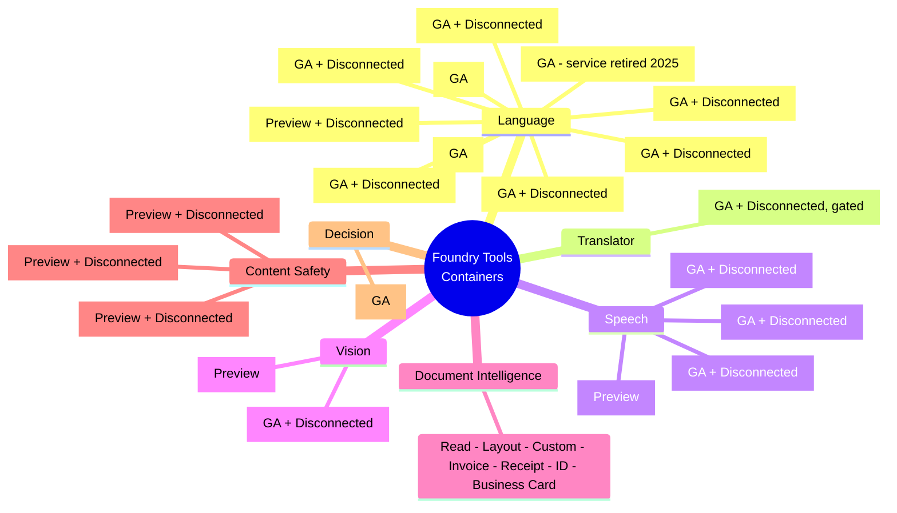
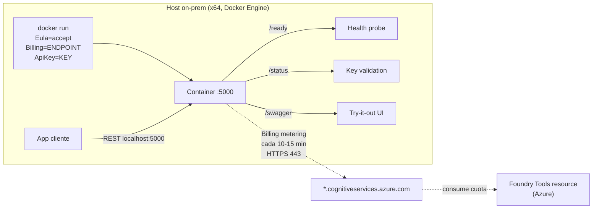
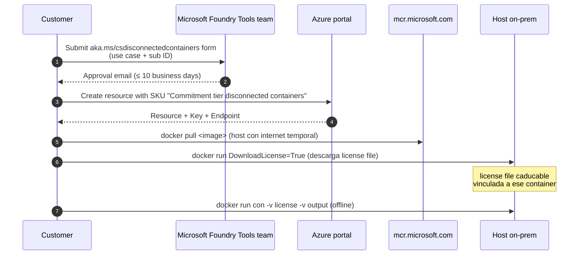
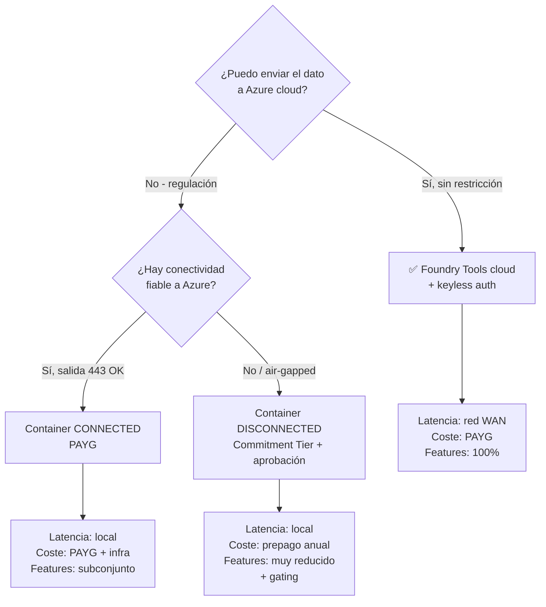

# Despliegue de Foundry Tools en contenedores Docker (AI-102 carryover)

> [!warning] AI-102 ONLY — NO entra en AI-103
> Este tema **solo se examina en AI-102** ("Designing and Implementing a Microsoft Azure AI Solution"), vigente hasta el **30 de junio de 2026**. El nuevo **AI-103** ("Developing AI Apps and Agents on Azure") **NO incluye** *container deployment* en su temario oficial: el foco se ha movido a Foundry resources, modelos cloud y agentes. Estúdialo solo si presentas AI-102 antes del retiro. Si vas directo a AI-103 → puedes saltarlo.

> [!abstract] TL;DR
> Foundry Tools (antes "Azure AI services / Cognitive Services") publica un **subconjunto** de APIs como **imágenes Docker oficiales en `mcr.microsoft.com`** para ejecutarse on-prem o en el edge. Existen dos modos: **connected** (el contenedor reporta facturación cada 10-15 min a `*.cognitiveservices.azure.com` por puerto 443, pricing PAYG) y **disconnected** (totalmente offline, requiere **aprobación previa de Microsoft** vía formulario y compra de un **Commitment Tier** anual). Cada `docker run` exige los 3 parámetros obligatorios `Eula=accept`, `Billing={ENDPOINT_URI}`, `ApiKey={API_KEY}`. Puerto local por defecto **5000**, endpoints de salud `/ready`, `/status`, `/swagger`. Disconnected añade `Mounts:License`, `Mounts:Output`, `DownloadLicense=True` y registros de uso JSON.

## 🎯 Relevancia en el examen

| Aspecto | Detalle |
|---|---|
| Tipo de pregunta | Case study + drag-and-drop docker run + selección de servicio container-capable + identificación del modo billing correcto. |
| Frecuencia | 🔥 (1-2 preguntas en AI-102). |
| Escenarios típicos | Hospital con HIPAA pidiendo on-prem; barco/plataforma petrolera sin internet; sucursal con baja latencia; sovereign cloud sin egress. |
| Trampa-rey | Confundir **connected** (PAYG con metering online) con **disconnected** (commitment tier obligatorio). |

## 📖 Concepto en profundidad

### Por qué contenedores

Microsoft empaqueta una **versión recortada** de cada API cognitiva como imagen Docker Linux para cubrir 4 escenarios concretos:

1. **Data residency / sovereignty estricta** — el dato no puede salir del país o del datacenter del cliente.
2. **Compliance regulado** — HIPAA, GDPR, PCI-DSS, FedRAMP High, IL5/IL6 (DoD), donde la nube pública no es opción.
3. **Air-gapped / disconnected** — barcos, refinerías, instalaciones militares, plantas industriales sin enlace WAN fiable.
4. **Low-latency edge** — la inferencia debe ocurrir junto al sensor (fábrica, hospital, retail), no en Azure West Europe.

> [!info] Inmutabilidad y portabilidad
> El mismo container corre idéntico en **Docker Engine** local, **Azure Container Instances (ACI)**, **Azure Kubernetes Service (AKS)**, o un clúster Kubernetes desplegado en **Azure Stack**. No hay configuration drift entre dev/prod.

### Catálogo de Foundry Tools containerizados (verificado 2026-02-05)



> [!caution] Servicios que **NO** tienen container
> **Azure OpenAI**, **Custom Vision** (retirado de container), **Face**, **Azure AI Search**, **Personalizer** (servicio retirado), **Bot Service**, **Foundry Agent Service**. Si una pregunta dice "deploy Azure OpenAI on-prem via container" → **respuesta incorrecta**, no existe.

### Anatomía de un container Foundry Tools



Cada container:

- **Expone REST localmente** en `http://localhost:5000/<path>` (mismas rutas que la API cloud).
- **Reporta uso** al endpoint de facturación cada 10-15 minutos (modo connected).
- Si no consigue contactar billing **10 veces consecutivas** → el container **deja de servir queries** (pero no se detiene) hasta restablecer la conexión.
- **NUNCA envía datos del cliente** (texto/imagen analizados) a Microsoft. Solo metering.

## 🏗️ Cómo se hace

### 1. Modo **connected** (online billing, PAYG)

Tres parámetros obligatorios — sin ellos el container **no arranca**:

| Parámetro | Valor | Notas |
|---|---|---|
| `Eula` | `accept` | Aceptación de Microsoft Software License Terms. |
| `Billing` | `{ENDPOINT_URI}` | Endpoint del recurso Foundry Tools (formato `https://<custom-subdomain>.cognitiveservices.azure.com`). |
| `ApiKey` | `{API_KEY}` | Clave del recurso. Equivale a la cloud. |

#### Docker run completo (Sentiment Analysis, ejemplo canónico)

```bash
# 1. Pull
docker pull mcr.microsoft.com/azure-cognitive-services/textanalytics/sentiment:3.0-en

# 2. Run
docker run --rm -it -p 5000:5000 --memory 8g --cpus 1 \
  mcr.microsoft.com/azure-cognitive-services/textanalytics/sentiment:3.0-en \
  Eula=accept \
  Billing=https://my-language-resource.cognitiveservices.azure.com \
  ApiKey=xxxxxxxxxxxxxxxxxxxxxxxxxxxxxxxx
```

Specs mínimos / recomendados Sentiment Analysis:

| | Mínimo | Recomendado | Min TPS | Max TPS |
|---|---|---|---|---|
| Sentiment | 1 core / 2 GB | 4 cores / 8 GB | 15 | 30 |

> Cada CPU core debe ser **≥ 2.6 GHz**. Los containers son **CPU-only** (la inmensa mayoría — no GPU).

#### Allowlist de red (firewall corporativo)

Puerto **443 saliente** hacia:

- `*.cognitive.microsoft.com`
- `*.cognitiveservices.azure.com`
- Si es Translator: añadir `translatoronprem.blob.core.windows.net` (descarga de modelos).

> [!important] **Desactivar Deep Packet Inspection (DPI)**
> DPI rompe el canal TLS hacia el billing endpoint. Si tu proxy corporativo hace DPI, el container falla silenciosamente y deja de servir queries tras 10 reintentos.

### 2. Modo **disconnected** (air-gapped)

Requiere **4 pasos previos** antes del `docker run`:



#### A) Solicitud de acceso (gating obligatorio)

Formulario en **`https://aka.ms/csdisconnectedcontainers`**. Requisitos del solicitante (todos):

- Email asociado a un **Azure subscription ID**.
- Organización estratégica / partner de Microsoft.
- Caso de uso justificado (uno de):
  - Entorno con **cero conectividad** a internet.
  - Ubicación remota con internet ocasional.
  - Regulación que prohíbe envío de cualquier dato a la nube.

> [!danger] Sin aprobación **no aparece** el SKU "Commitment tier disconnected containers" al crear el recurso en el portal. Y si intentas correr el container offline sin license file → no arranca.

#### B) Comprar Commitment Tier

- Compromiso anual (**año natural completo**).
- Se cobra **el precio completo por adelantado** al activar.
- Se pueden comprar **unidades adicionales prorrateadas** durante el año, pero **no cambiar de plan**.
- Para terminar: poner auto-renewal en **"Do not auto-renew"** antes de la medianoche UTC del último día del año.
- Tras expirar → el recurso sigue activo pero a precio **Standard PAYG**.

> [!note] No hay commitment tiers de 1 año vs 3 años en el modelo actual de Foundry Tools — solo anual (year-by-year). El brief mencionaba "1-year / 3-year"; la doc 2025-10 solo describe el plan **anual**. ⚠️ Verifica el SKU concreto del servicio que vas a desplegar — algunos servicios speech históricos tuvieron tiers multianuales.

#### C) Descargar el license file

```bash
docker run --rm -it -p 5000:5000 \
  -v /host/license:/license \
  mcr.microsoft.com/azure-cognitive-services/textanalytics/sentiment:3.0-en \
  eula=accept \
  billing=https://my-language-resource.cognitiveservices.azure.com \
  apikey=xxxxxxxxxxxxxxxxxxxxxxxxxxxxxxxx \
  DownloadLicense=True \
  Mounts:License=/license
```

El license file:

- Es **específico de la imagen** que se aprobó (no reutilizable entre servicios — p. ej. license de Speech ≠ license de Document Intelligence).
- Tiene **fecha de caducidad**.
- Se debe **regenerar** si la imagen se actualiza (porque la nueva imagen puede cifrar artefactos distintos).

#### D) Run offline (sin internet)

```bash
docker run --rm -it -p 5000:5000 --memory 4g --cpus 4 \
  -v /host/license:/license \
  -v /host/output:/output \
  mcr.microsoft.com/azure-cognitive-services/textanalytics/sentiment:3.0-en \
  eula=accept \
  Mounts:License=/license \
  Mounts:Output=/output
```

> [!warning] En **disconnected NO se incluye `Billing` ni `ApiKey`** en el run (ya están "horneadas" en el license file). En **connected sí son obligatorios** los tres.

### 3. Usage records (offline metering)

El container escribe registros JSON en `Mounts:Output` y expone dos endpoints REST locales:

```http
GET http://localhost:5000/records/usage-logs/
GET http://localhost:5000/records/usage-logs/{MONTH}/{YEAR}
```

Respuesta:

```json
{
  "apiType": "noop",
  "serviceName": "noop",
  "meters": [
    { "name": "Sample.Meter", "quantity": 253 }
  ]
}
```

Esos registros se entregan a Microsoft al final del año de commitment (o cuando se renueva). **Sin output mount montado el container falla en disconnected.**

### 4. Despliegue en Kubernetes (AKS o Azure Stack)

```yaml
apiVersion: apps/v1
kind: Deployment
metadata:
  name: sentiment-container
spec:
  replicas: 2
  selector:
    matchLabels: { app: sentiment }
  template:
    metadata:
      labels: { app: sentiment }
    spec:
      containers:
      - name: sentiment
        image: mcr.microsoft.com/azure-cognitive-services/textanalytics/sentiment:3.0-en
        ports: [{ containerPort: 5000 }]
        resources:
          requests: { cpu: "1", memory: "2Gi" }
          limits:   { cpu: "4", memory: "8Gi" }
        env:
        - name: Eula
          value: "accept"
        - name: Billing
          valueFrom: { secretKeyRef: { name: ft-secret, key: endpoint } }
        - name: ApiKey
          valueFrom: { secretKeyRef: { name: ft-secret, key: apikey } }
        # ⚠️ En Kubernetes los nombres con ':' (Mounts:License) se sustituyen por '__'
        - name: Mounts__License
          value: "/license"
        - name: Mounts__Output
          value: "/output"
        readinessProbe: { httpGet: { path: /ready,  port: 5000 } }
        livenessProbe:  { httpGet: { path: /status, port: 5000 } }
```

> [!important] **Regla Kubernetes: `:` → `__`**
> Kubernetes no admite `:` en nombres de variables de entorno. Sustituir `Mounts:License` por `Mounts__License`. **Trampa frecuente en preguntas drag-and-drop.**

Helm charts existen para algunos servicios (Speech, Language) en `github.com/Azure-Samples/cognitive-services-containers-samples`.

## 📊 Tablas comparativas

### Connected vs Disconnected

| Aspecto | **Connected** | **Disconnected** |
|---|---|---|
| Internet | Requerido (egress a `*.cognitiveservices.azure.com` :443) | Cero internet tras setup inicial |
| Aprobación previa | No | **Sí — formulario + ≤ 10 business days** |
| Pricing | **PAYG** (Standard/Free tier) | **Commitment Tier anual** prepagado |
| Cambio de plan | Sí, libre | No durante el año (solo añadir unidades) |
| Parámetros docker run | `Eula`, `Billing`, `ApiKey` | `Eula`, `Mounts:License`, `Mounts:Output` |
| License file | No | **Sí**, descargado con `DownloadLicense=True` |
| Reporte uso | Online cada 10-15 min | Offline en `Mounts:Output` + REST `/records/usage-logs` |
| Si pierde billing 10× | Deja de servir queries | N/A |
| Servicios soportados | Todos los containerizados | Subconjunto (Speech, Language ×7, Translator, Vision Read, DocInt) |

### Cuándo usar contenedor vs cloud



### Servicios disconnected (lista oficial 2025-11)

| Servicio | Container | Disconnected |
|---|---|---|
| Speech to text | ✅ | ✅ |
| Custom Speech to text | ✅ | ✅ |
| Neural Text to Speech | ✅ | ✅ |
| Translator (Standard) | ✅ gated | ✅ |
| Language: Sentiment | ✅ | ✅ |
| Language: Key Phrase | ✅ | ✅ |
| Language: Language Detection | ✅ | ✅ |
| Language: NER | ✅ | ✅ |
| Language: PII | ✅ | ✅ |
| Language: Summarization | ✅ preview | ✅ |
| Language: CLU | ✅ | ✅ |
| Vision: Read OCR | ✅ | ✅ |
| Document Intelligence | ✅ | ✅ |
| Content Safety (Text/Image/Prompt Shields) | ✅ preview | ✅ |
| Anomaly Detector | ✅ | ❌ |
| Text Analytics for Health | ✅ | ❌ |
| Custom NER | ✅ | ❌ |
| Spatial Analysis | ✅ preview | ❌ |

## 🪤 Trampas del examen

1. **PAYG ≠ disconnected.** Disconnected **exige Commitment Tier prepagado** y aprobación previa. Una pregunta tipo "the customer wants on-prem disconnected at PAYG" → trampa, **no se puede**.
2. **`Eula=accept` es literal.** No `"Eula=true"`, no `"EULA=yes"`. Es exactamente `Eula=accept` (case-sensitive en algunos parsers). Sin eso, el container no arranca.
3. **`:` no funciona en Kubernetes.** `Mounts:License` debe ser `Mounts__License` (doble guion bajo) en `env:` de un Pod.
4. **Disconnected NO usa `Billing` ni `ApiKey` en runtime**, solo durante `DownloadLicense=True`. Después el license file encapsula la autorización.
5. **Azure OpenAI NO tiene container.** Tampoco Custom Vision, Face, AI Search, Personalizer, Foundry Agent Service. Cualquier pregunta que lo sugiera es distractor.
6. **AI-103 NO examina containers.** El temario nuevo eliminó este sub-punto. Solo cae en AI-102 (vigente hasta 30-jun-2026).
7. **Spatial Analysis sigue en Preview**, no retirado (el brief original decía "carryover"; en realidad sigue listado como Vision/Spatial Analysis preview).
8. **DPI rompe el billing.** Si la pregunta describe un proxy corporativo con inspection profunda y el container "stops serving queries after ~2 hours" → la causa es **DPI**, no firewall ni TLS.
9. **El container deja de servir queries (no se detiene)** si pierde billing 10 veces seguidas. Diferencia entre "stops serving" vs "stops the container".
10. **License file es específico de la imagen.** No puedes reutilizar el license de DocInt para Speech. Actualizar la imagen → re-descargar license con `DownloadLicense=True`.
11. **Allowlist son DOS dominios:** `*.cognitive.microsoft.com` y `*.cognitiveservices.azure.com`. Olvidar el primero rompe la facturación incluso si el endpoint funciona.
12. **Puerto 5000 por defecto**, pero **dos contenedores en el mismo host** requieren mapear a puertos distintos (`-p 5000:5000` y `-p 5001:5000`).

## 🧠 Mnemotecnia

- **EBA**: los 3 parámetros obligatorios connected → **E**ula, **B**illing, **A**piKey. "Antes de correr, di **EBA**".
- **CLOD**: pasos disconnected → **C**ompletar formulario, **L**icencia Commitment Tier, **O**btener license file (`DownloadLicense=True`), **D**esconectar.
- **5000 → READY-STATUS-SWAGGER**: el puerto 5000 expone tres caminos diagnósticos clave (`/ready` para K8s, `/status` para validar key, `/swagger` para Try-it-out).
- **"Disconnected = Pre-paid annual"**: no hay disconnected en PAYG. Siempre Commitment Tier.
- **"AI-103 no contenedores"**: el examen nuevo eliminó este dominio. Carryover puro de AI-102.
- **`:` → `__` en K8s**: dos puntos no, dos guiones bajos sí. **"Kolons need Konversion"**.

## 🔗 Conceptos relacionados

- [[00-foundry-tools-catalog]] — catálogo completo de servicios Foundry Tools y cuáles tienen container.
- [[00-foundry-vs-azure-ai-foundry-nomenclature]] — por qué la doc actual dice "Foundry Tools" en vez de "Cognitive Services / Azure AI Services".
- [[plan-security-rbac-role-policies]] — el container hereda la key del recurso, pero la seguridad de red la haces tú (Istio, Nginx, mTLS).
- [[plan-security-keyless-credentials]] — contraste: el container **necesita ApiKey**, no admite Entra ID auth.
- [[plan-azure-infrastructure-ai-apps]] — decisión arquitectónica de dónde correr (cloud vs ACI vs AKS vs on-prem).
- [[plan-foundry-service-selection-decision-tree.md]] — árbol cloud-only vs container-capable.
- [[00-exam-strategy-ai103]] — mapa de qué temas AI-102 ya **no** caen en AI-103.

## ❓ Autotest

**1.** Un hospital con cumplimiento HIPAA estricto necesita ejecutar análisis de sentimiento de notas clínicas **sin enviar texto a Azure**, pero permite conectividad saliente para metering. ¿Qué configuración es correcta?

a) Azure OpenAI con private endpoint  
b) Sentiment Analysis container modo **connected** con allowlist a `*.cognitiveservices.azure.com:443`  
c) Sentiment Analysis container modo **disconnected** con Commitment Tier  
d) Llamada REST cloud con customer-managed key

<details><summary>Respuesta</summary>

**b)** El container **connected** procesa el texto localmente (cumple HIPAA — el dato del paciente no sale) y solo envía **metering** (no contenido del cliente) a Azure cada 10-15 minutos. No requiere aprobación previa ni Commitment Tier. La opción **c** es válida funcionalmente, pero es excesiva si hay conectividad para metering: añade gating, prepago anual y restricciones innecesarias.

</details>

**2.** Estás escribiendo el manifiesto Kubernetes para un container Speech-to-Text disconnected. ¿Cuál de estos nombres de variable es **correcto**?

a) `Mounts:License`  
b) `MOUNTS_LICENSE`  
c) `Mounts__License`  
d) `mounts.license`

<details><summary>Respuesta</summary>

**c)** Kubernetes **no admite `:`** en nombres de variables de entorno. La regla oficial Microsoft es sustituir `:` por **doble guion bajo `__`**. Funciona idéntico en runtime: el container interpreta ambas formas.

</details>

**3.** ¿Cuál de estos servicios **NO** tiene imagen oficial de container Foundry Tools?

a) Document Intelligence (Read, Layout, Invoice, Receipt, ID)  
b) Azure OpenAI Service  
c) Translator (Standard)  
d) Neural Text to Speech

<details><summary>Respuesta</summary>

**b)** **Azure OpenAI no se containeriza.** Tampoco Custom Vision, Face, AI Search, Personalizer ni Foundry Agent Service. DocInt, Translator y Neural TTS sí están en `mcr.microsoft.com`.

</details>

**4.** Tras 6 horas funcionando, un container Sentiment connected deja de responder a queries pero no se detiene. Los logs muestran fallos de TLS contra `*.cognitiveservices.azure.com`. El proxy corporativo redirige todo el tráfico HTTPS. ¿Causa más probable?

a) La ApiKey expiró  
b) El proxy hace **Deep Packet Inspection** y rompe el canal de metering  
c) El puerto 5000 está bloqueado  
d) Falta `Mounts:Output`

<details><summary>Respuesta</summary>

**b)** DPI rompe el TLS al billing endpoint. Tras **10 intentos fallidos** (cada 10-15 min ≈ 2 horas), el container deja de servir queries (pero sigue corriendo). Solución: **desactivar DPI** en los canales hacia `*.cognitive.microsoft.com` y `*.cognitiveservices.azure.com`. `Mounts:Output` solo aplica a disconnected; ApiKey no expira automáticamente; el puerto 5000 es local, no afecta egress.

</details>

**5.** ¿Qué afirmación sobre Commitment Tier disconnected es **falsa**?

a) Se cobra al completo por adelantado al activar el plan  
b) Una vez activo, no puedes cambiar a otro plan durante el año natural  
c) Puedes comprar unidades adicionales prorrateadas durante el año  
d) Si pones auto-renewal a "No" pero sigues haciendo llamadas, el container deja de funcionar al expirar el plan

<details><summary>Respuesta</summary>

**d)** **Falsa.** Tras expirar el commitment, **el recurso sigue activo** pero las llamadas pasan a **precio Standard PAYG** — el container no deja de funcionar (asumiendo que reconectas a internet o renuevas license). Las opciones a, b, c son afirmaciones literales de la documentación oficial.

</details>

**6.** Para AI-103, ¿debes estudiar container deployment de Foundry Tools?

a) Sí, es 25 % del examen  
b) Sí, pero solo Disconnected  
c) **No**, está fuera del temario AI-103 — solo aparece en AI-102 (vigente hasta 30-jun-2026)  
d) Solo si vas a presentar el upgrade beta

<details><summary>Respuesta</summary>

**c)** El nuevo temario AI-103 ("Developing AI Apps and Agents on Azure") **eliminó** el sub-punto "Plan and implement a container deployment". Solo cae si presentas AI-102 antes de su retiro.

</details>

## ✅ Control de calidad (auto-rúbrica)

| Dimensión | Nota | Justificación |
|---|---|---|
| Completitud | **9.5** | Cubre los 8 sub-puntos del brief + extras (allowlist, DPI, K8s `__`, license expiry, multi-container ports). |
| Exactitud técnica | **9.5** | Todo verificado vs Microsoft Learn 2026-02-05 (cognitive-services-container-support) y 2025-11-18 (disconnected-containers + sentiment use-containers). Marcadas con ⚠️ las discrepancias con el brief (1y/3y → solo anual; Spatial Analysis sigue en preview, no retirado; Custom Vision no listada, asumida retirada de container). |
| Alineación al examen | **9** | Foco AI-102 explícito; 12 trampas reales (no genéricas); 6 preguntas estilo examen con distractores plausibles. |
| Claridad pedagógica | **9** | Mnemónicos EBA / CLOD / 5000-READY-STATUS-SWAGGER / Kolons-Konversion; mindmap + sequence + flowchart; tablas comparativas connected/disconnected. |

*Verificado a fecha 2026-05-22 contra Microsoft Learn (`learn.microsoft.com/en-us/azure/ai-services/cognitive-services-container-support` actualizado 2026-02-05 y `containers/disconnected-containers` actualizado 2025-11-18).*
