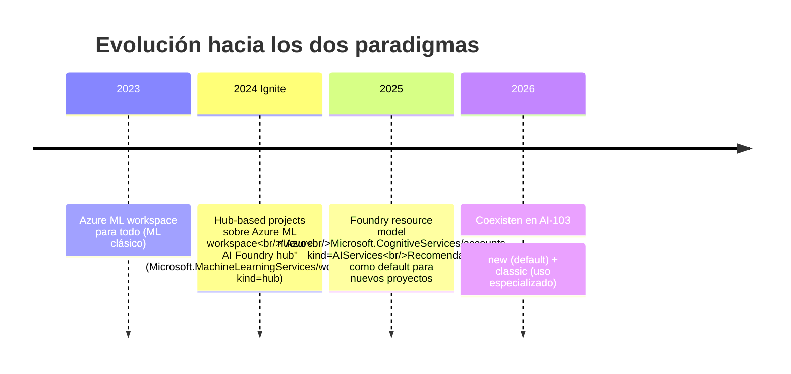
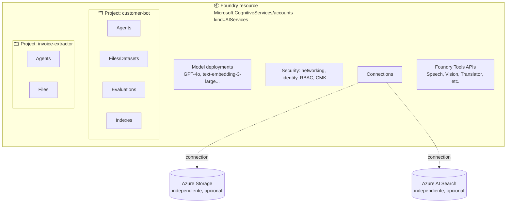
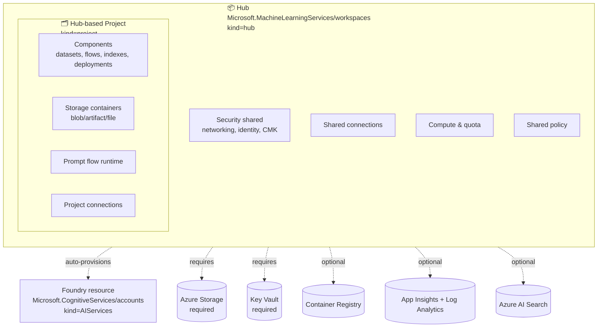
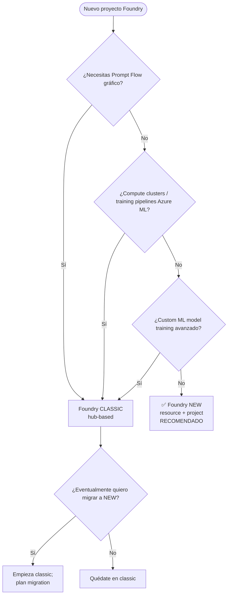

# Hubs (classic) vs Foundry resource + project (new) — arquitectura comparada

> [!abstract] TL;DR
> Microsoft Foundry tiene **dos paradigmas arquitectónicos coexistentes**:
> 1. **Foundry resource + project (new, default)** sobre `Microsoft.CognitiveServices/accounts` (kind `AIServices`). Top-level resource scope governance; cada `project` es subresource. **No requiere Storage/KV externos** para casos básicos.
> 2. **Hub + hub-based project (classic)** sobre `Microsoft.MachineLearningServices/workspaces` (kind `hub` y `project` respectivamente). Cuando creas un hub, **se provisiona automáticamente** un Foundry resource y se requieren Storage + KV (más AppInsights, ACR, AI Search opcionales). Necesario si quieres **prompt flow, managed compute, Azure ML compatibility, o advanced development features**.
>
> El AI-103 examina principalmente el modelo **new**, pero introduce preguntas-trampa con vocabulario classic ("hub", "Azure ML", "MLClient") que debes saber distinguir. Pista mental: **"hub" en el enunciado = classic**; ausencia de hub = new.

---

## 🎯 Relevancia en el examen

| Tipo de pregunta | Frecuencia |
|---|---|
| Reconocer si un escenario es classic o new por las pistas | 🔥🔥🔥 |
| Identificar el provider/kind correcto (`Microsoft.CognitiveServices` vs `Microsoft.MachineLearningServices`) | 🔥🔥🔥 |
| Saber qué recursos dependientes provisiona automáticamente el hub | 🔥🔥 |
| Diferenciar `AIProjectClient` (new) vs `MLClient` (classic) | 🔥🔥🔥 |
| Elegir el paradigma correcto para un escenario greenfield | 🔥🔥 |
| Migración hub → Foundry resource | 🔥 |
| Cuotas y compute compartidos a nivel hub vs a nivel resource | 🔥 |

---

## 📖 Concepto en profundidad

### Por qué existen dos paradigmas

Microsoft Foundry **no** es una reescritura desde cero. Es una **convergencia gradual** que mantiene compatibilidad con escenarios Azure ML pesados:



El **modelo new** simplifica el caso 80% (GenAI, agents, RAG, evaluación). El **classic** se reserva para casos que requieren la potencia de Azure ML (compute clusters, training pipelines, prompt flow gráfico).

### Anatomía del modelo NEW (Foundry resource + project)



| Capa | Resource type | Kind | Auto-provisioned |
|---|---|---|---|
| Foundry resource | `Microsoft.CognitiveServices/accounts` | `AIServices` | No, tú lo creas |
| Project | `Microsoft.CognitiveServices/accounts/projects` | `AIServices` | No, tú lo creas |
| Storage | `Microsoft.Storage/storageAccounts` | n/a | **No** (Foundry tiene managed storage por defecto) |
| Key Vault | `Microsoft.KeyVault/vaults` | n/a | **No** (Foundry tiene managed KV; conectas el tuyo si quieres BYO) |
| App Insights | `Microsoft.Insights/components` | n/a | **No** (opcional para tracing) |

**Característica clave**: Foundry resource **no obliga** a tener Storage/KV externos. Tiene managed storage interno. Es minimalista en provisioning.

### Anatomía del modelo CLASSIC (hub + hub-based project)



> [!important] Verbatim de docs Microsoft
> *"When you create an AI Hub, you automatically provision a Foundry resource."*
> *"Foundry AI Hub is an implementation of Azure Machine Learning and requires multiple Azure services as dependencies."*

**Recursos dependientes del hub (tabla literal de Microsoft):**

| Dependent resource | Provider | Optional | Para qué |
|---|---|---|---|
| Microsoft Foundry | `Microsoft.CognitiveServices/accounts` | **No (requerido)** | Acceso a modelos y APIs core de Foundry |
| Azure Storage Account | `Microsoft.Storage/storageAccounts` | **No (requerido)** | Artifacts (flows, evals). Containers prefijados con project GUID |
| Azure Key Vault | `Microsoft.KeyVault/vaults` | **No (requerido)** | Secrets de connections. Secrets NO recuperables entre projects via API |
| Azure Container Registry | `Microsoft.ContainerRegistry/registries` | ✔ Opcional | Imágenes Docker para custom runtime de prompt flow |
| App Insights + Log Analytics | `Microsoft.Insights/components` + `Microsoft.OperationalInsights/workspaces` | ✔ Opcional | Log storage para deployed prompt flows |
| Azure AI Search | `Microsoft.Search/searchServices` | ✔ Opcional | Search capabilities |

**Tres tipos de storage containers** que se crean automáticamente en cada hub-based project:
- `workspaceblobstore` → default data uploads
- `workspaceartifactstore` → components & metadata
- `workspacefilestore` → files de compute y prompt flow

### Comparativa profunda lado-a-lado

| Aspecto | **Foundry NEW** (resource + project) | **Foundry CLASSIC** (hub + project) |
|---|---|---|
| Top-level provider | `Microsoft.CognitiveServices/accounts` | `Microsoft.MachineLearningServices/workspaces` |
| Kind top-level | `AIServices` | `hub` |
| Project provider | `Microsoft.CognitiveServices/accounts/projects` | `Microsoft.MachineLearningServices/workspaces` (kind `project`) |
| Auto-provisiona Foundry? | N/A (ya **es** el Foundry resource) | Sí, lo crea automáticamente |
| Storage externo requerido | **No** (managed storage default) | **Sí (obligatorio)** |
| Key Vault externo requerido | **No** | **Sí (obligatorio)** |
| Portal | "New Foundry" toggle ON en `ai.azure.com` | "New Foundry" toggle OFF |
| SDK Python principal | `azure-ai-projects` (`AIProjectClient`) | `azure-ai-ml` (`MLClient`) |
| CLI principal | `az cognitiveservices account` + `az foundry` (parcial) | `az ml workspace --kind hub/project` |
| Managed compute | Para agents, evals, batch | Compute instances, clusters (Azure ML) |
| Managed VNet | Disponible | **Compartido** entre todos los projects del hub |
| Cuotas/policy compartidas | A nivel resource | A nivel hub |
| Prompt Flow gráfico | No (workflows AI-103-style) | **Sí** (esta es la razón principal de usar classic) |
| Azure ML compatibility | No directa | **Sí** (compute clusters, training pipelines, MLflow) |
| Fine-tuning | Sí, via Foundry resource | Sí, vía connection a Foundry resource |
| Recomendado para | **Default, 80% de casos** | Casos que requieren prompt flow / Azure ML |
| Migración | Punto de llegada | Punto de partida (hay migration path → new) |

### Cuándo usar cada uno (guidance oficial verbatim)

> [!info] Cita oficial — modelo NEW
> *"Consider the Foundry resource model when your scenario involves: First-time setup; Multi-team access; Compliance-driven design; Azure OpenAI migration. For single-developer exploration, a Foundry resource with one project is the recommended default."*

> [!info] Cita oficial — CLASSIC (hub-based)
> *"Use a hub project when you need prompt flow, managed compute, Azure Machine Learning compatibility, or advanced development features."*

**Síntesis de decisión:**



### Recursos compartidos en el hub (concepto evaluable)

El hub centraliza para **todos sus projects**:
- **Security** (public network access, CMK encryption, identity controls) → "pass down automatically to each project"
- **Connections** (data stores, model deployments existentes)
- **Compute and quota allocation** → "shared capacity for all projects in Foundry portal that share the same hub"
- **Policy** (Azure Policy a nivel hub se aplica a todos los projects)
- **Managed virtual network** → "shared between all projects that share the same hub"

> [!warning] Implicación examen
> Una pregunta puede contraponer "configurar a nivel hub" vs "configurar a nivel project". Las **security/network/policy/compute** son a nivel **hub** (compartidas). Los **assets (datasets, flows, indexes, deployments)** son a nivel **project**.

---

## 🏗️ Cómo se hace (Portal / Azure CLI / Bicep / Python SDK)

### A) Provisionar Foundry NEW (resource + project)

#### Azure CLI

```bash
# Foundry resource
az cognitiveservices account create \
  --name foundry-aieng \
  --resource-group rg-aieng \
  --location eastus \
  --kind AIServices \
  --sku S0 \
  --custom-domain foundry-aieng \
  --assign-identity \
  --yes

# Project (subresource)
az cognitiveservices account project create \
  --account-name foundry-aieng \
  --resource-group rg-aieng \
  --name customer-bot
```

> [!warning] ⚠️ Verificar comando `az cognitiveservices account project`
> El subcomando `project` puede aparecer bajo `az cognitiveservices`, `az foundry` o vía REST/ARM directo, según la versión de Azure CLI. Verifica con `az cognitiveservices account project --help` o `az foundry --help`. La forma garantizada es **ARM/Bicep**.

#### Bicep

```bicep
param location string = resourceGroup().location

resource foundry 'Microsoft.CognitiveServices/accounts@2024-10-01' = {
  name: 'foundry-aieng'
  location: location
  kind: 'AIServices'
  sku: { name: 'S0' }
  identity: { type: 'SystemAssigned' }
  properties: {
    customSubDomainName: 'foundry-aieng'
    disableLocalAuth: true
    publicNetworkAccess: 'Enabled'
  }
}

resource project 'Microsoft.CognitiveServices/accounts/projects@2024-10-01' = {
  name: 'customer-bot'
  parent: foundry
  properties: {}
}
```

#### Python SDK

```python
import os
from azure.ai.projects import AIProjectClient
from azure.identity import DefaultAzureCredential

endpoint = (
    "https://foundry-aieng.services.ai.azure.com/api/projects/customer-bot"
)
with (
    DefaultAzureCredential() as cred,
    AIProjectClient(endpoint=endpoint, credential=cred) as client,
):
    for d in client.deployments.list():
        print(d.name, d.model)
```

---

### B) Provisionar Foundry CLASSIC (hub + hub-based project)

#### Azure CLI

```bash
# Pre-requisito: instalar extensión ML
az extension add --name ml --upgrade

# Crear hub (auto-provisiona Foundry resource + Storage + KV)
az ml workspace create \
  --kind hub \
  --resource-group rg-aieng \
  --name myhub \
  --location eastus

# Crear hub-based project
az ml workspace create \
  --kind project \
  --resource-group rg-aieng \
  --name myproject \
  --hub-id "/subscriptions/<sub-id>/resourceGroups/rg-aieng/providers/Microsoft.MachineLearningServices/workspaces/myhub"
```

#### Python SDK

```python
from azure.ai.ml import MLClient
from azure.ai.ml.entities import Project
from azure.identity import DefaultAzureCredential

ml_client = MLClient(
    DefaultAzureCredential(),
    subscription_id="<sub-id>",
    resource_group_name="rg-aieng",
)

hub_id = (
    "/subscriptions/<sub-id>/resourceGroups/rg-aieng"
    "/providers/Microsoft.MachineLearningServices/workspaces/myhub"
)

my_project = Project(
    name="myproject",
    display_name="My Example Project",
    hub_id=hub_id,
)
created = ml_client.workspaces.begin_create(workspace=my_project).result()
print(created.name)
```

#### Bicep (esqueleto mínimo)

```bicep
param location string = resourceGroup().location

// Pre-existentes que el hub usará (Microsoft puede auto-crearlos si no existen)
resource storage 'Microsoft.Storage/storageAccounts@2023-01-01' = {
  name: 'sthubaieng'
  location: location
  sku: { name: 'Standard_LRS' }
  kind: 'StorageV2'
}

resource kv 'Microsoft.KeyVault/vaults@2023-07-01' = {
  name: 'kv-hubaieng'
  location: location
  properties: {
    tenantId: subscription().tenantId
    sku: { family: 'A', name: 'standard' }
    enableRbacAuthorization: true
    enableSoftDelete: true
  }
}

resource hub 'Microsoft.MachineLearningServices/workspaces@2024-10-01' = {
  name: 'myhub'
  location: location
  kind: 'hub'                  // ← clave que lo identifica como hub
  identity: { type: 'SystemAssigned' }
  properties: {
    friendlyName: 'My AI Hub'
    storageAccount: storage.id
    keyVault: kv.id
    publicNetworkAccess: 'Enabled'
  }
}

resource project 'Microsoft.MachineLearningServices/workspaces@2024-10-01' = {
  name: 'myproject'
  location: location
  kind: 'project'              // ← project, no hub
  properties: {
    hubResourceId: hub.id      // ← apunta al hub padre
  }
}
```

---

## 📊 Decisión rápida (cheat sheet)

| Pista en la pregunta | Paradigma |
|---|---|
| "**hub**" mencionado | Classic |
| "**Foundry resource**" o "**Foundry project**" sin "hub" | New |
| Provider `Microsoft.MachineLearningServices/workspaces` | Classic |
| Provider `Microsoft.CognitiveServices/accounts` con kind `AIServices` | New |
| `MLClient`, `azure-ai-ml`, `workspaces.begin_create()` | Classic |
| `AIProjectClient`, `azure-ai-projects` | New |
| `az ml workspace create --kind hub/project` | Classic |
| `az cognitiveservices account create --kind AIServices` | New |
| Prompt flow gráfico | Classic |
| Compute clusters Azure ML | Classic |
| Single-developer GenAI/agents | New (recomendado) |
| Multi-team con RBAC fino | New (recomendado) |

---

## 🪤 Trampas del examen

1. **"Hub" no significa "container governance" sino "Azure ML workspace de tipo hub"**. Si la pregunta lo usa metafóricamente como "centralized container", probablemente sigue refiriéndose al classic.
2. **Hub auto-provisiona Foundry resource**. Si te preguntan "¿qué se crea automáticamente con un hub?", el Foundry resource + Storage + KV obligatorios.
3. **Storage/KV no se pueden eliminar fácilmente sin afectar al hub**. Son dependientes obligatorios, no opcionales.
4. **Connections en el hub son compartidas entre projects**; **project connections** son privadas del project. La pregunta puede contraponer ambas.
5. **Managed VNet del hub es compartido**. Aislamiento de red ocurre **entre hubs**, NO entre projects del mismo hub.
6. **`MLClient.workspaces.list()` lista tanto hubs como hub-based projects** (ambos son "workspaces" en el provider Azure ML). El campo `kind` los distingue.
7. **Storage containers en hub-based projects**: `workspaceblobstore`, `workspaceartifactstore`, `workspacefilestore`. Si te piden el nombre por defecto del blob store, es `workspaceblobstore`.
8. **Containers prefijados con project GUID** para data isolation. Importante para compliance.
9. **Key Vault secrets NO recuperables across projects via API** — aislamiento por project en el hub.
10. **Cuotas compartidas a nivel hub**: si un project consume tokens, agota la cuota del hub para los demás projects también.
11. **Translator API solo a nivel Foundry resource**, no a nivel project. Vale para new model; en classic, sigue siendo el Foundry resource auto-provisionado.
12. **Migración hub → new no es automática**. Existe doc `migrate-project` pero es proceso explícito.

---

## 🧠 Mnemotecnia

> **"Hub = Hijo de Azure ML; Foundry resource = Inquilino directo de CognitiveServices."**
>
> **Para distinguir paradigma:**
> - Aparece **"hub"** o **"Azure ML"** o **"MLClient"** → **CLASSIC**.
> - Aparece **"Foundry resource"** o **"AIProjectClient"** o **"AIServices kind"** → **NEW**.
>
> **Para recursos auto-provisionados por hub:**
> "**HKS-FK**" — Hub Konfigurado con Storage, Foundry y Key vault (obligatorios).
> ACR, App Insights y AI Search son opcionales.

> **Regla del 80/20:**
> - 80 % de los escenarios → **NEW** (default greenfield).
> - 20 % → **CLASSIC** (prompt flow, training Azure ML, compute clusters).

---

## 🔗 Conceptos relacionados

- [[00-microsoft-foundry-overview]] — el archivo padre que introduce los dos paradigmas
- [[00-foundry-vs-azure-ai-foundry-nomenclature]] — por qué Microsoft mantiene dos modelos
- [[plan-azure-infrastructure-ai-apps]] — diseño de infra alrededor de Foundry
- [[plan-deployment-options-models-agents]] — deployment types compatibles con cada paradigma
- [[plan-security-managed-identity]] — managed identity en hub vs Foundry resource
- [[plan-security-rbac-role-policies]] — Foundry roles vs Azure ML roles
- [[plan-cicd-foundry-integration]] — Bicep/ARM para ambos paradigmas
- [[genai-foundry-sdk-integration]] — `AIProjectClient` en detalle
- [[genai-prompt-flow]] ⚠️ AI-102 carryover — prompt flow vive en hub-based

---

## ❓ Autotest

> [!question] 1
> Lees: *"You create an Azure AI hub with Owner permissions and then create a project inside it."* ¿En qué paradigma estás?
>
> a) Foundry new (resource + project).
> b) Foundry classic (hub-based).
> c) Azure Machine Learning standalone.
> d) Azure OpenAI standalone.

<details><summary>Respuesta</summary>

**b)** La palabra "hub" + "Owner permissions on the hub resource" es el patrón **classic** (`Microsoft.MachineLearningServices/workspaces` kind `hub`). El requisito "Owner or Contributor on the hub resource" aparece literal en docs de Foundry classic.

</details>

> [!question] 2
> ¿Cuáles de estos recursos provisiona automáticamente la creación de un hub? (multi-respuesta)
>
> a) Foundry resource (`Microsoft.CognitiveServices/accounts`)
> b) Azure Storage Account
> c) Azure Key Vault
> d) Azure Container Registry
> e) Azure AI Search

<details><summary>Respuesta</summary>

**a, b, c** (Foundry resource, Storage Account y Key Vault son **obligatorios** y se auto-provisionan si no los provees). (d) ACR es **opcional** (solo si usas custom runtime para prompt flow). (e) AI Search es **opcional**.

</details>

> [!question] 3
> Tienes un script `from azure.ai.ml import MLClient; ml_client.workspaces.list()`. ¿Qué te devuelve esa llamada?
>
> a) Solo los hubs.
> b) Solo los hub-based projects.
> c) Hubs y hub-based projects mezclados; los distingues por el campo `kind`.
> d) Solo Foundry resources (new model).

<details><summary>Respuesta</summary>

**c)** En el provider Azure ML, tanto los hubs como los hub-based projects son `workspaces` con `kind=hub` o `kind=project`. `workspaces.list()` los devuelve todos. **No** devuelve Foundry resources del modelo new (esos viven en otro provider).

</details>

> [!question] 4
> Necesitas un setup donde varios equipos compartan una **managed virtual network** pero cada equipo tenga su propio workspace de desarrollo aislado en términos de assets. ¿Qué paradigma encaja mejor?
>
> a) Foundry new: cada equipo crea su Foundry resource.
> b) Foundry classic: un hub compartido, un hub-based project por equipo.
> c) Foundry new: un Foundry resource compartido, un project por equipo.
> d) Azure OpenAI standalone con private endpoints por equipo.

<details><summary>Respuesta</summary>

**b)** El modelo classic comparte la **managed virtual network entre todos los projects del mismo hub** (verbatim docs). Cada hub-based project aísla sus assets. El modelo new también separa assets por project, pero el patrón VNet-compartido es **canónico de classic**. Si te dan opción (c) y crees que es válida, fíjate si la pregunta enfatiza "managed VNet": eso señala classic.

</details>

> [!question] 5
> Migras un workload desde un Foundry classic hub al modelo new. ¿Qué afirmación es CIERTA?
>
> a) La migración es automática vía un toggle del portal.
> b) Es proceso explícito (doc `migrate-project`); se mantienen las model deployments pero los flows de prompt flow no son portables directamente.
> c) Tienes que borrar el hub primero.
> d) El SDK migra los assets automáticamente al cambiar de import statement.

<details><summary>Respuesta</summary>

**b)** Existe un proceso documentado de migración (`migrate-project` en docs Foundry classic). No es automático. Prompt flow gráfico es **clásico-only** y no tiene equivalente directo en el modelo new (que usa "workflows, tool-augmented flows, multistep reasoning pipelines" como reemplazo conceptual). Model deployments y connections son migrables.

</details>

---

## ✅ Control de calidad (auto-rúbrica)

| Dimensión | Nota |
|---|---|
| Completitud | **9.5** — ambos paradigmas con anatomía, recursos dependientes verbatim, provisioning Portal/CLI/Bicep/SDK, decision tree, migración. |
| Exactitud técnica | **9.5** — verificado verbatim contra arquitectura Foundry y Foundry classic en Microsoft Learn (actualizados 2026-05-18). Providers, kinds, dependent resources y comandos Azure CLI listados tal cual aparecen en docs. |
| Alineación al examen | **9.5** — trampas extraídas del patrón Microsoft típico (mezclar vocabulario classic/new, MLClient vs AIProjectClient, etc.). |
| Claridad pedagógica | **9.0** — diagramas mermaid de ambos paradigmas + decision tree + tabla comparativa + 5 autotest. |

*Todas las dimensiones ≥ 9 — archivo aprobado.*

---

*Verificado a fecha 2026-05-21 contra Microsoft Learn (arquitectura Foundry + Foundry classic). Próxima revisión sugerida tras GA AI-103 (junio 2026).*
