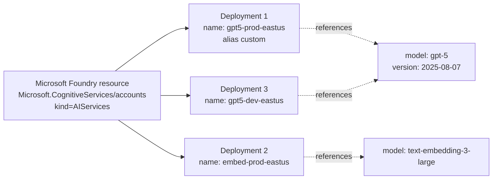
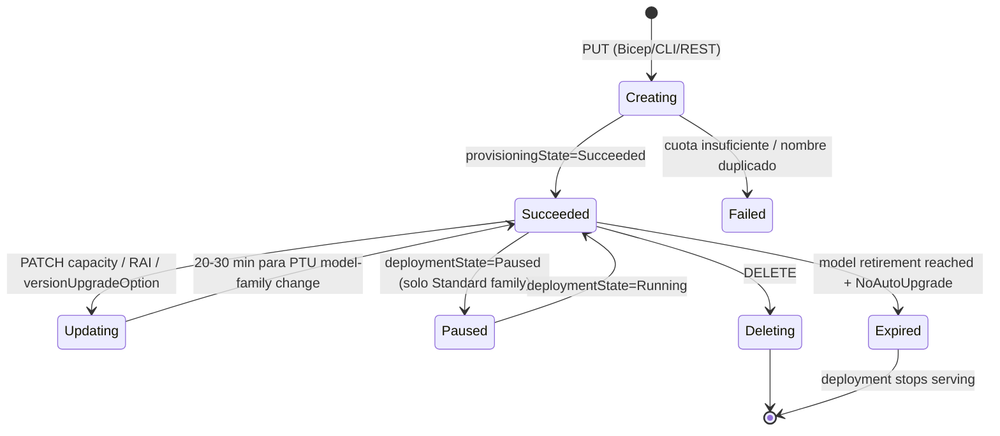
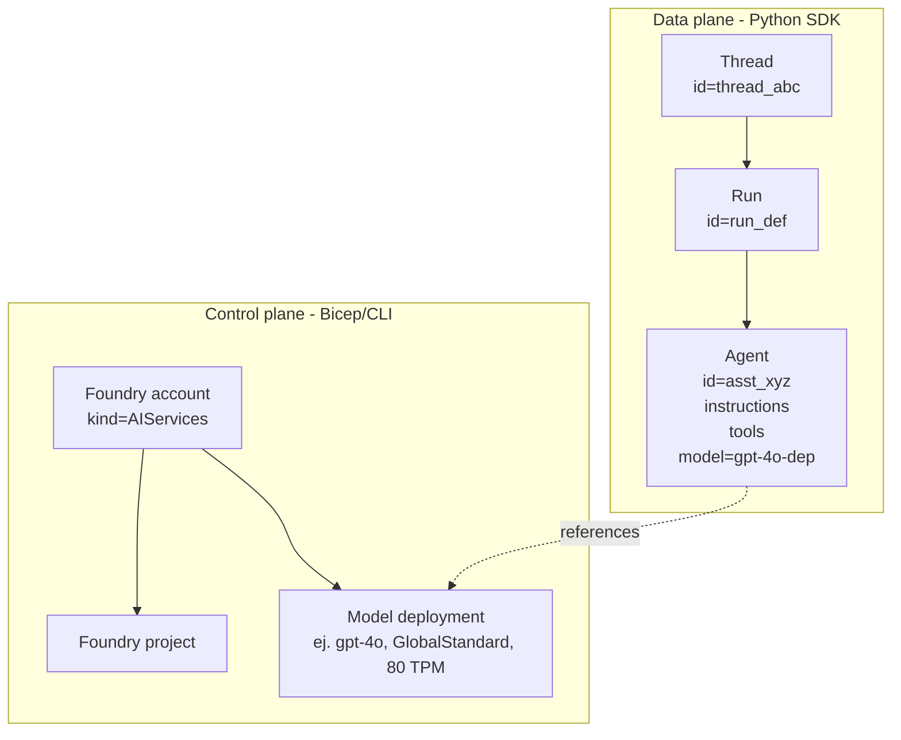
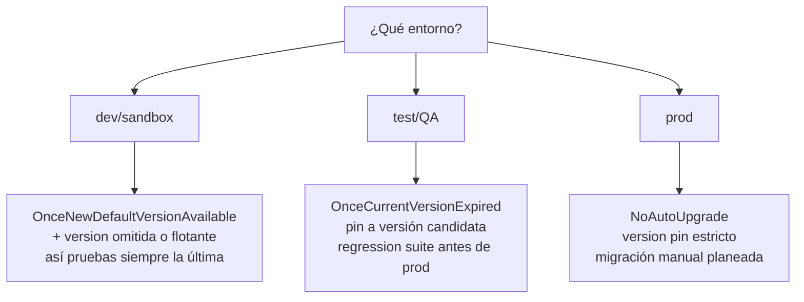

# Configurar model y agent deployments (Foundry)

> [!abstract] TL;DR
> Un **model deployment** es un recurso ARM hijo (`Microsoft.CognitiveServices/accounts/deployments`) cuyo *nombre* es un **alias custom** que tu app usa como `deployment_name` (no confundir con `model.name`). La configuración crítica que entra en examen: **`sku.name` + `sku.capacity`**, **`model.format/name/version`**, **`versionUpgradeOption`** (sólo 3 valores), **`raiPolicyName`** y **`tags`**. Un **agent**, en cambio, **NO es un recurso ARM**: se crea por **data plane** vía `AIProjectClient.agents.create_agent()` apuntando a un *model deployment* existente. Sabe distinguir control plane (Bicep/ARM/CLI) vs data plane (SDK agents), domina el lifecycle (create → scale → update version → delete) y memoriza las 3 opciones de auto-upgrade — son tres preguntas fijas en AI-103.

## 🎯 Relevancia en el examen

| Escenario típico | Frecuencia | Cómo lo pregunta |
| --- | --- | --- |
| "¿Cómo evitar que un deployment se actualice solo y rompa el prompt?" | 🔥🔥🔥 | Opción correcta: `versionUpgradeOption = "NoAutoUpgrade"` |
| "¿Qué pasa cuando llega la *retirement date* y `NoAutoUpgrade` está set?" | 🔥🔥🔥 | El deployment **deja de funcionar**, no migra |
| "¿Cómo cambia la capacity de un GlobalStandard sin downtime?" | 🔥🔥 | PUT/PATCH al `sku.capacity` (online, in-place) |
| "¿Por qué falla `client.chat.completions.create(model="gpt-4o")`?" | 🔥🔥🔥 | `model` aquí = **deployment name** (alias), no el model name |
| "¿Cómo despliegas un agent por código?" | 🔥🔥 | `AIProjectClient.agents.create_agent()` — NO Bicep |
| "Versionar dev/test/prod en un mismo Foundry resource" | 🔥🔥 | Deployments separados (no slots), Bicep parametrizado |
| Migrar PTU entre versiones de modelo | 🔥🔥 | In-place migration o multi-deployment |

> [!warning] Este sub-tema arrastra del AI-102 (gestión de deployments de Azure OpenAI) pero **amplía** con: Foundry-only resource (`kind=AIServices`), agent deployment data-plane, model-router routing config, `spilloverDeploymentName`, `serviceTier=Priority`.

---

## 📖 Concepto en profundidad

### 1. Anatomía de un *model deployment*



Un *deployment* es **un alias direccionable** sobre un par `(model name, model version)` con su **SKU, capacity, RAI policy** y política de upgrade. **Nada se sirve si no hay deployment** — tener acceso al modelo en el catálogo no basta.

### 2. Resource type y schema verbatim

`Microsoft.CognitiveServices/accounts/deployments@2026-03-01` (API GA más reciente verificada).

Propiedades clave del objeto **`properties`** (verbatim de docs):

| Propiedad | Tipo / valores | Uso |
| --- | --- | --- |
| `model.format` | string (`OpenAI`, `Meta`, `Mistral`, `Cohere`, etc.) | Publisher catalogue family |
| `model.name` | string | Nombre canónico (`gpt-4o-mini`, `gpt-5`, `text-embedding-3-large`) |
| `model.version` | string (ej. `2024-07-18`, `0613`) | **Opcional**. Si omites, se asigna *default version* (puede cambiar con el tiempo) |
| `versionUpgradeOption` | `OnceNewDefaultVersionAvailable` \| `OnceCurrentVersionExpired` \| `NoAutoUpgrade` | Política de auto-upgrade. **3 valores fijos** |
| `raiPolicyName` | string | Nombre de la RAI policy aplicada. Si omites → `Microsoft.Default` |
| `currentCapacity` | int (read-only) | Capacity efectiva en uso |
| `deploymentState` | `Running` \| `Paused` | Pausar conserva config sin servir tráfico (solo Standard / DataZoneStandard / GlobalStandard) |
| `serviceTier` | `Default` \| `Priority` | `Priority` = pricing premium con prioridad de procesado |
| `spilloverDeploymentName` | string | Si throttling, redirige al deployment indicado |
| `routing.mode` | `balanced` \| `cost` \| `quality` | Solo para `model-router` ≥ v2025-11-18 |

Y del objeto **`sku`**:

| Propiedad | Valor común | Significado |
| --- | --- | --- |
| `name` | `Standard`, `GlobalStandard`, `DataZoneStandard`, `GlobalBatch`, `DataZoneBatch`, `ProvisionedManaged`, `GlobalProvisionedManaged`, `DataZoneProvisionedManaged`, `DeveloperTier` | **Deployment type** (ver [[plan-deployment-options-models-agents]]) |
| `capacity` | int | TPM en miles para Standard (1 = 1,000 TPM); **PTUs** para Provisioned |
| `tier` | `Basic` \| `Enterprise` \| `Free` \| `Premium` \| `Standard` | Rara vez se setea explícito en deployments |

> [!important] **`capacity` semántica según SKU**
> - Standard / GlobalStandard / DataZoneStandard → **TPM en miles**. `capacity: 80` ⇒ 80,000 TPM (y por mapping interno también una *requests-per-minute* derivada — ver [[plan-quotas-scaling-rate-limits]]).
> - ProvisionedManaged / GlobalProvisionedManaged / DataZoneProvisionedManaged → **PTUs** (Provisioned Throughput Units). `capacity: 100` ⇒ 100 PTUs.
> - Batch → **Enqueued tokens**.

### 3. Lifecycle del deployment



### 4. Anatomía de un *agent deployment* (Foundry Agent Service)

Diferente paradigma totalmente:

- **Control plane** (ARM/Bicep): **NO** existe un recurso `Microsoft.CognitiveServices/.../agents`. Lo que sí provisionas con Bicep es la **infraestructura** del agent setup: cuenta Foundry + project + **un model deployment subyacente** (+ opcionalmente AI Search, Cosmos DB y Storage en el setup *Standard*).
- **Data plane** (SDK Python `azure-ai-projects`): un agent se crea con `project_client.agents.create_agent(...)` y vive como objeto JSON dentro del project, identificado por `agent.id` (`asst_...`).



Configuración del agent (parámetros `create_agent`):

| Parámetro | Tipo | Notas |
| --- | --- | --- |
| `model` | string (required) | **Deployment name** (no model name). Es el alias de un model deployment ya existente |
| `name` | string | Nombre lógico (no es ID) |
| `instructions` | string | System prompt; persiste a lo largo de runs |
| `tools` | list[ToolDefinition] | `CodeInterpreterTool`, `FileSearchTool`, `BingGroundingTool`, `AzureAISearchTool`, custom function tools, OpenAPI tools, MCP… |
| `tool_resources` | dict | Vector stores, file IDs, etc. asociados a los tools |
| `top_p`, `temperature`, `response_format` | varios | Hyperparams del agent |

Thread storage:
- **Basic setup** (multi-tenant): threads/messages guardados en infra Microsoft-managed (sin visibilidad cliente).
- **Standard setup** (BYO): threads/messages persistidos en **tu Cosmos DB** + files en **tu Storage** + vector store en **tu AI Search**. Más control, más coste.

### 5. Naming convention

Nombre del deployment ARM:
- **Único dentro del Foundry resource** (no globalmente).
- Longitud 2-64, alfanumérico + `-`.
- Recomendado: `<model-family>-<env>-<region>` ⇒ `gpt5-prod-eastus`, `embed3-dev-westeu`.
- El nombre es **estable** — tu código de cliente lo referencia. Renombrar = delete + recreate (rompe consumidores).

### 6. `versionUpgradeOption` — los tres únicos valores

| Valor | Comportamiento exacto |
| --- | --- |
| `OnceNewDefaultVersionAvailable` | Cuando Microsoft designa una nueva versión como *default*, el deployment **se actualiza automáticamente en ≤ 2 semanas** desde el cambio de default. Equivale al setting de portal "Auto-update to default". |
| `OnceCurrentVersionExpired` | El deployment **mantiene la versión actual** hasta la *retirement date*. Al alcanzar retirement, se migra automáticamente a la default. **Es el comportamiento si el valor está `null`/no setteado.** |
| `NoAutoUpgrade` | **Nunca** auto-actualiza. Cuando la versión actual alcanza retirement, el deployment **deja de servir** requests. Tienes que apuntar tu código a otro deployment. |

> [!tip] **Solo se aplica a Standard family**. Provisioned deployments NO usan `versionUpgradeOption` para migración automática — usan **in-place migration** o **multi-deployment migration** manualmente (te lo voy a preguntar).

### 7. `raiPolicyName` (Responsible AI content filter)

- Si no especificas, se aplica `Microsoft.Default` (V2).
- Reasignar la policy a otro deployment es **un PATCH al deployment** apuntando a otra `raiPolicyName` ya creada en la cuenta.
- **No editas la policy in-place una vez que está aplicada** — creas una nueva con la nueva configuración y reapuntas. Para crear policies custom ver [[responsible-content-filters-azure-openai]].

### 8. Capacity scaling

- **Scale up (aumentar TPM)**: PATCH al `sku.capacity`, online (sin downtime).
- **Scale down**: PATCH al `sku.capacity`, también online pero las requests en cola pueden experimentar throttling temporal mientras la capacity se reasigna.
- **Para PTU**: scale capacity in-place permitido si hay capacity disponible en la región; si no, falla.

### 9. `dynamicThrottlingEnabled` — propiedad de la **cuenta**, no del deployment

> [!warning] Corrección crítica que entra en examen
> `dynamicThrottlingEnabled` vive en `Microsoft.CognitiveServices/accounts.properties`, **no** en `accounts/deployments.properties`. Es global a la cuenta Foundry. Habilítalo a nivel cuenta y se aplica a los deployments Standard que lo soporten. Distingue esto del **Dynamic Quota** documentado para algunos modelos OpenAI (mismo concepto, configuración a nivel cuenta).

### 10. Soft-delete / purge

Lo que tiene soft-delete con ventana de 48h es la **cuenta Cognitive Services** completa (`Microsoft.CognitiveServices/accounts`), no los deployments individuales. Si borras un *deployment*, desaparece inmediatamente y libera capacity en la región. Si borras la *cuenta*, el nombre queda **soft-deleted 48 h** y otro tenant no puede reclamarlo (ni tú crear una nueva con el mismo nombre sin purgar primero con `az cognitiveservices account purge`).

---

## 🏗️ Cómo se hace (Bicep / Azure CLI / Python SDK / REST)

### Bicep — Global Standard con version pinning y RAI custom

```bicep
@description('Foundry account name')
param accountName string

@description('Region')
param location string = resourceGroup().location

@description('Environment')
@allowed([ 'dev', 'test', 'prod' ])
param env string = 'dev'

@description('Capacity in thousands of TPM (Standard) or PTUs (Provisioned)')
param capacityValue int = 80

resource foundry 'Microsoft.CognitiveServices/accounts@2025-06-01' = {
  name: accountName
  location: location
  kind: 'AIServices'
  sku: { name: 'S0' }
  identity: { type: 'SystemAssigned' }
  properties: {
    publicNetworkAccess: 'Enabled'
    disableLocalAuth: true            // keyless por defecto
    dynamicThrottlingEnabled: true    // cuenta-level
  }
}

// RAI policy custom (opcional). Ver [[responsible-content-filters-azure-openai]]
resource raiPolicy 'Microsoft.CognitiveServices/accounts/raiPolicies@2025-06-01' = {
  parent: foundry
  name: 'strict-policy-v1'
  properties: {
    mode: 'Blocking'
    contentFilters: [
      { name: 'hate',     blocking: true, enabled: true, severityThreshold: 'Medium', source: 'Prompt'     }
      { name: 'hate',     blocking: true, enabled: true, severityThreshold: 'Medium', source: 'Completion' }
      { name: 'violence', blocking: true, enabled: true, severityThreshold: 'Medium', source: 'Prompt'     }
      { name: 'violence', blocking: true, enabled: true, severityThreshold: 'Medium', source: 'Completion' }
      // sexual, selfharm, jailbreak, protected_material_text/code ...
    ]
  }
}

resource gpt5Deployment 'Microsoft.CognitiveServices/accounts/deployments@2026-03-01' = {
  parent: foundry
  name: 'gpt5-${env}-${location}'                  // alias custom estable
  sku: {
    name: 'GlobalStandard'
    capacity: capacityValue                         // 80 = 80,000 TPM
  }
  properties: {
    model: {
      format: 'OpenAI'
      name: 'gpt-5'
      version: '2025-08-07'                         // version pinning en prod
    }
    versionUpgradeOption: env == 'prod' ? 'NoAutoUpgrade' : 'OnceNewDefaultVersionAvailable'
    raiPolicyName: raiPolicy.name
  }
  tags: {
    env: env
    costCenter: 'ai-platform'
    owner: 'team-foundry'
  }
}
```

### Bicep — Provisioned (PTU) deployment

```bicep
resource gpt5Ptu 'Microsoft.CognitiveServices/accounts/deployments@2026-03-01' = {
  parent: foundry
  name: 'gpt5-ptu-prod'
  sku: {
    name: 'GlobalProvisionedManaged'
    capacity: 100                                   // 100 PTUs
  }
  properties: {
    model: {
      format: 'OpenAI'
      name: 'gpt-5'
      version: '2025-08-07'
    }
    // versionUpgradeOption no auto-migra entre versiones en PTU;
    // se usa in-place o multi-deployment migration manualmente.
    raiPolicyName: 'Microsoft.Default'
  }
}
```

### Azure CLI — create / list / show / delete

```bash
# Quota check ANTES de deploy (falla rápido si no hay)
az cognitiveservices usage list \
  --location eastus \
  --query "[?contains(name.value,'gpt-5')]" -o table

# Create deployment Global Standard
az cognitiveservices account deployment create \
  --resource-group rg-ai-prod \
  --name my-foundry-acct \
  --deployment-name gpt5-prod-eastus \
  --model-format OpenAI \
  --model-name gpt-5 \
  --model-version 2025-08-07 \
  --sku-name GlobalStandard \
  --sku-capacity 80

# Listar deployments de la cuenta
az cognitiveservices account deployment list \
  --resource-group rg-ai-prod --name my-foundry-acct -o table

# Show single deployment (incluye versionUpgradeOption si está set)
az cognitiveservices account deployment show \
  --resource-group rg-ai-prod --name my-foundry-acct \
  --deployment-name gpt5-prod-eastus

# Delete
az cognitiveservices account deployment delete \
  --resource-group rg-ai-prod --name my-foundry-acct \
  --deployment-name gpt5-prod-eastus
```

> [!warning] El CLI **`az cognitiveservices account deployment create`** **no expone** los parámetros `--rai-policy-name` ni `--version-upgrade-option` en su superficie GA (verificado en docs ms.date 2026-04-14). Para setear esos campos hay que usar **REST PUT** o **Bicep/ARM**. Igualmente, `az cognitiveservices account deployment` no permite **update** del `versionUpgradeOption` en CLI (es read-only en `show`). ⚠️

### REST — PATCH para resize y cambiar versionUpgradeOption

```http
PUT https://management.azure.com/subscriptions/{subId}/resourceGroups/{rg}/providers/Microsoft.CognitiveServices/accounts/{accountName}/deployments/gpt5-prod-eastus?api-version=2025-06-01
Authorization: Bearer {token}
Content-Type: application/json

{
  "sku": { "name": "GlobalStandard", "capacity": 120 },
  "properties": {
    "model": { "format": "OpenAI", "name": "gpt-5", "version": "2025-08-07" },
    "versionUpgradeOption": "NoAutoUpgrade",
    "raiPolicyName": "strict-policy-v1"
  }
}
```

### Python control plane — `azure-mgmt-cognitiveservices`

```python
# pip install azure-mgmt-cognitiveservices azure-identity
from azure.identity import DefaultAzureCredential
from azure.mgmt.cognitiveservices import CognitiveServicesManagementClient
from azure.mgmt.cognitiveservices.models import (
    Deployment, DeploymentProperties, DeploymentModel, Sku,
)

cred = DefaultAzureCredential()
client = CognitiveServicesManagementClient(cred, subscription_id="<sub-id>")

deployment = Deployment(
    sku=Sku(name="GlobalStandard", capacity=80),
    properties=DeploymentProperties(
        model=DeploymentModel(
            format="OpenAI",
            name="gpt-5",
            version="2025-08-07",
        ),
        version_upgrade_option="NoAutoUpgrade",
        rai_policy_name="strict-policy-v1",
    ),
    tags={"env": "prod", "owner": "team-foundry"},
)

poller = client.deployments.begin_create_or_update(
    resource_group_name="rg-ai-prod",
    account_name="my-foundry-acct",
    deployment_name="gpt5-prod-eastus",
    deployment=deployment,
)
result = poller.result()
print(f"Provisioning state: {result.properties.provisioning_state}")

# Resize online
result.sku.capacity = 120
poller = client.deployments.begin_create_or_update(
    "rg-ai-prod", "my-foundry-acct", "gpt5-prod-eastus", result
)
poller.result()
```

### Python data plane — crear un agent contra ese deployment

```python
# pip install azure-ai-projects azure-identity
import os
from azure.ai.projects import AIProjectClient
from azure.identity import DefaultAzureCredential
from azure.ai.agents.models import CodeInterpreterTool, FileSearchTool

project_client = AIProjectClient(
    endpoint=os.environ["PROJECT_ENDPOINT"],   # https://<acct>.services.ai.azure.com/api/projects/<proj>
    credential=DefaultAzureCredential(),
)

with project_client:
    code = CodeInterpreterTool()

    agent = project_client.agents.create_agent(
        model="gpt5-prod-eastus",              # ← DEPLOYMENT NAME, no model name
        name="finance-assistant",
        instructions=(
            "Eres un asistente financiero. Usa code interpreter para cálculos. "
            "Responde siempre en EUR."
        ),
        tools=code.definitions,
        tool_resources=code.resources,
    )
    print(f"agent.id = {agent.id}")            # asst_xxx
```

---

## 📊 Tablas comparativas / cuándo usar qué

### Decisión: `versionUpgradeOption` por entorno



### Comparativa Model deployment vs Agent

| Eje | Model deployment | Agent |
| --- | --- | --- |
| Resource type | `Microsoft.CognitiveServices/accounts/deployments` | (no ARM) JSON object dentro del project |
| Plano | Control plane (ARM) | Data plane (SDK) |
| Lenguaje IaC | Bicep / ARM / Terraform AzAPI | Python / .NET / JS / Java / REST |
| Identidad | URI ARM con resource ID | `asst_xxx` |
| Idempotencia | PUT idempotente | POST crea siempre uno nuevo (id distinto) |
| Versionado | `model.version` + `versionUpgradeOption` | Sin versionado nativo — controlas tú con names |
| Borrado | DELETE ARM | `client.agents.delete_agent(agent_id)` |
| Coste | Por TPM / PTU / batch | Sólo el coste del model deployment subyacente + storage (si Standard setup) |

### SKU `name` exhaustivo (verificado contra docs)

| `sku.name` | Deployment type | Unit `capacity` | Cuándo |
| --- | --- | --- | --- |
| `Standard` | Regional Standard PAYG | TPM/1000 | Latencia previsible misma región |
| `GlobalStandard` | Global Standard PAYG | TPM/1000 | Throughput máximo, latencia variable |
| `DataZoneStandard` | Data Zone Standard PAYG | TPM/1000 | Residencia EU/US zone-bounded |
| `GlobalBatch` | Global Batch | Enqueued tokens | Cargas asíncronas 50 % off |
| `DataZoneBatch` | Data Zone Batch | Enqueued tokens | Batch zone-bounded |
| `ProvisionedManaged` | Regional PTU | PTUs | Reserva regional |
| `GlobalProvisionedManaged` | Global PTU | PTUs | Reserva global |
| `DataZoneProvisionedManaged` | Data Zone PTU | PTUs | Reserva zone-bounded |
| `DeveloperTier` | Developer | TPM/1000 | Pruebas (24 h lifetime, sin SLA) ⚠️ |

---

## 🪤 Trampas del examen

1. **`deployment name ≠ model name`**. En todo el SDK (Azure OpenAI, Foundry Agents, REST API) cuando el parámetro se llama `model` te están pidiendo el **deployment name** (tu alias). Confundirlos rompe con `404 DeploymentNotFound`.
2. **`versionUpgradeOption` tiene SÓLO 3 valores**: `OnceNewDefaultVersionAvailable`, `OnceCurrentVersionExpired`, `NoAutoUpgrade`. **No existen** `'auto'`, `'latest'`, `'manual'`. Si una opción de respuesta tiene otro string, es trampa.
3. **`null` ≡ `OnceCurrentVersionExpired`**. Si nunca tocaste la propiedad, el comportamiento default **NO** es "no upgrade" — es "upgrade cuando expire la versión actual".
4. **`NoAutoUpgrade` + retirement date alcanzada = deployment muerto**. No se migra "por seguridad", deja de servir. Tu app empieza a recibir errores en producción si no migraste a tiempo.
5. **Provisioned (PTU) NO sigue `versionUpgradeOption`** para cambio de versión. Hay que hacer **in-place migration** (PUT con nuevo `model.version`, downtime ~20-30 min con state `Updating`) o **multi-deployment migration** (deployment paralelo + drenaje de tráfico).
6. **`dynamicThrottlingEnabled` está en la cuenta, no en el deployment**. Trampa clásica: "configura dynamic throttling en el deployment X" → respuesta correcta = en la cuenta Foundry.
7. **Agents NO son ARM resources**. Bicep que intenta `Microsoft.CognitiveServices/.../agents` no compila. Para deploy reproducible de agents en CI/CD usas SDK + scripts.
8. **CLI `az cognitiveservices account deployment create` no expone `--rai-policy-name` ni `versionUpgradeOption`** (a fecha 2026-05). Para setearlos hay que ir a Bicep/REST. Si la pregunta dice "usa CLI" para configurar RAI policy en el deployment, es una **opción incorrecta**.
9. **`capacity` semántica cambia por SKU**. `capacity: 100` en `GlobalStandard` = 100,000 TPM; en `GlobalProvisionedManaged` = 100 PTUs (≠ TPM). Confusión típica.
10. **Cambiar `model.name` o el deployment `name` requiere delete + recreate**. PATCH al `model.name` falla. Sólo `sku.capacity`, `versionUpgradeOption`, `raiPolicyName`, `model.version` (Standard) y `serviceTier` son editables in-place.
11. **Soft-delete 48 h aplica a la cuenta Foundry, no a deployments individuales**. Borrar un deployment es inmediato e irreversible — recreas con el mismo nombre al instante.
12. **`deploymentState = Paused` sólo en Standard family** (`Standard`, `DataZoneStandard`, `GlobalStandard`). En Provisioned/Batch no puedes pausar.
13. **API version `2023-10-01-preview`** introdujo `dynamicThrottlingEnabled` y `versionUpgradeOption`. APIs anteriores no soportan estas props — si te muestran un Bicep con `apiVersion: '2023-05-01'` y esperan `versionUpgradeOption`, no funcionará.
14. **`raiPolicyName` apunta a una `raiPolicies` ya creada**, no es un objeto inline. Si lo declaras en Bicep sin `dependsOn`/símbolo del policy, la deployment puede racear y fallar.

---

## 🧠 Mnemotecnia

- **"NON" = los 3 upgrade options**: **N**oAutoUpgrade · **O**nceCurrentVersionExpired · **O**nceNewDefaultVersionAvailable. Tres letras N-O-O.
- **"SCAR" = lo que es editable in-place**: **S**ku.capacity · **C**ontent filter (raiPolicyName) · **A**uto-upgrade option · **R**evision (model.version, sólo Standard).
- **"DARC" = lo que NO se edita** (delete + recreate): **D**eployment name · **A**ccount kind · **R**egion (location) · **C**hange of model.name.
- **"GDPB"** orden de SKU types por **autonomía geográfica decreciente**: **G**lobal → **D**ata Zone → **P**rovisioned regional → **B**atch.
- Para `versionUpgradeOption` recuerda el **default null = OCE** ("**O**lvidé **C**onfigurar, **E**xpira y migra").

---

## 🔗 Conceptos relacionados

- [[plan-deployment-options-models-agents]] — la *decisión* del SKU (Global vs Data Zone vs Regional, Standard vs PTU vs Batch). Este archivo cubre la *configuración detallada* del SKU ya elegido.
- [[plan-quotas-scaling-rate-limits]] — TPM/PTU quotas, dynamic quota a nivel cuenta, rate limits.
- [[plan-foundry-hubs-projects]] — dónde viven los deployments (account scope) y los agents (project scope).
- [[plan-azure-infrastructure-ai-apps]] — provisioning Bicep end-to-end.
- [[plan-cicd-foundry-integration]] — pipelines y promoción dev/test/prod con parametrización.
- [[agents-microsoft-foundry-agent-service]] — profundización en `create_agent`, threads, runs, tools.
- [[responsible-content-filters-azure-openai]] — definición y management de `raiPolicies`.
- [[plan-cost-management-foundry]] — coste por SKU y por capacity, tagging strategy.
- [[plan-security-rbac-role-policies]] — rol `Cognitive Services Contributor` necesario para create/update/delete deployments.

---

## ❓ Autotest

**1.** En un Bicep, declaras un `Microsoft.CognitiveServices/accounts/deployments` con `properties.model = { format: 'OpenAI', name: 'gpt-4o' }` y sin más. Pasa una semana, Microsoft publica `gpt-4o` versión nueva y la designa default. ¿Qué pasa con tu deployment?

a) Se actualiza inmediatamente a la nueva versión.  
b) Se actualiza a la nueva versión cuando la versión actual sea retirada (default = `OnceCurrentVersionExpired`).  
c) No se actualiza nunca, queda en la versión actual.  
d) Falla la próxima request con `VersionMismatch`.

<details><summary>Respuesta</summary>

**b)**. Si `versionUpgradeOption` no se setea (`null`), el comportamiento es equivalente a `OnceCurrentVersionExpired`: el deployment mantiene su versión actual hasta retirement date, y entonces se migra automáticamente a la nueva default. La a) sería `OnceNewDefaultVersionAvailable`, la c) sería `NoAutoUpgrade`.

</details>

**2.** Tu app llama `client.chat.completions.create(model="gpt-4o", ...)` y obtiene `404 DeploymentNotFound`. El recurso Foundry **sí** tiene un deployment llamado `chatbot-prod` que usa `model.name = 'gpt-4o'`. ¿Cuál es el fix?

a) Cambiar `--model-format` a `Azure` en el deployment.  
b) Cambiar la llamada a `model="chatbot-prod"`.  
c) Habilitar `dynamicThrottlingEnabled` en el deployment.  
d) Esperar 5 minutos a que el deployment propague globalmente.

<details><summary>Respuesta</summary>

**b)**. En el parámetro `model` de los SDK de Azure OpenAI / Foundry, se pasa el **deployment name** (alias), no el nombre del modelo. Esta es la trampa más recurrente del examen.

</details>

**3.** Necesitas garantizar que un deployment Global Standard de producción **nunca** cambie de versión sin tu aprobación explícita, y prefieres que falle de forma controlada si la versión queda retirada (para forzar el equipo a actuar). ¿Configuración?

a) `versionUpgradeOption: 'OnceCurrentVersionExpired'`  
b) `versionUpgradeOption: 'OnceNewDefaultVersionAvailable'`  
c) `versionUpgradeOption: 'NoAutoUpgrade'`  
d) `versionUpgradeOption: 'Manual'`

<details><summary>Respuesta</summary>

**c)**. `NoAutoUpgrade` mantiene la versión y, al llegar retirement, **deja de servir** (no migra). a) migra al expirar, b) migra cuando hay nueva default, d) no existe.

</details>

**4.** Quieres versionar dev/test/prod del mismo modelo gpt-5 en el **mismo Foundry resource**. ¿Estrategia correcta?

a) Un solo deployment con `tags.environment` rotando.  
b) Deployment slots de App Service apuntando al mismo deployment.  
c) Tres deployments con names `gpt5-dev`, `gpt5-test`, `gpt5-prod`, parametrizando Bicep por env.  
d) Tres Foundry resources separados, uno por env.

<details><summary>Respuesta</summary>

**c)**. Los deployment names deben ser únicos dentro del Foundry resource y son lo que tu app referencia. No existen "slots" en Foundry. Un solo deployment no permite versiones distintas. Tres recursos separados es válido pero la pregunta exige "mismo Foundry resource".

</details>

**5.** Tu equipo configura un agent con `project_client.agents.create_agent(model="prod-deployment", ...)`. ¿Dónde "vive" ese agent y cómo lo despliegas reproduciblemente en otro entorno?

a) Como recurso `Microsoft.CognitiveServices/.../agents` — usa Bicep.  
b) Como objeto data-plane dentro del project — usa un script SDK en el pipeline CI/CD.  
c) Como Container App — usa `Microsoft.App/containerApps`.  
d) Como entry en Azure Container Registry — pushea la imagen.

<details><summary>Respuesta</summary>

**b)**. Los agents del Foundry Agent Service son objetos data-plane en el project, **no** recursos ARM. Para deploys reproducibles entre entornos se versionan los scripts Python (o equivalentes) que llaman `agents.create_agent()` y se ejecutan desde el pipeline.

</details>

**6.** Tienes un PTU deployment `GlobalProvisionedManaged` con `gpt-4o` versión `2024-05-13` y necesitas pasar a `gpt-4o-mini`. ¿Qué hace una **in-place migration**?

a) Cambia `sku.name` a `GlobalStandard` temporalmente.  
b) PATCH del `model.name` y `model.version`, manteniendo el mismo deployment name y capacity; el state pasa a `Updating` 20-30 min mientras Azure drena el tráfico.  
c) Borra el deployment y lo recrea — el cliente debe reconectarse.  
d) No es posible cambiar de model family en PTU.

<details><summary>Respuesta</summary>

**b)**. La in-place migration actualiza `model.name`/`model.version` preservando deployment name y capacity; el `provisioningState` queda en `Updating` durante ~20-30 min y vuelve a `Succeeded`. Sí es posible cambiar de family si la target SKU es compatible.

</details>

---

## ✅ Control de calidad (auto-rúbrica)

| Dimensión | Nota | Justificación |
| --- | --- | --- |
| Completitud | **9.5** | Cubre naming, capacity, version, upgrade, RAI, scale, lifecycle, agent flow, Bicep/CLI/REST/SDK, soft-delete, migration PTU |
| Exactitud técnica | **9.5** | Verbatim verificado contra Microsoft Learn (working-with-models, deployments ARM schema, CLI reference, agents quickstart). Corregidas dos imprecisiones del brief (`dynamicThrottlingEnabled` cuenta-level, `auto`/`latest` no son valores válidos de `model.version`) |
| Alineación al examen | **9.5** | 14 trampas reales priorizadas en lo que Microsoft pregunta; mnemónicos memorizables; autotest con distractores realistas; warnings sobre AI-102 carryover |
| Claridad pedagógica | **9** | Mermaid lifecycle + arquitectura + decisión por env; tablas comparativas; secciones cortas; ejemplos completos pero focalizados |

*Verificado a fecha 2026-05-22 contra Microsoft Learn (Foundry Models how-to, ARM template reference api-version 2026-03-01, Azure CLI ms.date 2026-04-14, Foundry Agents quickstart Python pivot).*
