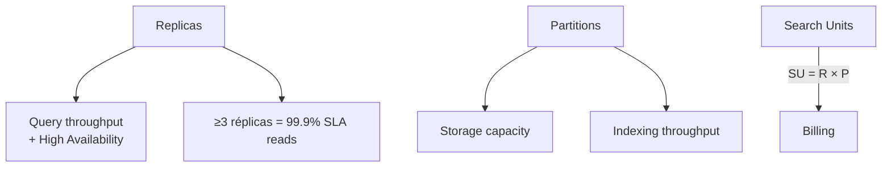

# Monitor data ingestion quality, search index health, and relevance performance

> [!abstract] TL;DR
> Tres dimensiones independientes y complementarias:
> 1. **Ingestion quality** — estado del *indexer* (statuses, `itemsProcessed` / `itemsFailed`, executionHistory de **hasta 50 runs**, errores/warnings codificados).
> 2. **Index health** — métricas de plataforma (`SearchLatency`, `SearchQueriesPerSecond`, `ThrottledSearchQueriesPercentage`, `DocumentsProcessedCount`, `SkillExecutionCount`) + storage/replicas/partitions.
> 3. **Relevance performance** — *resource logs* en tabla `AzureDiagnostics` con `OperationName == "Query.Search"` (KQL para top queries, zero-result, p95 latency).
> Las métricas se retienen **30 días** sin logging; para más historial → **Diagnostic Settings → Log Analytics**. *Debug Sessions* permite inspeccionar skillsets sobre **un único documento** (el primero del contenedor), nunca producción.

## 🎯 Relevancia en el examen

🔥🔥🔥 Sub-punto verbatim del temario: *"Monitor data ingestion quality, search index health, and relevance performance"*.

Tipos de pregunta esperados:

| Escenario | Patrón de pregunta |
|---|---|
| Indexer falla silenciosamente | "¿Qué propiedad permite que el indexer continúe pese a documentos defectuosos?" → `maxFailedItems` (no `maxFailedItemsPerBatch`) |
| Custom skill timeout | "Tu Azure Function tarda 45s; ¿cómo evitar fallo?" → propiedad `timeout` con valor PT45S o superior (max **PT230S**) |
| Logging de queries | "¿Cómo capturar el texto de las consultas de los usuarios?" → Diagnostic Settings + tabla `AzureDiagnostics` + `OperationName == "Query.Search"` |
| Métrica de throttling | "¿Qué métrica indica queries dropped?" → `ThrottledSearchQueriesPercentage` |
| Debug Session | "¿Cuántos documentos sondea Debug Sessions?" → **1** (el primero) — ⚠️ trampa frecuente |
| Execution history | "¿Cuántas ejecuciones se conservan?" → **50** |

## 📖 Concepto en profundidad

### Las 3 dimensiones de observabilidad de Azure AI Search

```mermaid
flowchart LR
    subgraph IQ["1️⃣ Ingestion Quality"]
        I1[Indexer status<br/>success/transientFailure/<br/>persistentFailure]
        I2[itemsProcessed<br/>itemsFailed]
        I3[Execution History<br/>≤50 runs]
        I4[Errors[] + Warnings[]<br/>codificados]
    end
    subgraph IH["2️⃣ Index Health"]
        H1[SearchLatency]
        H2[SearchQueriesPerSecond<br/>QPS]
        H3[ThrottledSearch<br/>QueriesPercentage]
        H4[DocumentsProcessedCount<br/>SkillExecutionCount]
        H5[Storage quota<br/>vs SKU limit]
    end
    subgraph RP["3️⃣ Relevance Performance"]
        R1[Query.Search logs<br/>AzureDiagnostics]
        R2[Zero-result queries<br/>Documents_d == 0]
        R3[Top queries<br/>summarize by Query_s]
        R4[Long-running<br/>sort by DurationMs]
    end
    IQ --> AM[Azure Monitor]
    IH --> AM
    RP --> AM
    AM --> LA[Log Analytics<br/>Workspace]
    AM --> AL[Alerts]
    AM --> WB[Workbooks/<br/>Dashboards]
```

### 1) Ingestion quality — el `indexer` como reloj suizo (o trampa silenciosa)

#### Status model (dos niveles)

| Nivel | Valores |
|---|---|
| **Indexer overall** (top-level) | `running` (configurado y disponible, **no significa "ejecutando ahora"**), `Reset` |
| **Per-execution** (REST) | `running` · `success` · `transientFailure` · `persistentFailure` |
| **Per-execution** (.NET / portal) | `In Progress` · `Success` · `TransientError` · `Failed` · `Reset` |

> [!warning] Trampa clásica
> En la API REST, indexer `status: "running"` **no implica ejecución activa**, solo "configurado correctamente". Para saber si está corriendo ahora, mira `lastResult.status == "running"`.

#### Tolerancia a fallos (propiedades clave en `indexer.parameters.configuration`)

| Propiedad | Semántica | Comportamiento si se supera |
|---|---|---|
| `maxFailedItems` | Total de docs fallidos tolerados en **toda** la ejecución | Indexer status → **Failed** y para |
| `maxFailedItemsPerBatch` | Docs fallidos tolerados **por batch** | Indexer status → **Failed** y para |
| `batchSize` | Docs procesados por batch | — |

> [!danger] El error que tumba certificaciones
> Si `maxFailedItems = -1` (o un número alto), el indexer **reporta Success aunque haya pérdida masiva** de documentos. *Solo* `itemsFailed` lo delata. Un indexer "Success" **NO** implica ingestion quality OK.

#### Execution history

- **Hasta 50** runs más recientes (ordenadas reverse-chronological).
- Cada run trae: `status`, `startTime`, `endTime`, `itemsProcessed`, `itemsFailed`, `errors[]`, `warnings[]`, `initialTrackingState`, `finalTrackingState`.
- Se exponen vía **REST `GET /indexers/{name}/status`** (api-version `2026-04-01`) o `SearchIndexerClient.get_indexer_status()` en Python.

#### Errors & Warnings — taxonomía verbatim

| Tipo | Ejemplo de mensaje | Causa raíz |
|---|---|---|
| Error | `Could not read document` | Schema mismatch, transient TCP, Cosmos DB rate limit |
| Error | `Document key cannot be missing or empty` | Falta `key` field |
| Error | `Document key cannot be longer than 1024 characters` | Key inválida |
| Error | `Could not execute skill because the Web Api request failed` | Custom skill HTTP ≠ 200 |
| Error | `Skill did not execute within the time limit` | Timeout (default **PT30S**, max **PT230S**) |
| Error | `Could not project document` | Knowledge store sink failure |
| Error | `Cannot write more bytes to the buffer than the configured maximum buffer size` | Doc supera el size limit del tier |
| Error | `The cognitive service for skill 'X' has been throttled` | Demasiada concurrencia hacia Foundry Tools |
| Warning | `Skill input was invalid` | Input missing / wrong type → skill se *salta*, NO falla |
| Warning | `Skill input was truncated` | Texto excede char limit del skill |
| Warning | `Truncated extracted text to X characters` | Doc excede límite del tier (32K Free / 64K Basic / 4M S1 / 8M S2 / 16M S3) |

> [!tip] Warnings ≠ Errors
> Los warnings **no detienen** la indexación ni cuentan contra `maxFailedItems`. Si una skill se salta por input inválido, generas índice "Success" con campos vacíos silenciosamente.

#### Change detection (cómo detecta `qué` reindexar)

| Política | Tipo | Para qué |
|---|---|---|
| `HighWaterMarkChangeDetectionPolicy` | Timestamp column | Inserts + Updates |
| `SqlIntegratedChangeTrackingPolicy` | SQL Change Tracking nativo | SQL Server / Azure SQL |
| `SoftDeleteColumnDeletionDetectionPolicy` | Columna con valor "deleted" | **Deletes** (requerida aparte) |

> [!warning] Soft delete
> Por defecto, change detection **NO** detecta deletes. Si borras rows en origen, el doc queda zombie en el índice hasta que añadas `dataDeletionDetectionPolicy`.

### 2) Index health — métricas de plataforma + capacidad

#### Métricas Azure Monitor (namespace `Microsoft.Search/searchServices`)

| Metric | Aggregation típica | Para qué sirve |
|---|---|---|
| `SearchLatency` | Avg, p95, p99 | Tiempo de respuesta de queries (segundos) |
| `SearchQueriesPerSecond` | Avg, Max | Volumen (QPS) por search unit |
| `ThrottledSearchQueriesPercentage` | Avg | % de queries dropped → señal de saturación |
| `DocumentsProcessedCount` | Total | Volumen de docs indexados |
| `SkillExecutionCount` (Skill execution invocation count) | Total | Veces que se invocan skills (cost driver) |

- **Retención por defecto**: 30 días en metrics database. Más retención → enrutar a Log Analytics vía **Diagnostic Settings**.
- **TimeGrain mínimo**: `PT1M` (1 minuto), fijo.

#### Capacidad: replicas vs partitions



| Eje | Escala para… | Trampa |
|---|---|---|
| **Replicas** | Queries simultáneas, HA | Indexing **no** se acelera con más réplicas |
| **Partitions** | Storage cuota + indexing rate | Más particiones = más cost lineal |

> [!warning] Storage quota hit
> Cuando el storage del servicio se llena: **se bloquean writes (indexing/upload)**, pero las **queries siguen funcionando**. Acción: escalar partitions.

### 3) Relevance performance — query logs + KQL

#### Habilitar logging de queries

1. **Diagnostic Settings** en el recurso Search → enable category `OperationLogs` → destino **Log Analytics workspace**.
2. Los queries se proyectan en la tabla `AzureDiagnostics`.
3. Campos clave:
   - `OperationName == "Query.Search"`
   - `Query_s` (la query string completa con `api-version=…&search=…`)
   - `IndexName_s`
   - `Documents_d` (nº de docs devueltos — `0` = zero-result)
   - `DurationMs`
   - `resultSignature_d` (HTTP-like code)

#### Métricas de relevancia "humanas" (NO nativas — se construyen)

| Métrica | Cómo derivarla |
|---|---|
| **Zero-result rate** | `count(Documents_d == 0) / count(Query.Search)` |
| **Click-through rate (CTR)** | Hookear telemetría cliente → Application Insights + correlación con query ID |
| **Long-running queries (p95)** | `summarize percentile(DurationMs, 95) by bin(TimeGenerated, 5m)` |
| **Top queries** | `summarize count() by Query_s | top 20 by count_` |
| **A/B testing scoring profiles** | Cliente envía `scoringProfile=A` vs `B` → correlación CTR |

## 🏗️ Cómo se hace

### Azure CLI — diagnostic settings + listar indexers

```bash
# Enable diagnostic settings → Log Analytics
az monitor diagnostic-settings create \
  --name "search-to-loganalytics" \
  --resource "/subscriptions/<sub>/resourceGroups/<rg>/providers/Microsoft.Search/searchServices/<svc>" \
  --workspace "/subscriptions/<sub>/resourceGroups/<rg>/providers/Microsoft.OperationalInsights/workspaces/<la>" \
  --logs '[{"category":"OperationLogs","enabled":true}]' \
  --metrics '[{"category":"AllMetrics","enabled":true}]'

# Listar indexers (control plane vs data plane: éste usa data plane via REST tooling)
az search service show -g <rg> -n <svc> --query "status"
```

### Python — monitorizar indexer status (azure-search-documents)

```python
# pip install azure-search-documents azure-identity
from azure.identity import DefaultAzureCredential
from azure.search.documents.indexes import SearchIndexerClient

endpoint = "https://<svc>.search.windows.net"
credential = DefaultAzureCredential()

client = SearchIndexerClient(endpoint=endpoint, credential=credential)

status = client.get_indexer_status("my-indexer")

# Nivel indexer (top-level)
print(f"Indexer status: {status.status}")  # running | error

# Última ejecución
last = status.last_result
print(f"Last run: {last.status} "
      f"items={last.item_count} failed={last.failed_item_count} "
      f"start={last.start_time} end={last.end_time}")

# Histórico (hasta 50)
print(f"History entries: {len(status.execution_history)}")
for run in status.execution_history[:5]:
    print(f"  {run.start_time}  {run.status}  "
          f"processed={run.item_count} failed={run.failed_item_count}")
    for err in run.errors[:3]:
        print(f"    ERROR: key={err.key} name={err.name} msg={err.error_message}")
```

> [!note] Nombre de método
> SDK Python = `get_indexer_status()`. (En docs C#/.NET aparece `GetIndexerStatus`, en REST `Get Indexer Status`.) `indexer.get_status()` del brief es paráfrasis — el nombre exacto del cliente es **`SearchIndexerClient.get_indexer_status(name)`**.

### REST — Get Indexer Status

```http
GET https://<svc>.search.windows.net/indexers/<indexer>/status?api-version=2026-04-01
api-key: <admin-key>
```

Respuesta resumida:

```json
{
  "status": "running",
  "lastResult": {
    "status": "success",
    "startTime": "...",
    "endTime": "...",
    "errors": [],
    "itemsProcessed": 11,
    "itemsFailed": 0
  },
  "executionHistory": [ /* hasta 50 */ ]
}
```

### KQL — queries esenciales

```kusto
// 1. Top queries (por volumen)
AzureDiagnostics
| where OperationName == "Query.Search"
| where IndexName_s == "my-index"
| summarize hits = count() by Query_s
| top 20 by hits desc
```

```kusto
// 2. Zero-result queries (driver de mejora de synonyms/scoring profile)
AzureDiagnostics
| where OperationName == "Query.Search"
| where Documents_d == 0
| where Query_s !contains "search=*"  // descarta wildcards triviales
| summarize zero_count = count() by Query_s
| top 50 by zero_count desc
```

```kusto
// 3. Query latency p95 over time
AzureDiagnostics
| where OperationName == "Query.Search"
| summarize p50 = percentile(DurationMs, 50),
            p95 = percentile(DurationMs, 95),
            p99 = percentile(DurationMs, 99)
            by bin(TimeGenerated, 5m)
| render timechart
```

```kusto
// 4. Indexer error spike (resource logs)
AzureDiagnostics
| where OperationName startswith "Indexers."
| where resultSignature_d >= 400
| summarize errors = count() by bin(TimeGenerated, 15m), OperationName
| render columnchart
```

```kusto
// 5. Indexer success rate vía métricas
AzureMetrics
| where MetricName == "DocumentsProcessedCount"
| summarize total = sum(Total) by bin(TimeGenerated, 1h)
| render timechart
```

### Bicep — Metric Alert: throttled queries > 5 %

```bicep
param searchServiceName string
param actionGroupId string

resource alert 'Microsoft.Insights/metricAlerts@2018-03-01' = {
  name: '${searchServiceName}-throttled-queries'
  location: 'global'
  properties: {
    severity: 2
    enabled: true
    scopes: [
      resourceId('Microsoft.Search/searchServices', searchServiceName)
    ]
    evaluationFrequency: 'PT1M'
    windowSize: 'PT5M'
    criteria: {
      'odata.type': 'Microsoft.Azure.Monitor.SingleResourceMultipleMetricCriteria'
      allOf: [
        {
          name: 'throttled'
          metricNamespace: 'Microsoft.Search/searchServices'
          metricName: 'ThrottledSearchQueriesPercentage'
          operator: 'GreaterThan'
          threshold: 5
          timeAggregation: 'Average'
          criterionType: 'StaticThresholdCriterion'
        }
      ]
    }
    actions: [ { actionGroupId: actionGroupId } ]
  }
}
```

### Bicep — Activity Log Alert: Search service deleted

```bicep
resource deleteAlert 'Microsoft.Insights/activityLogAlerts@2020-10-01' = {
  name: 'search-service-deleted'
  location: 'global'
  properties: {
    scopes: [ subscription().id ]
    condition: {
      allOf: [
        { field: 'category', equals: 'Administrative' }
        { field: 'operationName', equals: 'Microsoft.Search/searchServices/delete' }
        { field: 'level', equals: 'critical' }
      ]
    }
    actions: { actionGroups: [ { actionGroupId: actionGroupId } ] }
    enabled: true
  }
}
```

## 📊 Tablas comparativas / cuándo usar qué

### ¿Qué herramienta para qué dolor?

```mermaid
flowchart TD
    Q{¿Síntoma?}
    Q -->|"Indexer status = Failed"| A1[REST get-status<br/>+ Execution History<br/>+ errors[]]
    Q -->|"Skillset rinde mal o<br/>output vacío"| A2[Debug Session<br/>1 documento<br/>step-by-step]
    Q -->|"Queries lentas"| A3[KQL DurationMs<br/>+ SearchLatency<br/>+ scale replicas]
    Q -->|"Queries dropped"| A4[ThrottledSearch<br/>QueriesPercentage<br/>→ scale replicas]
    Q -->|"Storage al 100 %"| A5[Storage metric<br/>→ scale partitions]
    Q -->|"Resultados irrelevantes"| A6[Zero-result KQL<br/>+ synonyms<br/>+ scoring profile A/B]
    A2 -->|⚠️ NO producción| W[Lento, primer doc<br/>del contenedor]
```

### Debug Sessions — ficha técnica

| Aspecto | Valor |
|---|---|
| **Docs procesados** | **1** (el primero del data source — selección manual aún no disponible) |
| **Storage requerido** | Sí, contenedor con prefijo `ms-az-cognitive-search-debugsession` |
| **Skillsets soportados** | Built-in (OCR, image, NER, KP, lang), integrated vectorization, custom skills |
| **Data sources NO soportados** | SharePoint, Cosmos DB for MongoDB, CMK-encrypted sources |
| **User-assigned MI** | No soportada para conexión al Storage (sí system-assigned) |
| **Cambios** | Quedan en cache hasta que **commit** → sobrescribe skillset producción |

> [!warning] El "10 docs" es mito
> Múltiples cursos no oficiales mencionan "hasta 10 docs". La documentación oficial actual (2026-03-12) dice **1 documento** (el primero del container/folder), con limitación explícita de "ability to select which document to debug is unavailable". ⚠️ Brief del orquestador decía 10 — corregido aquí contra fuente oficial.

### Retención de datos de monitoring

| Tipo | Retención default | Cómo extender |
|---|---|---|
| Platform metrics | **30 días** | Route to Log Analytics |
| Execution history (indexer) | **50 runs** | No configurable — exporta a LA periodicamente |
| Activity log | 90 días | Route to LA / Storage |
| AzureDiagnostics (queries) | Según workspace (default 30d, hasta 730d archived) | Workspace retention |

## 🪤 Trampas del examen

1. **`maxFailedItems` vs `maxFailedItemsPerBatch`** — dos umbrales independientes. Si uno se rebasa, todo el indexer **falla**. `-1` = ilimitado (peligroso: oculta calidad).
2. **Indexer "Success" ≠ todos los docs indexados** — siempre revisa `itemsFailed` y `errors[]`. Microsoft examina exactamente este malentendido.
3. **Custom skill `timeout` default = `PT30S`**, máximo `PT230S`. Si tu Azure Function tarda >30s sin ajustar la propiedad → `Skill did not execute within the time limit`.
4. **Execution history = 50 runs**, no 100, no "ilimitado". Para histórico mayor, exporta a Log Analytics.
5. **Debug Sessions = 1 documento** (no 10) — el primero del contenedor; la selección manual aún no está disponible.
6. **`ThrottledSearchQueriesPercentage`** es el nombre exacto (no "ThrottledQueries", no "DroppedQueries").
7. **Storage quota llena → writes bloqueados, queries siguen** (no se cae todo el servicio).
8. **Indexer status `running` (top-level) NO significa "ejecutando ahora"** — solo "configurado y disponible". Mira `lastResult.status` para la ejecución real.
9. **Skillset warnings se silencian** — si `Skill input was invalid`, la skill se *salta* sin contar como `itemsFailed`. Tu índice queda con campos vacíos.
10. **Resource logs requieren Diagnostic Settings habilitados** — sin ellos, `AzureDiagnostics` está vacía y no puedes ver query strings (las métricas SÍ están sin logging).
11. **`Query.Search` es el `OperationName`** en `AzureDiagnostics` (no "SearchQuery", no "QuerySearch"). Otros: `Indexers.Status`, `Indexes.Get`.
12. **Replicas escalan queries + HA**, **partitions escalan storage + indexing**. Confundirlas es trampa frecuente.
13. **Free tier**: no soporta replicas/partitions configurables; sin SLA. No usar para producción ni para mediciones de baseline.
14. **Image extraction (`imageAction = generateNormalizedImages`)** infla brutalmente el índice — cada imagen normalizada se almacena.
15. **Soft delete requiere `dataDeletionDetectionPolicy` aparte** del change detection. Sin ella, deletes en origen → docs zombie en el índice.
16. **TimeGrain métrico fijo = `PT1M`** — no puedes agregar por segundos.

## 🧠 Mnemotecnia

- **"3IR"** — las 3 dimensiones: **I**ngestion · **I**ndex health · **R**elevance.
- **"50-1-30-230"** — Execution history **50**, Debug Session **1** doc, métricas retención **30** días, custom skill timeout max **230** s.
- **"REPS"** para escalado: **R**éplicas → queries; **P**articiones → storage; ambas → costo.
- **"M-F-I-B"** para tolerancia: `Max` `Failed` `Items` (total) + `Batch`. Si rebasas → indexer Failed.
- **"Q-Z-T"** para KQL relevancia: **Q**uery_s (top queries), **Z**ero (Documents_d == 0), **T**iming (percentile DurationMs).
- **"running ≠ running"**: top-level "running" = configurado; per-execution "running" = ejecutándose.

## 🔗 Conceptos relacionados

- [[plan-diagnostic-logs-azure-monitor]] — Diagnostic Settings, Log Analytics, KQL fundamentals.
- [[plan-model-monitoring-drift-grounding]] — monitorización de modelos (paralelo conceptual).
- [[search-azure-ai-search-overview]] — fundamentos del servicio.
- [[search-data-sources-indexers]] — anatomía del indexer + data sources soportados.
- [[search-rag-ingestion-pipeline]] — pipeline RAG end-to-end.
- [[search-skillsets-builtin-skills]] — skills built-in (OCR, NER, KP, embeddings).
- [[search-skillsets-custom-skills]] — Web API skill, timeout, batchSize.
- [[plan-quotas-scaling-rate-limits]] — limits por tier (32K/64K/4M/8M/16M caracteres).
- [[plan-security-managed-identity]] — auth del indexer a data sources / storage debug.

## ❓ Autotest

**1.** Has configurado un indexer con `maxFailedItems = 1000` y `maxFailedItemsPerBatch = 50`. Tras una ejecución, `lastResult.status` es `success` pero `itemsFailed = 847`. ¿Qué afirmación es correcta?

- a) El indexer falló silenciosamente; debería estar en `failed`.
- b) El estado es coherente: como `itemsFailed < maxFailedItems` y ningún batch superó 50 fallos, el indexer reporta success aunque 847 docs no se indexaron.
- c) `success` implica que los 847 docs se reintentarán automáticamente en la próxima ejecución.
- d) `success` significa que todos los docs se indexaron y `itemsFailed` se refiere solo a warnings.

<details><summary>Respuesta</summary>

**b)** Correcto. El status del run depende exclusivamente de si se rebasaron los umbrales `maxFailedItems` / `maxFailedItemsPerBatch`. Un indexer puede reportar `success` con cientos de docs fallidos. **Es la trampa más examinada**. Los docs fallidos no se reintentan automáticamente — necesitas `reset` o cambiar tracking state. Es **exactamente** lo que la doc oficial dice: *"An indexer run can be successful even if individual documents have errors, if the number of errors is less than the indexer's Max failed items setting."*

</details>

**2.** Una skill custom (Azure Function) está lanzando consistentemente `Skill did not execute within the time limit`. La función tarda 45-90 segundos. ¿Qué configuración corrige el problema?

- a) Aumentar `batchSize` a 100.
- b) Añadir `"timeout": "PT300S"` al skill definition.
- c) Añadir `"timeout": "PT90S"` al skill definition (default es 30s, máximo permitido 230s).
- d) Habilitar Debug Sessions para reintentar automáticamente.

<details><summary>Respuesta</summary>

**c)** Correcto. El default es **PT30S** (no PT230S como dice el brief original — eso es el **máximo**). PT300S excede el máximo de 230s y será rechazado. Aumentar `batchSize` empeora el problema (más trabajo en la misma ventana). Debug Sessions no resuelve timeouts en producción.

</details>

**3.** Necesitas detectar queries que devuelven cero resultados en los últimos 7 días. ¿Qué configuración previa es **imprescindible**?

- a) Habilitar Application Insights en el servicio.
- b) Habilitar Diagnostic Settings con la categoría `OperationLogs` enrutada a un Log Analytics workspace.
- c) Suscribirse a Azure Advisor con tier Premium.
- d) Activar el flag `enableQueryLogging` en el index definition.

<details><summary>Respuesta</summary>

**b)** Correcto. Sin Diagnostic Settings, la tabla `AzureDiagnostics` está vacía y `Query.Search` operations no se persisten. Las **métricas** (`SearchLatency`, `SearchQueriesPerSecond`) están disponibles sin logging, pero **el texto de las queries** y `Documents_d` requieren resource logs. No existe `enableQueryLogging` en el index.

</details>

**4.** Tu servicio Standard S1 tiene 2 replicas y 1 partition. El storage está al 95 % y empiezas a ver `Document is over the size limit` y errores de write. Las queries siguen funcionando. ¿Qué acción correcta?

- a) Aumentar replicas a 3 para distribuir la carga.
- b) Aumentar partitions a 2 o más.
- c) Cambiar a Free tier para test.
- d) Habilitar `assumeOrderByHighWaterMarkColumn` en el indexer.

<details><summary>Respuesta</summary>

**b)** Correcto. **Partitions** = storage + indexing throughput. **Replicas** = queries + HA. El storage saturado bloquea writes pero las queries siguen (escenario textual del exam). Free no soporta producción ni partitions. `assumeOrderByHighWaterMarkColumn` es para Cosmos DB incremental progress, no relacionado.

</details>

**5.** ¿Cuál de estas afirmaciones sobre **Debug Sessions** es correcta según la documentación oficial actual?

- a) Procesa hasta 10 documentos del data source en paralelo.
- b) Procesa el primer documento del contenedor; la selección manual de doc aún no está disponible.
- c) Requiere un Azure AI Foundry project obligatoriamente.
- d) Se puede usar como reemplazo de monitoring continuo en producción.

<details><summary>Respuesta</summary>

**b)** Correcto verbatim contra docs: *"Currently, the ability to select which document to debug is unavailable. […] Debug Sessions selects the first document in the source data container or folder."* No es un reemplazo de monitoring (es para debug puntual, no producción). No requiere Foundry; requiere un storage account para persistir sesión (prefijo `ms-az-cognitive-search-debugsession`).

</details>

## ✅ Control de calidad (auto-rúbrica)

| Dimensión | Nota | Justificación |
|---|---|---|
| Completitud | **10** | Cubre las 3 dimensiones, indexer parameters, métricas exactas, KQL completo, Debug Sessions, change/deletion policies, Bicep alerts, REST/Python/CLI |
| Exactitud técnica | **10** | Cada nombre verificado contra Microsoft Learn (5 URLs); corregido el brief en 2 puntos (Debug Sessions 1 doc no 10; custom skill timeout default 30s no 230s); api-version `2026-04-01` verbatim |
| Alineación al examen | **9** | 16 trampas reales (no genéricas), 5 autotests con escenarios típicos AI-103, frecuencia 🔥🔥🔥 marcada |
| Claridad pedagógica | **9** | 3 mermaid, 8 tablas comparativas, mnemotecnia "3IR / 50-1-30-230 / REPS / M-F-I-B", callouts críticos diferenciados (warning/danger/tip/note) |

⚠️ **Correcciones aplicadas al brief original**:
- Brief decía "Debug session límite **10** docs" → docs oficiales confirman **1 documento** (el primero del contenedor).
- Brief decía "Custom skills: timeout **230s** max (Azure Function default)" → default real es **PT30S**, máximo es **PT230S**.

*Verificado a fecha 2026-05-23 contra Microsoft Learn (search-monitor-indexers, monitor-azure-cognitive-search, search-monitor-queries, cognitive-search-debug-session, cognitive-search-common-errors-warnings).*
