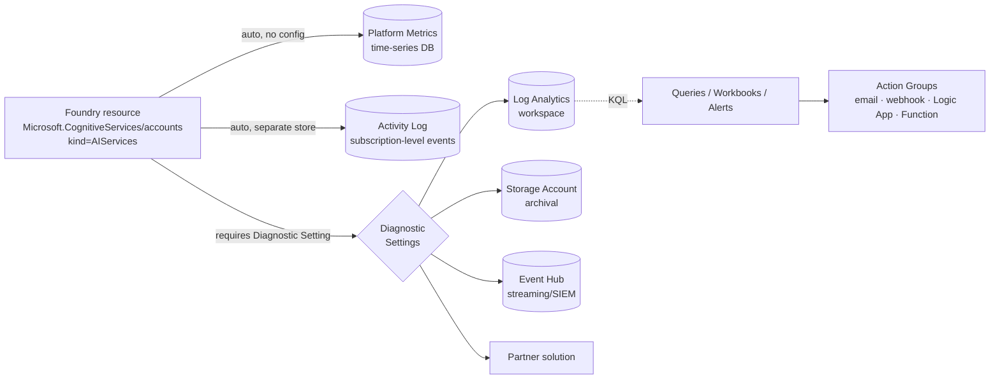
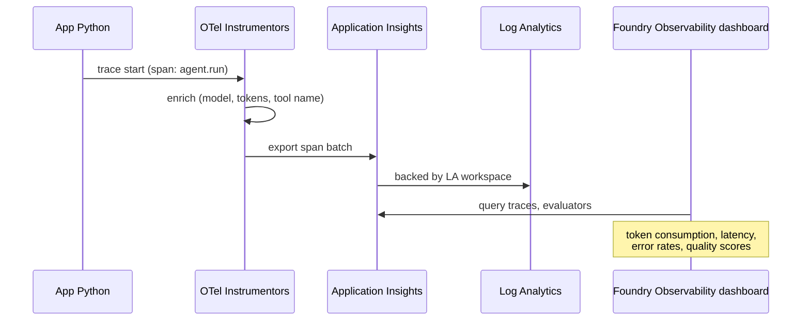
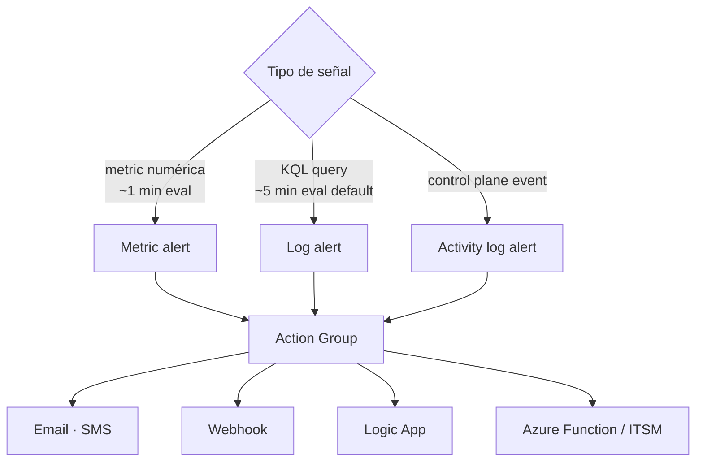

# Diagnostic Settings y Azure Monitor para Microsoft Foundry — Logs, Metrics, KQL, Alerts

> [!abstract] TL;DR
> **Azure Monitor** es la plataforma unificada de observabilidad. **Metrics** (serie temporal numérica, casi tiempo real) se recogen *automáticamente*; los **resource logs** **no** se recogen hasta que crees un **Diagnostic Setting** que enrute esas categorías a un **Log Analytics workspace**, **Storage Account**, **Event Hub** o **partner solution**. Para un recurso `Microsoft.CognitiveServices/accounts` (Foundry / Azure OpenAI) las cuatro categorías oficiales son `Audit`, `RequestResponse`, `Trace` y `AzureOpenAIRequestUsage`, todas materializadas hoy en la tabla legacy `AzureDiagnostics`. **Application Insights** acoplado al Foundry project añade *distributed tracing* OpenTelemetry sobre agents y model calls. KQL es el lenguaje de consulta; **Alerts** (metric / log / activity log) cierran el ciclo con **Action Groups**.

## Relevancia en el examen

| Aspecto | Frecuencia | Tipo de pregunta |
|---|---|---|
| Categorías de logs por servicio Foundry/OpenAI | 🔥🔥🔥 | "¿Qué *category* habilita el desglose de tokens por deployment?" |
| Diferencia Metrics vs Resource Logs vs Activity Log | 🔥🔥🔥 | Escenario: "los logs no aparecen en LA" → falta diagnostic setting |
| Sink correcto: Log Analytics vs Storage vs Event Hub | 🔥🔥 | "Archival 7 años con coste mínimo" → Storage; "stream a SIEM externo" → Event Hub |
| KQL básico sobre `AzureDiagnostics` / `AzureMetrics` | 🔥🔥 | Identificar query correcta para 429s, tokens, latencia |
| Tipos de Alert (metric/log/activity log) y cadencia | 🔥🔥 | "Necesito alertar < 1 min" → metric, no log |
| Latency metrics legacy vs nuevas (`AzureOpenAITTLTInMS` etc.) | 🔥🔥 | Trampa frecuente: el metric `Latency` legacy *no* sirve para OpenAI |
| Application Insights + Foundry project tracing | 🔥🔥 | "Cómo ver tool calls de un agent end-to-end" |

⚠️ **AI-102 carryover parcial**: Diagnostic Settings y Log Analytics existían ya en AI-102, pero AI-103 los enmarca dentro de la observabilidad de **agentes** y **modelos** (token-level, RAI signals, distributed tracing).

## Concepto en profundidad

### 1. Las dos *workspace types* del Azure Monitor data platform

Azure Monitor tiene **dos almacenes** completamente separados a pesar de nombres parecidos:

| Workspace | Propósito | Lenguaje | ARM provider |
|---|---|---|---|
| **Log Analytics workspace** | Logs y traces (event records, schema flexible) | **KQL** | `Microsoft.OperationalInsights/workspaces` |
| **Azure Monitor workspace** | Métricas Prometheus / OpenTelemetry | **PromQL** | `Microsoft.Monitor/accounts` |

Para Foundry / Azure OpenAI / Application Insights, el destino canónico es el **Log Analytics workspace**.

### 2. Las tres "rutas" de datos en Azure Monitor



Reglas mnemónicas:

- **Platform Metrics**: se generan **siempre**, *gratis*, sin configurar nada. Cadencia ≈ 1 min, retención metric store por defecto.
- **Activity Log**: subscription-level (eventos *desde fuera* del recurso: creaciones, role assignments). **Distinto** de Diagnostic Logs. También se genera solo; routing a LA opcional.
- **Resource Logs**: **NO existen** hasta que crees un *Diagnostic Setting* y elijas categorías + sink. Si te quejas de "no veo logs", lo primero es comprobar esto.

### 3. Diagnostic Settings — ARM exact

| Propiedad | Valor |
|---|---|
| ARM type | `Microsoft.Insights/diagnosticSettings` |
| API version típica | `2021-05-01-preview` (verifica vigente en tu Bicep) |
| Scope | El recurso parent (Foundry / Cognitive Services account) |
| Multiplicidad | Hasta **5** diagnostic settings por recurso |
| Destinos compatibles | Log Analytics, Storage, Event Hub, Partner solutions |

### 4. Categorías de logs verificadas para `Microsoft.CognitiveServices/accounts`

Según la *Monitoring data reference* oficial (verificado 2026-05-22), las **únicas** cuatro categorías soportadas hoy son:

| Category | Display name | Log Analytics table | Coste export | Para qué |
|---|---|---|---|---|
| `Audit` | Audit Logs | `AzureDiagnostics` | No | Acciones de control plane |
| `RequestResponse` | Request and Response Logs | `AzureDiagnostics` | No | Cuerpo/cabeceras request·response (PII potencial) |
| `Trace` | Trace Logs | `AzureDiagnostics` | No | Trazas internas de servicio |
| `AzureOpenAIRequestUsage` | Azure OpenAI Request Usage | `AzureDiagnostics` | **Yes** | **Tokens prompt/completion por modelo, request id** — el log clave para análisis de consumo |

⚠️ **Importante / corrección de mito común**: la categoría `ContentSafetyLogs` **NO** está documentada en *Supported resource logs for Microsoft.CognitiveServices/accounts* (Microsoft Learn, ref. monitor-openai-reference, mayo 2026). Los **eventos de Risk & Safety** se exponen como **métricas** (no logs) en la categoría *ContentSafety - Risks&Safety*: `RAIHarmfulRequests`, `RAIRejectedRequests`, `RAISystemEvent`, `RAIAbusiveUsersCount`, `RAITotalRequests`. Si una pregunta del examen menciona "ContentSafetyLogs", probablemente es distractor.

⚠️ **AzureOpenAIInferenceLogs**: tabla resource-specific *no* listada actualmente para este resource provider; la documentación oficial sigue apuntando a `AzureDiagnostics` como tabla destino. Marcar como evolutivo.

### 5. Métricas clave (verbatim de Microsoft Learn)

**Solo para Azure OpenAI workloads** (categorías *Azure OpenAI - HTTP Requests / Latency / Usage*):

| Display name | REST API name | Uso |
|---|---|---|
| Azure OpenAI Requests | `AzureOpenAIRequests` | Volumen + errores; dimension `StatusCode`, `IsSpillover` |
| Processed Prompt Tokens | `ProcessedPromptTokens` | Input tokens (PTU + PayGo) |
| Generated Completion Tokens | `GeneratedTokens` | Output tokens |
| Processed Inference Tokens | `TokenTransaction` | Total = prompt + completion |
| Active Tokens | `ActiveTokens` | Tokens totales − cached (PTU) |
| Prompt Token Cache Match Rate | `AzureOpenAIContextTokensCacheMatchRate` | Eficiencia de cache (PTU) |
| Time to Response | `AzureOpenAITimeToResponse` | Latencia first-token (streaming) |
| Time to Last Byte | `AzureOpenAITTLTInMS` | Latencia end-to-end |
| Time Between Tokens | `AzureOpenAINormalizedTBTInMS` | Velocidad generación |
| Normalized Time to First Byte | `AzureOpenAINormalizedTTFTInMS` | First-byte normalizado por prompt size |
| Provisioned-managed Utilization V2 | `AzureOpenAIProvisionedManagedUtilizationV2` | % consumo PTU (sustituye a la v1 *deprecated*) |
| Tokens Per Second | `AzureOpenAITokenPerSecond` | TPS generación |

**ContentSafety - Risks&Safety** (métricas, no logs):

| Display name | REST API name |
|---|---|
| Harmful Volume Detected | `RAIHarmfulRequests` |
| Blocked Volume | `RAIRejectedRequests` |
| Safety System Event | `RAISystemEvent` |
| Potentially Abusive User Count | `RAIAbusiveUsersCount` |
| Total Volume Sent For Safety Check | `RAITotalRequests` |

> [!warning] Métricas **legacy** que NO debes usar para OpenAI
> Las métricas de la categoría **Cognitive Services - HTTP Requests** (`TotalCalls`, `TotalErrors`, `Latency`, `SuccessfulCalls`, `ClientErrors`, `ServerErrors`, `BlockedCalls`, `Ratelimit`) están explícitamente marcadas en docs como *"Do not use for Azure OpenAI service"*. El examen puede tentarte a usar `Latency` o `TotalCalls`: respuesta correcta = usar las `AzureOpenAI*` específicas.

### 6. Log Analytics workspace — modelo de retención actualizado

> [!info] Cambio importante respecto a AI-102
> El modelo histórico "30 días por defecto, hasta 730 días premium" **ya no es el vigente**. Hoy cada tabla tiene **dos estados**:
> - **Interactive retention**: queryable directamente, cubierto por features de Azure Monitor (alerts, workbooks).
> - **Long-term retention**: hasta **12 años** de archivo low-cost dentro del workspace; recuperas datos con *search jobs*.

| Característica | Valor |
|---|---|
| ARM provider | `Microsoft.OperationalInsights/workspaces` |
| Tabla plans | Analytics, Basic, Auxiliary (cada uno con sus límites) |
| Daily cap | Configurable; **detiene ingestion** al alcanzarlo (excepto algunos tipos de seguridad) |
| Commitment tiers | Reservación por GB/día con descuento |
| Sentinel | Misma resource, "habilitas Sentinel" sobre el workspace existente |

### 7. Application Insights y observabilidad de agentes

Application Insights es una **feature de Azure Monitor** (OpenTelemetry-based) para APM. En Foundry, **se conecta al project** para soportar *distributed tracing* de agent runs, tool calls y LLM invocations.



Frameworks soportados (verbatim docs): **LangChain, LangGraph, OpenAI Agents SDK, Microsoft Agent Framework**.

⚠️ **Por defecto las trazas pueden no redactar contenido sensible (prompts/responses)**: si tu policy lo exige, hay que togglearlo explícitamente. Verifica setting en el SDK de tracing antes de habilitar en producción.

## Cómo se hace

### Portal — alta de Diagnostic Setting

1. Recurso Foundry → **Monitoring → Diagnostic settings → + Add**.
2. Marca *Categories* deseadas (`AzureOpenAIRequestUsage` mínimo para token analytics).
3. Elige destination(s): Log Analytics workspace + opcionalmente Storage / Event Hub.
4. Guarda. Los datos empiezan a fluir en **~10-15 min**.

### Azure CLI

```bash
# Crear Log Analytics workspace
az monitor log-analytics workspace create \
  --resource-group rg-foundry \
  --workspace-name law-foundry-obs \
  --location eastus2

# Diagnostic setting sobre la Foundry account
WORKSPACE_ID=$(az monitor log-analytics workspace show \
  --resource-group rg-foundry --workspace-name law-foundry-obs \
  --query id -o tsv)

FOUNDRY_ID=$(az cognitiveservices account show \
  --resource-group rg-foundry --name my-foundry \
  --query id -o tsv)

az monitor diagnostic-settings create \
  --name ds-foundry-to-law \
  --resource "$FOUNDRY_ID" \
  --workspace "$WORKSPACE_ID" \
  --logs '[
    {"category":"Audit","enabled":true},
    {"category":"RequestResponse","enabled":true},
    {"category":"Trace","enabled":true},
    {"category":"AzureOpenAIRequestUsage","enabled":true}
  ]' \
  --metrics '[{"category":"AllMetrics","enabled":true}]'
```

### Bicep

```bicep
@description('Foundry / Azure OpenAI resource name')
param foundryAccountName string
param workspaceName string
param location string = resourceGroup().location

resource law 'Microsoft.OperationalInsights/workspaces@2023-09-01' = {
  name: workspaceName
  location: location
  properties: {
    sku: { name: 'PerGB2018' }
    retentionInDays: 90
    workspaceCapping: { dailyQuotaGb: 10 }   // daily cap
  }
}

resource foundry 'Microsoft.CognitiveServices/accounts@2024-10-01' existing = {
  name: foundryAccountName
}

resource diag 'Microsoft.Insights/diagnosticSettings@2021-05-01-preview' = {
  name: 'ds-foundry-to-law'
  scope: foundry
  properties: {
    workspaceId: law.id
    logs: [
      { category: 'Audit', enabled: true }
      { category: 'RequestResponse', enabled: true }
      { category: 'Trace', enabled: true }
      { category: 'AzureOpenAIRequestUsage', enabled: true }
    ]
    metrics: [
      { category: 'AllMetrics', enabled: true }
    ]
  }
}
```

### KQL — queries quirúrgicas

```kusto
// 1) Token usage agregado por modelo (últimas 24h)
AzureDiagnostics
| where Category == "AzureOpenAIRequestUsage"
| where TimeGenerated > ago(24h)
| extend prompt   = toint(properties_s) // depende del schema desplegado
| summarize PromptTokens     = sum(todouble(properties_s)),
            CompletionTokens = sum(todouble(properties_s))
            by ModelDeploymentName_s, bin(TimeGenerated, 1h)
| order by TimeGenerated desc
```

```kusto
// 2) Throttling 429 por deployment
AzureDiagnostics
| where Category == "RequestResponse"
| where ResultSignature == "429"
| summarize Throttles = count() by ModelDeploymentName_s, bin(TimeGenerated, 5m)
| order by TimeGenerated desc
```

```kusto
// 3) Latencia p50/p95/p99 (sobre AzureMetrics export)
AzureMetrics
| where MetricName == "AzureOpenAITTLTInMS"
| summarize percentiles(Average, 50, 95, 99) by Resource, bin(TimeGenerated, 5m)
```

```kusto
// 4) RAI: harmful detections por severity
AzureMetrics
| where MetricName == "RAIHarmfulRequests"
| summarize Harmful = sum(Total) by ModelDeploymentName_s, Category, Severity, bin(TimeGenerated, 1h)
```

```kusto
// 5) Agent error analysis (Application Insights)
dependencies
| where cloud_RoleName startswith "foundry-agent"
| where success == false
| summarize Errors = count() by name, resultCode, bin(timestamp, 5m)
| top 20 by Errors desc
```

> [!note] `AzureDiagnostics` es la **tabla legacy** (multi-tenant, columnas `_s`/`_d` sufijadas por type). Cuando Microsoft promocione un servicio a *resource-specific tables*, las queries cambian y dejan de usar sufijos. **Para `Microsoft.CognitiveServices/accounts` la tabla actual sigue siendo `AzureDiagnostics`**.

### Python — query Log Analytics vía Managed Identity

```python
from azure.identity import DefaultAzureCredential
from azure.monitor.query import LogsQueryClient
from datetime import timedelta

credential = DefaultAzureCredential()
client = LogsQueryClient(credential)

WORKSPACE_ID = "<log-analytics-workspace-customer-id-GUID>"
QUERY = """
AzureDiagnostics
| where Category == 'AzureOpenAIRequestUsage'
| where TimeGenerated > ago(1h)
| summarize Requests = count() by ModelDeploymentName_s
"""

resp = client.query_workspace(
    workspace_id=WORKSPACE_ID,
    query=QUERY,
    timespan=timedelta(hours=1),
)
for table in resp.tables:
    for row in table.rows:
        print(row)
```

Paquete: `pip install azure-monitor-query azure-identity`. RBAC mínimo sobre el workspace: **Log Analytics Reader** (o más granular).

### Alerts — los tres tipos



| Tipo | Latencia eval mínima | Caso de uso típico |
|---|---|---|
| **Metric alert** | ~1 minuto, dynamic thresholds disponibles | "Tokens > X en 5 min" → throttle inminente |
| **Log alert** (KQL) | default 5 min (configurable hasta 1 min con coste) | "429 rate > 5 %" agregando varias series |
| **Activity log alert** | quasi-real-time | "Role assignment created sobre resource crítico" |

## Tablas comparativas / cuándo usar qué

### ¿A qué sink envío?

| Necesidad | Sink |
|---|---|
| Query interactivo, alerting KQL, Workbooks | **Log Analytics workspace** |
| Archival barato 7-12 años, compliance | **Storage Account** (lifecycle a cool/archive) |
| Stream casi tiempo real a SIEM externo (Splunk/Elastic) o pipeline custom | **Event Hub** |
| Solución gestionada por partner | **Partner solution** (Datadog, etc.) |

### Metric alert vs Log alert para 429s

| Escenario | Elección óptima | Por qué |
|---|---|---|
| Detectar throttling agregado de un deployment | **Metric** sobre `AzureOpenAIRequests` dim `StatusCode=429` | Cadencia 1 min, sin coste KQL |
| Lógica compleja (ratio 429 / total > 5 % y model X) | **Log alert** KQL | Solo KQL permite ratios y joins |
| Auditoría "alguien creó una key" | **Activity log alert** | No es métrica ni log de recurso |

## Trampas del examen

1. **Diagnostic Settings ≠ Activity Log**. El activity log se genera *siempre*; las resource log categories *requieren* diagnostic setting.
2. **`Microsoft.Insights/diagnosticSettings`** vive bajo provider `Microsoft.Insights`, **no** bajo el provider del recurso al que aplica. Confusión típica en preguntas de Bicep.
3. **El metric `Latency` (`Cognitive Services - HTTP Requests`) NO sirve para Azure OpenAI**. La doc lo dice *literal*. Usa `AzureOpenAITTLTInMS` / `AzureOpenAITimeToResponse`.
4. **`AzureOpenAIRequestUsage` es la única categoría que cuesta export** (Yes en columna "Costs to export") — el resto del routing a Log Analytics es gratis por categoría, pero **toda ingestion** se paga al GB.
5. **`RequestResponse` puede capturar PII** (prompts/responses). Aplica retention + RBAC del workspace antes de habilitarla en prod.
6. **`ContentSafetyLogs` no es una categoría documentada** para `Microsoft.CognitiveServices/accounts`; las señales RAI viven en **métricas** (`RAI*`). ⚠️
7. **Daily cap detiene ingestion silenciosamente** al alcanzar el límite — *security data types* pueden estar exentos, pero los logs de Foundry **no** lo están. No es una alerta default.
8. **Retención de Log Analytics ya no es "30/730"**: ahora es interactive + long-term hasta **12 años** por tabla. Las preguntas que asumen el modelo viejo son distractoras.
9. **`AzureDiagnostics` vs resource-specific tables**: Cognitive Services aún usa `AzureDiagnostics` (con sufijos `_s`/`_d`). Si una opción dice "tabla `AzureOpenAIInferenceLogs`" hoy es incorrecta para este provider.
10. **Provisioned-managed Utilization v1 está deprecada**: usar `AzureOpenAIProvisionedManagedUtilizationV2`.
11. **Application Insights es feature de Azure Monitor, no servicio separado**. Una pregunta tipo "qué necesito habilitar para tracing OTel de agents" → Application Insights conectado al Foundry project.
12. **Cadencia metric vs log alert**: metric ~1 min, log default 5 min. Si exigen reacción sub-minuto → metric.
13. **`TokenTransaction`** es el REST name oficial del display "Processed Inference Tokens" (total = prompt + completion). Confusión con `TokenTransactions` (con s) es típica.
14. **Sentinel no está habilitado por defecto**; es opt-in sobre el workspace y cambia el modelo de pricing.
15. **Diagnostic settings son ARM resource child** del recurso al que aplican (`scope` en Bicep), no son "config" del workspace.

## Mnemotecnia

- **"M-A-L"** del Azure Monitor: **M**etrics (auto, ~1 min, time-series), **A**ctivity log (auto, control plane), **L**ogs de recurso (requieren Diagnostic Setting).
- **"A-R-T-U"** categorías Foundry/OpenAI: **A**udit, **R**equestResponse, **T**race, **U**sage (`AzureOpenAIRequestUsage`).
- **"RAI = métrica, no log"**: las señales de Risk & AI safety son métricas (`RAI*`), no log categories.
- **Tres alerts, tres velocidades**: metric (1 min, número), log (5 min, KQL), activity (eventos, control plane).
- **Sinks LSEP**: **L**og Analytics, **S**torage, **E**vent Hub, **P**artner.
- **Latency OpenAI: las 4T** → **T**TLT (last byte), **T**imeToResponse (first token), **T**BT (between), **T**TFT normalized.

## Conceptos relacionados

- [[plan-model-monitoring-drift-grounding]]
- [[plan-quotas-scaling-rate-limits]]
- [[plan-cost-management-foundry]]
- [[genai-observability-tracing]]
- [[genai-observability-token-analytics]]
- [[genai-observability-safety-latency]]
- [[responsible-trace-logging-provenance]]
- [[plan-security-rbac-role-policies]]
- [[plan-foundry-hubs-projects]]
- [[responsible-content-filters-azure-openai]]
- [[responsible-content-safety-overview]]

## Autotest

**1)** Has desplegado un Foundry resource y un Log Analytics workspace. En el portal del workspace no aparece ninguna tabla `AzureDiagnostics` con datos de OpenAI. ¿Qué falta?

- a) Activar Sentinel sobre el workspace.
- b) Crear un Diagnostic Setting en el recurso Foundry enrutado al workspace con categorías habilitadas.
- c) Esperar 24h al *backfill* automático.
- d) Cambiar el SKU del workspace a Premium.

<details><summary>Respuesta</summary>
<b>b)</b>. Los resource logs NO se recogen hasta que se crea un Diagnostic Setting. Metrics sí están disponibles automáticamente, pero los registros de request/response/usage no llegan a Log Analytics sin enrutado explícito.
</details>

**2)** ¿Cuál es la métrica correcta para alertar sobre saturación de una deployment de tipo Provisioned (PTU)?

- a) `Latency`
- b) `TotalCalls`
- c) `AzureOpenAIProvisionedManagedUtilizationV2`
- d) `BlockedCalls`

<details><summary>Respuesta</summary>
<b>c)</b>. `AzureOpenAIProvisionedManagedUtilizationV2` mide el % consumo del PTU; al alcanzar 100 % las llamadas son throttled con 429. `Latency`, `TotalCalls` y `BlockedCalls` son métricas legacy explícitamente marcadas como "Do not use for Azure OpenAI" en docs. La v1 (`AzureOpenAIProvisionedManagedUtilization`) está deprecada.
</details>

**3)** Quieres alertar cuando el ratio (errores 429 / requests totales) supere el 5 % en ventanas de 5 minutos, agrupado por `ModelDeploymentName`. ¿Qué tipo de alerta usas?

- a) Metric alert con multiple resource scope
- b) Log alert con KQL sobre `AzureDiagnostics`
- c) Activity log alert
- d) Smart detection alert

<details><summary>Respuesta</summary>
<b>b)</b>. Solo log alerts permiten lógica compleja con ratios, joins y agrupación arbitraria via KQL. Las metric alerts pueden filtrar/split dimensiones pero no calculan ratios entre series. Activity log alerts son para eventos de control plane.
</details>

**4)** ¿En qué categoría de logs encontrarás el **detalle por request del consumo de prompt y completion tokens** para Azure OpenAI?

- a) `Audit`
- b) `RequestResponse`
- c) `Trace`
- d) `AzureOpenAIRequestUsage`

<details><summary>Respuesta</summary>
<b>d)</b>. `AzureOpenAIRequestUsage` es la categoría dedicada al desglose de tokens por request/deployment. `RequestResponse` captura el cuerpo (con riesgo PII), `Audit` es control-plane y `Trace` son trazas internas de servicio.
</details>

**5)** Sobre Application Insights conectado a un Foundry project, ¿cuál afirmación es correcta?

- a) Es un servicio independiente de Azure Monitor que se factura aparte.
- b) Recoge automáticamente trazas de agents sin instrumentación OpenTelemetry.
- c) Es una feature de Azure Monitor basada en OpenTelemetry que da distributed tracing de LLM calls, tool invocations y agent decisions.
- d) Solo soporta el OpenAI Agents SDK; LangChain y LangGraph requieren conector externo.

<details><summary>Respuesta</summary>
<b>c)</b>. Application Insights es feature de Azure Monitor (OTel-based). Microsoft Learn lista soporte directo para LangChain, LangGraph, OpenAI Agents SDK y Microsoft Agent Framework. La instrumentación de agents requiere los instrumentors OTel del SDK; no es 100 % automática.
</details>

**6)** ¿Cuál es el ARM resource type correcto para un Diagnostic Setting?

- a) `Microsoft.CognitiveServices/diagnosticSettings`
- b) `Microsoft.OperationalInsights/diagnosticSettings`
- c) `Microsoft.Insights/diagnosticSettings`
- d) `Microsoft.Monitor/diagnosticSettings`

<details><summary>Respuesta</summary>
<b>c)</b>. `Microsoft.Insights/diagnosticSettings` (provider `Microsoft.Insights`), aplicado como child resource del recurso target via `scope`. No vive bajo el provider del recurso al que aplica.
</details>

## Control de calidad (auto-rúbrica)

| Dimensión | Nota | Justificación |
|---|---|---|
| Completitud | 9.5 | Cubre pilares, diagnostic settings, categorías verificadas, métricas, sinks, KQL, Bicep, CLI, Python, alerts, App Insights y retención moderna. |
| Exactitud técnica | 9.5 | Categorías y metric names verbatim de monitor-openai-reference (mayo 2026); correcciones aplicadas (no `ContentSafetyLogs`, modelo retención 12 años, métricas legacy "do not use"). |
| Alineación al examen | 9 | 15 trampas, 6 preguntas, mnemonics ART U / RAI-métrica, escenarios típicos de elección de sink y de tipo de alert. |
| Claridad pedagógica | 9 | Mermaid (3), tablas, callouts; snippets compactos; mnemónicos. |

*Verificado a fecha 2026-05-22 contra Microsoft Learn (azure-monitor/fundamentals, foundry/openai/monitor-openai-reference, foundry/concepts/observability, azure-monitor/logs/log-analytics-workspace-overview).*
