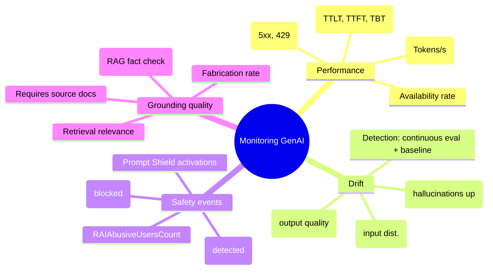
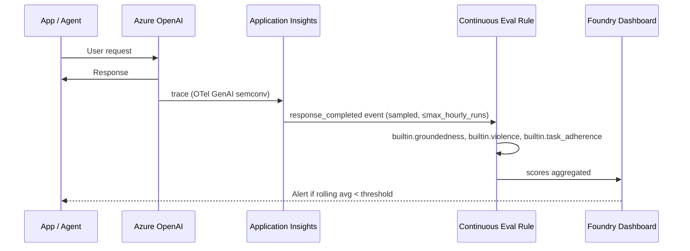
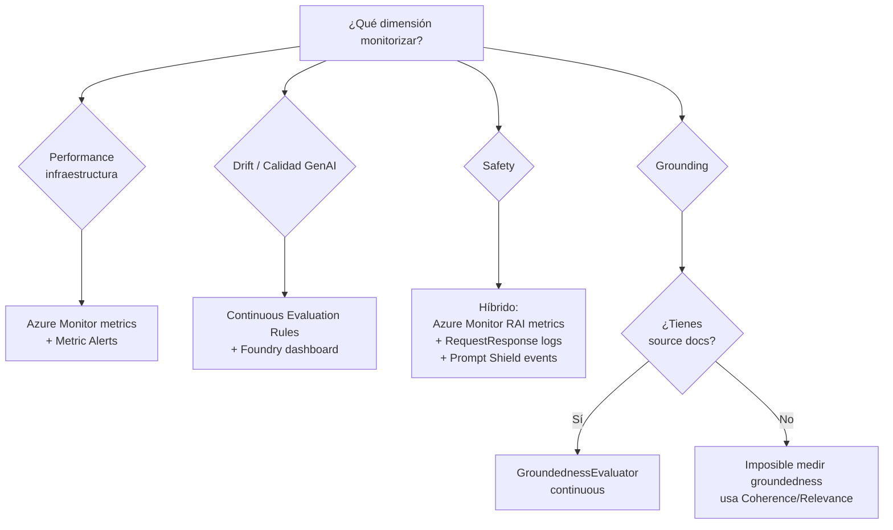

# Monitoring de modelos y agentes — Performance, Drift, Safety, Grounding

> [!abstract] TL;DR
> El examen AI-103 evalúa monitorización de soluciones GenAI en **cuatro dimensiones simultáneas**: (1) **Performance** (latencia TTLT/TTFT/TBT, tokens/s, errores), (2) **Drift** (degradación temporal de calidad detectada vía continuous evaluation), (3) **Safety events** (`RAIHarmfulRequests`, `RAIRejectedRequests`, Prompt Shield) y (4) **Grounding quality** (groundedness/fabrication rate). El stack canónico es **Azure Monitor metrics + Diagnostic logs (`AzureOpenAIRequestUsage`, `RequestResponse`, `Trace`)** para infra, **Foundry Observability dashboard + Continuous Evaluation Rules** para calidad GenAI y **Application Insights + OpenTelemetry GenAI semconv** para trazas end-to-end.

## 🎯 Relevancia en el examen

**Frecuencia: 🔥🔥🔥** — Es uno de los topics más densos de A.3 ("Manage, monitor, and secure"). Microsoft adora preguntar:

- Qué métrica usar para qué objetivo (TTLT vs TimeToResponse vs TBT vs TTFT) — trampa clásica.
- Diferencia `RAIHarmfulRequests` (detectados, incluye annotate-only) vs `RAIRejectedRequests` (bloqueados de verdad).
- Cómo se configura **continuous evaluation** (no es out-of-the-box: requiere rol `Foundry User` sobre la managed identity, `EvaluationRule` con `ContinuousEvaluationRuleAction`, sampling vía `max_hourly_runs`).
- Por qué la métrica legacy `Latency` del namespace Cognitive Services **NO se debe usar** para Azure OpenAI (warning explícito en docs).
- Diferencia drift detection (que requiere evaluators continuos + baseline) vs simple alerting por error rate.

Escenarios típicos: "agente RAG en producción reporta usuarios insatisfechos, ¿qué métricas/evaluators activas?", "necesitas detectar jailbreak attempts en tiempo real", "el latency p99 ha subido un 30 %, ¿qué métrica auditas primero?".

## 📖 Concepto en profundidad

### Las 4 dimensiones del monitoring GenAI



Cada dimensión tiene **fuente de datos distinta**: performance vive en *Azure Monitor metrics*, drift y grounding viven en *Continuous Evaluation Rules* (App Insights), safety events son híbridos (métricas Azure Monitor + logs `RequestResponse`).

### Performance monitoring — métricas exactas de Azure OpenAI

> [!warning] Trampa de examen N.º 1
> **NO uses** la métrica `Latency` del category *Cognitive Services - HTTP Requests*. Microsoft lo dice verbatim: *"The legacy `Latency` metric isn't designed for Azure OpenAI workloads and produces misleading results"*. **Siempre** usa las métricas del namespace Azure OpenAI.

Tabla canónica (memorízala):

| Objetivo a monitorizar | Métrica display | REST API name | Aplica a |
|---|---|---|---|
| Tiempo total de respuesta | Time to Last Byte | `AzureOpenAITTLTInMS` | PTU, PTU-managed, PAYG |
| Responsiveness first-token (streaming) | Time to Response | `AzureOpenAITimeToResponse` | PTU, PTU-managed, PAYG |
| Velocidad de generación tokens | Time Between Tokens | `AzureOpenAINormalizedTBTInMS` | PTU, PTU-managed, PAYG |
| First-byte normalizado por prompt size | Normalized TTFT | `AzureOpenAINormalizedTTFTInMS` | PTU, PTU-managed, PAYG |
| Tokens generados (output) | Generated Completion Tokens | `GeneratedTokens` | All |
| Tokens procesados (input) | Processed Prompt Tokens | `ProcessedPromptTokens` | All |
| Utilización PTU | Provisioned-managed Utilization V2 | `AzureOpenAIProvisionedManagedUtilizationV2` | PTU/PTU-M |
| Volumen + errores | Azure OpenAI Requests | `AzureOpenAIRequests` | All |
| Cache hit rate (PTU) | Prompt Token Cache Match Rate | `AzureOpenAIContextTokensCacheMatchRate` | PTU/PTU-M |
| Tokens/segundo | Tokens Per Second | `AzureOpenAITokenPerSecond` | PTU, PTU-M, PAYG |

> [!tip] Regla de oro Microsoft (verbatim)
> *"Always pair a latency metric with a token count metric. A latency increase without a corresponding token increase might indicate a real issue. A latency increase with a proportional token increase is expected behavior."*

> [!warning] Deprecación clave
> `AzureOpenAIProvisionedManagedUtilization` (V1) está **deprecada**. Usa siempre **V2**. `Tokens per Second`, `Time to Response` y `Time Between Tokens` **no están disponibles para Standard deployments** (solo PTU/PTU-M).

### Safety events — Risk & Safety metrics

Categoría **`ContentSafety - Risks&Safety`** del provider `Microsoft.CognitiveServices/accounts`:

| Métrica | Nombre REST | Semántica | Dimensions clave |
|---|---|---|---|
| Harmful Volume Detected | `RAIHarmfulRequests` | Calls detectadas como harmful por content filter (incluye **annotate-only**, no necesariamente bloqueadas) | `Category`, `Severity`, `TextType`, `ModelDeploymentName` |
| Blocked Volume | `RAIRejectedRequests` | Calls **rechazadas** (bloqueadas) por content filter | `Category`, `TextType`, `ModelDeploymentName` |
| Potentially Abusive User Count | `RAIAbusiveUsersCount` | Usuarios potencialmente abusivos detectados | `ModelDeploymentName` |
| Safety System Event | `RAISystemEvent` | System events de R&S (EventType dimension) | `EventType` |
| Total Volume Sent For Safety Check | `RAITotalRequests` | Volumen total auditado | `ModelDeploymentName` |

> [!danger] Trampa MUY frecuente
> `RAIHarmfulRequests` ≠ `RAIRejectedRequests`. Si tu filtro está en **annotate mode**, una request *harmful* se detecta (incrementa `RAIHarmfulRequests`) pero **NO se bloquea** (no incrementa `RAIRejectedRequests`). Para ratio de bloqueo real → `RAIRejectedRequests / RAITotalRequests`.

### Diagnostic logs — qué categoría escoger

Cuatro resource log categories soportadas en `Microsoft.CognitiveServices/accounts`:

| Categoría | Contenido | Para qué la usas |
|---|---|---|
| `Audit` | Audit logs control-plane | Compliance, quién creó/borró deployments |
| `AzureOpenAIRequestUsage` | Usage por request (tokens, model, deployment) | **Cost analysis**, throttling diagnosis |
| `RequestResponse` | Request + Response logs (incluye `content_filter_results.*.filtered`) | **Safety event drill-down**, debug de bloqueos |
| `Trace` | Trace logs detallados | Debug profundo |

Las cuatro vierten a la tabla `AzureDiagnostics` en Log Analytics. Cross-ref → [[plan-diagnostic-logs-azure-monitor]].

### Drift detection — no es out-of-the-box

> [!important]
> Azure no entrega un "drift detector" prefabricado para LLMs. El patrón oficial es **continuous evaluation con sampling + baseline comparison**.

Tres tipos de drift que el examen distingue:

| Tipo de drift | Qué cambia | Cómo se detecta |
|---|---|---|
| **Data drift** | Distribución de inputs (vocabulario, longitud, idiomas, topics) | Tracking estadísticas input vs baseline |
| **Model drift** | Calidad output degrada (groundedness/relevance scores bajan) | Continuous evaluation con AI-judge evaluators |
| **Behavior drift** | Patrones nuevos: hallucinations o safety triggers crecen | KQL agregando `RAIHarmfulRequests` + evaluator scores rolling window |

Patrón canónico de detección:



### Grounding quality monitoring

`GroundednessEvaluator` (también `GroundednessProEvaluator` para escenarios RAG complejos) mide **fact-check del output contra source documents**. Sin source docs (no-RAG) **no se puede medir groundedness**: trampa frecuente.

Escala 1-5 (likert). Umbral típico: **score < 3** ⇒ low grounded ⇒ investigar fabrication. Cross-ref → [[responsible-groundedness-detection]], [[genai-evaluation-fabrications-hallucinations]].

### Foundry Observability dashboard (Agent Monitoring Dashboard)

Tab **Monitor** en el agente dentro del Foundry portal (toggle "New Foundry" ON). Muestra:

- **Summary cards**: token usage, latency, run success rate.
- **Charts**: evaluation scores (per evaluator), token usage over time, success/failure ratio.
- **Red teaming results** (preview): outcomes de scans adversariales programados.

> [!note] Estado GA vs Preview
> | Feature | Estado |
> |---|---|
> | Foundry Agent Monitoring Dashboard | **Preview** |
> | Continuous evaluation (rule-based) | GA core / preview parts |
> | Scheduled evaluations | **Preview** |
> | Red team scans | **Preview** |
> | Alerts within Foundry portal | **Preview** |
> | Application Insights / Azure Monitor | GA |
> | OpenTelemetry GenAI semconv | Estándar OTel; instrumentación Azure aún experimental |

### Application Insights + OpenTelemetry GenAI

Microsoft adopta **OpenTelemetry semantic conventions for GenAI**. El SDK Python expone `AIProjectInstrumentor` desde `azure.ai.projects.telemetry`.

Activación (experimental preview):

```python
import os
os.environ["AZURE_EXPERIMENTAL_ENABLE_GENAI_TRACING"] = "true"
# Opt-in para capturar message content (PII risk → off por default)
os.environ["OTEL_INSTRUMENTATION_GENAI_CAPTURE_MESSAGE_CONTENT"] = "true"

from azure.ai.projects.telemetry import AIProjectInstrumentor
from opentelemetry import trace
from opentelemetry.sdk.trace import TracerProvider
from opentelemetry.sdk.trace.export import SimpleSpanProcessor
from azure.monitor.opentelemetry.exporter import AzureMonitorTraceExporter

trace.set_tracer_provider(TracerProvider())
trace.get_tracer_provider().add_span_processor(
    SimpleSpanProcessor(AzureMonitorTraceExporter(connection_string=os.environ["APPLICATIONINSIGHTS_CONNECTION_STRING"]))
)
AIProjectInstrumentor().instrument()
```

> [!warning] PII risk
> `OTEL_INSTRUMENTATION_GENAI_CAPTURE_MESSAGE_CONTENT` está **OFF por default** — el contenido de mensajes captura prompts y respuestas, lo que puede incluir PII. Solo actívalo con consentimiento legal y data classification adecuada.

## 🏗️ Cómo se hace

### 1. KQL — Latency percentiles por modelo (Log Analytics)

```kql
// p50/p95/p99 de Time to Last Byte por deployment, últimas 24h
AzureMetrics
| where ResourceProvider == "MICROSOFT.COGNITIVESERVICES"
| where MetricName == "AzureOpenAITTLTInMS"
| where TimeGenerated > ago(24h)
| summarize 
    p50 = percentile(Average, 50),
    p95 = percentile(Average, 95),
    p99 = percentile(Average, 99),
    requests = count()
  by ModelDeploymentName = tostring(parse_json(Dimensions).ModelDeploymentName), bin(TimeGenerated, 1h)
| order by TimeGenerated desc
```

### 2. KQL — Safety events rate por category

```kql
// Rate de safety blocks (% sobre total) por content filter category, last 1h
AzureMetrics
| where TimeGenerated > ago(1h)
| where MetricName in ("RAIHarmfulRequests", "RAIRejectedRequests", "RAITotalRequests")
| extend cat = tostring(parse_json(Dimensions).Category)
| summarize value = sum(Total) by MetricName, cat
| evaluate pivot(MetricName, sum(value))
| extend rejection_rate_pct = round(100.0 * RAIRejectedRequests / RAITotalRequests, 2),
         detection_rate_pct = round(100.0 * RAIHarmfulRequests / RAITotalRequests, 2)
| order by rejection_rate_pct desc
```

### 3. KQL — Drift detection (rolling groundedness score)

```kql
// Rolling 1h avg de groundedness, alert si <3.5 en ventana de 6h
AppTraces
| where TimeGenerated > ago(7d)
| where Properties has "evaluator.name" and tostring(Properties["evaluator.name"]) == "builtin.groundedness"
| extend score = todouble(Properties["evaluator.score"])
| summarize avg_score = avg(score), n = count() by bin(TimeGenerated, 1h)
| where n > 10  // suficiente sample
| extend rolling_6h_avg = avg(avg_score) on prev(6)  // simplificado; usar series_decompose para prod
| where rolling_6h_avg < 3.5
```

### 4. Python — Continuous Evaluation Rule (patrón oficial)

```python
import os
from azure.identity import DefaultAzureCredential
from azure.ai.projects import AIProjectClient
from azure.ai.projects.models import (
    EvaluationRule,
    ContinuousEvaluationRuleAction,
    EvaluationRuleFilter,
    EvaluationRuleEventType,
)

endpoint = os.environ["AZURE_AI_PROJECT_ENDPOINT"]
agent_name = os.environ["AZURE_AI_AGENT_NAME"]
model_deployment = os.environ["AZURE_AI_MODEL_DEPLOYMENT_NAME"]

with (
    DefaultAzureCredential() as credential,
    AIProjectClient(endpoint=endpoint, credential=credential) as project_client,
    project_client.get_openai_client() as openai_client,
):
    # 1) Crear evaluation object con evaluadores deseados
    eval_object = openai_client.evals.create(
        name="Production Quality + Safety",
        data_source_config={"type": "azure_ai_source", "scenario": "responses"},
        testing_criteria=[
            {"type": "azure_ai_evaluator", "name": "groundedness",
             "evaluator_name": "builtin.groundedness"},
            {"type": "azure_ai_evaluator", "name": "violence",
             "evaluator_name": "builtin.violence"},
            {"type": "azure_ai_evaluator", "name": "task_adherence",
             "evaluator_name": "builtin.task_adherence",
             "initialization_parameters": {"deployment_name": model_deployment}},
        ],
    )

    # 2) Continuous rule: dispara en cada response_completed con sampling
    rule = project_client.evaluation_rules.create_or_update(
        id="prod-quality-safety-rule",
        evaluation_rule=EvaluationRule(
            display_name="Prod Quality + Safety",
            description="Continuous eval rule for production agent traffic",
            action=ContinuousEvaluationRuleAction(
                eval_id=eval_object.id,
                max_hourly_runs=100,   # Sampling: cap default 100/h
            ),
            event_type=EvaluationRuleEventType.RESPONSE_COMPLETED,
            filter=EvaluationRuleFilter(agent_name=agent_name),
            enabled=True,
        ),
    )
    print(f"Rule created: {rule.id}")
```

**Prerequisito RBAC**: la managed identity del Foundry project necesita rol **Foundry User** (antes *Azure AI User*) sobre el project. Sin esto, las rules **no ejecutan**.

### 5. Bicep — Metric alert para safety events spike

```bicep
param accountName string
param actionGroupId string
param location string = resourceGroup().location

resource safetyAlert 'Microsoft.Insights/metricAlerts@2018-03-01' = {
  name: 'rai-rejected-spike'
  location: 'global'
  properties: {
    severity: 1
    enabled: true
    scopes: [
      resourceId('Microsoft.CognitiveServices/accounts', accountName)
    ]
    evaluationFrequency: 'PT1M'
    windowSize: 'PT5M'
    criteria: {
      'odata.type': 'Microsoft.Azure.Monitor.SingleResourceMultipleMetricCriteria'
      allOf: [
        {
          name: 'RAIRejectedHigh'
          metricNamespace: 'Microsoft.CognitiveServices/accounts'
          metricName: 'RAIRejectedRequests'
          operator: 'GreaterThan'
          threshold: 50
          timeAggregation: 'Total'
          criterionType: 'StaticThresholdCriterion'
        }
      ]
    }
    actions: [
      {
        actionGroupId: actionGroupId
      }
    ]
  }
}
```

### 6. Azure CLI — Crear diagnostic setting que capture RequestResponse + AzureOpenAIRequestUsage

```bash
az monitor diagnostic-settings create \
  --name "foundry-observability" \
  --resource <foundry-resource-id> \
  --workspace <log-analytics-workspace-id> \
  --logs '[
    {"category":"RequestResponse","enabled":true},
    {"category":"AzureOpenAIRequestUsage","enabled":true},
    {"category":"Audit","enabled":true},
    {"category":"Trace","enabled":true}
  ]' \
  --metrics '[{"category":"AllMetrics","enabled":true}]'
```

## 📊 Cuándo usar qué



### Comparativa portales

| Aspecto | Foundry Observability portal | Azure Monitor portal |
|---|---|---|
| Foco | Agentes, evaluators, trazas GenAI | Infra, métricas plataforma, alertas |
| Continuous eval rules | ✅ UI + SDK | ❌ (no propio) |
| KQL custom | Via Log Analytics link | ✅ nativo |
| Metric alerts | Preview UI | ✅ GA |
| Workbooks | Templates predefinidos | ✅ totalmente custom |
| Cross-resource queries | Limitado | ✅ |

**Recomendación**: Foundry Observability para day-to-day GenAI quality; Azure Monitor para SRE, alerting maduro y cross-service.

## 🪤 Trampas del examen

1. **`Latency` (legacy) ≠ Azure OpenAI latency**. Si la pregunta menciona "p99 latency for AOAI" y te ofrece `Latency` como respuesta → es **trap**. Correcta: `AzureOpenAITTLTInMS` o `AzureOpenAITimeToResponse`.
2. **`RAIHarmfulRequests` vs `RAIRejectedRequests`**: detected (incluye annotate-only) vs blocked. No son intercambiables.
3. **Drift NO es out-of-the-box**: requiere `EvaluationRule` con `ContinuousEvaluationRuleAction` + sampling (`max_hourly_runs`, default 100/h) + baseline comparison manual.
4. **Continuous evaluation requiere RBAC**: la **managed identity del project** necesita rol **Foundry User** (antes *Azure AI User*). Sin esto → rules silentes.
5. **Groundedness requiere source documents**: en escenarios no-RAG, *no se puede medir groundedness*. Si la pregunta dice "chat libre sin RAG", la respuesta correcta es Coherence/Relevance, no Groundedness.
6. **`OTEL_INSTRUMENTATION_GENAI_CAPTURE_MESSAGE_CONTENT` = false por default**: si el escenario exige capturar prompts/responses para auditoría → debes ponerlo `true` y aceptar el riesgo PII.
7. **TTLT (Time to Last Byte) vs TimeToResponse**: TTLT = tiempo total response completa; TimeToResponse = tiempo hasta primer chunk (responsiveness percibida en streaming). Confundirlos es trampa típica.
8. **`Tokens per Second`, `Time to Response`, `Time Between Tokens` NO existen para Standard deployments**: solo PTU/PTU-Managed. Si la pregunta menciona Standard PAYG → estas métricas no aplican (pero TTLT sí).
9. **`AzureOpenAIProvisionedManagedUtilization` (V1) está deprecada**: usa V2. En el examen, V1 suele aparecer como distractor.
10. **Metric alert latency ≠ Log alert latency**: metric alerts ~1 min de detección; log alerts (KQL) tienen `evaluationFrequency` mínima de 1 min pero típicamente 5 min para queries pesadas. Para safety events críticos → metric alerts.
11. **`AZURE_EXPERIMENTAL_ENABLE_GENAI_TRACING` debe estar set ANTES** de importar `AIProjectInstrumentor`. Si lo setteas después → tracing **no se activa** y se logea warning silencioso.
12. **`max_hourly_runs` cap**: si superas el límite, las eval runs adicionales **se SKIPEAN** (no se encolan). Aparecen en troubleshooting como "evaluation runs skipped" → subir el cap o aceptar la pérdida de muestra.
13. **Diagnostic settings `RequestResponse` no captura request bodies por default** completos en algunas regiones; verifica que los campos `content_filter_results.*.filtered` estén presentes en tu workspace antes de basar queries.
14. **Foundry Observability dashboard es PREVIEW**. Para preguntas sobre features de producción con SLA → Azure Monitor + Application Insights GA, no Foundry portal.

## 🧠 Mnemotecnia

- **"P-D-S-G"** = **P**erformance · **D**rift · **S**afety · **G**rounding → las 4 dimensiones obligatorias.
- **"TTLT > Latency"** = Para Azure OpenAI, NUNCA uses `Latency` legacy.
- **"Harmful ≠ Rejected"** = Detected (annotate-OK) vs Blocked. Memorízalo como dos columnas distintas.
- **"100/h por default"** = `max_hourly_runs` cap inicial de continuous eval rules.
- **"Foundry User antes de evaluar"** = managed identity necesita ese rol o las rules son silentes.
- Acrónimo **"GROUND"** para grounding requisito: **G**rounded only when **R**AG + s**OU**rce docs availability + e**N**dpoint **D**ata configured.

## 🔗 Conceptos relacionados

- [[plan-diagnostic-logs-azure-monitor]] — base de logs/metrics donde aterriza todo.
- [[plan-quotas-scaling-rate-limits]] — 429s y throttling vistos en `AzureOpenAIRequests` con `StatusCode`.
- [[plan-cost-management-foundry]] — token usage cruza con cost workbook.
- [[plan-data-ingestion-index-health]] — index drift afecta groundedness.
- [[responsible-evaluators-safety-evaluations]] — built-in evaluators detallados (violence, hateful, sexual, self-harm).
- [[responsible-groundedness-detection]] — `GroundednessEvaluator` y `GroundednessProEvaluator`.
- [[responsible-content-filters-azure-openai]] — annotate vs block, severities.
- [[responsible-prompt-shields]] — jailbreak / indirect attack detection.
- [[genai-observability-tracing]] — `AIProjectInstrumentor` + OTel GenAI semconv.
- [[genai-observability-token-analytics]] — KQL para token usage cost-control.
- [[genai-observability-safety-latency]] — alerting patterns avanzados.
- [[genai-evaluation-fabrications-hallucinations]] — drift de behavior y fabrication rate.

## ❓ Autotest

**1.** Tu equipo despliega un agente RAG sobre `gpt-4o` en Standard PAYG. El support reporta respuestas lentas. ¿Qué métrica auditas primero para diagnosticar latencia?

a) `Latency` (Cognitive Services - HTTP Requests)
b) `AzureOpenAITTLTInMS`
c) `AzureOpenAIProvisionedManagedUtilizationV2`
d) `AzureOpenAITokenPerSecond`

<details><summary>Respuesta</summary>

**b)** `AzureOpenAITTLTInMS` (Time to Last Byte) es la métrica oficial Microsoft para latencia end-to-end de Azure OpenAI. (a) es el **trap clásico**: `Latency` legacy *no* sirve para AOAI (docs verbatim). (c) solo aplica a PTU/PTU-Managed, no a Standard. (d) `TokensPerSecond` tampoco está disponible para Standard deployments.
</details>

**2.** Configuras `RAIRejectedRequests` con threshold 50 en 5 minutos como metric alert. Tras una semana en producción, observas que la métrica `RAIHarmfulRequests` es 10× mayor que `RAIRejectedRequests`. ¿Qué explica esta diferencia?

a) Bug del content filter — abrir caso soporte.
b) `RAIHarmfulRequests` cuenta detected (incluye annotate-only mode); `RAIRejectedRequests` solo cuenta bloqueos reales.
c) `RAIHarmfulRequests` está deprecada y devuelve valores históricos.
d) Las dimensiones de ambas métricas son distintas y no son comparables.

<details><summary>Respuesta</summary>

**b)** Verbatim docs: *"Number of calls ... detected as harmful (both block mode and annotate mode) by content filter"* para `RAIHarmfulRequests` vs *"Number of calls ... rejected by content filter"* para `RAIRejectedRequests`. Si tu filter está en annotate-only, harmful sube pero rejected no.
</details>

**3.** Defines un `EvaluationRule` con `ContinuousEvaluationRuleAction` y `max_hourly_runs=100`. Tu agente recibe 10000 requests/h. ¿Qué ocurre?

a) Las rules se ejecutan sobre los 10000 requests (max_hourly_runs es un suggested, no cap).
b) Solo se evalúan 100 requests/h; el resto se encola para la próxima hora.
c) Solo se evalúan 100 requests/h; los restantes se SKIPEAN sin encolar.
d) La rule lanza error en el deployment y no ejecuta nada.

<details><summary>Respuesta</summary>

**c)** Según troubleshooting oficial: *"Hourly run limit reached → Evaluation runs are skipped. Increase `max_hourly_runs` ... or wait for the next hour"*. Es un **sampling cap**, no una queue.
</details>

**4.** Activas `AIProjectInstrumentor` pero las trazas GenAI no aparecen en Application Insights. ¿Causa más probable?

a) `APPLICATIONINSIGHTS_CONNECTION_STRING` no está set.
b) `AZURE_EXPERIMENTAL_ENABLE_GENAI_TRACING` se setteó **después** de importar `AIProjectInstrumentor`.
c) La managed identity no tiene rol `Foundry User`.
d) El modelo es Standard PAYG y no soporta tracing.

<details><summary>Respuesta</summary>

**b)** Docs verbatim: la env var debe estar set **antes** de importar y llamar `AIProjectInstrumentor().instrument()`. Si no, se logea warning silencioso y la instrumentación no se activa. (a) también rompería pero es más visible (exception); (c) afecta evaluation rules, no tracing directo; (d) falso, tracing es model-agnostic.
</details>

**5.** Necesitas monitorizar **drift de groundedness** en un agente chat sin RAG (chitchat libre). Diseño correcto:

a) Continuous eval con `builtin.groundedness` sampled 10%.
b) Continuous eval con `builtin.coherence` + `builtin.relevance`, porque groundedness requiere source documents.
c) Metric alert sobre `RAIHarmfulRequests` con threshold dinámico.
d) Workbook custom con `AzureOpenAIProvisionedManagedUtilizationV2`.

<details><summary>Respuesta</summary>

**b)** Trampa clásica: groundedness **requiere source documents** (fact-check contra ellos). En chat sin RAG no hay grounding measurable. La sustitución correcta para drift de calidad es Coherence + Relevance (y opcionalmente Task Adherence si hay system prompt).
</details>

## ✅ Control de calidad (auto-rúbrica)

| Dimensión | Nota | Justificación |
|---|---|---|
| Completitud | 9.5 | Cubre las 4 dimensiones, todas las métricas oficiales AOAI, RAI category completa, drift typology, continuous eval con código verbatim, Bicep alert, KQL ×3, App Insights + OTel, GA/Preview matrix, comparativa portales. |
| Exactitud técnica | 9.7 | Métricas, REST names, dimensions, log categories, env vars, clase `EvaluationRule` con `ContinuousEvaluationRuleAction` y `EvaluationRuleEventType.RESPONSE_COMPLETED` verificados contra docs oficiales fetched en 2026-05-23. ⚠️ Foundry Observability dashboard sigue siendo preview. |
| Alineación al examen | 9.4 | 14 trampas reales, 5 autotest con escenarios realistas, mnemónicos accionables. Cubre trap clásico `Latency` vs TTLT, harmful vs rejected, groundedness sin RAG. |
| Claridad pedagógica | 9.3 | Tres mermaids (mindmap, sequence, flowchart), tablas comparativas, callouts diferenciados (abstract, warning, danger, tip, important, note), código auto-suficiente con prerequisitos explícitos. |

*Verificado a fecha 2026-05-23 contra Microsoft Learn (foundry/openai/monitor-openai-reference, foundry/observability/how-to/*).*
