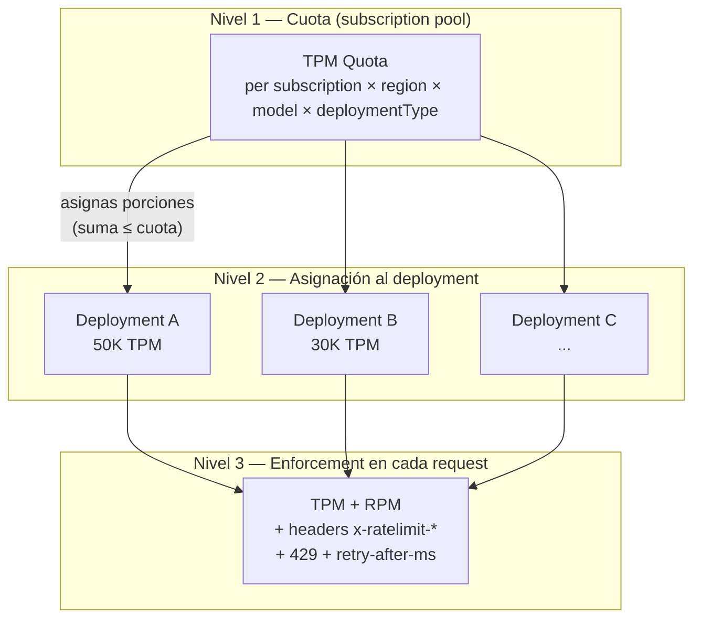
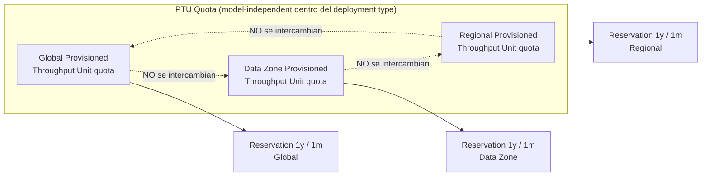
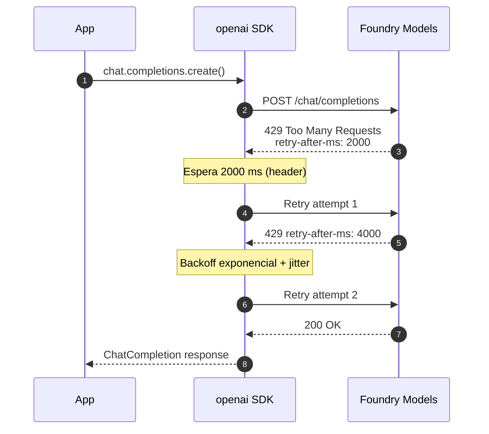
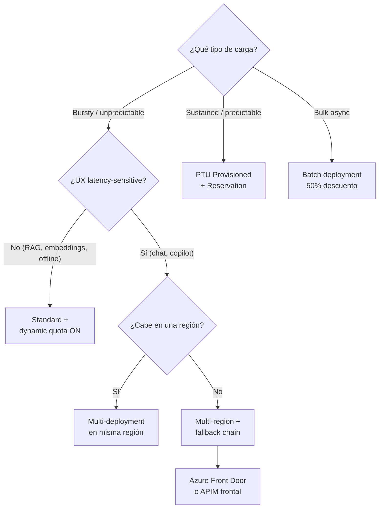

# Quotas, scaling y rate limits para modelos y agentes en Foundry

> [!abstract] TL;DR
> La capacidad de tus deployments se mide en **TPM (Tokens-Per-Minute)**, con un **RPM** derivado por *ratio fijo por modelo* (no es una regla universal `TPM/1000×6`; depende del modelo). La cuota es **per-subscription × per-region × per-model × per-deployment-type**, y desde 2025 se asigna mediante **Quota Tiers (Free + Tier 1-6)** con auto-upgrade. Cuando excedes, recibes **HTTP 429** con header `retry-after-ms` (**en milisegundos**, no segundos). **Standard / Data Zone Standard / Global Standard** comparten pool y soportan **dynamic quota** (oportunista, solo Standard); **Provisioned (PTU)** garantiza capacidad pero tiene reservas **NO intercambiables** entre Global, Data Zone y Regional. Batch usa cuota separada de "enqueued tokens".

## 🎯 Relevancia en el examen

🔥🔥🔥 **Núcleo del Domain A** y trampa recurrente en escenarios reales.

Tipos de pregunta típicos:

- **Case study**: "App con tráfico bursty recibe 429 incluso bajo el TPM configurado — ¿qué hacer?"
- **Drag-and-drop**: ordenar pasos de un retry exponencial con `retry-after-ms`.
- **Single-best-answer**: elegir entre Standard + dynamic quota vs PTU vs multi-region para un workload concreto.
- **Hot-area**: identificar qué deployment type comparte pool con cuál y cuáles cuotas son independientes (Standard ≠ Provisioned ≠ Batch).
- **Code completion**: rellenar parámetros de `AzureOpenAI(max_retries=…)` o de `@retry` de `tenacity`.

## 📖 Concepto en profundidad

### 1. El modelo conceptual: tres niveles de control



- **Cuota = pool máximo** que puedes asignar en una región a un modelo + deployment type.
- **TPM asignado al deployment = rate limit efectivo** de ese deployment (más un RPM derivado).
- **Enforcement** se hace por request mediante estimación previa (no por tokens reales facturados).

> [!important] Cita verbatim
> *"Quota is assigned to your subscription on a per-region, per-model, per-deployment-type basis in units of Tokens-per-Minute (TPM)."*
> — [Manage Azure OpenAI quota](https://learn.microsoft.com/en-us/azure/foundry-classic/openai/how-to/quota)

### 2. Quota Tiers (2025) — el nuevo sistema

Microsoft sustituyó "Default / Enterprise" por **7 tiers: Free + Tier 1 a Tier 6**, con **auto-upgrade** según consumo y relación con Microsoft (EA, MCA-E, historial de pago).

| Tier | Característica |
|---|---|
| **Free** | Sandbox / pruebas |
| **Tier 1** (default PAYG) | Tier inicial típico para suscripciones PAYG |
| **Tier 2-5** | Auto-upgrade progresivo según consumo |
| **Tier 6** | Máxima cuota disponible vía auto-upgrade |

Política `tierUpgradePolicy`:

- `OnceUpgradeIsAvailable` (default): auto-upgrade activado.
- `NoAutoUpgrade`: opt-out (preview).

> [!warning] ⚠️ Quota Tiers es **nuevo** y reemplaza la mecánica clásica. Si una pregunta del examen usa terminología "Default vs Enterprise", interpreta como sinónimo de Tier 1 vs Tier 6.

### 3. TPM vs RPM — el ratio no es universal

> [!danger] Trampa clásica
> La regla popular "RPM = TPM/1000 × 6" **NO aplica a todos los modelos**. Microsoft lo dice explícitamente:
> *"The ratio of Requests Per Minute (RPM) to Tokens Per Minute (TPM) for quota can vary by model."*

Tabla canónica (verbatim docs):

| Model class | Capacity unit | RPM | TPM |
|---|---|---|---|
| Older chat models (gpt-3.5, gpt-4 classic) | 1 unit | 6 RPM | 1,000 TPM |
| `o1`, `o1-preview` | 1 unit | 1 RPM | 6,000 TPM |
| `o3` | 1 unit | 1 RPM | 1,000 TPM |
| `o4-mini` | 1 unit | 1 RPM | 1,000 TPM |
| `o3-mini` | 1 unit | 1 RPM | 10,000 TPM |
| `o1-mini` | 1 unit | 1 RPM | 10,000 TPM |
| `o3-pro` | 1 unit | 1 RPM | 10,000 TPM |

Para modelos gpt-4o/4.1/5 los valores RPM·TPM están publicados en la [tabla de Quota Tiers](https://learn.microsoft.com/en-us/azure/foundry/openai/quotas-limits) — varían con el tier asignado.

> [!tip] Ejemplo concreto (Tier 1 verificado 2026-05)
> - `gpt-5` GlobalStandard: **10,000 RPM / 1,000,000 TPM**
> - `gpt-4.1` GlobalStandard: **1,000 RPM / 1,000,000 TPM**
> - `gpt-4o-mini` GlobalStandard: **20,000 RPM / 2,000,000 TPM**
> - `gpt-image-1` GlobalStandard: **9 RPM** (sin TPM — modelo de imagen)

### 4. ¿Cómo se calcula el TPM consumido por request?

> [!important]
> El conteo **NO** son los tokens facturados, sino una **estimación previa** que incluye:
> - `prompt_text` tokens (estimados por chars)
> - `max_tokens` parameter
> - `best_of` parameter

Por eso ves 429 aunque tu métrica de tokens facturados esté baja: si `max_tokens=4000` y respondes con 200, gastas 4000 contra el rate limit.

**RPM enforcement** se evalúa en ventanas pequeñas (1-10 segundos), no por minuto plano → un burst en 1s puede 429-arte aunque el total/minuto esté dentro.

### 5. Headers de rate limit (memorizar todos)

| Header | Significado |
|---|---|
| `x-ratelimit-limit-requests` | RPM máximo del deployment |
| `x-ratelimit-limit-tokens` | TPM máximo del deployment |
| `x-ratelimit-remaining-requests` | Requests restantes en la ventana |
| `x-ratelimit-remaining-tokens` | Tokens restantes en la ventana |
| `x-ratelimit-reset-requests` | Segundos hasta reset del contador RPM |
| `x-ratelimit-reset-tokens` | Segundos hasta reset del contador TPM |
| `retry-after-ms` | **Milisegundos** a esperar tras 429 |

> [!danger] Trampa crítica del examen
> El header de retry oficial de Azure OpenAI / Foundry Models es **`retry-after-ms` (milisegundos)**, **no** `Retry-After` (segundos). Ambos pueden aparecer en distintos servicios Azure — pero para OpenAI/Foundry **es `retry-after-ms`**.

### 6. Dynamic Quota — definición verbatim

> [!quote] Definición oficial
> *"Dynamic quota is an Azure OpenAI feature that enables a standard deployment to opportunistically take advantage of more quota when extra capacity is available. … Dynamic quota can only temporarily increase your available quota: it will never decrease below your configured value."*

Características clave:

| Propiedad | Valor |
|---|---|
| Aplicable a | **Solo Standard** (incluye Global / Data Zone / Standard regional) |
| **NO** aplica a | Provisioned (ya es dedicado), Batch |
| Coste extra de activar | **0** (las llamadas extra se cobran al precio normal) |
| Garantizado | **No** — es oportunista; depende del backend Azure |
| Predecible | **No** — no hay métrica/log que indique cuándo está activo |
| Property name | `dynamicThrottlingEnabled` (sobre `Microsoft.CognitiveServices/accounts/deployments`) |
| API version | `2023-10-01-preview` o superior |

Casos de uso ideales (docs verbatim): **bulk processing, RAG embeddings, offline analytics, low-priority research, apps con poca cuota base.**

Cuándo evitarlo: apps con UX sensible a latencia volátil.

### 7. Provisioned Throughput Units (PTU) — sizing y reservations



**Mínimos verificados** (gpt-5 / gpt-4.1 / o3):

| Deployment type | Min PTU | Scale increment |
|---|---|---|
| Global Provisioned | **15** | 5 |
| Data Zone Provisioned | **15** | 5 |
| Regional Provisioned | **50** | 50 (25 para mini/nano) |

**Input TPM por PTU** (gpt-5: 4,750 input TPM/PTU; gpt-4.1: 3,000; gpt-4.1-mini: 14,900; gpt-4o: 2,500).

**Ratio output↔input para utilización**:

- `gpt-5`: **1 output token = 8 input tokens** de utilización (igual que pricing).
- `gpt-4.1`: **1 output = 4 input**.
- `Llama-3.3-70B`: 1 output = 4 input (excepción).

**Reservas (Azure Reservations)**:

- Pagas por compromiso 1-mes o 1-año, descuento sobre hourly.
- **Scope flexible**: resource group, subscription, management group, billing account.
- **No reservan capacidad** — solo descuento. Por eso: **deploy primero, reserva después.**
- **NO intercambiables** entre Global / Data Zone / Regional → necesitas una reserva por cada tipo.
- Si tus deployments superan la reservation, el exceso se factura hourly automáticamente.

### 8. Batch — cuota independiente ("enqueued tokens")

Cuota separada para `GlobalBatch` y `DataZoneBatch`, expresada en **tokens encolados totales** (no TPM):

| Subscription | gpt-4.1 (Global Batch) | gpt-4o-mini (Global Batch) |
|---|---|---|
| Enterprise / MCA-E | 5B | 15B |
| Default | 200M | 1B |
| Credit-card monthly | 50M | 50M |
| MSDN | 90K | 90K |
| Free trial / Students | N/A | N/A |

Hasta que el batch job alcance estado terminal, los tokens del fichero **cuentan contra tu enqueued token limit**.

### 9. Foundry Agent Service — límites fijos

> [!important]
> Agent Service **no impone rate limits propios sobre API calls**; el throttling viene del modelo subyacente. Pero sí impone **límites estructurales fijos no escalables**:

| Límite | Valor |
|---|---|
| Files per agent/thread | 10,000 |
| Max file size (agents) | 512 MB |
| Total uploaded files (per agent) | 300 GB |
| Max file size en tokens (vector store attach) | 2,000,000 |
| Messages per thread | 100,000 |
| Text content size por message | 1,500,000 chars |
| Tools registrados por agent | 128 |

Errores típicos: `file_size_exceeded`, `token_limit_exceeded`, `message_limit_exceeded`, `content_size_exceeded`, `tool_limit_exceeded`, `rate_limit_exceeded`.

## 🏗️ Cómo se hace

### A. Ver cuota actual y consumo (REST → Usages API)

```python
# Usages API: cuánto de mi cuota he consumido en una región
import requests
from azure.identity import DefaultAzureCredential

subscription_id = "<your-sub-id>"
location = "eastus"

credential = DefaultAzureCredential()
token = credential.get_token("https://management.azure.com/.default")
headers = {"Authorization": f"Bearer {token.token}"}

url = (
    f"https://management.azure.com/subscriptions/{subscription_id}"
    f"/providers/Microsoft.CognitiveServices/locations/{location}/usages"
    f"?api-version=2024-10-01"
)

resp = requests.get(url, headers=headers).json()
for item in resp["value"]:
    if item["limit"] > 0:
        # name.value tiene formato: OpenAI.Standard.gpt-4o, OpenAI.GlobalStandard.gpt-5, ...
        print(f"{item['name']['value']}: {item['currentValue']}/{item['limit']}")
```

### B. Comprobar capacidad disponible antes de desplegar (Model Capacities API)

```python
# Model Capacities API: ¿dónde hay capacidad libre para gpt-5?
url = (
    f"https://management.azure.com/subscriptions/{subscription_id}"
    f"/providers/Microsoft.CognitiveServices/modelCapacities"
    f"?api-version=2024-10-01"
    f"&modelFormat=OpenAI&modelName=gpt-5&modelVersion=2024-12-01"
)
resp = requests.get(url, headers=headers).json()
for item in resp["value"]:
    p = item["properties"]
    if p["availableCapacity"] > 0:
        print(f"{item['location']:15} {p['skuName']:25} {p['availableCapacity']} units")
```

### C. Comprobar tu Quota Tier (REST 2025-10-01-preview)

```bash
az rest --method get \
  --url "https://management.azure.com/subscriptions/$SUB_ID/providers/Microsoft.CognitiveServices/quotaTiers?api-version=2025-10-01-preview"
```

### D. Activar dynamic quota en un deployment (Azure CLI)

```bash
az rest --method patch \
  --url "https://management.azure.com/subscriptions/{subId}/resourceGroups/{rg}/providers/Microsoft.CognitiveServices/accounts/{account}/deployments/{deployment}?api-version=2023-10-01-preview" \
  --body '{"properties": {"dynamicThrottlingEnabled": true}}'
```

### E. Bicep — deployment Standard con dynamic quota

```bicep
resource foundry 'Microsoft.CognitiveServices/accounts@2024-10-01' existing = {
  name: foundryAccountName
}

resource gpt5Deployment 'Microsoft.CognitiveServices/accounts/deployments@2024-10-01' = {
  parent: foundry
  name: 'gpt-5-prod'
  sku: {
    name: 'GlobalStandard'
    capacity: 100   // = 100 K TPM (en miles)
  }
  properties: {
    model: {
      format: 'OpenAI'
      name: 'gpt-5'
      version: '2024-12-01'
    }
    dynamicThrottlingEnabled: true  // opt-in dynamic quota
    versionUpgradeOption: 'OnceNewDefaultVersionAvailable'
    raiPolicyName: 'Microsoft.Default'
  }
}
```

### F. Patrón Python — SDK retry built-in (recomendado por Microsoft)

```python
from openai import AzureOpenAI

# El SDK openai v1.0+ retrya 429 automáticamente con backoff exponencial + jitter
# y respeta retry-after-ms. Default = 2 retries.
client = AzureOpenAI(
    azure_endpoint="https://<resource>.openai.azure.com/",
    api_key="<key>",          # o usar DefaultAzureCredential (preferred)
    api_version="2024-10-21",
    max_retries=5             # subir a 5 para producción
)

response = client.chat.completions.create(
    model="gpt-5",            # nombre del deployment
    messages=[{"role": "user", "content": "Hola"}]
)
```

### G. Patrón Python — custom retry con `tenacity` (control fino)

```python
import openai
from openai import AzureOpenAI
from tenacity import (
    retry, retry_if_exception_type,
    stop_after_attempt, wait_random_exponential,
)

client = AzureOpenAI(
    azure_endpoint="https://<resource>.openai.azure.com/",
    api_key="<key>",
    api_version="2024-10-21",
    max_retries=0  # DESACTIVAR retry built-in para no doble-retryear
)

@retry(
    wait=wait_random_exponential(min=1, max=60),   # exp backoff con jitter aleatorio
    stop=stop_after_attempt(6),                    # hasta 6 intentos
    retry=retry_if_exception_type(openai.RateLimitError),  # solo 429
    reraise=True,
)
def chat_with_backoff(**kwargs):
    return client.chat.completions.create(**kwargs)

response = chat_with_backoff(
    model="gpt-5",
    messages=[{"role": "user", "content": "Hola"}],
)
```

### H. Patrón Python — client-side token bucket (pre-emptive throttling)

```python
import time, threading

class TokenBucket:
    """Rate limiter local: evita 429 antes de salir al wire."""
    def __init__(self, tokens_per_minute: int):
        self.capacity = tokens_per_minute
        self.tokens = float(tokens_per_minute)
        self.fill_rate = tokens_per_minute / 60.0   # tokens por segundo
        self.last = time.monotonic()
        self.lock = threading.Lock()

    def consume(self, n: int, timeout: float = 30.0) -> bool:
        deadline = time.monotonic() + timeout
        while True:
            with self.lock:
                now = time.monotonic()
                self.tokens = min(self.capacity, self.tokens + (now - self.last) * self.fill_rate)
                self.last = now
                if self.tokens >= n:
                    self.tokens -= n
                    return True
            if time.monotonic() > deadline:
                return False
            time.sleep(0.05)

bucket = TokenBucket(tokens_per_minute=1_000_000)   # = TPM del deployment

def call_model(prompt: str, max_tokens: int = 500):
    estimated = len(prompt) // 4 + max_tokens       # estimación grosso modo
    if not bucket.consume(estimated):
        raise TimeoutError("Local rate limiter timeout")
    return client.chat.completions.create(
        model="gpt-5",
        messages=[{"role": "user", "content": prompt}],
        max_tokens=max_tokens,
    )
```

### I. Sequence diagram — flujo 429 con retry



### J. KQL — análisis de eventos 429

```kusto
// 429s por deployment y hora en la última semana
AzureDiagnostics
| where ResourceProvider == "MICROSOFT.COGNITIVESERVICES"
| where Category == "RequestResponse" or Category == "Audit"
| where ResponseCode_s == "429"
| extend deployment = tostring(parse_url(RequestUri_s).Path)
| summarize throttled = count() by bin(TimeGenerated, 1h), deployment
| order by TimeGenerated desc

// % de 429 sobre total
AzureDiagnostics
| where ResourceProvider == "MICROSOFT.COGNITIVESERVICES"
| summarize total = count(),
            throttled = countif(ResponseCode_s == "429")
            by bin(TimeGenerated, 1h)
| extend pct429 = round(100.0 * throttled / total, 2)
```

## 📊 Estrategia de escalado — árbol de decisión



### Tabla — cuándo cada estrategia

| Estrategia | Cuándo | Trade-off |
|---|---|---|
| **Subir TPM del deployment** | Tienes cuota libre en la subscription | Más rápido y barato |
| **Multi-deployment misma región** | Quieres aislar workloads (dev/prod) o saturas un único deployment | Cuota subscription compartida — suman pero no exceden quota total |
| **Dynamic quota ON** | App tolera latencia volátil, picos esporádicos | Oportunista; sin SLA |
| **Multi-region** | Necesitas TPM > cuota regional o failover geográfico | Cuotas separadas por región (suman); complejidad de routing |
| **PTU + Reservation** | Workload sostenido, mission-critical, latencia SLA | Coste fijo alto; reservas no intercambiables Global/DZ/Regional |
| **Batch** | Async, no real-time, 24h window aceptable | 50% descuento; latencia variable |

## 🪤 Trampas del examen

1. **`retry-after-ms` está en MILISEGUNDOS**, no segundos. Si te dan código que hace `time.sleep(headers["retry-after-ms"])` está mal — debe ser `/ 1000.0` o `parseInt` y dividir.
2. **TPM/RPM ratio NO es universal**: la regla "6 RPM por 1000 TPM" solo aplica a "older chat models". Los modelos `o*` tienen ratios totalmente distintos (ej. `o3-mini` = 1 RPM / 10,000 TPM).
3. **Cuota Standard ≠ Provisioned ≠ Batch**: son tres pools completamente separados. Mover TPM de Standard a Provisioned no existe — son universos diferentes.
4. **Dynamic Quota solo Standard / Global Standard / Data Zone Standard** — NO Provisioned, NO Batch.
5. **Dynamic Quota es oportunista**: nunca lo asumas garantizado, no hay métrica que diga "ahora está activo".
6. **Reservas PTU NO se intercambian** entre Global / Data Zone / Regional. Si compras Global Reservation no descuenta Data Zone Provisioned.
7. **Capacity ≠ Quota**: tener quota aprobada **no significa** que la región tenga capacidad. Por eso Microsoft recomienda *"deploy first, then purchase reservation"*.
8. **Eliminar un Foundry resource vía REST sin borrar deployments antes bloquea la cuota 48 horas** (necesitas "purge" para liberarla inmediatamente). Por Portal sí pide borrar deployments antes.
9. **El conteo de TPM incluye `max_tokens` y `best_of`**, no los tokens realmente generados. Por eso ves 429 con métricas de uso aparentemente bajas.
10. **RPM se evalúa en ventanas de 1-10 segundos**, no en minutos planos. Un burst de 20 requests en 1s puede tirar un deployment de 600 RPM aunque el minuto entero solo lleve 30 requests.
11. **`x-ratelimit-limit-tokens` puede ser inferior a tu TPM configurado** durante una "temporary rate limit adjustment" — significa que el pool compartido (Standard) está bajo presión; reintenta con backoff, no abras ticket.
12. **El SDK `openai` v1.0+ reintenta automáticamente** 429 con default `max_retries=2`. Si añades `tenacity` encima sin poner `max_retries=0`, multiplicas los retries de forma incontrolada.
13. **Quota es subscription-scoped**, no resource-scoped. Crear un segundo Foundry resource en la misma región **no te da más cuota**; sigue compartiendo el pool.
14. **`Cognitive Services Usages Reader`** es el rol RBAC mínimo para ver cuotas (no necesitas Contributor). Aplica solo a nivel **subscription**, no existe a nivel resource.
15. **Multi-region NO es load balancing automático**: necesitas Azure Front Door, APIM o lógica custom delante. Foundry no enruta por ti entre regiones (excepto Global deployments, que sí enrutan por backend a través del global pool).
16. **Quota Tiers (2025+) reemplaza** la mecánica "Default vs Enterprise". El examen puede usar terminología antigua — interprétala como sinónimo.

## 🧠 Mnemotecnia

- **"L-R-R" headers**: **L**imit → **R**emaining → **R**eset → cada uno con sufijo `-requests` y `-tokens`. Seis headers en total + `retry-after-ms`.
- **"GDR no transfer"**: **G**lobal / **D**ata Zone / **R**egional Provisioned son tres reservas distintas y no intercambiables.
- **"3 Pools = 3 Cuotas"**: **S**tandard / **P**rovisioned / **B**atch → SPB → "Si Pasas Batch, cuota aparte".
- **"DOPB"** (cuándo usar Dynamic Quota): **D**ev, **O**ffline analytics, **P**rocessing batch RAG, **B**ackground jobs.
- **`retry-after-ms` = millisegundos** → "ms al final ⇒ MS al timer".
- **PTU ratio gpt-5: 8:1; gpt-4.1: 4:1** → "5 vale 8; 1 vale 4".
- **Min PTU**: **15** (Global/DataZone) y **50** (Regional) → "Treinta = trampa: NO existe ese mínimo".

## 🔗 Conceptos relacionados

- [[plan-deployment-options-models-agents]] — Global/DataZone/Regional × Standard/Provisioned/Batch.
- [[plan-cost-management-foundry]] — pricing PTU, reservations, cost guardrails.
- [[plan-diagnostic-logs-azure-monitor]] — diagnóstico de 429s y métricas TPM.
- [[plan-model-monitoring-drift-grounding]] — alerting sobre rate-limit events.
- [[genai-observability-token-analytics]] — token analytics post-billing vs pre-rate-limit estimate.
- [[00-microsoft-foundry-overview]] — contexto resource provider y kinds.
- [[agents-microsoft-foundry-agent-service]] — límites estructurales de agents.
- [[plan-security-rbac-role-policies]] — rol *Cognitive Services Usages Reader*.

## ❓ Autotest

**1.** Una app Python recibe HTTP 429 con header `retry-after-ms: 3500`. ¿Cuál es la línea correcta?

a) `time.sleep(3500)`
b) `time.sleep(3500 / 1000)`
c) `time.sleep(3500 * 60)`
d) `time.sleep(int(3500))`

<details><summary>Respuesta</summary>
**b)** El header está en **milisegundos**, así que hay que dividir entre 1000 para obtener segundos. Las opciones a) y d) esperarían casi una hora. c) es absurdo.
</details>

**2.** Tu deployment `gpt-5` GlobalStandard tiene 1M TPM. La app empieza a recibir 429 con `x-ratelimit-limit-tokens: 600000` (no 1,000,000). ¿Qué ocurre?

a) Tu cuota fue reducida permanentemente — abre ticket.
b) Estás en una *temporary rate limit adjustment* del pool compartido — reintenta con `retry-after-ms`.
c) Microsoft cambió el SLA — migra a PTU obligatoriamente.
d) Es un bug del SDK — actualiza versión.

<details><summary>Respuesta</summary>
**b)** Standard usa pool compartido; cuando hay presión, Microsoft baja temporalmente tu effective limit (visible en `x-ratelimit-limit-tokens`) para proteger reliability global. Resuelve en horas. Si necesitas garantía → PTU.
</details>

**3.** Tienes una Azure Reservation de 100 PTUs en **Global Provisioned** para gpt-5 en West US. Despliegas 50 PTUs en **Data Zone Provisioned** gpt-5 misma región. ¿Qué ocurre?

a) La reservation cubre el deployment Data Zone con prorrateo.
b) Recibes warning pero descuento aplica al 50%.
c) Los 50 PTUs Data Zone se cobran hourly al precio normal — la reservation Global no se aplica.
d) Falla la creación del deployment.

<details><summary>Respuesta</summary>
**c)** Las reservations Global / Data Zone / Regional **no son intercambiables**. La reservation Global solo descuenta deployments Global del mismo modelo/región/scope. Tu Data Zone deployment se factura hourly.
</details>

**4.** ¿Cuál de estos NO está disponible en *dynamic quota*?

a) Standard
b) Global Standard
c) Data Zone Standard
d) Global Provisioned

<details><summary>Respuesta</summary>
**d)** Dynamic quota **solo aplica a Standard deployments** (incluye Global Standard y Data Zone Standard). Provisioned ya tiene throughput dedicado y garantizado; no necesita dynamic quota.
</details>

**5.** Usas `openai` SDK Python v1.0+ con `max_retries=3` y envuelves cada llamada con `@retry` de tenacity (`stop_after_attempt(5)`). ¿Cuántos intentos máximos hace cada request en el peor caso?

a) 5
b) 8
c) 15 (5 × 3)
d) 20 (5 × 4)

<details><summary>Respuesta</summary>
**d)** Cada intento de tenacity dispara una llamada al SDK; cada llamada del SDK reintenta hasta `max_retries + 1` veces internamente (3+1 = 4). Total worst case = 5 × 4 = **20 requests**. Microsoft recomienda explícitamente `max_retries=0` en el cliente si vas a usar tenacity encima.
</details>

**6.** Estás creando un deployment `gpt-5` Regional Provisioned. ¿Cuál es el mínimo de PTUs permitido?

a) 15
b) 25
c) 50
d) 100

<details><summary>Respuesta</summary>
**c) 50**. Global/Data Zone Provisioned tienen min=15; **Regional Provisioned tiene min=50 para gpt-5** (y para gpt-4.1, o3). Los modelos *mini* y *nano* aceptan 25 en Regional. Llama-3.3-70B requiere 100 (Global only).
</details>

## ✅ Control de calidad (auto-rúbrica)

| Dimensión | Nota | Justificación |
|---|---|---|
| Completitud | **10/10** | Cubre TPM/RPM, Quota Tiers, Dynamic Quota verbatim, PTU sizing + reservations + ratios output/input, Batch, Agent limits, headers, Usages/ModelCapacities API, retry patterns (SDK / tenacity / manual / token bucket), KQL, Bicep, mermaid (sequence, flowchart, árbol decisión). |
| Exactitud técnica | **9.5/10** | Cada cifra y header verificado contra Microsoft Learn (URLs en frontmatter, fecha 2026-05-21). Quota Tiers (Tier 1-6) confirmado. `retry-after-ms` en ms verbatim. PTU mins/ratios verificados. ⚠️ marcado en Quota Tiers como nuevo sistema. |
| Alineación al examen | **9.5/10** | 16 trampas reales (sin genéricas), 6 preguntas estilo case-study/code-completion, foco en confusiones recurrentes (ratio TPM:RPM, retry-after-ms ms vs s, reservations no intercambiables, 48h purge). |
| Claridad pedagógica | **9/10** | Mnemónicos memorables ("L-R-R", "GDR no transfer", "DOPB"), 3 diagramas mermaid (flowchart conceptual, sequence 429, árbol de decisión), tablas comparativas, callouts diferenciados. |

*Verificado a fecha 2026-05-21 contra Microsoft Learn (Foundry portal docs + Foundry classic — los conceptos de quota/dynamic quota/PTU sizing son comunes a ambas versiones).*
