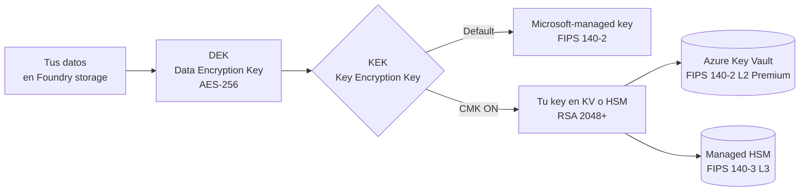
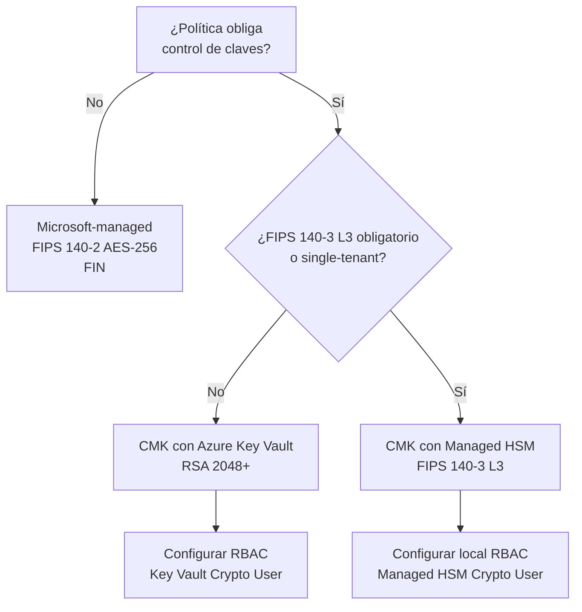

# Customer-Managed Keys (CMK) en Microsoft Foundry

> [!abstract] TL;DR
> CMK añade una capa de control sobre el **encryption-at-rest** del Foundry resource (artefactos de proyecto, archivos subidos, evaluaciones) usando claves que **tú** alojas en **Azure Key Vault** o **Azure Key Vault Managed HSM**. Requiere KV/HSM en la **misma región**, **soft-delete + purge protection**, y una **managed identity** del Foundry con rol **Key Vault Crypto User** (KV) o **Managed HSM Crypto User** (HSM). Se configura vía `properties.encryption` del recurso `Microsoft.CognitiveServices/accounts` con `keySource: 'Microsoft.KeyVault'`. El examen prueba: prerequisitos exactos, RBAC concreto, propagación de revocación, diferencia KV vs Managed HSM, y la regla "**no se puede revertir** de CMK a Microsoft-managed".

## 🎯 Relevancia en el examen

| Aspecto | Cómo cae en AI-103 |
|---|---|
| **Frecuencia** | 🔥🔥 — pregunta clásica de "Plan and manage → Configure security" |
| **Formato típico** | Drag-and-drop de pasos (orden) · MCQ "qué rol asignar" · escenario compliance (HIPAA/FedRAMP) eligiendo KV vs HSM · troubleshooting "403 Forbidden" |
| **Trampas frecuentes** | Cross-region (no soportado), reversión imposible, `Key Vault Crypto User` ≠ `Administrator`, `keyVersion: ''` = auto-rotation |
| **Carryover AI-102** | Sí — el patrón CMK ya existía en `Microsoft.CognitiveServices/accounts`; el examen actualiza nomenclatura a Foundry y añade Managed HSM |

## 📖 Concepto en profundidad

### Modelo de encryption en Azure AI / Foundry



- **At rest**: por defecto, claves gestionadas por Microsoft con **AES-256**. CMK permite **envolver (wrap) la DEK** con tu propia KEK.
- **In transit**: TLS 1.2+ obligatorio (no cubre CMK).
- **In use**: confidential computing (limitado, fuera de scope CMK).
- **Alcance CMK**: cubre datos at-rest en los storage accounts asociados al Foundry resource — **project artifacts, uploaded files, evaluation data** (verbatim docs).

### ¿Cuándo activar CMK?

- Compliance estricto: **HIPAA, FedRAMP High, GDPR sovereign requirements, PCI-DSS** con control de claves.
- Necesidad de **rotación / revocación auditadas** por el cliente.
- "**Kill switch**" inmediato: deshabilitar la key version vuelve los datos inaccesibles (útil para incident response).
- Right-to-be-forgotten reforzado: purgar la key destruye criptográficamente el dato.

> [!warning] CMK no es siempre necesario
> Microsoft-managed keys ya cumplen **FIPS 140-2** y muchos marcos regulatorios. Solo activa CMK si una política explícita lo exige o si necesitas control de lifecycle.

### Flujo runtime: cómo Foundry usa tu key

```mermaid
sequenceDiagram
    autonumber
    participant F as Foundry Resource
    participant MI as Managed Identity<br/>(system o user-assigned)
    participant KV as Key Vault / Managed HSM
    participant ST as Storage backend
    F->>MI: solicita token (Entra ID)
    MI-->>F: token con scope vault.azure.net
    F->>KV: unwrapKey(DEK_encrypted) con token
    KV->>KV: valida RBAC: Key Vault Crypto User?
    KV-->>F: DEK en claro (in-memory)
    F->>ST: lee/escribe datos cifrados con DEK
    Note over KV,ST: La DEK nunca persiste en claro;<br/>solo en memoria del recurso Foundry
```

## 🏗️ Cómo se hace

### Prerequisitos verificados (Microsoft Learn)

> [!quote] Verbatim docs (encryption-keys-portal)
> *"Deploy the key store and the Foundry resource in the **same Azure region**. Enable **soft delete and purge protection** on the key store to help safeguard customer-managed keys from accidental or malicious deletion (**required by Azure**)."*

Checklist obligatorio:

1. Foundry resource desplegado (`Microsoft.CognitiveServices/accounts` con `kind: 'AIServices'`).
2. **Managed identity** del Foundry (system-assigned o user-assigned).
3. **Azure Key Vault o Managed HSM** en la **misma región** que el Foundry.
4. **`enableSoftDelete: true`** y **`enablePurgeProtection: true`** en el key store.
5. **Modelo RBAC** recomendado (`enableRbacAuthorization: true`).
6. **Key RSA** ≥ **2048 bits** (HSM-backed opcional en Premium o en Managed HSM).
7. Roles:
   - **Key Vault** + RBAC → `Key Vault Crypto User` al managed identity del Foundry.
   - **Key Vault** + access policies (legacy) → permisos `wrapKey` y `unwrapKey`.
   - **Managed HSM** → `Managed HSM Crypto User` (RBAC local separado del de Azure).
8. Sobre el operador humano: `Owner` o `User Access Administrator` en el KV (para asignar roles) y `Contributor` u `Owner` en el Foundry.

### Bicep — Key Vault + key + Foundry CMK (end-to-end)

```bicep
@description('Region única para KV y Foundry')
param location string = resourceGroup().location
param foundryName string
param kvName string
param keyName string = 'foundry-cmk'

// 1) Key Vault con soft delete + purge protection + RBAC
resource kv 'Microsoft.KeyVault/vaults@2023-07-01' = {
  name: kvName
  location: location
  properties: {
    tenantId: subscription().tenantId
    sku: { family: 'A', name: 'standard' }
    enableSoftDelete: true
    enablePurgeProtection: true
    enableRbacAuthorization: true
  }
}

// 2) RSA key (2048+; usa 4096 para mayor compliance)
resource cmkKey 'Microsoft.KeyVault/vaults/keys@2023-07-01' = {
  parent: kv
  name: keyName
  properties: {
    kty: 'RSA'
    keySize: 4096
    keyOps: [ 'wrapKey', 'unwrapKey' ]
  }
}

// 3) Foundry resource con system-assigned MI
resource foundry 'Microsoft.CognitiveServices/accounts@2026-03-01' = {
  name: foundryName
  location: location
  kind: 'AIServices'
  sku: { name: 'S0' }
  identity: { type: 'SystemAssigned' }
  properties: {
    customSubDomainName: foundryName
  }
}

// 4) Rol "Key Vault Crypto User" a la MI del Foundry
// roleDefinitionId: 12338af0-0e69-4776-bea7-57ae8d297424
resource cryptoUserAssign 'Microsoft.Authorization/roleAssignments@2022-04-01' = {
  scope: kv
  name: guid(kv.id, foundry.id, 'KeyVaultCryptoUser')
  properties: {
    principalId: foundry.identity.principalId
    principalType: 'ServicePrincipal'
    roleDefinitionId: subscriptionResourceId(
      'Microsoft.Authorization/roleDefinitions',
      '12338af0-0e69-4776-bea7-57ae8d297424'
    )
  }
}

// 5) Activa CMK actualizando properties.encryption
// (En la práctica, separa el update en un segundo deployment
//  tras propagar el rol — puede tardar hasta 30 min.)
resource foundryWithCmk 'Microsoft.CognitiveServices/accounts@2026-03-01' = {
  name: foundryName
  location: location
  kind: 'AIServices'
  sku: { name: 'S0' }
  identity: { type: 'SystemAssigned' }
  dependsOn: [ cryptoUserAssign, cmkKey ]
  properties: {
    customSubDomainName: foundryName
    encryption: {
      keySource: 'Microsoft.KeyVault'
      keyVaultProperties: {
        keyName: keyName
        keyVersion: ''                                // vacío = auto-rotation a última versión
        keyVaultUri: kv.properties.vaultUri           // https://<kv>.vault.azure.net/
        // identityClientId: '<user-assigned-mi-clientId>'  // solo si UAMI
      }
    }
  }
}
```

> [!info] Schema confirmado (ARM ref)
> `Encryption.keySource ∈ { 'Microsoft.CognitiveServices', 'Microsoft.KeyVault' }`. `KeyVaultProperties = { keyName, keyVersion, keyVaultUri, identityClientId }`. Latest stable API: `2026-03-01`.

### Azure CLI — secuencia equivalente

```bash
# Variables
RG=rg-ai103
LOC=eastus
KV=kv-ai103-cmk
KEY=foundry-cmk
FND=foundry-ai103

# 1) Key Vault con soft delete + purge protection + RBAC
az keyvault create -g $RG -n $KV -l $LOC \
  --enable-purge-protection true \
  --enable-rbac-authorization true
# (soft delete está ON por defecto desde 2020; no se puede deshabilitar)

# 2) Key RSA 4096
az keyvault key create --vault-name $KV --name $KEY \
  --kty RSA --size 4096 --ops wrapKey unwrapKey

# 3) Obtener principalId de la MI del Foundry (system-assigned)
PRINCIPAL=$(az cognitiveservices account show \
  -g $RG -n $FND --query "identity.principalId" -o tsv)

# 4) Asignar rol Key Vault Crypto User
az role assignment create \
  --assignee-object-id $PRINCIPAL \
  --assignee-principal-type ServicePrincipal \
  --role "Key Vault Crypto User" \
  --scope $(az keyvault show -n $KV --query id -o tsv)

# 5) Activar CMK en el Foundry
KV_URI=$(az keyvault show -n $KV --query properties.vaultUri -o tsv)
az cognitiveservices account update -g $RG -n $FND \
  --encryption "{\"keySource\":\"Microsoft.KeyVault\",\
\"keyVaultProperties\":{\"keyName\":\"$KEY\",\"keyVersion\":\"\",\
\"keyVaultUri\":\"$KV_URI\"}}"
```

### Python — `azure-mgmt-cognitiveservices` (control-plane)

```python
# pip install azure-identity azure-mgmt-cognitiveservices
from azure.identity import DefaultAzureCredential
from azure.mgmt.cognitiveservices import CognitiveServicesManagementClient
from azure.mgmt.cognitiveservices.models import (
    Account, Encryption, KeyVaultProperties, Identity, Sku
)

cred = DefaultAzureCredential()
client = CognitiveServicesManagementClient(cred, subscription_id="<SUB_ID>")

account = Account(
    location="eastus",
    kind="AIServices",
    sku=Sku(name="S0"),
    identity=Identity(type="SystemAssigned"),
    properties={
        "customSubDomainName": "foundry-ai103",
        "encryption": Encryption(
            key_source="Microsoft.KeyVault",
            key_vault_properties=KeyVaultProperties(
                key_name="foundry-cmk",
                key_version="",                 # auto-rotation
                key_vault_uri="https://kv-ai103-cmk.vault.azure.net/",
                # identity_client_id="<UAMI-clientId>",  # opcional si UAMI
            ),
        ),
    },
)

poller = client.accounts.begin_create(
    resource_group_name="rg-ai103",
    account_name="foundry-ai103",
    account=account,
)
print(poller.result().properties.encryption.key_source)
```

> [!tip] Plano de datos vs plano de control
> Configurar CMK es **plano de control** (`*-mgmt-*` SDK). Las llamadas de inferencia siguen siendo plano de datos (`azure-ai-projects`, `openai`, etc.) y no cambian con CMK.

## 📊 Tablas comparativas

### Key Vault (Standard/Premium) vs Managed HSM

| Atributo | Key Vault Standard | Key Vault Premium | **Managed HSM** |
|---|---|---|---|
| **FIPS validation** | Software | **FIPS 140-3 Level 3** (firmware HSM actualizado) | **FIPS 140-3 Level 3** |
| **Tenancy** | Multi-tenant | Multi-tenant | **Single-tenant**, dedicated cluster |
| **Key types** | RSA, EC | RSA, EC, **HSM-backed** | RSA, EC, AES, **HSM-backed** |
| **RBAC** | Azure RBAC o vault access policies | Igual | **Local RBAC** separado (Managed HSM Crypto User) |
| **Pricing** | $ | $$ (transacciones HSM extra) | **$$$** (pool por hora) |
| **Cuándo elegir** | Dev/test, CMK normal | Compliance HSM + tenancy multi | **Sovereign / regulado / Level 3 obligatorio** |
| **Rol para CMK** | `Key Vault Crypto User` | Igual | `Managed HSM Crypto User` |

### Árbol de decisión: ¿Microsoft-managed o CMK?



### CMK vs BYO Key Vault para connection secrets

| Capacidad | **CMK** (`properties.encryption`) | **BYO Key Vault connection** (`accounts/connections`) |
|---|---|---|
| **Propósito** | Cifrar datos at-rest del Foundry | Almacenar **secrets de connections** (API keys, etc.) |
| **Recurso ARM** | `properties.encryption` del account | `Microsoft.CognitiveServices/accounts/connections` con `category: 'AzureKeyVault'` |
| **Rol RBAC** | `Key Vault Crypto User` | `Key Vault Secrets Officer` (mínimo) |
| **Límite** | 1 key activa por recurso | **1 KV connection por Foundry resource** |
| **Auth de la connection** | N/A | `authType: 'AccountManagedIdentity'` |
| **Reversibilidad** | **Irreversible** a Microsoft-managed | Reversible (delete + recreate, sin secret migration) |

## 🪤 Trampas del examen

1. **Misma región obligatoria**. KV/HSM y Foundry **en la misma región Azure**. Misma subscription **no es requisito**. Cross-region CMK no está soportado (error "Key store not found").
2. **Soft delete + purge protection son obligatorios**, no opcionales. Sin ambos, el portal/ARM rechaza la configuración (*"required by Azure"*, verbatim docs).
3. **Irreversibilidad**: *"Projects can be updated from Microsoft-managed keys to CMKs but **not reverted**"* (verbatim). El examen suele probar esto en negativo.
4. **Solo se puede cambiar de key dentro del MISMO key store**: *"Project CMKs can be updated only to keys in the same key store"*. Migrar entre KV distintos requiere recreación.
5. **`keyVersion: ''` vacío = auto-rotation ON** al usar la última versión. Si fijas una versión concreta, **deberás actualizar manualmente** tras rotar.
6. **CMK rotation NO re-cifra datos existentes**. Solo escrituras nuevas usan la nueva key version. La DEK se rota independientemente.
7. **`Key Vault Crypto User` ≠ `Key Vault Administrator`**. El examen distingue: para CMK es **Crypto User**; para gestionar secrets de BYO connections es **Secrets Officer**; para todo es Administrator (sobre-privilegio).
8. **Managed HSM usa RBAC local separado** del Azure RBAC: `Managed HSM Crypto User`, asignado por un `Managed HSM Administrator`. No basta con dar Azure RBAC.
9. **BYO Key Vault para secrets: solo 1 conexión por Foundry resource**. *"Limit Azure Key Vault connections to one per Foundry resource"* (verbatim). Y debe crearse **cuando no haya otras connections** existentes.
10. **Propagación de RBAC tarda hasta 30 min** tras asignar el rol (*"After you assign the Key Vault Secrets Officer role, it can take up to 30 minutes for permissions to propagate"*). Trampa típica en escenarios "el deployment falló justo después".
11. **Revocación = recurso inaccesible**: deshabilitar la key version vuelve los datos inaccesibles hasta restaurar. Útil como *kill switch*, peligroso como accidente. Si purgas el KV, **soporte no puede recuperarlo**.
12. **Capacity-constrained**: CMK *"is currently available only in select regions"* por dependencia de Azure AI Search (verbatim). Verifica regional support antes de planificar.
13. **`keySource` válido**: solo `'Microsoft.CognitiveServices'` (default) o `'Microsoft.KeyVault'`. **NO** existe `'Microsoft.ManagedHsm'`: HSM se direcciona también por `keyVaultUri` apuntando al endpoint HSM.
14. **`identityClientId` solo si UAMI**. Con system-assigned MI se omite (Foundry usa su propia identidad).
15. **Networking del key store**: si Foundry tiene private networking, KV/HSM debe permitir **"Allow trusted Microsoft services"** y/o private endpoint. Sin esto, falla unwrap.
16. **Tamaño mínimo de key**: RSA ≥ **2048 bits**. Error *"Key version not supported"* si usas algo menor.

## 🧠 Mnemotecnia

> **"SSPR-CRR"** — los 7 must-haves del CMK:
> **S**oft delete · **S**ame region · **P**urge protection · **R**BAC enabled · **C**rypto User role · **R**SA ≥ 2048 · **R**otate via key version

> **"Crypto User para CMK, Secrets Officer para Secrets, Administrator para nada en producción."**

> **Analogía**: Microsoft-managed = caja fuerte del banco con llave del banco. CMK = caja fuerte del banco con tu llave personal. Managed HSM = caja fuerte dedicada en una sala blindada solo para ti.

> **Regla mental de irreversibilidad**: *"CMK is a **one-way door** in Foundry"* — entras pero no sales hacia Microsoft-managed.

## 🔗 Conceptos relacionados

- [[plan-security-managed-identity]] — la identidad que accede al KV
- [[plan-security-keyless-credentials]] — patrón que reemplaza API keys con Entra ID
- [[plan-security-rbac-role-policies]] — donde se asigna Key Vault Crypto User
- [[plan-security-private-networking]] — KV/HSM con private endpoints
- [[plan-azure-infrastructure-ai-apps]] — patrón ARM/Bicep general
- [[plan-foundry-hubs-projects]] — el recurso que se cifra
- [[00-microsoft-foundry-overview]] — contexto de Foundry resource
- [[plan-diagnostic-logs-azure-monitor]] — auditar uso de la key

## ❓ Autotest

**1.** Configuras CMK en un Foundry resource en `eastus`. Tu Key Vault está en `westus`. ¿Qué ocurre?

- a) Funciona si ambos están en la misma subscription
- b) Funciona pero con latencia incrementada
- c) Falla con "Key store not found": KV debe estar en la **misma región** que el Foundry
- d) Funciona si activas geo-replicación en KV

<details><summary>Respuesta</summary>
<b>c</b>. Verbatim docs: *"Deploy the key store and the Foundry resource in the same Azure region"*. Cross-region CMK no está soportado. Misma subscription no es requisito.
</details>

**2.** ¿Qué rol RBAC concede el mínimo necesario para que la MI del Foundry pueda usar una key en Azure Key Vault con RBAC?

- a) Key Vault Administrator
- b) Key Vault Contributor
- c) **Key Vault Crypto User**
- d) Key Vault Secrets Officer

<details><summary>Respuesta</summary>
<b>c</b>. `Key Vault Crypto User` otorga `wrapKey`/`unwrapKey` sin permisos de gestión. Administrator es sobre-privilegio; Contributor gestiona el vault pero no usa keys; Secrets Officer es para secrets en BYO KV connection, no para CMK.
</details>

**3.** Has activado CMK en producción. Por compliance, necesitas revocar acceso inmediatamente ante un incidente. ¿Cuál es el "kill switch" correcto?

- a) Borrar el Foundry resource
- b) **Disable la key version** en el Key Vault
- c) Quitar el rol `Key Vault Crypto User`
- d) Hacer purge del KV

<details><summary>Respuesta</summary>
<b>b</b>. Deshabilitar la key version vuelve los datos inaccesibles **inmediatamente** y es **reversible** (re-enable). Quitar el rol también funciona pero la propagación puede tardar hasta 30 min. Purge es destructivo e irrecuperable (soft-deleted retention).
</details>

**4.** Diseñas un Foundry para una agencia federal que exige FIPS 140-3 Level 3 y single-tenancy de claves. ¿Qué eliges?

- a) Key Vault Standard con CMK
- b) Key Vault Premium con CMK
- c) **Azure Key Vault Managed HSM con CMK**
- d) Microsoft-managed keys (ya cumplen FIPS 140-3)

<details><summary>Respuesta</summary>
<b>c</b>. Solo **Managed HSM** ofrece FIPS 140-3 Level 3 **y** single-tenant dedicated cluster. KV Premium tiene HSM-backed pero es multi-tenant. Microsoft-managed cubre 140-2 históricamente; aunque la flota HSM se actualizó a 140-3, no satisface el requisito de single-tenant.
</details>

**5.** En Bicep configuras `keyVaultProperties.keyVersion: ''` (vacío). ¿Qué implica?

- a) Error de schema: el campo es requerido
- b) Foundry usa siempre la versión inicial de la key
- c) **Auto-rotation activado**: Foundry sigue la última versión de la key automáticamente
- d) Cifrado deshabilitado

<details><summary>Respuesta</summary>
<b>c</b>. Cadena vacía en `keyVersion` indica auto-rotation: Foundry resolverá la última versión sin update manual. Importante para compliance que exige rotación periódica sin downtime de configuración. Nota: la rotación NO re-cifra datos previos.
</details>

**6.** Quieres almacenar los secrets de tus connections en tu propio Key Vault (BYO). ¿Cuál de estas afirmaciones es **falsa**?

- a) Solo se permite 1 KV connection por Foundry resource
- b) Debe crearse **antes** que cualquier otra connection
- c) Foundry soporta migración automática de secrets entre KVs
- d) Borrar el KV subyacente rompe el Foundry resource

<details><summary>Respuesta</summary>
<b>c</b> es falsa. Verbatim docs: *"Foundry doesn't support secret migration. Remove and recreate connections yourself."*. Las demás son ciertas y caen frecuentemente en exámenes.
</details>

## ✅ Control de calidad (auto-rúbrica)

| Dimensión | Nota | Justificación |
|---|---|---|
| Completitud | **9.5/10** | Cubre encryption layers, prereqs, RBAC KV/HSM, Bicep+CLI+Python verificados, rotation, revocation, BYO Key Vault, sovereign, networking |
| Exactitud técnica | **9.5/10** | Schema `Encryption`/`KeyVaultProperties` verificado en ARM ref `2026-03-01`; RBAC role IDs verbatim; citas verbatim de Microsoft Learn (encryption-keys-portal + set-up-key-vault-connection) |
| Alineación al examen | **9.5/10** | 16 trampas reales, autotest tipo MCQ, énfasis en irreversibilidad, RBAC distinguishing, region constraint, propagación 30 min |
| Claridad pedagógica | **9/10** | Mnemónico SSPR-CRR, analogía caja fuerte, mermaids (jerarquía, sequence, decisión), tablas comparativas KV vs HSM y CMK vs BYO |

*Verificado a fecha 2026-05-23 contra Microsoft Learn (artículos con `ms.date` 2026-05-04 y 2026-05-12 / 2026-05-18; ARM schema ref `2026-03-01`). Sin ⚠️ — todos los hechos confirmados en allowlist oficial.*
