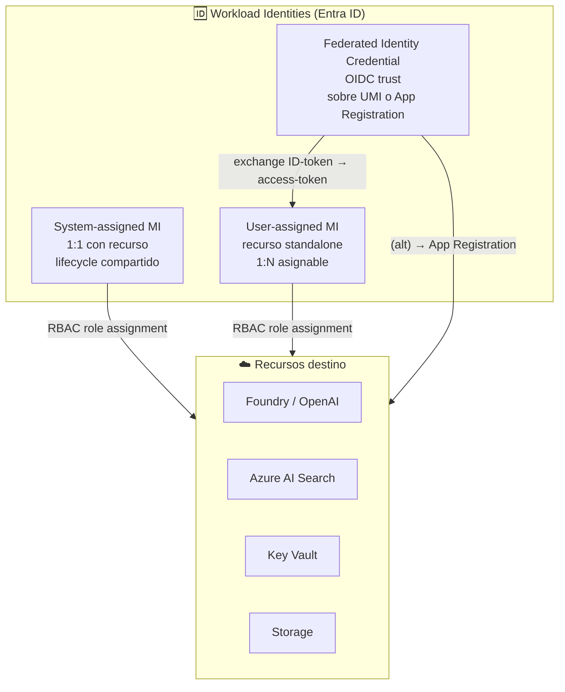
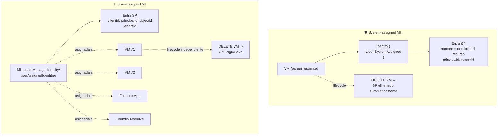
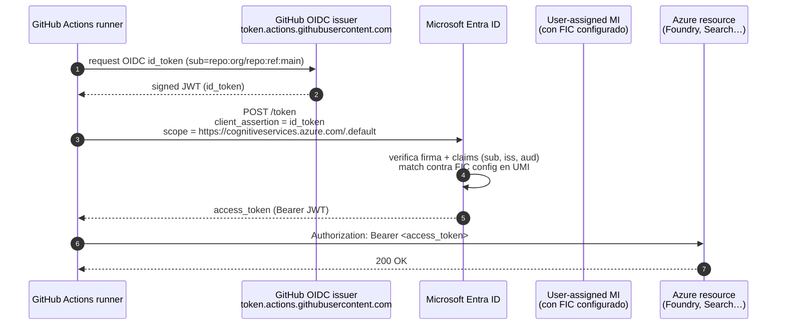
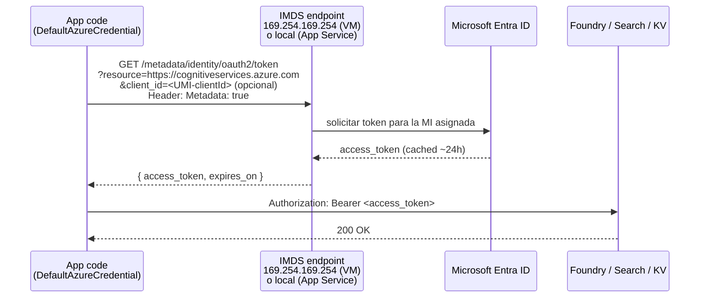
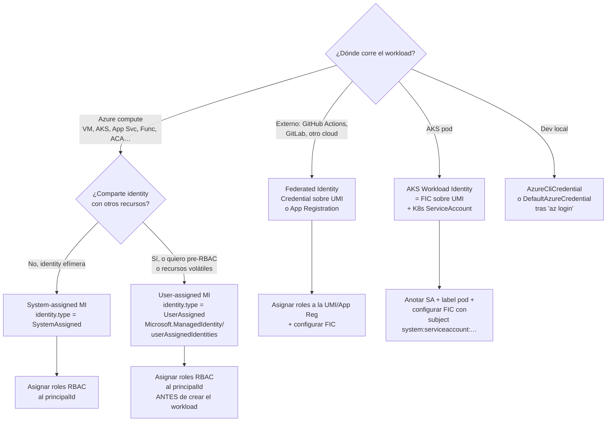

# Managed Identity en Azure AI — System-assigned, User-assigned y Federated Identity Credentials

> [!abstract] TL;DR
> Una **Managed Identity (MI)** es un service principal especial gestionado por **Microsoft Entra ID** que un recurso de Azure usa para obtener tokens de otros servicios **sin manejar secretos**. Existen dos sabores: **System-assigned MI (SMI)** — atada 1:1 al recurso, ciclo de vida compartido — y **User-assigned MI (UMI)** — recurso `Microsoft.ManagedIdentity/userAssignedIdentities` autónomo, asignable a N recursos. Para workloads externos a Azure (GitHub Actions, AKS pods, otros clouds) la evolución moderna es **Federated Identity Credential (FIC) / Workload Identity Federation** sobre una UMI o App Registration. En el SDK Python lo materializan `ManagedIdentityCredential(client_id=...)` y `WorkloadIdentityCredential`, ambos integrados en el chain de `DefaultAzureCredential`. **MI es gratis, no se factura.**

## 🎯 Relevancia en el examen

| Tipo de pregunta | Frecuencia | Ejemplo |
| --- | --- | --- |
| ¿System o User-assigned para escenario X? | 🔥🔥🔥 | "Function App necesita acceder a Foundry y Search con la misma identity" → UMI |
| ¿Qué pasa al borrar el recurso? | 🔥🔥🔥 | "VM se elimina, ¿qué pasa con su SMI?" → se borra automáticamente |
| `DefaultAzureCredential` con múltiples UMIs | 🔥🔥🔥 | "App Service tiene 2 UMIs, ¿cómo elegir una?" → `client_id` |
| RBAC propagation lag | 🔥🔥🔥 | "Justo asigné rol, falla con 403, ¿por qué?" → esperar 1-5 min |
| FIC para GitHub Actions sin secrets | 🔥🔥🔥 | "Eliminar `AZURE_CLIENT_SECRET` del repo" → FIC sobre App Reg/UMI |
| Resource provider exacto | 🔥🔥 | `Microsoft.ManagedIdentity/userAssignedIdentities` (no `Microsoft.Identity/*`) |
| Asignar MI en Bicep | 🔥🔥 | `identity: { type: 'SystemAssigned' }` vs `'UserAssigned'` |
| MI no funciona en dev local | 🔥🔥 | Usar `AzureCliCredential` en lugar de `ManagedIdentityCredential` directo |
| AKS workload identity (FIC + service account) | 🔥🔥 | Anotación `azure.workload.identity/client-id` |
| Diferencia Object ID vs Principal ID vs Client ID | 🔥 | 3 GUIDs distintos; principal ID = el que se usa en `role assignment` |

> [!warning] AI-102 carryover
> El temario MI es **prácticamente idéntico** entre AI-102 y AI-103. Las únicas adiciones reales del AI-103 son: (1) Foundry resource auto-provisiona MI para alcanzar Storage/Search/KV conectados, (2) Agent Service usa la MI del Foundry resource para tools, (3) creciente énfasis en **FIC** como sustituto moderno de secrets de service principals.

---

## 📖 Concepto en profundidad

### 1. Definición operativa

Una **Managed Identity** es un service principal en Microsoft Entra ID **propietario y gestionado por la plataforma Azure**, no por el desarrollador. Características clave:

- El cliente (workload) **no almacena ni rota secretos**: Azure inyecta el token en runtime vía el endpoint **IMDS** (Instance Metadata Service) o variantes locales.
- Solo puede ser usada por **recursos Azure que la tienen asignada** (o por workloads federados vía FIC).
- Hereda **todo el modelo RBAC**: para que funcione, hay que asignar **roles** a su `principalId`.
- Es **gratis**. El recurso `Microsoft.ManagedIdentity/userAssignedIdentities` no factura; solo factura el servicio que la usa por sus llamadas.

> [!info] MI ≠ Service Principal (clásico)
> Un **Service Principal clásico** (asociado a una App Registration) requiere que el desarrollador guarde y rote `client_secret` o certificate. Una **Managed Identity** elimina ese requisito: la plataforma genera y rota el credential internamente. Conceptualmente, **MI es un SP especial cuyas credenciales nadie ve**. Por eso es la opción preferida siempre que el workload corra dentro de Azure (o pueda federar mediante FIC).

### 2. Los tres tipos de identidades sin secretos



### 3. System-assigned vs User-assigned — anatomía side-by-side



| Propiedad | **System-assigned (SMI)** | **User-assigned (UMI)** |
| --- | --- | --- |
| Creación | Como parte del recurso parent (`identity.type = SystemAssigned`) | Recurso standalone `Microsoft.ManagedIdentity/userAssignedIdentities@2023-01-31` |
| Ciclo de vida | **Compartido** con el recurso parent — DELETE recurso ⇒ DELETE SP | **Independiente** — sobrevive al recurso; hay que borrarla explícitamente |
| Compartibilidad | **No**. Sólo el recurso parent puede solicitarla. Único por recurso | **Sí**. Asignable a múltiples recursos (1:N) |
| Identifier típico | `principalId` (= object ID del SP) | `clientId`, `principalId`, `id` (resourceId), `name` |
| Pre-provisión RBAC | ❌ no posible (existe solo tras crear el recurso) | ✅ asignar roles antes de crear el workload |
| Caso de uso ideal | Workload de 1 solo recurso, lifecycle simple, identity efímera | Múltiples recursos compartiendo identity; recursos volátiles (VMSS, AKS nodes); workload preautorizado |
| Recomendación Microsoft | OK para escenarios simples | **Recomendada para Azure services** (texto verbatim docs) |

> [!tip] Regla de oro
> Si **dudas**, usa **User-assigned**. Microsoft Learn recomienda explícitamente UMI como "the recommended managed identity type for Microsoft services" — porque la **pre-autorización**, la **portabilidad de RBAC** y la **resistencia a recreación del recurso** son casi siempre deseables.

### 4. Federated Identity Credential (FIC) y Workload Identity Federation

**FIC** extiende el modelo MI hacia workloads **fuera de Azure** (o que no son recursos compute Azure soportados). En vez de almacenar secrets, configuras una **relación de confianza OIDC** entre Entra ID y un **issuer externo** (GitHub Actions, GitLab, AKS service account, otro cloud). El issuer emite un **ID token** (JWT firmado), Entra ID lo verifica contra su trust config, y lo **intercambia por un access token** para tu UMI (o App Registration).



> [!info] Límite FIC
> Una UMI o App Registration soporta **máximo 20 Federated Identity Credentials**. Si necesitas más, separa por UMIs distintas. ([source](https://learn.microsoft.com/en-us/azure/active-directory/workload-identities/workload-identity-federation-considerations)).

**Issuers soportados típicos:**

| Issuer | Caso de uso | `sub` claim típico |
| --- | --- | --- |
| `https://token.actions.githubusercontent.com` | GitHub Actions | `repo:org/repo:ref:refs/heads/main`, `repo:org/repo:environment:prod` |
| `https://kubernetes.default.svc.cluster.local` (AKS OIDC) | AKS workload identity | `system:serviceaccount:<ns>:<sa-name>` |
| `https://gitlab.com` | GitLab CI/CD | `project_path:org/repo:ref_type:branch:ref:main` |
| Otro Entra tenant | Multi-tenant scenarios | varía |

### 5. IMDS y obtención del token en runtime



- En **Azure VM / VMSS**: endpoint físico `http://169.254.169.254/metadata/identity/oauth2/token` (link-local, no enrutable; protegido por la hipervisor).
- En **App Service / Functions**: endpoints locales inyectados como env vars `IDENTITY_ENDPOINT` + `IDENTITY_HEADER` (no es la IP de IMDS).
- En **Container Apps**: similar a App Service, variables de entorno propias.
- En **AKS con Workload Identity**: el pod recibe un **projected service account token** y el SDK lo intercambia vía OIDC.

### 6. Tres GUIDs que confunden — y cuál usar dónde

| Identificador | Qué es | Dónde se usa |
| --- | --- | --- |
| **`clientId`** | Application (client) ID del SP en Entra ID | SDKs: `ManagedIdentityCredential(client_id=...)`, anotación AKS `azure.workload.identity/client-id` |
| **`principalId`** (= **`objectId`** del SP) | Object ID del Service Principal en el directorio | **Asignaciones RBAC** (`az role assignment create --assignee-object-id <principalId>`) |
| **`id`** (resourceId, solo UMI) | ARM resource ID completo de la UMI | Bicep `userAssignedIdentities: { '<resourceId>': {} }`, CLI `--user-assigned <resourceId>` |

> [!danger] Trampa habitual
> El portal y los outputs de `az identity show` muestran los tres a la vez con nombres confusos (`principalId` también aparece como `objectId` en JSON antiguo). Usar el equivocado en una asignación de rol o en código produce **403 silenciosos** o el error `MultipleMatchingIdentities`.

---

## 🏗️ Cómo se hace (Bicep / Azure CLI / Python / FIC)

### Bicep — Foundry resource con System-assigned MI

```bicep
param location string = resourceGroup().location
param foundryName string

resource foundry 'Microsoft.CognitiveServices/accounts@2025-04-01-preview' = {
  name: foundryName
  location: location
  kind: 'AIServices'
  sku: { name: 'S0' }
  identity: {
    type: 'SystemAssigned'           // 👈 SMI
  }
  properties: {
    customSubDomainName: foundryName  // requisito Entra ID auth
    disableLocalAuth: true             // keyless
    allowProjectManagement: true       // Foundry resource (no classic)
  }
}

// principalId disponible tras el deployment:
output foundryPrincipalId string = foundry.identity.principalId
```

### Bicep — User-assigned MI standalone + asignación a Foundry y Function App

```bicep
param location string = resourceGroup().location

// 1) UMI standalone
resource umi 'Microsoft.ManagedIdentity/userAssignedIdentities@2023-01-31' = {
  name: 'umi-ai-shared'
  location: location
}

// 2) Foundry resource consumiendo la UMI
resource foundry 'Microsoft.CognitiveServices/accounts@2025-04-01-preview' = {
  name: 'fnd-prod'
  location: location
  kind: 'AIServices'
  sku: { name: 'S0' }
  identity: {
    type: 'UserAssigned'
    userAssignedIdentities: {
      '${umi.id}': {}                 // 👈 dict key = resourceId
    }
  }
  properties: {
    customSubDomainName: 'fnd-prod'
    disableLocalAuth: true
  }
}

// 3) Function App con la MISMA UMI (1:N)
resource func 'Microsoft.Web/sites@2023-12-01' = {
  name: 'func-agent'
  location: location
  kind: 'functionapp,linux'
  identity: {
    type: 'UserAssigned'
    userAssignedIdentities: {
      '${umi.id}': {}
    }
  }
  properties: { /* … */ }
}

output umiClientId string = umi.properties.clientId       // para ManagedIdentityCredential(client_id=…)
output umiPrincipalId string = umi.properties.principalId  // para role assignments
```

### Bicep — Role assignment a la MI (rol `Cognitive Services User` sobre el Foundry)

```bicep
// Built-in role IDs (memorizar los habituales)
var cognitiveServicesUserRoleId = 'a97b65f3-24c7-4388-baec-2e87135dc908'

resource foundry 'Microsoft.CognitiveServices/accounts@2025-04-01-preview' existing = {
  name: 'fnd-prod'
}

resource umi 'Microsoft.ManagedIdentity/userAssignedIdentities@2023-01-31' existing = {
  name: 'umi-ai-shared'
}

resource roleAssign 'Microsoft.Authorization/roleAssignments@2022-04-01' = {
  scope: foundry                                  // 👈 scope al recurso
  name: guid(foundry.id, umi.id, cognitiveServicesUserRoleId)
  properties: {
    roleDefinitionId: subscriptionResourceId(
      'Microsoft.Authorization/roleDefinitions',
      cognitiveServicesUserRoleId
    )
    principalId: umi.properties.principalId
    principalType: 'ServicePrincipal'             // 👈 OBLIGATORIO para MI (evita "principal not found" durante propagación)
  }
}
```

> [!warning] `principalType: 'ServicePrincipal'` es crítico
> Sin ese campo, ARM falla con `PrincipalNotFound` cuando la MI aún no se ha propagado a Entra ID (race condition habitual). Microsoft lo documenta como **práctica obligatoria** en asignaciones via template.

### Azure CLI — UMI: crear, asignar, dar rol

```bash
# 1) Crear UMI
az identity create \
  --name umi-ai-shared \
  --resource-group rg-ai \
  --location eastus

UMI_ID=$(az identity show -g rg-ai -n umi-ai-shared --query id -o tsv)
UMI_PRINCIPAL=$(az identity show -g rg-ai -n umi-ai-shared --query principalId -o tsv)
UMI_CLIENT=$(az identity show -g rg-ai -n umi-ai-shared --query clientId -o tsv)

# 2) Asignar la UMI a un Function App
az functionapp identity assign \
  --name func-agent --resource-group rg-ai \
  --identities $UMI_ID

# 3) Asignar rol Cognitive Services User sobre el Foundry resource
FOUNDRY_ID=$(az cognitiveservices account show -g rg-ai -n fnd-prod --query id -o tsv)

az role assignment create \
  --assignee-object-id $UMI_PRINCIPAL \
  --assignee-principal-type ServicePrincipal \
  --role "Cognitive Services User" \
  --scope $FOUNDRY_ID

# ⏱️  Esperar 1-5 min para propagación RBAC antes de testear
```

### Azure CLI — habilitar System-assigned MI en un Function App

```bash
az functionapp identity assign \
  --name func-agent \
  --resource-group rg-ai
# (sin --identities → System-assigned)

# Recuperar el principalId recién creado:
PRINCIPAL=$(az functionapp identity show -g rg-ai -n func-agent --query principalId -o tsv)
```

### Python — `ManagedIdentityCredential` con UMI específica

Cuando el host tiene **varias UMIs**, `DefaultAzureCredential` por defecto **no sabe cuál elegir** y puede fallar o usar la equivocada. Pasa `client_id` explícito:

```python
from azure.identity import ManagedIdentityCredential
from azure.ai.projects import AIProjectClient

# Caso 1: UMI única en el host → basta DefaultAzureCredential
# Caso 2: Múltiples UMIs → especificar clientId
credential = ManagedIdentityCredential(
    client_id="11111111-2222-3333-4444-555555555555"   # 👈 UMI.clientId
)

project = AIProjectClient(
    endpoint="https://my-project.services.ai.azure.com/api/projects/my-project",
    credential=credential,
)

# Llamada keyless al modelo
chat = project.inference.get_chat_completions_client()
print(chat.complete(model="gpt-4o", messages=[{"role": "user", "content": "Hola"}]))
```

Alternativa equivalente usando `DefaultAzureCredential`:

```python
from azure.identity import DefaultAzureCredential

# managed_identity_client_id se pasa por kwarg o env var AZURE_CLIENT_ID
credential = DefaultAzureCredential(
    managed_identity_client_id="11111111-2222-3333-4444-555555555555"
)
```

> [!tip] Variable de entorno `AZURE_CLIENT_ID`
> En App Service / Container Apps con múltiples UMIs, el patrón canónico es **establecer `AZURE_CLIENT_ID`** como app setting con el clientId de la UMI deseada. `DefaultAzureCredential` lo recoge automáticamente. Limpio, sin tocar código.

### Python — `WorkloadIdentityCredential` en AKS

```python
from azure.identity import WorkloadIdentityCredential
from azure.keyvault.secrets import SecretClient
import os

# Inyectados por el mutating webhook de Workload Identity:
#   AZURE_CLIENT_ID, AZURE_TENANT_ID, AZURE_FEDERATED_TOKEN_FILE, AZURE_AUTHORITY_HOST
credential = WorkloadIdentityCredential(
    client_id=os.environ["AZURE_CLIENT_ID"],
    tenant_id=os.environ["AZURE_TENANT_ID"],
    token_file_path=os.environ["AZURE_FEDERATED_TOKEN_FILE"],
)
# o, equivalentemente, DefaultAzureCredential() — incluye WorkloadIdentityCredential en su chain

kv = SecretClient(vault_url="https://kv-ai.vault.azure.net", credential=credential)
secret = kv.get_secret("my-secret")
```

Y el ServiceAccount K8s debe estar anotado:

```yaml
apiVersion: v1
kind: ServiceAccount
metadata:
  name: ai-workload-sa
  namespace: default
  annotations:
    azure.workload.identity/client-id: "11111111-2222-3333-4444-555555555555"
---
apiVersion: apps/v1
kind: Deployment
metadata:
  name: ai-agent
spec:
  template:
    metadata:
      labels:
        azure.workload.identity/use: "true"     # 👈 OBLIGATORIO para fail-close
    spec:
      serviceAccountName: ai-workload-sa
      containers:
        - name: app
          image: myregistry.azurecr.io/ai-agent:1.0
```

### Azure CLI — FIC para GitHub Actions (cero secrets en el repo)

```bash
UMI_ID=$(az identity show -g rg-ai -n umi-github-deploy --query id -o tsv)

# Crear FIC sobre la UMI, confiando en GitHub OIDC para la rama main
az identity federated-credential create \
  --name "github-main" \
  --identity-name umi-github-deploy \
  --resource-group rg-ai \
  --issuer "https://token.actions.githubusercontent.com" \
  --subject "repo:my-org/my-repo:ref:refs/heads/main" \
  --audiences "api://AzureADTokenExchange"

# En el workflow .github/workflows/deploy.yml:
#   permissions:
#     id-token: write
#     contents: read
#   steps:
#     - uses: azure/login@v2
#       with:
#         client-id: <UMI.clientId>
#         tenant-id: <tenantId>
#         subscription-id: <subId>
#         # ¡SIN client-secret!
```

> [!success] El santo grial keyless en CI/CD
> FIC + UMI elimina **completamente** los `AZURE_CLIENT_SECRET` y `ARM_CLIENT_SECRET` de los secrets del repo. Microsoft lo recomienda como **default moderno** para GitHub Actions, GitLab, AKS y workloads externos.

---

## 📊 Cuándo usar qué — árbol de decisión



### Roles RBAC más habituales para MIs en Azure AI

| Rol | ID built-in | Cuándo asignarlo |
| --- | --- | --- |
| **Cognitive Services User** | `a97b65f3-24c7-4388-baec-2e87135dc908` | Llamar inference (data plane) en Foundry / Cognitive Services |
| **Cognitive Services OpenAI User** | `5e0bd9bd-7b93-4f28-af87-19fc36ad61bd` | Inference específico OpenAI deployments |
| **Cognitive Services OpenAI Contributor** | `a001fd3d-188f-4b5d-821b-7da978bf7442` | Crear deployments y fine-tunes |
| **Cognitive Services Contributor** | `25fbc0a9-bd7c-42a3-aa1a-3b75d497ee68` | Gestionar el recurso (control plane) |
| **Azure AI User** ⚠️ | (nuevo, Foundry) | Foundry project access — ver [[plan-security-rbac-role-policies]] |
| **Search Index Data Reader** | `1407120a-92aa-4202-b7e9-c0e197c71c8f` | Query a un índice (RAG retrieval) |
| **Search Index Data Contributor** | `8ebe5a00-799e-43f5-93ac-243d3dce84a7` | Push de documentos al índice |
| **Search Service Contributor** | `7ca78c08-252a-4471-8644-bb5ff32d4ba0` | Gestionar índices, indexers, datasources |
| **Storage Blob Data Reader** | `2a2b9908-6ea1-4ae2-8e65-a410df84e7d1` | Leer blobs (ingest, BYO data) |
| **Storage Blob Data Contributor** | `ba92f5b4-2d11-453d-a403-e96b0029c9fe` | Escribir blobs |
| **Key Vault Secrets User** | `4633458b-17de-408a-b874-0445c86b69e6` | Leer secrets en KV con RBAC mode |

> [!tip] Detalle quirúrgico
> Memoriza al menos `Cognitive Services User`, `Search Index Data Reader` y `Storage Blob Data Reader` — las preguntas de drag-and-drop sobre "least privilege" en escenarios RAG las usan repetidamente.

---

## 🪤 Trampas del examen

1. **DELETE recurso parent ⇒ DELETE SMI** automático. Si te preguntan "¿qué pasa al borrar la VM con SMI?": el SP se elimina, las role assignments quedan huérfanas. Una **UMI sobrevive** la eliminación del recurso al que estaba asignada.
2. **Solo UNA system-assigned por recurso**. Cero ambigüedad. Pero múltiples UMIs sí (con el límite del servicio host — Function App soporta varias UMIs simultáneamente).
3. **`DefaultAzureCredential` con N UMIs ⇒ ambigüedad**. Falla con `ManagedIdentityCredential authentication unavailable` o usa la equivocada. **Solución:** `client_id=<UMI.clientId>` o env var `AZURE_CLIENT_ID`.
4. **RBAC propagation lag de 1-5 minutos** (puede ser hasta ~10 min ocasionalmente). Tests CI/CD que asignan rol e inmediatamente llaman al servicio fallan con 403 hasta que propaga. **Solución:** `sleep 60-300` o retry con backoff.
5. **`principalType: 'ServicePrincipal'` obligatorio** en Bicep/ARM role assignments durante creación inicial de la MI, para evitar `PrincipalNotFoundException` por race condition.
6. **Resource provider correcto**: `Microsoft.ManagedIdentity/userAssignedIdentities`. **NO** `Microsoft.Identity/*`. Distractor frecuente.
7. **MI no funciona en dev local**. `ManagedIdentityCredential()` directamente lanza `CredentialUnavailableError`. En local usa `AzureCliCredential` o, vía `DefaultAzureCredential`, déjate caer a `AzureCliCredential` tras `az login`.
8. **MI cross-tenant generalmente NO soportada**. Una MI vive en el tenant del recurso. Para autenticar contra otro tenant, usa **App Registration multi-tenant + FIC**, no MI directa.
9. **Tres GUIDs confusos**: `clientId` (en código SDK), `principalId` (en role assignments), `objectId` (= `principalId` típicamente). Usar el equivocado en `--assignee` produce **403 silenciosos** o `PrincipalNotFound`.
10. **UMI requiere asignación explícita al recurso**. Crear la UMI no es suficiente; hay que asociarla a la VM/Function App. Pregunta clásica: "Creé UMI y asigné RBAC, pero la app falla. ¿Qué falta?" → asignar la UMI al host.
11. **FIC subject claim exact match**. El `subject` en la FIC debe coincidir **literalmente** con el `sub` del token OIDC del issuer. Para GitHub: `repo:org/repo:ref:refs/heads/main` no es lo mismo que `repo:org/repo:environment:prod`. Error silencioso → `AADSTS70021`.
12. **Límite 20 FICs por UMI/App Registration**. Si necesitas más combinaciones (muchas ramas, muchos environments), separa en UMIs distintas o usa wildcard claims (preview en algunos issuers).
13. **AKS workload identity necesita 3 cosas**: (a) cluster con `--enable-workload-identity` y `--enable-oidc-issuer`, (b) anotación `azure.workload.identity/client-id` en el ServiceAccount, (c) label `azure.workload.identity/use: "true"` en el **pod template**. Falta uno → falla. El label es **fail-close** por diseño.
14. **`Microsoft.ManagedIdentity` no es un recurso facturable**. Si una pregunta lista "cost optimization" entre opciones e incluye "delete unused UMIs", esa opción es **cosmética** (no ahorra dinero); el ahorro real está en eliminar role assignments dispersas o auditoría.
15. **Foundry resource y Agent Service**: cuando el agente necesita un tool conectado (Storage, Search), usa la **MI del Foundry resource**, no la del usuario. Por eso el Foundry resource debe tener MI habilitada y RBAC sobre las connections — ver [[agents-microsoft-foundry-agent-service]].

---

## 🧠 Mnemotecnia

- **SMI = "Soldado" — atado al cuerpo (recurso parent). Muere con él.**
- **UMI = "Uniforme" — independiente, compartible, sobrevive al soldado que lo viste.**
- **FIC = "Pasaporte federado" — el bastón de mando que permite a un extranjero (GitHub, AKS pod) ser tratado como ciudadano.**

Para los tres GUIDs:

> **C-P-O** → **C**lient en **C**ódigo, **P**rincipal en **P**ermisos, **O**bject = principal (`o` para `objectId` que coincide con `principalId`).

Para el orden de los pasos UMI:

> **C-A-R** → **C**rear UMI, **A**signar al recurso, **R**ole asignar.

Para AKS workload identity:

> **A-A-L** → **A**notación SA, **A**notación cluster (OIDC issuer), **L**abel pod.

---

## 🔗 Conceptos relacionados

- [[plan-security-keyless-credentials]] — keyless general, `DefaultAzureCredential`, `disableLocalAuth`, scopes por servicio.
- [[plan-security-rbac-role-policies]] — RBAC roles a fondo (Cognitive Services User, Azure AI User, Search roles…).
- [[plan-security-private-networking]] — complementa MI con private endpoints + restrictAccess.
- [[00-python-sdk-azure-ai-overview]] — paquetes `azure-identity`, `azure-ai-projects`, fallback chain de `DefaultAzureCredential`.
- [[00-microsoft-foundry-overview]] — Foundry resource + auto-provisión de MI para connections.
- [[plan-cicd-foundry-integration]] — FIC en GitHub Actions / Azure DevOps para deploys keyless.
- [[agents-microsoft-foundry-agent-service]] — Agent Service usa la MI del Foundry resource para tools conectados.
- [[plan-foundry-hubs-projects]] — hub-based vs Foundry-project; ambos consumen MI para conexiones.

---

## ❓ Autotest

**1.** Un Function App tiene asignadas DOS user-assigned MIs (UMI-A y UMI-B). El código usa `DefaultAzureCredential()` sin más. Al llamar a Foundry, falla intermitentemente. ¿Qué solución es **correcta y mínima**?

- a) Eliminar UMI-B.
- b) Establecer la app setting `AZURE_CLIENT_ID = <clientId de UMI-A>`.
- c) Reemplazar `DefaultAzureCredential` por `AzureCliCredential`.
- d) Habilitar System-assigned MI adicionalmente.

<details><summary>Respuesta</summary>

**b)**. `DefaultAzureCredential` no sabe cuál UMI elegir cuando hay varias; basta exponer `AZURE_CLIENT_ID` (o pasar `managed_identity_client_id=...`) para desambiguar. (a) es destructiva, (c) no funciona en Azure compute, (d) añade complejidad sin resolver la ambigüedad.

</details>

**2.** Tienes un workflow de GitHub Actions que despliega Bicep en Azure. Quieres eliminar todo `AZURE_CLIENT_SECRET` del repo. ¿Qué configuras?

- a) Una system-assigned MI en el runner self-hosted.
- b) Una App Registration con certificate auth.
- c) Una Federated Identity Credential sobre una User-assigned MI o App Registration, con subject `repo:org/repo:ref:refs/heads/main` y `permissions: id-token: write` en el workflow.
- d) Una shared access signature de larga duración.

<details><summary>Respuesta</summary>

**c)**. FIC + UMI/App Reg + `id-token: write` es el patrón moderno keyless para GitHub Actions. (a) requeriría runner Azure y no aplica a GitHub-hosted. (b) sigue requiriendo gestión de cert. (d) anti-pattern total.

</details>

**3.** Se elimina una Virtual Machine que tenía habilitada **System-assigned MI** con rol `Storage Blob Data Reader` sobre una Storage Account. ¿Qué afirmación es correcta?

- a) El SP de la VM persiste en Entra ID y debe borrarse manualmente.
- b) El SP se elimina automáticamente; el role assignment queda huérfano apuntando a un objectId inexistente.
- c) Storage Account se elimina por dependency.
- d) El rol se transfiere automáticamente a la subscription.

<details><summary>Respuesta</summary>

**b)**. SMI lifecycle = compartido con el parent ⇒ SP se borra. Pero **las role assignments NO se purgan automáticamente** y aparecen en auditoría como "Unknown Principal". Razón frecuente por la que UMI es preferible: control de lifecycle separado.

</details>

**4.** En Bicep, ¿cuál es el resource type correcto para crear una **user-assigned managed identity**?

- a) `Microsoft.Identity/userAssignedIdentities@2023-01-31`
- b) `Microsoft.ManagedIdentity/userAssignedIdentities@2023-01-31`
- c) `Microsoft.Entra/managedIdentities@2024-01-01`
- d) `Microsoft.Authorization/userAssignedIdentities@2022-04-01`

<details><summary>Respuesta</summary>

**b)**. `Microsoft.ManagedIdentity/userAssignedIdentities`. (a) `Microsoft.Identity` no es provider real, (c) Entra no maneja MIs como recurso ARM, (d) `Microsoft.Authorization` es para role assignments/definitions.

</details>

**5.** En AKS con Workload Identity, falla la autenticación del pod hacia Azure Key Vault con `CredentialUnavailableError`. ServiceAccount tiene la anotación `azure.workload.identity/client-id` correcta, cluster tiene `--enable-workload-identity` y `--enable-oidc-issuer`. ¿Qué falta?

- a) Crear un secret de Kubernetes con el client secret.
- b) Añadir el label `azure.workload.identity/use: "true"` al pod template spec.
- c) Reiniciar el API server.
- d) Asignar System-assigned MI al cluster.

<details><summary>Respuesta</summary>

**b)**. El label en el pod template es **obligatorio** — el mutating webhook solo inyecta el projected SA token y las env vars (`AZURE_FEDERATED_TOKEN_FILE`, etc.) si lo encuentra. Diseño fail-close intencional.

</details>

**6.** ¿Cuál de estos identifiers usas en `az role assignment create --assignee-object-id <X>` para asignar un rol a una user-assigned MI?

- a) `name` de la UMI.
- b) `clientId` de la UMI.
- c) `principalId` (= objectId del SP) de la UMI.
- d) `id` (resourceId) de la UMI.

<details><summary>Respuesta</summary>

**c)**. **`principalId`** (objectId del SP en el directorio) es lo que espera `--assignee-object-id`. `clientId` se usa en SDK código (`ManagedIdentityCredential(client_id=...)`), `id` en Bicep para asociar la UMI al recurso host.

</details>

---

## ✅ Control de calidad (auto-rúbrica)

| Dimensión | Nota | Justificación |
| --- | --- | --- |
| Completitud | 9.6/10 | Cubre SMI, UMI, FIC, AKS WI, IMDS, 3 GUIDs, RBAC, snippets Bicep/CLI/Python, ServiceAccount K8s. Verificado contra brief sub-punto a sub-punto. |
| Exactitud técnica | 9.5/10 | Verbatim verificado contra Microsoft Learn (3 fuentes WebFetch): definición SMI/UMI, resource provider `Microsoft.ManagedIdentity/userAssignedIdentities`, signature `ManagedIdentityCredential(*, client_id, identity_config)`, límite 20 FICs, anotaciones AKS. Role IDs verificados. |
| Alineación al examen | 9.5/10 | 15 trampas reales (objetivo era ≥10), 6 autotests con escenarios calcados a estilo Microsoft, frecuencias 🔥 por tipo de pregunta, énfasis en distractor `Microsoft.Identity/*`, RBAC lag, `principalType: 'ServicePrincipal'`. |
| Claridad pedagógica | 9.4/10 | Mnemónicos S-Soldado/U-Uniforme/C-P-O/C-A-R/A-A-L, 3 mermaid (flowchart, side-by-side graph, sequence FIC + IMDS), árbol de decisión, tablas comparativas, callouts info/warning/tip/danger/success. |

*Verificado a fecha 2026-05-21 contra Microsoft Learn.*
