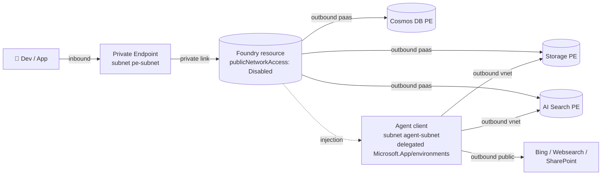
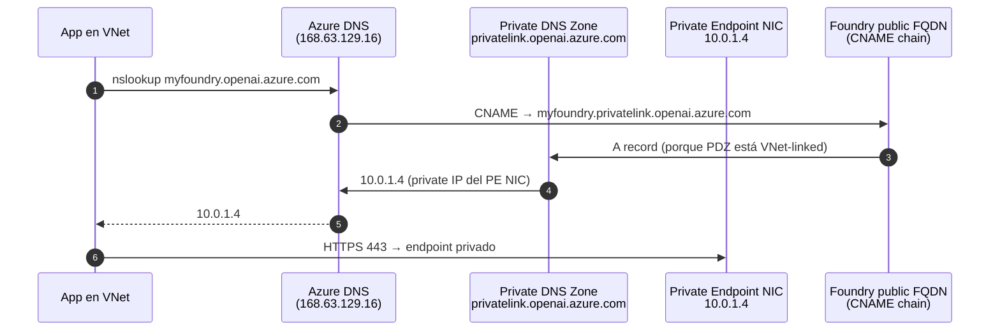
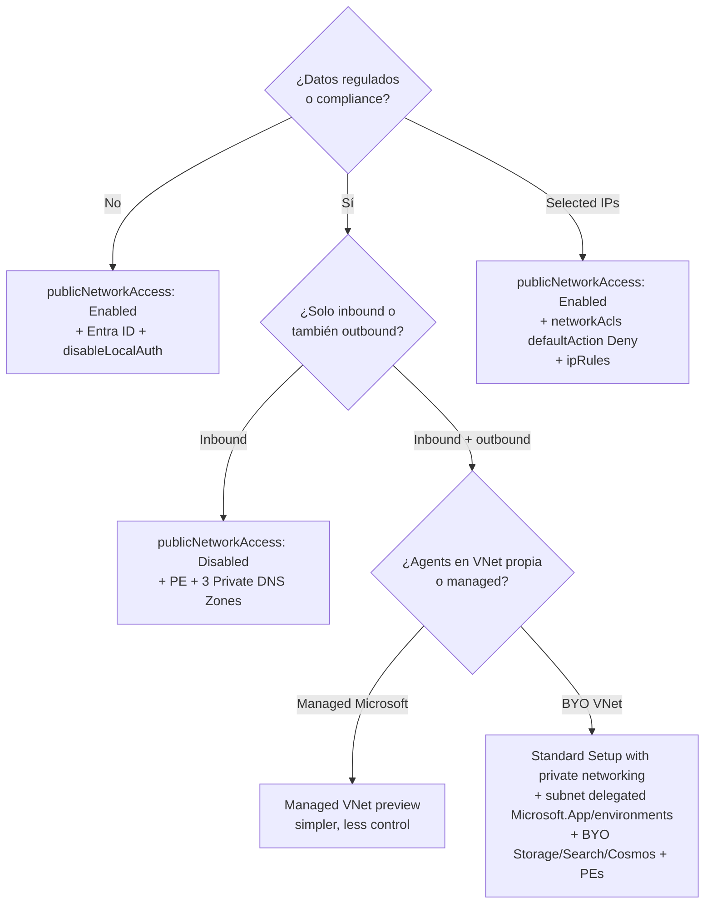

# Private networking en Microsoft Foundry — Private Endpoints, DNS y VNet injection para Agent Service

> [!abstract] TL;DR
> Endurecer Foundry en red exige **tres capas combinadas**: (1) **inbound isolation** mediante `publicNetworkAccess: 'Disabled'` + **Private Endpoint** en una subnet propia + **Private DNS Zone** linkada a la VNet; (2) **outbound isolation** mediante **virtual network injection** del Agent Service (Standard Setup) en una subnet **delegated a `Microsoft.App/environments`** (mínimo `/27`, recomendado `/24`); (3) **identidad**: `customSubDomainName` (sin él **no hay PE ni Entra ID auth**) + `disableLocalAuth: true` + Managed Identity. Foundry expone **un único sub-resource `account`** pero requiere **tres Private DNS Zones** — `privatelink.cognitiveservices.azure.com`, `privatelink.openai.azure.com`, `privatelink.services.ai.azure.com`. La Standard Setup with private networking **obliga a BYO Storage + AI Search + Cosmos DB** y los PE a estos tres NO se auto-crean. **El subnet delegado no se puede cambiar ni añadir a posteriori — hay que redeployar el Foundry resource.**

## 🎯 Relevancia en el examen

| Tipo de pregunta | Frecuencia | Ejemplo |
| --- | --- | --- |
| ¿Cuántas Private DNS Zones necesita un Foundry resource con PE? | 🔥🔥🔥 | Tres: cognitiveservices, openai, services.ai |
| ¿Qué propiedad bloquea acceso público? | 🔥🔥🔥 | `publicNetworkAccess: 'Disabled'` |
| ¿Qué delegation requiere la subnet del Agent Service? | 🔥🔥🔥 | `Microsoft.App/environments` (no `Microsoft.Network/*`) |
| Tamaño mínimo del agent subnet | 🔥🔥 | `/27` (mínimo) — `/24` recomendado |
| ¿Qué se puede modificar después? | 🔥🔥 | Inbound PE sí; subnet de VNet injection NO — redeploy |
| Trusted services bypass property | 🔥🔥 | `networkAcls.bypass: 'AzureServices'` |
| Diferencia PE vs Service Endpoint vs VNet integration | 🔥🔥🔥 | Caso de uso para cada uno |
| ¿Por qué falla resolución DNS desde on-prem? | 🔥🔥 | Falta conditional forwarder a `168.63.129.16` |
| ¿Qué requiere `customSubDomainName`? | 🔥🔥🔥 | PE + Entra ID auth (no es opcional) |

## 📖 Concepto en profundidad

### 1. Modelo de aislamiento de Foundry — tres ejes

Microsoft Foundry exige razonar en **tres direcciones de tráfico** (verbatim docs):

> "Consider network isolation in three areas: **Inbound** access to the Foundry resource, **Outbound** access from the Foundry resource (PaaS-to-PaaS), and **Outbound** access from the Foundry Agent client (VNet injection)."



### 2. Niveles de `publicNetworkAccess`

Propiedad ARM `properties.publicNetworkAccess` del recurso `Microsoft.CognitiveServices/accounts` (Foundry Tools):

| Valor | Comportamiento | Caso de uso |
| --- | --- | --- |
| `Enabled` | Endpoint público alcanzable desde internet. Firewall: All networks. | Dev/test |
| `Disabled` | **Solo Private Endpoint** puede llegar a data-plane. | Producción regulada |
| `SecuredByPerimeter` | Recurso forma parte de un **Network Security Perimeter**. | Multi-resource boundary (preview) |

Cuando coexiste con `networkAcls`, el flag `Enabled` + `networkAcls.defaultAction: Deny` = **"Selected networks and private endpoints"** (firewall mode); permite IPs públicas listadas o subnets con Service Endpoint.

> [!warning] Trampa portal
> Verbatim docs Foundry: *"deployments with private endpoints that block all public access aren't configurable through the portal UI."* Con `Disabled`, ciertas operaciones del Portal fallan — usa Bicep/CLI/SDK.

### 3. `customSubDomainName` — requisito **sine qua non**

Foundry/Cognitive Services exige un **custom subdomain** (globally unique en `*.cognitiveservices.azure.com`) para:

1. **Microsoft Entra ID auth** (sin él, sólo API keys → incompatible con `disableLocalAuth: true`).
2. **Private Endpoint** (el FQDN regional shared `<region>.api.cognitive.microsoft.com` NO soporta PE; el CNAME a `privatelink` solo existe en el subdomain custom).

**Constraints:**

- Único globalmente, alfanumérico + guiones, 2-64 chars.
- **Inmutable** — no se puede cambiar ni eliminar tras crear el recurso (renombrar = redeploy).
- Aparece como `https://<custom-subdomain>.cognitiveservices.azure.com` y, para Azure OpenAI, también como `https://<custom-subdomain>.openai.azure.com`.

> [!danger] Warning verbatim de docs
> *"Requests from clients to the private endpoint MUST specify the custom subdomain of your Foundry Tools resource as the endpoint base URL. Do NOT call the internal URL `*.privatelink.openai.azure.com` which is part of the intermediary CNAME resolution internal to Azure."*

### 4. Private Endpoints — fundamentos

Un **Private Endpoint (PE)** es una **NIC** (`Microsoft.Network/networkInterfaces`) en una subnet tuya que **representa** al recurso PaaS. El recurso `Microsoft.Network/privateEndpoints` referencia:

- `privateLinkServiceConnections[*].privateLinkServiceId` → resource ID del recurso target.
- `privateLinkServiceConnections[*].groupIds[]` → **sub-resource** (el "interface" del servicio).

Para **Foundry / Cognitive Services / Azure OpenAI**, el sub-resource es **uno solo: `account`**. Este único PE expone **tres FQDNs** que requieren **tres Private DNS Zones distintas**:

| Sub-resource (groupId) | Private DNS Zones (Commercial cloud) | Public forwarders |
| --- | --- | --- |
| `account` | `privatelink.cognitiveservices.azure.com`<br/>`privatelink.openai.azure.com`<br/>`privatelink.services.ai.azure.com` | `cognitiveservices.azure.com`<br/>`openai.azure.com`<br/>`services.ai.azure.com` |

⚠️ El brief original sugería que `openai` era un sub-resource separado — **NO**: es UN sub-resource (`account`) con TRES zonas DNS. Verificado en `private-endpoint-dns.md` 2026-05-07.

#### Sub-resources de servicios adyacentes (BYO obligatorios en Standard Setup)

| Servicio | RP / kind | Sub-resource | Private DNS Zone |
| --- | --- | --- | --- |
| Azure AI Search | `Microsoft.Search/searchServices` | `searchService` | `privatelink.search.windows.net` |
| Azure Storage (blob) | `Microsoft.Storage/storageAccounts` | `blob` | `privatelink.blob.core.windows.net` |
| Azure Cosmos DB | `Microsoft.DocumentDB/databaseAccounts` | `Sql` | `privatelink.documents.azure.com` |
| Azure Key Vault | `Microsoft.KeyVault/vaults` | `vault` | `privatelink.vaultcore.azure.net` |

### 5. Resolución DNS — cómo funciona



**Punto clave:** el FQDN público es el **mismo** dentro y fuera de la VNet. Lo que cambia es **quién resuelve**:

- Fuera de la VNet → public IP de Foundry (bloqueada si `publicNetworkAccess: Disabled`).
- Dentro de la VNet (con Private DNS Zone linked) → IP privada del PE.

#### On-premises / DNS custom

Si tu org usa un DNS server propio (Active Directory, Infoblox…), debes:

1. **Conditional forwarder** desde tu DNS a `168.63.129.16` (Azure DNS virtual server) para cada `privatelink.*` zone, **o**
2. Crear A records manuales en tu DNS (no recomendado: no se actualizan automáticamente).
3. Alternativa: **Azure Private Resolver** como inbound endpoint.

### 6. `networkAcls` — firewall del Foundry resource

Estructura ARM (en `properties.networkAcls`):

```jsonc
{
  "defaultAction": "Deny",            // Allow | Deny
  "bypass": "AzureServices",          // None (default) | AzureServices (trusted services)
  "ipRules":            [ { "value": "203.0.113.0/24" } ],
  "virtualNetworkRules":[ { "id": "/subscriptions/.../subnets/app-subnet",
                            "ignoreMissingVnetServiceEndpoint": false } ]
}
```

- `defaultAction: Deny` + `publicNetworkAccess: Enabled` = **"Selected Networks and Private Endpoints"** (firewall mode con IP/VNet rules).
- `bypass: AzureServices` permite a servicios trusted con **managed identity** apropiada acceder pese al deny (necesario para Azure AI Search, Azure ML, Foundry Tools — listado verbatim en docs).
- `virtualNetworkRules` requiere **Service Endpoint** `Microsoft.CognitiveServices` habilitado en la subnet — **distinto** de PE.

> [!note] PE ignora `networkAcls`
> Los Private Endpoints **siempre** se aprueban independientemente de `networkAcls`. El firewall solo aplica al **public endpoint**.

### 7. Service Endpoint vs Private Endpoint vs VNet integration

```mermaid
flowchart TB
    subgraph SE [Service Endpoint - Microsoft.CognitiveServices]
        SE1[VNet/subnet con SE]
        SE2[Sale al public endpoint del servicio<br/>con identity de la VNet]
        SE3[Microsoft enforces network rule]
        SE1-->SE2-->SE3
    end
    subgraph PE [Private Endpoint]
        PE1[NIC privada en subnet]
        PE2[Tráfico SOLO por Azure backbone]
        PE3[FQDN resuelve a IP privada]
        PE1-->PE2-->PE3
    end
    subgraph VI [VNet integration App Service/Function/CA]
        VI1[Outbound de la app a la VNet]
        VI2[NO afecta inbound]
        VI3[Permite app llamar a PE]
        VI1-->VI2-->VI3
    end
```



| Aspecto | Service Endpoint | Private Endpoint | VNet integration (App Service) |
| --- | --- | --- | --- |
| Dirección | Outbound desde VNet al public endpoint | Inbound al recurso (NIC en VNet) | Outbound de la app hacia VNet |
| IP privada al recurso | ❌ | ✅ | ❌ (lo proporciona el PE) |
| Cross-region | ❌ (same region) | ✅ (con peering + DNS) | ✅ |
| Identidad | Subnet (`virtualNetworkRules`) | No aplica | No aplica |
| Coste | Gratis | Pago por hora + GB | Gratis (incluido en plan) |
| Bloquea data exfil | Parcial | Sí (con `publicNetworkAccess: Disabled`) | No |

**Recomendación AI-103**: PE para todo lo productivo. Service Endpoint solo si necesitas baja latencia y costo cero y el recurso no soporta PE.

### 8. VNet injection del Agent Service (Standard Setup with private networking)

> Verbatim docs (2026-05-08): *"Foundry Agent Service offers a Standard Setup with private networking environment. ... You provide a delegated subnet from your virtual network. The platform connects agent compute to this subnet, enabling local communication with your Azure resources within the same virtual network."*

#### Requisitos exactos

| Requisito | Valor |
| --- | --- |
| Subnet delegation | `Microsoft.App/environments` (Container Apps environment) |
| Tamaño mínimo | `/27` |
| Tamaño recomendado | `/24` (256 IPs) — por requisitos de Container Apps |
| Rango IP permitido | RFC1918 (`10.0.0.0/8`, `172.16-31.0.0/12`, `192.168.0.0/16`) |
| Rangos prohibidos | `100.64.0.0/10` (CGNAT) y `172.17.0.0/16` (Docker bridge) |
| Exclusividad | **Un Foundry resource por agent subnet** — no se puede compartir |
| Misma región | Foundry + VNet **mismo region** (RG distinto OK) |
| BYO obligatorio | Storage, AI Search, Cosmos DB — no managed |
| PE a BYO | **No se auto-crean** — debes crearlos manualmente |

#### Resource providers a registrar

```bash
for p in Microsoft.KeyVault Microsoft.CognitiveServices Microsoft.Storage \
         Microsoft.MachineLearningServices Microsoft.Search Microsoft.Network \
         Microsoft.App Microsoft.ContainerService; do
  az provider register --namespace "$p"
done
# Solo si usas Bing Grounding tool:
az provider register --namespace Microsoft.Bing
```

#### Limitación brutal a recordar

> [!danger] Inmutabilidad de la VNet injection
> *"You cannot update your outbound networking settings currently. If you have a subnet delegated for your Foundry resource, you cannot change the delegated subnet to a new one. You cannot take your existing Foundry deployment and add outbound virtual network injection. You must redeploy Foundry to add outbound networking."*
>
> Traducción examen: **decide arquitectura de red ANTES de crear el Foundry resource**.

### 9. Tools del Agent Service con network isolation — soporte por tráfico

Cuando Foundry está network-isolated, no todas las tools funcionan igual:

| Tool | Estado | Traffic flow |
| --- | --- | --- |
| Azure AI Search | ✅ | Through PE |
| MCP (Private MCP) | ✅ | Through your VNet subnet |
| OpenAPI tool | ✅ | Through your VNet subnet |
| Azure Functions | ✅ | Through your VNet subnet |
| Agent-to-Agent (A2A) | ✅ | Through your VNet subnet |
| Code Interpreter | ✅ | Microsoft backbone |
| Function Calling | ✅ | Microsoft backbone |
| Bing Grounding | ✅ | **Public endpoint** ⚠️ |
| Websearch | ✅ | **Public endpoint** ⚠️ |
| SharePoint Grounding | ✅ | **Public endpoint** ⚠️ |
| Fabric Data Agent | ❌ | No soportado |
| Logic Apps, File Search, Browser Automation, Computer Use, Image Generation | ❌ | Under development |

⚠️ Bing/Websearch/SharePoint **comunican vía internet público** aunque el Foundry esté aislado — si compliance exige todo en red privada, **bloquéalas con Azure Policy**.

#### FQDNs allowlist obligatorios (Agent egress)

| Escenario | FQDNs |
| --- | --- |
| Agents (Container App delegation) | `*.identity.azure.net`, `login.microsoftonline.com`, `*.login.microsoftonline.com`, `*.login.microsoft.com`, o Service Tag `AzureActiveDirectory` |
| Evaluations & Traces | `*.blob.core.windows.net`, `settings.sdk.monitor.azure.com` |
| Finetuning (curated dataset) | `raw.githubusercontent.com` |

> [!warning] TLS inspection rompe Agent
> *"Verify that no TLS inspection happens in the Firewall that could add a self-signed certificate."* Si tu Azure Firewall hace MITM TLS → el container del Agent no validará el certificado y fallará silenciosamente.

## 🏗️ Cómo se hace

### Bicep — Foundry resource con `customSubDomainName`, `disableLocalAuth`, `publicNetworkAccess: Disabled`

```bicep
@description('Globally unique subdomain — INMUTABLE')
param customSubDomain string

resource foundry 'Microsoft.CognitiveServices/accounts@2024-10-01' = {
  name: 'fdy-${customSubDomain}'
  location: location
  kind: 'AIServices'
  sku: { name: 'S0' }
  identity: { type: 'SystemAssigned' }
  properties: {
    customSubDomainName: customSubDomain
    publicNetworkAccess: 'Disabled'
    disableLocalAuth: true
    networkAcls: {
      defaultAction: 'Deny'
      bypass: 'AzureServices'           // permite trusted services con MI
      ipRules: []
      virtualNetworkRules: []
    }
  }
}
```

### Bicep — Private Endpoint + Private DNS Zones (las TRES)

```bicep
param vnetId string
param peSubnetId string
param foundryId string = foundry.id

// Private Endpoint con UN único groupId 'account'
resource pe 'Microsoft.Network/privateEndpoints@2024-05-01' = {
  name: 'pe-${foundry.name}'
  location: location
  properties: {
    subnet: { id: peSubnetId }
    privateLinkServiceConnections: [{
      name: 'plsc-foundry'
      properties: {
        privateLinkServiceId: foundryId
        groupIds: [ 'account' ]          // ÚNICO sub-resource
      }
    }]
  }
}

// Tres Private DNS Zones - una NIC del PE crea tres A records
var zones = [
  'privatelink.cognitiveservices.azure.com'
  'privatelink.openai.azure.com'
  'privatelink.services.ai.azure.com'
]

resource pdz 'Microsoft.Network/privateDnsZones@2024-06-01' = [for z in zones: {
  name: z
  location: 'global'
}]

resource link 'Microsoft.Network/privateDnsZones/virtualNetworkLinks@2024-06-01' = [for (z, i) in zones: {
  name: 'link-${uniqueString(vnetId)}'
  parent: pdz[i]
  location: 'global'
  properties: {
    virtualNetwork: { id: vnetId }
    registrationEnabled: false           // resolución, no registro
  }
}]

resource pdzGroup 'Microsoft.Network/privateEndpoints/privateDnsZoneGroups@2024-05-01' = {
  name: 'default'
  parent: pe
  properties: {
    privateDnsZoneConfigs: [for (z, i) in zones: {
      name: replace(z, '.', '-')
      properties: { privateDnsZoneId: pdz[i].id }
    }]
  }
}
```

### Bicep — Subnet delegada para Agent Service injection

```bicep
resource agentSubnet 'Microsoft.Network/virtualNetworks/subnets@2024-05-01' = {
  name: 'agent-subnet'
  parent: vnet
  properties: {
    addressPrefix: '10.0.10.0/24'        // /24 recomendado
    delegations: [{
      name: 'Microsoft.App.environments'
      properties: { serviceName: 'Microsoft.App/environments' }
    }]
    privateEndpointNetworkPolicies: 'Enabled'      // OK: este subnet no aloja PEs
  }
}

resource peSubnet 'Microsoft.Network/virtualNetworks/subnets@2024-05-01' = {
  name: 'pe-subnet'
  parent: vnet
  properties: {
    addressPrefix: '10.0.1.0/24'
    privateEndpointNetworkPolicies: 'Disabled'     // requerido para PE
  }
}
```

### Azure CLI — secuencia completa end-to-end

```bash
RG=rg-foundry-secure
LOC=eastus2
VNET=vnet-foundry
FDY=fdy-acme-prod
SUBDOMAIN=acme-prod-eus2     # globally unique, inmutable

# 1. VNet + subnets
az network vnet create -g $RG -n $VNET --address-prefixes 10.0.0.0/16 -l $LOC
az network vnet subnet create -g $RG --vnet-name $VNET -n pe-subnet \
    --address-prefixes 10.0.1.0/24 --private-endpoint-network-policies Disabled
az network vnet subnet create -g $RG --vnet-name $VNET -n agent-subnet \
    --address-prefixes 10.0.10.0/24 --delegations Microsoft.App/environments

# 2. Foundry resource con custom subdomain y public access disabled
az cognitiveservices account create \
    -g $RG -n $FDY -l $LOC --kind AIServices --sku S0 \
    --custom-domain $SUBDOMAIN \
    --assign-identity \
    --public-network-access Disabled
az cognitiveservices account update -g $RG -n $FDY \
    --set properties.disableLocalAuth=true \
         properties.networkAcls.defaultAction=Deny \
         properties.networkAcls.bypass=AzureServices

# 3. Private Endpoint
FDY_ID=$(az cognitiveservices account show -g $RG -n $FDY --query id -o tsv)
az network private-endpoint create \
    -g $RG -n pe-$FDY --vnet-name $VNET --subnet pe-subnet -l $LOC \
    --private-connection-resource-id $FDY_ID \
    --group-id account \
    --connection-name plsc-foundry

# 4. Tres Private DNS Zones + VNet link + A records (zone group)
for Z in privatelink.cognitiveservices.azure.com \
         privatelink.openai.azure.com \
         privatelink.services.ai.azure.com; do
  az network private-dns zone create -g $RG -n $Z
  az network private-dns link vnet create -g $RG -n link-$VNET \
       -z $Z -v $VNET -e false                # registrationEnabled=false
done

az network private-endpoint dns-zone-group create \
    -g $RG --endpoint-name pe-$FDY -n default \
    --private-dns-zone privatelink.cognitiveservices.azure.com \
    --zone-name cognitiveservices
az network private-endpoint dns-zone-group add \
    -g $RG --endpoint-name pe-$FDY -n default \
    --private-dns-zone privatelink.openai.azure.com \
    --zone-name openai
az network private-endpoint dns-zone-group add \
    -g $RG --endpoint-name pe-$FDY -n default \
    --private-dns-zone privatelink.services.ai.azure.com \
    --zone-name servicesai
```

### Python — validar acceso vía PE desde dentro de la VNet

```python
import socket
from azure.identity import DefaultAzureCredential
from azure.ai.projects import AIProjectClient

ENDPOINT = "https://acme-prod-eus2.services.ai.azure.com/api/projects/myproj"

# 1. Verificar que el FQDN resuelve a IP privada (10.x / 172.16-31.x / 192.168.x)
host = "acme-prod-eus2.services.ai.azure.com"
ip = socket.gethostbyname(host)
assert ip.startswith(("10.", "172.", "192.168.")), f"DNS público fuga: {ip}"
print(f"OK: {host} -> {ip} (private)")

# 2. Conexión data-plane con DefaultAzureCredential (Managed Identity)
project = AIProjectClient(
    endpoint=ENDPOINT,
    credential=DefaultAzureCredential(),
)
print(project.connections.list())
```

> [!tip] Sanity check rápido
> Desde una VM en la VNet: `nslookup <subdomain>.openai.azure.com` debe devolver IP `10.x.x.x` (o tu rango). Si devuelve IP pública (52.x, 20.x), **la Private DNS Zone no está linkada** o el zone group del PE no fue creado.

## 📊 Árbol de decisión — qué patrón de red usar



| Patrón | Inbound | Outbound | BYO data | Complejidad |
| --- | --- | --- | --- | --- |
| **Public + Entra ID** | Public | Public | No | ⭐ |
| **Selected networks (firewall)** | IP/VNet rules | Public | No | ⭐⭐ |
| **PE only (inbound)** | PE | Public | No | ⭐⭐⭐ |
| **Managed VNet (preview)** | PE | Managed by MS | Mixed | ⭐⭐⭐ |
| **Standard Setup w/ private networking** | PE | VNet injection | **Sí (3 BYO)** | ⭐⭐⭐⭐⭐ |

## 🪤 Trampas del examen (≥15 — todas con base verbatim en docs)

1. **Sub-resource único `account`, TRES Private DNS Zones.** El brief típico de examen pregunta "¿cuántos PEs?" — uno; "¿cuántas zones?" — tres (`cognitiveservices`, `openai`, `services.ai`). No es `openai` como sub-resource separado.
2. **`customSubDomainName` es inmutable y obligatorio para PE + Entra ID.** Sin él, PE no funciona y no puedes usar `disableLocalAuth: true`.
3. **`publicNetworkAccess: Disabled` rompe operaciones del Portal.** *"Aren't configurable through the portal UI"* — el examen valora saber usar SDK/CLI/Bicep cuando esto pasa.
4. **Subnet delegada para Agent Service: `Microsoft.App/environments`.** NO `Microsoft.Network/*`, NO `Microsoft.ContainerService/*`. Confunde porque Container Apps está bajo `Microsoft.App` (Azure Container Apps), no bajo `ContainerService` (AKS).
5. **Mínimo `/27`, recomendado `/24` para agent subnet** — por requisitos de Container Apps Environment.
6. **No puedes añadir VNet injection a un Foundry existente.** Redeploy obligatorio. Tampoco puedes cambiar el subnet delegado.
7. **BYO obligatorio (Storage + AI Search + Cosmos DB)** para Standard Setup with private networking. La opción "Basic" (managed) **no soporta** VNet injection.
8. **PEs a Storage/Search/Cosmos NO se auto-crean** cuando deployas el Foundry resource. Es tu responsabilidad. Verbatim: *"please ensure to create private endpoints to these resources separately."*
9. **Mismo region** para Foundry y VNet (RG puede diferir). Cosmos/Search/Storage pueden estar en otras regiones (con cross-region cost implications).
10. **Rangos prohibidos:** `172.17.0.0/16` (Docker bridge) y `100.64.0.0/10` (CGNAT). Examen puede dar un CIDR malo en escenario.
11. **`networkAcls.bypass: 'AzureServices'`** habilita trusted services. Default es `None` — no es automático. Trusted: `Microsoft.CognitiveServices`, `Microsoft.Search`, `Microsoft.MachineLearningServices`.
12. **Service Endpoint ≠ Private Endpoint.** SE = sales al public endpoint con identity de subnet. PE = tráfico privado vía backbone. PE no aparece en `virtualNetworkRules`; usa `privateEndpointConnections`.
13. **VNet integration (Function/App Service) ≠ Private Endpoint.** VNet integration es **outbound de la app**; PE es **inbound al recurso**. Para un patrón completo: PE en Foundry + VNet integration en la app + Private DNS Zone resolvible desde la VNet integrada.
14. **`privateEndpointNetworkPolicies: 'Disabled'`** en la subnet del PE. (Default cambió a `Disabled` en API recientes pero verifica.) Si está `Enabled`, NSG aplica al tráfico inter-NIC del PE.
15. **TLS inspection en Azure Firewall rompe el Agent** — añade self-signed cert, container no valida, falla silenciosa.
16. **Bing/Websearch/SharePoint Grounding usan endpoint público** aunque Foundry esté aislado. Bloquéalos con Azure Policy si compliance exige todo privado.
17. **Custom DNS on-prem requiere conditional forwarder a `168.63.129.16`.** Sin esto, on-prem no resuelve los `privatelink.*`. Una sola IP que recordar.
18. **Hosted agents → Azure Container Registry NO puede ser privado.** Verbatim: *"the Azure Container Registry (ACR) ... can't currently be placed behind a private network."* Excepción importante.
19. **Permisos:** `Network Contributor` en VNet + `Contributor`/`Owner` en Foundry resource + `Private DNS Zone Contributor`. Sin Contributor/Owner en Foundry, el PE queda en `Pending`.
20. **Auto-registration en VNet link (`registrationEnabled`)**: pónlo `false` para zones `privatelink.*` (estás vinculando para resolución, no para registrar nombres de VMs). Activar = nombres de VMs se registran dentro de la zone (no deseado).

## 🧠 Mnemotecnia

- **"CCC + DDD"** para el patrón canónico productivo: **C**ustom subdomain + **C**ognitive Services kind=AIServices + **C**onnection via PE / **D**isabled public network + **D**isableLocalAuth + **D**efaultAzureCredential.
- **"3-2-1 de Foundry PE"**: **3** Private DNS Zones, **2** subnets necesarias (pe-subnet + agent-subnet), **1** sub-resource (`account`).
- **"App means Apps"**: la delegation del agent subnet es `Microsoft.App/environments` (Container **Apps**), NO `Microsoft.ContainerService` (AKS).
- **`/27` mínimo, `/24` recomendado** → "**dos siete** para empezar, **dos cuatro** para producir".
- **IP del Azure DNS virtual server:** `168.63.129.16` → recuérdalo como **"el wireserver de Azure"** — aparece en private DNS, IMDS, Health Probes…
- **"BYO 3"**: Standard Setup with private networking = bring **3** propias (Storage, Search, Cosmos).
- **Las 3 zones por orden de aparición**: **C**ognitive → **O**penAI → **S**ervices.ai → "COS" (recuerda **C**ompletions, **O**penAI, **S**dk).

## 🔗 Conceptos relacionados

- [[plan-security-keyless-credentials]] — `customSubDomainName` + `disableLocalAuth` es prerrequisito de PE + Entra.
- [[plan-security-managed-identity]] — la app que llama vía PE se autentica con MI; trusted services bypass requiere MI.
- [[plan-security-rbac-role-policies]] — Network Contributor, Private DNS Zone Contributor, Foundry roles.
- [[plan-azure-infrastructure-ai-apps]] — RP `Microsoft.CognitiveServices/accounts` kind `AIServices`.
- [[plan-foundry-hubs-projects]] — hub-based projects requieren PEs adicionales (registry, KV) vs Foundry projects.
- [[00-microsoft-foundry-overview]] — arquitectura general.
- [[agents-microsoft-foundry-agent-service]] — Standard Setup with private networking, BYO triada.
- [[search-security-rbac-cmk]] — PE para `Microsoft.Search/searchServices` (groupId `searchService`).

## ❓ Autotest

**1. Un Foundry resource necesita PE inbound para producción. ¿Cuántas Private DNS Zones debes crear y vincular a la VNet?**

a) Una sola: `privatelink.cognitiveservices.azure.com`
b) Dos: `privatelink.cognitiveservices.azure.com` y `privatelink.openai.azure.com`
c) **Tres: cognitiveservices, openai y services.ai (todas con prefijo `privatelink.`)**
d) Depende del kind del recurso

<details><summary>Respuesta</summary>
**c**. El sub-resource es uno (`account`) pero expone tres FQDNs distintos (`*.cognitiveservices.azure.com`, `*.openai.azure.com`, `*.services.ai.azure.com`), cada uno con su propia Private DNS Zone. Verbatim en `private-endpoint-dns.md`.
</details>

**2. Estás creando un Foundry resource con Standard Setup with private networking. El subnet del Agent Service tiene `/28`. ¿Qué pasa?**

a) Funciona, pero limitado a 5 IPs útiles
b) **Falla: el mínimo es `/27` y el recomendado `/24` por requisitos de Container Apps**
c) Funciona pero solo en `eastus`
d) Falla porque debe ser `/16`

<details><summary>Respuesta</summary>
**b**. La subnet delegada a `Microsoft.App/environments` requiere mínimo `/27`; Microsoft recomienda `/24` (256 IPs) para no agotar direcciones al escalar el Container Apps Environment.
</details>

**3. Tienes un Foundry resource en producción sin VNet injection. Compliance ahora exige outbound aislado. ¿Qué haces?**

a) Update del resource con `az cognitiveservices account update --subnet-id ...`
b) Crear un Private Endpoint nuevo
c) **Redeployar el Foundry resource: la VNet injection no se puede añadir a un Foundry existente, y la subnet delegada no se puede cambiar**
d) Activar `networkAcls.bypass: AzureServices`

<details><summary>Respuesta</summary>
**c**. Verbatim docs: *"You cannot take your existing Foundry deployment and add outbound virtual network injection. You must redeploy Foundry to add outbound networking."*
</details>

**4. Tu Foundry resource tiene `publicNetworkAccess: 'Disabled'` y un PE en una VNet. Desde una VM en esa VNet, `nslookup <subdomain>.openai.azure.com` devuelve una IP pública 20.x.x.x. ¿Cuál es la causa más probable?**

a) El PE no está aprobado
b) `disableLocalAuth` está en `false`
c) **La Private DNS Zone `privatelink.openai.azure.com` no está vinculada a la VNet o el zone group del PE no se creó**
d) Falta `customSubDomainName`

<details><summary>Respuesta</summary>
**c**. El FQDN público resuelve vía CNAME chain a la Private DNS Zone. Si la zone no está linkada (`virtualNetworkLinks`) o el `privateDnsZoneGroups` del PE no apunta a ella, la resolución sigue cayendo en el A record público.
</details>

**5. ¿Cuál de estos requiere la app cliente para llamar a un Foundry con PE + `publicNetworkAccess: Disabled` desde Azure App Service?**

a) Service Endpoint `Microsoft.CognitiveServices` en la subnet de App Service
b) **VNet integration en App Service apuntando a una subnet de la misma VNet que la Private DNS Zone, + `DefaultAzureCredential` con MI**
c) Una IP pública estática + `networkAcls.ipRules`
d) ExpressRoute obligatoriamente

<details><summary>Respuesta</summary>
**b**. App Service VNet integration habilita outbound a la VNet; la Private DNS Zone resuelve el FQDN a la IP privada del PE; MI + `DefaultAzureCredential` autentica vía Entra ID porque `disableLocalAuth: true`. (a) usa endpoint público — bloqueado por `publicNetworkAccess: Disabled`. (c) seria firewall, no PE. (d) no requerido — solo para on-prem.
</details>

**6. ¿Qué tools del Agent Service comunican vía endpoint público incluso con Foundry network-isolated?**

a) Azure AI Search y MCP Tool
b) Code Interpreter y Function Calling
c) **Bing Grounding, Websearch y SharePoint Grounding**
d) OpenAPI tool y Azure Functions

<details><summary>Respuesta</summary>
**c**. Verbatim docs: *"Public endpoint tools (Bing Grounding, Websearch, SharePoint Grounding) work in network-isolated environments but communicate over the public internet."* Si tu compliance lo prohíbe → Azure Policy para bloquearlas.
</details>

## ✅ Control de calidad (auto-rúbrica)

| Dimensión | Nota |
| --- | --- |
| Completitud (cubre PE + DNS + customSubdomain + networkAcls + VNet injection + tools + limitaciones) | **10** |
| Exactitud técnica (verbatim verificado: groupId `account`, 3 DNS zones, delegation `Microsoft.App/environments`, `/27` mín, `/24` rec, BYO 3, no auto PE) | **10** |
| Alineación al examen (15+ trampas reales, decision tree, comparativa SE/PE/VNet integration, FQDN allowlist) | **9** |
| Claridad pedagógica (mermaid x3, mnemotecnia CCC+DDD/3-2-1, snippets Bicep + CLI + Python end-to-end) | **9** |

*Verificado a fecha 2026-05-21 contra Microsoft Learn (`ai-foundry/how-to/configure-private-link` ms.date 2026-03-12, `ai-foundry/agents/how-to/virtual-networks` ms.date 2026-02-27, `private-link/private-endpoint-dns` ms.date 2026-05-05, `ai-services/cognitive-services-virtual-networks` ms.date 2026-02-17).*
