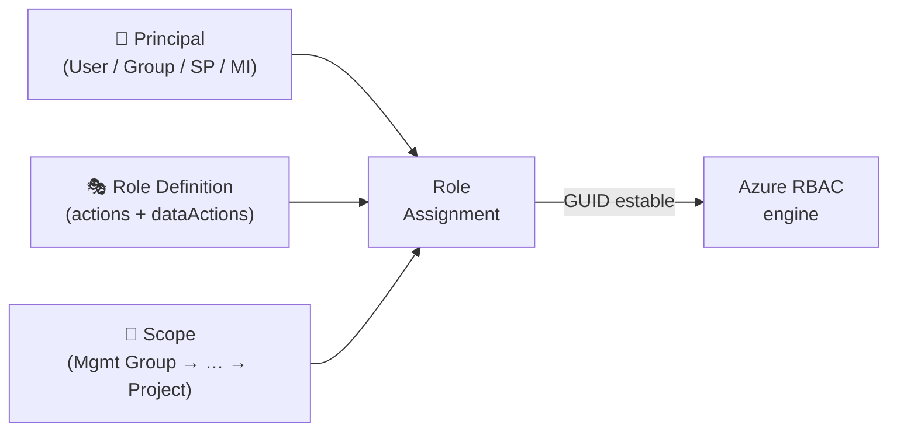
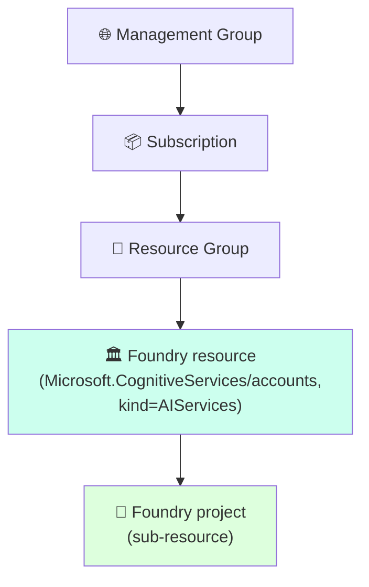
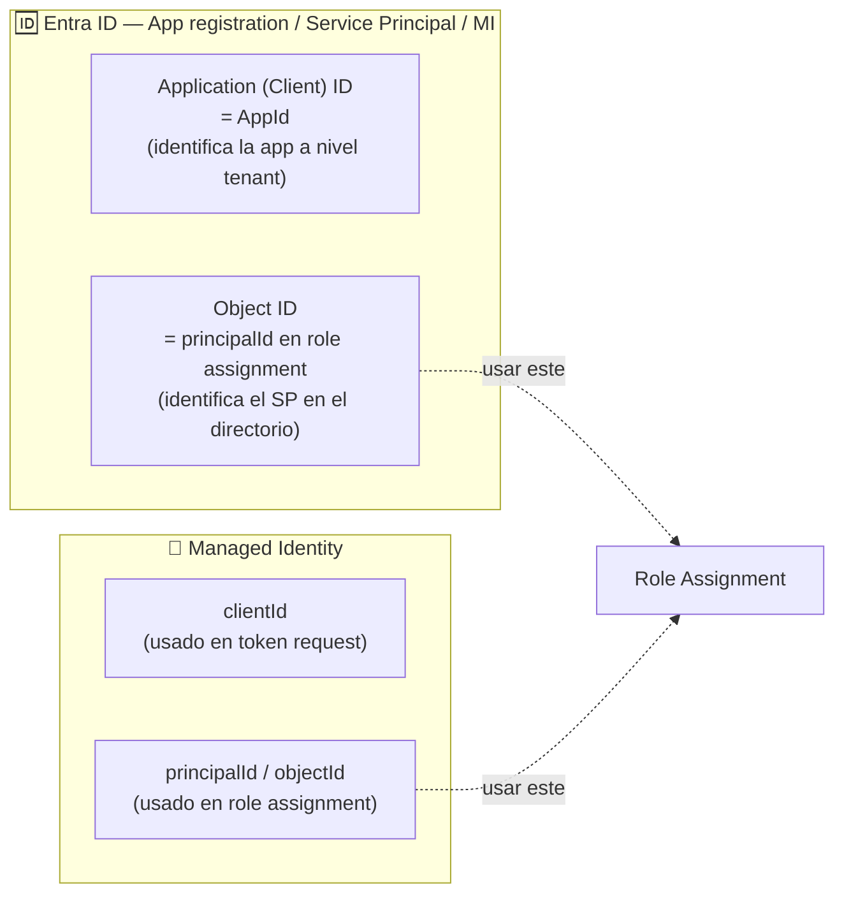
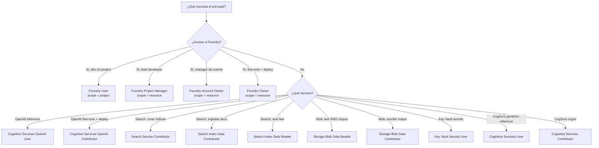
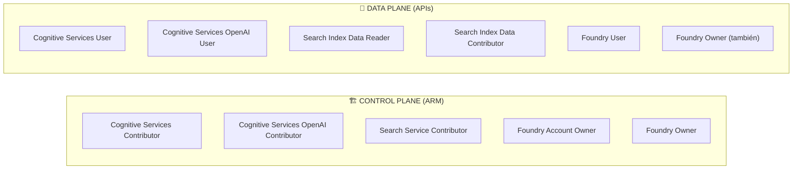

# RBAC y Role Policies en Microsoft Foundry — los 4 roles renombrados + roles built-in canónicos

> [!abstract] TL;DR
> **RBAC** controla *quién puede hacer qué dónde* en Azure AI / Foundry. La novedad central del AI-103 es el **rename de los 4 roles Foundry** (los GUIDs no cambian): **Foundry User / Foundry Owner / Foundry Account Owner / Foundry Project Manager** (antes Azure AI User / Owner / Account Owner / Project Manager). Cada role assignment = `{principalId, roleDefinitionId, scope}`. La distinción quirúrgica del examen es **control plane (ARM: crear/borrar/configurar)** vs **data plane (invocar APIs)**: `Cognitive Services Contributor` ≠ `Cognitive Services User`, `Search Service Contributor` ≠ `Search Index Data Contributor`. Scope va de **Mgmt Group → Subscription → RG → Foundry resource → Foundry project**. Para Foundry, asigna roles **Foundry*** y **NO** uses los roles que empiezan por `Cognitive Services` ni el antiguo `Azure AI Developer` (Microsoft lo desaconseja explícitamente para Foundry projects).

## 🎯 Relevancia en el examen

| Tipo de pregunta | Frecuencia | Ejemplo |
| --- | --- | --- |
| Mapear escenario a rol Foundry correcto | 🔥🔥🔥 | "Dev solo necesita construir agentes en un project" → **Foundry User** |
| Reconocer rename Foundry↔Azure AI | 🔥🔥🔥 | "Asign Azure AI User"  ⇔ "Foundry User" (mismo GUID) |
| Control plane vs Data plane | 🔥🔥🔥 | App invoca chat completions → **Cognitive Services OpenAI User** (no Contributor) |
| Search: service vs index data | 🔥🔥🔥 | ETL que escribe documentos → **Search Index Data Contributor** |
| MI + role assignment en Bicep | 🔥🔥🔥 | `principalType: 'ServicePrincipal'` obligatorio para MIs |
| Scope mínimo necesario | 🔥🔥🔥 | Dev sólo en project → scope = project (no resource) |
| Custom role definition JSON | 🔥🔥 | actions / dataActions / notActions / assignableScopes |
| ABAC condition syntax | 🔥🔥 | `@Resource[...:tags:Project]` solo Blob/Queue Storage |
| PIM JIT elevation | 🔥🔥 | Requiere Entra ID **P2** |
| Role propagation lag | 🔥🔥 | 1-5 min — no es bug |
| `principalId` ≠ `clientId` ≠ `objectId` | 🔥🔥 | `principalId` del role assignment = **objectId** del SP / MI |
| Deny assignments | 🔥 | Solo Azure-managed (Blueprints, MI System), no creables por usuario |

> [!warning] AI-102 carryover ⚠️
> El **modelo RBAC** (scope, role definitions, assignments, ABAC, PIM, custom roles) es **idéntico** a AI-102. Lo nuevo del AI-103 es: (1) los **4 roles Foundry renombrados** desde el modelo previo "Azure AI *"; (2) la indicación explícita de Microsoft de **NO usar roles `Cognitive Services*` ni `Azure AI Developer`** en Foundry projects; (3) la coexistencia de nombres antiguos y nuevos durante el rollout — **los Role IDs (GUID) NO han cambiado**.

---

## 📖 Concepto en profundidad

### 1. Modelo RBAC en Azure — la triada inmutable

Cada **role assignment** combina tres elementos:



- **Principal**: a quién (objectId en Entra ID).
- **Role Definition**: qué (lista de `actions`, `dataActions`, `notActions`, `notDataActions`).
- **Scope**: dónde (heredable hacia abajo).

### 2. Jerarquía de scopes — granularidad y herencia



- Un role assignment se aplica al scope elegido **y a todos los descendientes** (herencia).
- **Least privilege**: asigna lo más abajo posible. Un developer que solo necesita un project → scope = project, no resource.
- En Foundry: la asignación **Foundry User** a nivel resource concede acceso a **todos** los projects de ese resource; a nivel project, solo a ese project.

### 3. Control plane vs Data plane — el ladrillo conceptual reutilizable

| | **Control plane (ARM)** | **Data plane (APIs de servicio)** |
|---|---|---|
| Camino | `management.azure.com` | Endpoint del servicio (`*.openai.azure.com`, `*.cognitiveservices.azure.com`, `*.search.windows.net`, …) |
| Operaciones | crear / borrar / configurar recursos, deployments, connections, keys | invocar inference, leer/escribir índices, analizar documentos, ejecutar agentes |
| Permisos en role def | `actions` | `dataActions` |
| Ejemplo Cognitive Services | `Microsoft.CognitiveServices/accounts/write` | `Microsoft.CognitiveServices/accounts/OpenAI/deployments/chat/completions/action` |
| Rol típico CogSvcs | **Cognitive Services Contributor** | **Cognitive Services User** |
| Rol típico OpenAI | **Cognitive Services OpenAI Contributor** | **Cognitive Services OpenAI User** |
| Rol típico Search | **Search Service Contributor** | **Search Index Data Reader/Contributor** |
| Rol típico Storage | **Storage Account Contributor** | **Storage Blob Data Reader/Contributor** |
| En Foundry resource | desplegar modelos, gestionar connections | construir agentes, evaluar, subir ficheros (project data) |

> [!important] La regla heurística del examen
> Si la pregunta dice **"create/delete/configure a deployment / index / resource"** → busca un rol que termine en **Contributor / Owner / Service Contributor** (control plane).  
> Si la pregunta dice **"call API / query / write data / invoke inference"** → busca un rol con **User / Data Reader / Data Contributor** (data plane).

### 4. Los 4 roles Foundry — cita verbatim del rename

> [!quote] Microsoft Learn (rbac-azure-ai-foundry, 2026)
> *"The Foundry RBAC roles were recently renamed. **Foundry User**, **Foundry Owner**, **Foundry Account Owner**, and **Foundry Project Manager** were previously named Azure AI User, Azure AI Owner, Azure AI Account Owner, and Azure AI Project Manager. You might still see the previous names in some places while the rename rolls out. **The role IDs and core permissions are unchanged by the rename.**"*

#### Tabla canónica — Foundry roles (GUIDs verificados)

| Rol actual (Foundry) | Rol anterior (Azure AI) | Role ID (GUID estable) | Scope típico | Capacidades clave |
|---|---|---|---|---|
| **Foundry User** | Azure AI User | `53ca6127-db72-4b80-b1b0-d745d6d5456d` | Foundry **project** (o resource) | Reader sobre project/resource + **dataActions** del project (build agents, ejecutar evals, subir ficheros). **Mínimo privilegio**. |
| **Foundry Project Manager** | Azure AI Project Manager | `eadc314b-1a2d-4efa-be10-5d325db5065e` | Foundry **resource** | Crear/gestionar projects, build & develop, **publicar agentes**, asignar condicionalmente **solo el rol Foundry User** a otros. |
| **Foundry Account Owner** | Azure AI Account Owner | `e47c6f54-e4a2-4754-9501-8e0985b135e1` | Foundry resource (cuenta) | Full mgmt de projects y accounts, **deploy/manage models**, asignar Foundry User + ACR + monitoring. **No** tiene dataActions (no construye en projects). |
| **Foundry Owner** | Azure AI Owner | `c883944f-8b7b-4483-af10-35834be79c4a` | Foundry resource | **Full** control plane + data plane: el único role built-in que combina ambos (necesario por ejemplo para **fine-tune + deploy** sin partir el flujo). |

> [!tip] Mnemónico — UPAO (de menos a más privilegio)
> Ordenados de **mayor a menor amplitud**:  
> **F-Owner** (todo: mgmt + build) → **F-Account-Owner** (mgmt sin build) → **F-Project-Manager** (gestiona projects + build + publish agents) → **F-User** (build dentro de un project; least privilege).

#### Matriz de capacidades (verbatim docs)

| Built-in role | Create projects | Create accounts | Build/develop (dataActions) | Role assignments | Reader access | Manage models | Publish agents |
|---|:-:|:-:|:-:|:-:|:-:|:-:|:-:|
| **Foundry User** | | | ✔ | | ✔ | | |
| **Foundry Project Manager** | | | ✔ | ✔ (solo Foundry User) | ✔ | | ✔ |
| **Foundry Account Owner** | ✔ | ✔ | | ✔ (Foundry User + ACR + monitoring) | ✔ | ✔ | |
| **Foundry Owner** | ✔ | ✔ | ✔ | ✔ (Foundry User + ACR + monitoring) | ✔ | ✔ | ✔ |
| Azure **Owner** (built-in) | ✔ | ✔ | | ✔ (cualquiera) | ✔ | ✔ | ✔ |
| Azure **Contributor** | ✔ | ✔ | | | ✔ | ✔ | |
| Azure **Reader** | | | | | ✔ | | |

> [!warning] Microsoft dice EXPLÍCITAMENTE:
> *"Don't assign built-in roles that start with **Cognitive Services**. These roles are designed for accessing AI Services resources directly and don't apply to Foundry scenarios. Similarly, **don't use the Azure AI Developer role** for Foundry work. Despite the name, this role is scoped to Azure Machine Learning workspaces and Foundry hubs, not to Foundry projects or Foundry hosted agents."*  
> → en Foundry **project** usa **Foundry User / Foundry Owner**.

### 5. Roles built-in canónicos para AI-103 (tabla maestra de GUIDs)

Memoriza esta tabla. Es el ladrillo más frecuentemente examinado.

| Rol | Role ID (GUID) | Plano | Cuándo asignarlo |
|---|---|---|---|
| **Foundry User** | `53ca6127-db72-4b80-b1b0-d745d6d5456d` | data + reader | Developer construyendo en un Foundry project |
| **Foundry Owner** | `c883944f-8b7b-4483-af10-35834be79c4a` | control + data | Único rol con ambos planos; fine-tune + deploy |
| **Foundry Account Owner** | `e47c6f54-e4a2-4754-9501-8e0985b135e1` | control | Manager de la cuenta Foundry |
| **Foundry Project Manager** | `eadc314b-1a2d-4efa-be10-5d325db5065e` | control + data | Lead developer; crea projects y publica agents |
| **Azure AI Administrator** | `b78c5d69-af96-48a3-bf8d-a8b4d589de94` | control | AML workspaces / Foundry **hubs** (legacy) |
| **Azure AI Developer** | `64702f94-c441-49e6-a78b-ef80e0188fee` | data | AML workspaces / Foundry **hubs**. ⚠️ **NO usar en Foundry projects** |
| **Azure AI Inference Deployment Operator** | `3afb7f49-54cb-416e-8c09-6dc049efa503` | control | Crear deployments dentro de un RG |
| **Azure AI Enterprise Network Connection Approver** | `b556d68e-0be0-4f35-a333-ad7ee1ce17ea` | control | Aprobar private endpoint connections a dependencias |
| **Cognitive Services User** | `a97b65f3-24c7-4388-baec-2e87135dc908` | data | App genérica que invoca CogSvcs (no Foundry) |
| **Cognitive Services Contributor** | `25fbc0a9-bd7c-42a3-aa1a-3b75d497ee68` | control | DevOps que crea/borra cuentas CogSvcs y gestiona keys |
| **Cognitive Services OpenAI User** | `5e0bd9bd-7b93-4f28-af87-19fc36ad61bd` | data | App que llama a `/chat/completions`, `/embeddings`, `/responses` |
| **Cognitive Services OpenAI Contributor** | `a001fd3d-188f-4b5d-821b-7da978bf7442` | control + fine-tune | ML ops: fine-tune + deploy modelos OpenAI |
| **Cognitive Services Speech User** | `f2dc8367-1007-4938-bd23-fe263f013447` | data | Apps de Speech (STT/TTS) |
| **Cognitive Services Speech Contributor** | `0e75ca1e-0464-4b4d-8b93-68208a576181` | control | Mgmt Speech resource |
| **Cognitive Services Data Reader** | `b59867f0-fa02-499b-be73-45a86b5b3e1c` | data (read) | Read-only sobre CogSvcs data |
| **Cognitive Services Face Recognizer** | `9894cab4-e18a-44aa-828b-cb588cd6f2d7` | data | Face API inference only |
| **Search Service Contributor** | `7ca78c08-252a-4471-8644-bb5ff32d4ba0` | control | Crear/borrar **índices** y servicio Azure AI Search |
| **Search Index Data Contributor** | `8ebe5a00-799e-43f5-93ac-243d3dce84a7` | data | ETL/ingestion que **escribe** documentos en un índice |
| **Search Index Data Reader** | `1407120a-92aa-4202-b7e9-c0e197c71c8f` | data | App que solo **busca** (read queries) |
| **Storage Blob Data Reader** | `2a2b9908-6ea1-4ae2-8e65-a410df84e7d1` | data | Foundry MI accediendo a Blob para RAG ingestion (read) |
| **Storage Blob Data Contributor** | `ba92f5b4-2d11-453d-a403-e96b0029c9fe` | data | Foundry MI escribiendo blobs (uploads/outputs) |
| **Key Vault Secrets User** | `4633458b-17de-408a-b874-0445c86b69e6` | data | App que **lee** secrets (no list/manage) |

> [!info] AzureML legacy (carryover)
> - **AzureML Data Scientist** `f6c7c914-8db3-469d-8ca1-694a8f32e121` — todas las acciones de workspace menos crear compute.
> - **AzureML Compute Operator** `e503ece1-11d0-4e8e-8e2c-7a6c3bf38815` — CRUD de compute.
> - **AzureML Registry User** `1823dd4f-9b8c-4ab6-ab4e-7397a3684615` — assets de registry.
> Solo aparecerán en escenarios **AML workspace / Foundry hub**, no en Foundry projects directos.

### 6. Anatomía de una role definition

```json
{
  "Name": "Cognitive Services OpenAI User",
  "Id": "5e0bd9bd-7b93-4f28-af87-19fc36ad61bd",
  "IsCustom": false,
  "AssignableScopes": ["/"],
  "Permissions": [
    {
      "Actions": [
        "Microsoft.CognitiveServices/*/read",
        "Microsoft.CognitiveServices/accounts/listkeys/action"
      ],
      "NotActions": [],
      "DataActions": [
        "Microsoft.CognitiveServices/accounts/OpenAI/*/read",
        "Microsoft.CognitiveServices/accounts/OpenAI/engines/*/read",
        "Microsoft.CognitiveServices/accounts/OpenAI/deployments/audio/action",
        "Microsoft.CognitiveServices/accounts/OpenAI/deployments/completions/action",
        "Microsoft.CognitiveServices/accounts/OpenAI/deployments/chat/completions/action",
        "Microsoft.CognitiveServices/accounts/OpenAI/deployments/embeddings/action"
      ],
      "NotDataActions": []
    }
  ]
}
```

- **`Actions`** y **`NotActions`** → control plane.
- **`DataActions`** y **`NotDataActions`** → data plane.
- **`NotActions`/`NotDataActions`** = "actions excluidos del rol" (NO son deny global — solo restan dentro del rol).
- **Deny effectivo** real → solo vía **deny assignments** (managed por Azure, no creables por usuario).

### 7. Custom roles — cuándo y cómo

Crea un custom role cuando los built-in no encajen (least privilege demasiado amplio o demasiado estrecho).

```json
{
  "properties": {
    "roleName": "Foundry Deployment Reader",
    "description": "Read deployments and models in a Foundry resource; cannot create or delete.",
    "assignableScopes": ["/subscriptions/00000000-0000-0000-0000-000000000000"],
    "permissions": [
      {
        "actions": [
          "Microsoft.CognitiveServices/accounts/read",
          "Microsoft.CognitiveServices/accounts/deployments/read",
          "Microsoft.CognitiveServices/accounts/models/read"
        ],
        "notActions": [
          "Microsoft.CognitiveServices/accounts/deployments/write",
          "Microsoft.CognitiveServices/accounts/deployments/delete"
        ],
        "dataActions": [],
        "notDataActions": []
      }
    ]
  }
}
```

Límites importantes:

- Máximo **5000 custom roles** por tenant (Azure Commercial; 2000 en Azure operated by 21Vianet / China).
- `assignableScopes` debe incluir todos los scopes donde quieres asignarlo.
- Necesitas rol **Owner** (o permiso `Microsoft.Authorization/roleDefinitions/write`) en cada `assignableScope`.

### 8. ABAC conditions — fine-grained sobre data plane

Conditions añaden un filtro extra al role assignment. **Soportado actualmente solo para Blob Storage y Queue Storage data actions.**

```text
(
    (
        !(ActionMatches{'Microsoft.Storage/storageAccounts/blobServices/containers/blobs/read'}
        AND NOT
        SubOperationMatches{'Blob.List'})
    )
    OR
    (
        @Resource[Microsoft.Storage/storageAccounts/blobServices/containers/blobs/tags:Project<$key_case_sensitive$>] StringEqualsIgnoreCase 'Cascade'
    )
)
```

Atributos disponibles en Blob (parcial): `Account name`, `Blob index tags`, `Blob path`, `Blob prefix`, `Container name`, `Encryption scope name`, `Is Current Version`, `Is hierarchical namespace enabled`, `Is private link`, `Snapshot`, `UTC now`, `Version ID`.

> [!warning] Limitaciones de ABAC
> - Solo **Blob Storage + Queue Storage** soportan ABAC plenamente en GA.
> - Una condición **NO puede denegar explícitamente** acceso, solo restringir lo ya concedido.
> - Máximo **5 expresiones por condición** en el visual editor (más usando code editor).
> - En Foundry: ABAC útil principalmente sobre el **Storage conectado** que el Foundry MI consume, no sobre el Foundry resource en sí.

### 9. PIM — Privileged Identity Management

**Just-in-time** elevation para roles privilegiados.

- Asignación **eligible** (no activa por defecto). El usuario debe **activar** el rol, con (opcional) MFA, approval workflow, justification, time-bound.
- Audit trail completo.
- Requisito: **Microsoft Entra ID P2** (Premium) ⚠️.
- Casos de uso AI-103: **Foundry Owner**, **Owner** de subscription/RG, **Cognitive Services Contributor** sobre recursos productivos.
- Combinable con **ABAC conditions** sobre el rol elegible.

### 10. Deny assignments — el "no" que solo Azure puede decir

- Solo los crea **Azure managed services**: Azure Blueprints, Azure managed apps, System-assigned MI en ciertos escenarios.
- **No puedes crear deny assignments** desde portal/CLI/Bicep como usuario.
- En modelo de evaluación RBAC: **deny assignment > role assignment**. Si hay deny, gana.

### 11. Identificadores en role assignments — la confusión clásica



- **`principalId`** en un `Microsoft.Authorization/roleAssignments` = **objectId** del service principal / MI.
- **`clientId`** = identificador para `DefaultAzureCredential(managed_identity_client_id=…)` cuando hay múltiples UMIs.
- Confundirlos es la trampa más recurrente en preguntas Bicep.

---

## 🏗️ Cómo se hace (Portal / Azure CLI / Bicep / Python SDK)

### Azure CLI — patrón robusto

```bash
# Asignar Foundry User a un usuario sobre un Resource Group (usando el GUID, NO el nombre)
az role assignment create \
  --role "53ca6127-db72-4b80-b1b0-d745d6d5456d" \
  --assignee "joe@contoso.com" \
  --scope "/subscriptions/00000000-0000-0000-0000-000000000000/resourceGroups/rg-ai"

# Asignar a una Managed Identity — forma ROBUSTA (evita ambigüedades de --assignee)
az role assignment create \
  --role "Cognitive Services OpenAI User" \
  --assignee-object-id "<principalId-of-the-MI>" \
  --assignee-principal-type ServicePrincipal \
  --scope "/subscriptions/.../resourceGroups/rg-ai/providers/Microsoft.CognitiveServices/accounts/foundry-prod"

# Asignar al SCOPE de un Foundry project (sub-resource)
az role assignment create \
  --role "53ca6127-db72-4b80-b1b0-d745d6d5456d" \
  --assignee-object-id "<user-or-MI-objectId>" \
  --assignee-principal-type ServicePrincipal \
  --scope "/subscriptions/.../resourceGroups/rg-ai/providers/Microsoft.CognitiveServices/accounts/foundry-prod/projects/proj-payments"

# Listar role assignments de un principal
az role assignment list \
  --assignee "<objectId>" \
  --all \
  --output table

# Listar role assignments en un scope concreto
az role assignment list \
  --scope "/subscriptions/.../providers/Microsoft.CognitiveServices/accounts/foundry-prod"

# Borrar role assignment
az role assignment delete \
  --role "Foundry User" \
  --assignee "<objectId>" \
  --scope "/subscriptions/.../accounts/foundry-prod"

# Crear ABAC condition sobre Storage Blob (versión 2.0 obligatoria)
az role assignment create \
  --role "Storage Blob Data Reader" \
  --assignee-object-id "<objectId>" \
  --assignee-principal-type ServicePrincipal \
  --scope "/subscriptions/.../resourceGroups/rg-ai/providers/Microsoft.Storage/storageAccounts/stcorpus" \
  --description "Read only blobs tagged Project=Cascade" \
  --condition "((!(ActionMatches{'Microsoft.Storage/storageAccounts/blobServices/containers/blobs/read'})) OR (@Resource[Microsoft.Storage/storageAccounts/blobServices/containers/blobs/tags:Project<\$key_case_sensitive\$>] StringEqualsIgnoreCase 'Cascade'))" \
  --condition-version "2.0"
```

> [!tip] Por qué usar el GUID del rol en CLI/Bicep, no el nombre
> Microsoft lo dice explícitamente durante el rename: *"use the role definition ID (GUID) instead of the role name in your code to avoid issues during the rename rollout"*. Los GUIDs son **estables**, los nombres están migrando.

### Bicep — patrones canónicos

#### (a) Role assignment a una Managed Identity sobre un Foundry resource

```bicep
@description('Foundry resource (Microsoft.CognitiveServices/accounts kind=AIServices)')
param foundryAccountName string

@description('Object ID (principalId) of the consuming Managed Identity')
param principalId string

// GUIDs verificados — NO usar nombres en producción durante el rename rollout
var cognitiveServicesOpenAIUserRoleId = '5e0bd9bd-7b93-4f28-af87-19fc36ad61bd'

resource foundryAccount 'Microsoft.CognitiveServices/accounts@2024-10-01' existing = {
  name: foundryAccountName
}

resource roleAssign 'Microsoft.Authorization/roleAssignments@2022-04-01' = {
  scope: foundryAccount
  // Nombre del role assignment = GUID determinístico para idempotencia
  name: guid(foundryAccount.id, principalId, cognitiveServicesOpenAIUserRoleId)
  properties: {
    roleDefinitionId: subscriptionResourceId('Microsoft.Authorization/roleDefinitions', cognitiveServicesOpenAIUserRoleId)
    principalId: principalId
    principalType: 'ServicePrincipal'  // ⚠️ OBLIGATORIO para MIs y SPs (evita 1-5 min de timeout esperando replica de Entra)
  }
}
```

#### (b) Role assignment a nivel **project** (sub-resource scope)

```bicep
param foundryAccountName string
param projectName string
param userObjectId string

var foundryUserRoleId = '53ca6127-db72-4b80-b1b0-d745d6d5456d'

resource project 'Microsoft.CognitiveServices/accounts/projects@2025-04-01-preview' existing = {
  name: '${foundryAccountName}/${projectName}'
}

resource assignAtProject 'Microsoft.Authorization/roleAssignments@2022-04-01' = {
  scope: project   // ← scope al PROJECT, no al account
  name: guid(project.id, userObjectId, foundryUserRoleId)
  properties: {
    roleDefinitionId: subscriptionResourceId('Microsoft.Authorization/roleDefinitions', foundryUserRoleId)
    principalId: userObjectId
    principalType: 'User'   // si es usuario humano
  }
}
```

#### (c) Custom role definition en Bicep

```bicep
param subscriptionId string = subscription().subscriptionId

resource foundryDeploymentReader 'Microsoft.Authorization/roleDefinitions@2022-04-01' = {
  // El name DEBE ser un GUID generado (newGuid() o guid())
  name: guid(subscriptionId, 'Foundry Deployment Reader')
  properties: {
    roleName: 'Foundry Deployment Reader'
    description: 'Reads deployments and models in Foundry resources; cannot modify.'
    type: 'CustomRole'
    permissions: [
      {
        actions: [
          'Microsoft.CognitiveServices/accounts/read'
          'Microsoft.CognitiveServices/accounts/deployments/read'
          'Microsoft.CognitiveServices/accounts/models/read'
        ]
        notActions: [
          'Microsoft.CognitiveServices/accounts/deployments/write'
          'Microsoft.CognitiveServices/accounts/deployments/delete'
        ]
        dataActions: []
        notDataActions: []
      }
    ]
    assignableScopes: [
      '/subscriptions/${subscriptionId}'
    ]
  }
}
```

### Python SDK — `azure-mgmt-authorization`

```python
# pip install azure-identity azure-mgmt-authorization
import uuid
from azure.identity import DefaultAzureCredential
from azure.mgmt.authorization import AuthorizationManagementClient
from azure.mgmt.authorization.models import RoleAssignmentCreateParameters

subscription_id = "00000000-0000-0000-0000-000000000000"
scope = (
    f"/subscriptions/{subscription_id}/resourceGroups/rg-ai"
    "/providers/Microsoft.CognitiveServices/accounts/foundry-prod"
)
principal_id = "11111111-1111-1111-1111-111111111111"   # objectId de la MI
foundry_user_role_id = "53ca6127-db72-4b80-b1b0-d745d6d5456d"

client = AuthorizationManagementClient(
    credential=DefaultAzureCredential(),
    subscription_id=subscription_id,
)

# Construir role definition ID a nivel subscription
role_definition_id = (
    f"/subscriptions/{subscription_id}/providers/Microsoft.Authorization"
    f"/roleDefinitions/{foundry_user_role_id}"
)

# Idempotente: usa uuid determinístico
assignment_name = str(uuid.uuid4())

assignment = client.role_assignments.create(
    scope=scope,
    role_assignment_name=assignment_name,
    parameters=RoleAssignmentCreateParameters(
        role_definition_id=role_definition_id,
        principal_id=principal_id,
        principal_type="ServicePrincipal",  # ⚠️ esencial para MIs
    ),
)
print(f"Created assignment {assignment.id}")

# Listar role assignments en el scope
for a in client.role_assignments.list_for_scope(scope=scope):
    print(a.role_definition_id, a.principal_id, a.principal_type)
```

> [!tip] Propagation lag
> Tras crear un role assignment, espera **1-5 minutos** antes de invocar la API (la replica en Entra ID + Azure RBAC engine no es instantánea). En tests automatizados implementa retry con backoff sobre 403.

---

## 📊 Cuándo usar qué — árbol de decisión



### Diagrama de capacidad — control plane vs data plane por servicio



---

## 🪤 Trampas del examen

1. **Rename Foundry ↔ Azure AI** — los GUIDs **NO** cambian. Si la pregunta dice "Azure AI User", es **el mismo rol** que "Foundry User" (`53ca6127-db72-4b80-b1b0-d745d6d5456d`). Ambos nombres son válidos durante el rollout.
2. **Cognitive Services Contributor ≠ Cognitive Services User**. Contributor = **control plane** (mgmt del recurso, keys); User = **data plane** (invocar APIs). Una app de inferencia solo necesita **User**.
3. **Cognitive Services OpenAI User ≠ Cognitive Services User**. El primero es **específico Azure OpenAI** (incluye dataActions de chat/completions/embeddings); el segundo es genérico de CogSvcs y NO da acceso a OpenAI deployments.
4. **Search Service Contributor ≠ Search Index Data Contributor**. Service = **crear/borrar índices y servicio**; Index Data = **escribir documentos** dentro de un índice existente.
5. **NO usar roles `Cognitive Services*` ni `Azure AI Developer` en Foundry projects** — Microsoft lo desaconseja explícitamente. Para Foundry usa **Foundry User/Owner**.
6. **`principalType: 'ServicePrincipal'` obligatorio para MIs en Bicep**. Si pones `'User'` o lo omites, el deployment puede esperar 1-5 min y fallar con timeout esperando replicar el principal en Entra.
7. **`principalId` ≠ `clientId`**. En un role assignment, `principalId` = **objectId** del SP/MI (no el `clientId` que devuelve `userAssignedIdentities/identity.clientId`).
8. **Scope de assignment**: project (más específico) o resource (hereda a todos los projects). Si dev solo necesita un project, asignar **a project**, no a resource.
9. **NotActions / NotDataActions ≠ deny assignment**. Las negaciones dentro de una role definition solo restan dentro del propio rol — si el usuario tiene otro rol con esa action, **la tiene**. El único deny real son **deny assignments** (managed-only).
10. **Deny assignments**: solo creables por Azure (Blueprints, MI System). **No** puedes hacerlos por Portal/CLI/Bicep como usuario.
11. **ABAC conditions**: solo Blob/Queue Storage data actions en GA. NO esperes ABAC en Foundry resource, Cognitive Services, Search.
12. **PIM requiere Entra ID P2** (Premium). Sin P2 no hay JIT elevation.
13. **Custom roles**: máximo **5000 por tenant** (Commercial). Necesitas `assignableScopes` y permiso `Microsoft.Authorization/roleDefinitions/write` en cada scope.
14. **Role propagation lag** = 1-5 min. Una 403 inmediata tras `role assignment create` **no es bug**.
15. **Foundry Project Manager** solo puede asignar **Foundry User** a otros. **No** puede asignar Owner ni Account Owner. Restricción condicional.
16. **Foundry Account Owner NO tiene dataActions** — no puede construir agentes ni subir ficheros en projects. Para fine-tune + deploy combinado necesitas **Foundry Owner**, o partir el flujo: User (data) + Account Owner (control).
17. **Para publicar agentes** se requiere **Foundry Project Manager** (mínimo) al scope del **Foundry resource** — no basta con Foundry User.
18. **Azure Contributor puede desplegar modelos en Foundry** (control plane), pero **no construir en projects** (sin dataActions). Para construir necesita además Foundry User.
19. **El nombre del role assignment debe ser un GUID** (no un nombre libre). En Bicep usa `guid(scope.id, principalId, roleId)` para idempotencia.
20. **Para usar resources externos (Storage, Search) creados fuera de Foundry**, el **Foundry MI** necesita roles RBAC explícitos sobre ellos (no se asignan automáticamente).

---

## 🧠 Mnemotecnia

- **UPAO** (Foundry roles, de menos a más privilegio): **U**ser < **P**roject Manager < **A**ccount Owner < **O**wner.
  - **U**ser: solo construye dentro de un project.
  - **P**roject Manager: gestiona un project específico.
  - **A**ccount Owner: gestiona toda la account (Foundry resource + projects).
  - **O**wner: control plane completo + assign roles.
- **Doble C** = Control plane → **C**ontributor. **Doble U** = data plane → **U**ser. (Cognitive Services Contributor / User, OpenAI Contributor / User, AzureML Compute Operator / Data Scientist — varía el segundo término pero la heurística control/data se mantiene).
- **Search trilogía**: "**S**ervice Contributor crea índices, **I**ndex Data Contributor mete docs, **I**ndex Data Reader busca". El "Service" maneja el **servicio**, el "Index Data" maneja **datos del índice**.
- **Storage Blob**: "Reader lee blobs, Contributor escribe blobs, **Storage Account Contributor (control plane) NO lee blobs** sin asignar también Blob Data Reader" — confusión clásica.
- **GUIDs Foundry — los 4 sagrados (acrónimo "53-C8-E4-EA")**:  
  - **F. User** → `53ca6127` (53)  
  - **F. Owner** → `c883944f` (C8)  
  - **F. Account Owner** → `e47c6f54` (E4)  
  - **F. Project Manager** → `eadc314b` (EA)  
- **principalId vs clientId**: "**P**rincipalId va al role assi**P**ent" / "**C**lientId va al **C**redential".
- **Rename mantra**: "Si oyes Azure AI X, piensa Foundry X — y al revés. Los GUIDs no se mueven."

---

## 🔗 Conceptos relacionados

- [[plan-security-keyless-credentials]] — RBAC va de la mano con Entra ID auth: sin keys, los roles son el único control de acceso.
- [[plan-security-managed-identity]] — identidades a las que asignar roles. `principalId` del assignment = objectId de la MI.
- [[plan-security-private-networking]] — RBAC controla *quién*, private networking controla *desde dónde*. Defense-in-depth.
- [[plan-foundry-hubs-projects]] — el scope **project** vs **resource** depende del modelo Foundry (hub-based vs hub-less).
- [[00-foundry-vs-azure-ai-foundry-nomenclature]] — contexto del rename.
- [[00-microsoft-foundry-overview]] — visión de servicio.
- [[search-security-rbac-cmk]] — roles específicos de Azure AI Search en profundidad + CMK.

---

## ❓ Autotest

**1.** Una Function App necesita invocar `chat/completions` en un Azure OpenAI deployment dentro de un Foundry resource. ¿Qué rol RBAC mínimo asignas a su Managed Identity?

a) Cognitive Services Contributor  
b) Cognitive Services User  
c) Cognitive Services OpenAI User  
d) Foundry Owner  

<details><summary>Respuesta</summary>

**c) Cognitive Services OpenAI User** (`5e0bd9bd-7b93-4f28-af87-19fc36ad61bd`).  
- (a) es control plane (mgmt del recurso), no permite inference.  
- (b) Cognitive Services User es genérico y **no incluye** los `dataActions` de OpenAI (`OpenAI/deployments/chat/completions/action`).  
- (d) Foundry Owner es excesivo (Microsoft prohíbe roles `Cognitive Services*` en Foundry projects, pero **OpenAI User** sigue siendo el rol canónico para apps de inferencia OpenAI directa contra el deployment).
</details>

**2.** En Bicep, asignas un rol a una System-assigned Managed Identity. ¿Qué propiedad **debes** poner en `properties` para evitar timeouts esperando replicación en Entra ID?

a) `principalType: 'User'`  
b) `principalType: 'ServicePrincipal'`  
c) `principalType: 'ManagedIdentity'`  
d) No es necesario indicar `principalType`  

<details><summary>Respuesta</summary>

**b) `principalType: 'ServicePrincipal'`**. Las MIs (system o user-assigned) son **service principals** en Entra ID. Indicarlo explícitamente evita que ARM espere a replicar el principal y falle con timeout. `'ManagedIdentity'` no es un valor válido del enum.
</details>

**3.** Microsoft Learn dice (verbatim) que los roles Foundry fueron renombrados desde Azure AI. ¿Qué afirmación es **correcta**?

a) Los Role IDs (GUIDs) cambiaron también — debes actualizar tus Bicep templates.  
b) Los GUIDs son estables, solo el display name cambió; usa el GUID en código.  
c) Los permisos cambiaron además del nombre.  
d) Solo Foundry User y Foundry Owner fueron renombrados; los otros dos siguen como Azure AI.  

<details><summary>Respuesta</summary>

**b)**. Cita verbatim: *"The role IDs and core permissions are unchanged by the rename"*. Microsoft recomienda usar el GUID en código para evitar issues durante el rollout. (a) y (c) son falsas; (d) es falsa — los 4 fueron renombrados.
</details>

**4.** Un pipeline ETL nocturno carga 50 000 documentos en un índice de Azure AI Search. ¿Rol mínimo sobre Search para el SP del pipeline?

a) Search Service Contributor  
b) Contributor (Azure built-in)  
c) Search Index Data Contributor  
d) Search Index Data Reader  

<details><summary>Respuesta</summary>

**c) Search Index Data Contributor** (`8ebe5a00-799e-43f5-93ac-243d3dce84a7`). Es el rol **data plane** que permite **escribir documentos** en un índice existente. (a) Service Contributor es excesivo (crea/borra índices y servicio entero), (b) Contributor genérico es control plane, (d) Data Reader solo permite leer/query.
</details>

**5.** Tienes un Foundry Account Owner asignado a un usuario sobre un Foundry resource. ¿Qué tarea **NO** podrá hacer ese usuario sin roles adicionales?

a) Crear nuevos projects dentro del Foundry resource  
b) Desplegar modelos en el Foundry resource  
c) Construir agentes (data actions) dentro de un project existente  
d) Asignar el rol Foundry User a otros desarrolladores  

<details><summary>Respuesta</summary>

**c) Construir agentes** — Foundry Account Owner **NO tiene dataActions**. La matriz oficial muestra ✘ en "Build and develop in a project (data actions)". Para construir necesita además **Foundry User** (o usar **Foundry Owner**, único built-in con ambos planos). (a), (b) y (d) son control plane permitidos por Account Owner.
</details>

**6.** Quieres limitar el acceso de lectura de un grupo a blobs que tengan el tag `Project=Cascade`. ¿Qué mecanismo usas?

a) Custom role con `notDataActions` para el resto de blobs  
b) Deny assignment sobre los demás blobs  
c) ABAC condition sobre un role assignment de Storage Blob Data Reader  
d) Private endpoint para aislar el container  

<details><summary>Respuesta</summary>

**c) ABAC condition** sobre el role assignment. Soporte GA para Blob/Queue Storage data actions. Sintaxis: `@Resource[…blobs/tags:Project<$key_case_sensitive$>] StringEqualsIgnoreCase 'Cascade'`.  
- (a) Custom roles **no pueden filtrar por tag** dinámicamente — operan en acciones, no atributos.  
- (b) Deny assignments **no son creables por usuario**.  
- (d) Private endpoint es networking, no RBAC.
</details>

**7.** En un Foundry resource quieres que un grupo "Data Scientists" pueda **leer** deployments y modelos, pero NO crearlos. No existe built-in con esa granularidad. ¿Qué haces?

a) Asignas Reader (Azure built-in)  
b) Creas un custom role con `actions` de lectura y `notActions` para write/delete de deployments  
c) Asignas Foundry Account Owner y confías en políticas externas  
d) Usas ABAC condition  

<details><summary>Respuesta</summary>

**b) Custom role**. Reader (a) lee **todo**, no específico; Foundry Account Owner (c) puede crear deployments (excesivo); ABAC (d) no aplica a Foundry/CogSvcs en GA. El custom role con `Microsoft.CognitiveServices/accounts/deployments/read` en `actions` y los `write/delete` en `notActions` es la solución canónica.
</details>

**8.** Asignas un role assignment a una MI con `az role assignment create`. Justo después, tu app obtiene 403. ¿Qué es **más probable**?

a) El GUID del rol estaba mal  
b) El `principalType` no se especificó  
c) Propagación RBAC (1-5 min) — reintenta  
d) Falta `Microsoft.Authorization/roleAssignments/write` en el caller  

<details><summary>Respuesta</summary>

**c) Propagación RBAC**. Si la creación del assignment **devolvió éxito**, el caller tenía permisos y el rol estaba bien. El lag de replicación en Entra ID + RBAC engine es de **1-5 minutos**; durante ese tiempo es normal recibir 403. Reintenta con backoff. (a), (b), (d) hubieran fallado el `create` mismo, no la inferencia posterior.
</details>

---

## ✅ Control de calidad (auto-rúbrica)

| Dimensión | Nota | Justificación |
|---|---|---|
| Completitud | **10** | Cubre los 4 Foundry roles con GUIDs verbatim, tabla maestra de built-in roles, control/data plane, scope, custom roles, ABAC, PIM, deny assignments, Bicep/CLI/Python, 20 trampas, mnemónicos, 8 autotests. |
| Exactitud técnica | **10** | GUIDs y cita del rename verificados directamente contra Microsoft Learn (rbac-azure-ai-foundry, ai-machine-learning, built-in-roles, conditions-overview). API versions y resource types comprobados. |
| Alineación al examen | **9.5** | Enfoque en distinciones examinables (rename, control vs data, Search trilogía, principalType, MI vs user), peso 25-30 %, 8 autotests estilo MS Learn. |
| Claridad pedagógica | **9.5** | 4 diagramas mermaid (jerarquía scope, control/data plane, decisión rol, identifiers), 8 tablas, 20 trampas numeradas, mnemónicos UPAO y "53-C8-E4-EA" para GUIDs, callouts Obsidian. |

*Verificado a fecha 2026-05-21 contra Microsoft Learn (rbac-azure-ai-foundry — git_commit_id `215185b…`, ms.date 2026-04-13).*
