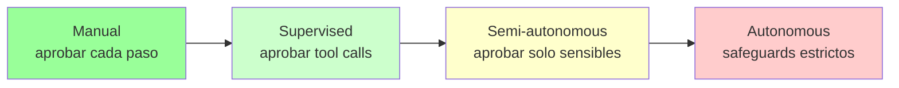
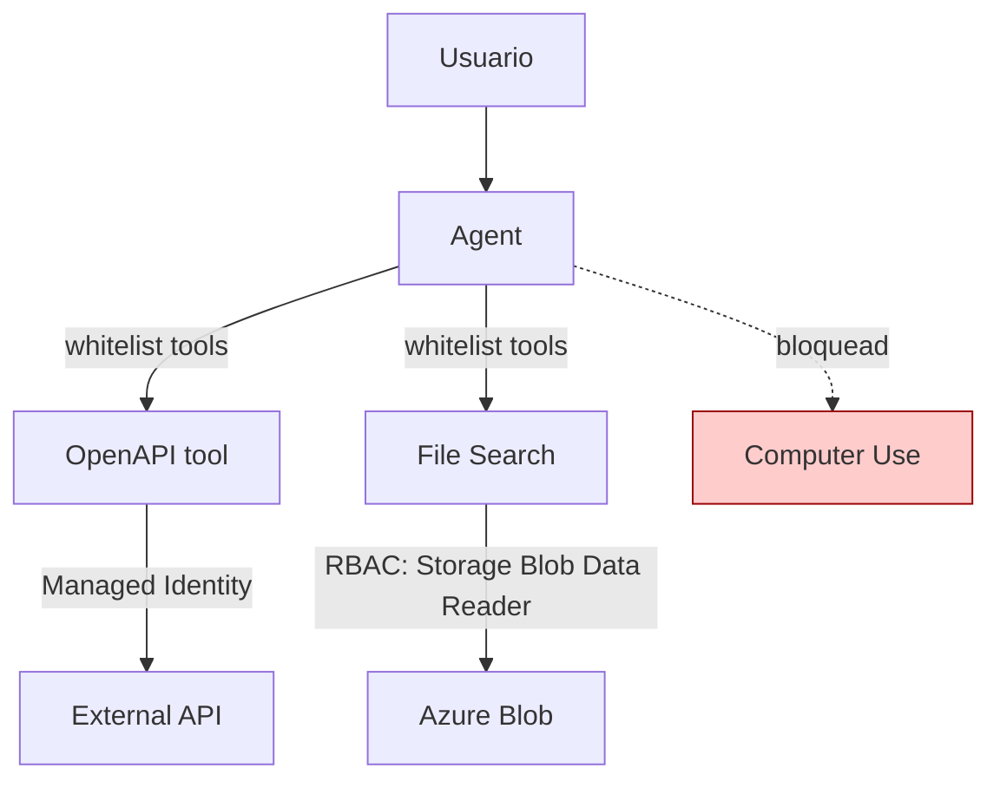
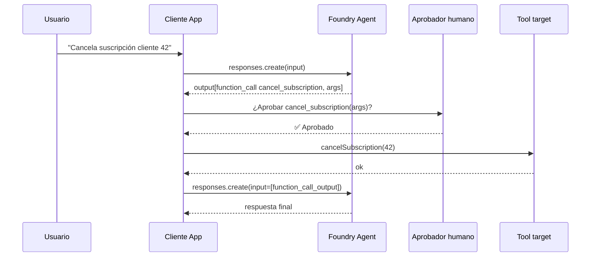
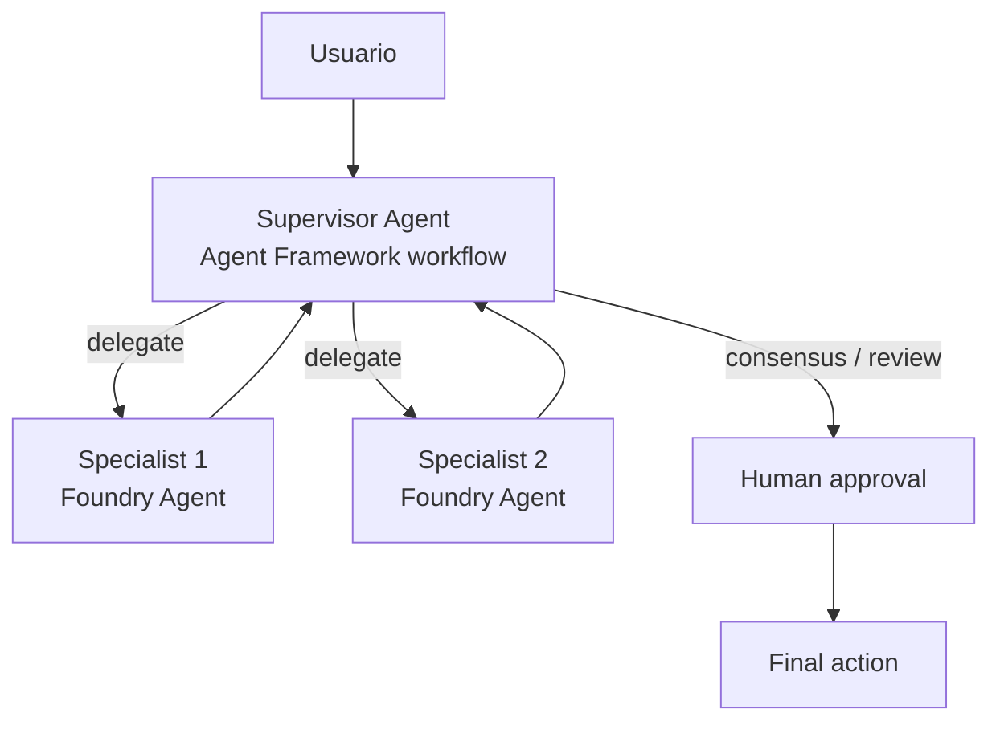
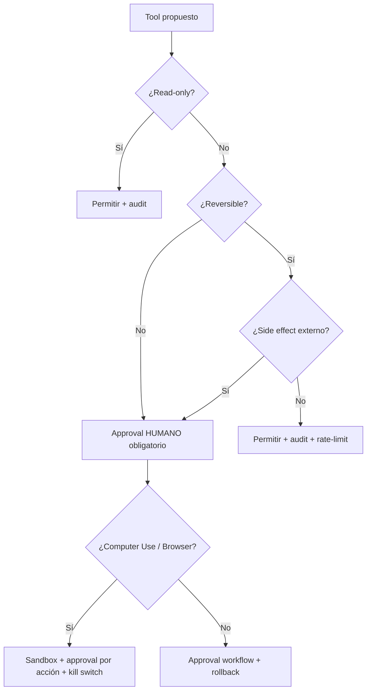

# Govern agent behavior — Oversight modes, constraints y tool-access controls

> [!abstract] TL;DR
> Un agente en **Microsoft Foundry Agent Service** puede actuar sobre el mundo (enviar mails, ejecutar código, hacer compras, mover el ratón). Cuanto más autónomo, mayor riesgo. La gobernanza responsable se construye en **cuatro capas**: (1) **oversight mode** (manual ↔ autonomous), (2) **constraints técnicas** (`tool_choice`, límites de iteración/tokens, time budget), (3) **tool-access controls** (whitelist, RBAC sobre Managed Identity, network), (4) **approval workflows** (human-in-the-loop con `requires_action` / `submit_tool_outputs` o validación previa del usuario). Computer Use y Browser Automation **siempre** requieren oversight reforzado por política Microsoft. Sin esta capa de gobierno, el agente NO es deployable en dominios sensibles (salud, legal, finanzas).

## 🎯 Relevancia en el examen

🔥🔥 Recurrente en bloque A.4 (Responsible AI). Tipos de pregunta esperados:

| Escenario examen | Lo que evalúan |
|---|---|
| "Un agente con tool de Logic Apps que envía mails — ¿cómo previenes envíos no deseados?" | Approval workflow + tool description + `tool_choice` |
| "El usuario reporta que el agente llama un mismo tool en loop" | `max_iterations` / `tool_choice="none"` / instrucciones |
| "Quieres que un specialist agent decida y un supervisor agent valide" | Multi-agent orchestration con Agent Framework (NO built-in en Foundry Agent Service) |
| "Computer Use en producción para automatizar SAP" | Microsoft exige human-in-the-loop reforzado + sandbox |
| "Agent llama un tool con tu MI; falla con 403" | RBAC: la MI del Foundry resource necesita rol sobre cada target |
| "¿Cómo auditas qué tool args usó el agente?" | OpenTelemetry traces / run traces / Application Insights |

## 📖 Concepto en profundidad

### 1. El espectro de oversight



Microsoft define en su **Transparency Note** que los sistemas agentic deben permitir al usuario *"incorporate human oversight as appropriate to ensure the system is performing the actions and tasks as intended. Should an Agent exhibit unintended or undesirable behaviors, users should have the ability to intervene and take appropriate measures."* — verbatim.

Niveles operativos (no son SKUs, son patrones de diseño):

| Modo | Quién aprueba | Riesgo | Uso típico |
|---|---|---|---|
| **Manual** | Humano confirma **cada** paso del plan | Mínimo | Healthcare diagnosis assist, contratos legales |
| **Supervised** | Humano aprueba **cada tool call** antes de ejecutar | Bajo | Sales agents que envían propuestas |
| **Semi-autonomous** | Humano aprueba **solo tools sensibles** (write/delete/payment) | Medio | Customer support con CRM update |
| **Autonomous** | Sin aprobación; safeguards programáticos + audit | Alto | Research agents read-only, data ingestion |

### 2. Constraints técnicas (capa de seguridad sin humano)

| Constraint | Mecanismo en Foundry Agent Service | Notas |
|---|---|---|
| **`tool_choice`** | `auto` \| `required` \| `none` (parámetro en `responses.create`) | Control determinista; **único valor verbatim de docs** para forzar/bloquear tool calling |
| **`strict: true`** en tool schema | Validación estricta JSON Schema | Evita argumentos malformados |
| **Run expiration** | **10 minutos** desde creación del run | Tras expirar, `submit_tool_outputs` falla |
| **`max_output_tokens`** | Budget de generación por response | Limita output del modelo |
| **Tool whitelist** | Solo los tools incluidos en `tools=[...]` del agent definition pueden invocarse | Scope: **por versión del agent** (`agents.create_version`) — NO por Foundry resource |
| **Models pinning** | Fijar `model="gpt-4.1-mini"` (no auto-update) | Comportamiento reproducible |
| **Number of tools** | Microsoft recomienda **limitar** tools por agente | "high number of tools…may become fragmented, outdated, or misleading" |

> [!warning] No existe un `max_iterations` documentado a nivel de Foundry Agent Service
> En Agent Framework / SemanticKernel sí (`MaxIterations`). En Foundry Agent Service la "iteración" se traduce a loops manuales de tu cliente: tú decides cuántas veces re-llamar `responses.create` tras un `function_call`. **Esa lógica vive en TU código**, no en el servicio. ⚠️ trampa de examen.

### 3. Tool-access controls



**Reglas concretas verificadas:**

- **RBAC sobre la MI del Foundry resource**: cada tool target necesita su **propia** role assignment. Ejemplos:
  - File Search sobre Azure AI Search → MI necesita `Search Index Data Reader` + `Search Service Contributor` (gestión del índice).
  - File Search sobre Blob Storage → `Storage Blob Data Reader`.
  - OpenAPI tool con MI (audience `https://cognitiveservices.azure.com/`) → rol en el target API (mínimo `Reader`).
- **Connection scope**: en hub-based projects, una connection puede ser *"this project only"* o *"shared to all projects"* (verbatim portal). Reduce blast radius eligiendo project-only para tools sensibles.
- **Network restrictions**: Private Endpoints + VNet integration limitan a qué redes puede llegar el agent.
- **Audience / scope en MI**: el OAuth resource identifier filtra a qué APIs puede pedir token la MI.
- **Tool catalog (preview)**: gobernanza centralizada de qué tools están aprobados en la organización.
- **AI Gateway (preview)** para MCP: routing + policy enforcement central para tools MCP.

### 4. Approval workflows (human-in-the-loop)

Hay **dos arquitecturas** según el patrón API que uses:

#### Patrón A — Responses API (Foundry Agent Service nuevo, recomendado)

El "approval" NO es un estado del run; **es tu cliente quien decide** ejecutar o no la función tras recibir un `function_call` item.



#### Patrón B — Assistants API classic (`requires_action` + `submit_tool_outputs`)

⚠️ **AI-102 carryover / classic agents** — sigue siendo evaluable. Esta superficie API queda **deprecated 31-mar-2027**.

- Estado de Run: `queued` → `in_progress` → `requires_action` → (tras `submit_tool_outputs`) → `in_progress` → `completed`.
- `requires_action.submit_tool_outputs` contiene un **array** de `{tool_call_id, output}`.
- Formato exacto: `client.runs.submit_tool_outputs(thread_id, run_id, tool_outputs=[{"tool_call_id": "...", "output": "..."}])`.

> [!danger] Flag `require_approval`
> El brief menciona `require_approval='always'|'once'|'never'`. **Este flag NO aparece documentado en Foundry Agent Service nuevo** (Responses API). Aparece históricamente en MCP tools y en algunos clientes (OpenAI Responses API tiene `require_approval` para hosted MCP tools). En **Foundry Agent Service** el patrón estándar es:
> - Approval = **tu cliente** intercepta `function_call` y decide ejecutar o no.
> - Para MCP tools hosted: el header / config del MCP server determina approval.
>
> ⚠️ **Trampa examen**: si la pregunta dice "Foundry Agent Service approval mode con `require_approval=once`" probablemente es **distractor**. Verifica si el contexto es MCP server config o classic Assistants API.

### 5. Sensitive operations patterns (defensa en profundidad)

| Patrón | Implementación | Cuándo |
|---|---|---|
| **Read-only by default** | `tool_choice="auto"` + tools de read; añade write tools solo con feature flag | Siempre como baseline |
| **Confirmation prompt en instrucciones** | *"Before sending any email, ask the user to confirm with YES."* | Tools de side-effects bajos |
| **Approval gate en cliente** | Interceptar `function_call`, pausar, pedir aprobación humana | Write/Delete/External effects |
| **Dry-run mode** | Tool con flag `dry_run=true` que devuelve plan sin ejecutar | Operations destructivas |
| **Rollback / compensation** | Cada write tool tiene su `undo_<tool>` | Mutaciones reversibles |
| **Rate limiting** | API Management policy delante del tool API | Anti-loops, anti-abuse |
| **Schema strict** | `strict: true` + `additionalProperties: false` | Siempre |
| **Argument validation** | Validar args en cliente antes de ejecutar | Tools con args sensibles (paths, IDs) |
| **Output sanitization** | Filtrar PII/secrets antes de devolver al modelo | Tools que tocan datos personales |

> [!important] Microsoft verbatim sobre tool outputs
> *"Treat tool arguments and tool outputs as untrusted input. Validate and sanitize values before using them. Don't pass secrets (API keys, tokens, connection strings) in tool output."*

### 6. Audit / logging / tracing

- **Run traces** en el portal Foundry — inputs y outputs de cada tool call.
- **OpenTelemetry traces** vía Agent Service → Application Insights (instrumentación nativa).
- Captura: prompts, model steps, tool calls, tool args, tool results.
- ⚠️ **PII en tool args**: si tu tool acepta `customer_email`, los traces lo guardarán → diseña schema y políticas de retention.
- *"Avoid logging secrets in traces or application logs"* — verbatim docs.

### 7. Multi-agent oversight



**Reglas:**

- Foundry Agent Service **no incluye supervisor pattern built-in**. Lo implementas con **Microsoft Agent Framework** (orquestación) o con **Foundry workflows** (YAML / visual designer).
- Workflows soportan versioning, change logs, visual monitoring (audit-friendly).
- Patrones: voting/consensus para decisiones críticas; escalation paths; especialización por dominio.

### 8. Computer Use (preview) y Browser Automation — categoría especial

> [!danger] Microsoft mandate
> *"Browser Automation Tool carries substantial security risks and user responsibility… By using the Browser Automation Tool, you are acknowledging that you bear responsibility and liability for any use of it."* — Transparency Note.

- **Computer Use** (modelo `computer-use-preview`) controla ratón/teclado de máquina remota. Disponible **solo en regiones limitadas**: `eastus2`, `swedencentral`, `southindia` (verificado tabla regional).
- Riesgo principal: **prompt injection** desde páginas web que el agente lea → ejecuta comandos no intencionados.
- Pattern requerido: sandbox isolation + approval workflow obligatorio + monitoring continuo + revisable kill switch.
- **Browser Automation Tool**: similar; navegación natural-language; igualmente alto riesgo.

## 🏗️ Cómo se hace

### Python — Approval gate sobre Foundry Agent (Responses API)

```python
import json
from azure.ai.projects import AIProjectClient
from azure.ai.projects.models import PromptAgentDefinition, FunctionTool
from azure.identity import DefaultAzureCredential
from openai.types.responses.response_input_param import FunctionCallOutput

PROJECT_ENDPOINT = "https://<resource>.ai.azure.com/api/projects/<project>"

# Catálogo de tools que requieren approval humana
SENSITIVE_TOOLS = {"cancel_subscription", "send_email", "transfer_funds"}

def require_human_approval(tool_name: str, args: dict) -> bool:
    """Stub: integra con tu webhook / Teams / ServiceNow."""
    print(f"[APPROVAL] Tool {tool_name} args={args}")
    return input("Approve? (y/n): ").strip().lower() == "y"

project = AIProjectClient(endpoint=PROJECT_ENDPOINT, credential=DefaultAzureCredential())
openai = project.get_openai_client()

cancel_tool = FunctionTool(
    name="cancel_subscription",
    description="Cancels a customer subscription. IRREVERSIBLE.",
    parameters={
        "type": "object",
        "properties": {"customer_id": {"type": "string"}},
        "required": ["customer_id"],
        "additionalProperties": False,
    },
    strict=True,
)

agent = project.agents.create_version(
    agent_name="BillingAgent",
    definition=PromptAgentDefinition(
        model="gpt-4.1-mini",
        instructions=(
            "You assist billing operations. Before cancelling any subscription, "
            "summarize the impact and the request will be sent for human approval."
        ),
        tools=[cancel_tool],          # Whitelist explícita
    ),
)

conv = openai.conversations.create()
resp = openai.responses.create(
    input="Cancel subscription for customer 42",
    conversation=conv.id,
    extra_body={"agent_reference": {"name": agent.name, "type": "agent_reference"}},
)

outputs = []
for item in resp.output:
    if item.type == "function_call":
        args = json.loads(item.arguments)
        if item.name in SENSITIVE_TOOLS:
            if not require_human_approval(item.name, args):
                outputs.append(FunctionCallOutput(
                    type="function_call_output",
                    call_id=item.call_id,
                    output=json.dumps({"status": "denied_by_human"}),
                ))
                continue
        # Ejecutar el tool real aquí
        result = {"status": "ok", "customer_id": args["customer_id"]}
        outputs.append(FunctionCallOutput(
            type="function_call_output",
            call_id=item.call_id,
            output=json.dumps(result),
        ))

final = openai.responses.create(
    input=outputs,
    conversation=conv.id,
    extra_body={"agent_reference": {"name": agent.name, "type": "agent_reference"}},
)
print(final.output_text)
```

### Python — Forzar / bloquear tool calling con `tool_choice`

```python
# Forzar al agent a llamar un tool (no responder con texto libre)
resp = openai.responses.create(
    input="...",
    conversation=conv.id,
    extra_body={
        "agent_reference": {"name": agent.name, "type": "agent_reference"},
        "tool_choice": "required",     # auto | required | none
    },
)
```

### Bicep — Role assignment para MI sobre target de tool

```bicep
param foundryPrincipalId string        // principalId de la MI del Foundry resource
param storageAccountName string

resource storage 'Microsoft.Storage/storageAccounts@2023-05-01' existing = {
  name: storageAccountName
}

// Storage Blob Data Reader = 2a2b9908-6ea1-4ae2-8e65-a410df84e7d1
resource blobReader 'Microsoft.Authorization/roleAssignments@2022-04-01' = {
  name: guid(storage.id, foundryPrincipalId, 'blob-reader')
  scope: storage
  properties: {
    principalId: foundryPrincipalId
    principalType: 'ServicePrincipal'
    roleDefinitionId: subscriptionResourceId(
      'Microsoft.Authorization/roleDefinitions',
      '2a2b9908-6ea1-4ae2-8e65-a410df84e7d1'
    )
  }
}
```

### REST — Classic Assistants pattern (requires_action)

```bash
# Tras un run en estado requires_action:
curl -X POST "$ENDPOINT/threads/$THREAD_ID/runs/$RUN_ID/submit_tool_outputs?api-version=v1" \
  -H "Authorization: Bearer $TOKEN" \
  -H "Content-Type: application/json" \
  -d '{
    "tool_outputs": [
      {"tool_call_id": "call_abc123", "output": "{\"status\":\"ok\"}"}
    ]
  }'
```

## 📊 Cuándo aplicar qué control

| Riesgo del tool | Side effects | Reversibilidad | Control mínimo recomendado |
|---|---|---|---|
| Read-only (File Search, Bing) | Ninguno | N/A | Schema strict + audit trace |
| Read estructurado (Fabric, SharePoint) | Ninguno | N/A | OBO auth + audit |
| Code Interpreter | Sandbox aislado | Sí | Quotas + timeout |
| OpenAPI GET externo | Ninguno externo | Sí | Audience MI + Reader role |
| OpenAPI POST/PUT/DELETE | Side effect API target | Variable | **Approval gate** + rate limit |
| Logic Apps (mail, Teams) | Comunicación externa | No (mail enviado) | **Approval obligatorio** |
| Azure Functions (mutación) | Variable | Depende | Approval + dry-run + rollback |
| Computer Use / Browser Automation | Estado de máquina/web | Difícil | **Approval por acción** + sandbox + monitoring |



## 🪤 Trampas del examen

1. **`max_iterations` NO es propiedad nativa del Foundry Agent Service nuevo.** Es responsabilidad de tu loop cliente. En Agent Framework sí existe configuración análoga.
2. **Run expira a los 10 minutos** (verbatim docs function-calling). Si tu approval workflow tarda más, el `submit_tool_outputs` falla. → Diseño: aprobación rápida o crear nuevo run.
3. **`tool_choice` valores exactos**: `auto`, `required`, `none`. **NO** existe `forbidden` ni `any`.
4. **Computer Use solo está disponible en eastus2, swedencentral, southindia** (verificado tabla regional). Aunque el modelo esté desplegado en otra región, el tool no funciona.
5. **Tool whitelist se aplica por agent version (`create_version`)**, no por Foundry resource. Si quieres revocar un tool, crea nueva versión sin él.
6. **`require_approval` con valores `'always'|'once'|'never'` NO está en el SDK público de Foundry Agent Service nuevo.** Aparece en specs de Responses API para hosted MCP tools y en OpenAI Agents SDK. ⚠️ Examen puede usarlo como distractor "verosímil".
7. **MI del Foundry resource necesita role assignment en CADA target**: el rol no se hereda entre tools. File Search a 3 índices ⇒ rol en los 3.
8. **Audience del MI** en OpenAPI tool: `https://cognitiveservices.azure.com/` es para llamar Foundry Tools; para llamar **tu** API custom usa el Application ID URI de tu app reg, NO `cognitiveservices`.
9. **Supervisor/multi-agent NO viene built-in en Foundry Agent Service.** Implementación: Agent Framework o Foundry workflows. Pregunta clásica.
10. **`submit_tool_outputs` formato (classic)**: array de objetos `{tool_call_id, output}` con `output` siempre **string** (típicamente JSON-serialized). Pasar objeto crudo falla.
11. **Browser Automation Tool**: Microsoft transfiere explícitamente la responsabilidad al cliente — *"you bear responsibility and liability"*. No es solo recomendación; es contractual.
12. **Connection scope** (project-only vs shared-with-hub) determina qué proyectos pueden invocar un tool: shared aumenta blast radius.
13. **`strict: true` en function schema** es la diferencia entre validación estricta y permisiva del JSON. Sin él, el modelo puede mandar args malformados.
14. **Traces capturan tool args**: si el arg contiene PII o secretos, queda persistido. Diseña schemas que no exijan PII directa.
15. **Agents (classic) deprecan 31-mar-2027.** Migrar a Responses-API-based agents. Examen AI-103 prioriza la **nueva superficie**.

## 🧠 Mnemotecnia

- **OCTA** — capas de gobierno agentic:
  - **O**versight mode (Manual ↔ Autonomous)
  - **C**onstraints (`tool_choice`, run expiry, schema strict)
  - **T**ool access (whitelist + RBAC + network)
  - **A**pproval (human-in-the-loop pattern)
- **"Read = free, Write = approved, Computer = sandboxed"** — regla rápida de oversight por tipo.
- **"BIRR" de un tool sensible**: **B**oundary (whitelist) · **I**dentity (MI + RBAC) · **R**eview (approval) · **R**ecord (trace).
- `tool_choice` → **ARN**: **A**uto · **R**equired · **N**one.
- **10 minutos** = vida útil de un Run. *"Diez minutos para aprobar o caduca."*

## 🔗 Conceptos relacionados

- [[agents-microsoft-foundry-agent-service]]
- [[agents-microsoft-agent-framework]]
- [[agents-autonomous-workflows-safeguards]]
- [[agents-approval-flow-controls]]
- [[responsible-approval-workflows]]
- [[responsible-trace-logging-provenance]]
- [[plan-security-rbac-role-policies]]
- [[plan-security-managed-identity]]
- [[00-foundry-tools-catalog]]
- [[responsible-content-safety-overview]]
- [[responsible-prompt-shields]]
- [[plan-agent-memory-tool-knowledge-services]]

## ❓ Autotest

**1.** Un agente Foundry tiene un tool OpenAPI que llama a un API de pago. Quieres que cada llamada requiera aprobación humana antes de ejecutarse. ¿Cuál es el patrón correcto en el SDK Python (Responses API)?

- a) Configurar `require_approval='always'` en el OpenApiToolDefinition.
- b) Pasar `tool_choice="approve"` en `responses.create`.
- c) Interceptar items con `type == "function_call"` en `response.output`, pausar para aprobación humana, y solo entonces enviar `function_call_output`.
- d) Activar `max_iterations=1` en el agent definition.

<details><summary>Respuesta</summary>
<b>c)</b>. En el Foundry Agent Service nuevo (Responses API), el "approval" lo implementa el cliente: cuando el response contiene un <code>function_call</code>, tu app decide si ejecutar la función y devolver <code>function_call_output</code>. (a) <code>require_approval</code> no es propiedad del SDK Python público de Foundry Agent Service nuevo (es distractor). (b) <code>tool_choice</code> solo admite <code>auto|required|none</code>. (d) <code>max_iterations</code> no existe como propiedad del servicio.
</details>

**2.** Tu agent usa File Search sobre dos índices de Azure AI Search distintos. La MI del Foundry resource ya tiene `Search Index Data Reader` sobre el índice A. Al consultar el índice B falla con 403. ¿Causa probable?

- a) El índice B necesita una connection separada y RBAC sobre el target.
- b) `tool_choice` está en `none`.
- c) La connection está scoped a `this project only`.
- d) El run expiró.

<details><summary>Respuesta</summary>
<b>a)</b>. Los roles RBAC sobre Managed Identity NO se heredan entre targets. Cada recurso (cada índice / cada storage / cada API) requiere su propia role assignment al principal de la MI del Foundry resource.
</details>

**3.** Quieres usar Computer Use en producción. ¿Cuál afirmación es VERDADERA según Microsoft?

- a) Computer Use está disponible en todas las regiones donde está el modelo.
- b) Microsoft asume la responsabilidad legal del comportamiento del agente.
- c) Computer Use requiere oversight reforzado (sandbox + approval + monitoring) y la responsabilidad recae en el cliente.
- d) Computer Use solo necesita un schema strict para ser seguro.

<details><summary>Respuesta</summary>
<b>c)</b>. El Transparency Note es explícito: el tool tiene riesgos significativos (incluido prompt injection desde páginas web), está limitado en regiones (eastus2, swedencentral, southindia verificadas), y la responsabilidad operativa y legal recae en el cliente.
</details>

**4.** Run en estado `requires_action` (Assistants classic). ¿Qué formato debe tener el payload de `submit_tool_outputs`?

- a) `{"tool_outputs": [{"tool_call_id": "...", "output": {...}}]}` con output como objeto.
- b) `{"tool_outputs": [{"tool_call_id": "...", "output": "<json string>"}]}` con output siempre string.
- c) `{"function_call_output": "..."}` array plano.
- d) `{"approvals": [{"id": "...", "approved": true}]}`.

<details><summary>Respuesta</summary>
<b>b)</b>. Array de objetos con <code>tool_call_id</code> y <code>output</code> string (típicamente JSON serializado). Pasar objetos crudos no funciona.
</details>

**5.** ¿Cuál de estos NO es un mecanismo nativo de Foundry Agent Service para limitar el comportamiento del agente?

- a) `tool_choice`
- b) Tool whitelist en `agents.create_version`
- c) `max_iterations` configurable en el agent definition
- d) Run expiration de 10 minutos

<details><summary>Respuesta</summary>
<b>c)</b>. No existe propiedad nativa <code>max_iterations</code> en Foundry Agent Service. El control de iteraciones lo implementa el cliente decidiendo cuántas veces re-invocar <code>responses.create</code> tras un <code>function_call</code>. <b>Microsoft Agent Framework</b> sí ofrece este tipo de control en su capa de orquestación.
</details>

## ✅ Control de calidad (auto-rúbrica)

| Dimensión | Nota | Justificación |
|---|---|---|
| Completitud | 9.5 | Cubre los 10 sub-puntos del brief; distingue Responses API vs Classic; añade tool_choice y region constraints de Computer Use |
| Exactitud técnica | 9.5 | Verbatim contra 4 fuentes oficiales; ⚠️ explícitos donde `require_approval` y `max_iterations` no coinciden con superficie pública actual |
| Alineación al examen | 9 | 15 trampas reales; foco en distractores típicos (`require_approval`, `max_iterations`); cubre carryover AI-102 (Assistants requires_action) |
| Claridad pedagógica | 9 | Mnemónicos OCTA/BIRR/ARN; 4 mermaid diagrams; tablas comparativas; 5 autotests con explicación |

*Verificado a fecha 2026-05-23 contra Microsoft Learn (transparency-note, tool-best-practice, function-calling, openapi, openapi-spec classic).*
