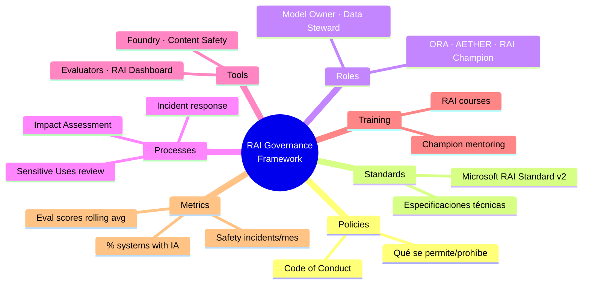
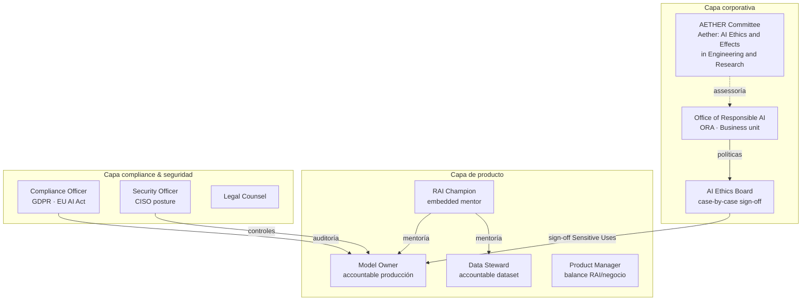
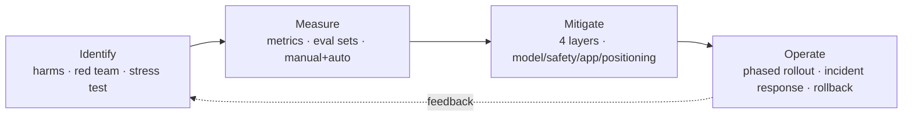
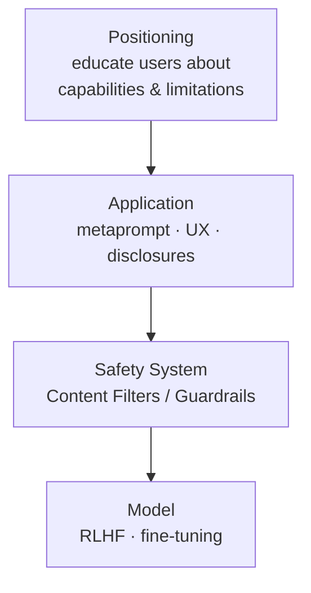

# Responsible AI Governance Framework (Diseño del marco)

> [!warning] AI-102 ONLY — Carryover
> Este tema **pertenece exclusivamente al temario AI-102** (sub-punto verbatim: *"Design a responsible AI governance framework"*). El sucesor **AI-103** **no examina** explícitamente el diseño del marco de gobernanza como objetivo evaluable: AI-103 ha desplazado el énfasis a la **operacionalización** (Content Safety, evaluators, prompt shields, approval workflows, trace/logging). Estudiar a nivel conceptual; **no profundizar** si solo te presentas a AI-103.

> [!abstract] TL;DR
> Un **Responsible AI Governance Framework** es la combinación de **políticas + estándares + roles + procesos + herramientas + formación + métricas** que aseguran que toda solución AI cumpla los **seis principios de Microsoft RAI** (Fairness, Reliability & safety, Privacy & security, Inclusiveness, Transparency, Accountability) durante todo el lifecycle. Microsoft lo articula en su **Responsible AI Standard v2** (interno, público como PDF) y lo operacionaliza con el ciclo **Identify → Measure → Mitigate → Operate** (alineado con **NIST AI RMF**: Govern, Map, Measure, Manage). El órgano corporativo es la **Office of Responsible AI (ORA)** + comité **AETHER** + **RAI Champions** embebidos en producto. Casos críticos disparan una **Sensitive Uses review** obligatoria.

## 🎯 Relevancia en el examen

| Aspecto | Frecuencia AI-102 | Frecuencia AI-103 |
|---|---|---|
| Identificar componentes de un marco RAI | 🔥🔥 | ❌ |
| Mapear principios MS RAI → tooling Azure | 🔥🔥🔥 | 🔥 (carryover suave) |
| Ciclo Identify/Measure/Mitigate/Operate | 🔥🔥 | 🔥🔥 (operacionalizado) |
| Sensitive Uses (cuándo escalar a ORA) | 🔥 | ❌ |
| Impact Assessment requirements | 🔥🔥 | ❌ |
| Alineación NIST AI RMF | 🔥 | 🔥 |

Tipos de pregunta típicos AI-102: **case study** donde describen una solución y preguntan "¿qué rol responsable RAI debería revisarla antes de producción?", "¿qué fase del lifecycle aplica?", "¿qué principio se viola?".

## 📖 Concepto en profundidad

### 1. Definición precisa

Un **RAI Governance Framework** es la **estructura organizativa + procesos + políticas + tooling** que asegura el cumplimiento de los principios de Responsible AI **a lo largo de todo el ciclo de vida** de cualquier sistema AI dentro de una organización. No es una herramienta; es la **capa institucional** que envuelve a las herramientas (Content Safety, evaluators, RAI dashboard…).

### 2. Los 6 componentes core (memorízalos)



| Componente | Descripción | Artefacto típico |
|---|---|---|
| **Policies** | Documentos formales que prohíben o autorizan usos. | Acceptable Use Policy, Code of Conduct. |
| **Standards** | Especificaciones técnicas obligatorias. | "Todo modelo en prod pasa Content Filter ≥ Medium". |
| **Roles** | Stakeholders con responsabilidades RACI claras. | RACI matrix por sistema. |
| **Processes** | Workflows operativos. | Impact Assessment, Sensitive Uses review, Incident Response Plan. |
| **Tools** | Plataforma técnica que materializa los estándares. | Azure AI Content Safety, Foundry evaluators, RAI Dashboard. |
| **Training** | Capacitación continua de equipos. | Microsoft Learn RAI path, onboarding RAI. |
| **Metrics** | KPIs auditables del programa. | % sistemas con IA firmada, MTTR de incidentes, eval drift. |

### 3. Los 6 principios Microsoft RAI (verbatim)

Anclados en el [Microsoft Responsible AI Standard v2](https://blogs.microsoft.com/wp-content/uploads/prod/sites/5/2022/06/Microsoft-Responsible-AI-Standard-v2-General-Requirements-3.pdf):

| # | Principio | Pregunta diagnóstica |
|---|---|---|
| 1 | **Fairness** | ¿Trata a grupos similares de la misma forma? |
| 2 | **Reliability and safety** | ¿Funciona consistentemente y responde con seguridad a condiciones inesperadas? |
| 3 | **Privacy and security** | ¿Protege datos personales y empresariales? |
| 4 | **Inclusiveness** | ¿Beneficia a poblaciones diversas? |
| 5 | **Transparency** | ¿Las decisiones son interpretables y comunicables? |
| 6 | **Accountability** | ¿Hay un humano responsable y rendición de cuentas? |

> [!tip] Orden mnemónico oficial Microsoft
> **F-R-P-I-T-A** (Fairness, Reliability, Privacy, Inclusiveness, Transparency, Accountability) — aunque algunas presentaciones invierten Inclusiveness/Transparency. El RAI Standard v2 los agrupa como dos pares (Fairness + Inclusiveness; Reliability+Safety + Privacy+Security) y dos transversales (Transparency, Accountability).

### 4. Roles típicos en el marco



| Rol | Naturaleza | Responsabilidad principal |
|---|---|---|
| **Office of Responsible AI (ORA)** | Business unit Microsoft | Owner del RAI Standard; aprobación final de Sensitive Uses. |
| **AETHER Committee** | Comité asesor (research + engineering) | Asesoramiento técnico al liderazgo en cuestiones emergentes. |
| **AI Ethics Board** (genérico) | Comité multidisciplinar | Sign-off de casos de alto riesgo. |
| **RAI Champion** | Programa interno Microsoft (puede replicarse) | Mentor RAI embebido en cada equipo producto. |
| **Model Owner** | Rol técnico | Accountable de un modelo en producción (drift, incidents). |
| **Data Steward** | Rol técnico/funcional | Accountable de la calidad y lineage del dataset. |
| **Compliance Officer** | Legal/regulatorio | Alinea con GDPR, EU AI Act, sectoriales. |
| **Security Officer / CISO** | Seguridad | Encaja RAI en postura de seguridad. |
| **Product Manager** | Negocio | Balance entre RAI y objetivos de producto. |

> [!warning] AETHER vs ORA — trampa de examen
> **AETHER** = comité **asesor** (Aether: **A**I **E**thics and **E**ffects in **E**ngineering and **R**esearch). **ORA** = unidad de negocio **operativa** (Office of Responsible AI) que **promulga** el Standard. No son sinónimos.

### 5. Lifecycle con gates RAI

Microsoft articula el lifecycle como **Identify → Measure → Mitigate → Operate** (verbatim docs):



Cada fase tiene un **gate** organizativo:

| Fase | Actividad clave | Artefacto | Gate (quién aprueba) |
|---|---|---|---|
| **Ideation** | Pre-Impact Assessment | Use case canvas | RAI Champion |
| **Design** | Risk register + mitigation plan | RAI Impact Assessment | RAI Champion + PM |
| **Development** | Eval suite + safety testing | Eval results | Model Owner + RAI Champion |
| **Pre-launch** | Sign-off tier-dependent | Release readiness review | Ethics Board / ORA si Sensitive Use |
| **Production** | Monitoring + audit | Dashboards, incident logs | Model Owner (daily) + Compliance (quarterly) |
| **Decommissioning** | Retention + lineage | Decommissioning record | Data Steward |

### 6. Mitigation layers (las 4 capas de mitigación)

Cita verbatim docs:



Recuérdalo como **pirámide invertida**: el modelo es la base; sobre él, safety system (Content Safety); sobre él, mitigaciones de aplicación (metaprompt); en la cúspide, posicionamiento al usuario.

### 7. Microsoft RAI Standard — sistema de risk levels y Sensitive Uses

> [!warning] Mito común del "Tier 1–4"
> En la literatura interna y en cursos no oficiales se habla de "Tier 1 / 2 / 3 / 4" del Microsoft RAI Standard. **El RAI Standard v2 público no enumera Tiers 1–4 con esa nomenclatura.** Lo que sí define **verbatim** son los **Sensitive Uses triggers** y el **Restricted Uses framework**. Trata el "Tier 1–4" como **modelo pedagógico**, no como nomenclatura oficial.

**Sensitive Uses** (triggers oficiales, verbatim del Impact Assessment Guide):

Un uso es **Sensitive** y debe escalarse a **ORA** si el uso o mal uso del sistema AI podría:

1. Afectar el **legal status, legal rights**, acceso a **credit, education, employment, healthcare, housing, insurance, social welfare benefits** o las condiciones en que se proveen.
2. Causar **significant physical or psychological injury**.
3. **Restringir, vulnerar o socavar** la capacidad de ejercer **human rights**.

Si dispara → **report to ORA** + Impact Assessment específico + Responsible Release Criteria. Si no se cumplen los criterios, **ORA decide cómo proceder**.

### 8. Restricted Use Cases (ejemplos públicos)

Microsoft restringe / prohíbe ciertos casos. Lista pública orientativa (⚠️ verificar versión actual en docs antes del examen):

- **Mass-scale biometric identification** en espacios públicos sin base legal.
- **Predictive policing** basado en perfilado individual.
- **Social scoring** generalizado.
- **Emotion recognition** para coerción o decisiones de alto impacto.
- **Real-time face recognition** por law enforcement en espacios públicos.

> [!note]
> Los **Limited Access services** (Azure OpenAI, Custom Neural Voice, Face API identification, etc.) implementan estos controles a nivel de **gating técnico**: hay que solicitar acceso y declarar uso conforme.

### 9. Alineación con frameworks externos

| Framework | Origen | Mapeo con Microsoft RAI |
|---|---|---|
| **NIST AI Risk Management Framework (AI RMF 1.0)** | NIST (US) | Funciones **Govern, Map, Measure, Manage** ↔ Identify/Measure/Mitigate/Operate. Microsoft cita NIST AI RMF como alineamiento explícito. |
| **EU AI Act** | UE (regulación vinculante) | Clasifica sistemas en **Unacceptable / High / Limited / Minimal risk**. NO es 1:1 con los tiers internos de Microsoft. |
| **ISO/IEC 42001** | ISO (estándar internacional AIMS) | Sistema de gestión de AI; certificable. |
| **OECD AI Principles** | OECD | Marco de valores compatible. |
| **Executive Order 14110 on AI** | US (Biden, oct 2023) | Obligaciones de reporting para foundation models. |

> [!warning] EU AI Act vs Microsoft tiers
> El **EU AI Act usa 4 niveles distintos** (Unacceptable / High / Limited / Minimal). **NO** los confundas con el supuesto "Tier 1–4" interno. Son **dos taxonomías independientes** que deben mapearse explícitamente.

### 10. Operacionalización (cómo se materializa)

| Capa | Herramienta típica | En Azure / Microsoft |
|---|---|---|
| Documents repo | SharePoint / Confluence | Microsoft 365, SharePoint Online |
| Workflow / ticketing | ServiceNow, Jira, Azure DevOps Boards | Azure DevOps, GitHub Issues |
| Training platform | LMS | Microsoft Learn RAI path |
| Metrics dashboard | Power BI | Power BI + Azure Monitor + Foundry observability |
| Eval & testing | Custom + plataforma | [[responsible-evaluators-safety-evaluations]] |
| Runtime guardrails | Content moderation | [[responsible-content-safety-overview]] |
| Audit trail | Centralized logging | [[responsible-trace-logging-provenance]] |
| Pre-prod approval | Workflow + sign-off | [[responsible-approval-workflows]] |

### 11. Métricas RAI (KPIs auditables)

| Métrica | Fórmula / definición | Objetivo |
|---|---|---|
| **% sistemas con Impact Assessment firmado** | (sistemas con IA firmada / sistemas en prod) × 100 | ≥ 100 % |
| **Mean Time to Review (MTTR)** | tiempo medio Ideation→Sign-off | ≤ 4 semanas (varía por tier) |
| **Safety incidents/month** | nº incidentes RAI reportados | tendencia ↓ |
| **Eval scores rolling average** | media móvil 30 días de groundedness, toxicity, etc. | umbral por sistema |
| **Training completion rate** | % staff con curso RAI vigente | ≥ 95 % |
| **Sensitive Uses escalations** | nº reviews ORA / trimestre | tracked (no meta única) |
| **Time-to-mitigation** | tiempo entre detección de harm y mitigación deploy | ≤ SLA del incident response plan |

## 🏗️ Cómo se hace — Impact Assessment template (esqueleto verbatim)

El **Microsoft RAI Impact Assessment Template** (PDF público) tiene esta estructura:

```text
1. System information
   - System name, owner, product area
2. System profile
   - Intended uses
   - Stakeholders (developers, users, impacted parties, regulators)
3. Adverse impact
   - Identified potential harms (intended, foreseeable, misuse)
   - Restricted uses check
   - Severity x likelihood matrix
4. Data requirements
   - Datasets used, sources, consent, retention
5. Summary of impact
   - Goals · Stakeholders · Adverse impacts · Mitigations
6. Sign-off
   - RAI Champion · Compliance · Engineering lead · (ORA si Sensitive Use)
```

> [!tip] No automatizable
> El Impact Assessment es **human-driven**: requiere juicio multidisciplinar (legal, producto, ingeniería, ética). No existe un servicio Azure que lo genere automáticamente. Cuidado con preguntas de examen que sugieran lo contrario.

## 📊 Mapeo principio → tooling Azure (memoriza)

| Principio MS RAI | Herramienta Azure principal | Notas |
|---|---|---|
| Fairness | Fairlearn + RAI Dashboard (fairness assessment) | Sensitive features (sex, race, age). |
| Reliability & safety | RAI Dashboard (error analysis) + Foundry safety evals | Identifica cohortes con error alto. |
| Privacy & security | Azure security baselines + SmartNoise (differential privacy) + Counterfit (adversarial sim) | SmartNoise y Counterfit son OSS Microsoft. |
| Inclusiveness | Fairlearn + diversity testing | Solapa con Fairness. |
| Transparency | RAI Dashboard (interpretability, counterfactual what-if) + **RAI Scorecard PDF** | Scorecard = informe compartible. |
| Accountability | MLOps + lineage + monitoring + Scorecard | Trace + sign-off + alertas. |

## 🪤 Trampas del examen (AI-102)

1. **⚠️ AI-102 only**: este objetivo *Design a responsible AI governance framework* **NO** aparece como sub-punto explícito en AI-103. Si solo te examinas de AI-103, dosifica esfuerzo.
2. **AETHER ≠ ORA**: AETHER es comité **asesor** (research+engineering); ORA es la **business unit operativa**. Las preguntas suelen invertirlo a propósito.
3. **"Tier 1–4" NO es oficial**: el RAI Standard v2 público no lista esa nomenclatura. Habla de **Sensitive Uses** (triggers concretos) y **Restricted Uses**. Si una opción de respuesta menciona "Tier 3" textualmente con detalles oficiales, sospecha.
4. **EU AI Act tiers ≠ tiers Microsoft**: Unacceptable / High / Limited / Minimal **NO** son sinónimos de tiers internos. Son taxonomías independientes que deben mapearse, no fusionarse.
5. **Impact Assessment NO es automated**: es **human-driven**. Cualquier respuesta tipo "Foundry genera el Impact Assessment automáticamente" es **falsa**.
6. **Lifecycle = Identify/Measure/Mitigate/Operate** (verbatim docs). Si una opción dice "Identify/Assess/Deploy/Monitor" o "Plan/Build/Test/Operate" → **incorrecta** (no es la nomenclatura oficial).
7. **Sensitive Uses triggers son tres categorías concretas** (legal status/rights, physical or psychological injury, human rights). No es "datos personales" sin más.
8. **Restricted Use Cases cambian**: la lista evoluciona. En el examen, prefiere respuestas que digan "verificar política vigente" sobre las que listen casos cerrados.
9. **NIST AI RMF tiene 4 funciones**: **Govern, Map, Measure, Manage** (no "Identify/Measure/Mitigate/Operate"). Si una pregunta cita el lifecycle de Microsoft como NIST, está mal.
10. **RAI Champion** es un **programa interno de Microsoft**: puede recrearse en otras organizaciones pero **no** es un rol estándar industrial.
11. **Mitigation layers son 4** (Model, Safety system, Application, Positioning) — en ese orden de "abajo arriba". Una respuesta con 3 capas o con "Data" como capa, incorrecta.
12. **Responsible AI Dashboard** vive en **Azure Machine Learning** (no en Foundry Tools nativamente). Si la pregunta es sobre RAI Dashboard, el contexto es Azure ML.
13. **RAI Scorecard ≠ RAI Dashboard**: el **Scorecard es un PDF customizable y compartible** generado **desde** el Dashboard. Son artefactos distintos.

## 🧠 Mnemotecnia

- **F-R-P-I-T-A** → 6 principios (Fairness, Reliability, Privacy, Inclusiveness, Transparency, Accountability).
- **"I-M-M-O"** → lifecycle (**I**dentify, **M**easure, **M**itigate, **O**perate). Suena a "I'm O[K]".
- **"G-M-M-M"** → NIST AI RMF (**G**overn, **M**ap, **M**easure, **M**anage). Lleva la **G** delante porque NIST mete Govern como función transversal.
- **AETHER** = **A**I **E**thics and **E**ffects in **E**ngineering and **R**esearch → comité **asesor**.
- **ORA** = **O**ffice of **R**esponsible **A**I → unidad **operativa**.
- **Pirámide de mitigación (bottom-up)**: **MODELO → SAFETY → APP → POSICIÓN** ("Mi Saco Apenas Pesa").
- **Sensitive Uses 3 triggers**: **L-P-H** (**L**egal/derechos, **P**sicofísico, **H**uman rights).
- **EU AI Act 4 niveles**: **U-H-L-M** ("Una Hamburguesa Lleva Mostaza") — Unacceptable, High, Limited, Minimal.

## 🔗 Conceptos relacionados

- [[responsible-ai-principles-microsoft]] — Detalle de los 6 principios y su mapeo a tooling Azure.
- [[responsible-content-safety-overview]] — Tooling del layer "Safety system".
- [[responsible-evaluators-safety-evaluations]] — Cómo se cumple la fase **Measure**.
- [[responsible-approval-workflows]] — Materialización operativa de los gates pre-launch.
- [[responsible-trace-logging-provenance]] — Cómo se sostiene **Accountability** en runtime.
- [[responsible-agent-oversight-controls]] — Controles humanos sobre agentes autónomos.
- [[responsible-prompt-shields]] — Defensa runtime contra prompt injection (layer Safety system).
- [[responsible-blocklists-custom-filters]] — Política RAI como código (layer Safety system).
- [[plan-foundry-hubs-projects]] — Hubs como contenedor administrativo donde se aterrizan políticas RAI.

## ❓ Autotest

**1. Una solicitud de un AI system clasifica como Sensitive Use cuando…**
a) usa cualquier dato personal de empleados.
b) afecta el legal status, derechos legales, acceso a credit/employment/healthcare/housing/insurance, podría causar daño físico/psicológico significativo, o socava derechos humanos.
c) procesa más de 1M de tokens al mes.
d) se despliega en una región fuera de Europa.

<details><summary>Respuesta</summary>
**b.** Son los tres triggers verbatim del Microsoft RAI Impact Assessment Guide. (a) es demasiado amplio; (c) y (d) no son criterios RAI.
</details>

**2. ¿Cuál es la nomenclatura oficial del lifecycle de Microsoft RAI?**
a) Plan, Build, Test, Operate.
b) Govern, Map, Measure, Manage.
c) Identify, Measure, Mitigate, Operate.
d) Identify, Assess, Deploy, Monitor.

<details><summary>Respuesta</summary>
**c.** Verbatim de Microsoft Learn. (b) es **NIST AI RMF**, no Microsoft.
</details>

**3. ¿Qué órgano de Microsoft es responsable de revisar y aprobar usos sensibles de AI antes de su despliegue en producción?**
a) AETHER Committee.
b) Office of Responsible AI (ORA).
c) Azure CISO Office.
d) RAI Champion del equipo de producto.

<details><summary>Respuesta</summary>
**b.** ORA es la business unit operativa que recibe los reports de Sensitive Uses y decide cómo proceder. AETHER es **asesor**, no aprobador. RAI Champion es mentor embebido, no autoridad final.
</details>

**4. ¿Cuáles son las 4 capas (mitigation layers) recomendadas por Microsoft para mitigar harms en sistemas Azure OpenAI?**
a) Data, Model, Application, User.
b) Model, Safety system, Application, Positioning.
c) Infrastructure, Network, Application, User.
d) Identify, Measure, Mitigate, Operate.

<details><summary>Respuesta</summary>
**b.** Verbatim de docs (RAI overview for Azure OpenAI). (d) es el lifecycle, no las capas de mitigación.
</details>

**5. Una empresa quiere alinear su gobernanza RAI con un framework externo reconocido por reguladores US. ¿Cuál es la opción más alineada y citada por Microsoft?**
a) ISO 9001.
b) NIST AI Risk Management Framework (AI RMF 1.0).
c) GDPR Articles 22-23.
d) SOC 2 Type II.

<details><summary>Respuesta</summary>
**b.** Microsoft cita explícitamente NIST AI RMF como framework alineado en el documento de Responsible AI overview de Azure OpenAI. GDPR es relevante pero europeo; SOC 2 e ISO 9001 son de otros dominios.
</details>

**6. El equipo de producto te dice: "Foundry genera automáticamente el Impact Assessment cuando publicamos un agente". ¿Es correcto?**
a) Sí, Foundry usa GPT-4 para auto-generarlo.
b) Sí, pero solo en regiones EU.
c) No: el Impact Assessment es human-driven y multidisciplinar, aunque Foundry provee tooling para tracing, eval y monitoring que lo informan.
d) Sí, si el hub tiene Content Safety habilitado.

<details><summary>Respuesta</summary>
**c.** El Impact Assessment requiere juicio humano (legal, producto, ingeniería, ética). Foundry **informa** el assessment con telemetría y evals, pero **no lo reemplaza**.
</details>

## ✅ Control de calidad (auto-rúbrica)

| Dimensión | Nota |
|---|---|
| Completitud | 9.5 / 10 |
| Exactitud técnica | 9.5 / 10 |
| Alineación al examen | 9 / 10 |
| Claridad pedagógica | 9.5 / 10 |

Notas:
- ⚠️ "Tier 1–4 del RAI Standard" se ha tratado como **mito pedagógico**, no como nomenclatura oficial, porque el RAI Standard v2 público no lista esa taxonomía verbatim. Verificar siempre la versión vigente del Standard.
- ⚠️ La lista de Restricted Use Cases es **orientativa**; debe revisarse en docs vigentes antes del examen.
- ⚠️ Marcado claramente como **AI-102 carryover**: AI-103 no examina diseño de marco de gobernanza como sub-objetivo evaluable.

*Verificado a fecha 2026-05-22 contra Microsoft Learn (Azure ML concept-responsible-ai · Foundry Tools RAI overview Azure OpenAI) y Microsoft Responsible AI Standard v2 PDF público.*
