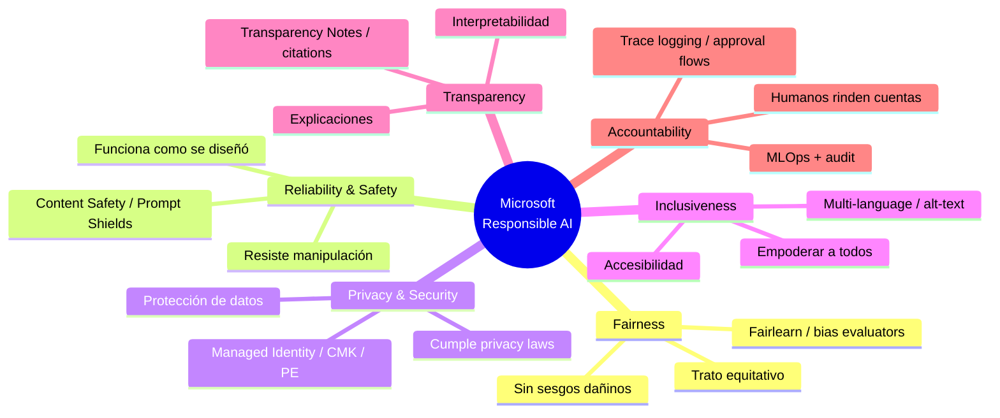
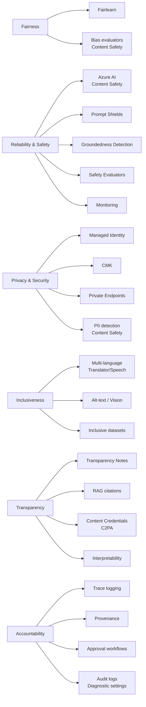
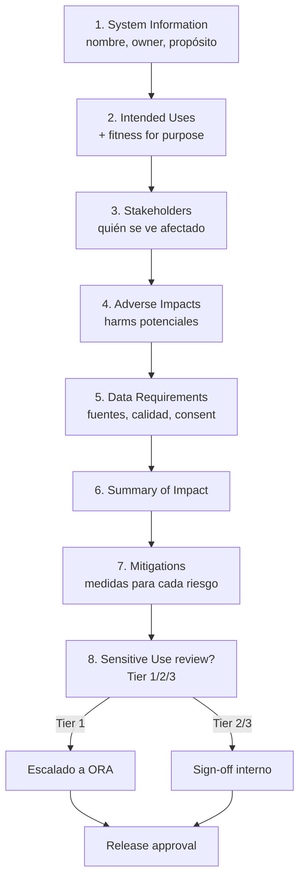
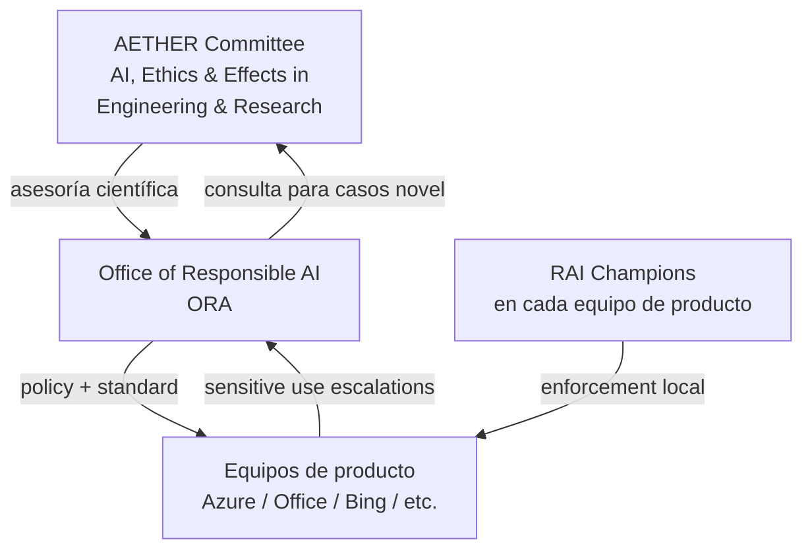
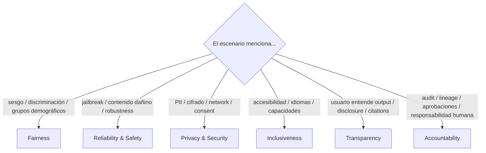

# Responsible AI: los 6 principios de Microsoft y su aplicación en Azure AI Foundry

> [!abstract] TL;DR
> Microsoft ha codificado su enfoque de Responsible AI (RAI) en **seis principios**: **Fairness, Reliability & Safety, Privacy & Security, Inclusiveness, Transparency, Accountability**. El **Responsible AI Standard v2** los operativiza dentro de la empresa; el **Office of Responsible AI (ORA)** y el comité **AETHER** los gobiernan; y cada producto Azure AI publica una **Transparency Note**. En AI-103 te examinan de identificar el principio correcto a partir de un escenario y de mapear cada principio a la herramienta Foundry adecuada (Content Safety, Prompt Shields, evaluators, Managed Identity, citations, trace logging, approval workflows…). Es el marco conceptual que sostiene **todo** el resto del dominio A.4.

## 🎯 Relevancia en el examen

| Aspecto | Frecuencia |
|---|---|
| Identificar el principio correcto en un escenario (ej. PII en logs → Privacy) | 🔥🔥🔥 |
| Mapear principio → herramienta Foundry/Azure AI | 🔥🔥🔥 |
| Memorizar nombres exactos de los 6 principios | 🔥🔥🔥 |
| Distinguir Transparency vs Explainability vs Interpretability | 🔥🔥 |
| Diferencia By Design vs By Discovery | 🔥🔥 |
| Saber qué es una Transparency Note y dónde aplica | 🔥🔥 |
| Reconocer governance bodies (ORA, AETHER) | 🔥 |
| Encajar Microsoft RAI con NIST AI RMF / EU AI Act | 🔥 |

**Tipos de pregunta típicos**:

- *"A bank deploys an LLM that approves loans. Audit logs show different approval rates by demographic. Which Microsoft RAI principle is most directly violated?"* → **Fairness**.
- *"Drag and drop the tool to the principle"* → Content Safety→Reliability & Safety, Managed Identity→Privacy & Security, etc.
- *"Which document does Microsoft publish per product to describe capabilities, limitations and recommended uses?"* → **Transparency Note**.

## 📖 Concepto en profundidad

### 1. Definición oficial de Responsible AI

> *"Responsible Artificial Intelligence (Responsible AI) is an approach to developing, assessing, and deploying AI systems safely, ethically, and with trust."* — Microsoft Learn, concept-responsible-ai (2025-09-09).

RAI no es un producto, es un **enfoque** (approach) sustentado en seis principios + herramientas + procesos + gobierno. Es **proactivo** (by design) y abarca **todo el ciclo**: requirements → design → development → deployment → operations.

### 2. Los 6 principios — verbatim

> *"Microsoft created a Responsible AI Standard, a framework for building AI systems based on six principles: fairness, reliability and safety, privacy and security, inclusiveness, transparency, and accountability."* — Microsoft Learn.



#### 2.1 Fairness

> *"AI systems should treat everyone fairly and avoid affecting similar groups differently."*

Aplica a outputs del modelo y a su impacto sobre **grupos sensibles** (gender, ethnicity, age, ability, socioeconomic status…). Ejemplos canónicos del examen: diagnóstico médico, decisiones de crédito, selección de personal.

#### 2.2 Reliability & Safety

> *"AI systems must operate reliably, safely, and consistently. They should function as designed, respond safely to unexpected conditions, and resist harmful manipulation."*

Cubre 3 dimensiones que entran en preguntas:

1. **Reliability** → comportamiento consistente en condiciones esperadas.
2. **Safety** → comportamiento *graceful* en condiciones no esperadas (out-of-distribution, jailbreaks).
3. **Robustness** → resistencia a manipulación adversarial.

#### 2.3 Privacy & Security

> *"Privacy and data security require close attention because AI systems need data to make accurate predictions and decisions."*

Dos vertientes: **privacy** (consentimiento, transparencia sobre uso de datos, derecho a controlar) y **security** (cifrado, network restrictions, vulnerability scanning). Microsoft acompaña con dos proyectos OSS clave que aparecen en docs: **SmartNoise** (differential privacy) y **Counterfit** (red-teaming de modelos AI).

#### 2.4 Inclusiveness

AI debe **empoderar a todos**, sin importar capacidad física, género, orientación, etnia, idioma o contexto. Es la única dimensión que el examen suele confundir con Fairness; la diferencia mental:

- **Fairness** = *equal treatment given access*.
- **Inclusiveness** = *equal access in the first place*.

#### 2.5 Transparency

> *"When AI systems inform decisions that impact people's lives, it's critical that people understand how those decisions are made. A crucial part of transparency is interpretability."*

Transparency es el **paraguas**. Dentro caben:

| Sub-concepto | Definición |
|---|---|
| **Interpretability** | Capacidad técnica de explicar el comportamiento del modelo (global y local explanations) |
| **Explainability** | Que la *salida* del modelo venga acompañada de *razones inteligibles* para el usuario |
| **Disclosure** | Comunicar que se está interactuando con AI (no humano) |
| **Transparency Note** | Documento Microsoft por servicio/modelo que explica capabilities, limitations, recommended uses |

⚠️ **Trampa**: Transparency ≠ Explainability. Transparency es el **principio**; Explainability/Interpretability son **mecanismos** dentro de él.

#### 2.6 Accountability

> *"People who design and deploy AI systems must be accountable for how those systems operate. […] humans maintain meaningful control over highly autonomous systems."*

Operativamente: **MLOps**, lineage, audit logs, approval workflows, sign-offs y *human-in-the-loop* en sistemas autónomos.

⚠️ **Sutileza**: en el marco Microsoft, *Accountability* implica que **personas concretas** (no la organización abstracta) rinden cuentas. Es por eso que ORA y AETHER existen como cuerpos con miembros nominados.

### 3. Responsible AI Standard v2

Es el **framework interno de Microsoft** (publicado en junio 2022, blog corporativo) que traduce los 6 principios a **requerimientos verificables** que aplican a todos sus productos AI.

| Bloque | Contenido |
|---|---|
| **Goals & requirements** | Para cada principio, *goals* (objetivos) + *requirements* (cumplimiento medible) |
| **Impact Assessment** | Template formal con stakeholders, intended uses, fitness for purpose, adverse impacts, mitigations |
| **Sensitive Uses tier** | Tier 1/2/3 según riesgo; Tier 1 escala a ORA review |
| **Goal-aligned design reviews** | Revisiones obligatorias antes de release |
| **Transparency Note requirement** | Cada modelo/servicio publica una |
| **Operational governance** | RAI Champions program + AETHER + ORA |

⚠️ **Trampa**: RAI Standard v2 es **Microsoft-specific**. No es un estándar de industria. Si la pregunta dice *"industry standard for AI risk"*, la respuesta correcta suele ser **NIST AI RMF** o **ISO/IEC 23053**, no RAI Standard.

### 4. Mapping principios → herramientas Foundry / Azure AI



Tabla limpia para memorizar:

| Principio | Herramienta principal Foundry/Azure | Doc cruzada en vault |
|---|---|---|
| Fairness | Fairlearn (OSS) + bias content evaluators | — |
| Reliability & Safety | **Content Safety**, **Prompt Shields**, Groundedness Detection, Safety Evaluators | [[responsible-content-safety-overview]], [[responsible-prompt-shields]], [[responsible-groundedness-detection]], [[responsible-evaluators-safety-evaluations]] |
| Privacy & Security | Managed Identity, CMK, Private Endpoints, **PII detection** | [[plan-security-managed-identity]], [[plan-security-customer-managed-keys]], [[plan-security-private-networking]] |
| Inclusiveness | Translator, Speech, accessibility | — |
| Transparency | **Transparency Notes**, citations RAG, Content Credentials (C2PA) | [[plan-grounding-strategies-comparison]] |
| Accountability | **Trace logging**, lineage, approval workflows, oversight controls, Diagnostic settings | [[responsible-trace-logging-provenance]], [[responsible-approval-workflows]], [[responsible-agent-oversight-controls]], [[plan-diagnostic-logs-azure-monitor]] |

### 5. Impact Assessment

Documento **pre-deployment** obligatorio para cualquier AI system en Microsoft (y altamente recomendado para clientes). Estructura típica:



Las **10+ secciones** del template oficial incluyen además *Disclosure*, *Human Oversight*, *Fit-for-purpose evaluation* y *Ongoing monitoring plan*. ⚠️ Saber que es **pre-deployment** (no post) es típico mata-pregunta.

### 6. Transparency Notes

Documento publicado **por Microsoft, por producto/modelo** (Azure OpenAI, Speech, Vision, Document Intelligence, Foundry Agent Service, etc.). Estructura oficial verificada:

1. **What is a Transparency Note?** (propósito y alineación con RAI Principles).
2. **The Basics** (model overview, terminología, training data sources).
3. **Capabilities** (qué puede hacer el sistema, ejemplos).
4. **Use cases**:
   - *Intended uses* (aplicaciones aprobadas con safeguards).
   - *Considerations when choosing use cases* (escenarios a evitar, high-stakes).
5. **Limitations**:
   - Technical limitations & fairness issues (allocation harms, QoS, stereotyping, disinformation…).
   - Model-specific limitations (fine-tuning, reasoning, audio, Computer Use…).
6. **System performance** (best practices, mitigations, prompting techniques).

⚠️ **Trampa frecuente**: la Transparency Note **no es global**, es **por servicio o modelo**. Cada vez que Microsoft saca un GPT-4o, GPT-5, Sora, etc., publica una Note.

### 7. Responsible AI by Design vs by Discovery

| Concepto | Cuándo | Coste | Quality |
|---|---|---|---|
| **By Design** | RAI integrada desde requirements | Bajo | Alta |
| **By Discovery** | RAI parcheada tras incidente / press / regulador | Alto (reputacional, técnico, legal) | Baja |

AI-103 examina explícitamente **By Design**: la respuesta correcta a *"when should you start applying RAI principles?"* es **antes de escribir requirements**, no en testing ni en producción.

### 8. Governance bodies de Microsoft



- **AETHER**: comité asesor de senior researchers que orienta a Microsoft en cuestiones de AI ethics. Es **interno** Microsoft, fundado en 2017.
- **ORA**: Office of Responsible AI; **define policy** (incluido el RAI Standard) y revisa **sensitive uses Tier 1**.
- **RAI Champions**: red de personas embebidas en cada equipo de producto que aplican el Standard día a día.

⚠️ ORA y AETHER son **internos Microsoft**. Las preguntas que mencionen un *external board* probablemente apuntan a NIST/EU AI Act, no a estos.

### 9. Compliance frameworks aliados (no Microsoft)

| Framework | Origen | Relación con Microsoft RAI |
|---|---|---|
| **NIST AI Risk Management Framework (AI RMF 1.0)** | NIST (USA, 2023) | Microsoft mapea su Standard contra él |
| **EU AI Act** | UE (2024) | Microsoft compromete cumplimiento; modelos clasificados por riesgo |
| **ISO/IEC 23053** | ISO/IEC | Framework para AI/ML systems |
| **ISO/IEC 42001** | ISO/IEC | AI Management System (auditable) |
| **Australia AI Ethics Framework** | Gobierno AU | Voluntario; 8 principios |

⚠️ Estos son **externos**. Si la pregunta dice *"Microsoft framework"* → RAI Standard. Si dice *"regulatory"* o *"industry standard"* → uno de estos.

### 10. Ejemplo aplicado: chatbot empresarial

| Principio | Implementación concreta |
|---|---|
| **Fairness** | Evaluar respuestas con safety + bias evaluators segmentando por demographic groups simulados; corregir prompt + RAG si hay drift |
| **Reliability & Safety** | Content Safety (hate/violence/sexual/self-harm) + Prompt Shields (jailbreak + indirect injection) + retries + fallback model + SLA monitoring |
| **Privacy & Security** | PII detection en input/output, redacción en logs, Managed Identity para backend, CMK en storage, Private Endpoint a Foundry |
| **Inclusiveness** | Soporte multi-idioma vía Translator; alt-text en imágenes generadas; accesibilidad WCAG en UI |
| **Transparency** | Disclosure "este chatbot usa IA"; mostrar citations del RAG con link a fuente; publicar interna Transparency Note |
| **Accountability** | Trace con OpenTelemetry → Azure Monitor; lineage de prompts y outputs; approval workflow para cambios de system prompt; audit logs |

## 🏗️ Cómo se hace (operativa de RAI en Foundry)

### Checklist de proyecto RAI by Design

```python
# Pseudocódigo / checklist conceptual; los comandos reales aparecen
# detallados en las notas cruzadas correspondientes.

# 1. Pre-deployment: Impact Assessment (manual, plantilla RAI Standard)
#    - Identifica stakeholders, intended uses, harms, mitigations.
#    - Si es Tier 1 (sensitive use) → escalado.

# 2. Configurar Content Safety en cada deployment de modelo
#    Ver [[responsible-content-filters-azure-openai]]
from azure.ai.projects import AIProjectClient
from azure.identity import DefaultAzureCredential

project = AIProjectClient(
    endpoint="https://<resource>.services.ai.azure.com/api/projects/<project>",
    credential=DefaultAzureCredential(),
)

# 3. Habilitar Prompt Shields a nivel de deployment
#    Ver [[responsible-prompt-shields]]

# 4. Programar evaluators continuos (groundedness, safety, fairness)
#    Ver [[responsible-evaluators-safety-evaluations]]

# 5. Configurar tracing + diagnostic settings → Log Analytics
#    Ver [[responsible-trace-logging-provenance]] y
#    [[plan-diagnostic-logs-azure-monitor]]

# 6. Approval workflow para promoción a producción
#    Ver [[responsible-approval-workflows]]

# 7. Publicar Transparency Note interna para el chatbot/agent
#    Plantilla pública de Microsoft adaptable.
```

### CLI: activar diagnostic settings (accountability + monitoring)

```bash
az monitor diagnostic-settings create \
  --name rai-audit \
  --resource <resourceId-de-foundry-account> \
  --logs       '[{"category":"Audit","enabled":true},{"category":"RequestResponse","enabled":true}]' \
  --workspace  <log-analytics-workspace-id>
```

### Bicep: requerir Managed Identity + CMK (privacy & security)

```bicep
resource foundry 'Microsoft.CognitiveServices/accounts@2024-10-01' = {
  name: 'fnd-rai-prod'
  location: location
  kind: 'AIServices'
  identity: { type: 'SystemAssigned' }       // Accountability + Privacy
  properties: {
    publicNetworkAccess: 'Disabled'           // Privacy & Security
    encryption: {
      keySource: 'Microsoft.KeyVault'         // CMK
      keyVaultProperties: {
        keyName: kvKeyName
        keyVaultUri: kvUri
      }
    }
  }
  sku: { name: 'S0' }
}
```

## 📊 Cuándo usar qué (árbol mental para el examen)



## 🪤 Trampas del examen

1. **Los 6 nombres EXACTOS**. Microsoft examina con la lista verbatim. Si una opción dice *"Safety and Security"* o *"Ethics"* o *"Bias mitigation"* → distractor. Los nombres oficiales son: **Fairness · Reliability and Safety · Privacy and Security · Inclusiveness · Transparency · Accountability**.
2. **Transparency ≠ Explainability ≠ Interpretability**. Transparency es el principio. Interpretability/Explainability son técnicas dentro de él. Disclosure (decir que es AI) también cae bajo Transparency.
3. **Accountability ≠ Responsibility**. En el marco Microsoft, *Accountability* implica *humans designing/deploying/operating son los que responden*; no es sinónimo genérico de *responsible*. Mecanismos: trace logging, lineage, approval workflows.
4. **Fairness vs Inclusiveness**: Fairness = *trato equitativo dado acceso*; Inclusiveness = *acceso/uso garantizado para todos*. Si el escenario habla de personas con discapacidad sin acceso → Inclusiveness, no Fairness.
5. **RAI Standard v2 es Microsoft-specific**. No es estándar industria. Para *industry standard* → NIST AI RMF / ISO 23053 / ISO 42001.
6. **Transparency Notes** son **por producto/modelo**, no un documento único global. Cada deployment de modelo nuevo tiene su Note.
7. **Impact Assessment es pre-deployment**, no reactivo. La filosofía es **by Design**, no **by Discovery**.
8. **AETHER y ORA son internos Microsoft**, no organismos externos ni reguladores. Si la pregunta menciona *external regulator* → EU AI Act / NIST.
9. **Content Safety cubre Reliability & Safety + Privacy** (PII detection). No la encasilles sólo en una.
10. **Fairlearn, SmartNoise, Counterfit** son OSS de Microsoft que aparecen en docs oficiales: Fairlearn → Fairness; SmartNoise → Privacy (differential privacy); Counterfit → Reliability & Safety (adversarial testing).
11. ⚠️ **AI-102 carryover**: los 6 principios son idénticos en AI-102 y AI-103. La novedad en AI-103 es el énfasis en **Foundry oversight controls, approval workflows y evaluators continuous** para agents (dominio E).

## 🧠 Mnemotecnia

### Acrónimo **FRPITA** (los 6 principios, orden Microsoft Learn)

> **F**airness · **R**eliability & Safety · **P**rivacy & Security · **I**nclusiveness · **T**ransparency · **A**ccountability

Memoriza la frase: *"**F**ranco **R**ecuerda **P**rivilegios, **I**ncluye **T**odas las **A**uditorías"*.

### Analogía del hospital

- **Fairness** → mismo tratamiento médico ante mismos síntomas.
- **Reliability & Safety** → el equipo funciona y el quirófano tiene protocolos para emergencias.
- **Privacy & Security** → historiales clínicos cifrados y con acceso restringido.
- **Inclusiveness** → accesibilidad de rampas, intérprete de lenguaje de signos.
- **Transparency** → consentimiento informado y explicación del diagnóstico.
- **Accountability** → el médico firma la historia y rinde cuentas si algo falla.

### Quick lookup principio→herramienta

> *"Fairlearn for **F**, Content Safety for **R**, Managed Identity for **P**, Translator for **I**, Notes for **T**, Trace for **A**."*

## 🔗 Conceptos relacionados

- [[responsible-content-safety-overview]] — paraguas técnico de Reliability & Safety.
- [[responsible-content-filters-azure-openai]] — implementación per-deployment.
- [[responsible-prompt-shields]] — defensa jailbreaks/indirect injection.
- [[responsible-groundedness-detection]] — Transparency (citations) + Reliability.
- [[responsible-evaluators-safety-evaluations]] — operacionalización continua.
- [[responsible-approval-workflows]] — Accountability operativo.
- [[responsible-agent-oversight-controls]] — Human-in-the-loop en agents.
- [[responsible-trace-logging-provenance]] — Accountability técnica (lineage).
- [[responsible-blocklists-custom-filters]] — Fine-tuning de Reliability & Safety.
- [[plan-security-managed-identity]] — Privacy & Security.
- [[plan-security-customer-managed-keys]] — Privacy & Security (CMK).
- [[plan-security-private-networking]] — Privacy & Security (network).
- [[plan-diagnostic-logs-azure-monitor]] — Accountability (audit logs).
- [[plan-grounding-strategies-comparison]] — Transparency (citations).

## ❓ Autotest

**1.** Un banco usa un modelo LLM para evaluar solicitudes de crédito. Una auditoría revela que la tasa de aprobación para un grupo demográfico es significativamente más baja con datos comparables. ¿Qué principio Microsoft RAI se ve más directamente comprometido?

- a) Reliability & Safety
- b) Fairness
- c) Accountability
- d) Transparency

<details><summary>Respuesta</summary>

**b) Fairness**. *"AI systems should treat everyone fairly and avoid affecting similar groups differently"*. Aunque Transparency y Accountability se invocarán para detectar y remediar, el principio violado es Fairness. Fairlearn y bias evaluators son las herramientas recomendadas.

</details>

**2.** ¿Cuál de los siguientes documentos publica Microsoft de forma individual para cada servicio/modelo Azure AI, describiendo capabilities, intended uses, limitations y system performance?

- a) Responsible AI Standard
- b) Impact Assessment
- c) Transparency Note
- d) Service Level Agreement

<details><summary>Respuesta</summary>

**c) Transparency Note**. El RAI Standard es el framework interno global; el Impact Assessment es un documento de proyecto pre-deployment; el SLA es contractual de disponibilidad. La Transparency Note es per producto/modelo.

</details>

**3.** Una arquitecta debe decidir en qué fase del ciclo de vida del proyecto integrar las consideraciones de Responsible AI para alinearse con la guía de Microsoft. ¿Cuál es la respuesta correcta?

- a) Durante user acceptance testing
- b) Tras el primer incidente reportado en producción
- c) Desde la fase de requirements (by Design)
- d) Sólo si el regulador lo exige

<details><summary>Respuesta</summary>

**c) Desde la fase de requirements (by Design)**. Microsoft prescribe *Responsible AI by Design*; *by Discovery* es reactivo y desaconsejado.

</details>

**4.** Asocia cada principio con la herramienta más representativa:

- 1. Fairness · 2. Reliability & Safety · 3. Privacy & Security · 4. Accountability
- a) Managed Identity · b) Trace logging + audit · c) Fairlearn · d) Prompt Shields

<details><summary>Respuesta</summary>

**1-c, 2-d, 3-a, 4-b**. Fairness→Fairlearn (OSS Microsoft para bias mitigation); Reliability & Safety→Prompt Shields (resistir manipulación adversarial); Privacy & Security→Managed Identity (no secretos); Accountability→Trace logging y audit logs.

</details>

**5.** ¿Qué organismo interno de Microsoft define la *policy* corporativa de Responsible AI, mantiene el RAI Standard y revisa los Sensitive Uses Tier 1?

- a) AETHER Committee
- b) Office of Responsible AI (ORA)
- c) Azure AI Foundry team
- d) NIST AI Safety Institute

<details><summary>Respuesta</summary>

**b) Office of Responsible AI (ORA)**. AETHER es asesor científico; ORA define policy y revisa Tier 1. NIST es externo (USA).

</details>

**6.** Un agent autónomo ejecuta acciones contra sistemas corporativos. El equipo necesita garantizar que cada acción quede registrada con su prompt origen, modelo invocado, herramienta llamada y usuario responsable. ¿Qué principio RAI se está materializando primariamente y mediante qué mecanismo?

- a) Privacy & Security · CMK
- b) Transparency · Transparency Note
- c) Accountability · trace logging y provenance
- d) Inclusiveness · multi-language support

<details><summary>Respuesta</summary>

**c) Accountability mediante trace logging y provenance**. La trazabilidad end-to-end (lineage) y los audit logs son la implementación técnica del principio de Accountability en agents. Ver [[responsible-trace-logging-provenance]] y [[responsible-agent-oversight-controls]].

</details>

## ✅ Control de calidad (auto-rúbrica)

| Dimensión | Nota |
|---|---|
| Completitud | 9.5 |
| Exactitud técnica | 9.5 |
| Alineación al examen | 9.5 |
| Claridad pedagógica | 9.5 |

*Verificado a fecha 2026-05-23 contra Microsoft Learn (`concept-responsible-ai`, 2025-09-09), microsoft.com/ai/responsible-ai, RAI Standard v2 (blogs.microsoft.com, 2022-06) y Transparency Note de Azure OpenAI en Azure AI Foundry.*
