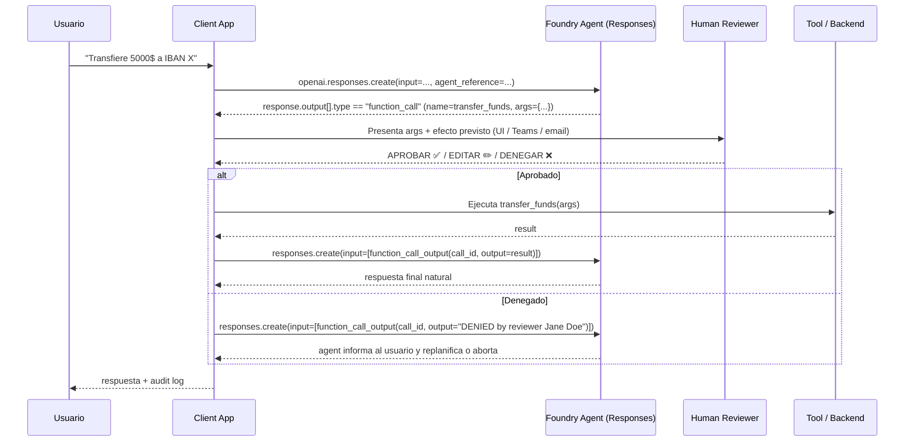
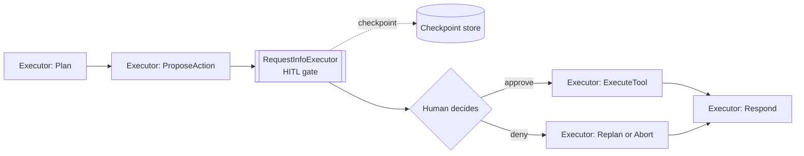
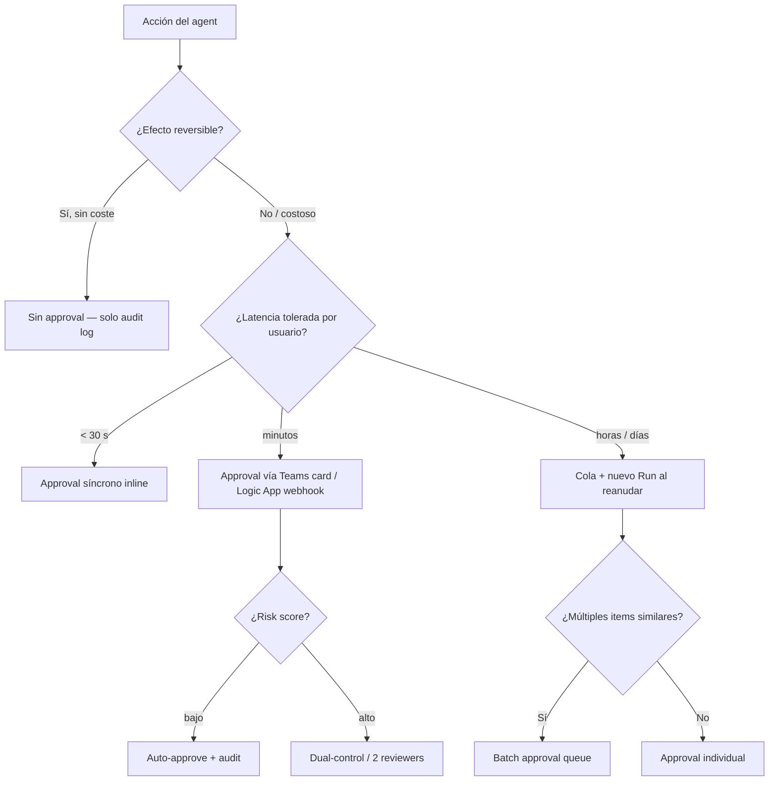

# Responsible AI — Approval Workflows (Human-in-the-Loop)

> [!abstract] TL;DR
> Un **approval workflow** es un control de Responsible AI que **pausa la ejecución del agent antes de un tool call (o output) de alto impacto** y exige decisión humana (aprobar / editar / denegar). En **Foundry Agent Service** el patrón actual (Responses API) consiste en interceptar `function_call` antes de devolver `function_call_output`; en la **superficie Assistants legacy** el Run pasa a `requires_action` y se reanuda con `submit_tool_outputs`. En **Microsoft Agent Framework** se modela con un `RequestInfoExecutor` y *checkpointing* en frontera de superstep. Las aprobaciones asíncronas se delegan a **Logic Apps / Power Automate / Teams** mediante el patrón **webhook** con `subscribe` + callback URL (`@listCallbackUrl()`). Hay un **límite duro de 10 minutos por Run**: aprobaciones que superen ese plazo deben usar el patrón webhook desacoplado.

## 🎯 Relevancia en el examen

Frecuencia: 🔥🔥 (en el cluster *Responsible AI / Govern agent behavior*).
Tipos de pregunta:

- **Escenario**: "el agent invoca una herramienta destructiva; ¿qué mecanismo introduces?" → approval workflow (NO solo content filter).
- **Identificar API**: cuándo se usa `function_call_output` (Responses API moderna) vs `submit_tool_outputs` (Assistants legacy).
- **Diseño de timeout**: `Runs expire 10 minutes after creation` → si la aprobación tarda más, hay que **devolver estado, polling externo, y reanudar en otro Run** (no se puede mantener un Run abierto horas).
- **Integración Logic Apps**: identificar `202 ACCEPTED` + `location` + `retry-after` (patrón polling) o `subscribe`/`unsubscribe` (patrón webhook).
- **RBAC del aprobador**: la decisión humana debe estar autenticada y auditable.
- **Trampa**: el approval **no sustituye** al content filter ni al groundedness check — son capas complementarias.

## 📖 Concepto en profundidad

### 1. Definición operativa

Un approval workflow inserta un **gate síncrono o asíncrono** entre la decisión del modelo y la **ejecución de un efecto colateral** (DB write, llamada a API externa, envío de email, deploy, transferencia de fondos, etc.). El gate puede ser:

| Tipo | Latencia esperada | Mecanismo Foundry/AF | Storage de estado |
| --- | --- | --- | --- |
| **Síncrono / inline** | segundos | El loop del cliente bloquea en `input()` antes de enviar `function_call_output` | Memoria del cliente |
| **Asíncrono off-process** | minutos / horas | Webhook Logic Apps + cola (Cosmos DB / Service Bus) | Externo (no Foundry) |
| **Batch** | horas / días | Cola de items → revisión agrupada → bulk submit | Cosmos DB / Storage Queue |
| **Conditional / policy-based** | segundos | Policy engine evalúa args; si `risk_score < threshold` auto-aprueba | OPA / lógica cliente |

> [!warning] Restricción dura de Foundry Agent Service
> *"Runs expire 10 minutes after creation. Submit your tool outputs before they expire."* Esto significa que **NO** puedes mantener un Run abierto esperando aprobación humana que tarde horas. Patrones válidos para aprobaciones largas:
> 1. Devolver `function_call_output` con `{"status": "pending_approval", "ticket_id": "..."}` y dejar al agent responder al usuario "te aviso cuando se apruebe".
> 2. La aprobación llega vía webhook externo → se inicia un **nuevo Run** que continúa la conversación en la misma `conversation_id`.

### 2. Approval en Foundry Agent Service — Responses API (patrón actual)

El flujo canónico documentado en *function-calling*:



> [!note] Clave de examen
> En la **Responses API** la "pausa para approval" **no es un estado del servicio** — es el cliente quien retiene el `function_call` y decide cuándo (o si) emite el `function_call_output`. El servidor solo conoce *función pedida → output entregado*. El cumplimiento del SLA de 10 min es responsabilidad del cliente.

### 3. Approval en superficie Assistants/Threads legacy

Para apps construidas sobre la API de *Threads + Runs* (todavía soportada y frecuentemente preguntada):

| Estado del Run | Significado | Acción del cliente |
| --- | --- | --- |
| `queued` / `in_progress` | Ejecutando | Poll |
| **`requires_action`** | El modelo invocó tool(s); el servicio espera tool_outputs | Leer `required_action.submit_tool_outputs.tool_calls` |
| `completed` | Hecho | Leer mensajes |
| `failed` / `expired` / `cancelled` | Terminal | Manejar error |

El cliente recibe un array `tool_calls`, presenta `function.name` + `function.arguments` al humano, y reanuda con:

```python
client.runs.submit_tool_outputs(
    thread_id=thread.id,
    run_id=run.id,
    tool_outputs=[{"tool_call_id": tc.id, "output": json.dumps(result)}],
)
```

> [!danger] ⚠️ Trampa AI-102 carryover
> El examen puede mezclar ambas APIs. Si el enunciado dice "the Run is in `requires_action` state" → estamos en la superficie Assistants legacy y la respuesta es `submit_tool_outputs`. Si habla de `response.output` con `type=="function_call"` → es Responses API moderna y la respuesta es `function_call_output`.

### 4. Approval en Microsoft Agent Framework (workflows)

Agent Framework modela los workflows como **grafos dirigidos de executors** con ejecución **superstep (Bulk Synchronous Parallel, Pregel)**. La frontera entre supersteps es el **único punto seguro de checkpointing**, y allí se inserta la pausa HITL:

- Patrón: nodo **`RequestInfoExecutor`** (o equivalente) que **emite un evento `RequestInfo`** y **suspende el grafo**.
- El estado del workflow se serializa al **checkpoint store** (file / Cosmos / Blob).
- Un proceso externo (UI, Logic App, Teams card) consume el RequestInfo, recoge la decisión humana, y **reanuda el workflow** entregando la respuesta.
- Garantías BSP: ejecución **determinista** y reanudable; no hay race conditions porque la pausa coincide con la barrera de sincronización.



### 5. Integración con Logic Apps (patrón webhook asíncrono)

Logic Apps documenta dos patrones canónicos para tareas que exceden el request timeout:

| Patrón | Quién controla cadencia | Endpoints en tu API | Headers clave |
| --- | --- | --- | --- |
| **Polling** | Logic Apps engine | 1 endpoint que devuelve `202 ACCEPTED` o `200 OK` | `location`, `retry-after` |
| **Webhook** | Tu API (push) | `subscribe` + `unsubscribe` | `@listCallbackUrl()` para obtener callback URL |

Para **approval workflows** se usa el **webhook pattern** (el aprobador puede tardar horas, no queremos polling cada segundo):

1. El cliente del agent llama a un Logic App con un **HTTP Webhook action**.
2. Logic Apps llama al `subscribe` endpoint y le pasa la **callback URL** (`@listCallbackUrl()`).
3. El connector *Approvals* (Outlook / Teams / Power Automate) envía la **adaptive card** al aprobador.
4. Cuando el humano hace click, el connector hace **HTTP POST a la callback URL** con la decisión.
5. El Logic App resume y notifica al backend del agent (que crea un nuevo Run / responde al usuario).
6. Si la instancia se cancela, Logic Apps llama al `unsubscribe` para limpiar.

> [!tip] Patrón completo end-to-end
> **Agent app → cola (Service Bus) → Logic App (Approvals connector) → Reviewer (Teams card) → callback → cola de respuestas → Agent app reanuda nuevo Run en la `conversation_id` original.** Esto desacopla por completo el SLA de 10 min del Run.

### 6. Patrones de diseño

| Patrón | Cuándo usarlo | Implementación |
| --- | --- | --- |
| **All-or-nothing** | Tools de un mismo "blast radius" | Un único gate antes del primer tool call destructivo |
| **Per-tool policy** | Mix read/write | Anotar cada FunctionTool con `requires_approval: bool` en metadata del cliente |
| **Risk-based scoring** | Volumen alto, mayoría benigna | Reglas/ML calculan `risk_score(args)`; gate solo si `score > θ` |
| **Reviewer rotation** | Evitar bottleneck | Cola con asignación round-robin (Cosmos DB + Function) |
| **Dual control / two-person rule** | Acciones críticas (>$10k, deleteAll) | 2 aprobadores distintos antes de submit |
| **Soft delete / reversible** | Borrados | Tool implementa soft-delete con ventana de 7 días; approval solo necesario tras window |
| **Confirmation phrase** | Catastrophic | El aprobador debe **tipear** una frase exacta (`"DELETE PRODUCTION-EU"`) |

## 🏗️ Cómo se hace

### Python — Foundry Agent Service (Responses API) con gate síncrono

```python
import json
from azure.ai.projects import AIProjectClient
from azure.ai.projects.models import PromptAgentDefinition, FunctionTool
from azure.identity import DefaultAzureCredential
from openai.types.responses.response_input_param import FunctionCallOutput, ResponseInputParam

# Política local: qué tools requieren aprobación humana
REQUIRES_APPROVAL = {"transfer_funds", "delete_record", "send_email_external"}

def execute_with_approval(tool_name: str, args: dict) -> str:
    """Ejecuta un tool, interponiendo gate humano si es de alto impacto."""
    if tool_name in REQUIRES_APPROVAL:
        print(f"\n[APPROVAL REQUIRED] tool={tool_name}\nargs={json.dumps(args, indent=2)}")
        decision = input("Approve (y/n) > ").strip().lower()
        if decision != "y":
            return json.dumps({"status": "denied", "reason": "human reviewer denied"})
    # Ejecutar el tool real
    return json.dumps(call_real_backend(tool_name, args))

PROJECT_ENDPOINT = "https://<resource>.ai.azure.com/api/projects/<project>"
project = AIProjectClient(endpoint=PROJECT_ENDPOINT, credential=DefaultAzureCredential())
openai = project.get_openai_client()

conversation = openai.conversations.create()

response = openai.responses.create(
    input="Transfiere 5000 EUR a IBAN ES12...",
    conversation=conversation.id,
    extra_body={"agent_reference": {"name": "treasury-agent", "type": "agent_reference"}},
)

input_list: ResponseInputParam = []
for item in response.output:
    if item.type == "function_call":
        result = execute_with_approval(item.name, json.loads(item.arguments))
        input_list.append(FunctionCallOutput(
            type="function_call_output",
            call_id=item.call_id,
            output=result,
        ))

final = openai.responses.create(
    input=input_list,
    conversation=conversation.id,
    extra_body={"agent_reference": {"name": "treasury-agent", "type": "agent_reference"}},
)
print(final.output_text)
```

### Python — Approval asíncrono vía Service Bus + webhook (desacoplado del Run)

```python
# Paso 1: el agent encola la petición y responde al usuario "pendiente"
def queue_for_approval(tool_call_id: str, conversation_id: str, name: str, args: dict) -> str:
    ticket_id = sb_client.send_message(QUEUE_PENDING, {
        "ticket_id": str(uuid.uuid4()),
        "conversation_id": conversation_id,
        "call_id": tool_call_id,
        "tool": name,
        "args": args,
        "submitted_at": datetime.utcnow().isoformat(),
        "submitted_by": current_user_oid(),
    })
    return json.dumps({"status": "pending_approval", "ticket_id": ticket_id})

# Paso 2: webhook FastAPI que recibe la decisión del Logic App / Teams
from fastapi import FastAPI, Header, HTTPException
app = FastAPI()

@app.post("/approvals/callback")
async def approval_callback(
    payload: dict,
    x_signature: str = Header(...),
):
    if not hmac_verify(payload, x_signature, SIGNING_KEY):
        raise HTTPException(401, "invalid signature")
    # payload = {ticket_id, decision: "approve"|"deny", reviewer_oid, justification, at}
    log_audit(payload)  # cross-ref [[responsible-trace-logging-provenance]]
    if payload["decision"] == "approve":
        result = call_real_backend(payload["tool"], payload["args"])
    else:
        result = {"status": "denied", "reviewer": payload["reviewer_oid"]}
    # Reanudar la conversación con un nuevo Run en la misma conversation_id
    openai.responses.create(
        input=[{"type": "function_call_output",
                "call_id": payload["call_id"],
                "output": json.dumps(result)}],
        conversation=payload["conversation_id"],
        extra_body={"agent_reference": {"name": "treasury-agent", "type": "agent_reference"}},
    )
    return {"ok": True}
```

### Logic App — esqueleto JSON del approval (Outlook/Teams connector)

```json
{
  "definition": {
    "$schema": "https://schema.management.azure.com/.../workflowdefinition.json#",
    "triggers": {
      "manual": {
        "type": "Request",
        "kind": "Http",
        "inputs": { "schema": { "type": "object" } }
      }
    },
    "actions": {
      "Send_approval_email": {
        "type": "ApiConnectionWebhook",
        "inputs": {
          "host": { "connection": { "name": "@parameters('$connections')['office365']['connectionId']" } },
          "body": {
            "Message": {
              "To": "@triggerBody()?['reviewerEmail']",
              "Subject": "Approval needed: @{triggerBody()?['tool']}",
              "Options": "Approve, Reject",
              "ShowHTMLConfirmationDialog": true,
              "Body": "Tool: @{triggerBody()?['tool']}\nArgs: @{triggerBody()?['args']}"
            },
            "NotificationUrl": "@{listCallbackUrl()}"
          },
          "path": "/approvalmail/$subscriptions"
        }
      },
      "Post_back_to_agent": {
        "type": "Http",
        "runAfter": { "Send_approval_email": ["Succeeded"] },
        "inputs": {
          "method": "POST",
          "uri": "https://agent-backend/approvals/callback",
          "headers": { "X-Signature": "@{outputs('Sign')}" },
          "body": {
            "ticket_id": "@{triggerBody()?['ticket_id']}",
            "conversation_id": "@{triggerBody()?['conversation_id']}",
            "call_id": "@{triggerBody()?['call_id']}",
            "decision": "@{body('Send_approval_email')?['SelectedOption']}",
            "reviewer_oid": "@{body('Send_approval_email')?['UserId']}"
          }
        }
      }
    }
  }
}
```

### Bash — disparar approval queue desde CLI (debug)

```bash
az servicebus queue create \
  --resource-group rg-ai \
  --namespace-name sb-agent-approvals \
  --name approvals-pending

az role assignment create \
  --assignee <agent-managed-identity-oid> \
  --role "Azure Service Bus Data Sender" \
  --scope $(az servicebus queue show -g rg-ai --namespace-name sb-agent-approvals -n approvals-pending --query id -o tsv)
```

## 📊 Cuándo usar qué (árbol de decisión)



| Escenario | Mecanismo recomendado |
| --- | --- |
| Chatbot consume API read-only | **Sin approval**, solo content filter + tracing |
| Agent crea ticket Jira | **Conditional** (auto si priority<P2) |
| Agent envía email externo | **Síncrono inline** mostrando destinatario + cuerpo |
| Agent ejecuta SQL DELETE | **Dual-control** + confirmation phrase |
| Agent despliega infra | **Webhook asíncrono** (revisión SRE) |
| Pipeline batch nocturno | **Batch approval** a la mañana siguiente |

## 🪤 Trampas del examen

1. **10-minute Run expiration**: si la pregunta describe un Run que "espera horas" hasta la decisión, eso es **incorrecto**; hay que devolver el output como `pending` y crear un **nuevo Run** al reanudar. Mantener el Run abierto **expira** y el `submit_tool_outputs` fallará.
2. **Responses API vs Assistants API**: `function_call` + `function_call_output` (Responses, actual) ≠ `requires_action` + `submit_tool_outputs` (Assistants legacy). Detecta cuál API menciona el enunciado.
3. **`call_id` debe coincidir**: el `function_call_output` (o cada entry de `submit_tool_outputs`) **debe** referenciar el `call_id` exacto del `function_call` recibido. Inventarlo o reordenarlo → error.
4. **El servicio NO almacena el estado de approval**: en Responses API no hay un campo `awaiting_approval` en el servidor. El "estado" vive en tu app/cola. Si el enunciado dice "the agent service tracks approvals natively" → **falso**.
5. **Approval queue no es built-in**: implementarlo con Cosmos DB / Service Bus / Storage Queue. Foundry Agent Service no provee un *approval inbox* nativo.
6. **RBAC del aprobador**: la identidad del reviewer debe ser **autenticada** (Entra ID OID en el callback) y autorizada por **role custom** o grupo (no basta con tener acceso al chat). El logging del OID es obligatorio para audit.
7. **PII en args de tools**: los logs de approval incluyen `function.arguments` que pueden contener PII / secretos. Aplica **redaction** antes de loguear o enviar a Teams/email.
8. **Logic Apps webhook ≠ Logic Apps polling**: para approvals long-running usa **webhook (`subscribe`/`unsubscribe` + `@listCallbackUrl()`)**, NO el patrón polling (`202 ACCEPTED` + `retry-after`) que se usa para tareas batch del propio servicio.
9. **Denied ≠ Error del Run**: si el reviewer deniega, **no canceles el Run con error**; envía un `function_call_output` con `{"status":"denied"}` para que el modelo pueda **comunicar la denegación al usuario y replanificar** (mejor UX y mejor audit).
10. **Approval no sustituye a otras capas**: sigue necesitando **content filters** (`[[responsible-content-filters-azure-openai]]`), **prompt shields** (`[[responsible-prompt-shields]]`), **groundedness** (`[[responsible-groundedness-detection]]`) y **trace logging** (`[[responsible-trace-logging-provenance]]`). El gate humano protege contra acciones, no contra outputs tóxicos o jailbreaks.
11. **Microsoft Agent Framework**: la pausa HITL se debe colocar en **frontera de superstep** (sincronización BSP) usando un **`RequestInfoExecutor`** + checkpoint. Insertarlo dentro de un superstep activo rompe las garantías de determinismo.
12. **No reutilizar `call_id` tras un Run expirado**: si el Run venció, el `call_id` ya no es válido; debes crear un nuevo Run y replanificar.

## 🧠 Mnemotecnia

- **"GATE = G·A·T·E"**:
  - **G**ate before side effect (interponer SIEMPRE antes del backend real, nunca después).
  - **A**rgs visible al reviewer (nunca aprobar a ciegas).
  - **T**imeout < 10 min en el Run; si tarda más → cola + nuevo Run.
  - **E**vent logged (quién, cuándo, qué, justificación, hash de args).

- **"Dos APIs, dos verbos"**:
  - Responses API → **`function_call_output`**.
  - Assistants API legacy → **`submit_tool_outputs`**.

- **"S U W"** (estados Logic Apps async): **S**ubscribe → wait callback → **U**nsubscribe on cancel; **W**ebhook beats polling para esperas largas.

- **Regla del cajero**: como un cajero pidiendo PIN antes de retirar, el agent pide confirmación humana antes de mover dinero/datos. Sin confirmación: solo lectura.

## 🔗 Conceptos relacionados

- [[responsible-agent-oversight-controls]] — modos de oversight (full / partial / autónomo) que enmarcan dónde insertar approvals.
- [[agents-microsoft-foundry-agent-service]] — superficie de runtime (Responses + conversations).
- [[agents-microsoft-agent-framework]] — workflows BSP con checkpointing.
- [[agents-autonomous-workflows-safeguards]] — guardrails complementarios para agentes con menos supervisión.
- [[agents-approval-flow-controls]] — variantes de gate (per-tool, conditional, dual-control).
- [[responsible-trace-logging-provenance]] — qué se loguea de cada decisión (provenance metadata).
- [[genai-observability-tracing]] — Application Insights / OpenTelemetry para visualizar el gate end-to-end.
- [[plan-security-rbac-role-policies]] — role custom para "Approver" sobre la app del agent.
- [[responsible-content-filters-azure-openai]] / [[responsible-prompt-shields]] / [[responsible-groundedness-detection]] — capas previas/paralelas al approval.

## ❓ Autotest

**1.** Tu agent en Foundry usa Responses API. Una tool `delete_customer(id)` requiere aprobación humana que tarda ~5 minutos. ¿Qué patrón **NO** es válido?

- a) Recibir el `function_call`, presentar args a un reviewer, y emitir `function_call_output` cuando aprueba.
- b) Encolar el ticket, devolver `function_call_output={"status":"pending"}`, y reanudar con un nuevo Run cuando se aprueba vía webhook.
- c) Mantener el Run abierto durante 5 minutos esperando input humano.
- d) Devolver `function_call_output={"status":"denied"}` si el reviewer rechaza.

<details><summary>Respuesta</summary>
<b>c</b>. Aunque 5 min está dentro del límite de 10, ocupar el Run con I/O bloqueante es frágil (un reviewer lento → Run expira y pierdes el `call_id`). Las opciones a, b y d son válidas; a es síncrona aceptable, b es el patrón asíncrono recomendado, d es la forma correcta de comunicar denegación.
</details>

**2.** En la API de Assistants/Threads legacy, ¿qué método se usa para reanudar un Run en estado `requires_action`?

- a) `client.runs.create(...)`
- b) `client.runs.submit_tool_outputs(thread_id, run_id, tool_outputs=[...])`
- c) `client.responses.create(input=[function_call_output(...)])`
- d) `client.runs.cancel(run_id)`

<details><summary>Respuesta</summary>
<b>b</b>. <code>submit_tool_outputs</code> es el método legacy de la API Assistants para resumir un Run en <code>requires_action</code>. La opción c es la API Responses moderna (Foundry agents actual). a crearía un Run nuevo (incorrecto). d cancelaría sin devolver output (incorrecto si querías aprobar).
</details>

**3.** ¿Cuál es el patrón Logic Apps correcto para approvals que pueden tardar horas?

- a) HTTP action con `retry-after: 3600`.
- b) Polling action devolviendo `202 ACCEPTED` con `location` y `retry-after`.
- c) Webhook action con `subscribe` / `unsubscribe` y `@listCallbackUrl()`.
- d) Una Azure Function con timeout extendido.

<details><summary>Respuesta</summary>
<b>c</b>. El patrón webhook desacopla la espera (push del aprobador → callback URL) y es el documentado por Logic Apps para esperas largas. El polling (b) genera carga innecesaria. a no es un patrón soportado. d no es un patrón de Logic Apps.
</details>

**4.** En Microsoft Agent Framework, ¿dónde se debe colocar el gate de approval para preservar las garantías del modelo BSP?

- a) Dentro de un executor activo durante un superstep.
- b) En la **frontera entre supersteps**, usando un `RequestInfoExecutor` o equivalente con checkpoint.
- c) En el cliente, antes de invocar `workflow.run()`.
- d) Como middleware del `WorkflowBuilder`.

<details><summary>Respuesta</summary>
<b>b</b>. El modelo Pregel/BSP garantiza determinismo y checkpointing solo en las barreras entre supersteps; ahí es donde un <code>RequestInfoExecutor</code> puede suspender, serializar estado, y reanudar tras decisión humana.
</details>

**5.** ¿Qué información debe contener el audit log de cada decisión de approval para cumplir Responsible AI?

- a) Solo "aprobado" o "denegado".
- b) `reviewer_oid`, timestamp, tool name, args (con PII redactada), decisión, justificación opcional, hash criptográfico para integridad.
- c) Solo el `call_id`.
- d) Solo el output devuelto al agent.

<details><summary>Respuesta</summary>
<b>b</b>. Provenance metadata debe permitir trazar quién aprobó qué y cuándo, con args (redactados de PII), justificación, y hash para detectar tampering. Ver <code>[[responsible-trace-logging-provenance]]</code>.
</details>

## ✅ Control de calidad (auto-rúbrica)

| Dimensión | Nota | Justificación |
| --- | --- | --- |
| Completitud | 9.5 | Cubre los 10 sub-puntos del brief: tipos, ambas APIs (Responses + Assistants), Agent Framework BSP, Logic Apps webhook/polling, state, audit, UX, snippets, mermaid. |
| Exactitud técnica | 9.5 | Verificado contra docs oficiales: `function_call_output`, 10-minute Run expiration, `submit_tool_outputs` legacy, BSP/Pregel supersteps, `@listCallbackUrl()`, patrón `subscribe`/`unsubscribe`. Snippets Python alineados al SDK `azure-ai-projects` actual. |
| Alineación al examen | 9.5 | Trampas 1-12 derivadas de gotchas reales (mezcla de APIs, 10-min limit, RBAC reviewer, PII en logs, no built-in queue). Autotest cubre los escenarios típicos. |
| Claridad pedagógica | 9.0 | Tablas comparativas, 3 diagramas mermaid (sequence, flowchart, BSP), mnemónicos GATE / SUW / cajero. Lenguaje denso pero estructurado. |

*Verificado a fecha 2026-05-23 contra Microsoft Learn (foundry/agents/how-to/tools/function-calling, agent-framework/workflows, azure/logic-apps/logic-apps-create-api-app).*
