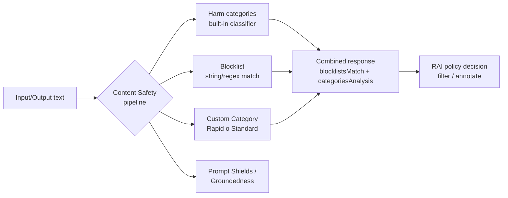
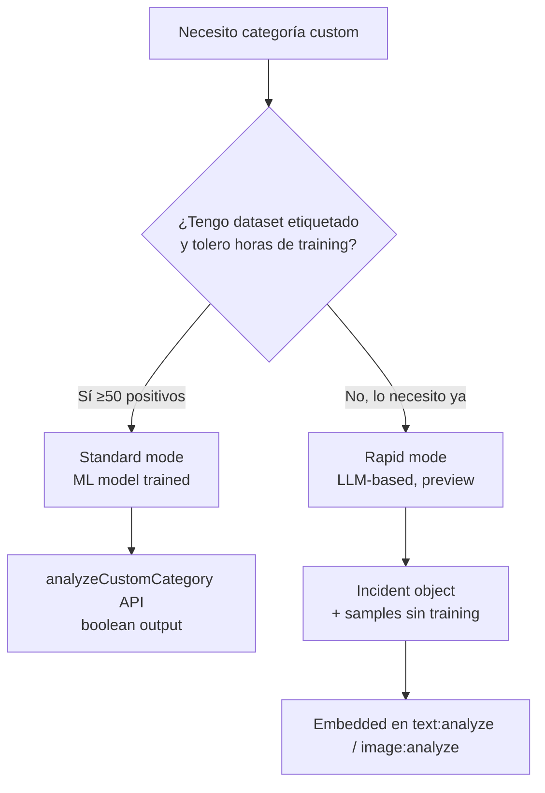
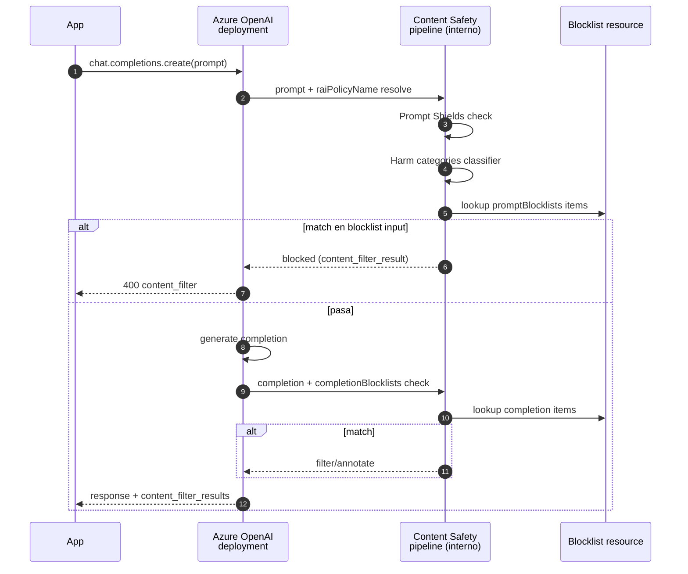
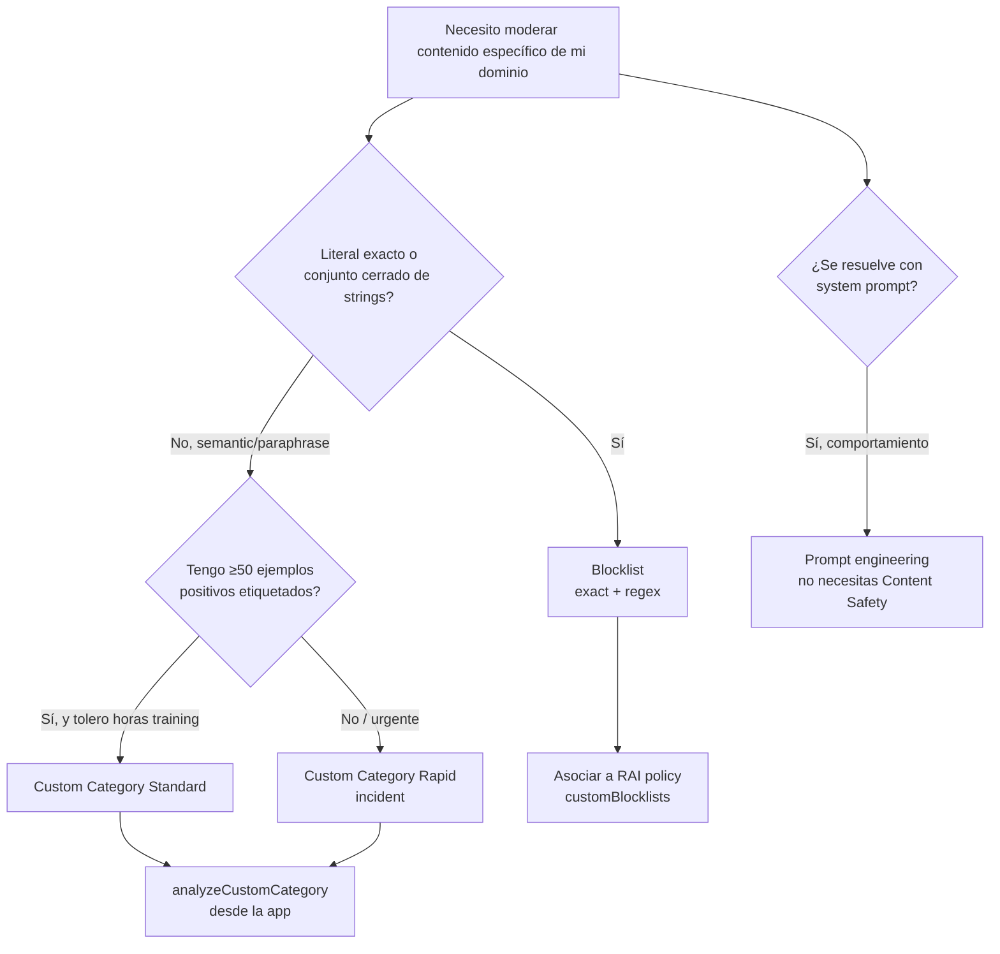

# Blocklists & Custom Categories — moderación específica de dominio

> [!abstract] TL;DR
> **Blocklists** = lista determinística de strings/regex que se evalúan en O(1) contra el texto, ideal para nombres propios, marcas, vocabulario regulatorio (precisión perfecta, cero parafraseo). **Custom Categories** = classifier propio, modo **Rapid** (LLM-based, sin training, preview) o **Standard** (ML entrenado con ≥50 positivos, training de horas). Ambos extienden los **harm categories** built-in (Hate/Sexual/SelfHarm/Violence). Se asocian a un deployment de Azure OpenAI vía **RAI Policy** (`raiPolicies.customBlocklists`) o se llaman directamente en `text:analyze` con `blocklistNames`. Examen pregunta: cuándo elegir blocklist vs custom category vs prompt engineering, y los límites duros (**10 000 ítems totales, máx 128 chars/ítem, ≤5 min propagación, 3 categorías por usuario en Standard**).

## 🎯 Relevancia en el examen

| Pregunta típica | Frecuencia |
|---|---|
| "Necesitas bloquear nombres de competidores en respuestas del modelo. ¿Qué configuras?" → Blocklist con `completionBlocklists` en RAI Policy | 🔥🔥🔥 |
| "Tienes 30 ejemplos positivos de una categoría custom y necesitas detección hoy mismo, sin training" → **Rapid** custom category | 🔥🔥 |
| "Quieres detener el modelo en cuanto haga match con la blocklist" → `haltOnBlocklistHit: true` | 🔥🔥 |
| "Has añadido un item y no se detecta inmediatamente" → propagación hasta 5 min | 🔥🔥 |
| "Diferencia entre `isRegex: true` y exact match" | 🔥 |

## 📖 Concepto en profundidad

### 1. ¿Por qué dos mecanismos sobre el content filter base?

Los **harm categories** built-in (Hate, Sexual, SelfHarm, Violence) cubren el universal RAI, pero un banco no quiere oír "mencionar la palabra `competidor X`" y un hospital no quiere generar diagnósticos. Microsoft añade dos *primitives* específicos de dominio:



### 2. Blocklists — anatomía

| Aspecto | Detalle |
|---|---|
| **Recurso** | Vive **dentro del Content Safety resource** (no en el deployment de Azure OpenAI) |
| **Endpoint** | `<endpoint>/contentsafety/text/blocklists/{blocklistName}?api-version=2024-09-01` |
| **Verbo creación** | `PATCH` (devuelve 201 si nueva, 200 si update) |
| **Add items** | `POST .../{name}:addOrUpdateBlocklistItems` (máx **100 ítems por request**) |
| **Límite global** | **10 000 ítems en total a través de todas las listas** del resource |
| **Longitud item** | máximo **128 caracteres** |
| **Tipos de match** | Exact match (default) o **regex** (`isRegex: true`) |
| **Case sensitivity** | Insensible por default; con regex usa flags de regex |
| **Match scope** | **Cualquier parte del texto** (no anchored a inicio/fin) |
| **Propagación tras edit** | Hasta **5 minutos** antes de reflejarse en `text:analyze` |
| **Caracteres permitidos en nombre** | `0-9, A-Z, a-z, - . _ ~` |

### 3. Custom Categories — los dos modos



| Característica | **Standard** | **Rapid** |
|---|---|---|
| **Backend** | ML classifier entrenado | LLM (GPT-based) |
| **Training** | Async, **hasta varias horas** | **No training** (incident object) |
| **Min positivos** | **50** (máx 5 K) | hasta 1 000 samples/incident |
| **Min negativos** | Opcionales; total ≤10 K | n/a |
| **Modalidades** | Solo **texto** | **Texto e imagen** |
| **Idiomas** | Inglés únicamente | Todos los soportados por Content Safety text moderation |
| **Cuotas por usuario** | **3 categorías**, 3 versiones c/u | **100 incidentes** por resource |
| **Inference rate** | **5 ops/seg** por categoría | n/a documentado |
| **Estado** | GA | **Preview** (regiones limitadas) |
| **Output** | Boolean (matches/no) | Boolean (incident hit) + semantic match |

> [!warning] Distinción clave de examen
> **Rapid hace semantic matching con embeddings**, por lo que captura *paraphrases* que la blocklist no atrapa. Es el reemplazo "rápido" del blocklist para incidentes emergentes, pero NO sustituye a la blocklist para **literales exactos regulatorios** (donde quieres false-positive rate = 0).

### 4. Integración con RAI Policy de Azure OpenAI



El RAI Policy (recurso ARM `Microsoft.CognitiveServices/accounts/raiPolicies`) declara:

- `contentFilters[]` (harm categories thresholds, prompt shields, groundedness, jailbreak…)
- `customBlocklists[]` con campos `blocklistName`, `source: "Prompt"|"Completion"`, `blocking: true|false`

## 🏗️ Cómo se hace

### Bicep — Blocklist + RAI Policy adjunta a deployment

```bicep
// Content Safety blocklist no es ARM resource standalone; se crea por data-plane API.
// Lo que SÍ es ARM es asociarlo a una RAI policy:

resource raiPolicy 'Microsoft.CognitiveServices/accounts/raiPolicies@2024-10-01' = {
  parent: aoaiAccount
  name: 'rai-policy-banking-strict'
  properties: {
    basePolicyName: 'Microsoft.Default'
    mode: 'Default'
    contentFilters: [
      { name: 'Hate', blocking: true, enabled: true, severityThreshold: 'Medium', source: 'Prompt' }
      { name: 'Hate', blocking: true, enabled: true, severityThreshold: 'Medium', source: 'Completion' }
      // … otros harm categories
    ]
    customBlocklists: [
      { blocklistName: 'competitor-names', source: 'Completion', blocking: true }
      { blocklistName: 'pii-patterns',     source: 'Prompt',     blocking: true }
    ]
  }
}

resource deployment 'Microsoft.CognitiveServices/accounts/deployments@2024-10-01' = {
  parent: aoaiAccount
  name: 'gpt-4o-banking'
  sku: { name: 'GlobalStandard', capacity: 50 }
  properties: {
    model: { format: 'OpenAI', name: 'gpt-4o', version: '2024-08-06' }
    raiPolicyName: raiPolicy.name   // <- enlace
  }
}
```

> [!note]
> El blocklist en sí (sus ítems) se crea con el **data-plane API** del Content Safety resource (PATCH `/text/blocklists/{name}`). Lo que va en Bicep es **solo la referencia por nombre** desde la RAI policy.

### Python SDK — CRUD completo de blocklist

```python
# pip install azure-ai-contentsafety
import os
from azure.ai.contentsafety import BlocklistClient, ContentSafetyClient
from azure.ai.contentsafety.models import (
    TextBlocklist,
    TextBlocklistItem,
    AddOrUpdateTextBlocklistItemsOptions,
    AnalyzeTextOptions,
)
from azure.core.credentials import AzureKeyCredential
from azure.core.exceptions import HttpResponseError

endpoint = os.environ["CONTENT_SAFETY_ENDPOINT"]
key      = os.environ["CONTENT_SAFETY_KEY"]

bl_client = BlocklistClient(endpoint, AzureKeyCredential(key))
cs_client = ContentSafetyClient(endpoint, AzureKeyCredential(key))

# 1) Crear / actualizar blocklist (idempotente)
bl_client.create_or_update_text_blocklist(
    blocklist_name="competitor-names",
    options=TextBlocklist(
        blocklist_name="competitor-names",
        description="Nombres y marcas de competidores que NO deben aparecer en outputs",
    ),
)

# 2) Añadir items (máx 100 por request)
items = [
    TextBlocklistItem(text="AcmeRivalCorp",  description="competidor #1"),
    TextBlocklistItem(text="b[i1][a@][s\\$]", description="regex anti-evasión", is_regex=True),
]
bl_client.add_or_update_blocklist_items(
    blocklist_name="competitor-names",
    options=AddOrUpdateTextBlocklistItemsOptions(blocklist_items=items),
)

# 3) Analizar texto (con blocklist + harm categories en una sola llamada)
try:
    result = cs_client.analyze_text(
        AnalyzeTextOptions(
            text="Our competitor AcmeRivalCorp is terrible",
            blocklist_names=["competitor-names"],
            halt_on_blocklist_hit=True,        # corta antes del classifier de severities
            output_type="FourSeverityLevels",   # 0,2,4,6
        )
    )
    for m in (result.blocklists_match or []):
        print(f"HIT  list={m.blocklist_name}  item='{m.blocklist_item_text}'  id={m.blocklist_item_id}")
    for c in result.categories_analysis:
        print(f"{c.category:10s}  severity={c.severity}")
except HttpResponseError as e:
    print(f"error {e.error.code}: {e.error.message}")
```

### REST — analyze con blocklist + halt

```http
POST {endpoint}/contentsafety/text:analyze?api-version=2024-09-01
Ocp-Apim-Subscription-Key: {key}
Content-Type: application/json

{
  "text": "I want to beat you till you bleed",
  "categories": ["Hate","Sexual","SelfHarm","Violence"],
  "blocklistNames": ["my-list"],
  "haltOnBlocklistHit": false,
  "outputType": "FourSeverityLevels"
}
```

Respuesta (parcial):

```json
{
  "blocklistsMatch": [
    { "blocklistName": "my-list", "blocklistItemId": "877bd6a0…", "blocklistItemText": "bleed" }
  ],
  "categoriesAnalysis": [
    { "category": "Hate",    "severity": 2 },
    { "category": "Violence","severity": 4 }
  ]
}
```

### Custom Category — Rapid mode (incident-based)

```python
# Pseudocódigo basado en spec preview - verificar nombre exacto del SDK en producción
# La API REST estable es: POST {endpoint}/contentsafety/text/incidents/{incidentName}?api-version=2024-02-15-preview

from azure.ai.contentsafety import ContentSafetyClient
from azure.ai.contentsafety.models import AnalyzeTextOptions

# 1) Crear incident y subir samples (REST data-plane, sin training)
# 2) Llamar analyze incluyendo el incident:
result = cs_client.analyze_text(
    AnalyzeTextOptions(
        text="<input>",
        # incident_names=["pet-injury-incident"]  # campo preview - verificar SDK actual ⚠️
    )
)
```

> [!warning] ⚠️ Verificar exact API name
> El SDK Python `azure-ai-contentsafety` para custom categories (rapid) está en preview; los nombres exactos de los parámetros pueden variar entre versiones (`incident_names` vs `categories_with_incidents`). **El REST API es la referencia autoritativa**.

## 📊 Cuándo usar qué



| Escenario | Mejor herramienta |
|---|---|
| "No menciones AcmeCorp en respuestas" | **Blocklist** (`completion` source) |
| "Detecta consultas sobre dosis de medicamentos" | **Custom Category Standard** (training) |
| "Brote inminente de spam de cripto-scam con frases variantes" | **Custom Category Rapid** (incident) |
| "Estilo de respuesta más formal" | **System prompt** (no Content Safety) |
| "Bloquear DNI español formato `99999999-X`" | **Blocklist regex** `\d{8}-[A-Z]` |
| "Detectar PII libre como direcciones" | **PII detection de Language Service** (no blocklist) |
| "Evitar jailbreak `ignore previous instructions`" | **Prompt Shields** (no blocklist) |

## 🪤 Trampas del examen

1. **Blocklist por defecto es case-insensitive en exact match**, pero el regex respeta los flags de Python regex; cuidado al testear.
2. **El límite de 10 000 ítems es por resource total**, no por blocklist individual; sumando todas las listas.
3. **`isRegex: true` no soporta PCRE completo**: regex syntax limitado a un subconjunto compatible — *lookahead/lookbehind* puede fallar. ⚠️ Microsoft no publica la gramática exacta; testea siempre.
4. **Match scope = cualquier parte del texto, no anchored**. Para forzar palabra completa usa regex con `\b...\b`.
5. **Rapid mode está en preview y tiene regiones limitadas**: si te preguntan por GA + multi-región, la respuesta correcta es **Standard** (o blocklist si literal).
6. **Standard mode requiere mínimo 50 positivos** y solo soporta **inglés**. Si te dan dataset en español, **Standard no aplica** → Rapid o blocklist.
7. **Propagación tras edit hasta 5 minutos**: si te preguntan "añadí un item y no detecta" — espera, no es bug.
8. **Blocklist está scoped al Content Safety resource**, no al deployment. Para asociarla a un deployment de AOAI, debe referenciarse desde la **RAI Policy**, que se aplica al deployment vía `raiPolicyName`.
9. **`haltOnBlocklistHit: true`** detiene la pipeline y NO devuelve `categoriesAnalysis` con severities — útil para ahorrar coste pero te ciega a otras señales.
10. **Aplicar una blocklist nueva a un deployment ya existente requiere actualizar el RAI Policy y re-aplicarlo** (no se hot-reload por sí solo si cambias asociación).
11. **Cuotas Standard custom category**: 3 categorías por usuario, 3 versiones cada una, 5 ops/seg de inferencia. Si planificas A/B testing, esto te limita.
12. **Rapid Custom Category soporta texto E imagen**, Standard solo texto. Trampa típica: te preguntan por moderación de imágenes con categoría custom → solo **Rapid**.
13. **`customBlocklists` en RAI policy lleva `source: "Prompt" | "Completion"`** — debes elegir lado. Si quieres ambos, declaras dos entradas con misma blocklist y distinto source.
14. **El nombre de blocklist permite solo `0-9, A-Z, a-z, - . _ ~`**: nada de espacios o slashes.
15. **El máximo de items por POST `addOrUpdateBlocklistItems` es 100** — batchea si tienes más.

## 🧠 Mnemotecnia

- **BLOCK = `B`atch ≤100 items, `L`ist max 10 K total, `O`ne resource per content-safety, `C`ase-insensitive, `K`eep ≤128 chars/item**
- **Rapid vs Standard = "Rapid no Read training" (sin training, just samples → LLM); Standard sí entrena ML**
- **`halt = parar`**: `haltOnBlocklistHit` para de procesar al primer match
- **Tres `50`s del Standard**: ≥**50** positivos, **5 K** max samples, **5** ops/seg

## 🔗 Conceptos relacionados

- [[responsible-content-safety-overview]] — pipeline general
- [[responsible-content-filters-azure-openai]] — RAI policies y harm categories built-in
- [[responsible-prompt-shields]] — jailbreak / indirect injection (no se hace con blocklist)
- [[responsible-groundedness-detection]] — hallucinations (otra dimensión)
- [[responsible-evaluators-safety-evaluations]] — testing batch de las defensas
- [[plan-security-rbac-role-policies]] — quién puede crear/modificar blocklists (Content Safety Contributor)

## ❓ Autotest

**1.** Necesitas evitar que un modelo GPT-4o desplegado en Azure OpenAI genere el nombre `AcmeRivalCorp` en cualquier respuesta. Tienes el Content Safety resource ya conectado. ¿Qué configuras?

a) Una Custom Category Standard con `AcmeRivalCorp` como positivo
b) Una blocklist con item exact match y la referencias en `customBlocklists` de la RAI policy con `source: "Completion"`
c) Una blocklist en `source: "Prompt"` para bloquear que el usuario lo escriba
d) Un Prompt Shield jailbreak detector

<details><summary>Respuesta</summary>
<b>b)</b>. Quieres bloquear la <i>salida</i> del modelo, no la entrada del usuario; el source debe ser <code>Completion</code>. Una blocklist es lo correcto porque es un literal exacto (no necesitas classifier semántico). Custom Category Standard sería overkill (training de horas, mínimo 50 positivos, solo inglés). Prompt Shields detecta jailbreaks, no nombres de marca.
</details>

**2.** ¿Cuál es el límite total de ítems de blocklist en un Content Safety resource?

a) 1 000 por blocklist
b) 10 000 por blocklist
c) 10 000 en total a través de todas las blocklists del resource
d) Sin límite documentado

<details><summary>Respuesta</summary>
<b>c)</b>. Microsoft Learn especifica "maximum limit of 10,000 terms in total across all lists". Es por resource, no por blocklist individual.
</details>

**3.** Quieres una Custom Category que detecte semánticamente menciones de un brote de spam emergente. Tienes 30 ejemplos y necesitas activarlo en producción esta misma tarde. ¿Qué eliges?

a) Custom Category Standard — entrena en minutos
b) Custom Category Rapid (incident-based) — no requiere training, hace semantic matching con embeddings
c) Blocklist regex — porque puedes meter cualquier patrón
d) Prompt engineering en el system prompt

<details><summary>Respuesta</summary>
<b>b)</b>. Standard requiere ≥50 positivos y training de horas. Rapid acepta hasta 1 000 samples por incident, sin training, captura paraphrases por semantic matching. Blocklist regex no captura paraphrase. Prompt engineering no es Content Safety y no aplica a outputs del modelo automáticamente.
</details>

**4.** ¿Cuál de estos pares es correcto sobre las modalidades soportadas?

a) Standard: texto + imagen; Rapid: solo texto
b) Standard: solo texto e inglés; Rapid: texto + imagen, multi-idioma
c) Ambos solo texto
d) Ambos texto + imagen

<details><summary>Respuesta</summary>
<b>b)</b>. Standard solo texto e inglés (limitación clave). Rapid texto e imagen y todos los idiomas que soporta Content Safety text moderation.
</details>

**5.** Acabas de añadir un nuevo item a una blocklist vía API. Llamas a `text:analyze` inmediatamente y el item no se detecta. ¿Cuál es la causa más probable?

a) Hay un bug en el API
b) Necesitas re-deployar la RAI policy
c) La propagación tras edit puede tardar hasta 5 minutos
d) Los items con regex tardan más en activarse

<details><summary>Respuesta</summary>
<b>c)</b>. Microsoft Learn dice literal: "There will be some delay after you add or edit a blockItem before it takes effect on text analysis, usually not more than five minutes." No es bug, es eventual consistency esperada.
</details>

**6.** En tu RAI policy quieres que la blocklist `pii-leak` aplique tanto a inputs como a outputs. ¿Cómo lo declaras?

a) Una entrada con `source: "Both"`
b) Dos entradas en `customBlocklists` con la misma `blocklistName` y distinto `source` (`Prompt` y `Completion`)
c) Una entrada sin especificar `source`
d) Dos blocklists separadas con prefijos `in-` y `out-`

<details><summary>Respuesta</summary>
<b>b)</b>. El schema de <code>customBlocklists[]</code> exige <code>source</code> con valor <code>Prompt</code> o <code>Completion</code>; no existe valor "Both". Para cubrir ambos lados se declaran dos entradas referenciando la misma blocklist.
</details>

## ✅ Control de calidad (auto-rúbrica)

| Dimensión | Nota |
|---|---|
| Completitud (cubre los 10 sub-puntos del brief + límites verbatim + integración RAI policy + 6 preguntas autotest) | **9.5** |
| Exactitud técnica (verificado contra `how-to/use-blocklist`, `quickstart-blocklist`, `concepts/custom-categories` — paquete `azure-ai-contentsafety`, clases `BlocklistClient`/`ContentSafetyClient`, `api-version=2024-09-01`, límite 10 000 / 128 chars / 100 por request / 5 min / 50 positivos / 5 ops-seg; ⚠️ marcado en SDK preview Rapid) | **9.4** |
| Alineación al examen (escenarios reales, 15 trampas específicas, decisión tree blocklist vs custom vs prompt, RAI policy mapping) | **9.6** |
| Claridad pedagógica (3 mermaids, 6 tablas comparativas, mnemotecnia BLOCK + tres-50s, snippets compilables) | **9.4** |

*Verificado a fecha 2026-05-23 contra Microsoft Learn (commit `751ebab` de azure-ai-docs-pr para `concepts/custom-categories` y `how-to/use-blocklist`; commit `c9d6b4e` para `quickstart-blocklist`).*
