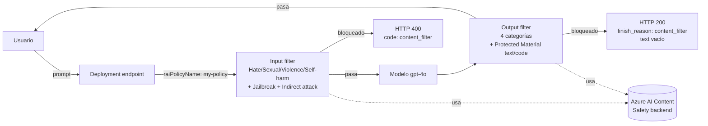
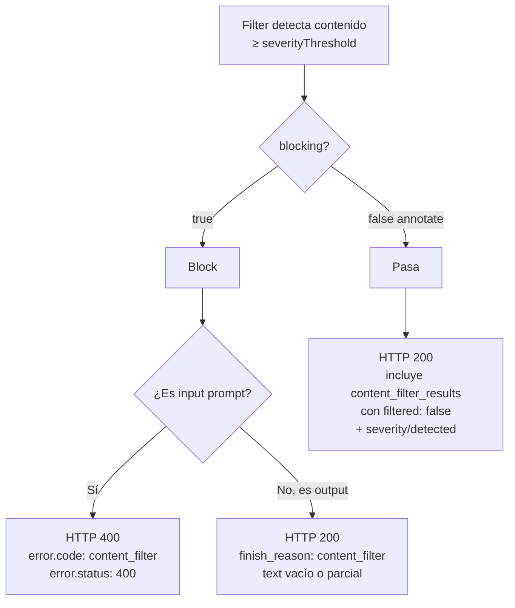
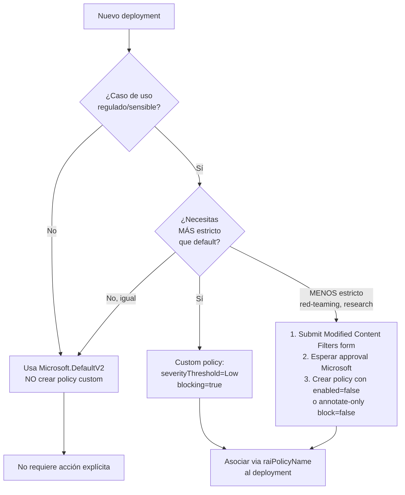
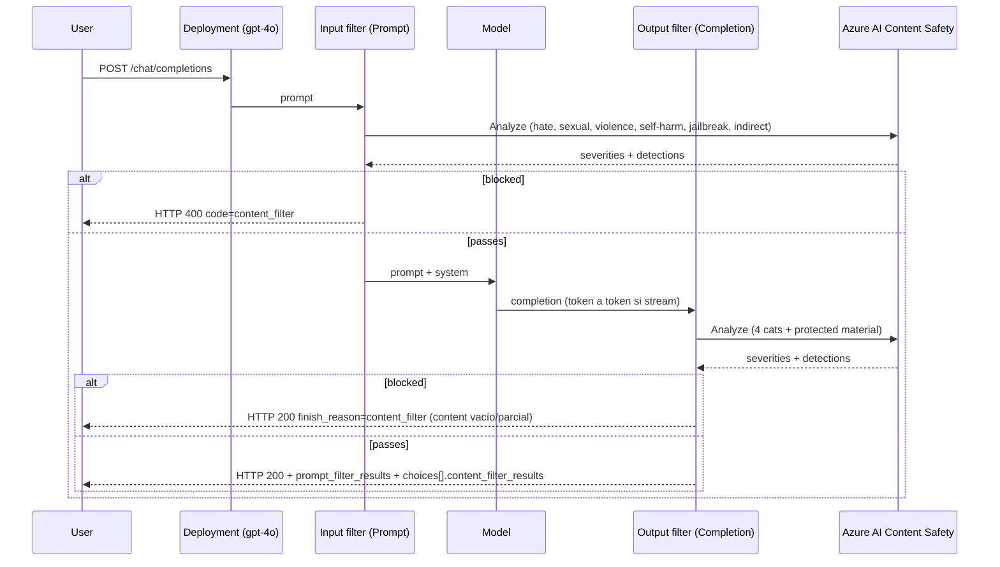

# Content Filters (RAI Policies) en Azure OpenAI / Foundry deployments

> [!abstract] TL;DR
> Un **Content Filter** en Azure OpenAI / Foundry Models es una **RAI policy** (`Microsoft.CognitiveServices/accounts/raiPolicies`) que se asocia **por deployment** vía la propiedad `raiPolicyName` y que usa **Azure AI Content Safety** por debajo para filtrar **prompts (input) y completions (output)**. La policy por defecto en deployments nuevos es **`Microsoft.DefaultV2`** (basePolicy) y bloquea **Medium+** en Hate/Sexual/Violence/Self-harm en ambos sentidos. Block-input → HTTP **400** con `code: content_filter`. Block-output (non-streaming) → HTTP **200** con `finish_reason: content_filter`. Bajar severidad o desactivar requiere **Modified Content Filters approval form**.

## 🎯 Relevancia en el examen

🔥🔥🔥 — Tipo de pregunta más frecuente en dominio A.4:

- **Drag-and-drop Bicep**: completa el bloque `raiPolicies` con `basePolicyName`, `contentFilters[]`, `source`, `severityThreshold`, `blocking`.
- **Multiple choice**: "¿Qué HTTP status devuelve un prompt bloqueado?" (400 vs 200 con finish_reason).
- **Scenario**: "Quieres desactivar el filtro de Hate para clientes finance/legal → ¿qué necesitas?" (Modified RAI form approval).
- **Compare**: `prompt_filter_results` vs `choices[].content_filter_results` — campos diferentes según input/output.
- **Trap clásico**: confundir Content Safety (servicio standalone) con Content Filter (config por deployment que **usa** Content Safety).

## 📖 Concepto en profundidad

### 1. ¿Qué es una RAI policy?

Una RAI policy (Responsible AI policy) es un **recurso hijo de tu Foundry/Azure AI/OpenAI account** (`Microsoft.CognitiveServices/accounts/raiPolicies`) que define:

- Qué categorías de daño filtrar.
- A qué **severidad** filtrar (`Low`, `Medium`, `High`).
- En qué **dirección** (`Prompt` input vs `Completion` output).
- En modo **`blocking: true`** (corta la request) o **`blocking: false`** (annotate-only, deja pasar pero anota).
- Qué **custom blocklists** aplicar.

Una policy se asocia a uno o varios deployments mediante la propiedad **`raiPolicyName`** de `Microsoft.CognitiveServices/accounts/deployments`. **La policy NO se asigna a la account, se asigna a cada deployment** — uno de los traps más recurrentes.



### 2. Anatomía de la RAI policy (Bicep schema verbatim)

Resource type: `Microsoft.CognitiveServices/accounts/raiPolicies@2024-10-01` (también `2025-06-01`, `2026-03-01`).

```bicep
resource raiPolicy 'Microsoft.CognitiveServices/accounts/raiPolicies@2024-10-01' = {
  parent: account
  name: 'string'                       // [a-zA-Z0-9][a-zA-Z0-9_.-]*
  properties: {
    basePolicyName: 'Microsoft.DefaultV2'   // hereda desde una baseline Microsoft
    mode: 'Default'                     // 'Default' | 'Deferred' | 'Blocking' | 'Asynchronous_filter'
    contentFilters: [
      {
        name: 'Hate'                    // categoría
        source: 'Prompt'                // 'Prompt' | 'Completion'
        severityThreshold: 'Medium'     // 'Low' | 'Medium' | 'High'  ← NO existe 'Off' en schema
        blocking: true                  // true=block, false=annotate-only
        enabled: true                   // false desactiva la entrada del filtro
      }
      // … una entrada por (categoría × source)
    ]
    customBlocklists: [
      {
        blocklistName: 'my-blocklist'
        source: 'Prompt'
        blocking: true
      }
    ]
  }
}
```

> [!warning] Trampa schema
> El schema Bicep **solo acepta `Low`/`Medium`/`High`** en `severityThreshold`. Para "Off" (desactivar la categoría) se usa **`enabled: false`** en esa entrada. La operación equivalente a "No filters" o "Annotate only" en el portal **requiere aprobación previa** (Modified Content Filters form).

#### Modos `mode` (raíz de la policy)

| Valor | Significado |
|---|---|
| `Default` | Comportamiento síncrono estándar — filtra antes de devolver. |
| `Blocking` | Igual que `Default` para output; bloqueo total. |
| `Deferred` | Legacy alias. **Usar `Asynchronous_filter` desde 2024-10-01**. |
| `Asynchronous_filter` | Filter chunks llegan **tras** el contenido (menor latencia, especialmente útil en streaming). Annotaciones se entregan asíncronamente. |

### 3. Categorías filtrables (input vs output)

| Categoría | Input (Prompt) | Output (Completion) | Severity? | On por default |
|---|---|---|---|---|
| **Hate** | ✅ | ✅ | Low/Medium/High | Medium (block) |
| **Sexual** | ✅ | ✅ | Low/Medium/High | Medium (block) |
| **Violence** | ✅ | ✅ | Low/Medium/High | Medium (block) |
| **Self-harm** | ✅ | ✅ | Low/Medium/High | Medium (block) |
| **Jailbreak** (User Prompt Attacks / Prompt Shields direct) | ✅ | — | Binary detected/not | On (block) |
| **Indirect prompt attack** (Prompt Shields indirect) | ✅ | — | Binary detected/not | Off por default (requiere document embedding) |
| **Protected Material — Text** | — | ✅ | Binary | On |
| **Protected Material — Code** | — | ✅ | Binary | On (recomendado para CCC coverage) |
| **Groundedness** | — | ✅ | Binary | Off (preview, solo streaming, regiones limitadas) |
| **PII (Personally Identifiable Information)** | — | ✅ | Binary | Off (preview) |
| **Profanity** | — | ✅ (vía blocklist) | — | Built-in blocklist disponible |

> [!important] AI-103
> Para deployments en **vision-enabled chat models** se añade *Identification of Individuals and Inference of Sensitive Attributes* (input). Para **image generation** (DALL·E / GPT-Image-1) se añaden *Deceptive Generation of Political Candidates*, *Depictions of Public Figures*, *Protected Material — Art and Studio Characters* y *Profanity* en prompts.

### 4. Default policy: `Microsoft.DefaultV2`

Es el `basePolicyName` que se aplica automáticamente a deployments nuevos cuando no especificas un `raiPolicyName` custom. Define:

| Categoría | Input | Output | Modo |
|---|---|---|---|
| Hate | Medium | Medium | **Block** |
| Sexual | Medium | Medium | **Block** |
| Violence | Medium | Medium | **Block** |
| Self-harm | Medium | Medium | **Block** |
| Jailbreak | On | — | **Block** |
| Protected Material — Text | — | On | **Block** |
| Protected Material — Code | — | On | **Block** |
| Indirect attack | Off | — | Off por default |

`Microsoft.Default` (sin "V2") sigue existiendo como base legacy y aparece en algunos ejemplos de docs (mismo schema, distinta baseline). **Para AI-103 memoriza `Microsoft.DefaultV2`** como nombre actual del default.

### 5. Severity threshold semantics

`severityThreshold` define **el mínimo a partir del cual se bloquea/anota**. Si pones `Medium`, se filtra **Medium y High**; `Low` no se filtra. Si pones `Low`, se filtra `Low + Medium + High` (más estricto).

| Threshold configurado | Filtra | Configurable sin approval |
|---|---|---|
| `Low` | Low + Medium + High | ✅ |
| `Medium` (default) | Medium + High | ✅ |
| `High` | Solo High | ✅ |
| "No filters" (todo apagado) | Nada | ❌ Requiere [Modified Content Filters form](https://ncv.microsoft.com/uEfCgnITdR) |
| "Annotate only" (block=false) en H/S/V/SH | Anota pero no bloquea | ❌ Requiere approval para las 4 categorías de harm |

Aprobación ≈ **1-3 días hábiles** y solo customers managed elegibles.

### 6. Modo block vs annotate



## 🏗️ Cómo se hace

### Portal (Foundry)

1. Foundry portal → proyecto → **Guardrails + controls** → **Content filters** tab.
2. **+ Create content filter** → nombre + connection.
3. Configurar **Input filters**: sliders Low/Medium/High por categoría + checkboxes para Prompt Shields, Blocklists.
4. Configurar **Output filters**: igual + **Streaming mode** toggle + Protected Material toggles.
5. **Connection** page → asociar a deployment(s).
6. **Review** → **Create filter**.

### Azure CLI

```bash
# 1. Crear la RAI policy custom (vía az resource — no hay subcomando dedicado completo)
az cognitiveservices account deployment create \
  --resource-group rg-ai103 \
  --name my-foundry-account \
  --deployment-name gpt-4o-strict \
  --model-name gpt-4o \
  --model-version "2024-11-20" \
  --model-format OpenAI \
  --sku-capacity 50 \
  --sku-name "GlobalStandard" \
  --rai-policy-name "my-strict-policy"     # ← aquí se enlaza la policy
```

> `--rai-policy-name` debe referenciar una RAI policy **ya creada** en la misma account (se crea vía Bicep / REST / portal).

### Bicep end-to-end — policy custom + deployment

```bicep
param accountName string
param raiPolicyName string = 'finance-strict-v1'

resource account 'Microsoft.CognitiveServices/accounts@2024-10-01' existing = {
  name: accountName
}

// 1. Crear la RAI policy (estricta: Low para todas las categorías)
resource strictPolicy 'Microsoft.CognitiveServices/accounts/raiPolicies@2024-10-01' = {
  parent: account
  name: raiPolicyName
  properties: {
    basePolicyName: 'Microsoft.DefaultV2'
    mode: 'Default'
    contentFilters: [
      // Input filters
      { name: 'Hate',      source: 'Prompt',     severityThreshold: 'Low', blocking: true, enabled: true }
      { name: 'Sexual',    source: 'Prompt',     severityThreshold: 'Low', blocking: true, enabled: true }
      { name: 'Violence',  source: 'Prompt',     severityThreshold: 'Low', blocking: true, enabled: true }
      { name: 'Selfharm',  source: 'Prompt',     severityThreshold: 'Low', blocking: true, enabled: true }
      { name: 'Jailbreak', source: 'Prompt',                                blocking: true, enabled: true }
      { name: 'Indirect Attack', source: 'Prompt',                          blocking: true, enabled: true }
      // Output filters
      { name: 'Hate',      source: 'Completion', severityThreshold: 'Low', blocking: true, enabled: true }
      { name: 'Sexual',    source: 'Completion', severityThreshold: 'Low', blocking: true, enabled: true }
      { name: 'Violence',  source: 'Completion', severityThreshold: 'Low', blocking: true, enabled: true }
      { name: 'Selfharm',  source: 'Completion', severityThreshold: 'Low', blocking: true, enabled: true }
      { name: 'Protected Material Text', source: 'Completion',             blocking: true, enabled: true }
      { name: 'Protected Material Code', source: 'Completion',             blocking: false, enabled: true } // annotate only
    ]
    customBlocklists: [
      { blocklistName: 'finance-pii-blocklist', source: 'Completion', blocking: true }
    ]
  }
}

// 2. Asociar la policy al deployment via raiPolicyName
resource deployment 'Microsoft.CognitiveServices/accounts/deployments@2024-10-01' = {
  parent: account
  name: 'gpt-4o-finance'
  sku: { name: 'GlobalStandard', capacity: 100 }
  properties: {
    model: { format: 'OpenAI', name: 'gpt-4o', version: '2024-11-20' }
    raiPolicyName: strictPolicy.name        // ← aquí
    versionUpgradeOption: 'OnceCurrentVersionExpired'
  }
}
```

### Python — manejar `content_filter_results` y errores 400

```python
import os
from openai import AzureOpenAI, BadRequestError
from azure.identity import DefaultAzureCredential, get_bearer_token_provider

# Keyless (Entra ID) — pattern AI-103
token_provider = get_bearer_token_provider(
    DefaultAzureCredential(),
    "https://cognitiveservices.azure.com/.default",
)

client = AzureOpenAI(
    azure_endpoint=os.environ["AZURE_OPENAI_ENDPOINT"],
    azure_ad_token_provider=token_provider,
    api_version="2024-10-21",
)

try:
    resp = client.chat.completions.create(
        model="gpt-4o-finance",        # deployment con raiPolicyName="finance-strict-v1"
        messages=[
            {"role": "system", "content": "You are a helpful assistant."},
            {"role": "user",   "content": "Tell me about Azure responsible AI."},
        ],
        # Opcional: override de policy por request (solo si existe esa policy en la account)
        extra_headers={"x-policy-id": "finance-strict-v1"},
    )

    # --- Input no fue bloqueado: inspeccionar prompt_filter_results ---
    for pf in resp.prompt_filter_results or []:
        print(f"prompt[{pf['prompt_index']}] →", pf["content_filter_results"])
        # { "hate": {"filtered": false, "severity": "safe"}, ... }

    choice = resp.choices[0]
    # --- Output finish_reason ---
    if choice.finish_reason == "content_filter":
        print("Output filtrado por RAI policy. Mostrar fallback al usuario.")
    else:
        # --- Output annotations ---
        ocf = choice.content_filter_results or {}
        if "error" in ocf:
            # Filter unavailable → request pasó SIN filtrar (Scenario 6)
            print("⚠️ Filter unavailable:", ocf["error"])
        print(choice.message.content)

except BadRequestError as e:
    # --- Input bloqueado: HTTP 400 con code=content_filter ---
    body = e.response.json() if hasattr(e, "response") else {}
    err = body.get("error", {})
    if err.get("code") == "content_filter":
        # Inner details: qué categoría disparó el bloqueo
        details = err.get("innererror", {}).get("content_filter_result", {})
        print("Input bloqueado por:", details)
        # Estructura típica:
        # { "hate": {"filtered": true, "severity": "medium"}, "jailbreak": {"filtered": true, "detected": true}, ... }
    else:
        raise
```

### Python — streaming con filter chunks

```python
stream = client.chat.completions.create(
    model="gpt-4o-finance",
    messages=[{"role": "user", "content": "Write me a story."}],
    stream=True,
    stream_options={"include_usage": True},
)

for chunk in stream:
    if not chunk.choices:
        continue
    choice = chunk.choices[0]

    # Cada delta puede traer content_filter_results de ESE chunk
    cf = getattr(choice, "content_filter_results", None)
    if cf:
        # Detectar filtrado mid-stream
        for cat, res in cf.items():
            if isinstance(res, dict) and res.get("filtered"):
                print(f"⚠️ Chunk filtered: {cat}")

    if choice.delta and choice.delta.content:
        print(choice.delta.content, end="", flush=True)

    if choice.finish_reason == "content_filter":
        print("\n[STREAM CORTADO POR FILTER]")
        break
```

### REST — response format ejemplos

Input bloqueado (HTTP 400):

```json
{
  "error": {
    "message": "The response was filtered due to the prompt triggering Azure OpenAI's content management policy.",
    "type": null,
    "param": "prompt",
    "code": "content_filter",
    "status": 400,
    "innererror": {
      "code": "ResponsibleAIPolicyViolation",
      "content_filter_result": {
        "hate":      { "filtered": true,  "severity": "high" },
        "sexual":    { "filtered": false, "severity": "safe" },
        "violence":  { "filtered": false, "severity": "safe" },
        "self_harm": { "filtered": false, "severity": "safe" },
        "jailbreak": { "filtered": false, "detected": false }
      }
    }
  }
}
```

Input pasa, output anotado (HTTP 200):

```json
{
  "id": "chatcmpl-...",
  "object": "chat.completion",
  "model": "gpt-4o",
  "prompt_filter_results": [
    {
      "prompt_index": 0,
      "content_filter_results": {
        "hate":      { "filtered": false, "severity": "safe" },
        "sexual":    { "filtered": false, "severity": "safe" },
        "violence":  { "filtered": false, "severity": "safe" },
        "self_harm": { "filtered": false, "severity": "safe" },
        "jailbreak": { "filtered": false, "detected": false }
      }
    }
  ],
  "choices": [
    {
      "index": 0,
      "finish_reason": "stop",
      "message": { "role": "assistant", "content": "..." },
      "content_filter_results": {
        "hate":      { "filtered": false, "severity": "safe" },
        "sexual":    { "filtered": false, "severity": "safe" },
        "violence":  { "filtered": false, "severity": "safe" },
        "self_harm": { "filtered": false, "severity": "safe" },
        "protected_material_text": { "filtered": false, "detected": false },
        "protected_material_code": { "filtered": false, "detected": false, "citation": null }
      }
    }
  ]
}
```

Output bloqueado (HTTP 200, finish_reason filter):

```json
{
  "choices": [
    {
      "index": 0,
      "finish_reason": "content_filter",
      "message": { "role": "assistant", "content": "" },
      "content_filter_results": {
        "violence": { "filtered": true, "severity": "high" }
      }
    }
  ]
}
```

### Request-level override

```bash
curl -X POST https://<account>.openai.azure.com/openai/deployments/gpt-4o/chat/completions?api-version=2024-10-21 \
  -H "api-key: $KEY" \
  -H "x-policy-id: legal-strict-v3" \   # ← override de la policy del deployment para ESTA llamada
  -H "Content-Type: application/json" \
  -d '{ "messages": [{"role":"user","content":"…"}] }'
```

Si `x-policy-id` referencia una policy inexistente: **HTTP 400 `InvalidContentFilterPolicy`**. **No** funciona para image-input scenarios — se aplica el filtro del deployment.

## 📊 Tablas comparativas y árboles de decisión

### Filter level decision tree



### Annotate vs Block — comportamiento

| Aspecto | Block (`blocking: true`) | Annotate-only (`blocking: false`) |
|---|---|---|
| Input infringe | HTTP **400**, `code: content_filter` | HTTP 200, `prompt_filter_results` con `filtered: false` pero `severity: medium/high` |
| Output infringe | HTTP **200**, `finish_reason: content_filter`, content vacío/parcial | HTTP 200, `finish_reason: stop`, content completo, `content_filter_results.<cat>.filtered: false` con severity reflejada |
| Aprobación Microsoft requerida | No | **Sí** para H/S/V/SH; No para Protected Material o Jailbreak |
| Caso de uso | Producción consumer-facing | Red-teaming, telemetría, dashboards de auditoría |

### Donde aplica el filter



## 🪤 Trampas del examen

1. **`raiPolicyName` se asigna POR DEPLOYMENT**, no por account/resource. Es propiedad de `accounts/deployments`, no de `accounts`.
2. **Default policy = `Microsoft.DefaultV2`** (no `DefaultV2` a secas, no `Microsoft.Default` — ése es la baseline legacy v1).
3. **`severityThreshold` solo acepta `Low`/`Medium`/`High`** en el schema Bicep. Para "Off" usa `enabled: false`. **No existe el literal `'Off'`** en API.
4. **Default threshold = `Medium`** → bloquea Medium **y** High. `Low` no se bloquea por default.
5. **Input bloqueado → HTTP 400** con `error.code = "content_filter"`. **No** es 200 con content vacío.
6. **Output bloqueado (non-stream) → HTTP 200** con `finish_reason: "content_filter"`. **Ojo**: la request es exitosa, el filtro corta el contenido.
7. **`prompt_filter_results`** (top-level, plural array indexado por `prompt_index`) ≠ **`choices[i].content_filter_results`** (objeto por choice). Dos campos distintos.
8. **Jailbreak e Indirect attack son INPUT-only** (parte de Prompt Shields).
9. **Protected Material Text/Code y Profanity son OUTPUT-only**. Profanity se aplica via **blocklists** (la built-in Microsoft profanity blocklist), no como un `contentFilter` entry.
10. **Streaming + filtros**: en `mode: 'Default'/'Blocking'` el filter examina chunks y puede **cortar mid-stream** (`finish_reason: content_filter` en el último chunk). En `mode: 'Asynchronous_filter'` los chunks salen antes y las annotations llegan después (menor latencia, más riesgo).
11. **Modificar una policy = crear nueva y reasignar** en muchos casos: aunque el API permite update, **deployments pueden cachear** la config previa; práctica recomendada es versionar policy y reasignar.
12. **Apagar Hate/Sexual/Violence/Self-harm requiere Modified Content Filters form approval**. Apagar Profanity o Protected Material **no** requiere approval.
13. **Indirect prompt attack requiere document embedding/formatting** en el prompt (delimitadores `<documents>...</documents>`). Sin contexto external, el filtro no aplica.
14. **Filter aplica por turn** en multi-turn chat. En **Foundry Agent Service**, el filter aplica por **Run** (no acumulado en el thread).
15. **`x-policy-id` header override** funciona en chat/completions de texto, **no en image input**. La policy referenciada debe existir o devuelve `InvalidContentFilterPolicy`.
16. **Content Safety standalone ≠ Content Filter**. Content Safety es un servicio API independiente (`Microsoft.CognitiveServices` kind=`ContentSafety`) para que **tu app** modere texto/imagen on-demand. Content Filter es la **integración automática** en deployments OpenAI/Foundry. Ambos comparten backend pero son superficies distintas. Ver [[responsible-content-safety-overview]].
17. **Scenario 6 (filter unavailable)**: si Content Safety está caído, la request **pasa sin filtrar** con HTTP 200 y `content_filter_results.error.code: content_filter_error`. Tu app **debe verificar** ese campo.
18. **Whisper (audio) NO tiene content filter aplicable**. Ojo en preguntas sobre transcripción.

## 🧠 Mnemotecnia

### "RAI = **R**esource **A**ssigned per-deployment **I**ndividually"
La policy es Recurso, se Asocia por deployment, e Individualmente por categoría/source.

### Categorías input vs output: **"JIH-PPP"**
- **Input extras** = **JI** = **J**ailbreak + **I**ndirect attack.
- **Output extras** = **PPP** = **P**rotected text + **P**rotected code + **P**rofanity.
- Hate/Sexual/Violence/Self-harm están en ambos (las 4 "core" HSV-S).

### HTTP codes — **"4-input, 2-output"**
- **4**00 si bloquean tu **input** (cliente envió algo malo).
- **2**00 con `finish_reason: content_filter` si bloquean el **output** (la API respondió OK, pero el modelo iba a generar algo malo).

### Severity threshold mental model — **"corte hacia arriba"**
Configurar `Medium` significa **"corto desde Medium hacia arriba"** → bloquea Medium y High. **Bajar threshold = más estricto** (cortas más cosas).

### Modos — **"DBDA"**
**D**efault → síncrono normal. **B**locking → síncrono total. **D**eferred → legacy, **A**synchronous_filter es el nombre moderno (≥ 2024-10-01).

## 🔗 Conceptos relacionados

- [[responsible-content-safety-overview]] — el servicio backend Azure AI Content Safety que usa internamente esta integración.
- [[responsible-blocklists-custom-filters]] — `customBlocklists` y la profanity blocklist built-in.
- [[responsible-prompt-shields]] — Jailbreak (User Prompt Attacks) + Indirect Prompt Attacks en profundidad.
- [[responsible-groundedness-detection]] — output filter de groundedness (preview, streaming-only).
- [[plan-deployment-options-models-agents]] — dónde encaja `raiPolicyName` en el deployment.
- [[plan-model-agent-deployment-configuration]] — propiedades completas de un deployment.
- [[00-microsoft-foundry-overview]] — arquitectura general Foundry.
- [[agents-microsoft-foundry-agent-service]] — cómo aplica el filter por Run en agentes.

## ❓ Autotest

**1.** Tras crear un deployment GPT-4o sin especificar `raiPolicyName`, un prompt con contenido de violencia severidad **Low** ¿qué ocurre?

- a) HTTP 400 `content_filter`
- b) HTTP 200 con `finish_reason: content_filter`
- c) HTTP 200 normal, `prompt_filter_results` indica `severity: low, filtered: false`
- d) HTTP 200 normal, sin `prompt_filter_results`

<details><summary>Respuesta</summary>
<b>c</b>. Microsoft.DefaultV2 bloquea desde Medium. Low no se filtra, pero la annotation aparece en <code>prompt_filter_results</code> con <code>filtered: false</code> y <code>severity: "low"</code>.
</details>

**2.** Quieres permitir contenido de violencia **High** en un deployment para un cliente de medios que crea contenido bélico autorizado. ¿Cuál es el camino correcto?

- a) Set `severityThreshold: 'Off'` en Bicep para Violence
- b) Crear policy custom con `enabled: false` en la entrada Violence + completar Modified Content Filters form
- c) Borrar la policy del deployment dejándolo sin filtro
- d) Cambiar `mode` a `Asynchronous_filter`

<details><summary>Respuesta</summary>
<b>b</b>. El schema no admite <code>'Off'</code>; se usa <code>enabled: false</code> o <code>blocking: false</code> (annotate). Cualquier desactivación en H/S/V/SH <b>requiere aprobación previa</b> del Modified Content Filters form (1-3 días). Borrar la policy no es posible: el deployment cae en Microsoft.DefaultV2.
</details>

**3.** ¿Qué campo de la response indica que un prompt cumplía la policy pero contenía contenido detectado a severidad media sin filtrar?

- a) `error.innererror.content_filter_result`
- b) `choices[0].finish_reason`
- c) `prompt_filter_results[0].content_filter_results.<cat>.severity`
- d) `usage.filter_tokens`

<details><summary>Respuesta</summary>
<b>c</b>. <code>prompt_filter_results</code> (array top-level, indexado por <code>prompt_index</code>) contiene <code>content_filter_results</code> con severity por categoría aunque <code>filtered: false</code>. <code>error.innererror</code> solo aparece en HTTP 400.
</details>

**4.** En streaming chat completions con `mode: 'Default'`, el modelo empieza a generar texto y a mitad de la stream el output filter detecta self-harm severidad high. ¿Qué ve el cliente?

- a) HTTP 400 al inicio
- b) Stream se interrumpe; último chunk trae `finish_reason: "content_filter"`
- c) Stream sigue normal y al final `usage.filter_violations: 1`
- d) Stream completo y luego una segunda llamada de annotation diferida

<details><summary>Respuesta</summary>
<b>b</b>. En <code>Default</code>/<code>Blocking</code> el filtro es síncrono y corta el stream. El último chunk lleva <code>finish_reason: "content_filter"</code>. En <code>Asynchronous_filter</code> el stream sale antes y los filter chunks llegan después.
</details>

**5.** ¿Qué propiedad asocia una RAI policy a un deployment GPT-4o vía Bicep?

- a) `properties.contentFilterPolicy` en `Microsoft.CognitiveServices/accounts`
- b) `properties.raiPolicyName` en `Microsoft.CognitiveServices/accounts/deployments`
- c) `tags.raiPolicy` en el resource group
- d) Header `x-policy-id` (solo runtime)

<details><summary>Respuesta</summary>
<b>b</b>. La policy se enlaza al deployment con <code>properties.raiPolicyName: '&lt;policyName&gt;'</code>. Asignarla a la account no existe. El header <code>x-policy-id</code> es override <b>runtime</b> por request, no la asociación persistente.
</details>

**6.** Un developer cambia los thresholds en una RAI policy existente, pero el deployment sigue rechazando prompts que antes pasaban. ¿Qué es lo más probable?

- a) Falta esperar replicación: re-crear la policy con nombre nuevo y reasignar al deployment
- b) Hay que aumentar la quota del deployment
- c) Es necesario reiniciar el Foundry hub
- d) Falta dar rol "Cognitive Services Contributor" al app principal

<details><summary>Respuesta</summary>
<b>a</b>. Best practice: versionar policies (<code>finance-v1</code>, <code>finance-v2</code>) y reasignar al deployment con la nueva. Updates in-place pueden tardar/cachear; el patrón Microsoft recomendado es crear nueva + reasignar.
</details>

## ✅ Control de calidad (auto-rúbrica)

| Dimensión | Nota | Justificación |
|---|---|---|
| Completitud | **10/10** | Cubre los 12 sub-puntos del brief: schema Bicep, severidades, modos, default policy, custom filters, asignación a deployment, approval flow, response format, streaming, multi-turn/agents, override por request, disable/bypass. |
| Exactitud técnica | **9.5/10** | Schema Bicep verbatim de docs (severityThreshold ∈ {Low,Medium,High}, mode ∈ {Default,Deferred,Blocking,Asynchronous_filter}, source ∈ {Prompt,Completion}), HTTP codes verbatim, ejemplos de response verbatim de Microsoft Learn, Microsoft.DefaultV2 confirmado en docs default-safety-policies. |
| Alineación al examen | **9.5/10** | 18 traps específicas (no genéricas), 6 preguntas estilo examen con escenarios reales, decisión tree, snippets Python con manejo completo de errors. |
| Claridad pedagógica | **9/10** | 3 diagramas mermaid (flowchart arquitectura, decision tree, sequence completo), tablas comparativas, mnemotecnia (RAI, JIH-PPP, 4-input/2-output, DBDA), <details> para autotests. |

*Verificado a fecha 2026-05-22 contra Microsoft Learn.*
