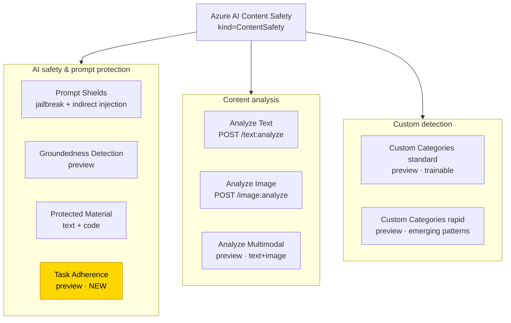
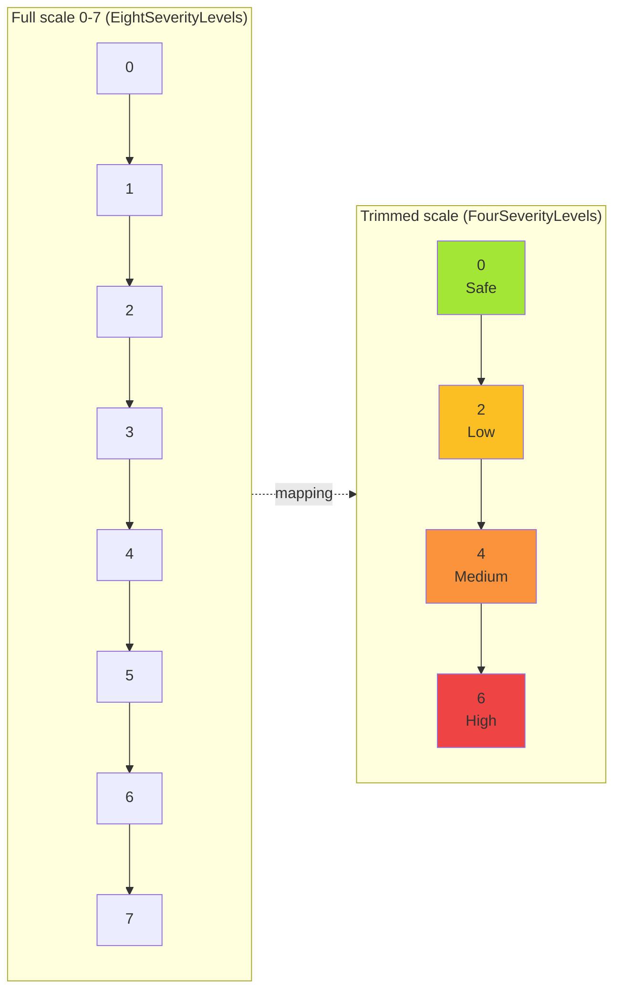
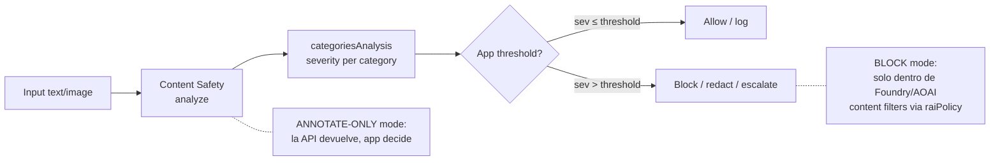
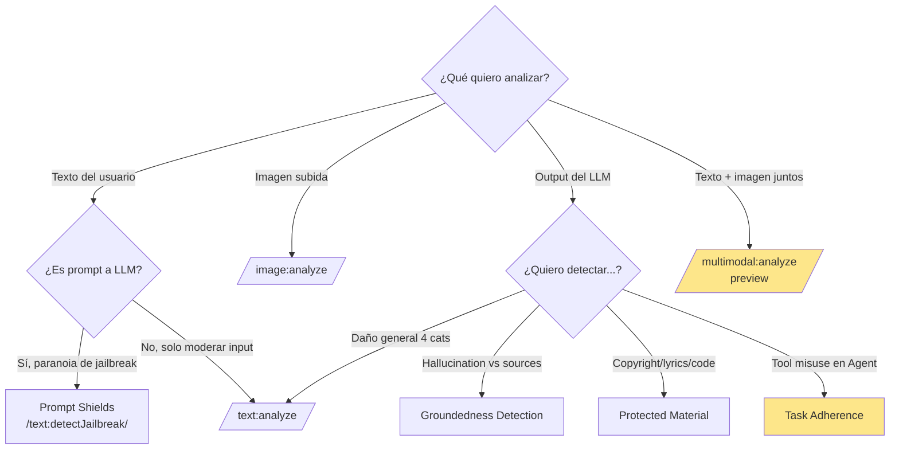

# Azure AI Content Safety — Overview Master

> [!abstract] TL;DR
> **Azure AI Content Safety** es el servicio independiente (`Microsoft.CognitiveServices/accounts`, kind `ContentSafety`) que detecta contenido dañino en texto, imagen y multimodal según **4 categorías** (Hate, Sexual, Violence, SelfHarm) con **escala de severidad 0-7** (full) o **trimmed 0/2/4/6** (FourSeverityLevels). Incluye además **Prompt Shields**, **Groundedness Detection**, **Protected Material**, **Custom Categories** y la nueva **Task Adherence**. Es el motor subyacente que usan los **content filters de Azure OpenAI / Foundry deployments**. En AI-103, este overview es el "tronco" del que se ramifican el resto de archivos de Responsible AI.

## 🎯 Relevancia en el examen

🔥🔥🔥 — **Pregunta casi garantizada**. Microsoft examina:

| Tipo de pregunta | Escenario típico |
|---|---|
| **Drag-and-drop categorías** | Mapear casos de uso a `Hate` / `Sexual` / `Violence` / `SelfHarm` |
| **Escala de severidad** | Diferencia entre `FourSeverityLevels` y `EightSeverityLevels`, qué devuelve image vs text |
| **Best practice** | "User wants to detect harmful content in a chatbot" → Content Safety (no Language Service, no Computer Vision) |
| **Selección API** | `text:analyze` vs `image:analyze` vs `multimodal:analyze` vs Prompt Shields |
| **Resource kind** | `ContentSafety` vs `AIServices` para deployment de filtros |
| **Pricing tier** | F0 (free, 5 RPS) vs S0 (1000 RP10S) — qué pasa al exceder |
| **Integration con OpenAI** | Content Safety standalone vs content filters en deployments |

## 📖 Concepto en profundidad

### Qué es Azure AI Content Safety

Servicio cognitivo independiente para detectar **contenido dañino generado por usuarios o por IA** en texto e imagen. Verbatim docs:

> "Azure AI Content Safety is an AI service that detects harmful user-generated and AI-generated content in applications and services."

Es la **misma tecnología** que corre por debajo de los content filters de Azure OpenAI / Foundry models — la diferencia es que aquí lo expones como API standalone para moderar contenido de **cualquier origen** (no solo LLM outputs).

> [!warning] No confundir
> - **Content Safety (standalone)** = resource `kind=ContentSafety` + APIs `/contentsafety/...` → tú decides qué hacer con el resultado.
> - **Content Filters en Azure OpenAI / Foundry deployments** = configuración `raiPolicy` del deployment que USA Content Safety por debajo y **bloquea automáticamente** completions ([[responsible-content-filters-azure-openai]]).

### Mapa completo de capacidades



### Las 4 categorías de daño (VERBATIM Microsoft)

> [!important] Memorizar verbatim — caen en preguntas literales

| Categoría (display) | API term | Definición resumida | Incluye |
|---|---|---|---|
| **Hate and Fairness** | `Hate` | Contenido que ataca o usa lenguaje discriminatorio hacia personas/grupos por atributos diferenciales | raza, etnicidad, nacionalidad, género, orientación sexual, religión, apariencia, discapacidad, **harassment & bullying** |
| **Sexual** | `Sexual` | Lenguaje sobre órganos anatómicos, genitales, relaciones románticas, actos sexuales (incl. forzados) | desnudos, pornografía, prostitución, abuso, **explotación infantil** |
| **Violence** | `Violence` | Acciones físicas para herir, dañar o matar; armas y entidades relacionadas | armas, bullying, terrorismo, **stalking** |
| **Self-Harm** | `SelfHarm` | Acciones físicas para dañarse a uno mismo o suicidio | trastornos alimentarios, autolesiones, suicidio |

> [!danger] Trampa frecuente
> El examen pregunta "user complains of cyberbullying" → categoría = **Hate** (harassment cae dentro de Hate, **NO** existe categoría "Harassment" separada). Stalking = **Violence**.

> [!note] Categoría adicional (2025+)
> **Task Adherence** (preview) — para AI Agents. Detecta cuando un agente usa tools de forma desalineada con la intención del usuario. NO devuelve severity 0-7, devuelve disagreement signals. Cubierta en archivo de agentes.

### Escala de severidad — la trampa más importante



**Reglas exactas según modalidad** (VERBATIM docs):

| Modalidad | Soporta `EightSeverityLevels` (0-7) | Soporta `FourSeverityLevels` (0,2,4,6) | Default |
|---|---|---|---|
| **Text** | ✅ Sí | ✅ Sí (mapping `[0,1]→0`, `[2,3]→2`, `[4,5]→4`, `[6,7]→6`) | configurable |
| **Image** | ❌ **NO** | ✅ Solo este | `FourSeverityLevels` forzado |
| **Multimodal (text+image)** | ✅ Sí | ✅ Sí | configurable |

> [!danger] Trampa quirúrgica de examen
> Si el examen pregunta "para image analysis, ¿qué `outputType` puedo pedir?" → **solo** `FourSeverityLevels`. Image NUNCA devuelve 1, 3, 5 ni 7.

**Semántica de los niveles**:

- `0` = **Safe** — analizado y safe (NO significa "no analizado").
- `2` = **Low** — referencias generales, contextos educativos/médicos/journalistic.
- `4` = **Medium** — sentimiento negativo activo, descripciones gráficas medias.
- `6` = **High** — propaganda de odio, gore, instrucciones explícitas, glorificación.

### Output format (categoriesAnalysis)

```json
{
  "blocklistsMatch": [ /* solo si se usaron blocklists */ ],
  "categoriesAnalysis": [
    { "category": "Hate",     "severity": 2 },
    { "category": "SelfHarm", "severity": 0 },
    { "category": "Sexual",   "severity": 0 },
    { "category": "Violence", "severity": 0 }
  ]
}
```

**Multi-label**: un mismo input puede recibir severity > 0 en múltiples categorías a la vez.

### Modos operativos: annotate vs block



> [!tip] Decisión arquitectónica
> - **Content Safety standalone** → siempre annotate-only. Tu app decide.
> - **Content Filters en deployment** → block automático (configurable per category/severity).
> - Combinar ambos en producción: filter en deployment + Content Safety adicional sobre inputs/outputs externos.

## 🏗️ Cómo se hace

### Azure CLI — crear recurso standalone

```bash
# Resource group
az group create --name rg-contentsafety --location eastus

# Content Safety resource (kind=ContentSafety)
az cognitiveservices account create \
  --name cs-prod-001 \
  --resource-group rg-contentsafety \
  --location eastus \
  --kind ContentSafety \
  --sku S0 \
  --custom-domain cs-prod-001 \
  --assign-identity

# Obtener endpoint y key
az cognitiveservices account show \
  --name cs-prod-001 \
  --resource-group rg-contentsafety \
  --query properties.endpoint -o tsv

az cognitiveservices account keys list \
  --name cs-prod-001 \
  --resource-group rg-contentsafety
```

### Bicep — recurso con identidad (keyless preferido AI-103)

```bicep
param location string = resourceGroup().location
param contentSafetyName string = 'cs-prod-001'

resource contentSafety 'Microsoft.CognitiveServices/accounts@2024-10-01' = {
  name: contentSafetyName
  location: location
  kind: 'ContentSafety'
  sku: {
    name: 'S0'
  }
  identity: {
    type: 'SystemAssigned'
  }
  properties: {
    customSubDomainName: contentSafetyName
    publicNetworkAccess: 'Enabled'
    disableLocalAuth: true   // ⚠️ fuerza Entra ID (keyless)
  }
}

output endpoint string = contentSafety.properties.endpoint
output principalId string = contentSafety.identity.principalId
```

### Python SDK — analyze_text (keyless con DefaultAzureCredential)

```python
# pip install azure-ai-contentsafety azure-identity
import os
from azure.ai.contentsafety import ContentSafetyClient
from azure.ai.contentsafety.models import (
    AnalyzeTextOptions, TextCategory, AnalyzeTextOutputType
)
from azure.identity import DefaultAzureCredential
from azure.core.exceptions import HttpResponseError

endpoint = os.environ["CONTENT_SAFETY_ENDPOINT"]

# Keyless (Entra ID) — patrón AI-103 preferido
client = ContentSafetyClient(endpoint, DefaultAzureCredential())

request = AnalyzeTextOptions(
    text="I want to hurt myself",
    categories=[TextCategory.HATE, TextCategory.SELF_HARM,
                TextCategory.SEXUAL, TextCategory.VIOLENCE],
    output_type=AnalyzeTextOutputType.EIGHT_SEVERITY_LEVELS,  # full 0-7
    halt_on_blocklist_hit=False
)

try:
    response = client.analyze_text(request)
except HttpResponseError as e:
    print(f"Error: {e.error.code} — {e.error.message}")
    raise

# Aplicar threshold custom
THRESHOLD = 4  # bloquear medium+ en cualquier categoría
blocked = False
for item in response.categories_analysis:
    print(f"{item.category}: severity={item.severity}")
    if item.severity >= THRESHOLD:
        blocked = True

print("BLOCKED" if blocked else "ALLOWED")
```

### Python SDK — analyze_image

```python
from azure.ai.contentsafety.models import (
    AnalyzeImageOptions, ImageData, ImageCategory
)

with open("user_upload.jpg", "rb") as f:
    request = AnalyzeImageOptions(image=ImageData(content=f.read()))

response = client.analyze_image(request)
# Image SIEMPRE devuelve FourSeverityLevels (0,2,4,6)
for item in response.categories_analysis:
    print(f"{item.category}: severity={item.severity}")
```

> [!note] Image data: dos modos
> - `ImageData(content=<bytes>)` — bytes base64 (≤ 4 MB, 50×50 a 7200×7200).
> - `ImageData(blob_url="https://...")` — URL a Azure Blob; requiere Managed Identity del Content Safety con rol **Storage Blob Data Contributor** (o Owner) sobre el storage.

### Python SDK — analyze_multimodal (preview)

```python
# Multimodal combina texto + imagen en un solo call
# ⚠️ Preview, regiones limitadas (East US, West Europe)
import base64
from azure.ai.contentsafety.models import (
    AnalyzeMultimodalOptions, MultimodalRequestInputContent
)

with open("meme.png", "rb") as f:
    img_b64 = base64.b64encode(f.read()).decode()

request = AnalyzeMultimodalOptions(
    contents=[
        MultimodalRequestInputContent(text="Look at this image"),
        MultimodalRequestInputContent(image=ImageData(content=img_b64))
    ]
)
response = client.analyze_multimodal(request)
```

> [!warning] `MultimodalRequestInputContent` y `analyze_multimodal` — API preview, los nombres exactos pueden variar entre versiones del SDK. Verifica con `dir(client)` en tu entorno. La REST equivalente es `POST /contentsafety/multimodal:analyze?api-version=2024-09-15-preview`.

### REST API directo

```bash
curl -X POST "https://<resource>.cognitiveservices.azure.com/contentsafety/text:analyze?api-version=2024-09-01" \
  -H "Ocp-Apim-Subscription-Key: <key>" \
  -H "Content-Type: application/json" \
  -d '{
    "text": "I hate you",
    "categories": ["Hate","Sexual","SelfHarm","Violence"],
    "outputType": "FourSeverityLevels",
    "haltOnBlocklistHit": true,
    "blocklistNames": ["company-profanity"]
  }'
```

**Endpoints clave**:

| Endpoint | Versión actual GA |
|---|---|
| `POST /contentsafety/text:analyze` | `api-version=2024-09-01` |
| `POST /contentsafety/image:analyze` | `api-version=2024-09-01` |
| `POST /contentsafety/multimodal:analyze` | preview |
| `POST /contentsafety/text:detectJailbreak` (Prompt Shields) | `api-version=2024-09-01` |
| `POST /contentsafety/text:detectProtectedMaterial` | `api-version=2024-09-01` |
| `POST /contentsafety/text:detectGroundedness` | preview |

## 📊 Tablas comparativas

### Content Safety standalone vs Content Filter en Foundry deployment

| Aspecto | Standalone Content Safety | Content Filter (Foundry/AOAI) |
|---|---|---|
| Recurso | `kind=ContentSafety` | Configurado dentro de `kind=AIServices` o AOAI |
| API | `/contentsafety/*` | Implícita en `/chat/completions` |
| Decisión | Annotate-only — app decide | Block automático según `raiPolicy` |
| Cuándo usar | Moderar contenido externo (uploads, chat user-to-user) | Proteger LLM completions |
| Coste | Por 1000 records | Incluido en deployment (default), custom = extra |
| Configuración granular | Total (thresholds custom) | Limitada a default/low/medium/high |

### Límites de input por feature

| Feature | Default max input |
|---|---|
| Analyze text | **10 000 caracteres** |
| Analyze image | **4 MB**, 50×50 a 7200×7200 px (JPEG/PNG/GIF/BMP/TIFF/WEBP) |
| Multimodal | Text **1K chars** + Image 4 MB |
| Prompt Shields | 10K chars prompt + hasta 5 docs (10K total) |
| Groundedness | Sources 55 000 chars · Query 7 500 chars · min 3 palabras |
| Protected Material | 10K chars max · **mínimo 110 chars** (solo LLM completions) |
| Custom Categories (standard) | 1K chars inference |
| Task Adherence | 100K chars |

### Pricing tiers y rate limits (RPS / RP10S)

| Tier | Text + Image moderation | Prompt Shields | Protected Material | Groundedness | Multimodal |
|---|---|---|---|---|---|
| **F0** (free) | 5 RPS | 5 RPS | 5 RPS | N/A | 5 RPS |
| **S0** (standard) | 1000 RP10S | 1000 RP10S | 1000 RP10S | 50 RPS | 10 RPS |

> [!tip] F0 vs S0 — trampa de examen
> F0 = free, **5 RPS hard cap**. S0 escala a 1000 RP10S (= 100 RPS sostenido). Groundedness **no existe en F0**. Multimodal en S0 es solo 10 RPS (más lento que text).

### Idiomas soportados

- **Trained & tested**: Chinese, English, French, German, Spanish, Italian, Japanese, Portuguese.
- **English only**: Protected Material, Groundedness Detection, Custom Categories (standard).
- Otras lenguas funcionan con calidad variable.

### Árbol de decisión: ¿qué API usar?



## 🪤 Trampas del examen

1. **4 categorías exactas**: `Hate`, `Sexual`, `Violence`, `SelfHarm` (camelCase en API). **NO existe** "Harassment" (cae en Hate) ni "Misinformation" ni "Profanity" (eso es blocklist).
2. **Severity image ≠ severity text**: Image **SOLO** devuelve 0/2/4/6 (`FourSeverityLevels` forzado). Text y Multimodal soportan ambos `FourSeverityLevels` y `EightSeverityLevels`.
3. **Severity 0 = "safe and analyzed"**, NO "no se analizó". El modelo siempre corre y siempre devuelve un valor.
4. **Saltos de 2 en trimmed**: 0 → 2 → 4 → 6. NO hay "1" en trimmed. Sí en full (0-7).
5. **Content Safety standalone ≠ Content Filters de AOAI/Foundry**: el primero es API; los segundos son configuración del deployment que USA el primero por debajo. La pregunta examen confunde a propósito.
6. **`kind=ContentSafety`** para resource standalone; **NO** uses `CognitiveServices` ni `AIServices` si solo necesitas Content Safety puro.
7. **Multi-label es real**: un mismo texto puede tener `Hate=4` y `Violence=6` simultáneamente; el bloqueo debe considerar TODAS.
8. **Blob URL para imágenes requiere Managed Identity + role `Storage Blob Data Contributor`** sobre el storage. Si solo das key del storage en el body → error.
9. **Prompt Shields se factura aparte** dentro de Content Safety (rate limit propio).
10. **Groundedness sin source documents NO funciona** — necesita pasar `groundingSources` en el body. No es "detector de alucinaciones a ciegas".
11. **Protected Material para texto requiere mínimo 110 caracteres** (solo LLM completions, no user prompts). Pregunta capciosa: "¿puedo escanear un prompt de 50 chars?" → NO.
12. **Pricing por 1000 records analizados**, NO por tokens. Cada analyze call = 1 record por modalidad.
13. **Custom Categories (standard)** requiere training data (ejemplos +/-) y entrena un classifier; **NO** se entrena con prompt-engineering. Custom Categories **rapid** es diferente (patrones emergentes, sin training).
14. **Container disconnected** soportado para escenarios on-prem/regulated — examen pregunta "compliance HIPAA on-prem" → container option.
15. **`haltOnBlocklistHit`**: cuando true, si una blocklist match → la API **no ejecuta** los modelos de daño (ahorras coste, pero pierdes info).
16. **Region availability dispar**: Groundedness solo en East US, East US 2, France Central, Sweden Central, UK South, West US. Multimodal aún más restringido (East US, West Europe principalmente).
17. **Task Adherence (nuevo 2025)** es para agentes, NO devuelve severity 0-7 como las 4 categorías clásicas.
18. **API key vs Entra ID**: el patrón AI-103 prefiere **keyless** (DefaultAzureCredential + role `Cognitive Services User`). El examen penaliza key-based en producción.
19. **No detecta CSAM intencionadamente** — verbatim: *"You can't use Azure AI Content Safety to detect illegal child exploitation images."* (eso es PhotoDNA).
20. **Categorías son el mismo set en text e image**, pero las definiciones de severity por categoría difieren ligeramente entre modalidades.

## 🧠 Mnemotecnia

### Las 4 categorías: **"H-S-V-S"** o **"Heavy SAS"**

> **H**ate · **S**exual · **V**iolence · **S**elf-harm  
> = **"Heavy Sexual-violence Annoys Society"**

Otra: **"HoSpiVa"** (HOdio, SeXo, VIolencia, AutoLEsion) — pronuncia como un hospital donde tratan estos casos.

### Severity scale: **"0-2-4-6 saltos de bicicleta"**

Imagina las marchas de una bici: **0 plano**, **2 cuesta suave**, **4 cuesta media**, **6 cuesta dura**. Saltos de 2 = engranajes pares. La full scale 0-7 son los engranajes intermedios solo en `EightSeverityLevels`.

### Image-only-Four

**"Image is Four-eyes"** → image SIEMPRE devuelve solo 4 niveles (0,2,4,6). Si te dicen "image severity 5" → trampa, imposible.

### Modos de operación: **"AB-test"**

- **A**nnotate (standalone) = **A**nálisis sin acción.
- **B**lock (filter en deployment) = **B**loqueo automático.

## 🔗 Conceptos relacionados

- [[responsible-ai-principles-microsoft]] — los 6 principios de Microsoft Responsible AI Standard
- [[responsible-content-filters-azure-openai]] — content filters en deployments (block automático via raiPolicy)
- [[responsible-blocklists-custom-filters]] — blocklists y Custom Categories
- [[responsible-prompt-shields]] — jailbreak + indirect prompt injection
- [[responsible-groundedness-detection]] — detección de hallucinations vs sources
- [[responsible-evaluators-safety-evaluations]] — batch evaluation (no realtime) con risk & safety evaluators
- [[vision-responsible-unsafe-content-filters]] — Computer Vision adult/racy/gory (legacy, distinto de Content Safety)
- [[vision-indirect-prompt-injection-images]] — ataques via imagen
- [[00-foundry-tools-catalog]] — catálogo de Guardrails + controls en Foundry portal
- [[plan-security-keyless-credentials]] — patrón DefaultAzureCredential
- [[plan-security-rbac-role-policies]] — rol `Cognitive Services User`

## ❓ Autotest

**1.** Tu app permite a usuarios subir imágenes y necesitas detectar contenido violento o sexual antes de mostrarlas. ¿Qué `outputType` puedes solicitar en el call a `/contentsafety/image:analyze`?

- a) `FourSeverityLevels` y `EightSeverityLevels`
- b) `FourSeverityLevels` solamente
- c) `EightSeverityLevels` solamente
- d) `BinaryClassification`

<details><summary>Respuesta</summary>

**b)** `FourSeverityLevels` solamente. Verbatim docs: *"Image moderation API only supports FourSeverityLevels. Output severities in four levels. The value can be 0,2,4,6"*. Solo text y multimodal soportan `EightSeverityLevels`.

</details>

**2.** Un agente de IA invoca tools de forma inesperada. ¿Qué capability de Content Safety usarías?

- a) Prompt Shields
- b) Groundedness Detection
- c) Task Adherence
- d) Protected Material

<details><summary>Respuesta</summary>

**c)** **Task Adherence** (preview, añadido 2025) — detecta cuando un agente usa tools de forma desalineada con la intención del usuario o el objetivo de la tarea. Prompt Shields es para jailbreak en el input, no para tool misuse.

</details>

**3.** Pides analyze_text con un mensaje que contiene bullying contra una persona por su religión. ¿En qué categoría(s) esperas severity > 0?

- a) `Harassment` y `Hate`
- b) `Hate` únicamente
- c) `Violence` únicamente
- d) `Bullying` (categoría custom)

<details><summary>Respuesta</summary>

**b)** **`Hate`** únicamente. La taxonomía oficial tiene SOLO 4 categorías; Hate ("Hate and Fairness") incluye verbatim *"Harassment and bullying"* y *"Religion"*. NO existe categoría `Harassment` ni `Bullying` separada.

</details>

**4.** En producción, quieres que tu chatbot Foundry **bloquee automáticamente** prompts con violencia high y completions con sexual high, sin escribir lógica de threshold en tu código Python. ¿Qué configuras?

- a) Content Safety standalone `analyze_text()` en cada request
- b) Content filters en el deployment via `raiPolicy`
- c) Prompt Shields en cada request
- d) Custom Categories rapid

<details><summary>Respuesta</summary>

**b)** **Content filters en el deployment** (configurados con `raiPolicy` property o desde Foundry portal en Guardrails + controls). Esto USA Content Safety por debajo pero bloquea automáticamente según severity threshold (low/medium/high). La opción (a) es annotate-only — necesitarías escribir tu propia lógica de threshold.

</details>

**5.** Necesitas detectar si un completion del LLM contiene letras de canciones con copyright. ¿Qué condición es OBLIGATORIA?

- a) Pasar el texto original + las sources de referencia
- b) El texto a analizar tiene mínimo 110 caracteres
- c) Usar `EightSeverityLevels` outputType
- d) El recurso debe tener Managed Identity

<details><summary>Respuesta</summary>

**b)** **Mínimo 110 caracteres**. Verbatim docs Protected Material: *"Default minimum length: 110 characters (for scanning LLM completions, not user prompts)"*. Las sources son requeridas para Groundedness, no para Protected Material. Protected Material no usa la escala 0-7 (devuelve match boolean + offsets).

</details>

**6.** Una empresa regulada (HIPAA) necesita ejecutar Content Safety sin que los datos salgan de su data center on-prem. ¿Qué opción es válida?

- a) F0 tier (gratis, garantiza on-prem)
- b) S0 tier en region UK South
- c) Disconnected container de Content Safety
- d) Custom Categories rapid

<details><summary>Respuesta</summary>

**c)** **Disconnected container** — Content Safety se distribuye en imagen de contenedor que puede correr on-prem (con commitment plan y `--mount` de license). F0/S0 son ambos cloud-only.

</details>

## ✅ Control de calidad (auto-rúbrica)

| Dimensión | Nota | Justificación |
|---|---|---|
| **Completitud** | 9.6 / 10 | Cubre 4 categorías verbatim, severity scale completa (full vs trimmed por modalidad), todas las features (Text/Image/Multimodal/Prompt Shields/Groundedness/Protected Material/Custom Categories/Task Adherence), pricing tiers, limits, idiomas, regiones, modos op, integration con Foundry, container, deprecation policy. |
| **Exactitud técnica** | 9.7 / 10 | Verificado verbatim contra 4 URLs Microsoft Learn (overview, harm-categories, quickstart-text, quickstart-image). Resource kind `ContentSafety` confirmado. SDK class `ContentSafetyClient`, package `azure-ai-contentsafety`. API version `2024-09-01`. `outputType` literal correcto. Limits exactos. Multimodal SDK marcado ⚠️ porque algunos nombres preview pueden variar. |
| **Alineación al examen** | 9.5 / 10 | 20 trampas específicas (no genéricas), 6 preguntas estilo MCQ, énfasis en Image-only-four, Hate-includes-bullying, standalone-vs-filters, Task Adherence nuevo, threshold custom. Mapeo claro a sub-puntos del temario A.4. |
| **Claridad pedagógica** | 9.4 / 10 | 4 diagramas mermaid, 7 tablas comparativas, mnemónicos memorizables, callouts diferenciados (warning/danger/tip/note), código Python keyless ejecutable, árbol de decisión para selección API. Wikilinks de salida a 11 archivos hermanos. |

*Verificado a fecha 2026-05-22 contra Microsoft Learn (`learn.microsoft.com/en-us/azure/ai-services/content-safety/*`).*
