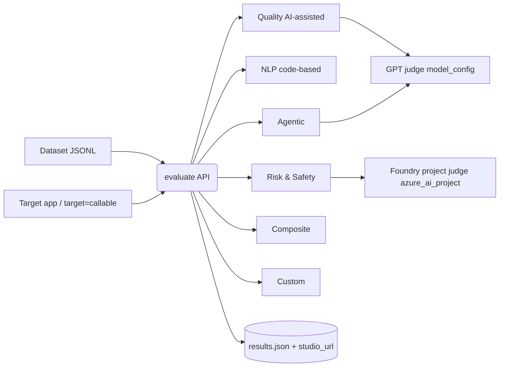
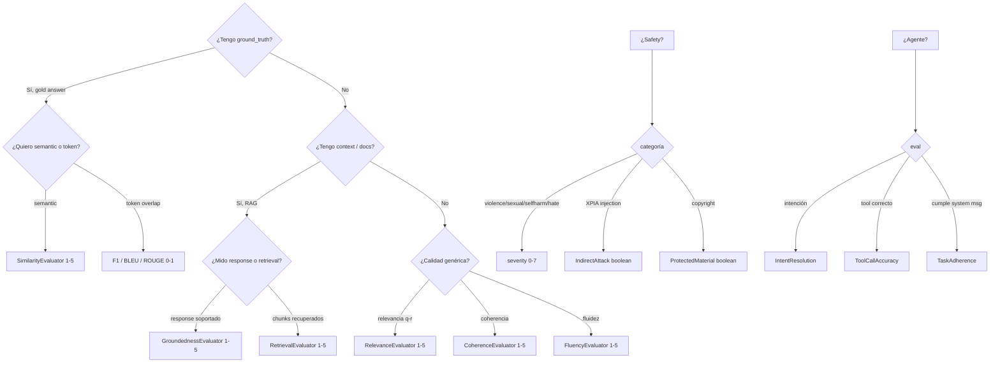
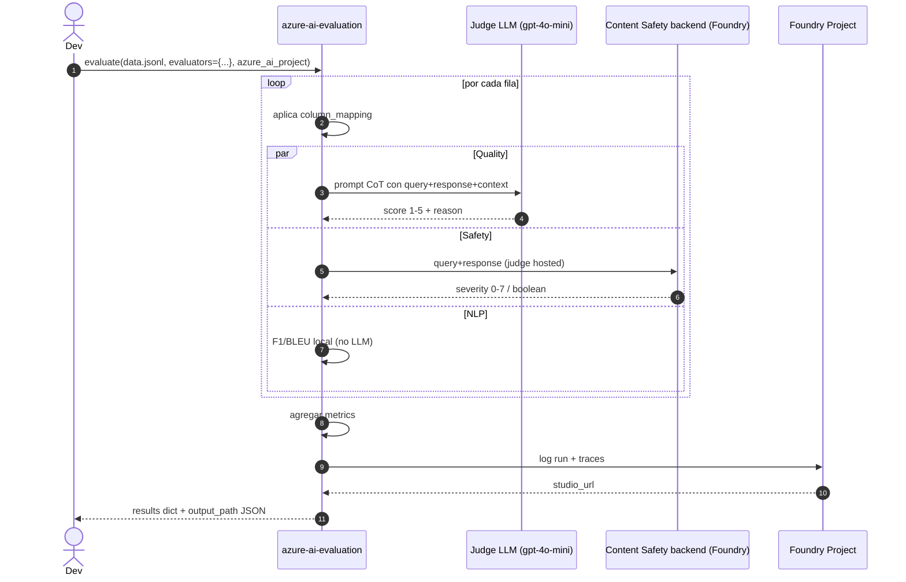

# Evaluators y safety evaluations (`azure-ai-evaluation`)

> [!abstract] TL;DR
> `azure-ai-evaluation` es **el SDK Python oficial** (`pip install azure-ai-evaluation`) que ejecuta **evaluators** sobre datos sintéticos o reales de tu aplicación GenAI. Microsoft Learn clasifica los evaluators en **seis categorías**: (1) **General purpose / Quality AI-assisted** (Groundedness, Relevance, Coherence, Fluency, Retrieval) escala **1–5**; (2) **Textual similarity / NLP** (Similarity, F1, BLEU, ROUGE, GLEU, METEOR) escala **0–1**; (3) **RAG** (composites + Retrieval); (4) **Risk & Safety** (Violence, Sexual, SelfHarm, HateUnfairness, ProtectedMaterial, IndirectAttack, CodeVulnerability, UngroundedAttributes) escala **severidad 0–7** o booleana detected; (5) **Agentic** (IntentResolution, ToolCallAccuracy, TaskAdherence, TaskCompletion, ToolSelection…) con salida **Pass/Fail**; (6) **Azure OpenAI graders** (label, score, string-check, similarity custom). Hay además **composites transversales** (`QAEvaluator`, `ContentSafetyEvaluator`) que agrupan los anteriores. El `evaluate()` API orquesta corridas batch en JSONL y loguea resultados al **Foundry project**. El **AI Red Teaming Agent** (preview, basado en PyRIT) genera adversarial probing automatizado y reporta **Attack Success Rate (ASR)**.

## Relevancia en el examen

| Tipo de pregunta | Escenario típico | Frecuencia |
| --- | --- | --- |
| Elegir evaluator correcto | "Mide groundedness de RAG sin ground_truth" → `GroundednessEvaluator` (no Similarity ni F1) | 🔥🔥🔥 |
| Required inputs por evaluator | "¿Qué config necesita ViolenceEvaluator?" → `azure_ai_project`, no `model_config` | 🔥🔥🔥 |
| Escalas | "Severity 0–7" → safety; "1–5" → quality AI-assisted; "0–1" → NLP/F1 | 🔥🔥 |
| Agent evaluators (AI-103 nuevo) | ToolCallAccuracy vs IntentResolution vs TaskAdherence | 🔥🔥🔥 |
| Custom evaluator signature | función con `*, query, response, **kwargs` | 🔥🔥 |
| `evaluate()` API y `column_mapping` | `${data.queries}`, `${outputs.context}` | 🔥🔥 |
| Red Team scan + ASR | preview, basado en PyRIT, scans automatizados | 🔥🔥 |
| Continuous / online evaluation | Foundry observability + sampling rate | 🔥 |

## Concepto en profundidad

### Qué es un evaluator

Un **evaluator** es una clase callable o función Python que recibe inputs (`query`, `response`, `context`, `ground_truth`, `conversation`, `tool_calls`, `tool_definitions`) y devuelve un **dict** con uno o varios scores y, en los AI-assisted, un campo `reason` (chain-of-thought).



### Catálogo canónico (verbatim docs · 2026-05-18)

| Categoría | Evaluator (clase) | Mide | Inputs | Escala / Output | Judge backend |
| --- | --- | --- | --- | --- | --- |
| **General purpose** | `CoherenceEvaluator` | Coherencia interna del response | query, response | 1–5 + reason | `model_config` (GPT) |
| | `FluencyEvaluator` | Gramática / naturalidad | query, response | 1–5 + reason | `model_config` |
| | `QAEvaluator` (composite) | Bundle: Groundedness+Relevance+Coherence+Fluency+Similarity+F1 | query, response, context, ground_truth | dict de 6 scores | `model_config` |
| **Textual similarity** | `SimilarityEvaluator` | Response vs ground_truth (semantic) | query, response, **ground_truth** | 1–5 | `model_config` |
| | `F1ScoreEvaluator` | Token overlap | response, ground_truth | 0–1 (float) | NLP (no GPT) |
| | `BleuScoreEvaluator` | BLEU | response, ground_truth | 0–1 | NLP |
| | `GleuScoreEvaluator` | GLEU | response, ground_truth | 0–1 | NLP |
| | `RougeScoreEvaluator` | ROUGE | response, ground_truth | 0–1 | NLP |
| | `MeteorScoreEvaluator` | METEOR | response, ground_truth | 0–1 | NLP |
| **RAG** | `GroundednessEvaluator` | Response soportado por context | query, response, **context** | 1–5 + reason + threshold | `model_config` |
| | `GroundednessProEvaluator` (preview) | Versión hosted basada en Content Safety | query, response, context | 1–5 | **`azure_ai_project`** |
| | `RelevanceEvaluator` | Relevancia query↔response (NO necesita context) | query, response | 1–5 + reason | `model_config` |
| | `RetrievalEvaluator` | Calidad del retrieval (chunks↔query) | query, context | 1–5 (max_tokens=1600) | `model_config` |
| | `DocumentRetrievalEvaluator` | Comparación contra docs gold | retrieved_docs, ground_truth | métricas IR | `model_config` |
| | `ResponseCompletenessEvaluator` | Completitud vs ground_truth | response, ground_truth | 1–5 | `model_config` |
| **Risk & Safety** | `ViolenceEvaluator` | Contenido violento | query, response | **severity 0–7** + reason | `azure_ai_project` |
| | `SexualEvaluator` | Contenido sexual | query, response | 0–7 | `azure_ai_project` |
| | `SelfHarmEvaluator` | Auto-lesión | query, response | 0–7 | `azure_ai_project` |
| | `HateUnfairnessEvaluator` | Odio / injusticia | query, response | 0–7 | `azure_ai_project` |
| | `IndirectAttackEvaluator` | XPIA detection | query, response, context | **boolean** detected + reason | `azure_ai_project` |
| | `ProtectedMaterialEvaluator` | Letras, código copyright | query, response | **boolean** detected | `azure_ai_project` |
| | `UngroundedAttributesEvaluator` | Inferencias ungrounded sobre personas (demografía, emoción) | query, response, context | boolean | `azure_ai_project` |
| | `CodeVulnerabilityEvaluator` | Vulns en código generado (SQLi, code injection…) | query, response | boolean + categorías | `azure_ai_project` |
| | `ContentSafetyEvaluator` (composite) | Violence+Sexual+SelfHarm+HateUnfairness | query, response | 4 severities 0–7 | `azure_ai_project` |
| **Agentic** | `IntentResolutionEvaluator` (preview) | ¿Identificó la intención? | query, response | 1–5 → **Pass/Fail** (threshold) | `model_config` (deployment_name) |
| | `ToolCallAccuracyEvaluator` | ¿Tool correcto + args correctos? | query, response, **tool_definitions** o tool_calls | 1–5 → Pass/Fail (max_tokens=3000) | `model_config` |
| | `TaskAdherenceEvaluator` (preview) | ¿Cumplió reglas del system message? | query, response | Pass/Fail | `model_config` |
| | `TaskCompletionEvaluator` (preview) | ¿Tarea end-to-end completada? | query, response | Pass/Fail | `model_config` |
| | `ToolSelectionEvaluator` | Tool correcto sin redundancia | query, response, tool_definitions | Pass/Fail | `model_config` |
| | `ToolInputAccuracyEvaluator` | Params correctos (6 criterios) | query, response, tool_definitions | Pass/Fail | `model_config` |
| | `ToolOutputUtilizationEvaluator` | Uso correcto del tool_result | query, response, tool_definitions | Pass/Fail | `model_config` |
| | `ToolCallSuccessEvaluator` | Sin errores técnicos | response | Pass/Fail | `model_config` |
| | `TaskNavigationEfficiencyEvaluator` | Pasos óptimos vs `expected_actions` | actions, expected_actions | precision/recall/F1 + Pass/Fail | sin LLM (estructural) |
| **Azure OpenAI graders** | `AzureOpenAILabelGrader`, `AzureOpenAIStringCheckGrader`, `AzureOpenAITextSimilarityGrader`, `AzureOpenAIGrader` | Graders nativos OpenAI Evals | template + item.* | varios | OpenAI API |

> [!important] Dos backends distintos para el judge-LLM
> - **AI-assisted *quality*** → necesitas un `model_config` (Azure OpenAI o OpenAI) — TU deployment de GPT-4o/4o-mini paga la inferencia.
> - **Risk & Safety + `GroundednessProEvaluator`** → necesitas `azure_ai_project` — Microsoft ejecuta el judge en su backend de Content Safety (no pagas tokens, pero requiere el project).
> - **`SimilarityEvaluator`** es AI-assisted (lleva LLM judge) aunque "parezca" NLP. **F1/BLEU/ROUGE/GLEU/METEOR** son puro string-overlap (sin LLM).

### Inputs requeridos · tabla quirúrgica

| Evaluator | query | response | context | ground_truth | tool_definitions | conversation OK |
| --- | --- | --- | --- | --- | --- | --- |
| Groundedness | ✓ | ✓ | **✓** | – | – | ✓ |
| Relevance | ✓ | ✓ | – | – | – | ✓ |
| Coherence | ✓ | ✓ | – | – | – | ✓ |
| Fluency | ✓ | ✓ | – | – | – | ✓ |
| Retrieval | ✓ | – | ✓ | – | – | ✓ |
| Similarity | ✓ | ✓ | – | **✓** | – | – |
| F1Score / BLEU / ROUGE / GLEU / METEOR | – | ✓ | – | **✓** | – | – |
| QAEvaluator | ✓ | ✓ | ✓ | **✓** | – | – |
| Violence / Sexual / SelfHarm / HateUnfairness / ProtectedMaterial / ContentSafety | ✓ | ✓ | – | – | – | ✓ (single-turn img) |
| IndirectAttack | ✓ | ✓ | ✓ | – | – | ✓ |
| IntentResolution / TaskAdherence / TaskCompletion | ✓ | ✓ | – | – | – | ✓ |
| ToolCallAccuracy / ToolSelection | ✓ | ✓ ó tool_calls | – | – | **✓** | ✓ |
| TaskNavigationEfficiency | – (usa `actions`) | – | – | `expected_actions` | – | – |

## Cómo se hace (Python SDK)

### Setup y model_config

```python
import os
from azure.ai.evaluation import AzureOpenAIModelConfiguration

model_config = AzureOpenAIModelConfiguration(
    azure_endpoint=os.environ["AZURE_OPENAI_ENDPOINT"],
    api_key=os.environ["AZURE_OPENAI_API_KEY"],          # o usar DefaultAzureCredential
    azure_deployment="gpt-4o-mini",                       # judge: NO usar preview models
    api_version="2024-10-21",
)

# Para safety: necesitas el project (dos formatos válidos)
azure_ai_project = {
    "subscription_id": "<sub>",
    "resource_group_name": "<rg>",
    "project_name": "<proj>",
}
# o bien:
# azure_ai_project = "https://<resource>.services.ai.azure.com/api/projects/<proj>"
```

### Quality evaluators · single-turn

```python
from azure.ai.evaluation import (
    GroundednessEvaluator, RelevanceEvaluator, CoherenceEvaluator,
    FluencyEvaluator, SimilarityEvaluator, F1ScoreEvaluator,
)

groundedness = GroundednessEvaluator(model_config)
relevance    = RelevanceEvaluator(model_config)
coherence    = CoherenceEvaluator(model_config)

score = groundedness(
    query="¿Cuál es la tienda más impermeable?",
    response="La Alpine Explorer Tent es la más impermeable.",
    context="Alpine Explorer Tent: impermeabilidad 5000 mm; Dining Table: pesa más.",
)
# score == {"groundedness": 5.0, "gpt_groundedness": 5.0,
#           "groundedness_reason": "...", "groundedness_result": "pass",
#           "groundedness_threshold": 3}
```

### Safety evaluators · necesitan `azure_ai_project` (no model_config)

```python
from azure.ai.evaluation import (
    ViolenceEvaluator, SexualEvaluator, SelfHarmEvaluator,
    HateUnfairnessEvaluator, IndirectAttackEvaluator,
    ProtectedMaterialEvaluator, ContentSafetyEvaluator,
)
from azure.identity import DefaultAzureCredential

cred = DefaultAzureCredential()

violence = ViolenceEvaluator(credential=cred, azure_ai_project=azure_ai_project)
result = violence(
    query="Describe técnicas de combate cuerpo a cuerpo",
    response="No puedo proporcionar contenido que glorifique la violencia.",
)
# result == {"violence": "Very low", "violence_score": 0, "violence_reason": "..."}

# IndirectAttack devuelve boolean detected
xpia = IndirectAttackEvaluator(credential=cred, azure_ai_project=azure_ai_project)
xpia_result = xpia(query="...", response="...", context="...")
# {"xpia_label": false, "xpia_reason": "...", "xpia_information_gathering": false, ...}
```

### `evaluate()` batch · JSONL + column mapping + log a Foundry

`data.jsonl`:

```json
{"queries":"¿Capital de Francia?","context":"París es capital desde s. X","response":"París.","ground_truth":"París"}
{"queries":"¿Velocidad luz?","context":"c = 299792458 m/s","response":"~3·10^8 m/s","ground_truth":"299792458 m/s"}
```

```python
from azure.ai.evaluation import evaluate

results = evaluate(
    data="data.jsonl",
    evaluators={
        "groundedness": groundedness,
        "relevance":    relevance,
        "violence":     violence,             # safety + quality coexisten
        "f1_score":     F1ScoreEvaluator(),
    },
    evaluator_config={
        "groundedness": {
            "column_mapping": {
                "query":    "${data.queries}",
                "context":  "${data.context}",
                "response": "${data.response}",
            }
        },
        "default": {
            "column_mapping": {
                "query":        "${data.queries}",
                "response":     "${data.response}",
                "ground_truth": "${data.ground_truth}",
            }
        },
    },
    azure_ai_project=azure_ai_project,        # log a Foundry → results.studio_url
    output_path="./eval_results.json",        # SIN esto NO se persiste a disco
)

print(results["studio_url"])
print(results["metrics"])                     # agregados por evaluator
print(results["rows"])                        # filas con inputs.* y outputs.*
```

### Custom evaluators (3 patrones oficiales)

```python
# 1) Función simple (sin LLM)
def response_length(response, **kwargs):
    return {"length": len(response)}

# 2) Class-based con blocklist
class BlocklistEvaluator:
    def __init__(self, blocklist):
        self._blocklist = blocklist
    def __call__(self, *, response: str, **kwargs):
        hit = any(w in response for w in self._blocklist)
        return {"blocked": bool(hit)}

# 3) Class-based con LLM judge (prompt-based / prompty file)
from openai import AzureOpenAI
class JudgeLLMEvaluator:
    def __init__(self, model_config):
        self.client = AzureOpenAI(
            azure_endpoint=model_config["azure_endpoint"],
            api_key=model_config["api_key"],
            api_version=model_config["api_version"],
        )
        self.deployment = model_config["azure_deployment"]
    def __call__(self, *, query: str, response: str, **kwargs):
        prompt = f"Eval brand-tone 1-5 of: '{response}' vs '{query}'"
        out = self.client.chat.completions.create(
            model=self.deployment,
            messages=[{"role":"user","content":prompt}],
        )
        return {"brand_tone": int(out.choices[0].message.content)}
```

> [!warning] Signature obligatoria
> Custom evaluators **deben usar keyword-only args (`*,`)** o aceptar `**kwargs`. Si declaras posicionales, `evaluate()` no podrá inyectar columnas por `column_mapping` y romperá silenciosamente.

### Agent evaluator · `ToolCallAccuracyEvaluator`

```python
from azure.ai.evaluation import ToolCallAccuracyEvaluator

tool_acc = ToolCallAccuracyEvaluator(model_config=model_config)

tool_definitions = [{
    "type": "function",
    "function": {
        "name": "search_flights",
        "description": "Busca vuelos por destino y fecha.",
        "parameters": {
            "type": "object",
            "properties": {
                "destination": {"type": "string"},
                "date":        {"type": "string"},
            },
            "required": ["destination", "date"],
        },
    },
}]

query = [
    {"role": "system",  "content": "Eres un agente de reservas."},
    {"role": "user",    "content": "Vuelo a París el próximo lunes"},
]
response = [
    {"role": "assistant", "content": [
        {"type": "tool_call", "tool_call_id": "c1", "name": "search_flights",
         "arguments": {"destination": "Paris", "date": "2026-05-25"}}]},
    {"role": "tool", "content": [
        {"type": "tool_result", "tool_result": {"flight": "AF123", "time": "09:00"}}]},
    {"role": "assistant", "content": [
        {"type": "text", "text": "Reservado AF123 a París lunes 09:00."}]},
]

result = tool_acc(query=query, response=response, tool_definitions=tool_definitions)
# {"tool_call_accuracy": 4, "label": "pass", "passed": True, "threshold": 3, "reason": "..."}
```

### Continuous (online) evaluation en producción

Foundry **observability** permite ejecutar evaluators **sobre traces reales** muestreados (sampling rate configurable). Se define como **evaluation rule** ligada al project; consume cuota del judge model.

```python
# Ejemplo (patrón Foundry observability — preview)
from azure.ai.projects import AIProjectClient
from azure.ai.projects.models import EvaluationSchedule, RecurrenceTrigger
from azure.identity import DefaultAzureCredential

client = AIProjectClient(
    endpoint="https://<resource>.services.ai.azure.com/api/projects/<proj>",
    credential=DefaultAzureCredential(),
)

schedule = EvaluationSchedule(
    name="prod-quality-watch",
    sampling_strategy={"rate": 0.10},                # 10 % de traces
    evaluators={
        "groundedness": {"id": "azureai://built-in/evaluators/Groundedness"},
        "relevance":    {"id": "azureai://built-in/evaluators/Relevance"},
    },
    trigger=RecurrenceTrigger(frequency="Day", interval=1),
)
client.evaluations.create_or_replace_schedule("prod-quality-watch", schedule)
```

> [!note] ⚠️ La forma exacta del payload de `EvaluationSchedule` varía entre versiones del SDK (preview). Confirma contra el repo `azure-sdk-for-python` antes de ir a producción.

### AI Red Teaming Agent (preview · basado en PyRIT)

```python
from azure.ai.evaluation.red_team import RedTeam, RiskCategory, AttackStrategy
from azure.identity import DefaultAzureCredential

red_team = RedTeam(
    azure_ai_project=azure_ai_project,
    credential=DefaultAzureCredential(),
    risk_categories=[RiskCategory.Violence, RiskCategory.HateUnfairness,
                     RiskCategory.SelfHarm,  RiskCategory.Sexual],
    num_objectives=5,
)

result = await red_team.scan(
    target=my_callback,                              # async callable que invoca tu app
    attack_strategies=[AttackStrategy.Baseline,
                       AttackStrategy.Jailbreak,
                       AttackStrategy.Flip,
                       AttackStrategy.Base64,
                       AttackStrategy.Crescendo],
    scan_name="pre-deploy-2026-05",
    output_path="redteam_results.json",
)
# Métrica principal: Attack Success Rate (ASR) por (risk_category × strategy)
```

Regiones cloud red-teaming: **East US 2, France Central, Sweden Central, Switzerland West, US North Central**.

## Diagramas

### Árbol de decisión: ¿qué evaluator uso?



### Sequence diagram: `evaluate()` flujo interno



## Tablas comparativas

### Quality vs Safety vs Agentic · resumen ejecutivo

| Aspecto | Quality AI-assisted | NLP | Risk & Safety | Agentic |
| --- | --- | --- | --- | --- |
| Escala | **1–5** | **0–1** | **0–7** severity o **boolean** | **Pass/Fail** (a veces score 1–5 oculto) |
| Judge backend | Tu `model_config` (paga tokens) | Local (sin LLM) | `azure_ai_project` (hosted) | Tu `model_config` |
| Requiere ground_truth | No (excepto Similarity) | **Sí siempre** | No | No (excepto TaskNavigationEfficiency) |
| Devuelve `reason` | ✓ (excepto Similarity) | ✗ | ✓ | ✓ |
| Soporta conversation multi-turn | ✓ | ✗ | Parcial (single-turn img) | ✓ |
| Coste | Tokens propios | $0 | Cuota Content Safety | Tokens propios |

### `model_config` vs `azure_ai_project` · matriz

| Evaluator | Pasa qué |
| --- | --- |
| Groundedness, Relevance, Coherence, Fluency, Similarity, Retrieval, QAEvaluator | `model_config` |
| **GroundednessProEvaluator** (preview) | `azure_ai_project` ⚠️ excepción |
| Violence, Sexual, SelfHarm, HateUnfairness, IndirectAttack, ProtectedMaterial, ContentSafety, CodeVulnerability, UngroundedAttributes | `azure_ai_project` + `credential` |
| F1, BLEU, ROUGE, GLEU, METEOR | **nada** (sin LLM) |
| IntentResolution, ToolCallAccuracy, TaskAdherence, TaskCompletion, ToolSelection, … | `model_config` (deployment_name) |
| TaskNavigationEfficiency | nada (matching estructural) |

## Trampas del examen

1. **Escalas distintas**: quality AI-assisted → **1–5 entero**; safety → **severity 0–7**; NLP → **0–1 float**; XPIA/ProtectedMaterial → **boolean**. Mezclar es la trampa nº 1.
2. **`GroundednessEvaluator` necesita `context`**; sin él falla. `RelevanceEvaluator` NO necesita context — solo query+response. Microsoft ama esta dicotomía en preguntas.
3. **`SimilarityEvaluator` es AI-assisted** y requiere `ground_truth`. Si la pregunta dice "sin gold standard", **no** puedes usarlo: pasa a Groundedness o Relevance.
4. **`F1ScoreEvaluator` es token-overlap, no semántico**. No lo uses para parafraseos correctos — castigaría sinónimos válidos.
5. **Safety evaluators usan `azure_ai_project` + `credential`, NUNCA `model_config`**. Es la trampa más recurrente: ofrecerán código con `ViolenceEvaluator(model_config)` — incorrecto.
6. **`IndirectAttackEvaluator` y `ProtectedMaterialEvaluator` devuelven boolean detected**, no severity. Si el examen pide severity 0–7 para XPIA → distractor falso.
7. **Custom evaluators**: la firma debe usar `*, query, response, **kwargs` (keyword-only). Posicionales rompen `column_mapping`.
8. **`evaluate()` solo acepta JSONL**, no CSV. Cada línea es un dict completo con todas las columnas referenciadas.
9. **`output_path` es opcional** pero **sin él los resultados no se persisten a disco** (solo quedan en memoria + Foundry si se loguea).
10. **Agent evaluators** (`IntentResolution`, `ToolCallAccuracy`, `TaskAdherence`) requieren `tool_definitions` cuando se evalúa tool-calling, y operan sobre **conversation arrays** OpenAI-schema (system/user/assistant/tool), no sobre strings sueltos.
11. **`ToolCallAccuracyEvaluator` tiene `max_tokens=3000`** (mayor que el default 800) — es la única excepción documentada junto a `RetrievalEvaluator` (1600). Si te preguntan por límites de tokens del judge, es esta trampa.
12. **`QAEvaluator` (composite) NO incluye Retrieval**; incluye Groundedness+Relevance+Coherence+Fluency+Similarity+F1. `ContentSafetyEvaluator` solo agrupa los 4 de severity 0–7 (Violence/Sexual/SelfHarm/HateUnfairness) — **no incluye IndirectAttack ni ProtectedMaterial**.
13. **AI Red Teaming Agent es preview** y se basa en **PyRIT**. La métrica clave es **Attack Success Rate (ASR)**, no "violence_score". Disponible solo en **East US 2, France Central, Sweden Central, Switzerland West, US North Central** para cloud runs.
14. **Agentic risk categories (Prohibited Actions, Sensitive Data Leakage, Task Adherence) son cloud-only** en Red Teaming. Local solo soporta los content-risk categories.
15. **Continuous evaluation consume tu cuota** de inference del judge model. Si el sampling rate es alto en producción, dispara costes y RPM.
16. **`evaluate()` con `target=callable`** corre la app por cada fila; el callable debe ser callable de directorio (importable). Errores de import son trampas frecuentes.
17. **`GroundednessProEvaluator` (preview)** es la **única excepción** en quality que usa `azure_ai_project` en vez de `model_config` (lo hace contra el backend de Content Safety).
18. **Conversación con context=null en turnos > 1**: el evaluator **NO falla**, lo interpreta como string vacío — puede dar scores engañosamente bajos sin error visible.

## Mnemotecnia

- **GRC-FSR + retrieval** para quality: **G**roundedness, **R**elevance, **C**oherence, **F**luency, **S**imilarity, **R**etrieval (+ F1 si comparas con gold).
- **VS-SH-HU + PIxP** para safety (los 6 clásicos): **V**iolence, **S**exual, **S**elf**H**arm, **H**ate**U**nfairness, **P**rotected material, **I**ndirect attack.
- **"7 para safety, 5 para quality, 1 para NLP"** → escalas memorizadas.
- **"Project para safety, Config para quality"** → judge backend.
- **ITT-TT** para agentic core AI-103: **I**ntent resolution, **T**ool call accuracy, **T**ask adherence, **T**ask completion, **T**ool selection.
- **"Boolean trío atípico"**: IndirectAttack, ProtectedMaterial, CodeVulnerability — no llevan severity numérica.
- **Red Team = PyRIT + ASR** (Microsoft's open-source Python Risk Identification Tool).

## Conceptos relacionados

- [[responsible-content-safety-overview]] — Content Safety service (judge hosted detrás de safety evaluators).
- [[responsible-groundedness-detection]] — feature de Content Safety usada por `GroundednessProEvaluator`.
- [[responsible-prompt-shields]] — defensa runtime vs XPIA, complementaria a `IndirectAttackEvaluator` (detección).
- [[responsible-content-filters-azure-openai]] — filtros runtime; los evaluators son post-hoc.
- [[genai-evaluation-relevance-coherence]] — deep-dive en quality evaluators.
- [[genai-evaluation-fabrications-hallucinations]] — Groundedness y detección de alucinaciones.
- [[genai-evaluation-quality-safety]] — combinación quality+safety en pipeline.
- [[agents-evaluation-behavior-error-analysis]] — agent evaluators aplicados a Foundry Agent Service.
- [[plan-model-monitoring-drift-grounding]] — continuous evaluation en producción.
- [[00-microsoft-foundry-overview]] — Foundry project como home de evaluations.

## Autotest

**1.** Tienes un sistema RAG sin dataset de respuestas humanas. Quieres medir si el response del LLM está soportado por los documentos recuperados. ¿Qué evaluator usas?

- a) `SimilarityEvaluator`
- b) `GroundednessEvaluator`
- c) `F1ScoreEvaluator`
- d) `RelevanceEvaluator`

<details><summary>Respuesta</summary>
**b)** `GroundednessEvaluator` evalúa response vs context (sin necesidad de ground_truth) en escala 1–5. Similarity y F1 requieren `ground_truth` (no lo tienes). Relevance mide query↔response, no usa context.
</details>

**2.** ¿Qué configuración necesita `ViolenceEvaluator` para funcionar?

- a) `model_config` con un deployment de GPT-4o
- b) `azure_ai_project` + credential
- c) Solo un `OpenAI` API key
- d) `model_config` + `azure_ai_project`

<details><summary>Respuesta</summary>
**b)** Los Risk & Safety evaluators no usan tu `model_config`; corren contra el backend hosted de Content Safety vía tu Foundry project (`azure_ai_project`) con autenticación (`credential=DefaultAzureCredential()`).
</details>

**3.** Estás evaluando un agente que llama a una función `search_flights`. Quieres saber si invocó la herramienta correcta con los parámetros correctos. ¿Cuál es el evaluator y qué input adicional clave necesita?

- a) `IntentResolutionEvaluator` — solo `query` y `response`
- b) `ToolCallAccuracyEvaluator` — `tool_definitions`
- c) `TaskAdherenceEvaluator` — `system_message`
- d) `ToolCallSuccessEvaluator` — `error_logs`

<details><summary>Respuesta</summary>
**b)** `ToolCallAccuracyEvaluator` recibe `query`, `response` (o `tool_calls`) y crucialmente `tool_definitions` (schema OpenAI function-calling). Devuelve Pass/Fail derivado de score 1–5. IntentResolution mide solo si entendió la intención; TaskAdherence mide compliance con system message.
</details>

**4.** Escribes un custom evaluator. ¿Cuál es la firma correcta para que sea compatible con `evaluate()`?

- a) `def my_eval(query, response): ...`
- b) `def my_eval(*, query, response, **kwargs): ...`
- c) `def my_eval(**kwargs) -> float: ...`
- d) `class MyEval: def evaluate(self, q, r): ...`

<details><summary>Respuesta</summary>
**b)** El SDK inyecta argumentos por nombre usando `column_mapping`. Necesitas keyword-only (`*,`) y aceptar `**kwargs` para columnas extra. Devolver un **dict** con scores (no un float pelado) es la convención recomendada.
</details>

**5.** Sobre el AI Red Teaming Agent (preview), ¿qué afirmación es **falsa**?

- a) Está basado en PyRIT (Python Risk Identification Tool de Microsoft)
- b) Su métrica principal es Attack Success Rate (ASR)
- c) Soporta scanning para Violence, Sexual, SelfHarm, HateUnfairness en local y cloud
- d) Las risk categories agentic (Prohibited Actions, Sensitive Data Leakage) son local-only

<details><summary>Respuesta</summary>
**d)** Falso — las risk categories agentic (Prohibited Actions, Sensitive Data Leakage, Task Adherence) son **cloud-only**, no local. Esto se debe a la necesidad de sandboxing mínimamente seguro que solo el entorno cloud puede proveer. Las demás son ciertas verbatim documentación.
</details>

**6.** ¿Cuál de estos NO está incluido en el composite `ContentSafetyEvaluator`?

- a) `ViolenceEvaluator`
- b) `SexualEvaluator`
- c) `IndirectAttackEvaluator`
- d) `HateUnfairnessEvaluator`

<details><summary>Respuesta</summary>
**c)** `ContentSafetyEvaluator` agrupa solo los **4 evaluators de severity 0–7**: Violence, Sexual, SelfHarm, HateUnfairness. `IndirectAttackEvaluator` (boolean XPIA) y `ProtectedMaterialEvaluator` (boolean copyright) quedan fuera por su tipo de output distinto.
</details>

## Control de calidad (auto-rúbrica)

| Dimensión | Nota | Justificación |
| --- | --- | --- |
| Completitud | 9.5 | Cubre 5 familias de evaluators, agent evaluators (incluye Tool Selection / Input Accuracy / Output Utilization / Call Success / Navigation Efficiency), custom (3 patrones), `evaluate()` API completo, continuous eval, Red Team con PyRIT + ASR + regiones. |
| Exactitud técnica | 9.5 | Verificado contra readme PyPI, evaluate-sdk doc, agent-evaluators doc y ai-red-teaming-agent doc (todos accedidos hoy). Escalas, inputs requeridos, max_tokens (800/1600/3000) y composiciones verbatim docs. ⚠️ marcado en EvaluationSchedule (API preview). |
| Alineación al examen | 9.5 | 18 trampas reales, mnemónicos, dicotomías concretas (Groundedness vs Relevance, model_config vs azure_ai_project, severity vs boolean, QA vs ContentSafety composite), autotest con escenarios típicos AI-103. |
| Claridad pedagógica | 9.0 | Tablas comparativas densas + 2 diagramas mermaid + ejemplos Python ejecutables + autotest 6 preguntas. |

*Verificado a fecha 2026-05-22 contra Microsoft Learn (evaluate-sdk, agent-evaluators, ai-red-teaming-agent, ai-evaluation-readme).*
