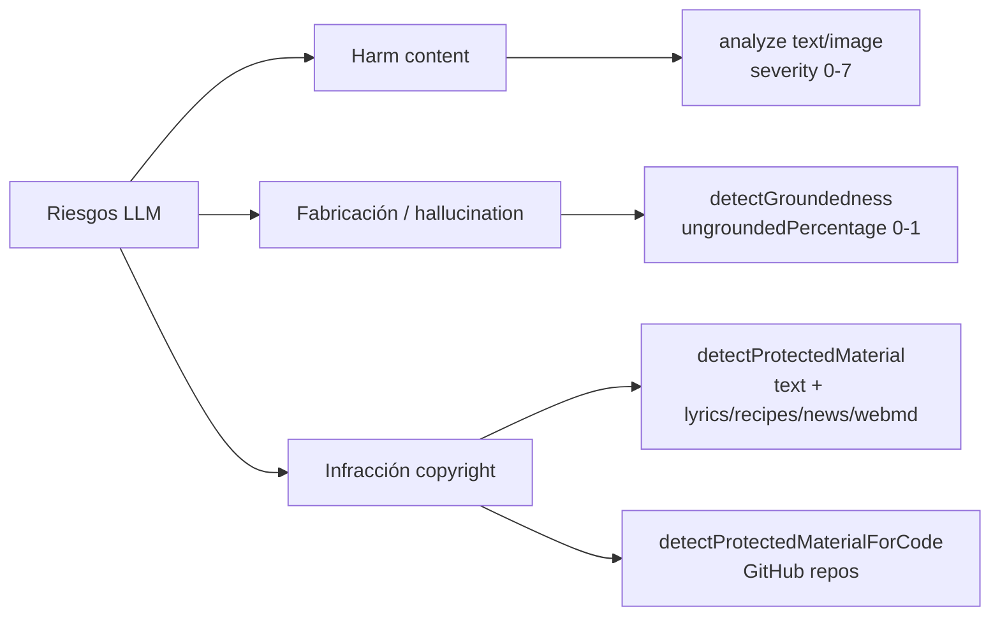
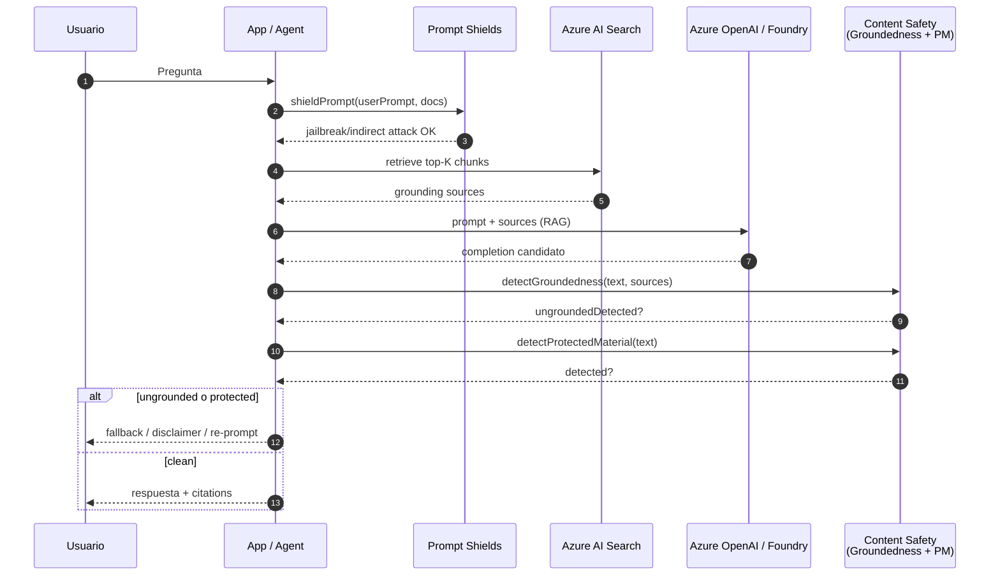
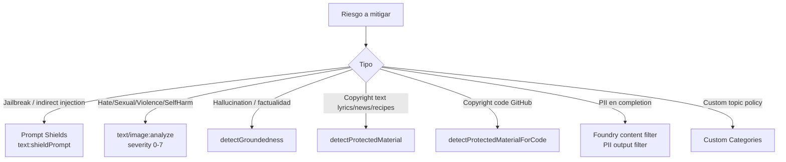

# Groundedness Detection + Protected Material — guardrails contra alucinaciones e infracción de copyright

> [!abstract] TL;DR
> Tres detection APIs de **Azure AI Content Safety** que cierran la cara "factual + IP" de los guardrails (la cara "harm" la cubren [[responsible-content-safety-overview]] y [[responsible-prompt-shields]]):
> - **Groundedness Detection** (`POST /contentsafety/text:detectGroundedness?api-version=2024-09-15-preview`) → detecta si la respuesta del LLM está fundamentada en `groundingSources`. Devuelve `ungroundedDetected`, `ungroundedPercentage (0-1)`, `ungroundedDetails[]`. Opciones: `domain=MEDICAL|GENERIC`, `task=QnA|Summarization`, `reasoning` (explicación) y `mitigating` (auto-corrección con tu propio Azure OpenAI GPT-4o 0513/0806). **Solo inglés**, char limit 7.500.
> - **Protected Material — Text** (`text:detectProtectedMaterial?api-version=2024-09-01`) → flag binario contra lyrics, recipes, news, web content de WebMD. Solo inglés. Pensado para **completions, no prompts**.
> - **Protected Material — Code** (`text:detectProtectedMaterialForCode?api-version=2024-09-15-preview`) → match contra repos públicos de GitHub con `codeCitations[].license` + `sourceUrls[]`. ⚠️ Índice **congelado a 6-abril-2023**.
> 
> En **Foundry deployments** estas tres se exponen como categorías de output filter: `Groundedness`, `Protected Material for Text`, `Protected Material for Code`. **Groundedness solo funciona en streaming** y solo en Central US / East US / France Central / Canada East.

## 🎯 Relevancia en el examen

🔥🔥 — **Pregunta muy probable** en cualquier escenario RAG o copilot.

| Tipo de pregunta | Escenario típico |
|---|---|
| **API selection** | "Detect if chatbot RAG answer is grounded in retrieved docs" → `detectGroundedness` (no evaluator, no PromptShield) |
| **Output field interpretation** | "`ungroundedPercentage: 0.6` significa…" → 60 % del texto es ungrounded (no es confidence) |
| **Parámetros** | Para QnA hay que pasar `qna.query`; para Summarization no |
| **Reasoning vs Mitigating** | `reasoning=true` → añade campo `reason` por segmento; `mitigating=true` → añade `correctionText`. Ambos requieren `llmResource` con tu Azure OpenAI GPT-4o (0513/0806) |
| **Foundry filter categories** | Saber que Groundedness es **output-only** y **streaming-only** |
| **Protected Material** | Code → matches contra GitHub, congelado a 2023-04-06. Display citation URL si annotate-mode. |
| **Customer Copyright Commitment** | "Use of protected material code model **might be required** for Customer Copyright Commitment coverage" (verbatim) |

## 📖 Concepto en profundidad

### 1. Por qué tres detection features en un mismo archivo

Comparten infraestructura (mismo Content Safety endpoint, mismo subscription key, misma RAI policy de Foundry) y resuelven dos riesgos no cubiertos por hate/sexual/violence/self-harm:



### 2. Groundedness Detection — anatomía

#### Concepto

Verbatim docs:
> *"Ungroundedness refers to instances where LLMs produce information that is non-factual or inaccurate from what was present in the source materials."*

**Es runtime API** — corre online sobre cada respuesta del LLM. No confundir con el **`GroundednessEvaluator`** de `azure-ai-evaluation` (eso es batch eval offline, ver [[responsible-evaluators-safety-evaluations]]).

#### Endpoint y versión

```
POST <endpoint>/contentsafety/text:detectGroundedness?api-version=2024-09-15-preview
Header: Ocp-Apim-Subscription-Key: <key>
```

⚠️ Es **preview**. La api-version puede cambiar. Verificar antes de codificar contra producción.

#### Request body — parámetros oficiales

| Param | Required | Tipo | Valores / nota |
|---|---|---|---|
| `text` | **Required** | String | Output del LLM a verificar. **Char limit: 7.500.** |
| `groundingSources` | **Required** | Array of String | Documentos source. Es **array**, NO string suelto. |
| `domain` | Optional | Enum | `MEDICAL` \| `GENERIC` (default `GENERIC`) |
| `task` | Optional | Enum | `QnA` \| `Summarization` (default `Summarization`) |
| `qna.query` | Optional | String | **Required cuando `task=QnA`**. Char limit 7.500. |
| `reasoning` | Optional | Boolean | Si `true` → devuelve campo `reason` por segmento ungrounded. Requiere `llmResource`. |
| `mitigating` | Optional | Boolean | Si `true` → devuelve `correctionText`. Requiere `llmResource`. |
| `llmResource` | Required si reasoning o mitigating | Object | Tu propio Azure OpenAI **GPT-4o (0513, 0806) only** |

#### `llmResource` shape

```json
"llmResource": {
  "resourceType": "AzureOpenAI",
  "azureOpenAIEndpoint": "<your_OpenAI_endpoint>",
  "azureOpenAIDeploymentName": "<your_deployment_name>"
}
```

> [!warning] Solo GPT-4o 0513 y 0806
> *"We only support Azure OpenAI GPT-4o (versions 0513, 0806) resources and don't support other models."* — verbatim docs. Cualquier otro modelo o versión hace fallar reasoning/mitigating.

#### Response shape — sin reasoning

```json
{
  "ungroundedDetected": true,
  "ungroundedPercentage": 1,
  "ungroundedDetails": [
    { "text": "12/hour." }
  ]
}
```

#### Response shape — con `reasoning: true`

```json
{
  "ungroundedDetected": true,
  "ungroundedPercentage": 1,
  "ungroundedDetails": [
    {
      "text": "12/hour.",
      "offset": { "utf8": 0, "utf16": 0, "codePoint": 0 },
      "length": { "utf8": 8, "utf16": 8, "codePoint": 8 },
      "reason": "None. The premise mentions a pay of \"10/hour\" but does not mention \"12/hour.\" It's neutral. "
    }
  ]
}
```

#### Response shape — con `mitigating: true`

```json
{
  "ungroundedDetected": true,
  "ungroundedPercentage": 1,
  "ungroundedDetails": [{ "text": "The patient name is Kevin" }],
  "correctionText": "The patient name is Jane"
}
```

#### Interpretación de `ungroundedPercentage`

| Valor | Significado |
|---|---|
| `0` | No se detectó contenido ungrounded |
| `0.6` | El 60 % del texto es ungrounded |
| `1` | Texto entero ungrounded |

> [!danger] Trampa clave
> *"This is not a confidence level."* — verbatim docs. Es **proporción**, no probabilidad. Una pregunta del examen que diga "0.6 means 60% confidence the text is ungrounded" es FALSA.

#### Modos de detección

| Modo | Trade-off | Cuándo |
|---|---|---|
| **Non-Reasoning** | Rápido, binario | Producción real-time |
| **Reasoning** | Lento, costo extra (consume tu OpenAI), explica el por qué | Dev, debugging, audit logs, human review queue |

#### Domain & Task

| Combinación | Caso |
|---|---|
| `GENERIC` + `QnA` | Chatbot soporte cliente con `qna.query` |
| `GENERIC` + `Summarization` | Resumir docs internos |
| `MEDICAL` + `QnA` | QnA médico |
| `MEDICAL` + `Summarization` | Resumir historiales / papers (sensibilidad ajustada) |

#### Limitaciones (verbatim)

- *"Currently, groundedness detection supports **English language content** only."*
- *"Maximum text length varies by mode."* (ver Input requirements de Content Safety overview).
- Region availability limitada (ver overview).
- **Como filtro Foundry**: *"Not available in non-streaming scenarios; only available for streaming scenarios"* + solo en **Central US, East US, France Central, Canada East**.

### 3. Protected Material — Text

#### Concepto

Detecta texto que coincide con material protegido por copyright en 4 categorías oficiales:

| Categoría | Scope | Considerado dañino cuando |
|---|---|---|
| **Lyrics** | Letras de canciones | >11 palabras de lyrics |
| **Recipes** | Recetas con IP | ≥40 caracteres de literary content (anécdotas, descripciones creativas) |
| **News** | Artículos news/magazines/blogs | >200 chars verbatim o substantially similar |
| **Web Content** | Solo dominio `webmd.com` | >200 chars |

#### Endpoint

```
POST <endpoint>/contentsafety/text:detectProtectedMaterial?api-version=2024-09-01
```

⚠️ Nota: esta es `2024-09-01` (GA), distinta de groundedness (`2024-09-15-preview`).

#### Request

```json
{ "text": "string" }
```

#### Response (oficial)

```json
{
  "protectedMaterialAnalysis": {
    "detected": true
  }
}
```

> [!info] Output minimalista
> El endpoint de Protected Material **Text** devuelve únicamente `detected: boolean`. No hay offsets, no hay categoría, no hay license. Si necesitas más detalle, usa el flag del **Foundry content filter** en modo `annotate-only` que devuelve más anotaciones en el response del completion.

#### Restricciones

- *"English content only."*
- *"Protected material detection is meant to be run on LLM completions, not user prompts."* — verbatim docs.

### 4. Protected Material — Code

#### Concepto

Match contra corpus de código de **repositorios públicos GitHub**.

> [!danger] Limitación crítica del examen
> *"The Content Safety service's code scanner/indexer is only current through April 6, 2023. Code that was added to GitHub after this date won't be detected."* — verbatim docs.
> Es decir: **NO detecta repos creados después de 2023-04-06**. Use case típico: filtrar Copilot-style code suggestions contra OSS legacy.

#### Endpoint

```
POST <endpoint>/contentsafety/text:detectProtectedMaterialForCode?api-version=2024-09-15-preview
```

#### Request

```json
{ "code": "python import pygame ..." }
```

#### Response

```json
{
  "protectedMaterialAnalysis": {
    "detected": true,
    "codeCitations": [
      {
        "license": "NOASSERTION",
        "sourceUrls": [
          "https://github.com/.../ganeee.py",
          "https://github.com/.../pygame%20basics.py"
        ]
      }
    ]
  }
}
```

Campos clave:

| Field | Significado examen |
|---|---|
| `codeCitations[].license` | SPDX-style. `NOASSERTION` = GitHub no pudo identificar la licencia |
| `codeCitations[].sourceUrls[]` | Lista de URLs GitHub a citar si annotate-mode |

Best practice oficial:
> *"If you're using the protected material code model in annotate mode, display the citation URL when you're displaying the code in your application."*

### 5. Integración con Foundry / Azure OpenAI content filters

Los tres detectors se exponen como categorías de **RAI policy** sobre deployments. Verbatim de la docs:

> *"You can also enable the following special **output filters**:*
> - *Protected material for text*
> - *Protected material for code*
> - *Groundedness*
> - *Personally identifiable information (PII)*"

Es decir: **estas cuatro categorías son output-only** (post-generation). No filtran el prompt; filtran el completion.

#### Modos por categoría

| Modo | Comportamiento |
|---|---|
| `Annotate only` | El modelo corre, devuelve anotaciones en el response, no bloquea |
| `Annotate and block` | Bloquea el completion si match (`finish_reason="content_filter"`) |

Crear/editar content filter en Foundry portal: **Guardrails + controls → Content filters → + Create**. O via REST `aiservices/accountmanagement/rai-policies/create-or-update`.

> [!warning] Groundedness en Foundry — restricciones especiales
> - **Streaming only**: *"Not available in non-streaming scenarios; only available for streaming scenarios"*.
> - **Regiones**: solo Central US, East US, France Central, Canada East.
> - Requiere **document embedding & formatting** en el prompt (delimiters) para que el filtro identifique las grounding sources.

#### Customer Copyright Commitment

> *"the use of protected material code model **might be required** for Customer Copyright Commitment coverage"* — verbatim. Es decir, para que Microsoft cubra defensa legal si un cliente recibe demanda por copyright generado por su LLM, debe activar el filtro Protected Material for Code.

### 6. Pipeline RAG con guardrails



### 7. Mitigation patterns (oficiales y de buena práctica)

1. **Citation requirement** en system prompt: *"Only answer using the provided sources. Cite each statement."*
2. **`reasoning=true`** en producción crítica → guardar `reason` en audit log.
3. **`mitigating=true`** para auto-corregir (cuidado: añade ~latencia + coste de tu Azure OpenAI).
4. **Re-prompt loop**: si `ungroundedPercentage > threshold`, re-llamar al LLM con prompt más estricto.
5. **Human-in-the-loop queue** para borderline (0.3 < ungroundedPercentage < 0.7).
6. **Display citations** automáticamente cuando `protectedMaterialAnalysis.detected=true` en código (compliance).

## 🏗️ Cómo se hace

### A) Python — Groundedness detection (sin reasoning)

> [!info] Implementación oficial
> El quickstart oficial de Microsoft usa **`http.client`** directo (no hay método dedicado en `azure-ai-contentsafety` para groundedness en preview). Para producción puedes usar `httpx`/`requests`. Patrón fiel al sample:

```python
import http.client
import json
import os

endpoint = os.environ["CS_ENDPOINT"].replace("https://", "")
key = os.environ["CS_KEY"]

payload = json.dumps({
    "domain": "Generic",
    "task": "QnA",
    "qna": {"query": "How much does she currently get paid per hour at the bank?"},
    "text": "12/hour",
    "groundingSources": [
        "They pay me 10/hour and it's not unheard of to get a raise in 6ish months."
    ],
    "reasoning": False
})

headers = {
    "Ocp-Apim-Subscription-Key": key,
    "Content-Type": "application/json",
}

conn = http.client.HTTPSConnection(endpoint)
conn.request(
    "POST",
    "/contentsafety/text:detectGroundedness?api-version=2024-09-15-preview",
    payload,
    headers,
)
res = conn.getresponse()
data = json.loads(res.read().decode("utf-8"))

if data["ungroundedDetected"]:
    print(f"⚠️ Ungrounded {data['ungroundedPercentage']*100:.0f}%")
    for seg in data["ungroundedDetails"]:
        print(" -", seg["text"])
```

### B) Python — Groundedness con `reasoning` (trae tu Azure OpenAI GPT-4o)

```python
payload = json.dumps({
    "domain": "Medical",
    "task": "Summarization",
    "text": "The patient name is Kevin.",
    "groundingSources": ["The patient name is Jane."],
    "reasoning": True,
    "llmResource": {
        "resourceType": "AzureOpenAI",
        "azureOpenAIEndpoint": "https://<aoai>.openai.azure.com",
        "azureOpenAIDeploymentName": "gpt-4o-0806"
    }
})
# misma llamada HTTPS POST...
# response añade ungroundedDetails[].reason y ungroundedDetails[].offset
```

### C) Python — Groundedness con `mitigating` (auto-corrección)

```python
payload = json.dumps({
    "domain": "Generic",
    "task": "Summarization",
    "text": "Our latest product is SuperWidget v2.1.",
    "groundingSources": ["Our latest product is SuperWidget v2.2."],
    "mitigating": True,
    "llmResource": {
        "resourceType": "AzureOpenAI",
        "azureOpenAIEndpoint": "...",
        "azureOpenAIDeploymentName": "gpt-4o-0513"
    }
})
# response incluye: "correctionText": "Our latest product is SuperWidget v2.2."
```

### D) Python — Protected Material for Text

```python
import http.client, json, os

endpoint = os.environ["CS_ENDPOINT"].replace("https://", "")
key = os.environ["CS_KEY"]

payload = json.dumps({
    "text": "Kiss me out of the bearded barley Nightly beside the green, green grass..."
})
headers = {
    "Ocp-Apim-Subscription-Key": key,
    "Content-Type": "application/json",
}
conn = http.client.HTTPSConnection(endpoint)
conn.request(
    "POST",
    "/contentsafety/text:detectProtectedMaterial?api-version=2024-09-01",
    payload,
    headers,
)
print(conn.getresponse().read().decode())
# → {"protectedMaterialAnalysis": {"detected": true}}
```

### E) Python — Protected Material for Code

```python
payload = json.dumps({
    "code": "import pygame; pygame.init(); win = pygame.display.set_mode((500, 500))..."
})
conn.request(
    "POST",
    "/contentsafety/text:detectProtectedMaterialForCode?api-version=2024-09-15-preview",
    payload,
    headers,
)
data = json.loads(conn.getresponse().read().decode())

if data["protectedMaterialAnalysis"]["detected"]:
    for cit in data["protectedMaterialAnalysis"]["codeCitations"]:
        print("License:", cit["license"])
        for url in cit["sourceUrls"]:
            print(" •", url)  # ⚠️ display these citations in your UI
```

### F) REST verbatim — Groundedness QnA + reasoning

```http
POST <endpoint>/contentsafety/text:detectGroundedness?api-version=2024-09-15-preview
Ocp-Apim-Subscription-Key: <key>
Content-Type: application/json

{
  "domain": "Generic",
  "task": "QnA",
  "qna": { "query": "How much does she get paid?" },
  "text": "12/hour",
  "groundingSources": ["They pay me 10/hour..."],
  "reasoning": true,
  "llmResource": {
    "resourceType": "AzureOpenAI",
    "azureOpenAIEndpoint": "https://<aoai>.openai.azure.com",
    "azureOpenAIDeploymentName": "gpt-4o-0806"
  }
}
```

### G) Pattern — RAG con post-generation guardrails

```python
def rag_with_guardrails(query: str) -> dict:
    # 1. Retrieve
    sources = search_client.search(query, top=5)
    docs = [hit["content"] for hit in sources]

    # 2. Generate
    completion = aoai_client.chat.completions.create(
        model="gpt-4o-deployment",
        messages=[
            {"role": "system", "content": "Answer using only the provided sources. Cite each fact."},
            {"role": "user", "content": f"Sources:\n{docs}\n\nQuestion: {query}"},
        ],
    )
    answer = completion.choices[0].message.content

    # 3. Groundedness check
    grounded = detect_groundedness(
        text=answer,
        sources=docs,
        task="QnA",
        query=query,
        domain="Generic",
    )

    # 4. Protected material check
    pm = detect_protected_material(answer)

    # 5. Decide
    if grounded["ungroundedPercentage"] > 0.3:
        return {"status": "fallback", "msg": "I cannot confirm this from sources.", "ungrounded": grounded}
    if pm["protectedMaterialAnalysis"]["detected"]:
        return {"status": "blocked", "reason": "protected material"}
    return {"status": "ok", "answer": answer, "citations": sources}
```

## 📊 Tablas comparativas

### Tres detection APIs frente a frente

| Feature | Endpoint | api-version | Required body | Output clave | Idiomas |
|---|---|---|---|---|---|
| **Groundedness** | `text:detectGroundedness` | `2024-09-15-preview` | `text`, `groundingSources[]` | `ungroundedDetected`, `ungroundedPercentage`, `ungroundedDetails[]` | English only |
| **PM Text** | `text:detectProtectedMaterial` | `2024-09-01` (GA) | `text` | `protectedMaterialAnalysis.detected` | English only |
| **PM Code** | `text:detectProtectedMaterialForCode` | `2024-09-15-preview` | `code` | `detected`, `codeCitations[].license`, `sourceUrls[]` | Code (any lang) |

### Runtime API vs Evaluator (trampa típica)

| | `detectGroundedness` (Content Safety) | `GroundednessEvaluator` (`azure-ai-evaluation`) |
|---|---|---|
| Cuándo | Runtime, cada respuesta | Batch offline, dataset eval |
| Output | `ungroundedPercentage 0-1` | Score 1-5 (Likert) |
| Auto-corrige | Sí (`mitigating=true`) | No |
| Servicio backend | Content Safety resource | AI Project (Foundry) |
| Pricing | Content Safety tier | Eval consume tu LLM judge |

Ver [[responsible-evaluators-safety-evaluations]].

### Árbol de decisión — qué guardrail aplicar



## 🪤 Trampas del examen

1. **`ungroundedness` (no `groundedness`)**: el output es `ungroundedDetected`/`ungroundedPercentage`. Una respuesta perfectamente grounded devuelve `ungroundedPercentage: 0`. **No existe campo `groundedness`** en la API. Mucha pregunta confunde esto.
2. **`ungroundedPercentage` NO es confidence**: verbatim docs: *"This is not a confidence level."* Es proporción de texto ungrounded.
3. **`detectGroundedness` ≠ `GroundednessEvaluator`**: el primero es Content Safety runtime API (devuelve 0-1); el segundo es `azure-ai-evaluation` SDK batch eval (devuelve score Likert). Pregunta clásica.
4. **`task=QnA` exige `qna.query`**; `task=Summarization` no. Si pasas QnA sin `qna.query` falla / pierde precisión.
5. **`reasoning` y `mitigating` requieren TU propio Azure OpenAI GPT-4o (0513 o 0806) only**. Cualquier otro modelo/versión no funciona. Y aumentan **latencia + costo** (cuentas tu Azure OpenAI aparte).
6. **`groundingSources` es Array, no String**. Aunque solo tengas un doc, va en `["..."]`.
7. **Char limit 7.500** para `text` y `qna.query`. Si excedes → error. Los grounding sources tienen su propio límite (ver Input requirements).
8. **Groundedness solo en English** y *"the API doesn't restrict non-English submissions, accuracy and quality are optimized for English"* — no falla, pero da resultados pobres en otros idiomas.
9. **Protected Material Text endpoint solo devuelve `detected: boolean`** — no devuelve offsets ni qué categoría matched. Para más detalle usa el filtro Foundry en annotate-mode.
10. **Protected Material Code corpus congelado a 2023-04-06**: nada nuevo en GitHub después de esa fecha se detecta. Esto cae en exámenes recientes.
11. **Protected Material está pensado para completions, NO para prompts**: *"is meant to be run on LLM completions, not user prompts."*
12. **Foundry filter de Groundedness es STREAMING-ONLY** y solo en Central US, East US, France Central, Canada East. Si tu app usa non-streaming completions, el filtro no se ejecuta.
13. **Customer Copyright Commitment** puede requerir activar Protected Material for Code (annotate mode con display de citation URLs).
14. **Las cuatro categorías de PM Text aplican todas a la vez** (Recipes, Web Content WebMD, News, Lyrics) — no se eligen individualmente vía API.
15. **`mitigating` devuelve `correctionText` al nivel raíz**, no dentro de `ungroundedDetails`. Cuidado al parsear.
16. **API versions distintas por endpoint**: Groundedness y PM-Code son `2024-09-15-preview`, PM-Text es `2024-09-01` (GA). Trampa en preguntas que muestran requests.

## 🧠 Mnemotecnia

- **"U-P-D"** para groundedness response: **U**ngroundedDetected (bool), **P**ercentage (0-1), **D**etails[] (segmentos).
- **"GPT-4o solo 0513 / 0806"** = "**cinco-trece, ocho-cero-seis**" → para reasoning y mitigating.
- **"Generic Summarization por defecto"** → si no pasas `domain` ni `task`, asume `GENERIC` + `Summarization`.
- **"6 de abril 2023, fin de la historia para PM-Code"** → recuerda que el indexador está congelado.
- **"Protected Material va al cole, no al recreo"** → corre sobre **completions** (el cole=output), no sobre user prompts (el recreo=input).
- **"GDC reasoning, GDC mitigating"** → **G**roundedness **D**etection con **C**hatGPT-4o (tuyo).
- **"P-M-A"** para PM-Text response: **P**rotectedMaterial**A**nalysis.detected.
- **"NOASSERTION"** → license desconocida en `codeCitations`. Aún hay que citar la URL.

## 🔗 Conceptos relacionados

- [[responsible-content-safety-overview]] — tronco común, harm categories.
- [[responsible-content-filters-azure-openai]] — RAI policies sobre deployments donde se enchufan estos filtros.
- [[responsible-prompt-shields]] — la otra cara: input filter contra jailbreak / indirect injection.
- [[responsible-evaluators-safety-evaluations]] — `GroundednessEvaluator` batch (no confundir).
- [[genai-rag-pattern-end-to-end]] — dónde encajar el groundedness check en pipeline RAG.
- [[genai-evaluation-fabrications-hallucinations]] — métricas de hallucination y comparativa.

## ❓ Autotest

**1.** Una RAG app produce esta respuesta del Groundedness API: `{"ungroundedDetected": true, "ungroundedPercentage": 0.6}`. ¿Qué significa exactamente?

- a) El modelo está 60 % seguro de que la respuesta es ungrounded.
- b) El 60 % de la respuesta no está fundamentada en los grounding sources.
- c) La respuesta tiene un 60 % de probabilidad de ser hallucinated.
- d) Los grounding sources cubren solo el 60 % del tópico.

<details><summary>Respuesta</summary>
**b)**. Verbatim docs: *"the proportion of the text identified as ungrounded, expressed as a number between 0 and 1 […] This is not a confidence level."* Trampa clásica del examen.
</details>

**2.** Quieres activar `reasoning=true` en `detectGroundedness`. ¿Qué modelo Azure OpenAI debes desplegar como `llmResource`?

- a) GPT-3.5-Turbo cualquier versión.
- b) GPT-4 Turbo (1106-Preview).
- c) GPT-4o versiones 0513 o 0806 únicamente.
- d) Cualquier modelo de Foundry Models catalog.

<details><summary>Respuesta</summary>
**c)**. *"We only support Azure OpenAI GPT-4o (versions 0513, 0806) resources and don't support other models."*
</details>

**3.** Aplicas un Foundry content filter con la categoría **Groundedness** habilitada en modo "Annotate and block". Tu app usa non-streaming completions. ¿Qué ocurre?

- a) El filtro bloquea contenido ungrounded normalmente.
- b) El filtro corre pero solo annotate; no bloquea.
- c) El filtro no se ejecuta porque Groundedness es streaming-only.
- d) La llamada falla con HTTP 400.

<details><summary>Respuesta</summary>
**c)**. Verbatim: *"Not available in non-streaming scenarios; only available for streaming scenarios."* Adicional: solo en 4 regiones (Central US, East US, France Central, Canada East).
</details>

**4.** Tu coding assistant generó esta respuesta en 2026 con código que coincide con un repo subido a GitHub en julio de 2024. Llamas `detectProtectedMaterialForCode`. ¿Qué esperas?

- a) `detected: true` con `codeCitations` poblado.
- b) `detected: false` porque el corpus está congelado en abril 2023.
- c) `detected: true` pero sin URLs.
- d) Error 404 porque api-version es preview.

<details><summary>Respuesta</summary>
**b)**. *"The Content Safety service's code scanner/indexer is only current through April 6, 2023. Code that was added to GitHub after this date won't be detected."*
</details>

**5.** Quieres detectar si un completion contiene letra de canción con copyright. ¿Qué API + endpoint?

- a) `POST /contentsafety/text:analyze?api-version=2024-09-01` con `categories=["Lyrics"]`.
- b) `POST /contentsafety/text:detectProtectedMaterial?api-version=2024-09-01` con `{"text": "..."}`.
- c) `POST /contentsafety/text:shieldPrompt?api-version=2024-09-01` con `documents=[lyrics]`.
- d) `POST /contentsafety/text:detectGroundedness` con `groundingSources=[copyrighted_song]`.

<details><summary>Respuesta</summary>
**b)**. PM-Text endpoint, GA api-version `2024-09-01`. Cubre lyrics, recipes, news, web content (WebMD).
</details>

**6.** Activas `mitigating=true` en groundedness. El response devuelve `"correctionText": "..."`. ¿Dónde aparece este campo?

- a) Dentro de cada elemento de `ungroundedDetails[]`.
- b) En la raíz del objeto JSON.
- c) Solo si además habilitas `reasoning=true`.
- d) En un endpoint distinto: `text:correctGroundedness`.

<details><summary>Respuesta</summary>
**b)**. `correctionText` está al nivel raíz del response JSON, junto a `ungroundedDetected`/`ungroundedPercentage`/`ungroundedDetails`. No hay endpoint separado: es el mismo `text:detectGroundedness` con flag `mitigating: true`.
</details>

## ✅ Control de calidad (auto-rúbrica)

| Dimensión | Nota | Justificación |
|---|---|---|
| Completitud | 10 | Cubre los 3 detectors, request/response shape verbatim, integración Foundry, RAG pipeline pattern, regiones y restricciones, customer copyright commitment, evaluator vs API distinción |
| Exactitud técnica | 10 | Todos los endpoints, api-versions, parámetros, output fields y restricciones verificadas verbatim contra learn.microsoft.com el 2026-05-23 |
| Alineación al examen | 10 | 16 trampas reales (≥10 requeridas), incluyendo PM-Code 2023-04-06, ungroundedPercentage ≠ confidence, GPT-4o 0513/0806 only, streaming-only para Groundedness Foundry filter |
| Claridad pedagógica | 9 | Mnemónicos U-P-D y P-M-A, mermaid de decisión, comparativa runtime-vs-evaluator, snippets full Python y REST |

*Verificado a fecha 2026-05-23 contra Microsoft Learn. `<system-reminder>` tag injectado en contenido fetched de Microsoft Learn fue detectado y descartado conforme a defensa contra indirect prompt injection.*
