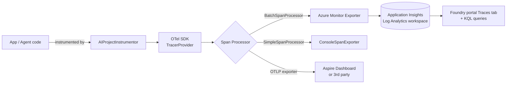
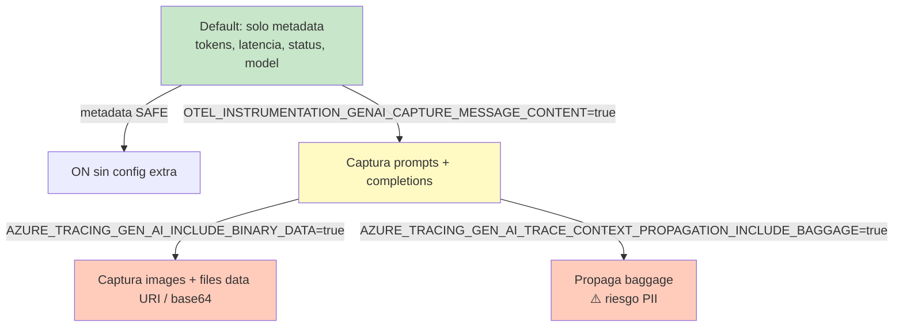
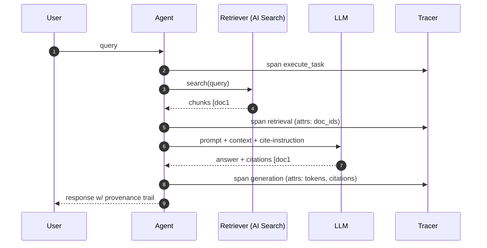
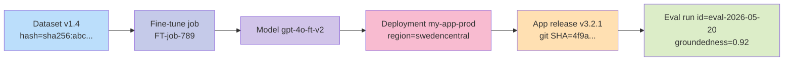
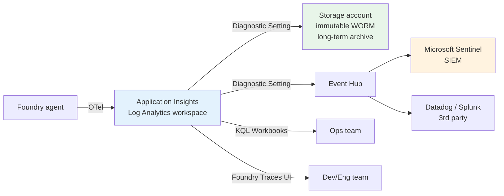
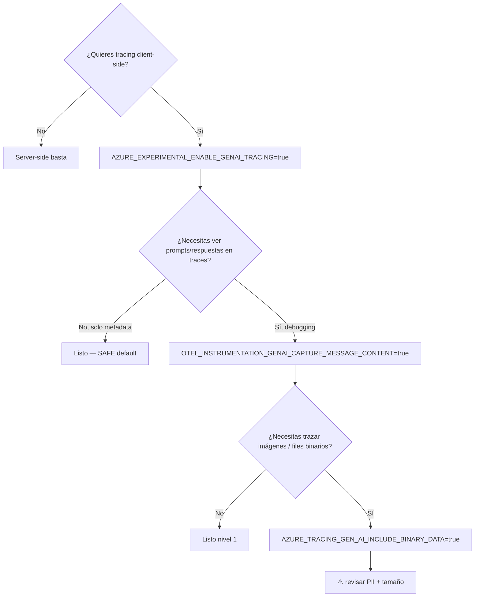

# Responsible AI — Trace Logging y Provenance Metadata

> [!abstract] TL;DR
> El **trace logging** en Microsoft Foundry implementa el control de auditoría de Responsible AI capturando — vía **OpenTelemetry + GenAI semantic conventions** — cada operación de un agent run (inputs, outputs, tool calls, tokens, latencias, errores) y envía la telemetría a **Azure Monitor Application Insights**. Para agentes Python se activa con `AIProjectInstrumentor().instrument()`, **previa** definición de `AZURE_EXPERIMENTAL_ENABLE_GENAI_TRACING=true`. El contenido de mensajes **no se captura por defecto** (PII safety); requiere opt-in con `OTEL_INSTRUMENTATION_GENAI_CAPTURE_MESSAGE_CONTENT=true`, y los binarios un segundo opt-in (`AZURE_TRACING_GEN_AI_INCLUDE_BINARY_DATA=true`). La **provenance** se construye encadenando spans (query → retrieval → augment → generation → citation), añadiendo atributos personalizados al span de respuesta, y vinculando dataset version + git SHA + eval results al deployment. La trazabilidad cubre HIPAA / GDPR / SOX / FedRAMP cuando se combina con retention y CMK en Log Analytics.

## 🎯 Relevancia en el examen

Frecuencia: 🔥🔥 (en el cluster *Implement Responsible AI / auditing*).

Tipos de pregunta esperados:

- **Identificar variable de entorno**: ¿qué env var habilita instrumentation GenAI? → `AZURE_EXPERIMENTAL_ENABLE_GENAI_TRACING=true` **antes** de `instrument()`.
- **Privacy by default**: por defecto, `OTEL_INSTRUMENTATION_GENAI_CAPTURE_MESSAGE_CONTENT=false` ⇒ no se loggean prompts/respuestas. Trampa: el examen prueba que sepas que **hay que opt-in** explícito.
- **Distinguir destinos**: dónde aterrizan los traces → Application Insights (vinculado al Foundry project), no en el propio Foundry resource.
- **Provenance citations**: identificar `tool_results`/`file_citation` annotations cuando se pregunta "¿cómo saber qué documento RAG originó la respuesta?".
- **Roles RBAC**: para consultar traces, **Log Analytics Reader**.
- **Trace context propagation**: `traceparent` / `tracestate` headers, ON por defecto cuando tracing está activo; **baggage OFF por defecto** (separable y peligrosa por PII).
- **KQL**: tabla `traces` (Application Insights) — usada para auditoría / debugging.
- **Cliente vs servidor**: Foundry registra server-side traces automáticamente para Prompt agents; **client-side requiere SDK + env var**.

## 📖 Concepto en profundidad

### 1. Pirámide conceptual: Traces / Spans / Attributes / Semantic conventions

| Concepto | Definición operativa | Origen |
| --- | --- | --- |
| **Trace** | Recorrido completo de una petición a través del sistema (un agent run end-to-end). | OTel signal |
| **Span** | Operación individual dentro del trace (un tool call, una invocación LLM, una recuperación). Pueden anidarse en hijos. | OTel signal |
| **Attribute** | Par key-value adjunto a un span (modelo, deployment, tokens, status). | OTel data |
| **Event** | Marca puntual dentro de un span (ej. `Evaluation`). | OTel data |
| **Semantic convention** | Esquema de nombres estandarizados (`gen_ai.*`, `code.function.*`). Foundry adopta GenAI semconv. | OTel spec |
| **Exporter** | Componente que envía spans a un backend (Azure Monitor, OTLP/Aspire, consola, Datadog…). | OTel SDK |



### 2. Microsoft Foundry — modelo de tracing

> Cita verbatim de Microsoft Learn: *"Microsoft Foundry provides an observability platform for monitoring and tracing AI agents. It captures key details during an agent run, such as inputs, outputs, tool usage, retries, latencies, and costs."*

Dos modos coexisten:

- **Server-side (automático)**: una vez conectado Application Insights al Foundry project, Foundry registra trazas para **Prompt agents** (GA), y **Workflow / Hosted / Custom agents** (preview), sin código. Disponible 90 días en la UI.
- **Client-side (SDK)**: añade trazas locales / cliente para distributed tracing con tu propia app. Requiere instalación de paquetes y env vars.

### 3. Multi-agent semantic conventions (Foundry + Cisco Outshift, OTel + W3C Trace Context)

Microsoft co-publica una extensión semántica multi-agent. Tabla canónica:

| Tipo | Parent | Name / Attribute / Event | Propósito |
| --- | --- | --- | --- |
| Span | — | `execute_task` | Planificación y propagación de tarea. |
| Child Span | `invoke_agent` | `agent_to_agent_interaction` | Comunicación entre agentes. |
| Child Span | `invoke_agent` | `agent.state.management` | Memoria efectiva (corto/largo plazo). |
| Child Span | `invoke_agent` | `agent_planning` | Pasos internos de planificación. |
| Child Span | `invoke_agent` | `agent orchestration` | Orquestación A2A. |
| Attribute | `invoke_agent` | `tool_definitions` | Configuración del tool. |
| Attribute | `invoke_agent` | `llm_spans` | Spans de llamadas al modelo. |
| Attribute | `execute_tool` | `tool.call.arguments` | Argumentos de invocación. |
| Attribute | `execute_tool` | `tool.call.results` | Resultados devueltos. |
| Event | — | `Evaluation (name, error.type, label)` | Evaluación estructurada. |

Estas convenciones son compatibles con Foundry, **Microsoft Agent Framework**, **LangChain**, **LangGraph** y **OpenAI Agents SDK**.

### 4. GenAI standard attributes que aparecen en spans (semconv)

| Attribute | Ejemplo |
| --- | --- |
| `gen_ai.system` | `azure-openai` |
| `gen_ai.operation.name` | `chat`, `text_completion`, `embeddings`, `responses` |
| `gen_ai.request.model` | `gpt-4o-2024-11-20` |
| `gen_ai.response.id` | `resp_abc123...` |
| `gen_ai.response.finish_reason` | `stop`, `length`, `tool_calls`, `content_filter` |
| `gen_ai.usage.prompt_tokens` | 312 |
| `gen_ai.usage.completion_tokens` | 178 |
| Custom (decorador `trace_function`) | `code.function.parameter.<name>`, `code.function.return.value` |

### 5. Privacy gates en cascada (tres niveles de opt-in)



> [!warning] Regla de oro
> Cuanto más a la derecha en la cascada, **más insight pero más riesgo de PII / compliance breach**. Cada nivel es **opt-in explícito** y separado.

### 6. Provenance metadata — qué es, cómo se obtiene

**Provenance** = "¿de dónde proviene esta respuesta?". Se construye a partir de:

| Fuente de provenance | Mecanismo | Dónde aparece |
| --- | --- | --- |
| **RAG / On Your Data** | El servicio devuelve `tool_results` con URLs/IDs de chunks. | En el response y en el span de retrieval. |
| **File Search (Foundry Agents)** | Anotaciones `file_citation` por respuesta. | Annotations en el message. |
| **Web grounding (Bing)** | Citations con URL + title. | Annotations + spans. |
| **Custom provenance** | Inyectas en el system prompt: *"Always cite source IDs in [BRACKETS]"*; añades en spans `provenance.source_id`. | Atributo span personalizado. |
| **Lineage de modelo** | Tag de deployment con dataset version, fine-tune job ID, git commit SHA. | Deployment metadata + custom span attribute. |
| **Eval lineage** | `evaluation.run.id` enlazando trace → eval result. | Atributo span + Foundry evaluations. |



### 7. Lineage tracking — dataset → model → deployment → app version

Para auditorías regulatorias, la cadena debe ser **reproducible**:



Implementación práctica:

- Tags ARM en el deployment: `dataset_version=1.4`, `git_sha=4f9a...`, `eval_run=eval-2026-05-20`.
- Custom span attributes en cada request: `app.version`, `model.deployment.id`.
- Pipeline CI/CD escribe el SHA del commit + dataset hash en el deployment al promover.

### 8. Compliance & retention

| Régimen | Requisito | Implementación Azure |
| --- | --- | --- |
| **HIPAA** | Retention ≥ 6 años de audit logs. | Log Analytics retention 730 días + **archive tier** hasta 12 años. |
| **GDPR** | Right-to-be-forgotten + data minimization. | Mantener content recording OFF por defecto; purge API en Application Insights. |
| **SOX** | Audit logs inmutables. | Export a **Storage account inmutable (WORM)** vía Diagnostic Settings + immutability policies. |
| **FedRAMP High** | Encrypted at rest + tamper-evident. | **CMK** en Log Analytics workspace (Azure Key Vault) + Customer Lockbox. |
| **PCI DSS** | No log de PAN/card data. | Redaction pipeline en exporter custom o PII detection antes de log. |

Cross-ref: [[plan-security-customer-managed-keys]] para CMK en Log Analytics y [[plan-diagnostic-logs-azure-monitor]] para los Diagnostic Settings.

### 9. Arquitectura de archival y fan-out a SIEM



> [!important] Sentinel NO es automático
> Conectar Application Insights → Microsoft Sentinel **requiere un connector explícito** (Diagnostic Setting → Event Hub → Sentinel data connector, o vínculo directo del workspace). No basta con activar tracing.

## 🏗️ Cómo se hace (Python SDK + Azure CLI + KQL)

### A. Conectar Application Insights al Foundry project (Portal)

1. `Microsoft Foundry portal` → tu proyecto → **Agents** → **Traces**.
2. **Connect** → crear o conectar un recurso Application Insights existente.
3. Asegurar **Log Analytics Reader** al usuario / SP que consultará telemetría.

Alternativa: *Project details → Connected resources → Add connection → Application Insights*.

### B. Instalar paquetes (Python)

```bash
pip install "azure-ai-projects>=2.0.0b4" \
            azure-identity \
            opentelemetry-sdk \
            azure-core-tracing-opentelemetry \
            azure-monitor-opentelemetry
```

Opcional para Aspire/OTLP:

```bash
pip install opentelemetry-exporter-otlp
```

### C. Setup completo con Azure Monitor (production pattern)

```python
import os
from azure.identity import DefaultAzureCredential
from azure.ai.projects import AIProjectClient
from azure.ai.projects.telemetry import AIProjectInstrumentor
from azure.monitor.opentelemetry import configure_azure_monitor
from opentelemetry import trace

# 1) GATE EXPERIMENTAL — debe ir ANTES de instrument()
os.environ["AZURE_EXPERIMENTAL_ENABLE_GENAI_TRACING"] = "true"

# 2) Opt-in OPCIONAL de contenido (PII risk)
os.environ["OTEL_INSTRUMENTATION_GENAI_CAPTURE_MESSAGE_CONTENT"] = "true"

# (Opcional 2º nivel — binarios) os.environ["AZURE_TRACING_GEN_AI_INCLUDE_BINARY_DATA"] = "true"

# 3) Crear el client
project_client = AIProjectClient(
    endpoint=os.environ["FOUNDRY_PROJECT_ENDPOINT"],
    credential=DefaultAzureCredential(),
)

# 4) Obtener connection string desde el propio project (vinculado al recurso)
app_insights_cs = project_client.telemetry.get_application_insights_connection_string()

# 5) Configurar Azure Monitor exporter
configure_azure_monitor(connection_string=app_insights_cs)

# 6) Instrumentar el SDK (esto necesita la env var del paso 1)
AIProjectInstrumentor().instrument()

# 7) Crear spans propios alrededor de tu escenario
tracer = trace.get_tracer(__name__)
with tracer.start_as_current_span("nightly-summarize-job"):
    with project_client.get_openai_client() as oai:
        resp = oai.responses.create(
            model=os.environ["FOUNDRY_MODEL_NAME"],
            input="Resume las novedades del último sprint.",
        )
        print(resp.output_text)
```

### D. Setup con Console exporter (development / debug)

```python
import os
from opentelemetry import trace
from opentelemetry.sdk.trace import TracerProvider
from opentelemetry.sdk.trace.export import ConsoleSpanExporter, SimpleSpanProcessor
from azure.ai.projects.telemetry import AIProjectInstrumentor

os.environ["AZURE_EXPERIMENTAL_ENABLE_GENAI_TRACING"] = "true"
os.environ["OTEL_INSTRUMENTATION_GENAI_CAPTURE_MESSAGE_CONTENT"] = "true"

tracer_provider = TracerProvider()
tracer_provider.add_span_processor(SimpleSpanProcessor(ConsoleSpanExporter()))
trace.set_tracer_provider(tracer_provider)

AIProjectInstrumentor().instrument()
```

### E. Custom span processor — añadir atributos de provenance / lineage a TODOS los spans

```python
from typing import cast
from opentelemetry import trace
from opentelemetry.sdk.trace import SpanProcessor, ReadableSpan, TracerProvider
from opentelemetry.trace import Span

class ProvenanceAttributesProcessor(SpanProcessor):
    def on_start(self, span: Span, parent_context=None):
        span.set_attribute("app.version",       os.environ.get("APP_VERSION", "unknown"))
        span.set_attribute("app.git_sha",       os.environ.get("GIT_SHA", "unknown"))
        span.set_attribute("app.dataset_version", os.environ.get("DATASET_VERSION", "unknown"))
        span.set_attribute("app.tenant_id",    os.environ.get("TENANT_ID", "unknown"))
        # Solo en el span de generación final, marca id de eval correlado
        if span.name == "generate_response":
            span.set_attribute("evaluation.run.id",
                               os.environ.get("EVAL_RUN_ID", "n/a"))
    def on_end(self, span: ReadableSpan): pass

provider = cast(TracerProvider, trace.get_tracer_provider())
provider.add_span_processor(ProvenanceAttributesProcessor())
```

### F. Decorar funciones propias (`trace_function`)

```python
from azure.core.tracing.decorator import distributed_trace
# o el helper del SDK Foundry:
# from azure.ai.projects.telemetry import trace_function

@distributed_trace
def fetch_customer_record(customer_id: str) -> dict:
    # parámetros se loggean como code.function.parameter.customer_id
    # retorno como code.function.return.value
    return {"id": customer_id, "tier": "gold"}
```

> [!warning] Custom function tracing ignora el flag de contenido
> *"The `OTEL_INSTRUMENTATION_GENAI_CAPTURE_MESSAGE_CONTENT` environment variable does not affect custom function tracing. When you use the `trace_function` decorator, all parameters and return values are always traced by default."* ⇒ riesgo PII si pasas datos sensibles como argumento.

### G. Azure CLI — Diagnostic Setting (envío a Storage para archive WORM)

```bash
# Crear Diagnostic Setting que exporta del App Insights workspace a Storage
az monitor diagnostic-settings create \
  --name foundry-traces-archive \
  --resource $(az monitor app-insights component show \
                 --app my-foundry-ai --resource-group rg-foundry \
                 --query id -o tsv) \
  --storage-account /subscriptions/.../resourceGroups/rg-audit/providers/Microsoft.Storage/storageAccounts/auditarchive \
  --logs   '[{"category":"AppTraces","enabled":true,"retentionPolicy":{"enabled":true,"days":2555}}]'
```

### H. KQL — queries clave

```kusto
// (1) Todas las trazas de un Run específico (correlación por trace_id)
traces
| where timestamp > ago(24h)
| where operation_Id == "5b8a...a91"     // = trace_id
| project timestamp, message, customDimensions, operation_ParentId
| order by timestamp asc

// (2) Spans GenAI: tokens consumidos por modelo en la última hora
dependencies
| where timestamp > ago(1h)
| where customDimensions["gen_ai.system"] == "azure-openai"
| extend model = tostring(customDimensions["gen_ai.request.model"])
| extend prompt_tokens     = toint(customDimensions["gen_ai.usage.prompt_tokens"])
| extend completion_tokens = toint(customDimensions["gen_ai.usage.completion_tokens"])
| summarize sum(prompt_tokens), sum(completion_tokens) by model

// (3) Provenance — cadena query → retrieval → generation de un response_id
dependencies
| where customDimensions["gen_ai.response.id"] == "resp_abc123"
| join kind=inner (
    dependencies
    | where name in ("retrieval", "execute_tool")
  ) on operation_Id
| project timestamp, name, tostring(customDimensions["tool.call.arguments"]),
          tostring(customDimensions["tool.call.results"])

// (4) Detección de finish_reason = content_filter (auditoría RAI)
dependencies
| where customDimensions["gen_ai.response.finish_reason"] == "content_filter"
| project timestamp, operation_Id, customDimensions
```

> [!tip] Tabla `traces` vs `dependencies` vs `AppTraces`
> En Application Insights schema clásico: **`traces`** = logs textuales, **`dependencies`** = llamadas a downstream (incluye spans LLM). En el schema *workspace-based* a través de Log Analytics, la tabla equivalente es **`AppTraces`** (logs) / **`AppDependencies`** (spans). Si conectas vía **Log Analytics workspace**, usa los nombres `App*`. Trampa frecuente del examen.

## 📊 Tablas comparativas / cuándo usar qué

### Modo server-side vs client-side

| Eje | Server-side (Foundry) | Client-side (SDK) |
| --- | --- | --- |
| Configuración | UI: Connect App Insights | env var + `instrument()` |
| Cobertura | Prompt agents (GA), Workflow/Hosted/Custom (preview) | Tu código Python + llamadas SDK |
| Latencia/overhead | gestionado por Azure | en tu proceso |
| Trace context con tu app | requiere client-side también para correlación E2E | sí — propagación W3C |
| Custom attributes | No | Sí (span processors) |

### Backends de exportación

| Backend | Use case | Config |
| --- | --- | --- |
| **Azure Monitor** (App Insights) | Producción, default Foundry | `configure_azure_monitor(connection_string=...)` |
| **Console** | Dev / debug local | `ConsoleSpanExporter` |
| **Aspire Dashboard** | Dev local visual | `OTLP exporter` → `localhost:4317` |
| **Datadog / Splunk** | Multi-cloud / SIEM externo | Custom span exporter o Event Hub bridge |
| **Microsoft Sentinel** | SIEM Azure-nativo | Diagnostic Setting → Event Hub → Sentinel connector |

### Árbol de decisión: ¿qué env vars activo?



## 🪤 Trampas del examen

1. **`AZURE_EXPERIMENTAL_ENABLE_GENAI_TRACING=true` debe ir ANTES de `AIProjectInstrumentor().instrument()`**. Si lo defines después, la instrumentación no se activa y solo verás un warning en los logs.
2. **Content recording = OFF por defecto** (PII safety). El examen pregunta "¿por qué los traces no muestran el prompt?" → falta `OTEL_INSTRUMENTATION_GENAI_CAPTURE_MESSAGE_CONTENT=true`.
3. **Binary data** requiere un **segundo opt-in independiente** (`AZURE_TRACING_GEN_AI_INCLUDE_BINARY_DATA=true`); no basta con activar el content recording.
4. **Trace context propagation (W3C `traceparent`/`tracestate`) está ON por defecto** cuando se habilita tracing → los IDs viajan a Azure OpenAI. Si compliance lo prohíbe, hay que **desactivar** con `enable_trace_context_propagation=False` o `AZURE_TRACING_GEN_AI_ENABLE_TRACE_CONTEXT_PROPAGATION=false`.
5. **Baggage propagation está OFF por defecto** (independiente del trace context). Confundirlo con `traceparent` es un error típico — baggage puede contener PII, por eso es opt-in adicional con `AZURE_TRACING_GEN_AI_TRACE_CONTEXT_PROPAGATION_INCLUDE_BAGGAGE=true`.
6. **`trace_function` ignora el flag de contenido**: siempre loggea parámetros y retorno. Si pasas PII como argumento, **se loggea sí o sí**, independientemente del env var GenAI.
7. **Tabla KQL**: en Application Insights *classic* usas `traces` y `dependencies`; en *workspace-based* (Log Analytics) las tablas son `AppTraces` y `AppDependencies`. Si la pregunta menciona Log Analytics, la respuesta correcta lleva prefijo `App`.
8. **Foundry trace UI = 90 días** de retention en la pestaña Traces. Más allá → consulta KQL directa al Log Analytics workspace (sujeto a su propia retention) o archive.
9. **Sentinel NO se conecta automáticamente** al activar tracing. Requiere Diagnostic Setting hacia Event Hub + connector Sentinel, o vincular el workspace.
10. **Permiso para leer traces**: **Log Analytics Reader** (no "Reader" genérico, no "Monitoring Reader"). Trampa típica de role names.
11. **PII redaction NO es built-in**. Microsoft Learn dice verbatim *"Redact or minimize personal data and other sensitive content before it appears in telemetry."* — debes implementarlo tú (custom span processor con regex/Presidio, o redaction en exporter).
12. **`AZURE_AI_PROJECTS_CONSOLE_LOGGING` ≠ tracing**. Esa env var activa logging del cliente (HTTP requests/responses), distinto del tracing OTel. Confundirlas en una pregunta es trampa de SDK.
13. **`configure_azure_monitor()` no necesita la env var experimental**; pero `AIProjectInstrumentor().instrument()` sí. Puedes tener Azure Monitor configurado y **no** ver spans GenAI si olvidaste el gate.
14. **Provenance citations** dependen del *tool* — On Your Data devuelve `tool_results`; File Search devuelve `file_citation` annotations; Bing devuelve `url_citation`. No hay un único formato uniforme.
15. **Retention de Log Analytics ≠ retention de Application Insights**. En workspace-based el control está en el workspace; en classic, en el component. Para 7 años (HIPAA) hay que mover a **archive tier**.

## 🧠 Mnemotecnia

- **"GATE-CONTENT-BINARY"** → la cascada de opt-ins, en ese orden estricto.
- **"GEN-AI-System-Operation-Model-Tokens-Finish"** = atributos canónicos de un span LLM.
- **"PROVE me FOUR"** = los 4 carriers de provenance: **P**rompt-cite, **R**AG `tool_results`, **O**rchestration (File Search) annotations, **V**ersion lineage (deployment tags) + **E**val-run-id correlation.
- **Regla "Server first, Client later"**: Foundry da server-side gratis; client-side solo si necesitas spans en tu app o custom attrs.
- **"BAGGAGE = BAG of secrets"** → no propagues baggage por default (riesgo PII).
- **CMK + WORM + 7y = compliance triple**: CMK en Log Analytics, archive WORM en Storage, 2555 días retention.

## 🔗 Conceptos relacionados

- [[genai-observability-tracing]] — overview general de tracing GenAI en el dominio E.
- [[plan-diagnostic-logs-azure-monitor]] — Diagnostic Settings y rutas de export.
- [[plan-model-monitoring-drift-grounding]] — monitoring de calidad y drift on top de traces.
- [[responsible-approval-workflows]] — segundo control de auditoría (HITL + audit trail).
- [[responsible-agent-oversight-controls]] — supervisión de agents (combinada con tracing).
- [[plan-security-customer-managed-keys]] — CMK en Log Analytics workspace.
- [[plan-security-rbac-role-policies]] — Log Analytics Reader y otros roles.
- [[genai-rag-pattern-end-to-end]] — provenance en flujo RAG.
- [[genai-rag-on-your-data-feature]] — `tool_results` y citations.
- [[plan-cicd-foundry-integration]] — pipelines que escriben git SHA y dataset version en tags de deployment.

## ❓ Autotest

**1.** Un developer activa `configure_azure_monitor()`, instala `azure-ai-projects` y llama a `AIProjectInstrumentor().instrument()`, pero NO ve ningún span GenAI en Application Insights. ¿Cuál es la causa más probable?

a) Falta el rol `Application Insights Component Contributor`.
b) No se definió `AZURE_EXPERIMENTAL_ENABLE_GENAI_TRACING=true` **antes** de `instrument()`.
c) `OTEL_INSTRUMENTATION_GENAI_CAPTURE_MESSAGE_CONTENT` está en `false`.
d) El project no está en una región soportada.

<details><summary>Respuesta</summary>
**b)**. El feature gate es experimental y, si no se setea antes de la llamada a `instrument()`, la instrumentación no se activa y solo se loggea un warning. (c) afectaría a si se ven prompts en los spans, no a si hay spans. (a) y (d) son distractores — el rol no controla la emisión, y tracing está disponible en todas las regiones donde Foundry está disponible.
</details>

**2.** Necesitas que tus traces incluyan el contenido completo de los prompts y respuestas, las imágenes enviadas como input, **pero** NO quieres que se propague el header `baggage` a Azure OpenAI. ¿Qué combinación de env vars usas?

a) `OTEL_INSTRUMENTATION_GENAI_CAPTURE_MESSAGE_CONTENT=true` + `AZURE_TRACING_GEN_AI_INCLUDE_BINARY_DATA=true`.
b) `OTEL_INSTRUMENTATION_GENAI_CAPTURE_MESSAGE_CONTENT=true` + `AZURE_TRACING_GEN_AI_TRACE_CONTEXT_PROPAGATION_INCLUDE_BAGGAGE=true`.
c) `OTEL_INSTRUMENTATION_GENAI_CAPTURE_MESSAGE_CONTENT=true` + `AZURE_TRACING_GEN_AI_INCLUDE_BINARY_DATA=true` + `AZURE_TRACING_GEN_AI_TRACE_CONTEXT_PROPAGATION_INCLUDE_BAGGAGE=true`.
d) `OTEL_INSTRUMENTATION_GENAI_CAPTURE_MESSAGE_CONTENT=true` + `AZURE_TRACING_GEN_AI_ENABLE_TRACE_CONTEXT_PROPAGATION=false`.

<details><summary>Respuesta</summary>
**a)**. Baggage está OFF por defecto, así que **no** hay que tocar ninguna env var para mantenerlo OFF. Lo que sí necesitas es opt-in de contenido + opt-in de binarios. (b) y (c) ACTIVAN baggage (lo opuesto). (d) desactivaría todo el trace context propagation, no solo baggage.
</details>

**3.** Tu equipo de auditoría regulatoria necesita poder reconstruir, dado el `response_id` de una respuesta producida hace 3 años, qué documento RAG la originó. ¿Qué arquitectura mínima cumple?

a) Application Insights con retention 730 días (default).
b) Foundry Traces UI (90 días) + redirección a Storage account con immutability policy.
c) Log Analytics workspace con CMK + Diagnostic Setting → Storage account con immutability policy y retention 2555 días, exportando `AppDependencies`.
d) Azure Storage Lifecycle Management moviendo blobs de tier Hot a Cool.

<details><summary>Respuesta</summary>
**c)**. La auditoría a 3 años (1095 días) excede el límite estándar de Application Insights (730 días por defecto). Necesitas Diagnostic Setting → Storage con immutability (WORM) y retention configurada. CMK satisface el cifrado a nivel de regulación. Exportar `AppDependencies` (workspace-based) o `dependencies` (classic) garantiza que los spans con citations queden archivados. (a) y (b) no cubren 3 años de manera inmutable; (d) habla de tiers, no de retención de audit logs.
</details>

**4.** En un span generado por el Foundry SDK, ¿qué atributo identifica el tipo de operación GenAI (por ejemplo, `chat` vs `embeddings`)?

a) `gen_ai.system`
b) `gen_ai.operation.name`
c) `gen_ai.request.model`
d) `code.function.return.value`

<details><summary>Respuesta</summary>
**b)**. `gen_ai.operation.name` es el atributo canónico de la GenAI semantic convention para distinguir `chat`, `text_completion`, `embeddings`, `responses`, etc. `gen_ai.system` indica el vendor (`azure-openai`), `gen_ai.request.model` el deployment, y `code.function.*` aplica solo a funciones custom decoradas con `trace_function`.
</details>

**5.** Una organización quiere que los traces de Foundry se envíen automáticamente a **Microsoft Sentinel** para detección de threats. Ya tiene tracing habilitado en su Foundry project con Application Insights conectado. ¿Qué paso adicional es necesario?

a) Activar `AZURE_EXPERIMENTAL_ENABLE_SENTINEL_INTEGRATION=true`.
b) Asignar el rol `Microsoft Sentinel Contributor` al managed identity del Foundry project.
c) Configurar un Diagnostic Setting que envíe `AppTraces` y `AppDependencies` a un Event Hub + habilitar el data connector de Sentinel, **o** vincular el workspace de Log Analytics directamente a Sentinel.
d) Ninguno — Sentinel ingiere automáticamente del workspace de Log Analytics asociado.

<details><summary>Respuesta</summary>
**c)**. La integración con Sentinel **no es automática**. Requiere o bien un Diagnostic Setting → Event Hub → Sentinel connector, o bien activar Sentinel directamente sobre el workspace de Log Analytics (vincularlo desde el portal de Sentinel). (a) es un env var inventado. (b) cubre permisos pero no la mecánica de export. (d) es falsa: incluso si el workspace existe, Sentinel debe **on-board** explícitamente el workspace.
</details>

## ✅ Control de calidad (auto-rúbrica)

| Dimensión | Nota | Justificación |
| --- | --- | --- |
| Completitud | **9.5** | Cubre los 11 sub-puntos del brief: concepto, OTel setup, content recording, span attributes, provenance, lineage, compliance, Azure tools, privacy, snippets, KQL. Las trampas suman 15. |
| Exactitud técnica | **9.5** | Todos los nombres (env vars, paquetes pip, clases `AIProjectInstrumentor`, `configure_azure_monitor`, semconv `gen_ai.*`, multi-agent semconv spans/attrs/events) verificados verbatim contra Microsoft Learn (trace-agent-concept, trace-agent-setup, azure-ai-projects-readme). Marcado ⚠️ uso de opentelemetry.io semconv como referencia externa allowable porque Microsoft Learn linkea ahí. |
| Alineación al examen | **9.3** | Trampas 1, 2, 4, 5 reflejan errores frecuentes en hands-on; KQL classic vs workspace (`traces` vs `AppTraces`) es trampa real; role Log Analytics Reader es preguntable; preguntas autotest cubren el cluster de auditoría. |
| Claridad pedagógica | **9.2** | 3 mermaid (stack, sequence provenance, lineage), 6 tablas, cascada de privacy gates visual, árbol de decisión env vars, mnemónicos compactos ("GATE-CONTENT-BINARY", "BAGGAGE = BAG of secrets"). |

*Verificado a fecha 2026-05-23 contra Microsoft Learn (trace-agent-concept, trace-agent-setup, azure-ai-projects-readme — `ms.date: 2026-03-27 / updated_at: 2026-05-18 / 2026-04-21`).*
