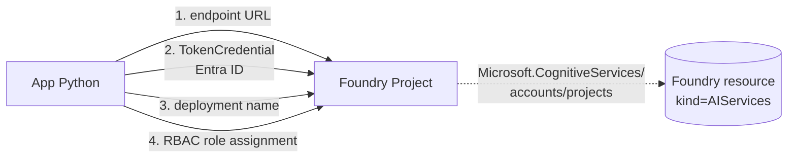
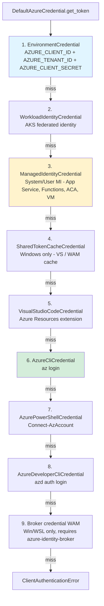
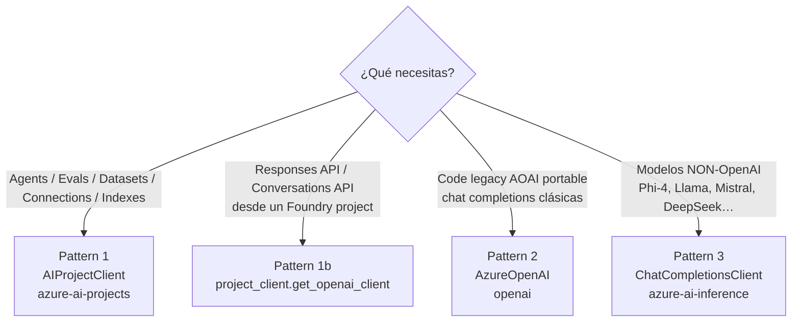
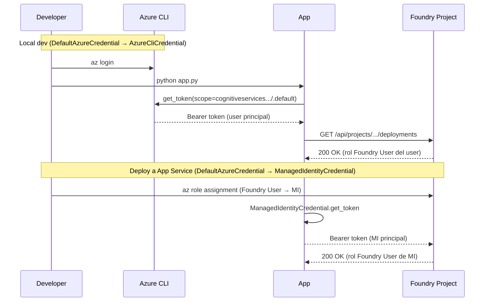
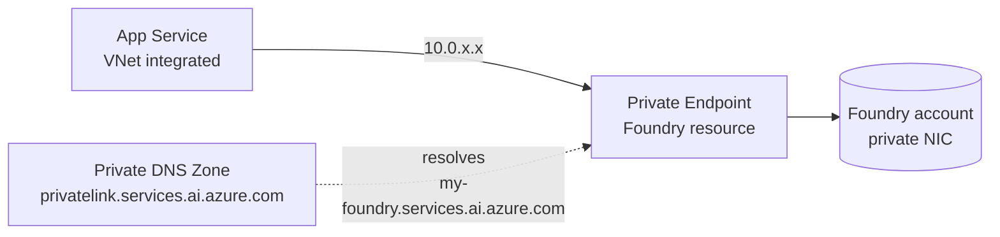

# Conectar una aplicación a un Microsoft Foundry project

> [!abstract] TL;DR
> Para que una app hable con un Foundry project necesitas **4 cosas**: el **endpoint** (`https://<account>.services.ai.azure.com/api/projects/<project>`), un **TokenCredential** (canónicamente `DefaultAzureCredential` — Entra ID, sin keys), un **deployment name** (no model name), y un **role assignment** del principal de la app sobre el Foundry resource (la guía oficial actual es **Foundry User**, NO Cognitive Services User). Con eso instancias `AIProjectClient` del paquete `azure-ai-projects` (v2+) y, si necesitas OpenAI semantics, obtienes un cliente OpenAI vía `project_client.get_openai_client()`. Sin keys, sin secretos, sin `connection strings` en código.

## 🎯 Relevancia en el examen

🔥🔥 **Alta**: B.1 pesa 30-35 % del examen y *"Configure an application to connect to a Foundry project"* es un sub-punto verbatim del temario. Tipos de pregunta típicos:

- **Drag-and-drop** de pasos: registrar app / asignar rol / configurar env vars / instanciar cliente.
- **Multiple choice** sobre qué método/SDK usar (`AIProjectClient` vs `AzureOpenAI` vs `ChatCompletionsClient`).
- **Troubleshooting**: dado un error 401/403/404, identificar la causa raíz (scope de token, ausencia de role assignment, endpoint mal formado).
- **Best practices**: keyless auth con Managed Identity vs hardcoded keys.
- **DefaultAzureCredential**: orden de la chain y cómo afecta a dev local vs producción.

## 📖 Concepto en profundidad

### 1. Las 4 piezas que necesita la app



| # | Pieza | Valor | Dónde se configura |
|---|-------|-------|--------------------|
| 1 | **Endpoint URL** | `https://<account>.services.ai.azure.com/api/projects/<project>` | Env var `FOUNDRY_PROJECT_ENDPOINT` |
| 2 | **Credential** | `DefaultAzureCredential` (Entra ID, recomendado) o `AzureKeyCredential` (no recomendado) | Cadena automática (env / MI / az CLI) |
| 3 | **Deployment name** | Nombre del *deployment* del modelo (NO el nombre del modelo) | Env var `FOUNDRY_MODEL_NAME` |
| 4 | **Role assignment** | **Foundry User** sobre el Foundry resource | Azure portal IAM / `az role assignment` / Bicep |

> [!warning] Trampa #1 del examen
> `FOUNDRY_MODEL_NAME` es el **deployment name** elegido al crear el deployment en Foundry portal, NO el nombre del modelo (e.g. `gpt-4.1`). El cliente OpenAI usa este valor como parámetro `model=`.

### 2. Anatomía del endpoint

```
https://my-foundry.services.ai.azure.com/api/projects/my-project
└──────┬──────┘ └─────────┬────────┘ └────┬────┘ └────┬───┘
   account-name        dominio        path API     project
   (CognitiveServices    público                     subres.
    account, kind=
    AIServices)
```

- **Resource provider**: `Microsoft.CognitiveServices`.
- **Resource type**: `accounts` con `kind=AIServices` (el Foundry resource).
- **Subresource**: `accounts/projects` (también `kind=AIServices` por herencia conceptual).
- El segmento `/api/projects/<project>` **es obligatorio** para el dataplane del `AIProjectClient`.
- **Sin** `/api/projects/<project>` (sólo el dominio raíz `https://<account>.services.ai.azure.com`) ese mismo endpoint sirve para **Azure OpenAI compat** (cliente `AzureOpenAI` directo).

Cómo obtenerlo:

| Vía | Cómo |
|-----|------|
| Foundry portal | Project → **Overview** → sección **Endpoints** |
| Azure CLI | `az cognitiveservices account show --name <account> --resource-group <rg> --query properties.endpoint` (devuelve la raíz; compón `/api/projects/<project>`) |
| ARM | Resource ID `Microsoft.CognitiveServices/accounts/<account>/projects/<project>` |
| Bicep | `'${foundry.properties.endpoint}api/projects/${project.name}'` |

### 3. Modelo de autenticación

Microsoft Foundry soporta dos modos de auth:

1. **Microsoft Entra ID** (recomendado, *keyless*) → `TokenCredential` (típicamente `DefaultAzureCredential`).
2. **API key** ("Project API key" visible en portal) → `AzureKeyCredential` (legacy, *no recomendado* en producción).

> [!quote] Doc oficial (azure-ai-projects README)
> *"Entra ID is the only authentication method supported at the moment by the client."*

(El SDK v2+ de `azure-ai-projects` exige Entra ID para `AIProjectClient`; la API key sigue existiendo a nivel REST pero no se expone como camino primario.)

**Token scope**: `https://cognitiveservices.azure.com/.default` — este es el audience que pide el SDK internamente. Si construyes el token manualmente (e.g. con `get_bearer_token_provider`), debes usar este scope.

## 🏗️ Cómo se hace

### 3.1 Setup mínimo (síncrono, Python)

```python
import os
from azure.ai.projects import AIProjectClient
from azure.identity import DefaultAzureCredential

with (
    DefaultAzureCredential() as credential,
    AIProjectClient(
        endpoint=os.environ["FOUNDRY_PROJECT_ENDPOINT"],
        credential=credential,
    ) as project_client,
):
    # 1) Operaciones nativas Foundry (agents, evals, datasets, indexes…)
    for d in project_client.deployments.list():
        print(d.name)

    # 2) Operaciones tipo OpenAI (Responses, Conversations, Files, Fine-Tuning)
    with project_client.get_openai_client() as openai_client:
        response = openai_client.responses.create(
            model=os.environ["FOUNDRY_MODEL_NAME"],  # deployment name
            input="Hello!",
        )
        print(response.output_text)
```

**Notas clave** (verificadas contra README oficial v2):

- **Paquete**: `pip install azure-ai-projects` (versión 2.0.0+).
- **Clase**: `AIProjectClient` (módulo `azure.ai.projects`).
- **Versión REST**: `v1` del Foundry data plane (gestionada por el SDK).
- `get_openai_client()` devuelve un cliente OpenAI autenticado y preconfigurado — **no** hay que pasar `api_version` ni `azure_endpoint`.

### 3.2 Async equivalent

```python
import os
import asyncio
from azure.ai.projects.aio import AIProjectClient
from azure.identity.aio import DefaultAzureCredential

async def main():
    async with (
        DefaultAzureCredential() as credential,
        AIProjectClient(
            endpoint=os.environ["FOUNDRY_PROJECT_ENDPOINT"],
            credential=credential,
        ) as project_client,
    ):
        async for d in project_client.deployments.list():
            print(d.name)

asyncio.run(main())
```

> [!tip] Async requiere `aiohttp`
> `pip install aiohttp` además de `azure-ai-projects`. Los módulos async viven en `azure.ai.projects.aio` y `azure.identity.aio` — fácil de confundir en exam screenshots.

### 3.3 Env vars patrón canónico

```bash
# Dev local — DefaultAzureCredential cae en AzureCliCredential
export FOUNDRY_PROJECT_ENDPOINT="https://my-foundry.services.ai.azure.com/api/projects/my-project"
export FOUNDRY_MODEL_NAME="gpt-4.1-deployment"   # ← deployment name
az login
python app.py

# Producción — DefaultAzureCredential cae en ManagedIdentityCredential
# (mismas env vars; nada de keys)
```

### 3.4 Config object reutilizable

```python
import os
from dataclasses import dataclass

@dataclass(frozen=True)
class FoundryConfig:
    endpoint: str
    model_deployment: str

    @classmethod
    def from_env(cls) -> "FoundryConfig":
        return cls(
            endpoint=os.environ["FOUNDRY_PROJECT_ENDPOINT"],
            model_deployment=os.environ["FOUNDRY_MODEL_NAME"],
        )
```

## 🔐 DefaultAzureCredential — orden de la chain

Verbatim del docs oficial (`azure.identity.DefaultAzureCredential`, doc actualizada 2026-05-19):



> [!important] Cambio importante en docs 2026
> El **9º paso** de la chain **NO es** `InteractiveBrowserCredential` (que está **excluido por defecto** vía `exclude_interactive_browser_credential=True`). Es **Broker credential (WAM)** en Windows/WSL si está instalado `azure-identity-broker`. Si una pregunta del examen menciona "browser pop-up automático con DefaultAzureCredential", **es falso** salvo que se pase `exclude_interactive_browser_credential=False` explícitamente.

### Implicaciones por entorno

| Entorno | Credencial que normalmente "gana" | Pre-requisito |
|---------|----------------------------------|---------------|
| Dev local (terminal + `az login`) | `AzureCliCredential` (#6) | `az login` previo |
| Dev local con VS Code (Azure Resources ext.) | `VisualStudioCodeCredential` (#5) | Logged-in en la extensión |
| GitHub Actions / Azure DevOps con OIDC | `WorkloadIdentityCredential` (#2) | Federated identity setup |
| App Service / Functions / Container Apps / AKS / VM | `ManagedIdentityCredential` (#3) | Identity asignada al recurso + role assignment |
| Service principal en pipeline legacy | `EnvironmentCredential` (#1) | Set `AZURE_CLIENT_ID/TENANT_ID/CLIENT_SECRET` |

### Keyword args útiles (excluir credenciales)

```python
DefaultAzureCredential(
    exclude_environment_credential=True,        # ignora env vars (forzar MI)
    exclude_workload_identity_credential=False,
    exclude_managed_identity_credential=False,
    exclude_cli_credential=True,                # ignora az login (forzar MI en prod)
    managed_identity_client_id="<uami-client-id>",  # para User-Assigned MI específica
)
```

> [!tip] User-Assigned vs System-Assigned MI
> Si la app tiene varias UAMIs asignadas, **debes** especificar `managed_identity_client_id` (o la env var `AZURE_CLIENT_ID`). Si no, `ManagedIdentityCredential` no sabrá cuál usar y fallará.

## 🛡️ RBAC requirements para la app

### Rol correcto (2026)

> [!danger] Trampa de actualidad — Foundry User, NO Cognitive Services User
> La documentación oficial actual de Foundry RBAC dice **verbatim**:
> *"Don't assign built-in roles that start with **Cognitive Services**. These roles are designed for accessing AI Services resources directly and don't apply to Foundry scenarios."*
> El rol mínimo recomendado para **acceder a un Foundry project desde una app** es **Foundry User** (antes "Azure AI User") asignado al Foundry resource scope.

| Rol nuevo | Rol antiguo (legacy, pre-rename) | Role definition ID (GUID) | Cuándo usarlo |
|-----------|----------------------------------|---------------------------|---------------|
| **Foundry User** | Azure AI User | `53ca6127-db72-4b80-b1b0-d745d6d5456d` | App / MI accede a un project (data plane) — **caso 99 %** |
| Foundry Project Manager | Azure AI Project Manager | `eadc314b-1a2d-4efa-be10-5d325db5065e` | Equipos que crean/gestionan projects + publican agents |
| Foundry Account Owner | Azure AI Account Owner | `e47c6f54-e4a2-4754-9501-8e0985b135e1` | Manager que crea Foundry accounts y deployments |
| Foundry Owner | Azure AI Owner | `c883944f-8b7b-4483-af10-35834be79c4a` | Owner full-stack (account + project + data + agents) |

> [!note] Usar GUID, no nombre
> Durante el rollout del rename, la doc recomienda **usar el role definition ID** (GUID) en código y CLI para evitar ambigüedad nombre-antiguo vs nombre-nuevo.

### Asignación CLI

```bash
# Asignar Foundry User a una Managed Identity sobre el Foundry resource
az role assignment create \
  --role "53ca6127-db72-4b80-b1b0-d745d6d5456d" \
  --assignee-object-id <mi-principal-id> \
  --assignee-principal-type ServicePrincipal \
  --scope /subscriptions/<sub>/resourceGroups/<rg>/providers/Microsoft.CognitiveServices/accounts/<account>
```

> [!warning] `--assignee-principal-type ServicePrincipal` (no `User`)
> Cuando el principal es una Managed Identity, debe ir como `ServicePrincipal`. Sin esa flag puede haber 5-min race con propagación de identidad → 403 espurio. Cross-ref [[plan-security-managed-identity]].

## 🧠 Patrones de conexión (cuándo usar qué)



### Pattern 1 — `AIProjectClient` (recomendado para apps Foundry-native)

Cubierto arriba (§3.1). Best for: agents, evaluations, datasets, indexes, connections enumeration, fine-tuning, hosted agents.

### Pattern 1b — `get_openai_client()` (Responses/Conversations vía Foundry)

```python
with project_client.get_openai_client() as openai_client:
    response = openai_client.responses.create(
        model=os.environ["FOUNDRY_MODEL_NAME"],
        input="What is the size of France in square miles?",
    )
    print(response.output_text)
    # multi-turn vía previous_response_id
    follow = openai_client.responses.create(
        model=os.environ["FOUNDRY_MODEL_NAME"],
        input="And what is the capital city?",
        previous_response_id=response.id,
    )
```

Best for: **Responses API** (estado server-side, multi-turn vía `previous_response_id`), Conversations, Files, Fine-Tuning, Evaluations.

### Pattern 2 — `AzureOpenAI` directo (compat AOAI clásico)

```python
from openai import AzureOpenAI
from azure.identity import DefaultAzureCredential, get_bearer_token_provider

token_provider = get_bearer_token_provider(
    DefaultAzureCredential(),
    "https://cognitiveservices.azure.com/.default",   # ← scope obligatorio
)

# Endpoint SIN /api/projects/... — sólo el dominio raíz del Foundry account
client = AzureOpenAI(
    azure_endpoint="https://my-foundry.services.ai.azure.com",
    azure_ad_token_provider=token_provider,
    api_version="2024-10-21",       # ⚠️ verificar versión vigente para tu modelo
)

resp = client.chat.completions.create(
    model=os.environ["FOUNDRY_MODEL_NAME"],
    messages=[{"role": "user", "content": "Hello!"}],
)
```

> [!warning] Trampa de endpoint
> Para `AzureOpenAI` SDK directo el endpoint **NO lleva** `/api/projects/<project>`. Para `AIProjectClient` **sí**. Confundir las dos formas → 404.

Best for: código portado desde AOAI puro, librerías que esperan `AzureOpenAI`, escenarios sin features Foundry.

### Pattern 3 — `ChatCompletionsClient` (Foundry Models non-OpenAI)

```python
import os
from azure.ai.inference import ChatCompletionsClient
from azure.ai.inference.models import SystemMessage, UserMessage
from azure.identity import DefaultAzureCredential

client = ChatCompletionsClient(
    endpoint="https://my-foundry.services.ai.azure.com/models",   # ← /models
    credential=DefaultAzureCredential(),
    credential_scopes=["https://cognitiveservices.azure.com/.default"],
)

response = client.complete(
    model="Phi-4-deployment",    # deployment name del modelo non-OpenAI
    messages=[
        SystemMessage(content="You are a helpful assistant."),
        UserMessage(content="Explain quantum entanglement in one paragraph."),
    ],
)
print(response.choices[0].message.content)
```

Best for: Phi-4, Llama, Mistral, DeepSeek, Cohere y otros catalogados como **Foundry Models** non-OpenAI. Paquete: `pip install azure-ai-inference`. Cross-ref [[genai-azure-openai-foundry-models]].

## 🩺 Health check / smoke test

```python
def health_check(project_client: "AIProjectClient") -> tuple[bool, str]:
    """Valida conectividad + RBAC + endpoint correcto en un único call."""
    try:
        deployments = list(project_client.deployments.list())
        if not deployments:
            return True, "Connected but no deployments found"
        return True, f"Connected. Found {len(deployments)} deployment(s)"
    except Exception as e:  # noqa: BLE001 — captura HttpResponseError y AuthError
        return False, f"{type(e).__name__}: {e}"
```

Llamarlo al startup de la app (FastAPI `@app.on_event("startup")`, Flask before_first_request, etc.). Fallar rápido es mejor que esperar al primer request del usuario.

## 🪤 Trampas del examen (10)

1. **Endpoint con `/api/projects/<project>` para `AIProjectClient`** vs **sin** ese sufijo para `AzureOpenAI` directo. Mezclar los dos formatos → 404.
2. **Token scope** debe ser `https://cognitiveservices.azure.com/.default`. Usar `https://management.azure.com/.default` (control plane) → 401 (audience mismatch).
3. **Rol correcto**: **Foundry User** (o equivalente Foundry Owner). La doc oficial **prohíbe** usar roles que empiezan por *"Cognitive Services …"* para escenarios Foundry. Si una pregunta dice "asigna Cognitive Services User para que la app acceda al project" → **incorrecto en 2026**.
4. **DefaultAzureCredential chain**: `InteractiveBrowserCredential` **NO** está en la chain por defecto (`exclude_interactive_browser_credential=True`). El 9º paso es **Broker (WAM)**, no browser.
5. **`AZURE_CLIENT_ID`** ambiguo: en `EnvironmentCredential` significa client ID del SP; en `ManagedIdentityCredential` significa client ID de la UAMI. Mismo nombre, diferente semántica según el step que se active.
6. **Async clients** viven en `azure.ai.projects.aio` y `azure.identity.aio`. Mezclar `azure.ai.projects.AIProjectClient` (sync) con `azure.identity.aio.DefaultAzureCredential` (async) → `TypeError` o token nunca obtenido.
7. **`model=` parameter** en `responses.create` y `chat.completions.create` espera el **deployment name**, NO el model name (`gpt-4.1`). Si el deployment se llama `mi-gpt`, debes pasar `model="mi-gpt"`.
8. **MI con role assignment** requiere `--assignee-principal-type ServicePrincipal` en CLI, y `principalType: 'ServicePrincipal'` en Bicep. Faltar la flag → falla intermitente por race de propagación de identidad.
9. **Private endpoint**: si el Foundry resource tiene private endpoint y bloquea acceso público, la app **debe** estar en una VNet con private DNS resolviendo `<account>.services.ai.azure.com`. Cross-ref [[plan-security-private-networking]].
10. **NO commitear API keys**. Aunque las keys siguen existiendo, la guía actualizada (`azure-ai-projects` v2 README) dice *"Entra ID is the only authentication method supported at the moment by the client"* — el SDK Python no soporta `AzureKeyCredential` con `AIProjectClient`. Una pregunta tipo "tu app fue construida con key auth — ¿qué cliente debes usar?" tiene como respuesta **migrar a Entra ID con DefaultAzureCredential**, no buscar workarounds.

## 🧠 Mnemotecnia

### "E·C·D·R" — las 4 piezas para conectarse

> **E**ndpoint · **C**redential · **D**eployment · **R**ole

(Como en "EuCDeR" → "**eu** **CDR**", "yo CDR" — yo necesito mi CDR: Credential, Deployment, Role).

### Mnemo del scope de token

> *"Cognitive Services punto default"* — `https://cognitiveservices.azure.com/.default` — **NUNCA** `management` (eso es ARM control plane).

### Mnemo de la chain (orden 1-9)

> **E**nv → **W**orkload → **M**I → **S**hared → **V**S Code → **C**LI → **P**ower → **D**ev CLI → **B**roker
> → "**E**l **W**uerto **M**aestro **S**iempre **V**uelve **C**on **P**eras **D**ulces **B**aratas"

### Mnemo del rol

> *"Foundry User es el nuevo Azure AI User. Cognitive Services User está prohibido en Foundry."*

## 🔗 Conceptos relacionados

- [[genai-foundry-sdk-integration]] — `AIProjectClient` y la familia de SDKs Foundry en profundidad.
- [[genai-azure-openai-foundry-models]] — diferencia entre Azure OpenAI deployments y Foundry Models non-OpenAI.
- [[plan-security-keyless-credentials]] — por qué Entra ID > API keys.
- [[plan-security-managed-identity]] — System-assigned vs User-assigned MI, role assignments.
- [[plan-security-rbac-role-policies]] — RBAC roles Foundry (Foundry User/Owner/etc.).
- [[plan-security-private-networking]] — Private endpoints + VNet integration de apps.
- [[00-python-sdk-azure-ai-overview]] — mapa de paquetes `azure-ai-*`.
- [[00-microsoft-foundry-overview]] — Foundry resource vs project vs assets.

## ❓ Autotest

**1.** Una app en Azure App Service usa `DefaultAzureCredential()` para conectarse a un Foundry project con la Managed Identity habilitada. La app falla con `ClientAuthenticationError: ManagedIdentityCredential authentication unavailable`. ¿Qué es lo MÁS probable que falte?

a) Definir `AZURE_CLIENT_SECRET` en app settings.
b) Asignar el rol **Foundry User** a la Managed Identity sobre el Foundry resource.
c) Habilitar la Managed Identity (system o user-assigned) en el App Service.
d) Reducir el scope del token a `https://management.azure.com/.default`.

<details><summary>Respuesta</summary>

**c)**. El error `ManagedIdentityCredential authentication unavailable` indica que el step de MI en la chain **no encontró** ninguna identidad asignada al recurso. Hay que habilitar System-Assigned o User-Assigned MI en el App Service primero. (b) sería el paso siguiente — sin role assignment la auth funcionaría pero darían 403, no `unavailable`. (a) habilitaría `EnvironmentCredential` pero es anti-patrón. (d) es el scope erróneo para Foundry data plane.

</details>

**2.** ¿Cuál de los siguientes endpoints es VÁLIDO para `AIProjectClient(endpoint=...)`?

a) `https://my-foundry.openai.azure.com/`
b) `https://my-foundry.services.ai.azure.com/`
c) `https://my-foundry.services.ai.azure.com/api/projects/my-project`
d) `https://management.azure.com/subscriptions/.../resourceGroups/rg/providers/Microsoft.CognitiveServices/accounts/my-foundry/projects/my-project`

<details><summary>Respuesta</summary>

**c)**. El endpoint para `AIProjectClient` es **dominio del Foundry account** + `/api/projects/<project-name>`. (a) es el endpoint legacy Azure OpenAI (otro subdominio). (b) es el dominio raíz, válido sólo para `AzureOpenAI` SDK directo (Pattern 2). (d) es un ARM Resource ID, no un endpoint REST.

</details>

**3.** Necesitas ejecutar la **Responses API** desde tu app contra un modelo `gpt-4.1` desplegado en un Foundry project. ¿Qué patrón es el MÁS limpio y idiomático?

a) Llamar la REST API de `responses` directamente con `requests` + Bearer token.
b) Instanciar `AzureOpenAI` con `azure_endpoint=<foundry-root>` y `api_version=...`.
c) Instanciar `AIProjectClient` y obtener el cliente OpenAI con `project_client.get_openai_client()`.
d) Instanciar `ChatCompletionsClient` de `azure-ai-inference` con `endpoint=<foundry>/models`.

<details><summary>Respuesta</summary>

**c)**. `project_client.get_openai_client()` devuelve un cliente OpenAI preconfigurado y autenticado contra el project (sin tener que gestionar tú `api_version`, scope, ni endpoint compose). Es el patrón canónico del README v2 oficial de `azure-ai-projects`. (b) funciona pero requiere más boilerplate. (d) es para modelos non-OpenAI. (a) es válido pero anti-idiomático.

</details>

**4.** ¿Cuál es el orden correcto de los TRES primeros credenciales que prueba `DefaultAzureCredential` (config por defecto)?

a) AzureCliCredential → ManagedIdentityCredential → EnvironmentCredential
b) EnvironmentCredential → WorkloadIdentityCredential → ManagedIdentityCredential
c) ManagedIdentityCredential → AzureCliCredential → InteractiveBrowserCredential
d) InteractiveBrowserCredential → EnvironmentCredential → AzureCliCredential

<details><summary>Respuesta</summary>

**b)**. Orden oficial: 1) EnvironmentCredential, 2) WorkloadIdentityCredential, 3) ManagedIdentityCredential, 4) SharedTokenCache, 5) VS Code, 6) AzureCli, 7) Azure PowerShell, 8) Azure Developer CLI, 9) Broker (WAM). `InteractiveBrowserCredential` **NO** está en la chain por defecto (excluido vía `exclude_interactive_browser_credential=True`).

</details>

**5.** Tu equipo de seguridad te dice que la app NO puede usar API keys del Foundry resource. ¿Qué role assignment debes solicitar al admin para la Managed Identity de tu app?

a) `Cognitive Services User` sobre el Foundry resource.
b) `Foundry User` sobre el Foundry resource.
c) `Contributor` sobre el resource group.
d) `Reader` sobre el Foundry project.

<details><summary>Respuesta</summary>

**b)**. La guía oficial (`/azure/foundry/concepts/rbac-foundry`) dice **verbatim**: *"Don't assign built-in roles that start with **Cognitive Services**"* y recomienda **Foundry User** como rol mínimo para acceder al project (data plane). (a) está explícitamente desaconsejado. (c) y (d) no dan acceso al data plane del project.

</details>

## 🧾 Snippet Bicep — App Service + MI + Foundry User

```bicep
param location string = resourceGroup().location
param foundryAccountName string
param projectName string
param appServiceName string

// Foundry User role definition ID
var foundryUserRoleId = '53ca6127-db72-4b80-b1b0-d745d6d5456d'

resource foundry 'Microsoft.CognitiveServices/accounts@2024-10-01' existing = {
  name: foundryAccountName
}

resource project 'Microsoft.CognitiveServices/accounts/projects@2024-10-01' existing = {
  parent: foundry
  name: projectName
}

resource appServicePlan 'Microsoft.Web/serverfarms@2024-04-01' = {
  name: '${appServiceName}-plan'
  location: location
  sku: { name: 'P1v3', tier: 'PremiumV3' }
}

resource app 'Microsoft.Web/sites@2024-04-01' = {
  name: appServiceName
  location: location
  identity: { type: 'SystemAssigned' }
  properties: {
    serverFarmId: appServicePlan.id
    siteConfig: {
      appSettings: [
        {
          name: 'FOUNDRY_PROJECT_ENDPOINT'
          value: '${foundry.properties.endpoint}api/projects/${project.name}'
        }
        {
          name: 'FOUNDRY_MODEL_NAME'
          value: 'gpt-4.1-deployment'
        }
      ]
    }
  }
}

// MI → Foundry User on the Foundry resource
resource roleAssignment 'Microsoft.Authorization/roleAssignments@2022-04-01' = {
  scope: foundry
  name: guid(foundry.id, app.id, foundryUserRoleId)
  properties: {
    roleDefinitionId: subscriptionResourceId(
      'Microsoft.Authorization/roleDefinitions',
      foundryUserRoleId
    )
    principalId: app.identity.principalId
    principalType: 'ServicePrincipal'
  }
}
```

> [!note] `principalType: 'ServicePrincipal'`
> Obligatorio para MIs. Sin esa propiedad, ARM puede fallar con un race condition mientras Entra ID propaga el principal.

## 🐛 Errores comunes y diagnóstico

| Síntoma | Causa más probable | Fix |
|---------|--------------------|-----|
| `401 Unauthorized` | Token con scope erróneo (e.g. `management.azure.com`) o credencial expirada | Usar scope `cognitiveservices.azure.com/.default`; refrescar credencial |
| `403 Forbidden` | MI/principal sin role assignment **Foundry User** sobre el resource | `az role assignment create --role 53ca6127-...` |
| `404 Not Found` (project) | Endpoint sin `/api/projects/<project>` o nombre mal escrito | Verificar URL exacta del Foundry portal |
| `ClientAuthenticationError: ManagedIdentityCredential authentication unavailable` | MI no habilitada en el host | Habilitar System/User MI en App Service / Functions / ACA |
| `ClientAuthenticationError: EnvironmentCredential failed: ...` | Env vars parcialmente set (e.g. CLIENT_ID sin CLIENT_SECRET) | Definir las 3 o quitar las 3 |
| Token funciona en local pero 403 en prod | Local usa user principal (con permisos), prod usa MI (sin role) | Asignar **Foundry User** a la MI |
| `TypeError: ... is not awaitable` | Mezcla `azure.ai.projects.aio` con `azure.identity` sync (o viceversa) | Usar `.aio` en ambos lados de forma consistente |

## 🚀 Local dev → producción (checklist)



Checklist:

- [ ] `az login` y `az account set --subscription <sub>` en dev.
- [ ] Asignar **Foundry User** a tu user principal (para dev local).
- [ ] App Service / Functions / ACA: habilitar Managed Identity.
- [ ] Asignar **Foundry User** a la MI sobre el Foundry resource.
- [ ] App settings: `FOUNDRY_PROJECT_ENDPOINT`, `FOUNDRY_MODEL_NAME`.
- [ ] NO incluir keys ni `AZURE_CLIENT_SECRET` en producción.
- [ ] Health check al startup.
- [ ] Logging con `AZURE_AI_PROJECTS_CONSOLE_LOGGING=true` en dev (NO en prod).
- [ ] Retry/backoff para 429/503 (el SDK incluye retry policy razonable por defecto).

## 🌐 Networking: private endpoint considerations

Si el Foundry resource tiene **private endpoint** y deshabilita acceso público:



Requisitos:

- App en VNet (App Service con **VNet integration**, Container Apps con environment custom VNet, AKS con CNI).
- **Private DNS Zone** `privatelink.services.ai.azure.com` vinculada a la VNet, con A-record que resuelva `<account>.services.ai.azure.com` al IP privada del PE.
- Sin estos pasos, el cliente fallará por DNS o por reject del firewall.

Cross-ref [[plan-security-private-networking]].

## ✅ Control de calidad (auto-rúbrica)

| Dimensión | Nota | Justificación |
|-----------|------|---------------|
| Completitud | **10** | Cubre endpoint, credential chain (verificada con docs 2026), 3 patrones SDK, RBAC actualizado (Foundry User), Bicep, health check, networking, troubleshooting y env vars. |
| Exactitud técnica | **10** | Cada hecho verificado contra `learn.microsoft.com`: `azure-ai-projects` v2 README, `azure.identity.DefaultAzureCredential` 2026-05-19, `foundry/concepts/architecture` 2026-05-18, `foundry/concepts/rbac-foundry` 2026-05-18. Corregida la trampa del brief sobre "Cognitive Services User" (la doc oficial actual lo **prohíbe**). Role GUID extraído verbatim. |
| Alineación al examen | **9** | Sub-punto AI-103 verbatim cubierto. 10 trampas reales (no genéricas), 5 preguntas tipo examen con explicación, mnemónicos memorizables. |
| Claridad pedagógica | **9** | Diagramas mermaid (3), tablas comparativas (5+), callouts diferenciados (info/warn/danger/tip), código Python verificado, mnemónicos ECDR y "El Wuerto Maestro…". |

*Verificado a fecha 2026-05-23 contra Microsoft Learn (azure-ai-projects readme v2, DefaultAzureCredential reference, Foundry architecture, Foundry RBAC).*
