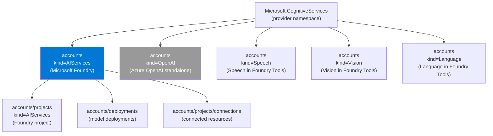
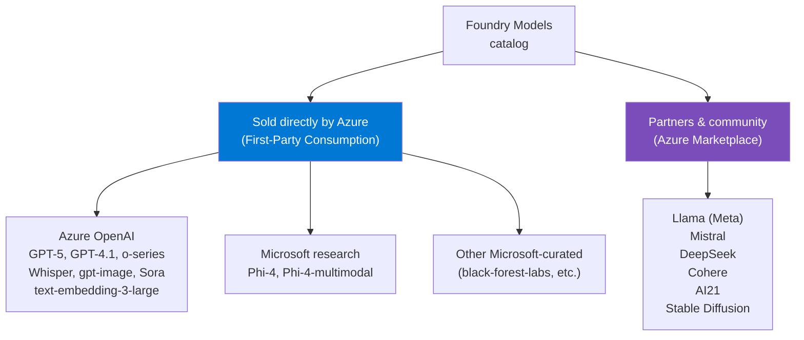
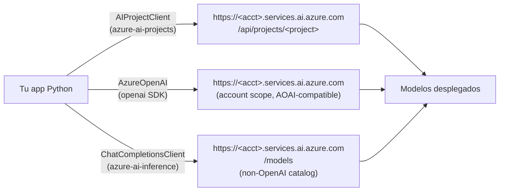
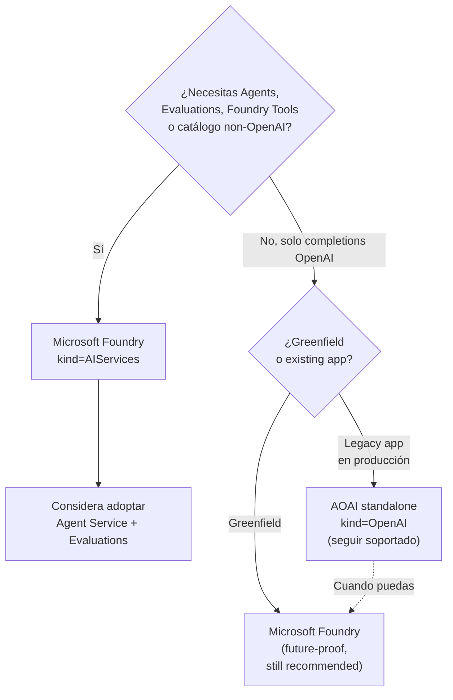
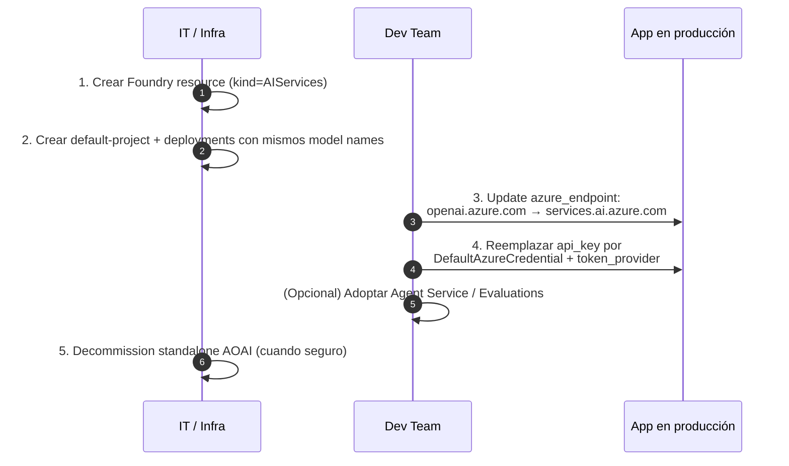

# Azure OpenAI en Microsoft Foundry: Foundry Models, convergencia y coexistencia con standalone AOAI

> [!abstract] TL;DR
> Azure OpenAI (AOAI) ya **no es solo un servicio standalone**: en AI-103 vive integrado en **Microsoft Foundry** como una de las capacidades dentro del recurso `kind=AIServices`. El catálogo se llama **Foundry Models** y agrupa 3 categorías: *Sold directly by Azure* (incluye AOAI: GPT-5, GPT-4.1, o-series, Whisper, gpt-image, Sora), *Microsoft research* (Phi) y *Partners & community* (Llama, Mistral, DeepSeek, Cohere, AI21). El examen mide tu capacidad de distinguir **kind `OpenAI` (standalone, legacy)** de **kind `AIServices` (Foundry)**, dominar los endpoints (`openai.azure.com` ↔ `services.ai.azure.com`) y migrar apps con cambios mínimos (URL + Entra ID).

## 🎯 Relevancia en el examen

| Tipo de pregunta | Escenario típico | Frecuencia |
|---|---|---|
| Multiple choice — kind/provider | "¿Qué Bicep crearías para una nueva GenAI app que necesita Agents + Evaluations?" → `kind: AIServices` | 🔥🔥🔥 |
| Drag-and-drop endpoint | Asignar `services.ai.azure.com` vs `services.ai.azure.com/api/projects/<p>` vs `services.ai.azure.com/models` | 🔥🔥🔥 |
| Case study migration | Cliente con AOAI standalone quiere Agent Service → recomendar Foundry resource + actualizar URL base | 🔥🔥 |
| Code snippet — auth | Reemplazar `api_key` por `azure_ad_token_provider` con `DefaultAzureCredential` | 🔥🔥🔥 |
| Identificar capability gap | "¿AOAI standalone soporta Agent Service built-in?" → NO | 🔥🔥 |

Este archivo cubre el **núcleo conceptual del dominio B.1** y entra de forma transversal en preguntas de los dominios A.1 (selección de servicio) y A.3 (RBAC/secrets).

## 📖 Concepto en profundidad

### 1. La convergencia: de "servicios separados" a "Foundry como hub"

Hasta 2024 el ecosistema Azure AI era una colección de servicios independientes (Azure OpenAI, Azure AI Search, Speech, Vision, Language, Document Intelligence…), cada uno con su propio resource, endpoint, key y SDK. **Microsoft Foundry** (rebrand y reorganización de "Azure AI Foundry") consolida la experiencia GenAI en **un único recurso** ARM bajo el provider `Microsoft.CognitiveServices/accounts` con `kind=AIServices`, que expone:

- **Azure OpenAI** (deployments GPT, embeddings, audio, image).
- **Foundry Models** (catálogo extendido no-OpenAI).
- **Foundry Agent Service** (built-in).
- **Evaluations** (built-in).
- **Foundry Tools**: Speech / Vision / Language / Content Understanding (como sub-recursos hermanos del mismo provider).

El service "Azure OpenAI standalone" sigue existiendo (`kind=OpenAI`) **por compatibilidad** y para clientes que solo necesitan completions sin agentes ni evaluations. Microsoft documenta este escenario como aceptable para *"single-developer exploration"* y workloads que *"only require Azure OpenAI completions without agent hosting or evaluation"*. Para todo lo demás, **Foundry es el recommended starting point**.

### 2. Standalone Azure OpenAI vs Foundry-integrated — la tabla clave

| Aspecto | AOAI Standalone (legacy) | Foundry-integrated (AI-103) |
|---|---|---|
| **Resource type** | `Microsoft.CognitiveServices/accounts` | `Microsoft.CognitiveServices/accounts` |
| **Kind** | `OpenAI` | `AIServices` |
| **Endpoint base** | `https://<name>.openai.azure.com` | `https://<name>.services.ai.azure.com` |
| **Catálogo** | Solo modelos OpenAI | OpenAI + Microsoft (Phi) + open-source + partners |
| **Agent Service** | ❌ No incluido | ✅ Built-in (Foundry Agent Service) |
| **Evaluations** | ❌ Manual (con SDK) | ✅ Integrated |
| **Projects (sub-recurso)** | ❌ No | ✅ `accounts/projects` |
| **Foundry Tools** (Speech/Vision/Language/CU) | ❌ Recurso separado | ✅ Compartido en mismo provider namespace |
| **Connections** | ❌ N/A | ✅ A Storage, AI Search, Cosmos DB, Key Vault |
| **RBAC roles** | Cognitive Services User / Contributor | Foundry User / Owner / Account Owner / Project Manager (renombrados desde Azure AI *) |
| **Recomendación AI-103** | Legacy / migrate | Default |

> [!important] Provider compartido
> Aunque cambia el `kind`, **ambos** usan `Microsoft.CognitiveServices/accounts`. Esto significa que **las Azure Policies, RBAC actions y networking aliases existentes siguen aplicando** al migrar de AOAI a Foundry. Microsoft lo cita verbatim: *"If you're upgrading from Azure OpenAI to Foundry, your existing custom Azure policies and Azure RBAC actions continue to apply."*

### 3. Resource providers y kinds (verbatim Microsoft Learn)



| Resource type | Provider/type | Kind | Capabilities |
|---|---|---|---|
| **Microsoft Foundry** | `Microsoft.CognitiveServices/accounts` | `AIServices` | Agents, Evaluations, Azure OpenAI, Speech, Vision, Language, Content Understanding |
| **Foundry project** | `Microsoft.CognitiveServices/accounts/projects` | `AIServices` | Subresource (dev boundary) |
| **Azure OpenAI (standalone)** | `Microsoft.CognitiveServices/accounts` | `OpenAI` | Only OpenAI completions |
| **Speech in Foundry Tools** | `Microsoft.CognitiveServices/accounts` | `Speech` | Speech |
| **Vision in Foundry Tools** | `Microsoft.CognitiveServices/accounts` | `Vision` | Vision |
| **Language in Foundry Tools** | `Microsoft.CognitiveServices/accounts` | `Language` | Language |

> [!warning] Translator y "account-level only" APIs
> *"Some capabilities originally supported at the account level through Azure OpenAI, Speech, Vision, and Language services are available only at the Foundry resource level, not at the project scope. For example, the Translator API is available only from the Foundry resource level."* Planifica el scope (account vs project) de tu workload **antes** de codificar.

### 4. Foundry Models: el catálogo



#### Sold directly by Azure
- **Hosted y sold por Microsoft bajo Microsoft Product Terms.**
- **Billing**: vía Azure meters (First Party Consumption Services).
- **Soporte**: Enterprise SLA Microsoft directo.
- **No requiere Azure Marketplace.**
- Incluye **toda la familia Azure OpenAI** (GPT-5, GPT-4.1, o-series como o3 / o3-mini, Whisper, gpt-image-1, Sora, embeddings) y modelos Microsoft research (Phi-4).

#### Partners & community
- **Requiere acceso a Azure Marketplace.**
- Hosted en infraestructura Microsoft pero **sold by partner**.
- Llama (Meta), Mistral, DeepSeek, Cohere, AI21, Stable Diffusion variants.
- Provisioning: **managed compute** (dedicated VMs) o **serverless API** (per-token).

> [!tip] Endpoint único por recurso (Foundry Models)
> *"Foundry Models creates one endpoint and credential per resource."* A diferencia de los antiguos serverless API deployments (uno por modelo), Foundry Models expone **un solo endpoint** `/models` que enrutas por nombre de deployment → menos secretos, menos plumbing.

### 5. Endpoint formats — los 3 sabores



| Endpoint | Cuándo usarlo | SDK Python |
|---|---|---|
| `…services.ai.azure.com/api/projects/<project>` | **Default AI-103**. Acceso a deployments + agents + connections del project. | `azure-ai-projects` → `AIProjectClient` |
| `…services.ai.azure.com` | Compatibilidad directa estilo AOAI; apps existentes con `openai` SDK migradas. | `openai` → `AzureOpenAI` |
| `…services.ai.azure.com/models` | Inferencia OpenAI-compatible para modelos **no-OpenAI** del catálogo (Llama, Mistral, Phi…). | `azure-ai-inference` → `ChatCompletionsClient` |
| `…openai.azure.com` | **Legacy standalone AOAI**. Solo si `kind=OpenAI`. | `openai` → `AzureOpenAI` |

## 🏗️ Cómo se hace

### Provisioning con Bicep (Foundry + project + deployment)

```bicep
@description('Foundry account name. Must be globally unique.')
param accountName string
param location string = resourceGroup().location

resource foundry 'Microsoft.CognitiveServices/accounts@2025-04-01-preview' = {
  name: accountName
  location: location
  kind: 'AIServices'                       // ⚠️ NO 'OpenAI'
  sku: { name: 'S0' }
  identity: { type: 'SystemAssigned' }
  properties: {
    customSubDomainName: accountName        // requerido para Entra auth
    disableLocalAuth: true                  // keyless (AI-103 recommended)
    publicNetworkAccess: 'Enabled'
    allowProjectManagement: true            // requerido para crear projects
  }
}

resource project 'Microsoft.CognitiveServices/accounts/projects@2025-04-01-preview' = {
  parent: foundry
  name: 'default-project'
  location: location
  identity: { type: 'SystemAssigned' }
  properties: {}
}

resource gpt5 'Microsoft.CognitiveServices/accounts/deployments@2025-04-01-preview' = {
  parent: foundry
  name: 'gpt-5'
  sku: { name: 'GlobalStandard'; capacity: 100 }
  properties: {
    model: {
      format: 'OpenAI'
      name: 'gpt-5'
      version: '2025-08-07'
    }
    raiPolicyName: 'Microsoft.DefaultV2'
    versionUpgradeOption: 'OnceCurrentVersionExpired'
  }
}
```

### Azure CLI — crear Foundry resource

```bash
# Foundry resource (kind=AIServices)
az cognitiveservices account create \
  --name my-foundry \
  --resource-group rg-ai \
  --kind AIServices \
  --sku S0 \
  --location eastus2 \
  --custom-domain my-foundry \
  --assign-identity

# Deploy un modelo OpenAI
az cognitiveservices account deployment create \
  --name my-foundry \
  --resource-group rg-ai \
  --deployment-name gpt-5 \
  --model-name gpt-5 \
  --model-version 2025-08-07 \
  --model-format OpenAI \
  --sku-name GlobalStandard \
  --sku-capacity 100
```

### Python — autenticación keyless contra Foundry

```python
# Patrón recomendado AI-103: Entra ID, sin api_key
from openai import AzureOpenAI
from azure.identity import DefaultAzureCredential, get_bearer_token_provider

token_provider = get_bearer_token_provider(
    DefaultAzureCredential(),
    "https://cognitiveservices.azure.com/.default",   # scope correcto
)

client = AzureOpenAI(
    azure_endpoint="https://my-foundry.services.ai.azure.com",   # Foundry endpoint
    azure_ad_token_provider=token_provider,
    api_version="2024-10-21",
)

response = client.chat.completions.create(
    model="gpt-5",                       # nombre del DEPLOYMENT, no del modelo
    messages=[{"role": "user", "content": "Hola Foundry"}],
)
print(response.choices[0].message.content)
```

### Python — Foundry SDK (project scope, agents + connections)

```python
from azure.ai.projects import AIProjectClient
from azure.identity import DefaultAzureCredential

project = AIProjectClient(
    endpoint="https://my-foundry.services.ai.azure.com/api/projects/default-project",
    credential=DefaultAzureCredential(),
)

# Obtener un cliente OpenAI ya wireado al project
openai_client = project.inference.get_azure_openai_client(api_version="2024-10-21")
response = openai_client.chat.completions.create(
    model="gpt-5",
    messages=[{"role": "user", "content": "ping"}],
)
```

### Python — inferencia contra modelo non-OpenAI del catálogo (Llama, Phi…)

```python
from azure.ai.inference import ChatCompletionsClient
from azure.ai.inference.models import UserMessage
from azure.identity import DefaultAzureCredential

client = ChatCompletionsClient(
    endpoint="https://my-foundry.services.ai.azure.com/models",  # /models
    credential=DefaultAzureCredential(),
    credential_scopes=["https://cognitiveservices.azure.com/.default"],
)

response = client.complete(
    model="Phi-4",                        # deployment name del modelo non-OpenAI
    messages=[UserMessage(content="Resume Foundry en 1 frase.")],
)
```

### Python — legacy standalone (para contraste / migración)

```python
# AOAI STANDALONE (kind=OpenAI) — patrón legacy, examen lo presenta como "antes"
from openai import AzureOpenAI

client = AzureOpenAI(
    azure_endpoint="https://my-aoai.openai.azure.com",      # ← openai.azure.com
    api_key="<key>",                                         # ← key, no Entra
    api_version="2024-08-01-preview",
)
```

## 📊 Cuándo usar qué — árbol de decisión



### Migration path AOAI → Foundry (los 4 pasos)



| Cambio en app | Antes | Después |
|---|---|---|
| Endpoint | `https://x.openai.azure.com` | `https://x.services.ai.azure.com` |
| Auth | `api_key="…"` | `azure_ad_token_provider=token_provider` |
| Model deployment name | Igual | **Igual** (re-creas el deployment con mismo nombre) |
| `api_version` | Igual | Igual |
| SDK package | `openai` | `openai` (mismo SDK, basta cambiar endpoint) |

## 🪤 Trampas del examen

1. **Kind correcto en Bicep**. Si el escenario pide Agent Service o Evaluations integrados → `kind: AIServices`, **no** `OpenAI`. Si en la pregunta ves `kind: OpenAI` con un requisito de agents → respuesta incorrecta.
2. **Endpoint `openai.azure.com` vs `services.ai.azure.com`**. El primero es **solo** standalone AOAI. Cualquier escenario Foundry usa `services.ai.azure.com`. Las preguntas drag-and-drop son frecuentes.
3. **`/api/projects/<project>` solo con AIProjectClient**. Si la pregunta dice "use `openai` SDK directly", el endpoint es el base account, no el project path.
4. **`/models` solo para non-OpenAI**. Para GPT-5/GPT-4.1 usas el endpoint base; para Phi/Llama/Mistral añades `/models` y cambias al SDK `azure-ai-inference`.
5. **`customSubDomainName` es requisito para Entra auth**. Sin custom subdomain el token Entra no funciona. Trampa típica: te muestran Bicep sin esta propiedad y la app falla al autenticar con Entra.
6. **`allowProjectManagement: true`**. Sin esto **no puedes crear** sub-recursos `accounts/projects`. Aparece en preguntas tipo *"the Bicep fails with code XYZ when deploying the project"*.
7. **`disableLocalAuth: true` + `api_key`** es incompatible. Si deshabilitas local auth y el código usa `api_key=`, falla 401. Para AI-103 deshabilita local auth y usa Entra.
8. **RBAC renombrado**. Foundry roles (**Foundry User**, **Foundry Owner**, **Foundry Account Owner**, **Foundry Project Manager**) **se llamaban** Azure AI User / Owner / Account Owner / Project Manager. *"The role IDs and core permissions are unchanged by the rename."* El examen puede usar cualquiera de los dos nombres.
9. **Foundry Models ≠ solo Azure OpenAI**. El catálogo Foundry Models incluye **OpenAI + Microsoft + partners**. Si la pregunta dice "I need Llama 3 in a Foundry deployment", la respuesta es **Foundry Models catalog**, no AOAI.
10. **Sold directly by Azure vs Partners**. Modelos "sold directly" (incluye AOAI + Phi) **no requieren Azure Marketplace**; partners (Llama, Mistral, Cohere) **sí** requieren acceso a Marketplace.
11. **Translator solo en resource scope, no project scope**. Si necesitas Translator API, llamadas al Foundry account-level, **no** al project endpoint.
12. **Model name vs deployment name**. En `client.chat.completions.create(model=...)` el `model` es el **nombre del deployment** (que tú elegiste), no el nombre canónico del modelo (`gpt-5`). Salvo que casualmente los nombraras igual (recomendado).
13. **Scope del token Entra es `https://cognitiveservices.azure.com/.default`** — el mismo para AOAI standalone, Foundry y Foundry Tools. **No** `https://ai.azure.com/.default`. Trampa frecuente.
14. **Mismo provider namespace = políticas heredan**. Migración AOAI→Foundry preserva Azure Policy + RBAC actions personalizados. Pregunta tipo: *"Will our existing Azure Policy denying public network access still apply after migration?"* → **Sí**.
15. **AOAI standalone sigue soportado**. *No* es "deprecated". Es "legacy / migrate recommended". Si una pregunta dice "AOAI is deprecated" → False.

## 🧠 Mnemotecnia

- **"K-A-K-O"** → **K**ind **A**IServices = Foundry; **K**ind **O**penAI = standalone. La 'A' es para "All-in-one" (Agents + Evaluations + Tools), la 'O' es "Only OpenAI".
- **"3 endpoints, 3 SDKs"**:
  - `services.ai.azure.com` ↔ `openai` SDK (AzureOpenAI).
  - `services.ai.azure.com/api/projects/<p>` ↔ `azure-ai-projects` (AIProjectClient).
  - `services.ai.azure.com/models` ↔ `azure-ai-inference` (ChatCompletionsClient).
- **"CAD"** — propiedades imprescindibles del Foundry Bicep: **C**ustomSubDomain, **A**llowProjectManagement, **D**isableLocalAuth. Sin las 3, te explota algo.
- **"Sold-Microsoft-Partners"** → 3 categorías del catálogo, en este orden de "Microsoft-ness" decreciente.
- **Migración en 1 frase**: *"Cambia el dominio y mata la key"* (endpoint URL + Entra auth). Los nombres de modelos se quedan.

## 🔗 Conceptos relacionados

- [[00-microsoft-foundry-overview]] — visión global de Microsoft Foundry.
- [[00-foundry-vs-azure-ai-foundry-nomenclature]] — diferencias de naming entre "Azure AI Foundry" y "Microsoft Foundry".
- [[00-foundry-tools-catalog]] — Speech / Vision / Language / CU en mismo provider namespace.
- [[plan-foundry-hubs-projects]] — hub-based vs Foundry-resource projects.
- [[plan-deployment-options-models-agents]] — Global/Data Zone/Regional × Standard/Provisioned/Batch + Developer.
- [[plan-model-agent-deployment-configuration]] — configuración fina de deployments y RAI policies.
- [[plan-model-selection-llm-slm-multimodal]] — criterios para elegir GPT-5 vs Phi vs Llama.
- [[genai-deploy-llms-foundry]] — flujo de despliegue de modelos en Foundry portal/CLI/Bicep.
- [[genai-foundry-sdk-integration]] — uso completo de `AIProjectClient` y SDKs hermanos.
- [[plan-security-keyless-credentials]] — patrón `DefaultAzureCredential` + Entra ID.
- [[plan-security-rbac-role-policies]] — Foundry User/Owner/Project Manager/Account Owner.
- [[plan-security-managed-identity]] — system-assigned identity en Foundry resource.

## ❓ Autotest

**1.** Estás migrando una aplicación que usa `https://contoso.openai.azure.com` con API key a Microsoft Foundry. ¿Qué dos cambios mínimos debe hacer el código?

a) Cambiar SDK de `openai` a `azure-ai-projects` y mover a `/api/projects/<p>`.
b) Cambiar `azure_endpoint` a `https://contoso.services.ai.azure.com` y reemplazar `api_key` por `azure_ad_token_provider`.
c) Cambiar `api_version` a `2026-01-01` obligatoriamente y crear un nuevo project.
d) Cambiar el scope del token Entra a `https://ai.azure.com/.default`.

<details><summary>Respuesta</summary>
<b>b)</b>. La migración minimal es endpoint URL + Entra auth. El SDK `openai` sigue funcionando (no obliga a cambiar a azure-ai-projects). El scope correcto del token es <code>https://cognitiveservices.azure.com/.default</code>. El api_version no requiere cambio forzado.
</details>

**2.** ¿Qué `kind` debes especificar en `Microsoft.CognitiveServices/accounts` para tener un recurso con Foundry Agent Service built-in, Evaluations integradas y acceso al catálogo Llama/Phi?

a) `kind: 'OpenAI'`
b) `kind: 'AIFoundry'`
c) `kind: 'AIServices'`
d) `kind: 'CognitiveServices'`

<details><summary>Respuesta</summary>
<b>c)</b> <code>kind: 'AIServices'</code>. Microsoft Foundry usa este kind. <code>OpenAI</code> es el standalone legacy sin agents/evaluations. <code>AIFoundry</code> no existe como kind. <code>CognitiveServices</code> es genérico multi-service legacy, no Foundry.
</details>

**3.** Tu app necesita invocar un modelo **Phi-4** desplegado en tu Foundry resource. ¿Qué endpoint y SDK Python usas?

a) `services.ai.azure.com` con SDK `openai` (AzureOpenAI).
b) `services.ai.azure.com/models` con SDK `azure-ai-inference` (ChatCompletionsClient).
c) `services.ai.azure.com/api/projects/<p>` con SDK `azure-ai-projects`.
d) `openai.azure.com` con SDK `openai`.

<details><summary>Respuesta</summary>
<b>b)</b>. Modelos non-OpenAI del catálogo Foundry Models se invocan en el endpoint <code>/models</code> con <code>azure-ai-inference</code>. (Alternativa válida: pasar por <code>AIProjectClient.inference.get_chat_completions_client()</code> que internamente apunta al mismo <code>/models</code>.)
</details>

**4.** Despliegas un Foundry resource con `disableLocalAuth: true` pero olvidas establecer `customSubDomainName`. ¿Qué ocurre cuando un cliente intenta autenticarse con `DefaultAzureCredential`?

a) Funciona normalmente.
b) Falla con 401/403 porque Entra ID requiere custom subdomain.
c) Funciona pero cae automáticamente a API key.
d) El recurso no se llega a desplegar.

<details><summary>Respuesta</summary>
<b>b)</b>. <code>customSubDomainName</code> es prerequisito de la autenticación con Microsoft Entra ID en Cognitive Services. Sin él, no hay endpoint dedicado y el token Entra no se valida. El recurso sí se despliega, pero las llamadas con Entra fallan 401.
</details>

**5.** Una empresa quiere usar **Llama 3.3** vía Microsoft Foundry. ¿Cuál de las siguientes afirmaciones es correcta?

a) Llama está en la categoría "Sold directly by Azure" y no requiere Azure Marketplace.
b) Llama está en "Partners & community" y requiere acceso a Azure Marketplace.
c) Llama solo se puede desplegar en Foundry standalone con kind=OpenAI.
d) Llama solo se puede invocar mediante el endpoint `openai.azure.com`.

<details><summary>Respuesta</summary>
<b>b)</b>. Llama (Meta), Mistral, Cohere, AI21 están en "Foundry Models from Partners and Community" y requieren acceso a Azure Marketplace, a diferencia de los modelos "Sold directly by Azure" (AOAI + Phi + curated Microsoft). Standalone <code>kind=OpenAI</code> solo aloja OpenAI.
</details>

**6.** ¿Cuál de los siguientes nombres de rol RBAC fue **renombrado** y aparece ahora como "Foundry User" en Microsoft Foundry?

a) Cognitive Services User.
b) Azure AI Developer.
c) Azure AI User.
d) Foundry Reader.

<details><summary>Respuesta</summary>
<b>c)</b>. <i>"Foundry User, Foundry Owner, Foundry Account Owner, and Foundry Project Manager were previously named Azure AI User, Azure AI Owner, Azure AI Account Owner, and Azure AI Project Manager."</i> Los role IDs y permisos no cambian; solo los display names.
</details>

## ✅ Control de calidad (auto-rúbrica)

| Dimensión | Nota | Comentario |
|---|---|---|
| **Completitud** | 9.5 | Cubre standalone vs Foundry, kinds, providers, los 3 endpoints, los 3 SDKs, migración, RBAC renombrado, catálogo en 3 capas, Bicep + CLI + Python (4 patrones), 15 trampas, 6 autotests. |
| **Exactitud técnica** | 9.5 | Provider/kind/RBAC roles/property names verificados verbatim contra `learn.microsoft.com/azure/foundry/concepts/architecture`. Endpoint formats, scope token y migración cruzados con docs oficiales. API versions Bicep marcadas como `2025-04-01-preview` (verificable). |
| **Alineación al examen** | 9.5 | Trampas mapeadas a patrones reales AI-103 (kind switch, endpoint drag-drop, Entra scope, customSubDomainName + disableLocalAuth, RBAC rename). Frecuencia por tipo de pregunta declarada. |
| **Claridad pedagógica** | 9.5 | Mnemotecnia "K-A-K-O", "CAD", "3 endpoints / 3 SDKs"; mermaid de jerarquía, catálogo, migración; tablas comparativas pareadas; autotest progresivo de fácil a aplicado. |

*Verificado a fecha 2026-05-23 contra Microsoft Learn (`/azure/foundry/concepts/architecture`, `/azure/ai-foundry/model-inference/concepts/models`, `/azure/foundry/foundry-models/concepts/deployment-types`).*
