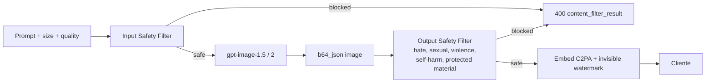
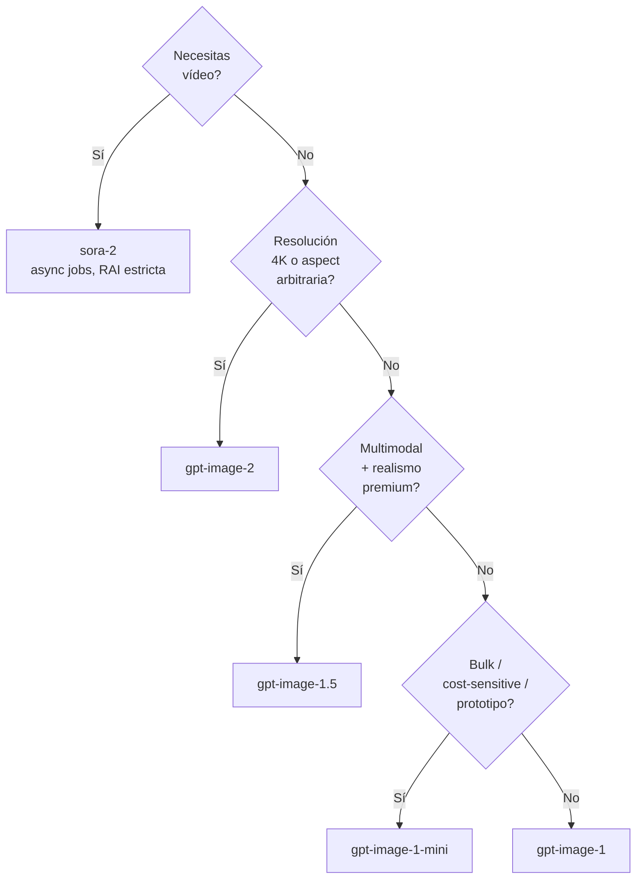

# Image and Video Generation con Azure OpenAI (gpt-image series + Sora 2)

> [!abstract] TL;DR
> Azure OpenAI ofrece dos modalidades generativas multimedia: **imagen** (familia `gpt-image-1`, `gpt-image-1-mini`, `gpt-image-1.5`, `gpt-image-2`) y **vídeo** (`sora-2`, en preview). **`dall-e-3` fue retirado el 4 de marzo de 2026 y los deployments existentes son no funcionales** — toda nueva solución debe usar `gpt-image-*`. La API de imagen expone tres endpoints (`/images/generations`, `/images/edits` con máscara, streaming con `partial_images`); la de vídeo es **asíncrona basada en jobs** (`/openai/v1/video/generations/jobs` + polling). Todos los outputs llevan **C2PA + watermark invisible**, y aplican RAI obligatorio (face fidelity restringida, IP/photorealistic bloqueado en Sora 2).

## 🎯 Relevancia en el examen

| Tipo de pregunta | Escenario típico | Frecuencia |
|---|---|---|
| Selección de modelo | "Cliente necesita generar 4K con edición avanzada → ¿qué modelo?" | 🔥🔥🔥 |
| API parameters | Distinguir `quality`, `size`, `background`, `output_format`, `response_format` | 🔥🔥🔥 |
| Mask inpainting | "El mask debe ser PNG con alpha transparente en la zona editable" | 🔥🔥 |
| Sora 2 async pattern | Identificar el flujo job→poll→retrieve content | 🔥🔥 |
| RAI / C2PA / watermark | "¿Qué metadata embebida lleva el output?" | 🔥🔥 |
| `dall-e-3` retirement | "Existing deployments → non-functional" (carryover trap) | 🔥🔥🔥 |
| Streaming `partial_images` | "Mostrar progreso al usuario" | 🔥 |

⚠️ **AI-102 carryover** parcial: el código `dall-e` aparece en muchas preguntas legacy, pero el examen AI-103 hace énfasis en migrar a `gpt-image-*` post-retiro.

## 📖 Concepto en profundidad

### Familia de modelos image-gen (Azure OpenAI, 2026)

| Modelo | Estado (2026-05) | Tamaños | `quality` | Strengths |
|---|---|---|---|---|
| `dall-e-3` | **RETIRED 2026-03-04** ⛔ | 1024×1024, 1024×1792, 1792×1024 | `standard` / `hd` | Histórico. No deployable. |
| `gpt-image-1` | GA | 1024×1024, 1024×1536, 1536×1024 | `low` / `medium` / `high` | Realismo, instruction-following |
| `gpt-image-1-mini` | GA | 1024×1024, 1024×1536, 1536×1024 | `low` / `medium` / `high` (default `medium`) | Fast prototyping, bulk, cost-sensitive |
| `gpt-image-1.5` | GA | 1024×1024, 1024×1536, 1536×1024 | `low` / `medium` / `high` (default `high`) | + speed/cost, multimodal context |
| `gpt-image-2` | GA | **Arbitrary** (multiplos 16 px, long edge ≤ 3840 px = 4K, aspect ≤ 3:1, pixel count 655 360–8 294 400) | `low` / `medium` / `high` (default `high`) | 4K, broad aspect ratios, edición mejorada |

> [!warning] dall-e-3 retirado
> El 4 de marzo de 2026 Microsoft retiró `dall-e-3`. **Existing deployments are non-functional.** Si una pregunta menciona "tenemos un deployment de dall-e-3 ya creado", la respuesta correcta es **migrar a gpt-image-1 series**, no "seguir usándolo".

### Capabilities matrix por modelo

| Capability | dall-e-3 | gpt-image-1 / 1-mini / 1.5 | gpt-image-2 |
|---|---|---|---|
| Text → image | ✅ | ✅ | ✅ |
| Inpainting (`/images/edits` + mask) | ❌ | ✅ | ✅ improved |
| Variations (con mask + prompt) | ❌ | ✅ | ✅ |
| `n` > 1 | ❌ (n=1) | ✅ | ✅ |
| `response_format` URL | ✅ url/b64_json | ❌ **siempre b64_json** | ❌ **siempre b64_json** |
| `background` transparent | ❌ | ✅ (PNG only) | ✅ (PNG only) |
| `output_format` png/jpeg | ❌ | ✅ (+ `output_compression` 0-100 JPEG) | ✅ |
| `stream` + `partial_images` (1-3) | ❌ | ✅ | ✅ |
| `input_fidelity` (preserva caras en edits) | ❌ | ✅ (no en `mini`) | ✅ |
| Watermark + C2PA | ✅ | ✅ obligatorio | ✅ obligatorio |

### Pipeline de generación (mermaid)



### Sora 2 (vídeo) — modelo

- **Nombre:** `sora` (esto es Sora 2 en backend). El alias `sora-2` aparece en respuestas. ⚠️ El deployment se hace típicamente con nombre custom; el `model` en JSON es `sora-2`.
- **Estado:** Preview.
- **Modalidades:** text → video, image → video, video (generated) → video, **remix** (modificación targeted preservando estructura).
- **Audio:** Sora 2 genera audio en los outputs.
- **Resoluciones soportadas:** 480×480, 480×854, 854×480, 720×720, 720×1280, 1280×720, 1080×1080, 1080×1920, 1920×1080.
- **Duración (`n_seconds` REST / `seconds` SDK):** típicamente 4-20 s. Defaults observados: 5 s.
- **`n_variants`** (REST): 1-4 (interpretaciones distintas del mismo prompt).
- **RAI Sora 2:** bloquea **todo contenido IP y photorealistic** de personas/marcas.

## 🏗️ Cómo se hace

### Deploy de gpt-image-1.5 (Bicep)

```bicep
resource imageGen 'Microsoft.CognitiveServices/accounts/deployments@2024-10-01' = {
  parent: foundryAccount
  name: 'my-image-gen'
  sku: {
    name: 'Standard'     // GlobalStandard NO disponible para image-gen
    capacity: 1
  }
  properties: {
    model: {
      format: 'OpenAI'
      name: 'gpt-image-1.5'
      version: '2026-04-01'   // ⚠️ verificar versión vigente en catálogo
    }
  }
}
```

⚠️ Los modelos image-gen suelen usar SKU **`Standard`** (no `GlobalStandard`). Verifica catálogo regional.

### Azure CLI

```bash
az cognitiveservices account deployment create \
  --name <foundry-resource> \
  --resource-group <rg> \
  --deployment-name my-image-gen \
  --model-name gpt-image-1.5 \
  --model-version "2026-04-01" \
  --model-format OpenAI \
  --sku-name Standard --sku-capacity 1
```

### Generate image (Python SDK — OpenAI client v1)

```python
import os, base64
from openai import AzureOpenAI
from azure.identity import DefaultAzureCredential, get_bearer_token_provider

token_provider = get_bearer_token_provider(
    DefaultAzureCredential(),
    "https://cognitiveservices.azure.com/.default",
)

client = AzureOpenAI(
    azure_endpoint=os.environ["AZURE_OPENAI_ENDPOINT"],
    azure_ad_token_provider=token_provider,
    api_version="2025-04-01-preview",
)

result = client.images.generate(
    model="my-image-gen",            # nombre del deployment
    prompt="A serene mountain lake at sunset, watercolor style",
    n=1,
    size="1024x1024",
    quality="high",
    output_format="png",
    # background="transparent",      # PNG only
    # output_compression=85,         # JPEG only
)

# GPT-image-* SIEMPRE devuelve b64_json. NO url.
image_bytes = base64.b64decode(result.data[0].b64_json)
with open("out.png", "wb") as f:
    f.write(image_bytes)
```

### REST endpoint (image generation)

```http
POST {endpoint}/openai/v1/images/generations?api-version=preview
Authorization: Bearer <aad-token>
Content-Type: application/json

{
  "model": "gpt-image-1.5",
  "prompt": "...",
  "size": "1024x1024",
  "quality": "high",
  "output_format": "png"
}
```

Respuesta:
```json
{
  "created": 1714579200,
  "data": [
    { "b64_json": "<base64 image data>" }
  ]
}
```

### Image edit (inpainting con máscara)

```python
with open("base.png", "rb") as img, open("mask.png", "rb") as mask:
    result = client.images.edit(
        model="my-image-gen",
        image=img,
        mask=mask,                       # PNG, mismas dimensiones
        prompt="Replace masked area with a red sports car",
        size="1024x1024",
        input_fidelity="high",          # preserva caras / texto fuera del mask
    )
image_b64 = result.data[0].b64_json
```

**Regla de la máscara (memorizar):**

| Pixel alpha | Comportamiento |
|---|---|
| **0 (transparente)** | Zona **editable** (el modelo redibuja) |
| **255 (opaco)** | Zona **preservada** |

⚠️ Mask debe ser **PNG** y **mismas dimensiones** que la imagen base. Otros formatos → 400.

### Streaming (partial images)

```python
stream = client.images.generate(
    model="my-image-gen",
    prompt="...",
    stream=True,
    partial_images=2,   # 1-3 intermedios antes del final
)
for event in stream:
    # event.type == "image_generation.partial_image" o "completed"
    ...
```

### Sora 2 — REST (asíncrono, 3 fases)

```python
import os, time, requests
endpoint     = os.environ["AZURE_OPENAI_ENDPOINT"]
deployment   = os.environ["AZURE_OPENAI_DEPLOYMENT_NAME"]   # nombre del deployment sora
api_version  = "preview"
headers      = {"api-key": os.environ["AZURE_OPENAI_API_KEY"]}

# 1️⃣ Crear job
create_url = f"{endpoint}/openai/v1/video/generations/jobs?api-version={api_version}"
body = {
    "prompt": "A cat walking through a sunlit garden",
    "width": 1920,
    "height": 1080,
    "n_seconds": 8,
    "n_variants": 1,
    "model": deployment,
}
job = requests.post(create_url, headers=headers, json=body).json()
job_id = job["id"]

# 2️⃣ Polling
status_url = f"{endpoint}/openai/v1/video/generations/jobs/{job_id}?api-version={api_version}"
status = None
while status not in ("succeeded", "failed", "cancelled"):
    s = requests.get(status_url, headers=headers).json()
    status = s["status"]
    time.sleep(5)

# 3️⃣ Descarga del contenido
if status == "succeeded":
    gen_id = s["generations"][0]["id"]
    content_url = f"{endpoint}/openai/v1/video/generations/{gen_id}/content/video?api-version={api_version}"
    video = requests.get(content_url, headers=headers).content
    open("out.mp4", "wb").write(video)
```

### Sora 2 — Python SDK (OpenAI v1 nativo)

```python
video = client.videos.create(
    model="sora-2",
    prompt="A cat walking through a sunlit garden",
    size="1280x720",
    seconds=8,                          # ⚠️ SDK usa 'seconds', REST 'n_seconds'
)

while video.status in ("queued", "in_progress"):
    time.sleep(20)
    video = client.videos.retrieve(video.id)

# video.status == "completed"
content = client.videos.download_content(video.id, variant="video")
content.write_to_file("out.mp4")
```

> [!warning] Diferencia REST vs SDK
> - REST job statuses: `queued` / `running` / `succeeded` / `failed` / `cancelled`.
> - SDK `videos` statuses: `queued` / `in_progress` / `completed` / `failed`.
> - REST: `n_seconds` y `width`/`height`. SDK: `seconds` y `size="WxH"`.

### Foundry Agent Service — Image Generation Tool

```python
from azure.ai.projects import AIProjectClient
from azure.ai.projects.models import PromptAgentDefinition, ImageGenerationTool

agent = project.agents.create_version(
    name="creative-agent",
    definition=PromptAgentDefinition(
        model="gpt-4.1",
        instructions="You are a creative assistant; generate images when helpful.",
        tools=[ImageGenerationTool()],   # llama internamente a gpt-image-*
    ),
)
```

El agente decide cuándo invocar la tool; la imagen se materializa como un message item en el thread (tipo `image_file` o `image_url`).

## 📊 Cuándo usar qué (árbol de decisión)



| Use case | Modelo recomendado |
|---|---|
| Marketing 4K hero shots | `gpt-image-2` |
| App de retrato/concept art realista | `gpt-image-1.5` |
| Wireframes / mockups en bulk | `gpt-image-1-mini` |
| Edición de productos con mask | `gpt-image-1` / `1.5` con `input_fidelity="high"` |
| Vídeo corto promocional | `sora-2` |
| Vídeo deepfake de persona conocida | **PROHIBIDO** (Sora 2 RAI) |

## 🪤 Trampas del examen

1. **`dall-e-3` está retirado (2026-03-04).** Existing deployments **non-functional**. La pregunta clásica "tengo dall-e-3, ¿qué hago?" → migrar a `gpt-image-*`. NO mantener.
2. **`gpt-image-*` SIEMPRE devuelve `b64_json`. NO `url`.** Si tu código asume `data[0].url`, falla. `response_format` solo `b64_json`.
3. **Mask: transparente = editable, opaco = preservado.** Distractor habitual al revés.
4. **Mask debe ser PNG con mismas dimensiones que la imagen base.** Otros formatos o tamaños distintos → 400.
5. **`background="transparent"` requiere `output_format="png"` (también WebP soportado). JPEG NO.** Pregunta cazadora.
6. **`input_fidelity="high"` NO disponible en `gpt-image-1-mini`.** Solo gpt-image-1, 1.5, 2.
7. **`stream=True` + `partial_images` (1-3) solo en gpt-image-1 series y gpt-image-2.** No en dall-e-3 (que además está retirado).
8. **Sora 2 es asíncrono (jobs + polling). NO sync.** Si una respuesta dice "espera bloqueante a `client.images.generate`" para vídeo → falsa.
9. **REST job status final: `succeeded` / `failed` / `cancelled`. SDK videos: `completed`.** Microsoft mezcla terminología, lee literal el endpoint.
10. **SDK usa `seconds`, REST usa `n_seconds`.** Y SDK `size="1280x720"` vs REST `"width": 1280, "height": 720`.
11. **Watermark invisible + metadata C2PA están SIEMPRE embebidos** en outputs gpt-image-* y Sora 2. No se pueden desactivar.
12. **Realistic faces of specific real people** están restringidos por policy (face fidelity limit). `input_fidelity="high"` preserva caras del input, pero NO permite generar caras realistas de personas reales de cero.
13. **Sora 2 bloquea TODO contenido IP y photorealistic.** Aunque pidas "Mickey Mouse" o "Tom Cruise" → filtrado.
14. **Variations standalone (`images.variations`) NO existe en gpt-image-*.** Se hace vía `images.edit` con prompt y opcionalmente mask. Solo DALL-E 2 (deprecated) tenía endpoint dedicado.
15. **Deployment SKU típica: `Standard` (regional).** `GlobalStandard` NO está disponible para image/video-gen.
16. **API version habitual:** `2025-04-01-preview` o `preview` (v1 API). Image edit endpoint generalmente disponible para producción.
17. **`n_variants` (Sora 2 REST) 1-4** ≠ `n` de imágenes. Cada variant es una interpretación distinta.
18. **Imagen 4K (`gpt-image-2`):** ambos lados múltiplos de 16 px, long edge ≤ 3840 px, aspect ratio ≤ 3:1, pixel count entre 655 360 y 8 294 400.
19. **Coste por imagen vs por token:** imagen es per-image (orden 0.04-0.19 USD según quality/size); planificación de cuota es por **images per minute**, no por TPM.
20. **Content filter aplica al PROMPT y al OUTPUT.** Pre-prompt screening + post-output classification. Si cualquiera bloquea → 400 con `content_filter_result`.

## 🧠 Mnemotecnia

- **"GIB-2-S"** — orden de capacidad creciente: **G**pt-image-1-mini, **I**mage-1, **B**ig 1.5, **2** (4K), **S**ora 2.
- **"TRA-PRE"** mask rule: **TRA**nsparente = editable, **PRE**servado = opaco.
- **"BPC siempre"**: **B**ase64 (no URL), **P**NG mask, **C**2PA + watermark obligatorio en gpt-image-*.
- **Sora flow "C-P-D"**: **C**reate job → **P**oll status → **D**ownload content (3 fases asíncronas).
- **"R3-Sora"**: las **R**esoluciones canónicas Sora ladran "**R**4-**R**7-**R**10" → **4**80, **7**20, 10**80** (squared, landscape, portrait).
- **dall-e-3 = D**eprecated **3**de marzo 2026 (en realidad 4 marzo, pero el "3" del nombre lo ata).

## 🔗 Conceptos relacionados

- [[genai-azure-openai-foundry-models]]
- [[genai-deploy-llms-foundry]]
- [[genai-deploy-multimodal-models]]
- [[plan-model-selection-criteria]]
- [[responsible-content-filters-azure-openai]]
- [[responsible-content-safety-overview]]
- [[responsible-blocklists-custom-filters]]
- [[responsible-prompt-shields]]
- [[responsible-trace-logging-provenance]]
- [[genai-app-foundry-project-connection]]

## ❓ Autotest

**P1.** Tienes un deployment de `dall-e-3` creado en enero de 2026 y un script que llama a `client.images.generate(model="dall-e-3", n=4, size="1024x1024", response_format="url")`. ¿Por qué falla en mayo de 2026?

- a) `dall-e-3` no soporta `n=4`, solo `n=1`, y además `dall-e-3` fue retirado el 4 de marzo de 2026, dejando deployments existentes no funcionales.
- b) `dall-e-3` soporta `n=4` pero `response_format="url"` se ha eliminado de la API.
- c) `dall-e-3` necesita `quality="hd"` obligatorio desde 2026.
- d) El endpoint cambió de `/images/generations` a `/v1/images/create`.

<details><summary>Respuesta</summary>
**a)**. Dos errores combinados: (1) `dall-e-3` siempre tuvo limitación a `n=1`; (2) el modelo fue **retirado el 4 de marzo de 2026** y los deployments existentes son no funcionales. Hay que migrar a `gpt-image-1.5` y manejar `b64_json` (no `url`).
</details>

**P2.** Quieres editar el cielo de una foto sin tocar las personas en primer plano usando `gpt-image-1.5`. ¿Qué configuración de máscara y parámetros usas?

- a) Mask PNG con el cielo **opaco** y personas **transparente**; `input_fidelity="high"`.
- b) Mask PNG con el cielo **transparente** y personas **opaco**; `input_fidelity="high"`.
- c) Mask JPEG con el cielo en blanco y personas en negro; `quality="ultra"`.
- d) No necesitas mask; basta con poner las personas en el prompt negativo.

<details><summary>Respuesta</summary>
**b)**. En `/images/edits`: alpha = 0 (transparente) marca la zona **editable** (cielo) y alpha = 255 (opaco) marca la zona **preservada** (personas). La máscara debe ser **PNG** con mismas dimensiones. `input_fidelity="high"` ayuda a preservar caras con mayor fidelidad.
</details>

**P3.** Necesitas generar un vídeo de 10 segundos en 1920×1080 con Sora 2 desde Python. ¿Cuál es la secuencia correcta?

- a) `client.images.generate(model="sora-2", ...)` y leer `result.data[0].b64_json`.
- b) `POST /openai/v1/video/generations/jobs` con `n_seconds=10, width=1920, height=1080` → poll `GET /jobs/{id}` hasta status `succeeded` → `GET /generations/{gen_id}/content/video`.
- c) `client.chat.completions.create(model="sora-2", stream=True)` y guardar los chunks como MP4.
- d) `POST /openai/v1/video/sync` con timeout de 5 minutos; síncrono.

<details><summary>Respuesta</summary>
**b)**. Sora 2 es **asíncrono basado en jobs**: 3 pasos (create → poll → retrieve content). REST usa `n_seconds`, `width`, `height`; el status final es `succeeded`/`failed`/`cancelled`. No existe endpoint síncrono.
</details>

**P4.** Una app de marketing quiere generar logotipos transparentes en bulk con `gpt-image-1`. ¿Qué combinación de parámetros es obligatoria para obtener PNG con fondo transparente, y qué error es típico?

- a) `background="transparent"`, `output_format="jpeg"`, `quality="high"`. Error típico: JPEG no soporta alpha.
- b) `background="transparent"`, `output_format="png"`. Error típico: olvidar PNG y pedir JPEG.
- c) `background="auto"`, `style="natural"`. Error típico: `style` no existe en gpt-image-*.
- d) `response_format="url"`, `background="transparent"`. Error típico: gpt-image no devuelve URL.

<details><summary>Respuesta</summary>
**b)**. `background="transparent"` requiere `output_format="png"` (WebP también funciona). JPEG **no** soporta canal alpha → 400. Nota adicional: `style="vivid|natural"` era de `dall-e-3` y no aplica a `gpt-image-*`. Y como recuerda d), `gpt-image-*` siempre `b64_json`.
</details>

**P5.** ¿Cuál de estas afirmaciones sobre Responsible AI en image/video generation es FALSA?

- a) Todos los outputs de `gpt-image-1` llevan metadata C2PA y un watermark invisible.
- b) Sora 2 bloquea contenido IP y photorealistic de personas/marcas.
- c) Puedes desactivar el watermark si tu organización firma un contrato Limited Access especial.
- d) El content filter se aplica tanto al prompt como al output.

<details><summary>Respuesta</summary>
**c) FALSA**. Watermark + C2PA son **obligatorios** y no desactivables. Limited Access registration aplica al uso de `gpt-image-1` series y a funciones como modified content filters, pero **no** elimina watermarking/provenance.
</details>

## ✅ Control de calidad (auto-rúbrica)

| Dimensión | Nota | Justificación |
|---|---|---|
| Completitud | 10 | Cubre los 4 modelos image-gen vigentes + retired dall-e-3 + Sora 2 (REST y SDK) + edit/mask + streaming + agent tool + RAI + deployment SKU + pricing |
| Exactitud técnica | 9.5 | Verificado contra 3 fuentes Microsoft Learn (dall-e how-to, models catalog, video-generation concept). Marcado ⚠️ donde la versión exacta puede cambiar. Pricing como referencial. |
| Alineación al examen | 9.5 | 20 trampas reales, énfasis en migración post-retiro, mask alpha, async pattern, response_format b64_json, deployment SKU Standard vs Global |
| Claridad pedagógica | 9.5 | Mnemónicos GIB-2-S, TRA-PRE, BPC, C-P-D, R3-Sora; árboles de decisión mermaid; tablas comparativas; código Python+REST+Bicep |

*Verificado a fecha 2026-05-23 contra Microsoft Learn.*
