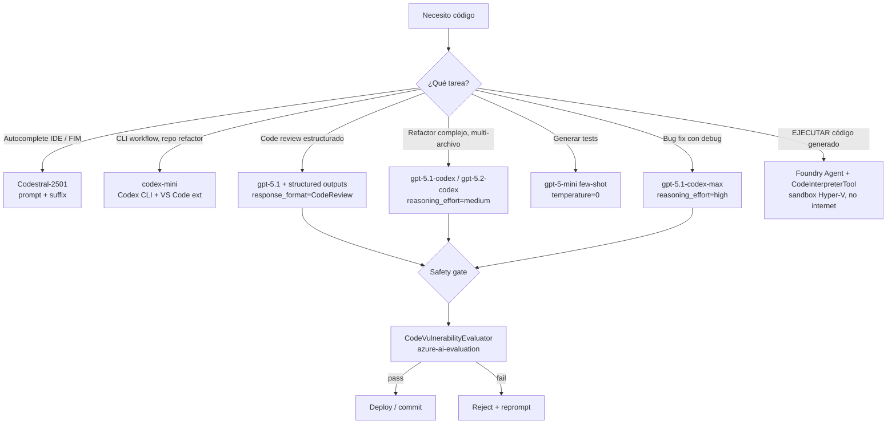

# Deploy y uso de modelos de generación de código — Codex family, Codestral, Code Interpreter tool

> [!abstract] TL;DR
> Para *"Deploy and use code-generation models"* el examen distingue **tres planos**: **(1) modelos de código** — la familia **OpenAI Codex** en Foundry (`codex-mini` *fine-tune de `o4-mini`* para CLI workflows, y la línea **reasoning-coding** `gpt-5-codex` → `gpt-5.1-codex` / `gpt-5.1-codex-mini` / `gpt-5.1-codex-max` → `gpt-5.2-codex` → `gpt-5.3-codex`; soportan **streaming, function calling, structured outputs, image input**, hasta **200 K tokens** y se exponen vía **v1 Responses API** en `https://<resource>.openai.azure.com/openai/v1`), **`Codestral-2501`** de Mistral (chat-completion serverless, **262 144 tokens** de input, en `azure-ai-inference` o vía OpenAI-compatible) y **`Phi-4`/`Phi-4-mini-reasoning`** como fallback open-weight; **(2) la herramienta `CodeInterpreterTool`** del **Foundry Agent Service** que **EJECUTA** Python en un sandbox `dynamic sessions` de Azure Container Apps con **1 h de active timeout + 30 min de idle timeout**, aislado por **Hyper-V**, **sin acceso a internet**, y **no hereda la subnet del agente** (≠ generación de código: una **produce** código, la otra lo **ejecuta**); y **(3) la safety pre-deploy** con `azure.ai.evaluation.CodeVulnerabilityEvaluator` (Python: `path-injection`, `sql-injection`, `hardcoded-credentials`, `weak-cryptographic-algorithm`, etc., en Python/Java/C++/C#/Go/JS/SQL). En 2026, **`code-davinci-002` está retirado**, los Assistants clásicos se retiran el **26-ago-2026** y la integración recomendada es **Codex CLI + extensión VS Code** apuntando a una deployment de Foundry vía `config.toml`.

## 🎯 Relevancia en el examen

🔥🔥 **Media-alta** (sub-punto pequeño dentro de un dominio del 30-35 %). Microsoft examina:

- Saber elegir el **modelo correcto por escenario**: `codex-mini` para CLI/agentic IDE, `gpt-5.x-codex` para refactors largos / repos enteros, `Codestral` para FIM y latencia baja, `gpt-5-mini` general para tests/explain.
- Diferenciar **code-generation (modelo que produce código)** vs **Code Interpreter tool (sandbox que lo ejecuta)**. El examen pone la trampa.
- Configurar **Codex CLI** contra Foundry: `config.toml` con `wire_api = "responses"`, `base_url` con `/openai/v1`, `env_key` apuntando a env var (NO la API key literal).
- Reconocer **límites del sandbox** Code Interpreter (1 h sesión, 30 min idle, sin internet, isolation Hyper-V, Container Apps dynamic sessions).
- Saber que **fine-tuned code models** se invocan como cualquier deployment Foundry (Responses API), no requieren cliente especial.
- **`CodeVulnerabilityEvaluator`** como gate de seguridad pre-deploy (azure-ai-evaluation).
- Que **`code-davinci-002` y la antigua Completions Codex API están retirados** y que el AI-102 los preguntaba — AI-103 no.

## 📖 Concepto en profundidad

### 1. Definiciones — los tres planos del sub-punto

> [!info] Glosario
> - **Code-generation model**: LLM/SLM optimizado para *producir* texto de código (autocomplete, refactor, tests, fix). Vive como **deployment** Foundry y se invoca como cualquier otro modelo.
> - **Codex CLI**: cliente de OpenAI (`@openai/codex`) que actúa como **agente autónomo** sobre el filesystem local usando un modelo Codex desplegado en Foundry como backend.
> - **Code Interpreter (tool)**: herramienta del **Foundry Agent Service** que permite al agente *ejecutar* código Python en un sandbox aislado. NO genera el código por sí misma; el modelo del agente lo genera y la herramienta lo ejecuta.
> - **Code review / safety**: evaluación pre-deploy del código generado con `CodeVulnerabilityEvaluator` (azure-ai-evaluation), AI Red Teaming, etc.

### 2. Catálogo Foundry 2026 — modelos de código

#### 2.1 OpenAI Codex family (sold directly by Azure)

| Modelo | Base / Familia | Endpoint | Contexto | Capacidades | Uso típico |
|---|---|---|---|---|---|
| **`codex-mini`** | fine-tune de **`o4-mini`** | Responses API v1 | ~200 K input | streaming · function calling · **structured outputs** · image input | CLI workflows, refactor de repos completos, scripts shell |
| **`gpt-5-codex`** | GPT-5 line, reasoning | Responses API v1 | ≥ 200 K | streaming · FC · SO · image · `reasoning_effort` | refactor largo, code review, doc generation |
| **`gpt-5.1-codex`** / `gpt-5.1-codex-mini` | GPT-5.1 line | Responses API v1 | ≥ 200 K | + `reasoning_effort=none` por defecto | coding agent generalista |
| **`gpt-5.1-codex-max`** | GPT-5.1 line, max effort | Responses API v1 | ≥ 200 K | `reasoning_effort` incluye `xhigh` | tareas complejas de arquitectura |
| **`gpt-5.2-codex`** | GPT-5.2 line | Responses API v1 | ≥ 200 K | enterprise-grade secure SWE | producción enterprise |
| **`gpt-5.3-codex`** | GPT-5.3 line | Responses API v1 | ≥ 200 K | real-time coding | live pair-programming |

> [!warning] codex-mini ≠ code-davinci-002
> `codex-mini` (2025+) es un **fine-tune nuevo de `o4-mini`**, NO la resurrección del legacy `code-davinci-002` (retirado en 2024). El examen aprovecha esa confusión.

#### 2.2 Codestral (Mistral AI, partner)

```text
Codestral-2501  | chat-completion
  Input:  text (262,144 tokens)
  Output: text (4,096 tokens)
  Languages: en
  Tool calling: No
  Response formats: Text
```

- Provider: **Mistral AI** → requiere **Azure Marketplace subscription** (Microsoft.SaaS, MarketplaceOrdering).
- Deployment: **serverless API** (pay-as-you-go).
- Soporte **FIM (fill-in-the-middle)**: define un *prefix* via `prompt` y un *suffix* opcional; el modelo genera lo intermedio. Ideal para autocomplete tipo IDE.
- Variante mencionada en la prensa Mistral: `Codestral-Mamba` (Mamba architecture, long context) — ⚠️ no aparece como SKU activo en el catálogo Foundry 2026.

#### 2.3 Microsoft Phi (sold directly by Azure)

| Modelo | Input | Output | Razonamiento | Code-quality |
|---|---|---|---|---|
| `Phi-4` | 16 384 | 16 384 | No | medio-alto, multi-lenguaje |
| `Phi-4-reasoning` | 32 768 | 32 768 | **Sí (chat-completion with reasoning content)** | alto en algoritmos |
| `Phi-4-mini-reasoning` | 128 000 | 128 000 | **Sí** | alto, edge-friendly |

#### 2.4 Modelos deprecados / retirados (⚠️ trampas AI-102→AI-103)

| Modelo | Estado | Notas |
|---|---|---|
| `code-davinci-002` | **Retirado** | Era la Completions Codex original. Si lo ves en una pregunta es la respuesta INCORRECTA. |
| `CodeLlama` family | Superado | Llama-3.x / Llama-4-Scout cubren code de forma generalista. |
| Assistants API (Foundry classic) | **Retirado 26-ago-2026** | Migrar a **Foundry Agent Service** (`PromptAgentDefinition` + `CodeInterpreterTool`). |

### 3. Diagrama — escenarios de uso



### 4. Deploy y configuración — Codex CLI contra Foundry

> [!example] Pasos verbatim (Microsoft Learn → `foundry/openai/how-to/codex`)

1. En **Foundry portal** → Model catalog → seleccionar un *reasoning model* (`gpt-5.3-codex`, `gpt-5.2-codex`, `gpt-5.1-codex-max`, `gpt-5.1-codex`, `gpt-5.1-codex-mini`, `gpt-5-codex`, `gpt-5`, `gpt-5-mini`, `gpt-5-nano`) → **Use this model**.
2. Copiar **endpoint URL** y **API key**.
3. Instalar Codex CLI:

   ```bash
   npm install -g @openai/codex      # vía npm
   # o
   brew install --cask codex         # vía brew (macOS)
   codex --version
   ```

4. Crear `~/.codex/config.toml`:

   ```toml
   model = "gpt-5-codex"                     # nombre del deployment en Foundry
   model_provider = "azure"
   model_reasoning_effort = "medium"

   [model_providers.azure]
   name = "Azure OpenAI"
   base_url = "https://YOUR_RESOURCE_NAME.openai.azure.com/openai/v1"
   env_key = "AZURE_OPENAI_API_KEY"          # ⚠️ NOMBRE de la env var, NO el valor
   wire_api = "responses"                    # v1 Responses API
   ```

5. Exportar la API key como variable de entorno:

   ```bash
   export AZURE_OPENAI_API_KEY="<your-api-key>"
   ```

6. Ejecutar:

   ```bash
   codex                                     # TUI interactivo
   codex "write a python script to scrape <url>"   # prompt inicial
   codex exec "refactor src/utils to use httpx"    # modo automation
   ```

> [!warning] Trampa de config
> - **NO** se pasa `api-version` con v1 — basta con `/v1` en el path.
> - **NO** se pone la API key literal en `env_key`; ese campo apunta al NOMBRE de la env var.
> - **Entra ID** no está soportado en Codex CLI a fecha 2026-05.

#### Modos de aprobación en VS Code

| Mode | Comportamiento |
|---|---|
| **Chat** | Solo conversación, no toca filesystem. |
| **Agent** | Lee/edita ficheros en el working directory; pide aprobación para internet o paths fuera. |
| **Agent (full access)** | Sin prompts de aprobación. ⚠️ Solo en sandbox controlado. |

#### `AGENTS.md` — guidance persistente

Codex hace merge top-down de tres niveles:

1. `~/.codex/AGENTS.md` — personal global.
2. `AGENTS.md` en la raíz del repo — compartido del proyecto.
3. `AGENTS.md` en el cwd actual — específico de subcarpeta.

### 5. Invocación directa desde Python (Responses API)

```python
import os
from openai import AzureOpenAI

client = AzureOpenAI(
    azure_endpoint=os.environ["AZURE_OPENAI_ENDPOINT"],   # https://<resource>.openai.azure.com
    api_key=os.environ["AZURE_OPENAI_API_KEY"],
    api_version="preview",                                # o cliente v1 sin api_version
)

# Code generation con Responses API (modo moderno AI-103)
response = client.responses.create(
    model="gpt-5-codex",                                  # nombre del deployment
    input=[
        {"role": "developer",
         "content": "You are a senior Python engineer. Return ONLY production-quality code: "
                    "type hints, Google-style docstrings, error handling, mypy --strict-safe."},
        {"role": "user",
         "content": "Implement an LRU cache decorator with TTL using only stdlib."},
    ],
    reasoning={"effort": "medium"},
    max_output_tokens=4000,
)

print(response.output_text)
```

> [!tip] Para reasoning code models
> Familia `*-codex` acepta `reasoning_effort ∈ {minimal, low, medium, high}` (y **`xhigh`** en `gpt-5.1-codex-max`). En reasoning, usa rol **`developer`** en vez de `system`. No envíes `temperature` ni `top_p` — los rechaza.

### 6. Structured outputs para code review / bug fix

```python
from pydantic import BaseModel, Field

class CodeFix(BaseModel):
    root_cause: str = Field(..., description="One-sentence explanation of the bug.")
    fixed_code: str = Field(..., description="The corrected source file in full.")
    diff_summary: list[str] = Field(..., description="Bullet list of changes.")
    new_tests: list[str] = Field(..., description="Pytest test functions added.")

response = client.responses.parse(
    model="gpt-5.1-codex",
    input=[
        {"role": "developer", "content": "You fix bugs and return JSON matching the schema."},
        {"role": "user", "content": f"Fix this:\n```python\n{buggy_code}\n```"},
    ],
    text_format=CodeFix,
)

fix: CodeFix = response.output_parsed
print(fix.root_cause)
print(fix.fixed_code)
```

Detalles sobre el contrato JSON Schema → ver [[genai-structured-outputs]].

### 7. Codestral — chat completion y FIM

#### 7.1 Chat completion (`azure-ai-inference`)

```python
from azure.ai.inference import ChatCompletionsClient
from azure.ai.inference.models import SystemMessage, UserMessage
from azure.core.credentials import AzureKeyCredential
import os

client = ChatCompletionsClient(
    endpoint=os.environ["CODESTRAL_ENDPOINT"],   # serverless API endpoint
    credential=AzureKeyCredential(os.environ["CODESTRAL_KEY"]),
)

resp = client.complete(
    messages=[
        SystemMessage(content="Return only Rust code, no prose."),
        UserMessage(content="Implement a thread-safe ring buffer of fixed capacity."),
    ],
    model="Codestral-2501",
    temperature=0.0,
)
print(resp.choices[0].message.content)
```

#### 7.2 Fill-in-the-middle (FIM) — patrón Codestral

```python
# FIM: el modelo completa el HUECO entre prompt (prefix) y suffix.
fim_resp = client.complete(
    model="Codestral-2501",
    extra_body={
        "prompt": "def fibonacci(n: int) -> int:\n    \"\"\"Return n-th Fibonacci number.\"\"\"\n    ",
        "suffix": "\n    return result\n",
        "stop": ["\n\n"],
    },
    temperature=0.0,
)
```

> [!warning] FIM ≠ Chat
> El examen mete trampa: **FIM exige modelo que lo soporte** (Codestral, codex-mini en CLI mode) y se invoca con `prompt + suffix`. **Chat completions clásicas NO hacen FIM** — concatenan mensajes secuencialmente.

### 8. Code Interpreter tool — *ejecutar* código, no generarlo

> [!danger] LA gran trampa del sub-punto
> **Code-generation** = modelo que PRODUCE código (`codex-mini`, `gpt-5-codex`, `Codestral`).  
> **Code Interpreter tool** = sandbox que EJECUTA código que el modelo del agente escribe en runtime. **Son cosas distintas**, conviven en un agente.

#### 8.1 Crear agente con `CodeInterpreterTool` (Foundry Agent Service)

```python
import os
from azure.identity import DefaultAzureCredential
from azure.ai.projects import AIProjectClient
from azure.ai.projects.models import (
    PromptAgentDefinition,
    CodeInterpreterTool,
    AutoCodeInterpreterToolParam,
)

project = AIProjectClient(
    endpoint="https://<resource>.ai.azure.com/api/projects/<project>",
    credential=DefaultAzureCredential(),
)
openai = project.get_openai_client()

# Subir CSV para que el sandbox lo analice
file = openai.files.create(purpose="assistants", file=open("quarterly.csv", "rb"))

# Crear agente con Code Interpreter habilitado
agent = project.agents.create_version(
    agent_name="data-analyst",
    definition=PromptAgentDefinition(
        model="gpt-5-mini",                                # modelo que GENERA el código
        instructions="You are a data analyst. Write and run Python to answer.",
        tools=[CodeInterpreterTool(
            container=AutoCodeInterpreterToolParam(file_ids=[file.id])
        )],
    ),
)

# Invocar
conversation = openai.conversations.create()
response = openai.responses.create(
    conversation=conversation.id,
    input="Generate a bar chart of operating profit by quarter for TRANSPORTATION.",
    extra_body={"agent_reference": {"name": agent.name, "type": "agent_reference"}},
)
```

#### 8.2 Sandbox — comportamiento documentado

| Propiedad | Valor verificado |
|---|---|
| Runtime | Python en **Azure Container Apps dynamic sessions** |
| Isolation | **Hyper-V boundary** por sesión |
| **Session lifetime** | **1 hora activa, 30 min idle timeout** |
| **Internet access** | **No outbound network requests** |
| Subnet | **No hereda** la subnet del agente |
| Region | Misma región que el Foundry project |
| Concurrencia | Cada conversación crea **sesión separada** (cada una factura) |
| File upload purpose | `"assistants"` |
| Output files | Citados como `container_file_citation` con `container_id` + `file_id` |
| Charges | **Adicionales** a los tokens del modelo |

#### 8.3 File types soportados (verbatim docs)

`.c .cpp .csv .docx .html .java .json .md .pdf .php .pptx .py .rb .tex .txt .css .jpeg .jpg .js .gif .png .tar .ts .xlsx .xml .zip`

#### 8.4 Custom Code Interpreter

Si necesitas paquetes Python que no vienen pre-instalados o un isolation distinto → **Custom Code Interpreter** (referenciado en docs, bring-your-own dynamic session pool). Ver [[agents-microsoft-foundry-agent-service]].

### 9. Safety pre-deploy — `CodeVulnerabilityEvaluator`

```python
from azure.ai.evaluation import CodeVulnerabilityEvaluator
from azure.identity import DefaultAzureCredential

evaluator = CodeVulnerabilityEvaluator(
    credential=DefaultAzureCredential(),
    azure_ai_project={
        "subscription_id": "...",
        "resource_group_name": "...",
        "project_name": "...",
    },
)

result = evaluator(
    query="Write a Python Flask endpoint that loads a file given by user path.",
    response=generated_code,        # output del modelo de código
)
# result -> { "code_vulnerability_label": "fail"|"pass",
#             "code_vulnerability_reason": "...",
#             "code_vulnerability_details": {...} }
```

#### Vulnerabilidades detectadas (verbatim docs azure-ai-evaluation)

`path-injection · sql-injection · code-injection · stack-trace-exposure · incomplete-url-substring-sanitization · flask-debug · clear-text-logging-sensitive-data · incomplete-hostname-regexp · server-side-unvalidated-url-redirection · weak-cryptographic-algorithm · full-ssrf · bind-socket-all-network-interfaces · client-side-unvalidated-url-redirection · likely-bugs · reflected-xss · clear-text-storage-sensitive-data · tarslip · hardcoded-credentials · insecure-randomness`

#### Lenguajes soportados

`Python · Java · C++ · C# · Go · JavaScript · SQL`

> [!info] Experimental
> `CodeVulnerabilityEvaluator` está marcada como **experimental** en SDK Python (puede cambiar). Ver `aka.ms/azuremlexperimental`. Cubierto a fondo en [[genai-evaluation-quality-safety]].

### 10. Prompt patterns para code-gen

#### 10.1 System / developer prompt template

```text
You are a senior {language} engineer. Return production-quality code:
- {language}-version: {x.y}
- Type annotations + Google-style docstrings
- Error handling with specific exceptions
- No external dependencies beyond stdlib unless stated
- Pass {linter} --strict
- Include unit tests in pytest
```

#### 10.2 Few-shot (cuando importan estilo o convenciones)

```text
Q: Implement quicksort in Python.
A: ```python
def quicksort(arr: list[int]) -> list[int]:
    ...
```

Q: Implement mergesort in Python.
A:
```

#### 10.3 Deterministic generation

- `temperature = 0.0` (siempre que sea no-reasoning).
- En reasoning models (toda la línea `*-codex` y o-series): NO se manda temperature; subir `reasoning_effort` si calidad no es suficiente.

#### 10.4 Validación a posteriori (siempre)

1. **Compilar / parsear** (`ast.parse` en Python, `tsc --noEmit` en TS).
2. **Lint** (`ruff`, `mypy`, `eslint`).
3. **Tests** (los que el modelo generó + los tuyos).
4. **Safety scan** (`CodeVulnerabilityEvaluator` + `bandit` opcional).
5. **NUNCA ejecutar** sin sandbox aislado.

## 📊 Tablas comparativas / cuándo usar qué

### Code-specialized vs General LLM

| Criterio | `codex-mini` / `Codestral` | `gpt-5` / `gpt-5.1` |
|---|---|---|
| Code quality, tarea típica | Equivalente o ligeramente mejor en Python/JS | Excelente, multi-lenguaje |
| Coste por token | **Menor** | Mayor |
| Reasoning sobre code (debug profundo) | Limitado en `codex-mini`, alto en `*-codex` reasoning line | Muy bueno |
| Multi-lingual code (Rust, Haskell, etc.) | Codestral: solo `en` lang prompts | Muy bueno |
| **FIM (fill-in-middle)** | ✓ Codestral, ✓ codex-mini (CLI) | ✗ |
| Tool calling / function calling | ✓ desde `codex-mini` 2025+ | ✓ |
| Structured outputs | ✓ | ✓ |
| Context window | 200 K-262 K | 200 K-1 M (depende SKU) |
| Image input | ✓ codex-mini | ✓ |

### Modelo recomendado por escenario

| Escenario | Modelo principal | Alternativa low-cost |
|---|---|---|
| IDE autocomplete (FIM) | `Codestral-2501` | — |
| CLI / repo refactor agentic | `codex-mini` o `gpt-5.1-codex-mini` | `Codestral-2501` |
| Refactor multi-archivo complejo | `gpt-5.2-codex` / `gpt-5.1-codex-max` | `gpt-5.1-codex` |
| Test generation few-shot | `gpt-5-mini` | `Phi-4` |
| Code review con structured output | `gpt-5.1` | `gpt-5-mini` |
| Bug fix con razonamiento largo | `gpt-5.1-codex-max` (`reasoning_effort=xhigh`) | `o3-pro` |
| Edge / on-device code | `Phi-4-mini-reasoning` (Foundry Local) | — |
| **Ejecutar** código generado | **`CodeInterpreterTool`** en Foundry Agent | Custom container |

## 🪤 Trampas del examen

1. **`codex-mini` ≠ `code-davinci-002`**. El segundo está **retirado**; el primero es un fine-tune de `o4-mini` (2025+). Si una pregunta menciona `code-davinci-002`, es opción incorrecta.
2. **Code-generation ≠ Code Interpreter tool**. Uno PRODUCE, otro EJECUTA. El Agent Service usa `CodeInterpreterTool` para correr lo que el modelo escribe; el modelo puede ser cualquier deployment, no tiene que ser un *codex*.
3. **`CodeInterpreterTool` sandbox**: **1 h sesión + 30 min idle + Hyper-V isolation + sin internet** + **no hereda subnet del agente**. Cada conversación crea **sesión nueva** (factura aparte).
4. **FIM exige modelo compatible**. `Codestral-2501` y `codex-mini` lo soportan; los GPT-4.x/5.x chat **no**. Se invoca con `prompt + suffix [+ stop]`, no con `messages`.
5. **Codex CLI `config.toml`**: `env_key` apunta al NOMBRE de la env var, NO al valor literal. Y necesitas `/openai/v1` en `base_url` + `wire_api = "responses"`. Si pones api-version o pones la key como string, da 401/404.
6. **Entra ID no funciona con Codex CLI** (2026-05). Solo API key. Si el examen menciona "Codex CLI con identidad gestionada" → falsa.
7. **`code-davinci-002`, Completions Codex legacy y Assistants API** están retirados/deprecados. La Assistants API se apaga **26-ago-2026**. Migración → **Foundry Agent Service** (`PromptAgentDefinition` + `CodeInterpreterTool`).
8. **Reasoning code models** (`*-codex` line) NO aceptan `temperature` / `top_p` / penalties. Usan `reasoning_effort` y rol `developer`. Mandar `temperature=0` da error 400.
9. **`Codestral-2501` requiere Azure Marketplace subscription** (Microsoft.SaaS, MarketplaceOrdering). Una *Free / Student / Visual Studio Enterprise* subscription NO puede comprarlo.
10. **Code Interpreter tiene cargos adicionales** sobre los tokens. Sesiones paralelas multiplican coste — preguntan por *cost optimization*.
11. **`CodeVulnerabilityEvaluator` es experimental** y soporta solo 7 lenguajes (Python, Java, C++, C#, Go, JS, SQL). Si el examen menciona Rust o Haskell con este evaluador, es trampa.
12. **`temperature=0` típico para code-gen** en modelos no-reasoning. Para reasoning, subir `reasoning_effort` en lugar de tocar temperature.
13. **Token inflation en código**: identificadores largos, comments, indentación → 200 K input puede llenarse con 2-3 archivos grandes. Pregunta típica: *"the user uploaded a 600 KB Python file and got a context-length error"*. Solución: chunkear / usar `gpt-5` con 1 M ctx.
14. **`AGENTS.md` merge top-down** — primero `~/.codex/AGENTS.md`, después raíz, después cwd. Si dos contradicen, gana el más específico (cwd).
15. **File upload con `purpose="assistants"`** para Code Interpreter. Otro purpose (fine-tune, batch) NO funciona con la tool.

## 🧠 Mnemotecnia

> [!tip] Acrónimo **CODE-X**
> - **C** Codestral → **C**hat + **FIM** (prompt + suffix)
> - **O** OpenAI codex-mini → **O**4-mini fine-tune para CLI
> - **D** Deprecated → **D**avinci-002 fuera; Assistants se apaga 26-ago-26
> - **E** Execute → **E**l Code Interpreter EJECUTA, no genera
> - **X** eXposición → CodeVulnerability**X**Eval para 7 lenguajes

> [!tip] Regla "1-30-7"
> Code Interpreter sandbox: **1** hora activa, **30** min idle, **7** lenguajes en CodeVulnerabilityEvaluator.

> [!tip] "GEN-vs-EXE"
> *GEN model* produces tokens. *EXE tool* runs Python. Both can coexist in the same agent: the model writes, the tool executes.

> [!tip] Codex CLI 3-piece
> `model_provider = "azure"` + `wire_api = "responses"` + `env_key = "AZURE_OPENAI_API_KEY"`. Si falta uno → 401/404.

## 🔗 Conceptos relacionados

- [[genai-azure-openai-foundry-models]] — catálogo y deployment types.
- [[genai-deploy-llms-foundry]] — Responses API, reasoning_effort, `gpt-5.x-codex` como reasoning models.
- [[genai-deploy-small-models]] — Phi-4 / Phi-4-mini-reasoning para code-gen edge.
- [[genai-structured-outputs]] — `text_format=CodeFix` con Pydantic.
- [[genai-evaluation-quality-safety]] — `CodeVulnerabilityEvaluator` y otras safety evaluators.
- [[agents-microsoft-foundry-agent-service]] — `PromptAgentDefinition`, `CodeInterpreterTool`, custom code interpreter.
- [[plan-model-selection-criteria]] — árbol de decisión de modelo por tarea.

## ❓ Autotest

**Q1.** Una empresa quiere usar Codex CLI contra una deployment de `gpt-5-codex` en Foundry. ¿Qué configuración en `~/.codex/config.toml` es correcta?

a) `wire_api = "chat_completions"`, `env_key = "<api-key-literal>"`, `base_url` sin `/v1`.  
b) `wire_api = "responses"`, `env_key = "AZURE_OPENAI_API_KEY"`, `base_url = "https://<res>.openai.azure.com/openai/v1"`.  
c) `wire_api = "responses"`, autenticación con `DefaultAzureCredential` (Entra ID).  
d) `model_provider = "openai"`, `base_url = "https://api.openai.com/v1"`.

<details><summary>Respuesta</summary>

**b)**. v1 Responses API → `wire_api = "responses"` y `/v1` en el path. `env_key` apunta al NOMBRE de la env var (no al valor). **c) es falsa**: Entra ID no está soportado en Codex CLI (2026-05). **d) es falsa**: apuntaría a OpenAI directo, no a Foundry.

</details>

**Q2.** Necesitas que un agente **ejecute** Python para analizar un CSV de 50 MB y devolver un PNG. Estás eligiendo entre opciones. ¿Cuál usarías?

a) Desplegar `Codestral-2501` y pedirle que ejecute el código.  
b) Desplegar `codex-mini` con `temperature=0` y pedirle el resultado numérico directamente.  
c) Crear un Foundry agent con `model="gpt-5-mini"` y `tools=[CodeInterpreterTool(container=AutoCodeInterpreterToolParam(file_ids=[file_id]))]`.  
d) Llamar a `chat.completions.create` con `tool_choice="code_interpreter"`.

<details><summary>Respuesta</summary>

**c)**. Code Interpreter es una **tool del Foundry Agent Service**; ningún modelo *ejecuta* código por sí mismo (a/b son confusiones GEN-vs-EXE). d) no existe como invocación válida — `code_interpreter` no es un tool selector de chat.completions; se attacha al agente con `CodeInterpreterTool`.

</details>

**Q3.** Tras desplegar `Codestral-2501`, intentas usar Chat Completions con `prompt="def f():\\n  "` y `suffix="\\n  return x"`. Recibes error. ¿Por qué?

a) Codestral no soporta FIM.  
b) FIM no se invoca por `chat.completions.create`; necesita el endpoint Completions/FIM (`prompt + suffix`).  
c) `temperature` falta.  
d) Falta `api-version=preview`.

<details><summary>Respuesta</summary>

**b)**. Codestral SÍ soporta FIM pero NO vía chat completions. Hay que usar la ruta Completions/FIM enviando `prompt` y `suffix` (típicamente con `extra_body` o el endpoint nativo del modelo). Chat Completions concatena `messages` y no entiende `suffix`.

</details>

**Q4.** Política de seguridad obliga a escanear todo código generado antes de mergear. ¿Cuál es la opción correcta en Python?

a) `from azure.ai.contentsafety import CodeVulnerabilityEvaluator`.  
b) `from azure.ai.evaluation import CodeVulnerabilityEvaluator`, soporta Python/Java/C++/C#/Go/JS/SQL, marcada como *experimental*.  
c) `from azure.security.code import VulnScanner`.  
d) Pasar el código por `AzureOpenAI.evaluations.create(type="code_safety")`.

<details><summary>Respuesta</summary>

**b)**. Está en `azure-ai-evaluation`, no en `azure-ai-contentsafety`. Soporta exactamente esos 7 lenguajes y está marcada como experimental.

</details>

**Q5.** Tras 65 minutos analizando datos, el agente con `CodeInterpreterTool` falla. ¿Causa probable y mitigación?

a) Quota TPM agotada → subir capacity.  
b) Session lifetime = 1 h activa con 30 min idle timeout → la sesión expira; partir el trabajo en chunks o lanzar nueva sesión.  
c) El sandbox no tiene Python instalado.  
d) `purpose="assistants"` no permite CSV.

<details><summary>Respuesta</summary>

**b)**. Cada Code Interpreter session es **active 1 h, idle 30 min**. Más allá, expira. Mitigación: dividir el trabajo, o reiniciar la conversación (lo que crea sesión nueva — y nueva factura). a/c/d son distractores.

</details>

## ✅ Control de calidad (auto-rúbrica)

| Dimensión | Nota | Justificación |
|---|---|---|
| Completitud | **9.5** | Cubre los 11 puntos del brief: catálogo Codex 2026 (`codex-mini`, gpt-5.x-codex line, gpt-5.1/5.2/5.3 codex), Codestral, Phi-4, deploy via Codex CLI (`config.toml`, AGENTS.md, approval modes), invocación Python (Responses API + structured outputs + FIM Codestral), Code Interpreter tool del Agent Service con sandbox metrics verbatim, CodeVulnerabilityEvaluator (vulnerabilidades + lenguajes verbatim), comparativa code-specialized vs general, prompt patterns, 15 trampas, deprecaciones (`code-davinci-002`, Assistants API 26-ago-2026). |
| Exactitud técnica | **9.5** | Nombres de modelos verbatim Microsoft Learn (`Codestral-2501`, `gpt-5-codex`, `gpt-5.1-codex-max`, `gpt-5.2-codex`, `gpt-5.3-codex`), API endpoints (`/openai/v1`), parámetros `config.toml` verbatim, `PromptAgentDefinition` + `CodeInterpreterTool` + `AutoCodeInterpreterToolParam` (clases reales del SDK), `CodeVulnerabilityEvaluator` con vulnerabilidades y lenguajes verbatim, sandbox limits verbatim (1h/30min/Hyper-V/no internet/dynamic sessions Container Apps). |
| Alineación al examen | **9** | Enfocado en confusiones reales AI-103: GEN-vs-EXE, codex-mini-vs-code-davinci, FIM-vs-Chat, Marketplace-required-for-Codestral, sandbox-limits, reasoning-no-temperature, Entra-ID-no-en-Codex-CLI. Mnemotecnia CODE-X + regla 1-30-7. Autotest cubre los 5 ángulos más probables. |
| Claridad pedagógica | **9** | Diagrama mermaid de escenarios, tablas comparativas, callouts diferenciados (info/tip/warning/danger), código Python production-grade con context completo, autotest con explicación. Prosa densa pero legible. |

*Verificado a fecha 2026-05-23 contra Microsoft Learn (foundry/openai/how-to/codex, foundry/foundry-models/concepts/models-from-partners, foundry/agents/how-to/tools/code-interpreter, python/api/azure-ai-evaluation/azure.ai.evaluation.codevulnerabilityevaluator).*
