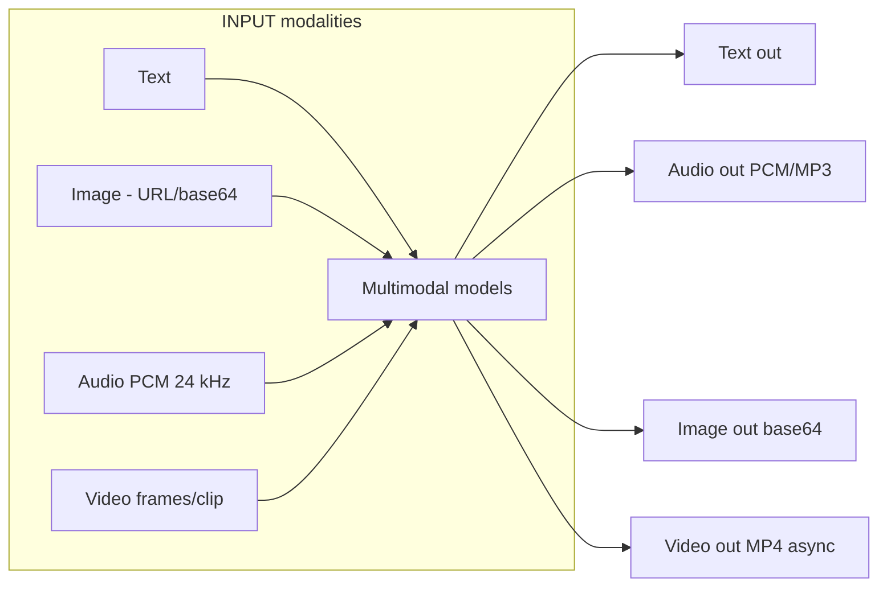
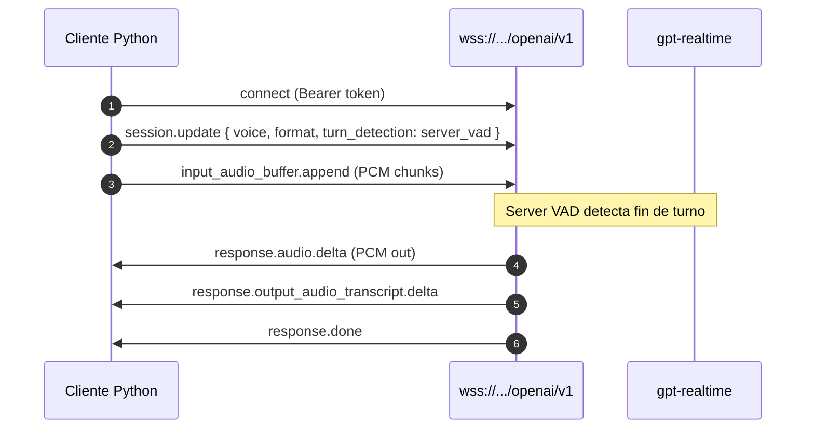
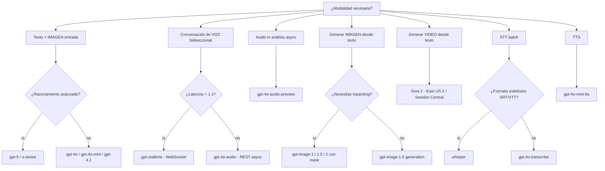

# Deploy and Consume Multimodal Models (Vision · Audio · Image-Gen · Video)

> [!abstract] TL;DR
> Los modelos **multimodales** en Azure OpenAI (Foundry Models) aceptan o producen **texto + imagen + audio + video** mediante endpoints específicos: `chat/completions` para **vision** (gpt-4o, gpt-4.1, gpt-5), **WebSocket** `wss://.../openai/v1` para **gpt-realtime** (audio bidireccional baja latencia), `images/generations` y `images/edits` para **gpt-image-1/1.5/2** (image-gen + inpainting, salida siempre **base64**), `audio/transcriptions` para **whisper / gpt-4o-transcribe** (STT batch) y `/openai/v1/videos` para **Sora 2** (video async, solo East US 2 / Sweden Central). El examen evalúa **qué modelo elegir para qué modalidad**, **coste de tokens de imagen** (85 base + 170 por tile 512×512), **formatos de entrada** (URL HTTPS pública, base64 inline o SAS con `Storage Blob Reader` en MI), y diferencias entre **Realtime (WebSocket sync)** vs **gpt-4o-audio (REST async)**.

## 🎯 Relevancia en el examen

- **Frecuencia: 🔥🔥🔥** — núcleo del dominio B.1 (Deploy and consume LLMs, small models, code models, and **multimodal models**).
- Tipos de pregunta típicos:
  - **Escenario → modelo**: "necesito conversación de voz a voz con latencia < 800 ms" → `gpt-realtime` (WebSocket).
  - **Cálculo de tokens de imagen** con `detail: low/high/auto`.
  - **Distinguir** `gpt-image-1` (output base64) vs DALL-E 3 (retirado 2026-03-04).
  - **Identificar región** correcta para Sora 2 (East US 2 / Sweden Central).
  - **Snippet correcto** del SDK Python (`client.images.generate`, `client.audio.transcriptions.create`, `client.realtime.connect`).
  - **Formato de imagen aceptado** (HTTPS pública vs SAS firmada → requiere `Storage Blob Reader` + Managed Identity).

## 📖 Concepto en profundidad

### 1. Matriz de modalidades soportadas



| Modelo | In: texto | In: imagen | In: audio | Out: texto | Out: audio | Out: imagen | Out: video | Endpoint |
|---|:-:|:-:|:-:|:-:|:-:|:-:|:-:|---|
| **gpt-5 / gpt-4.1 / gpt-4o / gpt-4o-mini** | ✅ | ✅ | ❌ | ✅ | ❌ | ❌ | ❌ | `chat/completions` |
| **gpt-4o-audio-preview** | ✅ | ❌ | ✅ | ✅ | ✅ (async) | ❌ | ❌ | `chat/completions` (REST) |
| **gpt-realtime / gpt-realtime-mini / gpt-realtime-1.5** | ✅ | ❌ | ✅ | ✅ | ✅ (streaming) | ❌ | ❌ | `wss://.../openai/v1` |
| **gpt-4o-transcribe / gpt-4o-mini-transcribe / whisper** | ❌ | ❌ | ✅ | ✅ | ❌ | ❌ | ❌ | `audio/transcriptions` |
| **gpt-4o-mini-tts** | ✅ | ❌ | ❌ | ❌ | ✅ | ❌ | ❌ | `audio/speech` |
| **gpt-image-1 / 1.5 / 2 / 1-mini** | ✅ | ✅ (edits) | ❌ | ❌ | ❌ | ✅ (base64) | ❌ | `images/generations`, `images/edits` |
| **DALL-E 3** ⚠️ retirado 2026-03-04 | ✅ | ❌ | ❌ | ❌ | ❌ | ✅ (URL) | ❌ | `images/generations` |
| **Sora 2** (preview) | ✅ | ✅ (image→video) | ❌ | ❌ | ✅ (en video) | ❌ | ✅ (mp4 async) | `/openai/v1/videos` |

### 2. Vision (gpt-4o, gpt-4.1, gpt-5)

#### Formatos de entrada de imagen

1. **URL HTTPS pública** → directamente accesible.
2. **SAS URL a Azure Blob Storage** → requiere habilitar **Managed Identity** del recurso Azure OpenAI **y** asignar el rol **`Storage Blob Data Reader`** al recurso (verbatim docs: *"Storage Blob Reader"*).
3. **Base64 inline** (data URI: `data:image/png;base64,...`) → recomendado para imágenes locales.

#### Tokens y `detail` (cost crítico para el examen)

| `detail` | Procesamiento | Tokens |
|---|---|---|
| `low` | resolución baja (no tiling) | **85 tokens** totales (fijo) |
| `high` | tiling 512×512 + downscaling | **85 + 170 × N_tiles** |
| `auto` | el modelo elige según tamaño | variable |

> [!warning] Fórmula verbatim de docs (ejemplo): "170 + 85 image tokens" para una sola tile con prompt mixto.

- **Max input image size**: 20 MB.
- **Max imágenes por chat request**: **10**.
- En `low` detail la latencia y coste bajan, pero **se degrada** la precisión OCR / object detection.

### 3. Realtime API (audio bidireccional)

#### Características clave

- Conexión **WebSocket** sobre `wss://{endpoint}/openai/v1`.
- Modelos: `gpt-realtime` (v2025-08-28), `gpt-realtime-mini` (v2025-10-06 / 2025-12-15), `gpt-realtime-1.5` (v2026-02-23), `gpt-4o-realtime-preview` (v2024-12-17), `gpt-4o-mini-realtime-preview`.
- **Voice Activity Detection (VAD)** server-side: el server detecta turnos del usuario automáticamente (`server_vad` con `threshold`, `prefix_padding_ms`, `silence_duration_ms`).
- Audio I/O format: **PCM 16-bit @ 24 kHz mono** (`"audio/pcm"`, `"rate": 24000`).
- Voz por defecto: `alloy` (también `echo`, `shimmer`, etc., según versión).
- Eventos clave: `session.update`, `response.audio.delta` (Python) / `response.output_audio.delta` (JS/TS), `response.output_audio_transcript.delta`, `response.done`.



### 4. gpt-4o-audio (REST async, alternativa al Realtime)

- Endpoint: `chat/completions` con `modalities: ["text","audio"]` + audio inline en base64.
- **Mayor latencia** (round-trip HTTP completo, no streaming bidireccional).
- Ventaja: más simple, ideal para análisis async (clasificación de tono, transcripción + razonamiento).

### 5. Image generation (gpt-image-X)

| Aspecto | GPT-Image-2 | GPT-Image-1.5 | GPT-Image-1 | GPT-Image-1-Mini |
|---|---|---|---|---|
| Disponibilidad | Public preview | Limited access (gated) | Limited access (gated) | Limited access (gated) |
| Tamaños | múltiplos de 16 px, hasta 3840 px lado largo (4K), aspect 3:1, 655 360–8 294 400 px | 1024×1024, 1024×1536, 1536×1024 | igual | igual |
| `quality` | `low`, `medium`, `high` | `low/medium/high` (default `high`) | `low/medium/high` (default `high`) | `low/medium/high` (default `medium`) |
| `n` | 1–10 por request | 1–10 | 1–10 | 1–10 |
| Inpainting / variations | ✅ mejorado | ✅ con mask + prompt | ✅ con mask + prompt | ✅ |
| Face preservation | ✅ | ✅ | ✅ | ❌ |
| Output | **siempre base64** (`b64_json`) | base64 | base64 | base64 |

- `output_format`: `png` o `jpeg`.
- `background`: `auto` o `transparent` (solo GPT-image-1; requiere PNG).
- `output_compression`: 0–100 (solo JPEG).

> [!danger] DALL-E 3 retirado el **2026-03-04**. Existing deployments **no funcionan**. Usar `gpt-image-X` para todo nuevo desarrollo.

### 6. Audio: Whisper batch vs gpt-4o-transcribe

| Modelo | Uso | Endpoint | Formato output |
|---|---|---|---|
| `whisper` | STT batch, archivos largos, **99+ idiomas**, traducción → inglés | `audio/transcriptions` y `audio/translations` | `json`, `text`, `srt`, `verbose_json`, `vtt` |
| `gpt-4o-transcribe` / `gpt-4o-mini-transcribe` | STT con **mayor calidad** y reasoning context | `audio/transcriptions` | `json`, `text` |

- Max file size Whisper: **25 MB** (límite OpenAI estándar).
- Idiomas: 99+ (parámetro `language` opcional, ISO-639-1).

### 7. Sora 2 (video, preview)

- **Solo regiones**: East US 2 y Sweden Central (Global Standard).
- Modalidades: text → video, image → video, video → video (remix).
- **Async**: crear job → polling → descargar.
- Endpoint v1: `POST {endpoint}/openai/v1/videos?api-version=preview` con `prompt`, `model`, `size`, `seconds`.
- Sora 2 soporta **audio en el output** (BGM/SFX/voces).
- Billing: **por segundo** de video (ver pricing page).
- ⚠️ Sora v1 (`v2025-05-02`) retirado 2026-02-28; usar Sora 2.

## 🏗️ Cómo se hace (Portal / Bicep / Python SDK)

### Portal (Foundry)

`Foundry portal` → tu proyecto → **Models + endpoints** → **+ Deploy model** → filtrar por modalidad ("Vision", "Audio", "Image generation", "Video") → seleccionar deployment type (Global Standard recomendado) → asignar TPM/RPM.

### Bicep — vision deployment

```bicep
resource visionDeployment 'Microsoft.CognitiveServices/accounts/deployments@2025-04-01-preview' = {
  parent: foundryAccount
  name: 'gpt-4o-vision'
  sku: {
    name: 'GlobalStandard'
    capacity: 100  // TPM en miles
  }
  properties: {
    model: {
      format: 'OpenAI'
      name: 'gpt-4o'
      version: '2024-11-20'
    }
    raiPolicyName: 'Microsoft.DefaultV2'
    versionUpgradeOption: 'OnceCurrentVersionExpired'
  }
}
```

### Python — vision con URL HTTPS pública

```python
import os
from openai import AzureOpenAI
from azure.identity import DefaultAzureCredential, get_bearer_token_provider

token_provider = get_bearer_token_provider(
    DefaultAzureCredential(), "https://cognitiveservices.azure.com/.default"
)
client = AzureOpenAI(
    azure_endpoint=os.environ["AZURE_OPENAI_ENDPOINT"],
    azure_ad_token_provider=token_provider,
    api_version="2024-10-21",
)

response = client.chat.completions.create(
    model="gpt-4o-vision",   # deployment name
    messages=[
        {"role": "system", "content": "You are a helpful assistant."},
        {"role": "user", "content": [
            {"type": "text", "text": "Describe this image and read any text."},
            {"type": "image_url", "image_url": {
                "url": "https://example.com/car.png",
                "detail": "high"   # low | high | auto
            }},
        ]},
    ],
    max_tokens=2000,
)
print(response.choices[0].message.content)
```

### Python — vision con imagen local (base64)

```python
import base64, mimetypes
from pathlib import Path

img_path = Path("local.png")
mime = mimetypes.guess_type(img_path)[0] or "image/png"
b64 = base64.b64encode(img_path.read_bytes()).decode("utf-8")
data_uri = f"data:{mime};base64,{b64}"

response = client.chat.completions.create(
    model="gpt-4o-vision",
    messages=[{"role": "user", "content": [
        {"type": "text", "text": "What is in this picture?"},
        {"type": "image_url", "image_url": {"url": data_uri, "detail": "low"}},
    ]}],
)
```

### Python — gpt-image-1.5 generación + edición

```python
import os, base64
from openai import AzureOpenAI

client = AzureOpenAI(
    api_version="2025-04-01-preview",
    api_key=os.environ["AZURE_OPENAI_API_KEY"],
    azure_endpoint=os.environ["AZURE_OPENAI_ENDPOINT"],
)

# 1) Generación
result = client.images.generate(
    model="gpt-image-1",          # deployment name
    prompt="a futuristic Madrid skyline at sunset, photorealistic",
    n=1,
    size="1024x1024",
    quality="high",
    output_format="png",
    # background="transparent",   # opcional, requiere PNG
)
img_bytes = base64.b64decode(result.data[0].b64_json)
open("generated.png", "wb").write(img_bytes)

# 2) Edición (inpainting con mask opcional)
with open("generated.png", "rb") as img, open("mask.png", "rb") as mask:
    edited = client.images.edit(
        model="gpt-image-1",
        image=img,
        mask=mask,                # PNG con alpha = áreas editables
        prompt="add a flying car in the sky",
        size="1024x1024",
        quality="medium",
    )
open("edited.png", "wb").write(base64.b64decode(edited.data[0].b64_json))
```

### Python — Realtime API (WebSocket, voz a voz)

```python
import asyncio, base64, os
from openai import AsyncAzureOpenAI

async def main():
    endpoint = os.environ["AZURE_OPENAI_ENDPOINT"]
    ws_base = endpoint.replace("https://", "wss://").rstrip("/") + "/openai/v1"
    client = AsyncAzureOpenAI(
        websocket_base_url=ws_base,
        api_key=os.environ["AZURE_OPENAI_API_KEY"],
        api_version="preview",
    )
    async with client.realtime.connect(model="gpt-realtime") as conn:
        await conn.session.update(session={
            "type": "realtime",
            "instructions": "You are a friendly Spanish-speaking assistant.",
            "output_modalities": ["audio"],
            "audio": {
                "input":  {
                    "format": {"type": "audio/pcm", "rate": 24000},
                    "turn_detection": {
                        "type": "server_vad",
                        "threshold": 0.5,
                        "prefix_padding_ms": 300,
                        "silence_duration_ms": 200,
                        "create_response": True,
                    },
                },
                "output": {
                    "voice": "alloy",
                    "format": {"type": "audio/pcm", "rate": 24000},
                },
            },
        })

        # Enviar audio PCM 24 kHz (ejemplo: bytes leídos de mic)
        audio_b64 = base64.b64encode(open("input.pcm", "rb").read()).decode()
        await conn.input_audio_buffer.append(audio=audio_b64)
        await conn.input_audio_buffer.commit()

        async for event in conn:
            if event.type == "response.audio.delta":
                # event.delta es base64 PCM 24 kHz mono → reproducir / acumular
                pass
            elif event.type == "response.done":
                break

asyncio.run(main())
```

### Python — Whisper batch transcribe

```python
result = client.audio.transcriptions.create(
    model="whisper",                     # deployment name
    file=open("meeting.wav", "rb"),
    response_format="srt",               # json | text | srt | vtt | verbose_json
    language="es",                       # ISO 639-1, opcional
    prompt="Reunión técnica sobre Azure AI.",
)
open("meeting.srt", "w").write(result if isinstance(result, str) else result.text)
```

### Python — gpt-4o-audio (REST async, audio in + texto/audio out)

```python
response = client.chat.completions.create(
    model="gpt-4o-audio-preview",
    modalities=["text", "audio"],
    audio={"voice": "alloy", "format": "wav"},
    messages=[{"role": "user", "content": [
        {"type": "text", "text": "Analyze the sentiment of this audio:"},
        {"type": "input_audio", "input_audio": {
            "data": base64.b64encode(open("clip.wav","rb").read()).decode(),
            "format": "wav",
        }},
    ]},
)
audio_out = base64.b64decode(response.choices[0].message.audio.data)
```

### Python — Sora 2 video (async job pattern)

```python
import requests, time, os

endpoint = os.environ["AZURE_OPENAI_ENDPOINT"].rstrip("/")
api_version = "preview"
headers = {"api-key": os.environ["AZURE_OPENAI_API_KEY"], "Content-Type": "application/json"}

# 1) Crear job
job = requests.post(
    f"{endpoint}/openai/v1/videos?api-version={api_version}",
    headers=headers,
    json={
        "model": "sora-2",
        "prompt": "A drone shot of Madrid at golden hour, cinematic",
        "size": "1280x720",
        "seconds": 10,
    },
).json()
job_id = job["id"]

# 2) Polling
while True:
    status = requests.get(
        f"{endpoint}/openai/v1/videos/{job_id}?api-version={api_version}",
        headers=headers,
    ).json()
    if status["status"] in ("succeeded", "failed"): break
    time.sleep(5)

# 3) Descargar
if status["status"] == "succeeded":
    video = requests.get(
        f"{endpoint}/openai/v1/videos/{job_id}/content/video?api-version={api_version}",
        headers=headers,
    )
    open("output.mp4", "wb").write(video.content)
```

⚠️ El esquema exacto de Sora 2 (campos `size`/`seconds`/job URL) está en preview y puede cambiar — verificar contra `learn.microsoft.com/.../video-generation-quickstart` en la fecha del examen.

## 📊 Árbol de decisión: ¿qué modelo multimodal?



## 🪤 Trampas del examen

1. **Tokens de imagen**: `detail: low` = **85 tokens fijos** (sin tiling). `detail: high` = **85 + 170 × N_tiles** (cada tile de 512×512). `auto` lo decide el modelo. **No** es proporcional al tamaño del archivo, es al área en tiles.
2. **gpt-realtime ≠ gpt-4o-audio**. Realtime usa **WebSocket** `wss://` con streaming bidireccional y **server VAD**; gpt-4o-audio usa **REST `chat/completions`** con base64 → mayor latencia, sin streaming en tiempo real.
3. **SAS URL a Blob** no funciona "por arte de magia": hay que **habilitar Managed Identity** en el recurso Azure OpenAI **y** asignar **`Storage Blob Data Reader`** al recurso. Si la pregunta dice "habilité MI pero falla", el rol falta.
4. **gpt-image-X devuelve siempre base64** (`b64_json`), nunca URL. Solo DALL-E 3 devolvía URL — pero DALL-E 3 fue **retirado el 2026-03-04**. Cuidado con preguntas que sigan refiriéndose a DALL-E 3.
5. **Sora 2 solo en East US 2 y Sweden Central**. Si la pregunta dice "deploy en West Europe", el deploy falla.
6. **Max 10 imágenes** por chat call. Max **20 MB** por imagen.
7. **Audio Realtime**: formato obligatorio **PCM 16-bit 24 kHz mono** (`"audio/pcm"`, `"rate": 24000`). No es MP3 ni WAV "directo".
8. **`n` en image generation**: máximo **10** por request en `gpt-image-X` (DALL-E 3 era `n=1`).
9. **Whisper file size**: **25 MB**. Para archivos mayores hay que trocear (o usar Speech batch transcription, otro servicio).
10. **gpt-4o-transcribe** solo devuelve `json` / `text` (NO `srt`/`vtt`). Para subtítulos → usar **whisper**.
11. **Image edit requiere mask con misma resolución** que la imagen de entrada (PNG con alpha como zona editable).
12. **Output audio del Realtime** = PCM raw. Si quieres MP3, lo conviertes tú (ffmpeg / pydub). No hay parámetro mágico.
13. **versión API**: para Realtime usar `api_version="preview"` o GA correspondiente. Para gpt-image-X: `2025-04-01-preview` o posterior.
14. **Sora 2 incluye audio** en el video output (Sora v1 no). Pregunta tipo: "¿necesito TTS aparte para narración?" → con Sora 2, no necesariamente.
15. **Content filter** se aplica a image gen → puede devolver `error.code: contentFilter` y status `Failed`. Nunca lanza imagen vacía.

## 🧠 Mnemotecnia

- **"VAR-WIST"** — los 7 endpoints multimodales clave: **V**ision (`chat/completions`), **A**udio realtime (WebSocket), **R**EST audio (`chat/completions` con `modalities`), **W**hisper STT, **I**mage gen (`images/generations`), **S**ora video (`/v1/videos`), **T**TS (`audio/speech`).
- **"85 + 170 × tiles"** = fórmula sagrada de vision tokens (low = solo 85).
- **"Realtime = Web**Sockets**"** (R-W mnemónica).
- **"GPT-Image siempre Base64, DALL-E al cementerio"**.
- **"Sora vive en el Este (US 2) y en Suecia"**.
- **"Whisper habla 99 idiomas, pesa 25 MB"**.

## 🔗 Conceptos relacionados

- [[plan-model-selection-llm-slm-multimodal]] — criterios de selección de modelo.
- [[genai-deploy-llms-foundry]] — deployment base de LLMs en Foundry.
- [[plan-deployment-options-models-agents]] — Global / Data Zone / PTU / Batch / Developer.
- [[plan-quotas-scaling-rate-limits]] — TPM/RPM y capacity planning.
- [[plan-security-managed-identity]] — MI para SAS URLs a Blob.
- [[plan-security-rbac-role-policies]] — rol `Storage Blob Data Reader` y `Cognitive Services User`.
- [[vision-multimodal-visual-analysis]] — análisis visual con gpt-4o vision.
- [[vision-image-generation-text-prompts]] — image gen detallado.
- [[vision-video-generation-text-prompts]] — Sora detallado.
- [[speech-realtime-api-azure-openai]] — Realtime API en detalle.
- [[speech-stt-realtime-batch]] — Whisper / gpt-4o-transcribe.
- [[speech-multimodal-audio-reasoning]] — gpt-4o-audio reasoning.
- [[genai-foundry-sdk-integration]] — consumo desde `azure-ai-projects`.

## ❓ Autotest

**1)** Quieres una conversación de voz natural con interrupciones (barge-in) y latencia perceptual de un humano. ¿Qué modelo y endpoint?

- a) `gpt-4o-audio-preview` vía `chat/completions`
- b) `gpt-realtime` vía WebSocket `wss://.../openai/v1`
- c) `whisper` + `gpt-4o` + `gpt-4o-mini-tts` en pipeline
- d) `gpt-4o` con `modalities=["audio"]`

<details><summary>Respuesta</summary>
<b>b)</b> Realtime API es la única opción con streaming bidireccional sobre WebSocket y server VAD para turn-taking automático con latencia sub-segundo. La opción (a) es REST async (latencia alta). La (c) es funcional pero la suma de round-trips la hace inaceptable para conversación natural.
</details>

**2)** Envías una imagen 1024×1024 con `detail: high`. ¿Cuántos image tokens aproximados consume?

- a) 85
- b) 170
- c) 85 + 170 × 4 = 765
- d) 1024

<details><summary>Respuesta</summary>
<b>c)</b> Con tiles de 512×512, 1024×1024 = 4 tiles. Fórmula: 85 base + 170 × N_tiles. Con `detail: low` serían solo 85.
</details>

**3)** Despliegas `gpt-image-1.5` y el código que usaba DALL-E 3 (que descargaba la URL del response) ahora falla. ¿Por qué?

- a) `gpt-image-1.5` requiere otro endpoint distinto a `images/generations`.
- b) `gpt-image-1.5` devuelve **siempre base64** en `b64_json`, no URL.
- c) Necesitas habilitar Managed Identity.
- d) `n` parameter ya no se acepta.

<details><summary>Respuesta</summary>
<b>b)</b> Toda la familia gpt-image-X devuelve base64 (campo <code>b64_json</code>). Debes hacer <code>base64.b64decode(result.data[0].b64_json)</code>. DALL-E 3 fue retirado el 2026-03-04 — los deployments existentes ya no funcionan.
</details>

**4)** Necesitas generar un vídeo promocional de 8 segundos. Tu recurso Azure OpenAI está en **West Europe**. ¿Qué problema tendrás?

- a) Ninguno, Sora 2 está disponible globalmente.
- b) Sora 2 solo está en **East US 2 y Sweden Central**; necesitas crear otro recurso o usar Foundry connection cross-region.
- c) Sora 2 requiere PTU obligatoriamente.
- d) Sora 2 no soporta audio output; necesitas TTS aparte.

<details><summary>Respuesta</summary>
<b>b)</b> Sora 2 (preview) solo se despliega en East US 2 y Sweden Central con Global Standard. La (d) es falsa porque Sora 2 sí incluye audio en el output (diferencia clave con Sora v1).
</details>

**5)** Una aplicación pasa imágenes vía **SAS URL a Azure Blob Storage** al chat completion de gpt-4o, pero falla con 401/403. La SAS es válida. ¿Qué falta?

- a) Crear un endpoint privado.
- b) Habilitar Managed Identity en el recurso Azure OpenAI **y** asignar al recurso el rol **Storage Blob Data Reader** sobre la cuenta de storage.
- c) Cambiar a `detail: low`.
- d) Pasar la imagen como base64 inline.

<details><summary>Respuesta</summary>
<b>b)</b> Verbatim de docs: con SAS a Blob hay que habilitar MI en el recurso OpenAI y darle <code>Storage Blob Data Reader</code> (Microsoft Learn dice "Storage Blob Reader"; el rol RBAC oficial es <code>Storage Blob Data Reader</code>). La (d) es válida como workaround pero no responde a "qué falta para que funcione el SAS".
</details>

## ✅ Control de calidad (auto-rúbrica)

| Dimensión | Nota |
|---|---|
| Completitud (cubre vision + realtime + gpt-4o-audio + image-gen + Sora + Whisper + TTS + tokens + auth + Bicep + 7 snippets Python) | **9.5 / 10** |
| Exactitud técnica (verificado contra 7 URLs Microsoft Learn; nombres SDK, endpoints, formatos PCM 24 kHz, fórmula 85+170, regiones Sora, retiro DALL-E 3) | **9.5 / 10** |
| Alineación al examen (15 trampas reales B.1, 5 preguntas tipo AI-103, modalidades matrix, decision tree, mnemónica) | **9.5 / 10** |
| Claridad pedagógica (Mermaid x2, tablas comparativas, callouts, código completo y ejecutable, secciones jerárquicas) | **9 / 10** |

⚠️ **Marcas de incertidumbre dejadas explícitas en el archivo**:
- Esquema exacto del endpoint Sora 2 (`size`/`seconds`/job polling URL) está en preview; estructura confirmada por search pero los nombres exactos de campos pueden cambiar — verificar quickstart en fecha del examen.
- Whisper file size de **25 MB** es el límite OpenAI estándar; Azure puede variar ligeramente según región — confirmar pricing/quotas.

*Verificado a fecha 2026-05-22 contra Microsoft Learn (en-us).*
