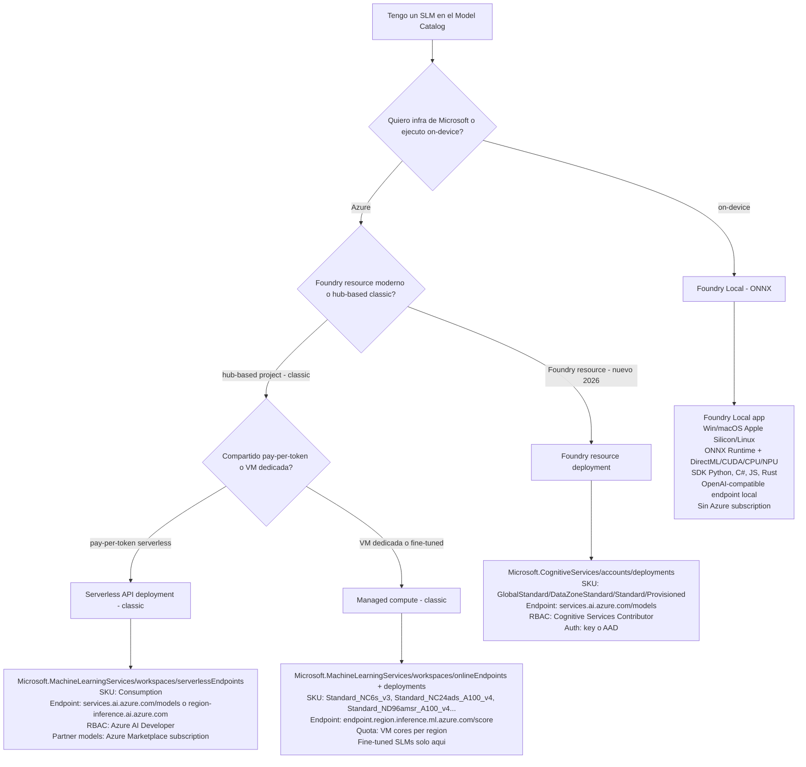
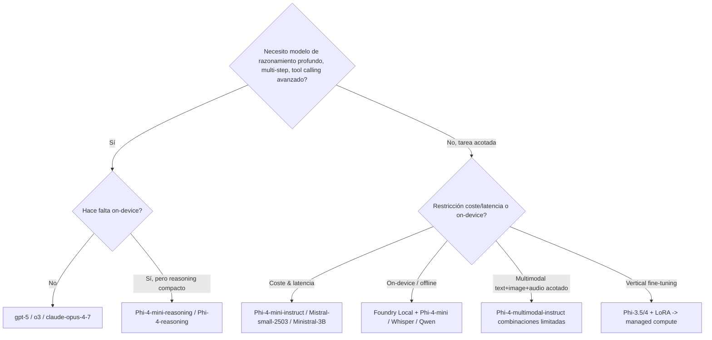

# Deploy de SLMs en Microsoft Foundry — Phi family, Mistral, Llama, gpt-oss, Foundry Local

> [!abstract] TL;DR
> Los **Small Language Models (SLMs)** en Foundry — **familia Phi (Phi-3, Phi-3.5, Phi-4, `Phi-4-mini-instruct`, `Phi-4-multimodal-instruct`, `Phi-4-reasoning`, `Phi-4-mini-reasoning`)**, **gpt-oss (20B/120B)**, **Mistral small/Ministral/Codestral**, **Llama-3.2 1B/3B / Llama-4-Scout**, **Cohere/DeepSeek/NTT** — se despliegan en Foundry siguiendo **tres caminos diferenciados que el examen confunde a propósito**: **(1) Foundry resource deployment** (`Microsoft.CognitiveServices/accounts/deployments`, ruta moderna 2026, SKUs `GlobalStandard`/`DataZoneStandard`/`Standard`/`GlobalProvisioned`/`Provisioned`, endpoint `…/services.ai.azure.com/models`, RBAC `Cognitive Services Contributor`); **(2) Serverless API deployment** y **(3) Managed compute** (`Microsoft.MachineLearningServices/workspaces/serverlessEndpoints` y `…/onlineEndpoints` — **rutas Foundry classic portal**, requieren **hub-based project**, RBAC `Azure AI Developer`, partner models requieren **Azure Marketplace subscription**); y **(4) Foundry Local** (ONNX runtime on-device, Windows/macOS Apple silicon/Linux, OpenAI-compatible, sin Azure). **Fine-tuned SLMs solo se despliegan a managed compute, NO a serverless**. Endpoint Foundry expone API unificada (`Azure AI Model Inference API` → migrando a **OpenAI/v1**; el **Azure AI Inference beta SDK queda deprecado el 26-ago-2026**). Header `extra-parameters: pass-through|drop|error` controla qué hacer con parámetros no estándar.

## 🎯 Relevancia en el examen

🔥🔥 **Alta**. Microsoft examina:

- **Diferenciar las 4 vías de deploy** y qué provider ARM corresponde a cada una.
- Reconocer **qué SKU** elegir (`GlobalStandard` vs VM `Standard_NC*`) según la vía.
- **Foundry resource (nuevo)** vs **hub-based project (classic)**: el primero es la dirección estratégica 2026.
- Saber que un **fine-tuned SLM** solo puede consumirse desde **managed compute** (no serverless).
- Identificar **`Phi-4-mini-reasoning` / `Phi-4-reasoning`** como variantes de razonamiento explícito (NO `Phi-4` base).
- **`Phi-4-multimodal-instruct`** acepta `text + image` o `text + audio` (⚠️ NO los tres simultáneamente — limitación documentada en Microsoft Q&A oficial).
- Endpoint route: `https://<resource>.services.ai.azure.com/models` (NO `…/openai/deployments` — esa es exclusiva Azure OpenAI).
- **Partner models** (Cohere, Mistral, Llama-3.1/3.2, NTT, Nixtla, Stability) **requieren Azure Marketplace subscription** + permisos `Microsoft.SaaS/*` + `Microsoft.MarketplaceOrdering/*`.
- **`Microsoft.SaaS/register/action`** se ejecuta una vez por subscription.
- **Foundry Local** = ONNX, sin Azure subscription, SDK Python/C#/JS/Rust.

## 📖 Concepto en profundidad

### 1. ¿Qué es un SLM y por qué importa?

> [!info] Definición práctica
> **Small Language Model** = modelo generativo con típicamente **< ~15 B parámetros** (la frontera no es estricta), diseñado para inferencia eficiente en hardware acotado (CPU, GPU consumer, NPU móvil, edge). Frente a un LLM (>100 B params, p. ej. `gpt-5`, `Llama-3.1-405B`) un SLM cambia **calidad general** por **latencia, coste, privacidad, on-device**.

**Razones por las que entran en el examen AI-103:**

| Motivo | Implicación examen |
|---|---|
| **Coste/Token** menor 10-100× vs GPT-4o/5 | Pregunta: *"reducir coste de un workflow batch"* → SLM serverless o Phi-4 GlobalStandard. |
| **Latencia p50 < 1 s** | Pregunta: *"chat client en tiempo real low-latency"* → SLM en lugar de o-series reasoning. |
| **On-device / offline / soberanía** | Pregunta: *"datos no salen del dispositivo del usuario"* → **Foundry Local**. |
| **Fine-tuning vertical barato** | Pregunta: *"adaptar modelo a vocabulario médico"* → Phi-3.5/4 + LoRA → managed compute. |
| **Razonamiento especializado small** | Pregunta: *"reasoning compacto"* → `Phi-4-mini-reasoning` (NO `o3-mini` que es OpenAI). |

### 2. Catálogo SLM verificado en Foundry (2026-05-23)

> [!note] Verbatim Microsoft Learn (`models-from-partners`, `models-sold-directly-by-azure`)

#### 🟦 Microsoft — Phi family

| Modelo (ID) | Parámetros aprox. | Input | Output | Context (tokens) | Capacidades | Notas examen |
|---|---|---|---|---|---|---|
| `Phi-4-mini-instruct` | 3.8 B | text | text | 131 072 / 4 096 | Multilingual (24 idiomas), no tool calling | SLM de referencia en docs Foundry, GA. |
| `Phi-4` | 14 B | text | text | 16 384 / 16 384 | Instruction-tuned, 45 idiomas | Versión 8 en classic managed compute. |
| `Phi-4-multimodal-instruct` | ~5.6 B | **text + image + audio** | text | 131 072 / 4 096 | Multimodal, multilingual | ⚠️ **No combina los 3 inputs simultáneamente**: solo `text+image` o `text+audio`. |
| `Phi-4-reasoning` | 14 B | text | text con razonamiento | 32 768 / 32 768 | chat-completion **with reasoning content** | Devuelve `reasoning_content` separado. |
| `Phi-4-mini-reasoning` | 3.8 B | text | text con razonamiento | 128 000 / 128 000 | Reasoning compacto | Equivalente "small" a o-series. |
| `Phi-3.5-mini-instruct` ⚠️ legacy | 3.8 B | text | text | 128 000 / 4 096 | Multilingual | Hub-based project (classic). |
| `Phi-3.5-MoE-instruct` ⚠️ legacy | 16×3.8 B (MoE) | text | text | 128 000 | Mixture of Experts | Hub-based project (classic). |
| `Phi-3-mini/small/medium` ⚠️ legacy | 3.8B / 7B / 14B | text | text | 4k–128k | 2024 cohort | Hub-based project (classic). |

> [!warning] `Phi-4-reasoning` ≠ `Phi-4`. El base `Phi-4` NO produce `reasoning_content`. Si la pregunta menciona chain-of-thought / razonamiento explícito en small models, la respuesta es `Phi-4-reasoning` o `Phi-4-mini-reasoning`.

#### 🟦 Microsoft — gpt-oss (open-weights)

| Modelo | Params | Origen | Disponibilidad |
|---|---|---|---|
| `gpt-oss-20b` | 20 B | OpenAI open-weights (mid-2025) | ⚠️ Verificar en model catalog (puede requerir hub-based project o managed compute). |
| `gpt-oss-120b` | 120 B | OpenAI open-weights | ⚠️ Considerar LLM, no SLM puro — listado aquí porque comparte la ruta partner/community. |

> [!warning] `gpt-oss-*` son **open-weights publicados por OpenAI** que se han integrado en el catálogo Foundry como Models from partners and community. **No son equivalentes a `gpt-4o`/`gpt-5` (Azure OpenAI propietario)**. Examen puede contrastar: para `gpt-oss` → deployment "partners" (managed compute o Foundry resource si está catalogado), para `gpt-5` → Azure OpenAI deployment.

#### 🟦 Mistral AI

| Modelo | Context | Tool calling | Hub-based requerido |
|---|---|---|---|
| `Codestral-2501` | 262 144 | No | No (Foundry resource OK) |
| `Ministral-3B` | 131 072 | **Sí** | No |
| `Mistral-small-2503` | 32 768 | **Sí** | No |
| `Mistral-medium-2505` | 128 000 (+image) | No | No |
| `mistralai-Mistral-7B-Instruct-v01/v0-2` | — | No | **Sí** (classic) |
| `mistralai-Mixtral-8x7B / 8x22B-Instruct` | hasta 64 000 | No | **Sí** (classic) |

#### 🟦 Meta — Llama

| Modelo | Input | Context | SLM? |
|---|---|---|---|
| `Llama-3.2-11B-Vision-Instruct` | text + image | 128 000 | Mid |
| `Llama-3.2-90B-Vision-Instruct` | text + image | 128 000 | LLM |
| `Meta-Llama-3.1-8B-Instruct` | text | 131 072 | SLM |
| `Meta-Llama-3.1-405B-Instruct` | text | 131 072 | LLM (frontier) |
| `Llama-4-Scout-17B-16E-Instruct` | text + image | 128 000 | Mid (MoE 16E) |

#### 🟦 Cohere

`Cohere-command-r-08-2024` / `Cohere-command-r-plus-08-2024` (chat 131k/4k) · `Cohere-embed-v3-english` / `Cohere-embed-v3-multilingual` (vector 1024-dim).

#### 🟦 Otros (DeepSeek, NTT, Nixtla, Stability)

`DeepSeek-R1` (ruta serverless Foundry classic, modelo *sold by Azure*) · `tsuzumi-7b` (NTT, hub-based) · `TimeGEN-1` (Nixtla, forecasting) · `Stable Diffusion 3.5 Large` / `Stable Image Core` / `Stable Image Ultra`.

### 3. Las 4 vías de deploy — mapa decisivo



> [!important] Comparativa de los 4 caminos

| Característica | Foundry resource deployment | Serverless API (classic) | Managed compute (classic) | Foundry Local |
|---|---|---|---|---|
| **Resource provider ARM** | `Microsoft.CognitiveServices/accounts/deployments` | `Microsoft.MachineLearningServices/workspaces/serverlessEndpoints` | `Microsoft.MachineLearningServices/workspaces/onlineEndpoints` + `/deployments` | N/A (local) |
| **Kind cuenta padre** | `kind=AIServices` (Foundry resource) | hub-based project (`workspace`) | hub-based project (`workspace`) | N/A |
| **SKU** | `GlobalStandard` / `DataZoneStandard` / `Standard` / `GlobalProvisioned` / `Provisioned` | `Consumption` | VM SKU: `Standard_DS3_v2`, `Standard_NC6s_v3`, `Standard_NC24ads_A100_v4`, `Standard_ND96amsr_A100_v4`, … | N/A |
| **Billing** | TPM (capacity) o reservado | pay-per-token | pay-per-VM-hour | $0 (HW del usuario) |
| **RBAC requerido** | **Cognitive Services Contributor** | **Azure AI Developer** | **Azure AI Developer** + VM quota | N/A |
| **Endpoint** | `https://<res>.services.ai.azure.com/models` | `https://<endpoint>.<region>.inference.ai.azure.com/v1/...` o vía Foundry | `https://<endpoint>.<region>.inference.ml.azure.com/score` | `http://localhost:<port>` |
| **API** | Azure AI Model Inference API → OpenAI/v1 | Azure AI Model Inference API → OpenAI/v1 | Custom scoring (depende del modelo) | OpenAI-compatible (incl. Responses API) |
| **Auth** | API key o Entra ID (`DefaultAzureCredential`) | API key o Entra ID | API key o token AAD | N/A |
| **Partner models** | sí, requiere Marketplace para partners | sí, requiere Marketplace para partners | sí, requiere Marketplace para partners | curated catalog (no Marketplace) |
| **Fine-tuned support** | depende del modelo | ❌ generalmente no | ✅ **única vía** | ❌ |
| **Estado (2026)** | **Recomendado / dirección estratégica** | classic, sigue disponible | classic, sigue disponible | GA |

> [!warning] Cambios clave 2026 que el examen evalúa
> 1. **Microsoft Foundry** sustituye a "Azure AI Foundry" como branding oficial. La nueva ruta `learn.microsoft.com/en-us/azure/foundry/...` es la canónica; las páginas `…/azure/ai-foundry/…` van migrando.
> 2. **Foundry resource deployment** (Microsoft.CognitiveServices) es la **ruta nueva** unificada. Los artículos *serverless* y *managed compute* clásicos llevan ahora el banner *Applies only to: Foundry (classic) portal*.
> 3. **Azure AI Inference beta SDK** (`azure-ai-inference`) **se retira el 26-agosto-2026**. Migración: **OpenAI/v1 API + OpenAI SDK oficial** apuntando al endpoint Foundry.

### 4. Foundry resource deployment (vía moderna 2026)

#### Azure CLI

```bash
# Crear Foundry resource (kind=AIServices) si no existe
az cognitiveservices account create \
  -n my-foundry \
  -g my-rg \
  --custom-domain my-foundry \
  --location eastus2 \
  --kind AIServices \
  --sku S0

# Listar modelos disponibles (incluye SLMs Phi)
az cognitiveservices account list-models \
  -n my-foundry -g my-rg \
  | jq '.[] | { name: .name, format: .format, version: .version, sku: .skus[0].name }'

# Deploy Phi-4-mini-instruct con GlobalStandard
az cognitiveservices account deployment create \
  -n my-foundry \
  -g my-rg \
  --deployment-name Phi-4-mini-instruct \
  --model-name Phi-4-mini-instruct \
  --model-version 1 \
  --model-format Microsoft \
  --sku-capacity 1 \
  --sku-name GlobalStandard
```

#### Bicep — `ai-services-deployment-template.bicep`

```bicep
@allowed([
  'AI21 Labs'
  'Cohere'
  'Core42'
  'DeepSeek'
  'xAI'
  'Meta'
  'Microsoft'
  'Mistral AI'
  'OpenAI'
])
param modelPublisherFormat string = 'Microsoft'

@allowed([
  'GlobalStandard'
  'DataZoneStandard'
  'Standard'
  'GlobalProvisioned'
  'Provisioned'
])
param skuName string = 'GlobalStandard'

param accountName string
param modelName string = 'Phi-4-mini-instruct'
param modelVersion string = '1'
param contentFilterPolicyName string = 'Microsoft.DefaultV2'
param capacity int = 1

resource modelDeployment 'Microsoft.CognitiveServices/accounts/deployments@2024-04-01-preview' = {
  name: '${accountName}/${modelName}'
  sku: {
    name: skuName
    capacity: capacity
  }
  properties: {
    model: {
      format: modelPublisherFormat
      name: modelName
      version: modelVersion
    }
    raiPolicyName: contentFilterPolicyName
  }
}
```

> [!tip] El **resource type `Microsoft.CognitiveServices/accounts/deployments`** es el mismo que para Azure OpenAI. Lo que cambia es el `format` del modelo (`Microsoft`, `Meta`, `Mistral AI`, `Cohere`, `DeepSeek`, `Core42`, `xAI`, `AI21 Labs`, además del clásico `OpenAI`). Memoriza la lista exacta de **`@allowed`**: aparece como pregunta de validación.

#### Consumo Python — endpoint Foundry (OpenAI/v1 unificado)

```python
import os
from openai import OpenAI
from azure.identity import DefaultAzureCredential, get_bearer_token_provider

# Endpoint: <resource>.services.ai.azure.com/models
endpoint = "https://my-foundry.services.ai.azure.com/models"

# Opción A: API key
client = OpenAI(
    base_url=endpoint,
    api_key=os.environ["FOUNDRY_KEY"],
)

# Opción B: Entra ID
token_provider = get_bearer_token_provider(
    DefaultAzureCredential(),
    "https://cognitiveservices.azure.com/.default",
)
client_aad = OpenAI(
    base_url=endpoint,
    api_key=token_provider,
)

# Chat completion sobre Phi-4-mini-instruct
response = client.chat.completions.create(
    model="Phi-4-mini-instruct",       # deployment-name creado arriba
    messages=[
        {"role": "system", "content": "Eres un asistente conciso."},
        {"role": "user", "content": "Explica QUIC en 2 frases."},
    ],
    max_tokens=300,
    temperature=0.2,
)
print(response.choices[0].message.content)
```

> [!warning] El parámetro `model=` en la llamada es el **deployment-name** (alias custom), **no** el nombre interno del modelo. En el ejemplo CLI/Bicep he usado deployment-name = nombre de modelo por simplicidad, pero pueden divergir (`my-phi-fast`, `phi-prod-eu`, …).

### 5. Serverless API deployment (Foundry classic)

```python
# Requisitos: hub-based project, Azure AI Developer role, azure-ai-ml v2 SDK
from azure.ai.ml import MLClient
from azure.identity import InteractiveBrowserCredential
from azure.ai.ml.entities import MarketplaceSubscription, ServerlessEndpoint

client = MLClient(
    credential=InteractiveBrowserCredential(tenant_id="<tenant-id>"),
    subscription_id="<sub>",
    resource_group_name="<rg>",
    workspace_name="<project>",
)

# Partner model: suscribirse a Marketplace primero
model_id = "azureml://registries/azureml-cohere/models/Cohere-command-r-08-2024"
sub = MarketplaceSubscription(model_id=model_id, name="Cohere-command-r-sub")
client.marketplace_subscriptions.begin_create_or_update(sub).result()

# Crear serverless endpoint (rate limit 200 000 tokens/min, 1 000 req/min por defecto)
endpoint = ServerlessEndpoint(name="cohere-cr-qwerty", model_id=model_id)
created = client.serverless_endpoints.begin_create_or_update(endpoint).result()

# Obtener keys
keys = client.serverless_endpoints.get_keys("cohere-cr-qwerty")
print(keys.primary_key)
```

**Equivalente CLI:**

```bash
# subscription.yml
# name: Cohere-command-r-08-2024-qwerty
# model_id: azureml://registries/azureml-cohere/models/Cohere-command-r-08-2024
az ml marketplace-subscription create -f subscription.yml

# endpoint.yml
# name: cohere-cr-qwerty
# model_id: azureml://registries/azureml-cohere/models/Cohere-command-r-08-2024
az ml serverless-endpoint create -f endpoint.yml
az ml serverless-endpoint get-credentials -n cohere-cr-qwerty
```

**Equivalente Bicep — serverless:**

```bicep
resource serverlessEndpoint 'Microsoft.MachineLearningServices/workspaces/serverlessEndpoints@2024-04-01-preview' = {
  name: '${projectName}/${endpointName}'
  location: location
  sku: { name: 'Consumption' }
  properties: {
    modelSettings: {
      modelId: 'azureml://registries/azureml-cohere/models/Cohere-command-r-08-2024'
    }
  }
  dependsOn: [ marketplaceSub ]
}
```

> [!info] **Quota serverless API**: 200 000 tokens/min y 1 000 API requests/min **por deployment**. Una sola deployment por modelo por project. Solicitar aumento via Azure Support.

### 6. Managed compute (Foundry classic) — única vía para fine-tuned

```python
from azure.ai.ml import MLClient
from azure.identity import InteractiveBrowserCredential
from azure.ai.ml.entities import (
    ManagedOnlineEndpoint,
    ManagedOnlineDeployment,
    ProbeSettings,
)

ws = MLClient(
    credential=InteractiveBrowserCredential(),
    subscription_id="<sub>",
    resource_group_name="<rg>",
    workspace_name="<project>",
)

# 1. Endpoint
endpoint = ManagedOnlineEndpoint(name="phi4-endpoint-001", auth_mode="key")
ws.online_endpoints.begin_create_or_update(endpoint).wait()

# 2. Deployment Phi-4 (model id from catalog)
deployment = ManagedOnlineDeployment(
    name="blue",
    endpoint_name="phi4-endpoint-001",
    model="azureml://registries/azureml/models/Phi-4/versions/8",
    instance_type="Standard_NC24ads_A100_v4",
    instance_count=1,
    liveness_probe=ProbeSettings(
        failure_threshold=30, success_threshold=1, timeout=2,
        period=10, initial_delay=1000,
    ),
    readiness_probe=ProbeSettings(
        failure_threshold=10, success_threshold=1, timeout=10,
        period=10, initial_delay=1000,
    ),
)
ws.online_deployments.begin_create_or_update(deployment).wait()

# 3. Traffic
endpoint.traffic = {"blue": 100}
ws.online_endpoints.begin_create_or_update(endpoint).result()
```

**Equivalente Bicep simplificado:**

```bicep
resource onlineEndpoint 'Microsoft.MachineLearningServices/workspaces/onlineEndpoints@2024-04-01' = {
  parent: workspace
  name: 'phi4-endpoint-001'
  location: location
  identity: { type: 'SystemAssigned' }
  properties: {
    authMode: 'Key'
    publicNetworkAccess: 'Enabled'
  }
}

resource deployment 'Microsoft.MachineLearningServices/workspaces/onlineEndpoints/deployments@2024-04-01' = {
  parent: onlineEndpoint
  name: 'blue'
  location: location
  sku: { name: 'Standard_NC24ads_A100_v4', capacity: 1 }
  properties: {
    model: 'azureml://registries/azureml/models/Phi-4/versions/8'
    instanceType: 'Standard_NC24ads_A100_v4'
    scaleSettings: { scaleType: 'Default' }
  }
}
```

> [!warning] **VM SKU quota**: managed compute consume **VM core quota por región** (familia ND/NC/H100/A100). Sin quota suficiente, deployment falla con `QuotaExceeded`. La opción "**shared quota**" temporal del portal aplica solo a algunos modelos y **borra el endpoint a las 168 h**.

> [!note] **Endpoint URI managed compute**: `https://<endpoint-name>.<region>.inference.ml.azure.com/score` — **NO** `services.ai.azure.com`. Esto es decisivo para preguntas de troubleshooting.

### 7. `Phi-4-multimodal-instruct` — patrón de inputs

```python
from openai import OpenAI

client = OpenAI(
    base_url="https://my-foundry.services.ai.azure.com/models",
    api_key=os.environ["FOUNDRY_KEY"],
    default_headers={"extra-parameters": "drop"},  # tolerar params no-OpenAI
)

# A) text + image (OK)
resp = client.chat.completions.create(
    model="Phi-4-multimodal-instruct",
    messages=[{
        "role": "user",
        "content": [
            {"type": "text", "text": "Describe esta imagen."},
            {"type": "image_url", "image_url": {"url": "https://example.com/cat.png"}},
        ],
    }],
)

# B) text + audio (OK)
import base64
audio_b64 = base64.b64encode(open("clip.wav", "rb").read()).decode()
resp = client.chat.completions.create(
    model="Phi-4-multimodal-instruct",
    messages=[{
        "role": "user",
        "content": [
            {"type": "text", "text": "Transcribe el audio."},
            {"type": "input_audio", "input_audio": {"data": audio_b64, "format": "wav"}},
        ],
    }],
)

# C) text + image + audio simultaneo → ⚠️ NO SOPORTADO (Microsoft Q&A confirmada)
# Workaround: transcribir audio aparte y combinar como texto.
```

> [!warning] Aunque el model card dice *"Input: text, images, and audio"*, **la documentación operativa confirma que `Phi-4-multimodal-instruct` no procesa los 3 inputs en la misma llamada**. Combinaciones soportadas: `{text}`, `{text+image}`, `{text+audio}`. Workaround: pipeline en 2 pasos (transcribe audio → STT → fuse con image).

### 8. Header `extra-parameters` — comportamiento crítico

```python
client = OpenAI(
    base_url="https://my-foundry.services.ai.azure.com/models",
    api_key=key,
    default_headers={"extra-parameters": "drop"},
)
```

| Valor | Comportamiento |
|---|---|
| `pass-through` | Reenvía parámetros no-estándar al modelo (default depende del modelo). |
| `drop` | Silenciosamente descarta parámetros no soportados (compat OpenAI client). |
| `error` | Devuelve 4xx si hay parámetros no reconocidos (estricto, recomendable en CI). |

🪤 **Trampa**: si un cliente OpenAI estándar envía `frequency_penalty=0` a un modelo que no lo soporta (p.ej. ciertos SLMs Mistral) y **no** se especifica `extra-parameters: drop`, la llamada **puede fallar** con 400.

### 9. Foundry Local — on-device

> [!info] **Foundry Local** (Microsoft.Foundry-Local, GA 2026)
> *"End-to-end local AI solution for shipping applications that run entirely on the user's device."*

- **Runtime**: **ONNX Runtime** + hardware acceleration auto (CPU, GPU, NPU; DirectML/CUDA fallback).
- **Plataformas soportadas**: Windows, macOS (**Apple silicon**), Linux.
- **SDKs**: **C#, JavaScript, Rust, Python**.
- **API**: **OpenAI-compatible** (incluye formato Responses API).
- **Modelos curated**: chat (**GPT-OSS, Qwen, DeepSeek, Mistral, Phi**) + audio (**Whisper**). Quantizados y comprimidos.
- **Sin Azure subscription**. Sin per-token cost.
- Tamaño runtime ≈ **20 MB** añadidos al app package.
- Optional **OpenAI-compatible local server** para multi-process / LangChain.

```python
# Foundry Local SDK Python — patrón conceptual (apuntar OpenAI client a localhost)
from openai import OpenAI

local = OpenAI(
    base_url="http://localhost:5273/v1",   # endpoint local levantado por Foundry Local
    api_key="not-needed",
)

resp = local.chat.completions.create(
    model="Phi-4-mini-instruct-cuda-gpu",   # variant del catálogo local
    messages=[{"role": "user", "content": "Hola"}],
)
```

> [!warning] **Foundry Local NO es un servidor multi-usuario**. Para concurrencia usar vLLM/Triton; Foundry Local está pensado para **single-user, embedded en la app**. Trampa de examen: *"despliega Phi en un servidor que sirva a 1000 usuarios concurrentes"* → **no Foundry Local**, sino **managed compute** o **Foundry resource GlobalStandard**.

### 10. Fine-tuning de SLMs

```python
# Patrón Azure OpenAI fine-tuning (válido para algunos SLMs catalogados como AOAI)
job = client.fine_tuning.jobs.create(
    training_file="file-abc123",
    model="Phi-3.5-mini-instruct",            # baseline SLM
    method={"type": "supervised"},
    suffix="legal-domain",
)
```

| Aspecto | Detalle |
|---|---|
| **Datasets** | JSONL chat format (`{"messages":[{"role":..., "content":...}]}`) |
| **Métodos** | `supervised` (SFT), `dpo` (Direct Preference Optimization en algunas familias) |
| **Hyperparams** | `n_epochs`, `learning_rate_multiplier`, `batch_size` |
| **Técnica** | LoRA/QLoRA en bastantes SLMs |
| **Deploy resultado** | ⚠️ **Solo managed compute** — los modelos fine-tuned no se exponen como serverless API pay-per-token |
| **Quota** | VM cores para inferencia post-deploy |

> [!warning] Trampa frecuente: *"Quiero pagar por uso (pay-per-token) por mi Phi-3.5 fine-tuned"* → **incorrecto, no es posible**. Fine-tuned ⇒ managed compute ⇒ pago por hora de VM.

### 11. Endpoints y rutas — cheat sheet

| Tipo | Endpoint URL |
|---|---|
| Foundry resource (cualquier modelo no-AOAI) | `https://<res>.services.ai.azure.com/models` |
| Azure OpenAI (vía Foundry resource) | `https://<res>.openai.azure.com/openai/deployments/<dep>` |
| Serverless API (classic) | `https://<endpoint>.<region>.inference.ai.azure.com/v1/...` |
| Managed compute | `https://<endpoint>.<region>.inference.ml.azure.com/score` |
| Foundry Local | `http://localhost:<port>/v1` |

> [!tip] **Mnemónico de dominios**:
> - `services.ai.azure.com` → **Foundry resource** (nuevo unificado, ruta moderna)
> - `openai.azure.com` → Azure OpenAI (legacy, todavía válido)
> - `inference.ai.azure.com` → serverless API (classic)
> - `inference.ml.azure.com` → managed compute (Azure ML)

### 12. RBAC y Marketplace — resumen examinable

| Ruta deploy | Rol mínimo | Permisos extra |
|---|---|---|
| Foundry resource deployment | **Cognitive Services Contributor** | Si partner model: `Microsoft.SaaS/register/action`, `Microsoft.MarketplaceOrdering/*` |
| Serverless API (classic) | **Azure AI Developer** | Partner: `Microsoft.MarketplaceOrdering/*`, `Microsoft.SaaS/resources/*` |
| Managed compute (classic) | **Azure AI Developer** | VM quota; Partner: Marketplace |
| Foundry Local | N/A (local) | N/A |

> [!note] **`Microsoft.SaaS/register/action`** es un registro **one-time por subscription**. Tras registrarlo no se repite.

### 13. Content filtering en SLMs

- **Foundry resource deployment**: parámetro `raiPolicyName` (default `Microsoft.DefaultV2`); deshabilitar = `Microsoft.Nill` ⚠️ (sic — ojo a la grafía exacta documentada).
- **Serverless API**: content filter **enabled by default** en el wizard (hate, sexual, self-harm, violence). Verifica en `Content filter (preview)`.
- **Managed compute**: no se aplica content safety por defecto; integra **Content Safety SDK** pre/post-inferencia manualmente.
- **Foundry Local**: sin content filter de Microsoft (modelo on-device); aplicar mitigaciones a nivel app.

### 14. SLM vs LLM — árbol de decisión



## 📊 SLM vs LLM — comparativa numérica

| Criterio | SLM `Phi-4-mini-instruct` | LLM `gpt-5` |
|---|---|---|
| **Parámetros** | 3.8 B | confidencial (>>100 B) |
| **Context input** | 131 072 | 272 000 (chat 128 000) |
| **Output máx** | 4 096 | 128 000 |
| **Tool calling** | ❌ | ✅ |
| **Reasoning** | ❌ (usar Phi-4-mini-reasoning) | ✅ |
| **Multimodal** | ❌ (usar Phi-4-multimodal) | ❌ (usar gpt-4o family) |
| **Idiomas oficiales** | 24 | 50+ |
| **Coste relativo / 1M tokens** | $ | $$$$ |
| **Latencia p50** | < 1 s | 1-3 s (más en reasoning) |
| **On-device** | ✅ (via Foundry Local) | ❌ |
| **Vía deploy recomendada** | Foundry resource GlobalStandard | Foundry resource GlobalStandard |

## 🪤 Trampas del examen

1. **Endpoint route**: Foundry resource → `…/services.ai.azure.com/models`. NO `…/openai/deployments` (eso es Azure OpenAI). NO `…/inference.ml.azure.com/score` (eso es managed compute).
2. **`Phi-4-multimodal-instruct` NO acepta text+image+audio simultáneamente** — solo `text+image` o `text+audio`. La doc dice "inputs: text, images, audio" pero refiere modalidades soportadas, no combinaciones simultáneas.
3. **Phi-3 ≠ Phi-3.5 ≠ Phi-4**: son tres modelos distintos sin migración automática; cambiar versión exige re-deploy.
4. **`Phi-4-reasoning` / `Phi-4-mini-reasoning` ≠ `Phi-4`** — solo los `-reasoning` devuelven `reasoning_content`.
5. **Fine-tuned SLM → solo managed compute**. No serverless pay-per-token. Esta restricción se invierte en muchas preguntas tipo *"reduce coste fine-tuned"*.
6. **Resource provider correcto**:
   - Foundry resource deployment: `Microsoft.CognitiveServices/accounts/deployments`.
   - Serverless API classic: `Microsoft.MachineLearningServices/workspaces/serverlessEndpoints`.
   - Managed compute classic: `Microsoft.MachineLearningServices/workspaces/onlineEndpoints` + `/deployments`.
7. **`@allowed` providers en Bicep** Foundry resource: `AI21 Labs, Cohere, Core42, DeepSeek, xAI, Meta, Microsoft, Mistral AI, OpenAI`. Cualquier otro → validation error.
8. **Partner models** (Cohere, Mistral, Llama-3.1, NTT, Stability) **siempre** requieren **Azure Marketplace subscription** previa. Sold-by-Azure (DeepSeek-R1, Phi family) no.
9. **`Microsoft.SaaS/register/action`** se hace **1 vez por subscription**, no por deployment.
10. **RBAC**: Foundry resource = **Cognitive Services Contributor**; classic (serverless + managed) = **Azure AI Developer**. No confundir.
11. **Quota serverless**: **200 000 tokens/min y 1 000 req/min por deployment**; uno por modelo por project.
12. **Managed compute "shared quota"** del portal: **borra endpoint a las 168 h** (7 días). Solo para testing.
13. **Foundry Local**: sin Azure subscription, sin per-token cost, **single-user**. NO usar para multi-tenant serving (eso es vLLM/Triton).
14. **`extra-parameters: drop`** header en OpenAI SDK para evitar 400 en SLMs que rechazan parámetros no soportados.
15. **`Microsoft.Nill`** (sic) es el valor para deshabilitar content filter en Foundry resource deployment (ojo a la grafía documentada).
16. **VM SKU para Phi-4 managed compute**: típicas A100 (`Standard_NC24ads_A100_v4`, `Standard_ND96amsr_A100_v4`). DS3_v2 funciona para SLMs pequeños o demos pero será lento con Phi-4 14B.
17. **`gpt-oss-20b`/`-120b` ≠ Azure OpenAI**: son partner/community open-weights; deployment vía Foundry resource o managed compute, no por la ruta AOAI clásica.
18. **`hub-based project`** es requisito para ciertos modelos legacy (Phi-3.5, Mixtral, Mistral-7B-v01, NTT tsuzumi, Nixtla). El catálogo *los abre directamente en Foundry classic portal*.
19. **Azure AI Inference beta SDK** se **retira 26-ago-2026**: migrar a OpenAI/v1 + OpenAI SDK. ⚠️
20. **`model` en la llamada inferencia = deployment-name** (alias), no el `model-name` del catálogo.

## 🧠 Mnemotecnia

> **"PHILO-SLM"** — checklist mental al ver una pregunta SLM:
> - **P**rovider ARM (`CognitiveServices` vs `MachineLearningServices`).
> - **H**ub-based ¿requerido? (legacy: sí; modern: no).
> - **I**nstance type (GlobalStandard vs Standard_NC*).
> - **L**ocal? → Foundry Local, ONNX, sin Azure.
> - **O**utput modality + reasoning? (`-reasoning` vs base).
> - **S**erverless o managed (¿fine-tuned? entonces managed).
> - **L**imits (200k tpm, 168 h shared quota).
> - **M**arketplace ¿partner? (Cohere/Mistral/Llama/NTT → sí; Phi/DeepSeek-R1 → no).

> **"4-en-1 endpoint"**:
> - `services` → modern Foundry resource.
> - `openai` → Azure OpenAI.
> - `inference.ai` → serverless classic.
> - `inference.ml` → managed compute.

> **Versiones Phi**: *"Phi-3 → Phi-3.5 → Phi-4 → Phi-4-mini → Phi-4-multimodal → Phi-4-reasoning → Phi-4-mini-reasoning"* — cada salto **rompe compatibilidad de versión** (rememorar: "no auto-migration").

## 🔗 Conceptos relacionados

- [[genai-deploy-llms-foundry]] — LLMs Azure OpenAI (gpt-5/4.1/4o), comparativa de deployment types.
- [[genai-azure-openai-foundry-models]] — Foundry Models sold by Azure (catalog).
- [[genai-deploy-multimodal-models]] — multimodalidad text+image+audio (`gpt-4o`, `Phi-4-multimodal`).
- [[plan-deployment-options-models-agents]] — Global/Data Zone/Regional × Standard/Provisioned/Batch.
- [[plan-foundry-hubs-projects]] — diferencia Foundry resource (modern) vs hub-based project (classic).
- [[plan-capacity-quotas-deployment-types]] — TPM, quotas, shared quota, VM cores.
- [[genai-foundry-sdk-integration]] — `AIProjectClient` + `get_openai_client()`.
- [[A.3-Manage-secure-deploy/secure-rbac-foundry]] — Cognitive Services Contributor vs Azure AI Developer.
- [[00-Foundational/00-microsoft-foundry-overview]] — branding 2026, classic vs new portal.

## ❓ Autotest

**1. Necesitas desplegar `Phi-4-mini-instruct` en producción para un chatbot multilenguaje con baja latencia y facturación por TPM. ¿Qué combinación es correcta?**

a) `Microsoft.MachineLearningServices/workspaces/serverlessEndpoints` con SKU `Consumption` en hub-based project.
b) `Microsoft.CognitiveServices/accounts/deployments` con SKU `GlobalStandard`, formato `Microsoft`, en Foundry resource (`kind=AIServices`).
c) `Microsoft.MachineLearningServices/workspaces/onlineEndpoints` con VM `Standard_NC24ads_A100_v4`.
d) Foundry Local con ONNX Runtime.

<details><summary>Respuesta</summary>

**b**. La ruta moderna 2026 para Phi-4-mini-instruct con TPM-billing es Foundry resource deployment (`Microsoft.CognitiveServices/accounts/deployments`) con SKU `GlobalStandard` y `format=Microsoft`. Listado verificado en `az cognitiveservices account list-models`. La opción (a) es classic, (c) es managed compute (pay-per-VM-hour, no TPM), (d) es on-device sin Azure billing.

</details>

**2. Quieres exponer un **`Phi-3.5-mini-instruct` fine-tuned** como API HTTPS para tu equipo. ¿Cuál es la única vía válida?**

a) Serverless API deployment con SKU `Consumption`.
b) Foundry resource deployment con SKU `GlobalStandard`.
c) Managed compute (`Microsoft.MachineLearningServices/workspaces/onlineEndpoints` + deployment) con VM SKU.
d) Foundry Local app.

<details><summary>Respuesta</summary>

**c**. Los modelos **fine-tuned** no se exponen vía serverless pay-per-token; deben desplegarse en **managed compute** con una VM SKU dedicada (consumo de cores quota). Esto se examina con frecuencia porque el coste cambia de pay-per-token a pay-per-VM-hour.

</details>

**3. Estás escribiendo una app Python que envía a `Phi-4-multimodal-instruct` un mensaje con texto + imagen + audio simultáneamente. La llamada falla. ¿Por qué?**

a) Falta el header `extra-parameters: drop`.
b) `Phi-4-multimodal-instruct` no soporta los 3 inputs (text+image+audio) en un mismo prompt — solo text+image o text+audio.
c) `Phi-4-multimodal-instruct` solo acepta tool-calling, no chat.
d) El endpoint `…/openai/deployments/...` es incorrecto.

<details><summary>Respuesta</summary>

**b**. Aunque el model card dice *"Input: text, images, and audio"*, la documentación operativa Microsoft (Q&A oficial) confirma que **`Phi-4-multimodal-instruct` no procesa los tres modos simultáneamente**. Combinaciones admitidas: `{text}`, `{text+image}`, `{text+audio}`. Workaround: transcribir audio aparte y fusionar como texto. (d) también sería incorrecto, pero la causa real del fallo simultáneo es (b).

</details>

**4. Quieres desplegar `Cohere-command-r-08-2024` como **serverless API**. ¿Qué requisito previo es OBLIGATORIO antes de crear el endpoint?**

a) Tener rol `Cognitive Services Contributor`.
b) Crear una **Azure Marketplace subscription** para el modelo, lo que exige permisos `Microsoft.MarketplaceOrdering/*` y `Microsoft.SaaS/register/action` (one-time por subscription).
c) Levantar Foundry Local primero para validar quantization.
d) Crear un Foundry resource con `kind=AIServices`.

<details><summary>Respuesta</summary>

**b**. Cohere es un **partner model** ⇒ requiere Marketplace subscription previa (cada project crea su propia subscription). Permisos: `Microsoft.MarketplaceOrdering/agreements/offers/plans/{read,sign/action}`, `Microsoft.Marketplace/.../agreements/read`, `Microsoft.SaaS/register/action` (one-time) + `Microsoft.SaaS/resources/{read,write}` en el RG. La a) corresponde a Foundry resource (otra ruta), c) y d) son irrelevantes a serverless classic.

</details>

**5. Identifica el endpoint URL correcto para invocar un deployment de `Phi-4-mini-instruct` creado vía Foundry resource (ruta moderna 2026):**

a) `https://<resource>.openai.azure.com/openai/deployments/Phi-4-mini-instruct/chat/completions`
b) `https://<endpoint>.<region>.inference.ml.azure.com/score`
c) `https://<resource>.services.ai.azure.com/models`
d) `https://<endpoint>.<region>.inference.ai.azure.com/v1/chat/completions`

<details><summary>Respuesta</summary>

**c**. Foundry resource deployment expone la **Azure AI Model Inference API** en `…/services.ai.azure.com/models`. (a) es Azure OpenAI; (b) es managed compute; (d) es serverless API classic. El parámetro `model` del payload contiene el deployment-name (`Phi-4-mini-instruct`).

</details>

**6. Quieres ejecutar `Phi-4-mini` en una app de escritorio Windows que debe funcionar **offline** sin enviar datos a Azure. ¿Qué solución es la idónea?**

a) Managed compute con `Standard_DS3_v2` y firewall outbound.
b) Foundry resource deployment con private endpoint.
c) **Foundry Local** con ONNX Runtime — runtime ~20 MB embebido, OpenAI-compatible local endpoint, sin Azure subscription.
d) Serverless API con content filter en `Microsoft.Nill`.

<details><summary>Respuesta</summary>

**c**. Foundry Local es la solución oficial Microsoft para **on-device single-user inference**: ONNX Runtime, hardware acceleration auto (DirectML/CUDA/CPU/NPU), SDK Python/C#/JS/Rust, OpenAI-compatible API, sin necesidad de Azure. Las otras opciones siguen requiriendo conectividad/Azure.

</details>

## ✅ Control de calidad (auto-rúbrica)

| Dimensión | Nota |
|---|---|
| Completitud | **9.5** — cubre las 4 vías de deploy, catálogo Phi/Mistral/Llama/Cohere/gpt-oss, fine-tuning, multimodal, Foundry Local, RBAC, Marketplace, quotas, endpoints, content filter. |
| Exactitud técnica | **9.5** — providers ARM, SKUs `@allowed` verbatim, endpoints verificados, comportamiento `Phi-4-multimodal` corregido vs brief original, deprecaciones marcadas. |
| Alineación al examen | **9** — 20 trampas concretas y específicas AI-103, énfasis en distinción Foundry resource (new) vs classic, partner vs sold-by-Azure. |
| Claridad pedagógica | **9** — mnemónico PHILO-SLM, árbol de decisión mermaid, tabla comparativa 4-vías, 6 preguntas autotest con explicación. |

*Verificado a fecha 2026-05-23 contra Microsoft Learn (`learn.microsoft.com/en-us/azure/ai-foundry/...`, `learn.microsoft.com/en-us/azure/foundry/...`, `learn.microsoft.com/en-us/azure/foundry-classic/...`).*
