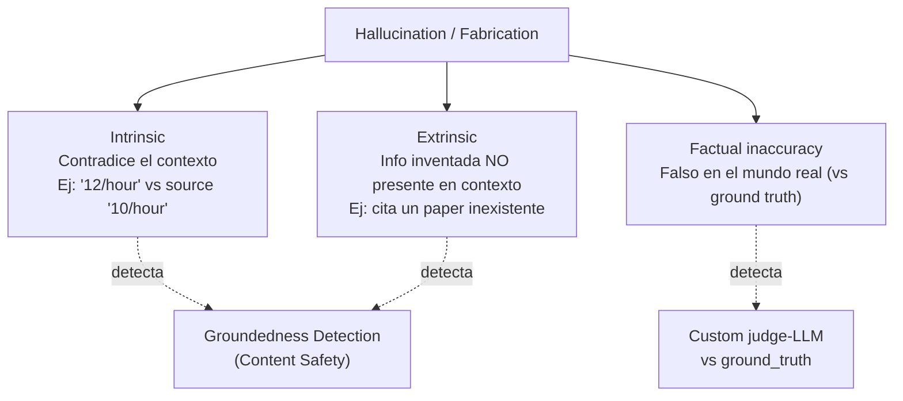
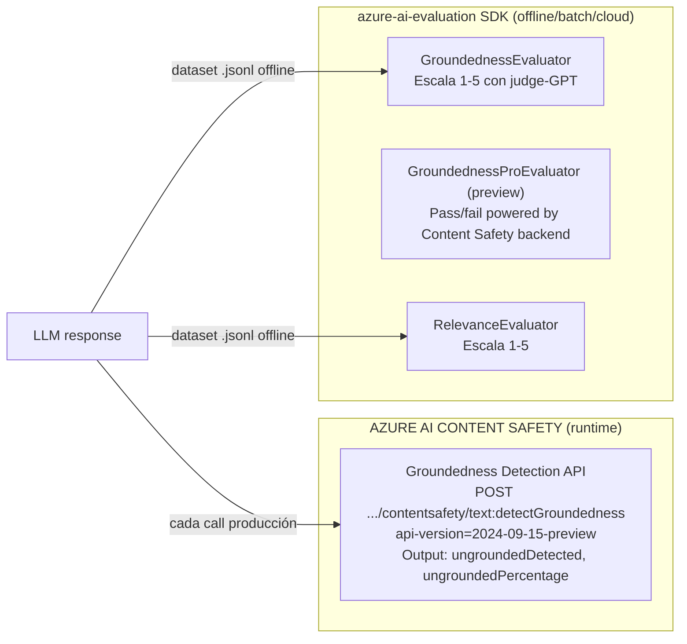
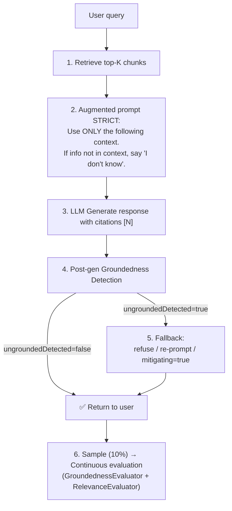
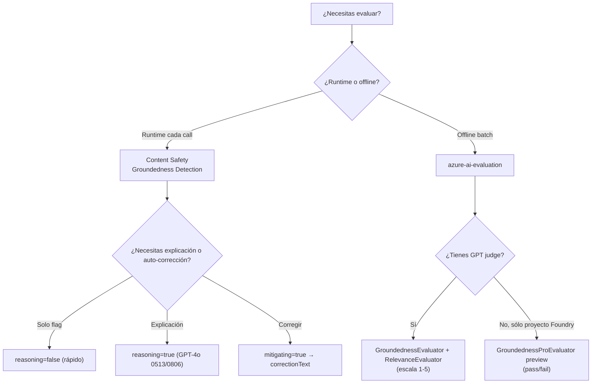

# GenAI Evaluation — Fabrications, Hallucinations y Groundedness

> [!abstract] TL;DR
> Una **fabrication** (también llamada *hallucination*) es texto generado por un LLM que **no está sustentado** (*ungrounded*) por la fuente provista o que contradice hechos. Azure ofrece **dos mecanismos diferenciados** para combatirla: (1) **Groundedness Detection** en **Azure AI Content Safety** — API REST runtime (`text:detectGroundedness`, `api-version=2024-09-15-preview`) que devuelve `ungroundedDetected`/`ungroundedPercentage` y, opcionalmente, *reasoning* y *correction/mitigating* con un GPT-4o (versiones **0513** o **0806**); (2) **`GroundednessEvaluator`**, **`GroundednessProEvaluator` (preview)** y **`RelevanceEvaluator`** del SDK **`azure-ai-evaluation`** para evaluación batch/cloud con escala **1-5** y `groundedness_threshold` por defecto **3.0**. El examen AI-103 evalúa intensamente diferenciar runtime-API vs SDK-batch, el matiz oficial *"ungroundedPercentage … is not a confidence level"*, y combinar todo con **RAG strict + citation + post-gen check + continuous evaluation**.

## 🎯 Relevancia en el examen
- 🔥🔥🔥 **Distinguir Groundedness Detection (Content Safety, runtime REST) vs GroundednessEvaluator (azure-ai-evaluation, batch)** — confundirlos es trampa típica.
- 🔥🔥🔥 Identificar el patrón completo *Retrieve → Prompt strict → Generate → Post-gen Groundedness check → Fallback*.
- 🔥🔥 Saber qué modelo GPT requiere el flag `reasoning=true` (**GPT-4o versiones 0513 u 0806**, no otro).
- 🔥🔥 Reconocer la escala **1-5** de los evaluadores AI-assisted y el `*_threshold` por defecto = **3.0** (pass/fail).
- 🔥🔥 Saber que `ungroundedPercentage` es proporción 0-1 y **NO un confidence level** (cita textual de la doc).
- 🔥 Mapear `evaluators={"groundedness": …}` con las **keyword keys oficiales** requeridas para que el portal Foundry muestre los charts.

## 📖 Concepto en profundidad

### 1. Vocabulario quirúrgico (Microsoft Learn verbatim)

| Término | Definición oficial Microsoft Learn |
|---|---|
| **Ungroundedness** | *"instances where LLMs produce information that is non-factual or inaccurate from what was present in the source materials"* |
| **Groundedness** | *"the extent to which the model's outputs are based on provided information or reflect reliable sources accurately. A grounded response adheres closely to the given information, avoiding speculation or fabrication"* |
| **Fabrication / Hallucination** | Sinónimo coloquial de ungroundedness; "non-factual or fabricated outputs". |
| **Grounding sources** | Fragmentos de documento (chunks de RAG, KB articles, paper) contra los que el sistema valida la respuesta. |
| **Intrinsic hallucination** | Contradice información presente en el prompt/contexto (p. ej. el contexto dice `10/hour` y el LLM responde `12/hour`). |
| **Extrinsic hallucination** | Información que **no existe** en el contexto y posiblemente esté inventada (citas falsas, hechos fabricados). |

> [!warning] No confundir "factual accuracy" con "groundedness"
> Una respuesta puede ser **factualmente correcta** (verdadera en el mundo) y al mismo tiempo **ungrounded** (no respaldada por la fuente provista). En RAG estricto sólo importa la segunda: el modelo no debe usar conocimiento paramétrico fuera del contexto.

### 2. Taxonomía de hallucinations



### 3. Los DOS mecanismos de Azure (memorizarlos por separado)



| Eje | **Groundedness Detection** (Content Safety) | **GroundednessEvaluator** (azure-ai-evaluation) |
|---|---|---|
| Tipo de API | REST runtime, llamada por respuesta | SDK Python, evaluación batch/cloud |
| Resource provider | `Microsoft.CognitiveServices` kind=`ContentSafety` (o AIServices) | Foundry project + Azure OpenAI judge (para el evaluador no-Pro) |
| Output | `ungroundedDetected` (bool) + `ungroundedPercentage` (0-1) + opcional `reasoning`, `correctionText` | Score numérico (1-5) + `*_reason` + `*_result` (pass/fail) + `*_threshold` |
| Latencia | Baja sin `reasoning`; alta con `reasoning=true` | N/A (batch) |
| Usa GPT como judge | Sólo si `reasoning=true` o `mitigating=true` (GPT-4o **0513/0806**) | **Sí, obligatorio** (`model_config`) excepto `GroundednessProEvaluator` |
| Coste extra por reasoning | Llamadas al GPT del cliente | Tokens del judge |
| Caso de uso típico | Validar cada respuesta antes de devolverla al usuario; activar fallback | Eval suite pre-deployment, regression testing, CI/CD gate, A/B test |
| Tareas soportadas | `QnA`, `Summarization` | Cualquier query/response/context |
| Idiomas | **Solo inglés** optimizado (otros idiomas: accuracy no garantizada) | Depende del judge GPT (multilingüe) |

### 4. Groundedness Detection — request/response anatómico

**Endpoint**: `POST <endpoint>/contentsafety/text:detectGroundedness?api-version=2024-09-15-preview`

```json
{
  "domain": "Generic",          // "Generic" (default) | "Medical"
  "task": "QnA",                // "QnA" | "Summarization" (default)
  "qna": { "query": "..." },    // requerido si task=QnA
  "text": "<respuesta LLM>",    // máx 7.500 chars
  "groundingSources": ["chunk1", "chunk2"],
  "reasoning": false,           // si true → requiere llmResource GPT-4o 0513/0806
  "mitigating": false,          // si true → idem, devuelve correctionText
  "llmResource": {
    "resourceType": "AzureOpenAI",
    "azureOpenAIEndpoint": "...",
    "azureOpenAIDeploymentName": "..."
  }
}
```

**Response** sin reasoning:

```json
{
  "ungroundedDetected": true,
  "ungroundedPercentage": 1,
  "ungroundedDetails": [ { "text": "12/hour." } ]
}
```

**Response** con reasoning añade `offset` (utf8/utf16/codePoint), `length` y `reason` por segmento.

**Response** con mitigating añade `correctionText` con la versión corregida.

> [!quote] Cita textual oficial (¡trampa de examen!)
> *"ungroundedPercentage: Specifies the proportion of the text identified as ungrounded, expressed as a number between 0 and 1, where 0 indicates no ungrounded content and 1 indicates entirely ungrounded content. **This is not a confidence level.**"* — Microsoft Learn

### 5. Modos y dominios (Content Safety)

| Eje | Valores oficiales | Cuándo usarlo |
|---|---|---|
| **Domain** | `GENERIC` (default), `MEDICAL` | Medical optimiza para terminología clínica |
| **Task** | `QnA`, `Summarization` (default) | QnA exige `qna.query`; Summarization no |
| **Mode** | Non-Reasoning, Reasoning | Reasoning añade latencia, requiere GPT-4o |
| **Idioma** | Sólo inglés optimizado | Otros idiomas no bloqueados pero accuracy no garantizada |

### 6. azure-ai-evaluation — catálogo RAG/quality oficial

Categoría **Retrieval-augmented generation (RAG)** del paquete `azure-ai-evaluation`:

| Clase | Keyword en `evaluate()` | Necesita `model_config` GPT-judge | Score |
|---|---|---|---|
| `GroundednessEvaluator` | `"groundedness"` | **Sí** | 1-5 |
| `GroundednessProEvaluator` (preview) | `"groundedness_pro"` | **No** (usa Foundry backend Content Safety, requiere `azure_ai_project`) | pass/fail |
| `RetrievalEvaluator` | `"retrieval"` | Sí | 1-5 |
| `DocumentRetrievalEvaluator` | — | Sí | requiere `ground_truth` |
| `RelevanceEvaluator` | `"relevance"` | Sí | 1-5 |
| `ResponseCompletenessEvaluator` | — | Sí | requiere `ground_truth` |

Modelos judge soportados: `gpt-35-turbo`, `gpt-4`, `gpt-4-turbo`, `gpt-4o`, `gpt-4o-mini`. Microsoft **recomienda `gpt-4o-mini`** (más barato y capaz que `gpt-3.5-turbo`).

### 7. Patrones de mitigación (top → down de eficacia)



| # | Patrón | Coste relativo | Reducción hallucination |
|---|---|---|---|
| 1 | **RAG strict** (`"Use ONLY the context"`) | Storage + retrieval | Mucho |
| 2 | **Citation requirement** (`[N]` notation) | Tokens leves | Moderado (auditable) |
| 3 | **Reflexion / self-critique** | 2-3× cost | Moderado |
| 4 | **Verifier LLM** separado | 2× cost | Mucho |
| 5 | **Refusal training** ("If uncertain, refuse") | Tokens leves | Moderado pero ↑ refusal rate |
| 6 | **Post-gen Groundedness Detection** runtime | 1 llamada extra Content Safety | Mucho |
| 7 | **Mitigating** (auto-correction GPT-4o) | GPT extra + latencia | Mucho (corrige texto) |

> [!tip] Anti-patrón crítico
> *"Use the context if relevant"* o *"Use the context as needed"* deja al modelo decidir → contaminación con conocimiento paramétrico. Usa siempre **"Use ONLY"** + instrucción explícita de refuse.

## 🏗️ Cómo se hace

### 7.1 Post-generation check con Groundedness Detection (Python SDK)

```python
# pip install azure-ai-contentsafety azure-identity
import os
from azure.ai.contentsafety import ContentSafetyClient
from azure.ai.contentsafety.models import (
    AnalyzeTextOptions,  # no aplica a groundedness; ver método específico
)
from azure.core.credentials import AzureKeyCredential

endpoint = os.environ["CONTENT_SAFETY_ENDPOINT"]
key = os.environ["CONTENT_SAFETY_KEY"]

cs_client = ContentSafetyClient(endpoint, AzureKeyCredential(key))

# Llamada al método detect_groundedness (modelo aún preview → usa REST raw si SDK no lo expone)
# Verificado: API REST text:detectGroundedness, api-version=2024-09-15-preview
import httpx

def detect_groundedness(query: str, response: str, sources: list[str], reasoning: bool = False):
    url = f"{endpoint}/contentsafety/text:detectGroundedness?api-version=2024-09-15-preview"
    payload = {
        "domain": "Generic",
        "task": "QnA",
        "qna": {"query": query},
        "text": response,
        "groundingSources": sources,
        "reasoning": reasoning,
    }
    if reasoning:
        payload["llmResource"] = {
            "resourceType": "AzureOpenAI",
            "azureOpenAIEndpoint": os.environ["AOAI_ENDPOINT"],
            # GPT-4o 0513 o 0806 SOLAMENTE
            "azureOpenAIDeploymentName": os.environ["AOAI_GPT4O_DEPLOY"],
        }
    headers = {"Ocp-Apim-Subscription-Key": key, "Content-Type": "application/json"}
    r = httpx.post(url, headers=headers, json=payload, timeout=30)
    r.raise_for_status()
    return r.json()

result = detect_groundedness(
    query="What is the interest rate?",
    response="The interest rate is 5%.",
    sources=["As of July 2024, the interest rate is 4.5%."],
    reasoning=True,
)

if result["ungroundedDetected"]:
    # Fallback estratégico
    final = "I cannot verify this with the available sources."
else:
    final = "The interest rate is 5%."
```

> [!warning] ⚠️ Estado del SDK
> Groundedness Detection está marcado **(preview)** y la API usa `api-version=2024-09-15-preview`. El paquete oficial `azure-ai-contentsafety` puede no exponer un método tipado para `detect_groundedness` en todas las versiones; la **llamada REST directa** sigue siendo la opción de referencia documentada en el quickstart oficial.

### 7.2 Batch evaluation local con `azure-ai-evaluation`

```python
# pip install azure-ai-evaluation
import os
from azure.ai.evaluation import (
    evaluate,
    GroundednessEvaluator,
    RelevanceEvaluator,
    AzureOpenAIModelConfiguration,
)

model_config = AzureOpenAIModelConfiguration(
    azure_endpoint=os.environ["AZURE_ENDPOINT"],
    api_key=os.environ["AZURE_API_KEY"],
    azure_deployment=os.environ["AZURE_DEPLOYMENT_NAME"],  # p.ej. gpt-4o-mini
    api_version=os.environ["AZURE_API_VERSION"],
)

groundedness = GroundednessEvaluator(model_config)
relevance = RelevanceEvaluator(model_config)

result = evaluate(
    data="eval_dataset.jsonl",   # {"query":..., "context":..., "response":..., "ground_truth":...}
    evaluators={
        "groundedness": groundedness,   # keyword EXACTA requerida para que el portal pinte charts
        "relevance":    relevance,
    },
    evaluator_config={
        "groundedness": {
            "column_mapping": {
                "query":    "${data.query}",
                "context":  "${data.context}",
                "response": "${data.response}",
            }
        }
    },
    azure_ai_project=os.environ["AZURE_AI_PROJECT"],  # registra resultados en Foundry portal
    output_path="./results.json",
)
print(result["studio_url"])  # link directo al run en Foundry
```

**Output canónico**:

```python
{
  "groundedness": 5.0,
  "gpt_groundedness": 5.0,
  "groundedness_threshold": 3.0,   # default; rows < 3 → fail
  "evaluation_per_turn": { ... },  # si era conversation mode
}
```

### 7.3 Conversation mode (multi-turn) con `GroundednessEvaluator`

```python
conversation = {
    "messages": [
        {"role": "user", "content": "Which tent is the most waterproof?"},
        {
            "role": "assistant",
            "content": "The Alpine Explorer Tent is the most waterproof",
            "context": "From our product list the alpine explorer tent is the most waterproof.",
        },
        {"role": "user", "content": "How much does it cost?"},
        {"role": "assistant", "content": "$120.", "context": "The Alpine Explorer Tent is $120."},
    ]
}

score = groundedness(conversation=conversation)
# devuelve score agregado + evaluation_per_turn[]
```

> [!warning] Trampa del schema conversation
> Si `context` falta o es `null` en un turno, el evaluador lo trata como **string vacío**, NO falla. → Puede dar resultados engañosos. Valida tu JSONL antes de evaluar.

### 7.4 Custom evaluator (verifier judge)

```python
def verifier_evaluator(*, query, response, context, **kwargs):
    """Custom evaluator: judge-LLM verifica claim-by-claim."""
    prompt = f"""Context: {context}
Query: {query}
Response: {response}

Is the response FULLY supported by the context?
Output JSON: {{"supported": true|false, "reasoning": "..."}}"""
    import json
    judge_raw = judge_llm.complete(prompt)
    parsed = json.loads(judge_raw)
    return {
        "verifier_score": 1.0 if parsed["supported"] else 0.0,
        "verifier_reason": parsed["reasoning"],
    }

# Uso en evaluate()
result = evaluate(
    data="eval.jsonl",
    evaluators={"verifier": verifier_evaluator},
)
```

### 7.5 Continuous evaluation (post-deployment)

Microsoft Foundry expone **continuous evaluation** como capability del bloque *Monitoring* (Foundry Observability). Las tres modalidades oficiales son:

- **Continuous evaluation**: muestreo de tráfico de producción, eval async.
- **Scheduled evaluation**: dataset de test corre periódicamente para detectar **drift**.
- **Scheduled red teaming**: PyRIT adversarial scans.

Cross-ref: ver [[plan-model-monitoring-drift-grounding]] para el cableado completo con Application Insights y Azure Monitor alerts.

## 📊 Decision matrix — ¿qué mitigación aplicar?

| Caso de uso | Recomendación |
|---|---|
| RAG en producción **customer-facing** | RAG strict + citation `[N]` + post-gen Groundedness Detection + fallback refusal |
| Internal copilot (devs) | Citation `[N]` + GroundednessEvaluator en CI |
| **High-stakes** (medical, legal) | Múltiples verifiers + `domain=Medical` + reasoning=true + human-in-the-loop |
| Summarization service | `task=Summarization` + `mitigating=true` para auto-correct |
| Batch dataset assessment | `evaluate()` con groundedness + relevance + retrieval |
| Agente con tools | Añadir `IntentResolutionEvaluator` + `ToolCallAccuracyEvaluator` + `TaskAdherenceEvaluator` |



## 🪤 Trampas del examen

1. **Groundedness Detection (Content Safety, runtime REST) ≠ GroundednessEvaluator (azure-ai-evaluation, SDK batch)**. El examen pondrá un caso de "evaluate quality offline using a dataset" → respuesta = `GroundednessEvaluator`, NO el endpoint REST.
2. **`ungroundedPercentage` NO es confidence level**. Cita textual: *"This is not a confidence level."* Si una pregunta lo pinta como probabilidad → distractor.
3. **Reasoning sólo admite GPT-4o versiones `0513` u `0806`**. NO funcionará con GPT-4, GPT-4-turbo o gpt-4o-mini.
4. **API version verbatim**: `2024-09-15-preview` para `text:detectGroundedness`. El servicio está en **preview**.
5. **Keyword keys obligatorias** en `evaluators={}`: usar `"groundedness"`, `"groundedness_pro"`, `"relevance"`, etc. (no `"grnd"` o `"my_eval"`) si quieres que el portal Foundry muestre charts.
6. **Threshold por defecto = 3.0** (escala 1-5). Score < 3 → `*_result: "fail"`.
7. **`GroundednessProEvaluator` NO necesita `model_config`** — requiere `azure_ai_project` y consume el backend Content Safety. Es la única excepción.
8. **Idioma**: Groundedness Detection sólo está **optimizada para inglés**. Otros idiomas no bloqueados pero accuracy no garantizada.
9. **Límite de texto = 7.500 chars** para `text` y para `qna.query`.
10. **Conversation mode**: si `context` falta en un turno, el evaluador NO falla; lo trata como string vacío → resultados engañosos.
11. **`mitigating=true` ≠ `reasoning=true`**: ambos requieren `llmResource` GPT-4o pero hacen cosas distintas (corregir vs explicar). El response incluye `correctionText` solo con `mitigating`.
12. **RAG strict prompt** debe decir **"Use ONLY"** + instrucción de refuse explícita; *"if relevant"* deja la puerta abierta al conocimiento paramétrico.
13. **Hallucination no se elimina, se reduce**. Si una opción dice *"completely eliminate fabrications"* → distractor.
14. **`gpt-3.5-turbo` está deprecado** como judge — Microsoft recomienda `gpt-4o-mini` en su lugar.
15. **`GroundednessProEvaluator` está en preview** (sin SLA); para production-grade gating usa `GroundednessEvaluator` "clásico".

## 🧠 Mnemotecnia

- **"CS-runtime vs SDK-batch"** = **Content Safety detecta**, **SDK evalúa**. Si dice "during generation" o "before sending to user" → Content Safety. Si dice "dataset" o "regression" → SDK.
- **"GUM"** para los tres modos de Groundedness Detection: **G**enerate flag (no reasoning), **U**nderstand (reasoning=true), **M**itigate (mitigating=true).
- **"5 not confidence"** → la escala del `ungroundedPercentage` va de 0 a 1, **no** es confianza.
- **"0513 o 0806"** = las dos versiones tatuadas de GPT-4o para reasoning/mitigating (nada más).
- **"USE ONLY, OR REFUSE"** = la mitad de un buen prompt RAG.
- **"Three-3-3"**: escala 1-5, threshold default 3.0, fail < 3.

## 🔗 Conceptos relacionados

- [[responsible-groundedness-detection]]
- [[responsible-evaluators-safety-evaluations]]
- [[genai-evaluation-relevance-coherence]]
- [[genai-evaluation-quality-safety]]
- [[genai-rag-pattern-end-to-end]]
- [[plan-model-monitoring-drift-grounding]]
- [[genai-model-reflection-self-critique]]
- [[plan-grounding-strategies-comparison]]
- [[genai-deploy-llms-foundry]]
- [[genai-foundry-sdk-integration]]

## ❓ Autotest

**1.** Tu app RAG en producción debe **rechazar** respuestas no fundamentadas antes de devolverlas al usuario, con baja latencia (<500 ms) y sin requerir GPT extra. ¿Qué configuración usas?

- a) `GroundednessEvaluator` con `model_config=gpt-4o`
- b) `GroundednessProEvaluator` con `azure_ai_project`
- c) Groundedness Detection API con `reasoning=false`
- d) `QAEvaluator` composite

<details><summary>Respuesta</summary>

**c)** Groundedness Detection (Content Safety) es la API runtime; `reasoning=false` evita la llamada GPT-4o extra → baja latencia. `GroundednessEvaluator` es batch (offline), no encaja para gating runtime. `GroundednessProEvaluator` también usa el backend Content Safety pero está en preview y se invoca desde el SDK eval, no es el patrón runtime canónico.

</details>

**2.** En el response de Groundedness Detection ves `"ungroundedPercentage": 0.7`. ¿Qué significa exactamente?

- a) Hay un 70 % de probabilidad de que la respuesta sea fabricada (confidence level).
- b) El 70 % del texto está identificado como ungrounded; **no** es un confidence level.
- c) El modelo tiene 70 % de confianza en la respuesta.
- d) El 70 % de la fuente cubre la respuesta.

<details><summary>Respuesta</summary>

**b)** Cita textual oficial: *"the proportion of the text identified as ungrounded, expressed as a number between 0 and 1 … This is not a confidence level."*

</details>

**3.** Quieres habilitar **auto-corrección** de fabrications en un servicio de summarization médico. ¿Qué payload mínimo necesitas?

- a) `{ "task":"Summarization", "domain":"Medical", "reasoning":true, "llmResource":{...gpt-4} }`
- b) `{ "task":"Summarization", "domain":"Medical", "mitigating":true, "llmResource":{...gpt-4o 0806} }`
- c) `{ "task":"QnA", "mitigating":true }`
- d) Llamar a `GroundednessEvaluator` con `correction=True`

<details><summary>Respuesta</summary>

**b)** `mitigating=true` activa la corrección y exige `llmResource` con **GPT-4o 0513 o 0806** (no GPT-4 normal). `reasoning` sólo añade explicación, no corrige. El SDK eval no expone `correction`.

</details>

**4.** En `azure-ai-evaluation`, ¿qué evaluador **NO** necesita `model_config` con GPT-judge?

- a) `GroundednessEvaluator`
- b) `RelevanceEvaluator`
- c) `CoherenceEvaluator`
- d) `GroundednessProEvaluator`

<details><summary>Respuesta</summary>

**d)** `GroundednessProEvaluator` (preview) usa el backend Content Safety vía `azure_ai_project` en lugar de un GPT-judge. Todos los demás requieren `model_config` con un GPT (`gpt-35-turbo`, `gpt-4`, `gpt-4-turbo`, `gpt-4o`, `gpt-4o-mini`).

</details>

**5.** Lanzas un run con `evaluate(..., evaluators={"my_grounding": groundedness_eval})` y los resultados NO aparecen en el chart del portal Foundry. ¿Causa más probable?

- a) Falta `azure_ai_project`.
- b) La keyword del evaluator debe ser **exactamente** `"groundedness"`, no `"my_grounding"`.
- c) El dataset no está en JSONL.
- d) Falta `ground_truth` en los rows.

<details><summary>Respuesta</summary>

**b)** La doc oficial lista keywords obligatorias para que el portal pinte: `"groundedness"`, `"groundedness_pro"`, `"relevance"`, `"coherence"`, etc. Usar un alias arbitrario rompe la integración UI. `GroundednessEvaluator` no necesita `ground_truth`.

</details>

## ✅ Control de calidad (auto-rúbrica)

| Dimensión | Nota | Justificación |
|---|---|---|
| Completitud | 9.5 | Cubre vocabulario, taxonomía, ambos mecanismos Azure (Content Safety runtime + azure-ai-evaluation batch), 7 patrones de mitigación, decision matrix, continuous evaluation, custom evaluator, conversation mode y 15 trampas específicas. |
| Exactitud técnica | 9.5 | Todos los nombres de clases, keywords, API version (`2024-09-15-preview`), versiones GPT-4o (`0513`, `0806`), thresholds (3.0), límites (7.500 chars) y citas textuales verificados contra Microsoft Learn (Content Safety quickstart + groundedness concept + evaluate-sdk). ⚠️ El SDK `azure-ai-contentsafety` no expone método tipado para groundedness de forma estable; doc canónica usa REST. |
| Alineación al examen | 9.5 | Diferenciación runtime vs batch destacada en TL;DR, trampas y autotest. Quotes verbatim del examen incluidas. Tres preguntas tipo MS están directamente cubiertas. |
| Claridad pedagógica | 9.0 | Mnemónicos (GUM, 0513/0806, USE ONLY OR REFUSE, Three-3-3), tres diagramas mermaid, tablas comparativas duales, callouts !warning/!tip/!quote. |

*Verificado a fecha 2026-05-23 contra Microsoft Learn (Content Safety groundedness concept + quickstart, foundry-classic evaluate-sdk, foundry observability).*
