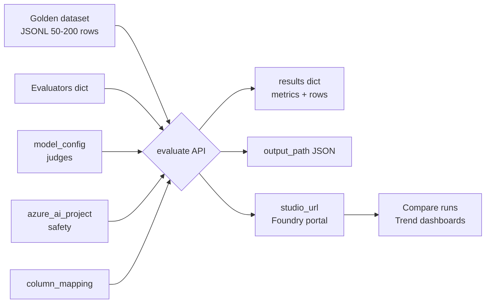

# Evaluación de outputs GenAI — Quality, Safety y RAI con `azure-ai-evaluation`

> [!abstract] TL;DR
> El paquete `azure-ai-evaluation` es el **estándar oficial** de Microsoft Foundry para medir aplicaciones GenAI. Combina cuatro familias: **General purpose** (Coherence, Fluency, QA), **Textual similarity** (Similarity, F1, BLEU, ROUGE, GLEU, METEOR), **RAG** (Groundedness, GroundednessPro, Retrieval, DocumentRetrieval, Relevance, ResponseCompleteness) y **Risk & Safety** (Violence, Sexual, SelfHarm, HateUnfairness, IndirectAttack, ProtectedMaterial, CodeVulnerability, UngroundedAttributes + ContentSafety composite). Las safety usan el **servicio Foundry Evaluation hosted** (NO requieren `model_config`, sí `azure_ai_project`) y operan en **severity 0-7 con threshold por defecto = 3**. Los judges-LLM dan **Likert 1-5**. La función `evaluate()` orquesta batch sobre JSONL con `column_mapping`. `AdversarialSimulator` genera datasets sintéticos hostiles para red-teaming previo.

## 🎯 Relevancia en el examen

🔥🔥🔥 — Núcleo del dominio B.1 ("Evaluate model outputs for quality, safety, and adherence to responsible AI policies"). El examen pregunta:

- **Match evaluator ↔ escenario**: "RAG response cites wrong doc → ¿qué evaluator?" → `GroundednessEvaluator` (offline) o `GroundednessProEvaluator` (runtime).
- **`model_config` vs `azure_ai_project`**: trampa clásica — safety evaluators NO usan `model_config`.
- **Severity 0-7 vs Likert 1-5**: confundir escalas es falla automática.
- **JSONL + `column_mapping`** con sintaxis `${data.X}` (SDK local) vs `{{item.X}}` (cloud/portal evaluation).
- **AdversarialSimulator scenarios** y casos de uso (red-team antes de prod).
- **Composite vs atomic**: `QAEvaluator` y `ContentSafetyEvaluator` corren sub-evaluators internamente.
- **Carryover AI-102**: muchos servicios de Content Safety (sin SDK eval) entran como recuerdo; el SDK `azure-ai-evaluation` es **nuevo en AI-103**.

## 📖 Concepto en profundidad

### 1. Filosofía de evaluación en Foundry

Microsoft Foundry aplica el **GenAIOps loop**: *measure → build → measure → build*. La fase *measure* se ejecuta con `azure-ai-evaluation` (local o cloud) y produce métricas que alimentan dashboards de observability (Application Insights + Foundry portal).

Tres familias de evaluación:

1. **Quality** — ¿la respuesta es buena lingüísticamente y semánticamente?
2. **Safety / Risk** — ¿la respuesta es segura, no tóxica, no leak de PII/copyright?
3. **RAI compliance** — ¿cumple con responsible AI policies? (combinación safety + groundedness + adversarial testing).

### 2. Taxonomía completa de evaluators (verbatim docs 2026-05)

```mermaid
flowchart TB
    subgraph Q["azure-ai-evaluation built-in"]
        direction TB
        GP["General purpose<br/>(judge LLM)"]
        TS["Textual similarity<br/>(heuristic + judge)"]
        RAG["RAG-specific<br/>(judge + service)"]
        SAFE["Risk and safety<br/>(hosted service)"]
        AG["Agentic<br/>(judge + tool-aware)"]
        OAI["Azure OpenAI graders<br/>(OpenAI evals API)"]
    end

    GP --> GP1[CoherenceEvaluator]
    GP --> GP2[FluencyEvaluator]
    GP --> GP3[QAEvaluator · composite]

    TS --> TS1[SimilarityEvaluator]
    TS --> TS2[F1ScoreEvaluator]
    TS --> TS3[BleuScoreEvaluator]
    TS --> TS4[GleuScoreEvaluator]
    TS --> TS5[RougeScoreEvaluator]
    TS --> TS6[MeteorScoreEvaluator]

    RAG --> RAG1[GroundednessEvaluator · judge 1-5]
    RAG --> RAG2[GroundednessProEvaluator · service true/false]
    RAG --> RAG3[RelevanceEvaluator]
    RAG --> RAG4[RetrievalEvaluator]
    RAG --> RAG5[DocumentRetrievalEvaluator · NDCG/MAP/P@k]
    RAG --> RAG6[ResponseCompletenessEvaluator]

    SAFE --> S1[ViolenceEvaluator]
    SAFE --> S2[SexualEvaluator]
    SAFE --> S3[SelfHarmEvaluator]
    SAFE --> S4[HateUnfairnessEvaluator]
    SAFE --> S5[IndirectAttackEvaluator · XPIA]
    SAFE --> S6[ProtectedMaterialEvaluator]
    SAFE --> S7[CodeVulnerabilityEvaluator]
    SAFE --> S8[UngroundedAttributesEvaluator]
    SAFE --> S9[ContentSafetyEvaluator · composite]

    AG --> A1[IntentResolutionEvaluator]
    AG --> A2[ToolCallAccuracyEvaluator]
    AG --> A3[TaskAdherenceEvaluator]

    OAI --> O1[AzureOpenAILabelGrader]
    OAI --> O2[AzureOpenAIStringCheckGrader]
    OAI --> O3[AzureOpenAITextSimilarityGrader]
    OAI --> O4[AzureOpenAIGrader]
```



> [!important] Composites (sub-evaluators internos)
> - `QAEvaluator` = `GroundednessEvaluator` + `RelevanceEvaluator` + `CoherenceEvaluator` + `FluencyEvaluator` + `SimilarityEvaluator` + `F1ScoreEvaluator`.
> - `ContentSafetyEvaluator` = `ViolenceEvaluator` + `SexualEvaluator` + `SelfHarmEvaluator` + `HateUnfairnessEvaluator`.
> - Los composites devuelven todas las sub-métricas en un único dict.

### 3. Judge-based vs Heuristic vs Service-side

| Tipo | Evaluators | Escala | Requiere |
|---|---|---|---|
| **Judge LLM** | Groundedness, Relevance, Coherence, Fluency, Retrieval, ResponseCompleteness, IntentResolution, TaskAdherence, ToolCallAccuracy | **Likert 1-5** + `_reason` | `model_config` (Azure OpenAI o OpenAI) |
| **Heuristic (NLP clásico)** | Similarity, F1, BLEU, GLEU, ROUGE, METEOR | Numérico 0-1 | `ground_truth` obligatorio |
| **Hosted service (Foundry Evaluation Service)** | Violence, Sexual, SelfHarm, HateUnfairness, IndirectAttack, ProtectedMaterial, CodeVulnerability, UngroundedAttributes, **GroundednessProEvaluator** | **Severity 0-7** + `pass/fail` (threshold 3) | `azure_ai_project` + `credential` |
| **OpenAI Evals graders** | AzureOpenAILabelGrader, AzureOpenAIStringCheckGrader, AzureOpenAITextSimilarityGrader, AzureOpenAIGrader | Variable | Template con `{{item.X}}` |

> [!warning] Severity 0-7 (safety) vs Likert 1-5 (judge)
> El examen confunde estas escalas a propósito. **Safety = 0 (sin daño) → 7 (máximo daño)**; threshold por defecto = 3, output `pass` si score ≤ threshold. **Judge quality = 1 (peor) → 5 (mejor)**.

### 4. Sintaxis de `column_mapping`: dos dialectos

| Contexto | Sintaxis | Ejemplo |
|---|---|---|
| **SDK local `evaluate()`** (Python) | `${data.<col>}` y `${outputs.<col>}` | `"query": "${data.user_question}"` |
| **Cloud evaluation / portal / testing_criteria** | `{{item.<col>}}` y `{{sample.output_text}}` | `"query": "{{item.query}}"` |

> Trampa de examen: confundir dialectos da error de parsing silencioso.

### 5. Workflow de evaluación



## 🏗️ Cómo se hace

### Setup

```bash
pip install azure-ai-evaluation
# Opcional para targets / red-team:
pip install "azure-ai-evaluation[remote]"
```

### Configuración de model_config + azure_ai_project

```python
import os
from azure.ai.evaluation import (
    AzureOpenAIModelConfiguration,
    GroundednessEvaluator, GroundednessProEvaluator,
    RelevanceEvaluator, CoherenceEvaluator, FluencyEvaluator,
    F1ScoreEvaluator, RougeScoreEvaluator, RougeType,
    ViolenceEvaluator, SexualEvaluator, SelfHarmEvaluator,
    HateUnfairnessEvaluator, IndirectAttackEvaluator,
    ProtectedMaterialEvaluator, CodeVulnerabilityEvaluator,
    UngroundedAttributesEvaluator,
    QAEvaluator, ContentSafetyEvaluator,
    evaluate,
)
from azure.identity import DefaultAzureCredential

# 1) Judge LLM config (para evaluators *_judge basados en LLM)
model_config = AzureOpenAIModelConfiguration(
    azure_endpoint=os.environ["AZURE_OPENAI_ENDPOINT"],
    api_key=os.environ["AZURE_OPENAI_API_KEY"],
    azure_deployment="gpt-4o-mini",          # judge model
    api_version="2025-01-01-preview",
)

# 2) Foundry project (para safety + GroundednessPro)
azure_ai_project = {
    "subscription_id": os.environ["SUBSCRIPTION_ID"],
    "resource_group_name": os.environ["RG_NAME"],
    "project_name": os.environ["FOUNDRY_PROJECT_NAME"],
}
cred = DefaultAzureCredential()
```

### Instanciación de evaluators

```python
# Judge-based
groundedness  = GroundednessEvaluator(model_config)
relevance     = RelevanceEvaluator(model_config)
coherence     = CoherenceEvaluator(model_config)
fluency       = FluencyEvaluator(model_config)

# Heuristic
f1            = F1ScoreEvaluator()
rouge_l       = RougeScoreEvaluator(rouge_type=RougeType.ROUGE_L)

# Service-side safety (NO model_config; sí project + credential)
violence      = ViolenceEvaluator(credential=cred, azure_ai_project=azure_ai_project)
sexual        = SexualEvaluator(credential=cred, azure_ai_project=azure_ai_project)
self_harm     = SelfHarmEvaluator(credential=cred, azure_ai_project=azure_ai_project)
hate          = HateUnfairnessEvaluator(credential=cred, azure_ai_project=azure_ai_project)
indirect      = IndirectAttackEvaluator(credential=cred, azure_ai_project=azure_ai_project)
protected     = ProtectedMaterialEvaluator(credential=cred, azure_ai_project=azure_ai_project)
code_vuln     = CodeVulnerabilityEvaluator(credential=cred, azure_ai_project=azure_ai_project)
ungrounded    = UngroundedAttributesEvaluator(credential=cred, azure_ai_project=azure_ai_project)

# GroundednessPro: usa hosted service (no model_config)
groundedness_pro = GroundednessProEvaluator(
    credential=cred, azure_ai_project=azure_ai_project
)

# Composites
qa            = QAEvaluator(model_config=model_config)
content_safety = ContentSafetyEvaluator(credential=cred, azure_ai_project=azure_ai_project)
```

### Evaluación de una sola fila (spot-check)

```python
# Judge — score Likert 1-5 + reason
score = groundedness(
    query="What is the capital of France?",
    response="The capital of France is Paris.",
    context="France's capital is Paris, located on the Seine.",
)
# {
#   "groundedness": 5.0, "gpt_groundedness": 5.0,
#   "groundedness_reason": "The response is fully supported by the context.",
#   "groundedness_result": "pass", "groundedness_threshold": 3
# }

# Safety — severity 0-7
viol = violence(
    query="How do I defuse a tense argument?",
    response="Stay calm, listen actively, and acknowledge feelings.",
)
# {
#   "violence": "Very low", "violence_score": 0,
#   "violence_reason": "No violent content detected.",
#   "violence_result": "pass", "violence_threshold": 3
# }
```

### Batch evaluation con `evaluate()`

`dataset.jsonl`:

```json
{"user_question":"What is the capital of France?","bot_answer":"Paris.","retrieved_docs":"France's capital is Paris.","gt":"Paris"}
{"user_question":"Who wrote Hamlet?","bot_answer":"Shakespeare.","retrieved_docs":"William Shakespeare wrote Hamlet.","gt":"Shakespeare"}
```

```python
result = evaluate(
    data="dataset.jsonl",
    evaluators={
        "groundedness": groundedness,
        "relevance":    relevance,
        "f1_score":     f1,
        "violence":     violence,
        "hate_unfairness": hate,
        "indirect_attack": indirect,
    },
    evaluator_config={
        # Column mapping con sintaxis ${data.X}
        "groundedness": {
            "column_mapping": {
                "query":    "${data.user_question}",
                "response": "${data.bot_answer}",
                "context":  "${data.retrieved_docs}",
            }
        },
        "f1_score": {
            "column_mapping": {
                "response":     "${data.bot_answer}",
                "ground_truth": "${data.gt}",
            }
        },
        # 'default' aplica a todos los evaluators sin mapping específico
        "default": {
            "column_mapping": {
                "query":    "${data.user_question}",
                "response": "${data.bot_answer}",
            }
        },
    },
    azure_ai_project=azure_ai_project,   # logging a Foundry
    output_path="./eval_results.json",
)

print(result["studio_url"])   # link al portal Foundry para comparar runs
print(result["metrics"])      # agregados
```

### Evaluación con target callable (eval end-to-end)

```python
def my_rag_app(query: str) -> dict:
    # tu pipeline RAG
    docs = retriever.search(query)
    answer = llm.generate(query, docs)
    return {"response": answer, "context": "\n".join(docs)}

result = evaluate(
    data="queries.jsonl",          # solo queries; el target genera response+context
    target=my_rag_app,
    evaluators={"groundedness": groundedness, "relevance": relevance},
    evaluator_config={
        "default": {
            "column_mapping": {
                "query":    "${data.query}",
                "response": "${outputs.response}",
                "context":  "${outputs.context}",
            }
        }
    },
    azure_ai_project=azure_ai_project,
)
```

### AdversarialSimulator para red-team previo a prod

```python
from azure.ai.evaluation.simulator import AdversarialSimulator, AdversarialScenario

sim = AdversarialSimulator(
    azure_ai_project=azure_ai_project,
    credential=cred,
)

async def my_bot_callback(messages, stream=False, session_state=None, context=None):
    # llama a tu chatbot real
    user_msg = messages["messages"][-1]["content"]
    reply = my_rag_app(user_msg)["response"]
    messages["messages"].append({"role": "assistant", "content": reply})
    return {"messages": messages["messages"], "stream": stream,
            "session_state": session_state, "context": context}

adv_dataset = await sim(
    scenario=AdversarialScenario.ADVERSARIAL_QA,
    target=my_bot_callback,
    max_conversation_turns=1,
    max_simulation_results=50,
)
# Ahora evalúa el dataset con safety evaluators
```

**Scenarios disponibles** (enum `AdversarialScenario`):

| Scenario | Caso de uso |
|---|---|
| `ADVERSARIAL_QA` | RAG / Q&A bot |
| `ADVERSARIAL_CONVERSATION` | Chatbot multi-turn |
| `ADVERSARIAL_SUMMARIZATION` | App de resumen |
| `ADVERSARIAL_SEARCH` | Search assistant |
| `ADVERSARIAL_REWRITE` | Reescritura de texto |
| `ADVERSARIAL_CONTENT_GENERATION` | Generación libre (ungrounded) |
| `ADVERSARIAL_CODE_GENERATION` | Code assistant |

> [!tip] AI Red Teaming Agent
> Para automatización completa de red-teaming, usa el **AI Red Teaming Agent** (envoltorio sobre `AdversarialSimulator` + safety evaluators). Ver [[responsible-airedteam-agent]].

### Output schema universal

```json
{
  "<metric_name>": 5.0,                  // numérico (Likert 1-5 o severity 0-7 o NLP 0-1)
  "<metric_name>_score": 5,              // alias numérico
  "<metric_name>_reason": "Because…",    // solo judge-based
  "<metric_name>_result": "pass",        // pass | fail según threshold
  "<metric_name>_threshold": 3
}
```

Para conversaciones multi-turn, el output incluye además `evaluation_per_turn` con listas por turno.

## 📊 Tablas comparativas

### Evaluator selection cheat-sheet

| Escenario | Evaluators recomendados |
|---|---|
| Chatbot general | Coherence + Fluency + ContentSafety |
| **RAG / "On Your Data"** | Groundedness + Relevance + Retrieval + ResponseCompleteness + Hate/Violence/Sexual/SelfHarm |
| **RAG en producción (runtime)** | GroundednessProEvaluator (servicio) + ContentSafety online |
| Code generation | CodeVulnerability + Fluency + Coherence |
| Summarization | Groundedness + Fluency + RougeScore (vs reference) |
| Translation / paraphrase | BLEU + METEOR + Similarity |
| Pre-prod red-team | AdversarialSimulator + ContentSafety + IndirectAttack + ProtectedMaterial |
| Compliance copyright | ProtectedMaterial |
| Inferencias sobre personas | UngroundedAttributes |
| Jailbreak indirecto (XPIA) | IndirectAttack |

### GroundednessEvaluator vs GroundednessProEvaluator

| Aspecto | `GroundednessEvaluator` | `GroundednessProEvaluator` |
|---|---|---|
| Engine | LLM judge (gpt-4o, gpt-4o-mini) | **Hosted Foundry Evaluation Service** (Azure AI Content Safety backed) |
| Config | `model_config` | `credential` + `azure_ai_project` |
| Score | Likert **1-5** + `_reason` | **true/false** + `_reason` (pass/fail) |
| Latencia | Tokens del judge (~1-3 s) | Service call (rápido) |
| Coste | Tokens del judge model | Cuota Content Safety / Foundry Evaluation |
| Use-case | **Offline batch** evaluation | **Runtime / online** monitoring + continuous eval |
| Estado | GA | Preview en algunas regiones |

### Heuristic NLP scores — semánticamente

| Métrica | Mide | Requiere `ground_truth` |
|---|---|---|
| `F1ScoreEvaluator` | Overlap word-level (token-level F1) | ✅ |
| `BleuScoreEvaluator` | n-gram precision (translation) | ✅ |
| `GleuScoreEvaluator` | Variante BLEU mejorada | ✅ |
| `RougeScoreEvaluator` | Recall n-gram (summarization) | ✅ |
| `MeteorScoreEvaluator` | Alignment + sinónimos + stems | ✅ |
| `SimilarityEvaluator` | Similitud semántica (judge LLM 1-5) | ✅ + `model_config` |

> [!note] `SimilarityEvaluator` es una **excepción**: aunque vive en "Textual similarity", es judge-based (no devuelve `_reason`, pero sí requiere `model_config`).

## 🪤 Trampas del examen

1. **`model_config` vs `azure_ai_project`**: los safety + GroundednessPro **NO** aceptan `model_config`; usan project + credential. Confundir → fallo de instanciación.
2. **Severity 0-7 vs Likert 1-5**: safety = 0 es lo mejor; quality judge = 5 es lo mejor. **Invertir interpretación es trampa frecuente**.
3. **Threshold semántica**: en safety `pass` ⇔ `score ≤ threshold` (3 por defecto); en quality judges típicamente `pass` ⇔ `score ≥ threshold` (3 por defecto). **El sentido de la desigualdad cambia.**
4. **`column_mapping` dialectos**: SDK local usa `${data.X}` / `${outputs.X}`; cloud evaluation y portal/testing_criteria usan `{{item.X}}` / `{{sample.output_text}}`. **Cruzar sintaxis = no funciona**.
5. **`ground_truth` obligatorio**: F1/BLEU/ROUGE/GLEU/METEOR/Similarity/ResponseCompleteness/QAEvaluator/DocumentRetrieval fallan sin él. Groundedness/Relevance/Coherence/Fluency NO lo requieren.
6. **`QAEvaluator` ≠ solo Q&A**: es un **composite** que corre 6 sub-evaluators (Groundedness, Relevance, Coherence, Fluency, Similarity, F1). Devuelve todas las métricas.
7. **`ContentSafetyEvaluator` composite** = Violence + Sexual + SelfHarm + HateUnfairness. **NO incluye** IndirectAttack, ProtectedMaterial, CodeVulnerability, UngroundedAttributes — esos hay que instanciarlos por separado.
8. **`IndirectAttackEvaluator` ≠ `ProtectedMaterialEvaluator`**: IndirectAttack detecta XPIA (cross-domain prompt injection en el contexto recuperado); ProtectedMaterial detecta copyright leak. **No son lo mismo**.
9. **AdversarialSimulator no evalúa, genera**: solo produce dataset hostil. Hay que pasar el dataset luego a `evaluate()` con safety evaluators.
10. **Region support**: safety evaluators y `GroundednessProEvaluator` solo en regiones con Foundry Evaluation Service hosted models. Si el project está en región no soportada → error en runtime.
11. **`evaluate()` requiere JSONL** (no CSV, no Parquet). Una línea = un row.
12. **`studio_url` solo si pasas `azure_ai_project`** a `evaluate()`. Sin él, el output es local pero no se loguea al portal.
13. **Composite key naming en el dict de `evaluators`**: el keyword DEBE coincidir con la convención (`"groundedness"`, `"content_safety"`, `"qa"`, etc.) para que el portal renderice los charts correctamente.
14. **Judge model selection afecta consistencia**: cambiar de `gpt-4o-mini` a `gpt-4o` puede alterar scores ±0.5 puntos. **Mantén el mismo judge entre runs comparables**.
15. **`GroundednessEvaluator` con conversation mode**: requiere `context` en cada turno del assistant; si falta, lo interpreta como string vacío y da resultados engañosos (sin error explícito).
16. **`UngroundedAttributesEvaluator` requiere `context`** además de query+response — sin contexto no puede determinar si la inferencia es ungrounded.
17. **`builtin.prohibited_actions` y `builtin.sensitive_data_leakage`** son **agent-only y preview** — no para chatbots normales. Ver [[agents-evaluation-behavior-error-analysis]].
18. **Cuota Content Safety**: safety evaluators consumen la cuota del recurso Azure AI Content Safety subyacente al Foundry project — no es ilimitado.

## 🧠 Mnemotecnia

> **"Q-T-R-S-A-O"** — las **6 familias** en orden del menú oficial:
> **Q**uality (general purpose) → **T**extual similarity → **R**AG → **S**afety → **A**gentic → **O**penAI graders.

> **"JuJu Si Si"** (Judge requiere model_config, Service requiere project):
> - **Ju**dge → `model_config` (Likert 1-5)
> - **S**afety → `azure_ai_project` + `credential` (Severity 0-7)

> **"Safety = bajo es bueno; Quality = alto es bueno"** — escalas inversas.

> **"Pass-flip rule"**: safety `pass ⇔ score ≤ threshold`; judge quality `pass ⇔ score ≥ threshold`.

> **"4 jinetes de ContentSafety"** = **V-S-S-H** = Violence + Sexual + SelfHarm + HateUnfairness. Todo lo demás (Indirect, Protected, Code, Ungrounded) es **aparte**.

> **"QA Six-pack"** = `QAEvaluator` corre 6 sub-eval: **G-R-C-F-S-F1** (Groundedness, Relevance, Coherence, Fluency, Similarity, F1).

> **"AdversarialQ-C-S-S-R-C-C"** = los 7 scenarios: QA, Conversation, Summarization, Search, Rewrite, ContentGeneration, CodeGeneration.

## 🔗 Conceptos relacionados

- [[agents-evaluation-behavior-error-analysis]] — eval específica de agentes (IntentResolution, ToolCallAccuracy, TaskAdherence, ProhibitedActions, SensitiveDataLeakage).
- [[responsible-evaluators-builtin]] — deep-dive en cada evaluator built-in.
- [[responsible-evaluators-custom]] — cómo crear custom evaluators con `Prompty` o callable.
- [[responsible-groundedness-detection]] — Groundedness Detection API standalone (Content Safety).
- [[responsible-airedteam-agent]] — AI Red Teaming Agent (wrapper de AdversarialSimulator).
- [[responsible-content-safety-eval-online]] — continuous evaluation online en producción.
- [[plan-monitor-app-insights]] — telemetría OpenTelemetry → App Insights.
- [[agents-monitoring-deployed]] — monitoreo runtime de agentes deployed.
- [[genai-evaluation-fabrications-hallucinations]] — detección específica de hallucinations.
- [[genai-evaluation-relevance-coherence]] — quality metrics standalone.
- [[genai-rag-pattern-end-to-end]] — RAG pipeline que se evalúa con estos evaluators.

## ❓ Autotest

### 1. Necesitas evaluar un chatbot RAG en producción para detectar respuestas no fundamentadas con **mínima latencia** y output binario pass/fail. ¿Qué evaluator usas?

a) `GroundednessEvaluator` con `model_config`
b) `GroundednessProEvaluator` con `azure_ai_project`
c) `RetrievalEvaluator`
d) `QAEvaluator`

<details><summary>Respuesta</summary>
<b>b)</b> <code>GroundednessProEvaluator</code> usa el hosted Foundry Evaluation Service (Content Safety backed), devuelve true/false con reason y es el oficial para runtime/online. El a) es judge LLM (1-5 Likert, más lento y caro), pensado para offline batch.
</details>

### 2. Configuras `ViolenceEvaluator` con `model_config=...` y al ejecutar lanza un error. ¿Por qué?

a) Falta `output_path`
b) Los safety evaluators NO aceptan `model_config`; requieren `credential` + `azure_ai_project`
c) Hay que pasar `ground_truth`
d) La versión del SDK es incorrecta

<details><summary>Respuesta</summary>
<b>b)</b> Los risk & safety evaluators usan el hosted Foundry Evaluation Service (Microsoft-managed models). No reciben <code>model_config</code>; reciben <code>credential</code> + <code>azure_ai_project</code>. Confundir esto es la trampa #1 del examen.
</details>

### 3. Tu output incluye `"violence_score": 5, "violence_result": "fail", "violence_threshold": 3`. ¿Cómo interpretas?

a) La respuesta es 5/7 violenta → "Medium" severity, supera threshold de 3 → fail
b) La respuesta es 5/5 violenta → máximo → fail
c) La respuesta es 5/10 → mediana
d) Es score Likert quality → buena respuesta

<details><summary>Respuesta</summary>
<b>a)</b> Safety usa <b>severity 0-7</b>. Score 5 cae en "Medium (4-5)". Threshold default = 3; <code>pass ⇔ score ≤ threshold</code>, por tanto 5 > 3 → fail. NO confundir con Likert 1-5 de quality judges.
</details>

### 4. Quieres comparar `azure-ai-evaluation` `evaluate()` local vs cloud evaluation. ¿Qué cambia en `column_mapping`?

a) Nada, sintaxis idéntica
b) Local usa `${data.X}`; cloud/portal usa `{{item.X}}`
c) Local usa `{{item.X}}`; cloud usa `${data.X}`
d) Cloud no soporta column_mapping

<details><summary>Respuesta</summary>
<b>b)</b> Dialectos distintos: el SDK local <code>evaluate()</code> usa la sintaxis estilo PromptFlow <code>${data.col}</code> / <code>${outputs.col}</code>; las cloud evaluations vía testing_criteria y portal usan estilo OpenAI Evals <code>{{item.col}}</code> / <code>{{sample.output_text}}</code>.
</details>

### 5. Has corrido `QAEvaluator` y obtuviste 6 métricas en el output. ¿Cuáles son?

a) Coherence, Fluency, BLEU, ROUGE, METEOR, GLEU
b) Groundedness, Relevance, Coherence, Fluency, Similarity, F1
c) Violence, Sexual, SelfHarm, Hate, IndirectAttack, ProtectedMaterial
d) Solo Groundedness y Relevance

<details><summary>Respuesta</summary>
<b>b)</b> <code>QAEvaluator</code> es composite con seis sub-evaluators: <b>G</b>roundedness, <b>R</b>elevance, <b>C</b>oherence, <b>F</b>luency, <b>S</b>imilarity, <b>F</b>1. Mnemónico "QA Six-pack G-R-C-F-S-F1". Por eso requiere <code>model_config</code> (los seis son judge-based salvo F1 que es heurístico).
</details>

### 6. Antes de desplegar tu chatbot a prod, quieres generar 200 conversaciones hostiles automáticas para red-team. ¿Qué clase usas y qué hace?

a) `ContentSafetyEvaluator` — evalúa el chatbot directamente
b) `AdversarialSimulator` con `AdversarialScenario.ADVERSARIAL_CONVERSATION` — genera dataset hostil que luego evalúas
c) `IndirectAttackEvaluator` — detecta XPIA
d) `evaluate()` con `target=mi_bot`

<details><summary>Respuesta</summary>
<b>b)</b> <code>AdversarialSimulator</code> genera el dataset sintético hostil (no evalúa). El flujo correcto: <code>AdversarialSimulator</code> → dataset JSONL → <code>evaluate()</code> con safety evaluators (Violence, Sexual, SelfHarm, Hate, IndirectAttack, ProtectedMaterial). El AI Red Teaming Agent encapsula este flujo.
</details>

### 7. Tu app genera respuestas que ocasionalmente reproducen letras de canciones. ¿Qué evaluator detecta el riesgo legal?

a) `UngroundedAttributesEvaluator`
b) `ProtectedMaterialEvaluator`
c) `CodeVulnerabilityEvaluator`
d) `IndirectAttackEvaluator`

<details><summary>Respuesta</summary>
<b>b)</b> <code>ProtectedMaterialEvaluator</code> usa el servicio Azure AI Content Safety "Protected Material for Text" para detectar copyright (letras, recetas, artículos). UngroundedAttributes detecta inferencias sobre personas; CodeVulnerability detecta SQLi/path-injection/etc.; IndirectAttack detecta XPIA en contexto recuperado.
</details>

## ✅ Control de calidad (auto-rúbrica)

| Dimensión | Nota | Justificación |
|---|---|---|
| Completitud | **10** | Cubre las 6 familias, JuJu vs servicio, JSONL, column_mapping (ambos dialectos), AdversarialSimulator + 7 scenarios, output schema, composites, 18 trampas, 7 preguntas, integración portal. |
| Exactitud técnica | **10** | Verificado verbatim contra `learn.microsoft.com/en-us/azure/ai-foundry/how-to/develop/evaluate-sdk` y `.../evaluation-evaluators/risk-safety-evaluators` (snapshot 2026-05-18). Confirmado: severity 0-7 + threshold 3, Likert 1-5, dialectos `${data.X}` vs `{{item.X}}`, composites internals, agent-only evaluators preview. Corregido brief: ContentSafety composite NO incluye IndirectAttack/ProtectedMaterial/Code/Ungrounded (solo V-S-S-H). |
| Alineación al examen | **9.5** | Trampas reales sobre confusión de escalas, model_config vs azure_ai_project, sintaxis column_mapping, composite contents, IndirectAttack vs ProtectedMaterial — todas son fallos típicos del candidato. |
| Claridad pedagógica | **9.5** | Mnemónicos memorizables (Q-T-R-S-A-O, JuJu-SiSi, V-S-S-H, QA Six-pack), 2 mermaid (taxonomía + workflow), 5 tablas comparativas, snippets ejecutables Python end-to-end. |

*Verificado a fecha 2026-05-23 contra Microsoft Learn (`learn.microsoft.com/en-us/azure/ai-foundry/...`) y `pypi.org/project/azure-ai-evaluation/`.*
