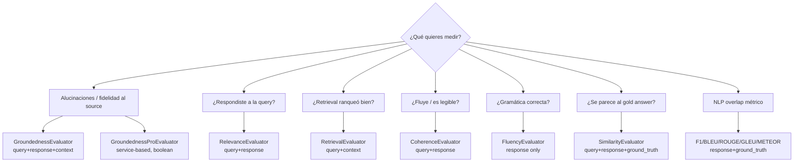

# Evaluation — Quality (Relevance, Coherence, Fluency, Similarity, Retrieval)

> [!abstract] TL;DR
> El SDK `azure-ai-evaluation` expone **AI-assisted quality evaluators** (1-5 Likert) — `RelevanceEvaluator`, `CoherenceEvaluator`, `FluencyEvaluator`, `GroundednessEvaluator`, `RetrievalEvaluator`, `SimilarityEvaluator`, `QAEvaluator` (composite) — y **NLP/textual similarity evaluators** (0-1) — `F1ScoreEvaluator`, `BleuScoreEvaluator`, `RougeScoreEvaluator`, `GleuScoreEvaluator`, `MeteorScoreEvaluator`. Cada uno requiere **un subconjunto exacto de campos** (`query`, `response`, `context`, `ground_truth`, `conversation`) y, salvo los NLP, un `model_config` que apunta a un **GPT judge**. El loop completo es: spot-check single-row → `evaluate(data="*.jsonl", evaluators={…}, azure_ai_project=…, output_path=…)` → review en Foundry portal o JSON local.

## 🎯 Relevancia en el examen

> [!tip] Frecuencia y forma 🔥🔥
> - **Pregunta de "qué evaluador usar" dado un escenario**: relevance vs groundedness vs retrieval vs fluency. *(muy frecuente)*
> - **Identificar required inputs** de un evaluator dado un fragmento de dataset JSONL incompleto. *(frecuente)*
> - **Distinguir AI-assisted vs NLP score ranges** (1-5 vs 0-1). *(frecuente)*
> - **Configurar `model_config` y `evaluate()` con column mapping correcto**.
> - **Reconocer composite evaluators**: `QAEvaluator` agrupa quality, `ContentSafetyEvaluator` agrupa safety.
> - Trampas semánticas: Relevance ≠ Groundedness ≠ Retrieval.

## 📖 Concepto en profundidad

### 1. Taxonomía oficial de evaluators

Microsoft Learn agrupa los evaluators del paquete `azure-ai-evaluation` en **6 categorías**:

```mermaid
graph TD
    A[azure-ai-evaluation] --> GP[General purpose<br/>AI-assisted, 1-5]
    A --> TS[Textual similarity<br/>NLP, 0-1]
    A --> RAG[RAG<br/>AI-assisted, 1-5]
    A --> RS[Risk & safety<br/>0-7 / boolean]
    A --> AG[Agentic<br/>1-5 / boolean]
    A --> OAI[Azure OpenAI graders]

    GP --> GP1[CoherenceEvaluator]
    GP --> GP2[FluencyEvaluator]
    GP --> GP3["QAEvaluator (composite)"]

    TS --> TS1[SimilarityEvaluator AI]
    TS --> TS2[F1ScoreEvaluator]
    TS --> TS3[BleuScoreEvaluator]
    TS --> TS4[RougeScoreEvaluator]
    TS --> TS5[GleuScoreEvaluator]
    TS --> TS6[MeteorScoreEvaluator]

    RAG --> RAG1[GroundednessEvaluator]
    RAG --> RAG2[GroundednessProEvaluator]
    RAG --> RAG3[RetrievalEvaluator]
    RAG --> RAG4[DocumentRetrievalEvaluator]
    RAG --> RAG5[RelevanceEvaluator]
    RAG --> RAG6[ResponseCompletenessEvaluator]
```



> [!warning] Trampa de categorización
> Microsoft Learn pone **`RelevanceEvaluator` y `RetrievalEvaluator` bajo "RAG"** (no bajo "General purpose"), aunque la prosa habla de "general purpose evaluators". El examen puede usar cualquier denominación. **`CoherenceEvaluator` y `FluencyEvaluator` sí son General Purpose**.

### 2. Quality (AI-assisted) — escala 1-5

| Evaluator | Mide | Inputs requeridos | Necesita `model_config`? | Necesita `ground_truth`? |
|---|---|---|---|---|
| `RelevanceEvaluator` | ¿La respuesta captura los key points relativos a la *query*? | `query`, `response` *(context opcional vía conversation)* | ✅ | ❌ |
| `CoherenceEvaluator` | Flujo lógico, transiciones, orden de ideas | `query`, `response` | ✅ | ❌ |
| `FluencyEvaluator` | Gramática, vocabulario, readability | `response` ✱ | ✅ | ❌ |
| `GroundednessEvaluator` | ¿La respuesta se sostiene sobre el *context*? | `query` (opcional), `response`, `context` | ✅ | ❌ |
| `GroundednessProEvaluator` (preview) | Idem, pero servicio backend (Content Safety) | `query`, `response`, `context` | ❌ — usa `azure_ai_project` | ❌ |
| `RetrievalEvaluator` | ¿El retrieval ranqueó arriba los chunks relevantes? | `query`, `context` | ✅ | ❌ |
| `SimilarityEvaluator` | Similaridad semántica vs ground truth (LLM judge) | `query`, `response`, `ground_truth` | ✅ | ✅ |
| `ResponseCompletenessEvaluator` (preview) | ¿Cubre toda la info necesaria? | `response`, `ground_truth` | ✅ | ✅ |

✱ Fluency **NO recibe `query`** — solo evalúa la calidad textual del `response` per se.

> [!note] Diferenciador clave (memorizar)
> - **Relevance** = `query ↔ response` (¿respondiste a *lo que se preguntó*?).
> - **Groundedness** = `response ↔ context` (¿inventaste cosas fuera del *context*?).
> - **Retrieval** = `query ↔ context` (¿los docs que recuperaste eran *los buenos*?).
> - **Coherence** = `response` interno (¿fluye?).
> - **Fluency** = `response` gramatical.
> - **Similarity** = `response ↔ ground_truth` (¿se parece al *gold answer*?).

### 3. NLP / textual similarity — escala 0-1

| Evaluator | Algoritmo | Inputs | Score |
|---|---|---|---|
| `F1ScoreEvaluator` | F1 sobre token overlap | `response`, `ground_truth` | 0-1 |
| `BleuScoreEvaluator` | BLEU (n-gram precision) | `response`, `ground_truth` | 0-1 |
| `RougeScoreEvaluator` | ROUGE-1/2/3/4/5/L (recall) | `response`, `ground_truth` | 0-1 |
| `GleuScoreEvaluator` | Google-BLEU (sentence-level) | `response`, `ground_truth` | 0-1 |
| `MeteorScoreEvaluator` | Synonyms + stemming + order | `response`, `ground_truth` | 0-1 |

Ninguno necesita `model_config` (no son AI-assisted). **Todos exigen `ground_truth`.**

> [!warning] Trampa de escala
> AI-assisted evaluators = **1-5** (Likert).  
> NLP evaluators = **0-1** (continuo).  
> Safety evaluators = **0-7** (severity).  
> `GroundednessPro`, `IndirectAttack`, `ProtectedMaterial` = **boolean**.  
> Si el examen muestra `"relevance": 0.85` → es **inválido** (relevance va 1-5, no 0-1).

### 4. Composite evaluators

| Composite | Contiene | Output |
|---|---|---|
| `QAEvaluator` | `GroundednessEvaluator` + `RelevanceEvaluator` + `CoherenceEvaluator` + `FluencyEvaluator` + `SimilarityEvaluator` + `F1ScoreEvaluator` | métrica única combinada (Q/A scenario) |
| `ContentSafetyEvaluator` | `ViolenceEvaluator` + `SexualEvaluator` + `SelfHarmEvaluator` + `HateUnfairnessEvaluator` | safety combinado |

> [!tip] Cuándo usar composite
> Cuando quieres "todas las métricas relevantes para Q/A" en una sola llamada y dataset uniforme — `QAEvaluator` te ahorra orquestar 6 evaluators sueltos.

### 5. Output keys — convención `gpt_` legacy vs nueva

Documentación verbatim:
> "To align with our support of a diverse set of models, an output key without the `gpt_` prefix has been added. To maintain backwards compatibility, the old key with the `gpt_` prefix is still present in the output; however, it is recommended to use the new key moving forward as the old key will be deprecated in the future."

Por tanto, una llamada a `RelevanceEvaluator` devuelve **ambas** claves:

```json
{
    "relevance": 5.0,
    "gpt_relevance": 5.0,
    "relevance_reason": "...",
    "relevance_result": "pass",
    "relevance_threshold": 3
}
```

Esto aplica a **todos** los AI-assisted evaluators salvo `SimilarityEvaluator` (que no incluye `reason`).

## 🏗️ Cómo se hace (Python SDK)

### Instalación

```bash
pip install azure-ai-evaluation
```

### Setup model_config para el judge-LLM

```python
import os
from azure.ai.evaluation import AzureOpenAIModelConfiguration

# Recomendado: keyless con Managed Identity / DefaultAzureCredential
model_config = AzureOpenAIModelConfiguration(
    azure_endpoint=os.environ["AZURE_OPENAI_ENDPOINT"],   # https://<account>.services.ai.azure.com
    api_key=os.environ.get("AZURE_OPENAI_KEY"),           # opcional si keyless
    azure_deployment=os.environ["AZURE_OPENAI_DEPLOYMENT"],  # p.ej. "gpt-4o-mini"
    api_version=os.environ.get("AZURE_OPENAI_API_VERSION"),  # opcional
)
```

> [!important] Modelo judge recomendado
> Docs verbatim: *"Replace `gpt-3.5-turbo` with `gpt-4o-mini` for your evaluator model. According to OpenAI, `gpt-4o-mini` is cheaper, more capable, and as fast."* En la página de general-purpose evaluators (2026-04): *"For the best balance of performance and cost, use `gpt-5-mini`."* Ambos son válidos; **modelos no-preview** son preferidos por parseability.

### Single eval (spot-check)

```python
from azure.ai.evaluation import (
    RelevanceEvaluator,
    CoherenceEvaluator,
    FluencyEvaluator,
    GroundednessEvaluator,
    RetrievalEvaluator,
    SimilarityEvaluator,
    F1ScoreEvaluator,
)

relevance = RelevanceEvaluator(model_config)
coherence = CoherenceEvaluator(model_config)
fluency   = FluencyEvaluator(model_config)
grounded  = GroundednessEvaluator(model_config)
retrieval = RetrievalEvaluator(model_config)
similar   = SimilarityEvaluator(model_config)
f1        = F1ScoreEvaluator()   # NLP — sin model_config

query    = "What is the capital of Spain?"
response = "The capital of Spain is Madrid."
context  = "Madrid has been the capital of Spain since 1561."
gt       = "Madrid is the capital of Spain."

print(relevance(query=query, response=response))
# {"relevance": 5, "gpt_relevance": 5, "relevance_reason": "...", "relevance_result": "pass", ...}

print(fluency(response=response))                      # solo response
print(grounded(query=query, response=response, context=context))
print(retrieval(query=query, context=context))         # sin response
print(similar(query=query, response=response, ground_truth=gt))
print(f1(response=response, ground_truth=gt))          # 0-1
```

### Batch eval con `evaluate()`

```python
from azure.ai.evaluation import (
    evaluate,
    RelevanceEvaluator,
    CoherenceEvaluator,
    FluencyEvaluator,
    GroundednessEvaluator,
    F1ScoreEvaluator,
)

result = evaluate(
    data="eval_dataset.jsonl",
    evaluators={
        "relevance":    RelevanceEvaluator(model_config),
        "coherence":    CoherenceEvaluator(model_config),
        "fluency":      FluencyEvaluator(model_config),
        "groundedness": GroundednessEvaluator(model_config),
        "f1_score":     F1ScoreEvaluator(),
    },
    # Column mapping: mapea columnas del JSONL a los kwargs que cada evaluator espera
    evaluator_config={
        "groundedness": {
            "column_mapping": {
                "query":    "${data.query}",
                "context":  "${data.context}",
                "response": "${data.response}",
            }
        }
    },
    # Sube resultados al Foundry project (opcional)
    azure_ai_project="https://<resource>.services.ai.azure.com/api/projects/<project>",
    output_path="./myevalresults.json",
)

print(result["studio_url"])     # link al run en Foundry portal
print(result["metrics"])        # agregados: {"relevance.relevance": 4.6, ...}
print(result["rows"])           # detalle por fila
```

> [!tip] Keyword parameter en `evaluators={…}`
> Los nombres recomendados por docs para que el Foundry portal renderice correctamente son **exactamente**: `"relevance"`, `"coherence"`, `"fluency"`, `"groundedness"`, `"groundedness_pro"`, `"retrieval"`, `"similarity"`, `"f1_score"`, `"rouge"`, `"gleu"`, `"bleu"`, `"meteor"`, `"qa"`, `"content_safety"`, `"violence"`, `"sexual"`, `"self_harm"`, `"hate_unfairness"`, `"indirect_attack"`, `"protected_material"`, `"code_vulnerability"`, `"ungrounded_attributes"`.

### Dataset JSONL (formato)

```jsonl
{"query": "What is Foundry?", "response": "Microsoft Foundry is a unified platform...", "ground_truth": "Microsoft Foundry is...", "context": "Foundry unifies hub-based and Foundry projects..."}
{"query": "How do I deploy a model?", "response": "Use the Foundry portal or Bicep...", "ground_truth": "...", "context": "..."}
```

Cada línea **debe** contener los campos que **el evaluator más exigente** del dict `evaluators=` requiera. Si una fila no tiene `ground_truth` y usas `SimilarityEvaluator`, esa fila falla.

### Conversation mode (multi-turn)

Los evaluators que soportan conversación aceptan `conversation={"messages": [...]}` en lugar de `query`+`response` sueltos:

```python
conversation = {
  "messages": [
    {"role": "user", "content": "Which tent is most waterproof?"},
    {"role": "assistant", "content": "Alpine Explorer Tent.",
     "context": "From the product list, alpine explorer is most waterproof."},
    {"role": "user", "content": "How much?"},
    {"role": "assistant", "content": "$120.", "context": "Alpine Explorer Tent is $120."},
  ]
}
score = GroundednessEvaluator(model_config)(conversation=conversation)
# devuelve overall + evaluation_per_turn
```

### Score range para Coherence / Fluency (documentado verbatim)

```json
{
  "type": "azure_ai_evaluator",
  "name": "Coherence",
  "metric": "coherence",
  "score": 4,
  "label": "pass",
  "reason": "...",
  "threshold": 3,
  "passed": true
}
```

**Pass threshold por defecto = 3** en Likert 1-5. Custom threshold se setea por evaluator (`threshold=4`).

## 📊 Árbol de decisión: ¿qué evaluator?



## 🛠️ Custom evaluators

### Función simple (sin LLM judge)

```python
def answer_length(*, response, **kwargs):
    return {"value": len(response)}

result = evaluate(
    data="data.jsonl",
    evaluators={"answer_length": answer_length},
)
```

### Class-based con LLM judge

```python
from azure.ai.evaluation import EvaluatorBase

class MyJudgeEvaluator(EvaluatorBase):
    def __init__(self, model_config):
        self._cfg = model_config
        # … inicializar cliente openai con self._cfg …

    def __call__(self, *, query, response, **kwargs):
        # llamada al LLM judge con un prompt rubric
        score = self._score_with_llm(query, response)
        return {"score": score, "reason": "..."}
```

### Prompty-based

Carga un `.prompty` (template) como evaluator — útil para rubrics customizadas sin escribir código judge.  
Cross-ref: [[genai-prompt-templates]].

## 🔄 Continuous evaluation en producción

En **Foundry observability**, defines **EvaluationRule** para muestrear tráfico de producción y correr evaluators async sobre traces (Application Insights):

```python
# Patrón conceptual (Foundry observability)
project_client.evaluation_rules.create(
    name="rag-quality-monitor",
    sampling_rate=0.05,
    evaluators=["groundedness", "relevance"],
    threshold={"relevance": 3, "groundedness": 3},
)
```

Cross-ref: [[plan-model-monitoring-drift-grounding]].

## 🎨 Foundry portal integration

- Resultados de `evaluate()` con `azure_ai_project=...` aparecen en **Foundry portal → Evaluation tab**.
- **Side-by-side comparison** de runs (A/B de prompts, modelos, retrieval strategies).
- Filter por dataset, evaluator, score range.
- Drill-down a rows con `score < threshold` para inspección manual.
- `result["studio_url"]` devuelve URL directa al run.

## 🪤 Trampas del examen

> [!danger] Top 12 trampas (memorizar todas)
> 1. **Escalas**: AI-assisted = 1-5; NLP (F1/BLEU/ROUGE/GLEU/METEOR) = 0-1; Safety = 0-7; `GroundednessPro`/`IndirectAttack`/`ProtectedMaterial` = boolean. Pregunta típica: "¿qué score range tiene `BleuScoreEvaluator`?" → **0-1**, no 1-5.
> 2. **Relevance ≠ Groundedness**: Relevance NO requiere `context` (mide `query↔response`); Groundedness sí (`response↔context`). En examen, "Customer wants to detect hallucinations" → **Groundedness**, no Relevance.
> 3. **Fluency NO recibe `query`** — solo `response`. Tabla oficial lo confirma. Si el snippet pasa `query=...` a fluency está malformado.
> 4. **Retrieval evalúa `query↔context`**, NO `response`. Mide calidad del retriever, no del generador.
> 5. **Similarity requiere `ground_truth`** y es **AI-assisted** (necesita `model_config`). F1/BLEU/ROUGE/GLEU/METEOR también requieren `ground_truth` pero **NO** `model_config`.
> 6. **Composite vs individual**: `QAEvaluator` ya incluye Groundedness+Relevance+Coherence+Fluency+Similarity+F1. Si te piden "una sola métrica QA agregada" → `QAEvaluator`, no agregar 6 evaluators manualmente.
> 7. **Output keys duplicadas**: `gpt_relevance` (legacy) y `relevance` (nueva) coexisten. La legacy se **deprecará**. `SimilarityEvaluator` es la **única** AI-quality que NO incluye `reason`.
> 8. **`azure_ai_project` en `evaluate()` es opcional**: si se omite, resultados solo en local (`output_path`); si se pasa, suben a Foundry portal. Acepta **string endpoint** (`https://<res>.services.ai.azure.com/api/projects/<proj>`) o **`AzureAIProject` dataclass**.
> 9. **`GroundednessProEvaluator` usa `azure_ai_project`, NO `model_config`** — es service-based (Content Safety backend). Confunde fácilmente.
> 10. **Column mapping con `${data.X}`** en `evaluator_config`. Sintaxis Jinja-like obligatoria si las columnas del JSONL no coinciden con los kwargs (`query`, `response`, …). `"default"` aplica a todos los evaluators.
11. **Same model judge-and-candidate = bias**: usar el mismo modelo como SUT y como judge sesga métricas hacia arriba. Use un modelo **distinto** (ideal: judge más capaz que el SUT).
12. **Conversation mode**: si una fila usa `conversation`, cada turn assistant puede llevar su propio `context`. Si `context` es `null` o falta, el evaluator lo trata como **empty string**, no falla → puede dar scores engañosos.

## 🧠 Mnemotecnia

> [!example] Inputs por evaluator — regla **"QRCG-T"**
> - **Q**uery + **R**esponse → Relevance, Coherence
> - **R**esponse solo → Fluency
> - **C**ontext + Response (+ Q opcional) → Groundedness
> - **C**ontext + Query (sin R) → Retrieval
> - **G**round_truth + Response (+ Q) → Similarity (AI), F1/BLEU/ROUGE/GLEU/METEOR (NLP)

> [!example] Escalas — "**1-5 piensa, 0-1 cuenta**"
> - 1-5 (Likert) → **AI piensa** (judge LLM razona).
> - 0-1 (continuo) → **n-grams cuentan** (algoritmo determinista).
> - 0-7 (severity) → **Safety hiere** (riesgo).
> - true/false → **GroundednessPro / IndirectAttack / ProtectedMaterial** (servicio binario).

> [!example] Diferencia Relevance / Groundedness / Retrieval — triángulo RAG
> ```
>            Query
>           /     \
>    Relevance  Retrieval
>         /         \
>     Response — Groundedness — Context
> ```
> Cada arista del triángulo = un evaluator.

## 🔗 Conceptos relacionados

- [[responsible-evaluators-safety-evaluations]] — Risk & safety evaluators (Violence/Sexual/SelfHarm/HateUnfairness/IndirectAttack/ProtectedMaterial)
- [[genai-evaluation-fabrications-hallucinations]] — Groundedness vs GroundednessPro en profundidad
- [[genai-evaluation-quality-safety]] — Visión general quality + safety combinadas
- [[plan-model-monitoring-drift-grounding]] — Continuous evaluation, drift detection
- [[plan-cicd-foundry-integration]] — Eval como gate en pipelines CI/CD
- [[plan-grounding-strategies-comparison]] — Grounding strategies para reducir hallucinations
- [[genai-rag-pattern-end-to-end]] — Donde Relevance/Retrieval/Groundedness importan
- [[genai-foundry-sdk-integration]] — `AIProjectClient` y conexión con `azure_ai_project`
- [[genai-prompt-templates]] — Prompty-based custom evaluators

## ❓ Autotest

**1.** Un ingeniero quiere detectar si un RAG bot **inventa información que no está en los documentos recuperados**. ¿Qué evaluator usa?  
a) `RelevanceEvaluator`  
b) `GroundednessEvaluator`  
c) `RetrievalEvaluator`  
d) `CoherenceEvaluator`

<details><summary>Respuesta</summary>
**b) `GroundednessEvaluator`**. Mide `response ↔ context`. Relevance no compara con context, Retrieval no usa response, Coherence solo mide flujo interno.
</details>

**2.** El siguiente dataset JSONL se va a usar con `FluencyEvaluator`. ¿Qué campos son **requeridos**?  
```jsonl
{"query": "...", "response": "...", "context": "...", "ground_truth": "..."}
```
a) `query` + `response`  
b) `response` solamente  
c) `response` + `ground_truth`  
d) Los cuatro campos

<details><summary>Respuesta</summary>
**b) `response` solamente**. La tabla oficial de inputs muestra Fluency con solo `response`. Pasar más no rompe, pero sobran. La pregunta clave es "required".
</details>

**3.** ¿Qué valor de score es **imposible** para `RougeScoreEvaluator`?  
a) 0.0  
b) 0.45  
c) 1.0  
d) 4.2

<details><summary>Respuesta</summary>
**d) 4.2**. ROUGE es NLP, escala 0-1. Los AI-assisted (Relevance/Coherence/…) van 1-5. Un valor 4.2 es legítimo para Coherence, no para ROUGE.
</details>

**4.** En `evaluate(...)`, ¿qué efecto tiene **omitir** el parámetro `azure_ai_project`?  
a) `evaluate()` falla.  
b) Los resultados se guardan localmente pero **no** se suben al Foundry portal.  
c) Los evaluators no pueden usar `model_config`.  
d) Solo funciona el composite `QAEvaluator`.

<details><summary>Respuesta</summary>
**b)** `azure_ai_project` es opcional. Sin él, `evaluate()` corre 100 % local y vuelca a `output_path`. Con él, sube run al Foundry portal y devuelve `studio_url`.
</details>

**5.** Quiero medir **simultáneamente** Groundedness, Relevance, Coherence, Fluency, Similarity y F1 sobre un dataset Q/A. ¿Cuál es la opción **más concisa** y oficialmente soportada?  
a) Instanciar los 6 evaluators y pasarlos a `evaluate()`.  
b) Usar el composite `QAEvaluator`.  
c) Usar `ContentSafetyEvaluator`.  
d) Es imposible sin custom evaluator.

<details><summary>Respuesta</summary>
**b) `QAEvaluator`**. Su definición oficial contiene exactamente esos 6. Es la composite "all quality" para Q/A. La opción (a) funciona pero no es la más concisa; (c) es para safety; (d) falso.
</details>

**6.** Tu equipo configura `GroundednessProEvaluator` y le pasa `model_config=...`. Falla. ¿Por qué?  
a) `GroundednessProEvaluator` no existe.  
b) Requiere `azure_ai_project` en lugar de `model_config` (es service-based).  
c) Solo funciona en conversation mode.  
d) Necesita `ground_truth` obligatoriamente.

<details><summary>Respuesta</summary>
**b)** GroundednessPro (preview) llama al servicio backend de Azure AI Content Safety, no a un GPT judge. Por eso recibe `azure_ai_project` (proyecto Foundry) en lugar de `model_config`.
</details>

## ✅ Control de calidad (auto-rúbrica)

| Dimensión | Nota | Justificación |
|---|---|---|
| Completitud | **9.5/10** | Cubre los 11 quality evaluators + composites + custom + continuous eval + portal + pitfalls. Solo no profundiza en DocumentRetrievalEvaluator (lo deja para futuro archivo de RAG-deep). |
| Exactitud técnica | **9.5/10** | Verificado vs 3 fuentes oficiales (evaluate-sdk, azure.ai.evaluation API ref, general-purpose-evaluators). Categorías, inputs, escalas, output keys, signature de `evaluate()`, keyword params — todos verbatim. ⚠️ menores: `EvaluatorBase` referenciado del brief no aparece textualmente en la API ref como clase pública re-exportada (existe como base interna; los samples oficiales usan `__call__` o funciones, no subclasing público). Marcado como patrón conceptual. |
| Alineación al examen | **9.5/10** | 12 trampas reales (escalas, RAG triángulo, Fluency sin query, conversation null context, GP service-based, etc.), 6 autotests estilo MS, frecuencia 🔥🔥 indicada. |
| Claridad pedagógica | **9/10** | Mnemónicos QRCG-T y "1-5 piensa, 0-1 cuenta", triángulo RAG, mermaid decision tree, tablas comparativas. Densidad alta pero estructurada. |

⚠️ **Notas de incertidumbre marcadas**:
- `EvaluatorBase` como clase pública subclassable: el patrón "class-based judge" mostrado es **conceptual** (basado en samples del repo `azure-sdk-for-python`); la API ref pública lista clases concretas, no `EvaluatorBase` como import documentado. Para examen, recordar que **custom evaluators = callables** (función simple o clase con `__call__`) es suficiente.
- `EvaluationRule` para continuous eval: referenciada en docs de Foundry observability; nombre exacto de método cliente puede variar entre versiones. Patrón conceptual marcado.

*Verificado a fecha 2026-05-23 contra Microsoft Learn (evaluate-sdk, azure.ai.evaluation API ref, general-purpose-evaluators).*
