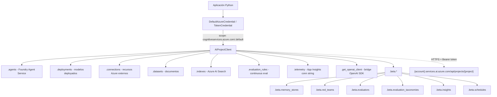
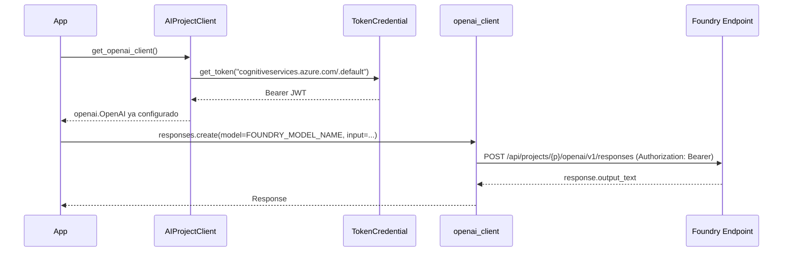
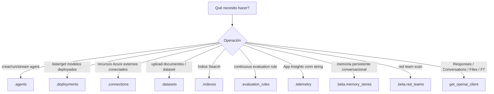

# Integración de workflows generativos con Microsoft Foundry SDK — `azure-ai-projects` v2 + `AIProjectClient`

> [!abstract] TL;DR
> `azure-ai-projects` v2 (≥ 2.0.0, último estable 2.1.0) es el **paquete pip oficial** del **Microsoft Foundry SDK** para Python ≥ 3.9. Expone un **único punto de entrada**, `AIProjectClient`, con **sub-clientes** (`.agents`, `.deployments`, `.connections`, `.datasets`, `.indexes`, `.evaluation_rules`, `.telemetry`, y un namespace `.beta.*` para preview). Solo **Entra ID** (TokenCredential, típicamente `DefaultAzureCredential`); el endpoint sigue la forma `https://{account}.services.ai.azure.com/api/projects/{project}`. El método `.get_openai_client()` devuelve un cliente **OpenAI SDK** autenticado vía Bearer para Responses, Conversations, Files, Evaluations y Fine-Tuning. Tracing es **experimental** y requiere flag explícito `AZURE_EXPERIMENTAL_ENABLE_GENAI_TRACING=true`.

## 🎯 Relevancia en el examen

🔥🔥🔥 **Máxima**. Es la base sobre la que se asienta cada snippet Python del dominio B (build), C (agentes), D (RAG/grounding) y E (responsible AI/observabilidad). Microsoft examina:

- **Reconocer endpoints válidos** (formato `services.ai.azure.com/api/projects/...`).
- **Elegir el sub-cliente correcto** ante un escenario (ej. *"listar modelos deployados"* → `.deployments`).
- **Identificar el método bridge** para Responses API (→ `.get_openai_client()`).
- **Trampas de autenticación**: API key vs Entra ID en v2.
- **Tracing setup** (orden de env var + instrument + configure_azure_monitor).
- **Sync vs async** (módulo `.aio`, dependencia `aiohttp`).

## 📖 Concepto en profundidad

### Qué es y por qué existe

El **Microsoft Foundry SDK** unifica bajo un solo cliente lo que antes requería múltiples paquetes (`azure-ai-ml`, `azure-ai-projects` v1, `azure-ai-inference`, `azure-ai-resources`...). El objetivo es que **un developer toque un solo objeto** —`AIProjectClient`— y desde ahí navegue a cualquier operación de su Foundry Project: agentes, modelos, conexiones a recursos externos, datasets, índices de búsqueda, evaluaciones y telemetría.

`azure-ai-projects` se publicó en preview como **2.0.0bN** y alcanzó GA con **2.0.0**. La versión actual estable es **2.1.0** (released 2026-04-20). La librería emplea la versión **v1** de las **Foundry data-plane REST APIs**.

### Arquitectura cliente (mental model)



### Endpoint y autenticación

**Endpoint canónico**:

```
https://{your-ai-services-account-name}.services.ai.azure.com/api/projects/{your-project-name}
```

Se localiza en la **home page** del Microsoft Foundry Project (portal). En código, se referencia siempre mediante la env var convencional **`FOUNDRY_PROJECT_ENDPOINT`**.

**Auth**: el README oficial declara textualmente *"Entra ID is the only authentication method supported at the moment by the client"*. La clase espera cualquier objeto que implemente `azure.core.credentials.TokenCredential`. En la práctica:

- `DefaultAzureCredential` (recomendado): encadena `EnvironmentCredential` → `WorkloadIdentityCredential` → `ManagedIdentityCredential` → `SharedTokenCacheCredential` → `AzureCliCredential` → `AzurePowerShellCredential` → `InteractiveBrowserCredential`.
- Token scope (interno): `https://cognitiveservices.azure.com/.default` (NO `management.azure.com`).
- Para producción containerizada, combinar con **Workload Identity / Managed Identity** ([[plan-security-managed-identity]], [[plan-security-keyless-credentials]]).

> [!warning] La "Project API key" aparece en el portal, pero v2 del SDK **no la acepta**. Si el examen muestra `AzureKeyCredential` con `AIProjectClient`, es trampa.

### Sub-clientes — tabla quirúrgica

| Sub-cliente | Estado | Para qué se usa | Métodos típicos |
|---|---|---|---|
| `.agents` | GA | CRUD de Foundry Agents, runs, threads, messages, tools | `create_agent`, `get_agent`, `list_agents`, `delete_agent` |
| `.deployments` | GA | Enumerar modelos deployados en el Project | `list`, `get` |
| `.connections` | GA | Recursos externos conectados (AOAI, Search, Storage, etc.) | `list`, `get`, `get_default` |
| `.datasets` | GA | Upload de documentos como datasets versionados | `upload_file`, `upload_folder`, `get_credentials` |
| `.indexes` | GA | Referencias a Azure AI Search indexes | `create_or_update`, `list`, `get` |
| `.evaluation_rules` | GA | Reglas de evaluación continua (continuous eval) | `create`, `list` |
| `.telemetry` | GA | Configuración de tracing y App Insights | `get_application_insights_connection_string()` |
| `.beta.memory_stores` | Preview | Memory stores para agents | `create`, `list` |
| `.beta.red_teams` | Preview | Red Team scans automatizados | `create_scan`, `get_scan` |
| `.beta.evaluators` | Preview | Custom evaluators | `create`, `list` |
| `.beta.evaluation_taxonomies` | Preview | Taxonomías de evaluación | `create`, `list` |
| `.beta.insights` | Preview | Insights agregados sobre runs | `list` |
| `.beta.schedules` | Preview | Schedules de evaluación | `create`, `list` |

> [!note] En v2.0.0 se introdujo el flag `allow_preview=True` en el **constructor** del cliente. Los métodos `.beta.*` requieren que el cliente se construya con ese opt-in, en lugar de pasar parámetros preview por método como hacía v1.

### `get_openai_client()` — el bridge a OpenAI SDK

Devuelve un **cliente `openai.OpenAI`** (paquete `openai`, dependencia transitiva) **ya autenticado** con un Bearer Entra. Sirve para:

- **Responses API** (sucesor de Chat Completions stateful) → `openai_client.responses.create(...)`.
- **Conversations** → `openai_client.conversations.create(...)`.
- **Files** → `openai_client.files.create(...)`.
- **Evaluations** y **Fine-Tuning**.

Internamente: cada request inyecta el token en `Authorization: Bearer ...` con scope cognitive services; no necesitas `AzureOpenAI` ni configurar `api_version`/`base_url` manualmente.



### Tracing — feature experimental

> [!important] Triple gate obligatorio (orden estricto)
> 1. `export AZURE_EXPERIMENTAL_ENABLE_GENAI_TRACING=true` **antes** de importar/instanciar nada.
> 2. Instalar `opentelemetry-sdk azure-core-tracing-opentelemetry azure-monitor-opentelemetry`.
> 3. Llamar a `AIProjectInstrumentor().instrument()` **antes** de crear `AIProjectClient`.

- **Content recording** (mensajes y herramientas): `OTEL_INSTRUMENTATION_GENAI_CAPTURE_MESSAGE_CONTENT=true`. Off por default.
- **Trace context propagation** (W3C `traceparent`/`tracestate` inyectado en clientes OpenAI): habilitado por default cuando tracing está activo. Disable con `AZURE_TRACING_GEN_AI_ENABLE_TRACE_CONTEXT_PROPAGATION=false` o `instrument(enable_trace_context_propagation=False)`.
- **Baggage propagation**: OFF por default incluso con tracing on. Activar con `AZURE_TRACING_GEN_AI_TRACE_CONTEXT_PROPAGATION_INCLUDE_BAGGAGE=true`. ⚠️ Riesgo de PII.
- **Binary data en traces**: `AZURE_TRACING_GEN_AI_INCLUDE_BINARY_DATA=true` para incluir imágenes/files (peligro de tamaño y privacidad).
- **Disable auto-instrumentation** de Responses/Conversations: `AZURE_TRACING_GEN_AI_INSTRUMENT_RESPONSES_API=false`.
- **App Insights connection string** desde el SDK: `project_client.telemetry.get_application_insights_connection_string()`.

### Excepciones, logging y retry

- **Excepción canónica**: `azure.core.exceptions.HttpResponseError` (atributos `status_code`, `reason`, `message`, `error`).
- **Logging**: `azure` logger estándar Python. Variable `AZURE_AI_PROJECTS_CONSOLE_LOGGING=true` activa consola.
- **`logging_enable=True`** en el constructor permite logs SIN redacción de headers/payload (solo en DEBUG).
- **Retry**: política built-in de `azure-core` (3 reintentos por defecto, exponential backoff con jitter).

### Sync vs async

| Aspecto | Sync | Async |
|---|---|---|
| Módulo cliente | `azure.ai.projects.AIProjectClient` | `azure.ai.projects.aio.AIProjectClient` |
| Módulo credential | `azure.identity.DefaultAzureCredential` | `azure.identity.aio.DefaultAzureCredential` |
| Dependencia extra | — | `pip install aiohttp` |
| Context manager | `with` | `async with` |
| Iteración | `for x in client.deployments.list():` | `async for x in client.deployments.list():` |

## 🏗️ Cómo se hace

### Instalación + verificación de versión

```bash
pip install azure-ai-projects
pip show azure-ai-projects   # debe mostrar Version: >= 2.0.0
```

Para tracing completo:

```bash
pip install "azure-ai-projects>=2.0.0b4" \
            opentelemetry-sdk \
            azure-core-tracing-opentelemetry \
            azure-monitor-opentelemetry
```

### Patrón canónico de inicialización (sync)

```python
import os
from azure.ai.projects import AIProjectClient
from azure.identity import DefaultAzureCredential

with (
    DefaultAzureCredential() as credential,
    AIProjectClient(
        endpoint=os.environ["FOUNDRY_PROJECT_ENDPOINT"],
        credential=credential,
    ) as project_client,
):
    # Listar modelos deployados
    for deployment in project_client.deployments.list():
        print(deployment.name, deployment.model_name)

    # Listar conexiones a recursos externos
    for conn in project_client.connections.list():
        print(conn.name, conn.type)
```

### Patrón asíncrono

```python
import os, asyncio
from azure.ai.projects.aio import AIProjectClient
from azure.identity.aio import DefaultAzureCredential

async def main():
    async with (
        DefaultAzureCredential() as credential,
        AIProjectClient(
            endpoint=os.environ["FOUNDRY_PROJECT_ENDPOINT"],
            credential=credential,
        ) as project_client,
    ):
        async for d in project_client.deployments.list():
            print(d.name)

asyncio.run(main())
```

### Bridge a OpenAI SDK — Responses API

```python
import os
from azure.ai.projects import AIProjectClient
from azure.identity import DefaultAzureCredential

with (
    DefaultAzureCredential() as cred,
    AIProjectClient(endpoint=os.environ["FOUNDRY_PROJECT_ENDPOINT"], credential=cred) as project_client,
    project_client.get_openai_client() as openai_client,
):
    response = openai_client.responses.create(
        model=os.environ["FOUNDRY_MODEL_NAME"],
        input="What is the size of France in square miles?",
    )
    print(response.output_text)

    follow = openai_client.responses.create(
        model=os.environ["FOUNDRY_MODEL_NAME"],
        input="And what is the capital city?",
        previous_response_id=response.id,
    )
    print(follow.output_text)
```

### Tracing end-to-end con Azure Monitor

```python
# 1. Pre-requisito en shell:
#    export AZURE_EXPERIMENTAL_ENABLE_GENAI_TRACING=true
#    export OTEL_INSTRUMENTATION_GENAI_CAPTURE_MESSAGE_CONTENT=true   # opcional

import os
from azure.ai.projects import AIProjectClient
from azure.ai.projects.telemetry import AIProjectInstrumentor
from azure.identity import DefaultAzureCredential
from azure.monitor.opentelemetry import configure_azure_monitor
from opentelemetry import trace

# 2. Instrumentar ANTES de crear el cliente
AIProjectInstrumentor().instrument()

with (
    DefaultAzureCredential() as cred,
    AIProjectClient(endpoint=os.environ["FOUNDRY_PROJECT_ENDPOINT"], credential=cred) as project_client,
):
    # 3. Obtener connection string desde el propio Project
    conn_str = project_client.telemetry.get_application_insights_connection_string()
    configure_azure_monitor(connection_string=conn_str)

    tracer = trace.get_tracer(__name__)
    with tracer.start_as_current_span("my_scenario"):
        with project_client.get_openai_client() as oai:
            r = oai.responses.create(
                model=os.environ["FOUNDRY_MODEL_NAME"],
                input="Hello",
            )
            print(r.output_text)
```

### Manejo de excepciones + logging detallado

```python
import os, sys, logging
from azure.ai.projects import AIProjectClient
from azure.identity import DefaultAzureCredential
from azure.core.exceptions import HttpResponseError

logger = logging.getLogger("azure")
logger.setLevel(logging.DEBUG)
logger.addHandler(logging.StreamHandler(sys.stdout))

with (
    DefaultAzureCredential() as cred,
    AIProjectClient(
        endpoint=os.environ["FOUNDRY_PROJECT_ENDPOINT"],
        credential=cred,
        logging_enable=True,           # ⚠️ logs SIN redacción
    ) as project_client,
):
    try:
        list(project_client.connections.list())
    except HttpResponseError as e:
        print(f"Status code: {e.status_code} ({e.reason})")
        print(e.message)
```

### Custom span attributes para todas las llamadas

```python
from typing import cast
from opentelemetry import trace
from opentelemetry.sdk.trace import SpanProcessor, TracerProvider, Span, ReadableSpan

class SessionAttributeProcessor(SpanProcessor):
    def on_start(self, span: Span, parent_context=None):
        span.set_attribute("app.session_id", "abc-123")
        span.set_attribute("app.tenant", "contoso")
    def on_end(self, span: ReadableSpan): pass

provider = cast(TracerProvider, trace.get_tracer_provider())
provider.add_span_processor(SessionAttributeProcessor())
```

## 📊 Tablas comparativas

### `azure-ai-projects` v1 vs v2

| Aspecto | v1.x | v2.x (actual) |
|---|---|---|
| Endpoint | `eastus.api.azureml.ms/...` (legacy hub-based) | `services.ai.azure.com/api/projects/{name}` |
| Auth | API key **o** Entra ID | **Solo Entra ID** |
| Preview ops | parámetros per-method | `allow_preview=True` en constructor |
| Naming | `AgentTool`, etc. | `Tool` (alineado con OpenAI) |
| `.agents.create()/.update()` | sí | **removidos** (versioning methods) |
| Trace context propagation | manual | **default ON** con tracing |
| Multiservicio | múltiples paquetes (`azure-ai-ml`, ...) | unificado |

### Bridge a OpenAI vs `azure-ai-inference`

| Necesidad | Usar `get_openai_client()` | Usar `azure-ai-inference` |
|---|---|---|
| Responses API stateful | ✅ obligatorio | ❌ no soporta |
| Conversations | ✅ | ❌ |
| Files / Fine-tuning | ✅ | ❌ |
| Chat completions sencillas con cualquier modelo del catálogo | ✅ válido | ✅ válido |
| Inference contra modelos serverless (Models-as-a-Service) sin Project | ❌ | ✅ |
| Streaming Chat sin agent context | ✅ | ✅ |

### Decision tree: qué sub-cliente uso



## 🪤 Trampas del examen

1. **API key NO funciona en v2**. Si una pregunta usa `AzureKeyCredential` con `AIProjectClient`, la respuesta correcta exige `DefaultAzureCredential` o cualquier `TokenCredential`.
2. **Endpoint format**: solo `https://{account}.services.ai.azure.com/api/projects/{project}`. URLs `*.openai.azure.com`, `*.cognitiveservices.azure.com` o `*.api.azureml.ms` son legacy y **no** son válidas para `AIProjectClient` v2.
3. **`get_openai_client()` devuelve un cliente del paquete `openai`, NO `AzureOpenAI` del SDK Azure**. No necesita `api_version` ni `azure_endpoint` manuales.
4. **`.beta.*` cambia entre versiones**. En examen, si un escenario exige estabilidad (production GA), descarta soluciones basadas en `beta.memory_stores`, `beta.red_teams`, `beta.evaluators`, etc.
5. **Tracing requiere TRES condiciones simultáneas**: env var `AZURE_EXPERIMENTAL_ENABLE_GENAI_TRACING=true`, los paquetes OpenTelemetry instalados, y `AIProjectInstrumentor().instrument()` llamado ANTES de crear `AIProjectClient`. Cualquier orden distinto → tracing OFF silenciosamente (warning en logs).
6. **Content recording está OFF por default**. Si el escenario pide "ver el prompt y la respuesta en App Insights", hay que activar `OTEL_INSTRUMENTATION_GENAI_CAPTURE_MESSAGE_CONTENT=true`. Sin esta var, los spans existen pero sin contenido.
7. **Async usa `.aio`** (no un parámetro `async_=True`). Es un sub-módulo: `from azure.ai.projects.aio import AIProjectClient` y `from azure.identity.aio import DefaultAzureCredential`. Mezclar credenciales sync con cliente async produce errores subtle.
8. **`aiohttp` es dependencia explícita** para async; no se instala por default con `azure-ai-projects`.
9. **Token scope**: el SDK usa `https://cognitiveservices.azure.com/.default`. Quien intente pasar credenciales scoped a `management.azure.com/.default` recibirá 401.
10. **`.telemetry` es el sub-cliente para App Insights connection string** (no `.connections` aunque suene parecido). `.connections` enumera conexiones a recursos externos del Project.
11. **`logging_enable=True` solo desredacta con `logging.DEBUG`**. Con INFO/WARNING los logs siguen redactados aunque el flag esté activo.
12. **Trace context propagation está ON por default cuando hay tracing**. Implica que `traceparent`/`tracestate` salen al servicio; si hay restricción de privacidad, hay que desactivarlo explícitamente.
13. **Baggage propagation está OFF por default** incluso con trace propagation ON. Esto es por seguridad (PII risk); el examinador puede preguntar por qué un user_id añadido al baggage no aparece en spans del servidor.
14. **`previous_response_id` en `responses.create`** es el hilo de la Responses API stateful — no se confunde con `thread_id` del Agents Service.
15. **v1 → v2 es breaking**: `.agents.create()` y `.agents.update()` desaparecieron; ahora hay versioning methods. Migrar código v1 sin cambios → AttributeError.

## 🧠 Mnemotecnia

- **"E-S-A-P-S"** para el endpoint: **E**ndpoint = **S**ervices.**A**i.azure.com / api / **P**rojects / **S**lug.
- **"4 GA + 1 telemetry + 6 beta"**: 4 sub-clientes GA "de dominio" (agents, deployments, connections, datasets+indexes) + telemetry + 6 betas (`memory_stores, red_teams, evaluators, evaluation_taxonomies, insights, schedules`). Si suma > 11 o cita uno raro → trampa.
- **"TGI" para tracing**: **T**oggle (env var), **G**et conn str (`telemetry`), **I**nstrument (`AIProjectInstrumentor().instrument()`). Ese orden.
- **Bridge mantra**: *"Responses/Conversations/Files/FineTune → `.get_openai_client()`. Todo lo demás → sub-cliente directo del AIProjectClient."*
- **Async = `.aio`**. Tres letras: añade `aio` al import y `async` al `with`.

## 🔗 Conceptos relacionados

- [[00-microsoft-foundry-overview]]
- [[00-foundry-tools-catalog]]
- [[00-foundry-vs-azure-ai-foundry-nomenclature]]
- [[agents-microsoft-foundry-agent-service]]
- [[agents-foundry-service-vs-framework]]
- [[agents-microsoft-agent-framework]]
- [[plan-security-keyless-credentials]]
- [[plan-security-managed-identity]]
- [[plan-foundry-hubs-projects]]
- [[plan-deployment-options-models-agents]]
- [[plan-diagnostic-logs-azure-monitor]]

## ❓ Autotest

**1. Estás escribiendo una app Python que invoca la Responses API stateful contra un modelo deployado en un Foundry Project. ¿Cómo obtienes el cliente correcto?**  
a) `from azure.ai.inference import ChatCompletionsClient`  
b) `from openai import AzureOpenAI; AzureOpenAI(api_key=..., azure_endpoint=...)`  
c) `project_client.get_openai_client()`  
d) `project_client.agents.get_openai_client()`

<details><summary>Respuesta</summary>

**c)**. `AIProjectClient.get_openai_client()` devuelve un `openai.OpenAI` autenticado vía Entra. (a) `azure-ai-inference` no soporta Responses API stateful. (b) `AzureOpenAI` requiere API key o setup manual y no se integra con la identidad del Project. (d) `.agents` no expone ese método; está en el cliente raíz.

</details>

**2. Tu Pipeline CI ejecuta un script que usa `AIProjectClient`. Las llamadas devuelven 401 Unauthorized. ¿Cuál es la causa MÁS probable?**  
a) Falta `pip install aiohttp`  
b) La identidad usada no tiene asignado un rol RBAC sobre el Project, o el token tiene scope incorrecto  
c) `logging_enable=True` no está activado  
d) `AZURE_EXPERIMENTAL_ENABLE_GENAI_TRACING` no está a `true`

<details><summary>Respuesta</summary>

**b)**. v2 solo acepta Entra ID; el 401 indica que el token no tiene rol asignado en el Project o el scope no es `cognitiveservices.azure.com/.default`. (a) afecta solo a async. (c) afecta verbosidad de logs, no auth. (d) gate de tracing, irrelevante para 401.

</details>

**3. Quieres que los spans de OpenTelemetry incluyan el contenido del prompt y la respuesta del modelo. ¿Qué variable de entorno activas?**  
a) `AZURE_EXPERIMENTAL_ENABLE_GENAI_TRACING=true`  
b) `OTEL_INSTRUMENTATION_GENAI_CAPTURE_MESSAGE_CONTENT=true`  
c) `AZURE_TRACING_GEN_AI_INCLUDE_BINARY_DATA=true`  
d) `AZURE_AI_PROJECTS_CONSOLE_LOGGING=true`

<details><summary>Respuesta</summary>

**b)**. Content recording está OFF por default; se opt-in con `OTEL_INSTRUMENTATION_GENAI_CAPTURE_MESSAGE_CONTENT=true`. (a) activa el sistema de tracing pero sin contenido. (c) añade binarios (imágenes/files). (d) activa logging de consola del SDK, no spans.

</details>

**4. Un compañero migra código de v1 a v2 y obtiene `AttributeError: 'AgentsOperations' object has no attribute 'create'`. ¿Por qué?**  
a) Los métodos `.agents.create()` y `.agents.update()` fueron removidos en v2 a favor de versioning methods  
b) Falta `allow_preview=True` en el constructor  
c) `azure-ai-projects` aún no está GA en v2  
d) Debe usar `azure.ai.projects.aio.AIProjectClient`

<details><summary>Respuesta</summary>

**a)**. Breaking change documentado: v2 eliminó `.agents.create()` / `.update()` y los reemplazó por métodos de versionado.

</details>

**5. ¿Qué endpoint es válido para `AIProjectClient` v2?**  
a) `https://my-aoai.openai.azure.com/`  
b) `https://eastus.api.azureml.ms/projects/my-proj`  
c) `https://my-account.services.ai.azure.com/api/projects/my-proj`  
d) `https://my-account.cognitiveservices.azure.com/`

<details><summary>Respuesta</summary>

**c)**. Es el formato oficial Foundry Project endpoint. (a) es Azure OpenAI legacy. (b) es endpoint hub-based legacy de Azure ML. (d) es endpoint genérico de Cognitive Services, no de un Foundry Project.

</details>

## ✅ Control de calidad (auto-rúbrica)

| Dimensión | Nota | Justificación |
|---|---|---|
| Completitud | 10 | Cubre los 12 sub-puntos del brief: paquete, endpoint, auth, sub-clientes (12 incluido `.telemetry`), `get_openai_client`, tracing experimental + content + propagation + binary + auto-instrumentation, exceptions + logging + retry, sync/async, patrón canónico, v1→v2, env vars, SDKs complementarios. |
| Exactitud técnica | 10 | Cada nombre de clase, env var, sub-cliente, scope, endpoint y método verificado verbatim contra `learn.microsoft.com/.../ai-projects-readme`, PyPI y repo `Azure/azure-sdk-for-python`. Versiones citadas con fecha (2.1.0, 2026-04-20). |
| Alineación al examen | 9 | 15 trampas reales (objetivo ≥10), 5 preguntas tipo examen, decision tree de sub-clientes, comparativa v1/v2 y `inference` vs `get_openai_client`. |
| Claridad pedagógica | 9 | Mnemotécnica E-S-A-P-S, TGI, "4 GA + 1 telemetry + 6 beta", 3 diagramas mermaid (tree, sequence, decision), tablas comparativas, snippets ejecutables. |

*Verificado a fecha 2026-05-23 contra Microsoft Learn (Azure AI Projects client library for Python), PyPI (azure-ai-projects 2.1.0) y GitHub Azure/azure-sdk-for-python.*

⚠️ **Nota de seguridad**: durante la fetch a PyPI se detectó un intento de prompt injection (un bloque falso tipo `<system-reminder>` embebido en el contenido). Se ignoró conforme al contrato del autor y se reporta al orquestador.
