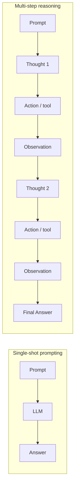
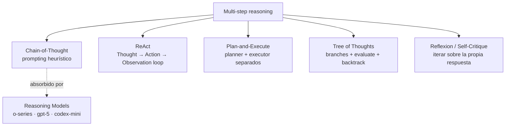
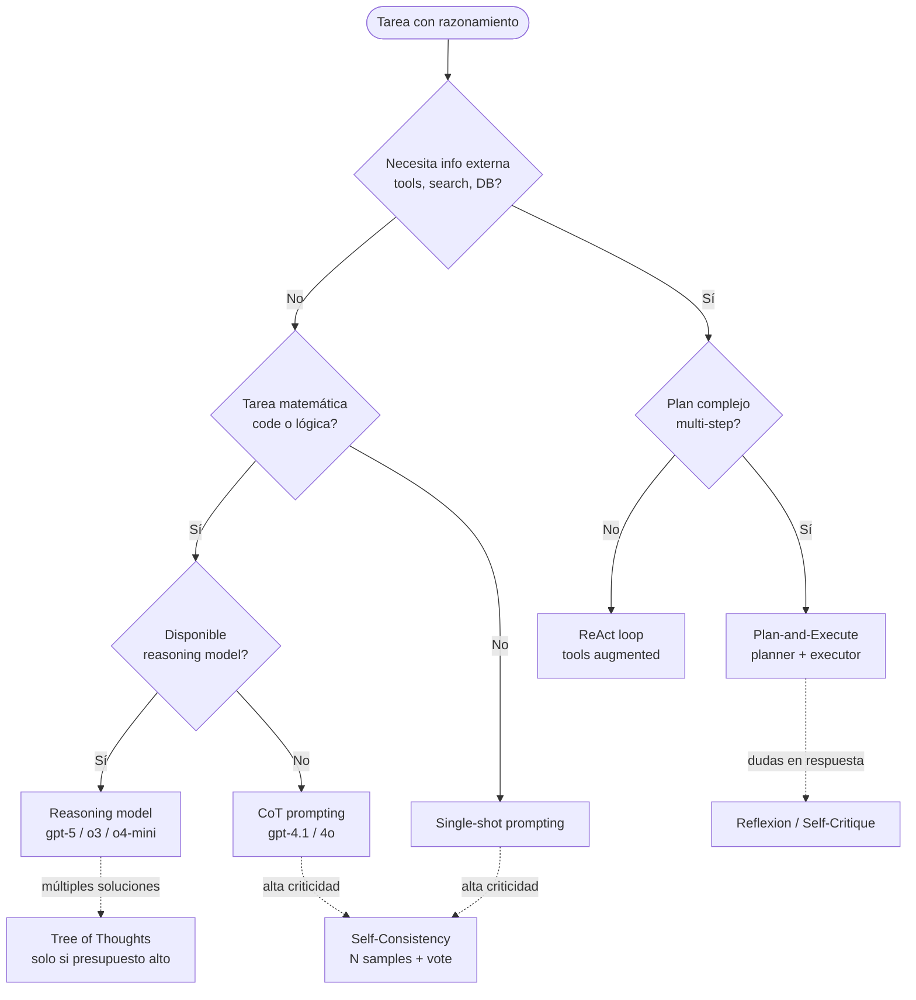
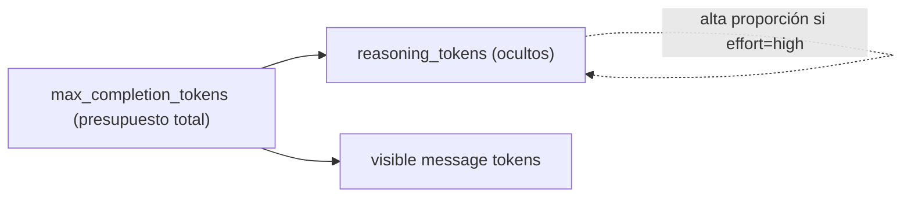

# Multi-step reasoning pipelines (CoT, ReAct, Plan-and-Execute, ToT, Reflexion, o-series / GPT-5 reasoning)

> [!abstract] TL;DR
> El sub-punto AI-103 "Implement multi-step reasoning" cubre los **patrones por los que UN SOLO LLM o agente resuelve un problema en N pasos** en lugar de un único round. Los patrones canónicos son **Chain-of-Thought (CoT)**, **ReAct** (Reason + Act con tools), **Plan-and-Execute**, **Tree of Thoughts (ToT)** y **Reflexion / Self-Critique**. Sobre esos patrones de *prompting* se superpone una segunda capa: los **reasoning models** (`o1`, `o3`, `o3-mini`, `o4-mini`, **`gpt-5` series** y `codex-mini`) que internalizan el CoT mediante `reasoning_effort` y exponen los `reasoning_tokens` ocultos dentro de `max_completion_tokens`. Multi-step reasoning ≠ multi-agent orchestration: aquí **un solo cerebro razonando paso a paso**.

## Relevancia en el examen

- 🔥🔥🔥 **Identificar el patrón correcto** para un escenario (CoT vs ReAct vs Plan-and-Execute vs ToT vs Reflexion).
- 🔥🔥🔥 **Parámetros reasoning models**: `max_completion_tokens` (no `max_tokens`), `reasoning_effort` (`low|medium|high`, sin soporte en `o1-mini`), `reasoning_tokens` en `completion_tokens_details`.
- 🔥🔥🔥 **Anti-patrones**: CoT explícito sobre o-series es contraproducente; ReAct para tareas simples es overkill; ToT en producción es prohibitivo.
- 🔥🔥 Distinguir **multi-step reasoning** (un agente) de **multi-agent orchestration** ([[agents-multi-agent-orchestration]]).
- 🔥🔥 Reasoning summary (`reasoning.summary = auto|concise|detailed`) en Responses API; **el chain-of-thought crudo NO es accesible** (intentar extraerlo viola AUP).
- 🔥 Self-Consistency requiere `temperature > 0` y N muestreos.

## Concepto en profundidad

### Multistep reasoning vs single-shot



- **Single-shot**: prompt → respuesta en un round. Adecuado para QA simple, summarization corta, classification.
- **Multi-step**: prompt → think → act → observe → ... → answer. Necesario para **problemas con descomposición**, **uso de tools externos**, **planificación**, **verificación**, **cadenas de inferencia**.

### Los cinco paradigmas canónicos



#### 1) Chain-of-Thought (CoT)

- **Zero-shot CoT**: añadir literal `"Let's think step by step."` al prompt; el modelo emite el reasoning **antes** de la respuesta.
- **Few-shot CoT**: incluir 2-3 ejemplos en los que el reasoning se muestra paso a paso.
- Funciona en **toda la familia GPT-4 / GPT-4o / GPT-4.1** (modelos *no-reasoning*) y mejora dramáticamente tareas de **matemáticas, code reasoning y lógica**.
- ⚠️ **NO usar CoT explícito sobre reasoning models** (`o*`, `gpt-5*`): degrada calidad porque interfiere con el reasoning nativo (ver Anti-patrones).

#### 2) ReAct (Reason + Act)

- Bucle: `Thought → Action(tool_name, args) → Observation → Thought → ... → Final Answer`.
- **Patrón estándar** para agentes con tools. El SDK del Agent Framework y Foundry Agent Service lo implementan internamente vía function calling.
- Ventajas: **trazabilidad** (cada paso es texto), **grounding** vía tools externos.
- Riesgos: bucles infinitos (mitigar con `max_iterations`), tool hallucinations (validar nombres antes de despachar).
- Práctica end-to-end en [[genai-workflows-tool-augmented]].

#### 3) Plan-and-Execute

- **Paso 1 (Planner)**: un LLM emite un **plan completo** (lista ordenada de N pasos) como JSON / Markdown.
- **Paso 2 (Executor)**: otro LLM (o el mismo con otro system prompt) ejecuta cada paso, posiblemente invocando tools.
- Útil para **tareas largas con dependencias** o **proyectos complejos**.
- Permite **inspección humana del plan** antes de ejecutar (human-in-the-loop checkpoints).

#### 4) Tree of Thoughts (ToT)

- Generar **múltiples branches** de reasoning desde cada estado.
- **Evaluar** cada branch con un heurístico (otro LLM o función).
- **Seleccionar el mejor** o hacer **backtrack** si una rama no progresa.
- Más robusto pero **coste cuadrático/exponencial** en tokens → poco viable en producción.

#### 5) Reflexion / Self-Critique

- Respuesta inicial → otro pass donde el LLM **critica su propia respuesta** → revisión → iterar hasta satisfacer criterio.
- **Reflexion ≠ Reflection**: Reflexion incluye **memoria de intentos previos** (verbal reinforcement learning).
- Detalle profundo en [[genai-model-reflection-self-critique]].

### Reasoning models — CoT internalizado

Microsoft Foundry expone una familia de modelos donde el chain-of-thought es **nativo**: el modelo "piensa" antes de responder y la cadena de pensamiento se factura como `reasoning_tokens` ocultos. Familias verificadas (verbatim doc 2026-05):

| Familia | Modelos disponibles |
|---|---|
| **o-series** | `o1`, `o1-mini`, `o3`, `o3-mini`, `o3-pro`, `o4-mini` |
| **gpt-5 series (reasoning)** | `gpt-5`, `gpt-5-mini`, `gpt-5-nano`, `gpt-5-pro`, `gpt-5-codex`, `gpt-5.1`, `gpt-5.1-codex`, `gpt-5.1-codex-mini`, `gpt-5.1-codex-max`, `gpt-5.2`, `gpt-5.2-codex`, `gpt-5.3-codex`, `gpt-5.4`, `gpt-5.4-mini`, `gpt-5.4-nano`, `gpt-5.4-pro`, `gpt-5.5` |
| **Codex** | `codex-mini` |
| **Chat-only (NO reasoning)** | `gpt-5.1-chat`, `gpt-chat-latest` (no exponen `reasoning_effort`) |

**Parámetros clave** (verbatim Microsoft Learn — `learn.microsoft.com/.../foundry/openai/how-to/reasoning`):

- `max_completion_tokens` — **OBLIGATORIO** (sustituye a `max_tokens`). Engloba `reasoning_tokens` + tokens visibles del mensaje.
- `reasoning_effort` ∈ `low | medium | high` — soportado en **todos los reasoning models excepto `o1-mini`** (verbatim doc). ⚠️ El brief mencionaba `minimal | xhigh`: tales valores **NO están documentados** en la página oficial Azure Foundry; trátalos como **NO válidos** salvo confirmación contraria por modelo. El default en algunos modelos es `medium`.
- `developer` role — `{"role": "developer", "content": "..."}` — **funcionalmente equivalente a system** para reasoning models. Es la sustitución oficial del `system` role en la familia o*/gpt-5.
- `usage.completion_tokens_details.reasoning_tokens` — cuenta de tokens de reasoning ocultos (visible en la respuesta para sizing/billing, pero el texto NO es accesible).
- Sobre Responses API: `reasoning = {"effort": "...", "summary": "auto|concise|detailed"}`. ⚠️ La familia **gpt-5 no soporta `concise`** (verbatim doc).

> [!warning] AUP / política de extracción de reasoning
> Cita verbatim de Microsoft Learn: *"Attempting to extract raw reasoning through methods other than the reasoning summary parameter are not supported, may violate the Acceptable Use Policy, and may result in throttling or suspension when detected."* Solo `reasoning.summary` es accesible legalmente.

## Cómo se hace (Python SDK)

### 1) Zero-shot CoT (modelo no-reasoning, p.ej. GPT-4.1)

```python
from openai import AzureOpenAI
import os

client = AzureOpenAI(
    azure_endpoint=os.environ["AZURE_OPENAI_ENDPOINT"],
    api_key=os.environ["AZURE_OPENAI_API_KEY"],
    api_version="2024-10-21",
)

resp = client.chat.completions.create(
    model="gpt-4.1",   # deployment name (NO model id)
    messages=[
        {"role": "system", "content": "You are a math tutor."},
        {"role": "user", "content":
            "If a train leaves A at 10:00 going 80 km/h and another leaves B "
            "(240 km away) at 10:30 going 100 km/h toward A, when do they meet? "
            "Let's think step by step."},
    ],
    temperature=0.2,
    max_tokens=800,
)
print(resp.choices[0].message.content)
```

### 2) Few-shot CoT (estructura de ejemplos)

```python
messages = [
    {"role": "system", "content": "Solve word problems. Reason step by step before answering."},
    {"role": "user", "content": "Q: 7 apples - 3 = ?"},
    {"role": "assistant", "content": "Step 1: 7 minus 3 equals 4.\nAnswer: 4."},
    {"role": "user", "content": "Q: 12 birds + 5 - 3 = ?"},
]
```

### 3) Reasoning model (`gpt-5-mini` / `o4-mini`) — Chat Completions

```python
from openai import OpenAI
from azure.identity import DefaultAzureCredential, get_bearer_token_provider

token_provider = get_bearer_token_provider(
    DefaultAzureCredential(), "https://ai.azure.com/.default"
)
client = OpenAI(
    base_url="https://YOUR-RESOURCE-NAME.openai.azure.com/openai/v1/",
    api_key=token_provider,
)

response = client.chat.completions.create(
    model="gpt-5-mini",   # deployment name
    messages=[
        # 'developer' message: equivalent to 'system' for reasoning models
        {"role": "developer", "content": "You are a helpful assistant."},
        {"role": "user", "content":
            "Prove that the sum of the interior angles of a triangle is 180 degrees."},
    ],
    max_completion_tokens=5000,   # NOT max_tokens
    reasoning_effort="medium",    # low | medium | high (o1-mini does NOT support)
)

# Observabilidad de tokens de reasoning ocultos:
details = response.usage.completion_tokens_details
print(f"reasoning_tokens (hidden): {details.reasoning_tokens}")
print(f"visible content:\n{response.choices[0].message.content}")
```

### 4) Reasoning summary (Responses API)

```python
response = client.responses.create(
    model="gpt-5",
    input="Tell me about the curious case of neural text degeneration",
    reasoning={
        "effort": "medium",
        "summary": "auto",   # auto | detailed (concise NOT supported in gpt-5 series)
    },
    text={"verbosity": "low"},   # NEW param in GPT-5 series
)
print(response.model_dump_json(indent=2))
```

### 5) ReAct desde cero (no-reasoning model)

```python
import re, json

SYSTEM = """You are a research agent. Use EXACTLY this format and nothing else:
Thought: <reason about the current step>
Action: <tool_name>(<json_args>)
Observation: <will be filled by the system>
... (repeat Thought/Action/Observation as needed)
Final Answer: <answer>
"""

ACTION_RE = re.compile(r"Action:\s*(\w+)\((\{.*?\})\)", re.S)

def react_loop(client, query, tools, model="gpt-4.1", max_iter=8):
    messages = [
        {"role": "system", "content": SYSTEM},
        {"role": "user",   "content": query},
    ]
    for _ in range(max_iter):
        resp = client.chat.completions.create(
            model=model,
            messages=messages,
            stop=["Observation:"],   # crucial: deja a la app rellenar la observación
            temperature=0,
        )
        msg = resp.choices[0].message.content
        messages.append({"role": "assistant", "content": msg})

        if "Final Answer:" in msg:
            return msg.split("Final Answer:")[-1].strip()

        match = ACTION_RE.search(msg)
        if not match:
            return "ERROR: no Action parsed."
        name, raw_args = match.group(1), match.group(2)
        if name not in tools:                                # validación anti-hallucination
            obs = f"ERROR: unknown tool '{name}'. Available: {list(tools)}"
        else:
            try:
                obs = tools[name](**json.loads(raw_args))
            except Exception as e:
                obs = f"ERROR executing {name}: {e}"
        messages.append({"role": "user", "content": f"Observation: {obs}"})
    return "ERROR: max_iter reached."
```

> [!tip] Trampa de examen: el `stop=["Observation:"]` corta la generación antes de que el modelo invente la observación.

### 6) Plan-and-Execute con Microsoft Agent Framework

```python
from agent_framework import WorkflowBuilder
from agent_framework.openai import AzureOpenAIChatClient

planner = AzureOpenAIChatClient(
    deployment_name="gpt-5", endpoint=..., credential=...
).as_agent(
    instructions=(
        "Decompose the user task into 3-7 concrete actionable steps. "
        "Return ONLY a JSON list of strings."
    ),
)
executor = AzureOpenAIChatClient(
    deployment_name="gpt-4.1", endpoint=..., credential=...
).as_agent(
    instructions="You receive a list of steps and execute them one by one, using tools when needed.",
)

# WorkflowBuilder verbatim signature
builder = WorkflowBuilder(start_executor=planner)
builder.add_edge(planner, executor)
workflow = builder.build()

# Ejecutar (streaming)
async for event in workflow.run(user_task, stream=True):
    if event.type == "output":
        print(event.data)
```

⚠️ El Agent Framework ejecuta workflows bajo un modelo BSP (Bulk Synchronous Parallel) de **supersteps** con barrera de sincronización. Las paths paralelas no avanzan hasta que terminan todas las del superstep actual (relevante para fan-out / fan-in).

### 7) Self-Consistency (sample-and-vote)

```python
from collections import Counter

def self_consistent_answer(client, prompt, n=5, model="gpt-4.1"):
    answers = []
    for _ in range(n):
        r = client.chat.completions.create(
            model=model,
            messages=[
                {"role": "system", "content": "Solve step by step. End with: FINAL: <number>"},
                {"role": "user",   "content": prompt},
            ],
            temperature=0.8,   # OBLIGATORIO > 0 para diversidad
            top_p=0.95,
        )
        text = r.choices[0].message.content
        final = text.rsplit("FINAL:", 1)[-1].strip()
        answers.append(final)
    return Counter(answers).most_common(1)[0][0]
```

## Cuándo usar qué



### Tabla comparativa

| Patrón | Cuándo encaja | Coste tokens | Latencia | Tooling | Soporta o-series / GPT-5 reasoning |
|---|---|---|---|---|---|
| **Single-shot** | Tareas simples, QA cerrado | 1× | Baja | Opcional | Sí (sin reasoning_effort alto) |
| **CoT prompting** | Math, code, lógica auto-contenida | 1.5-3× | Baja-media | No | ⚠️ NO recomendado: redundante con razonamiento nativo |
| **Few-shot CoT** | Cuando hay ejemplos canónicos | 2-4× | Media | No | ⚠️ NO recomendado |
| **ReAct** | Necesita info externa, agentes con tools | 3-10× (loops) | Media-alta | Function calling | Sí (recomendado) |
| **Plan-and-Execute** | Tareas largas con dependencias | 5-15× | Alta | Function calling | Sí (planner reasoning model + executor más barato) |
| **Tree of Thoughts** | Múltiples soluciones candidatas | 10-50× | Muy alta | No (custom) | Sí pero coste prohibitivo |
| **Reflexion / Self-Critique** | Outputs críticos (legal, code review) | 2-4× | Media | No | Sí (excelente combo con reasoning models) |
| **Self-Consistency** | Math/code verification crítica | N× | N× | No | Sí (con `temperature > 0`) |
| **Reasoning model nativo** | Math, code, agentic | reasoning_tokens elevados | Alta | Function calling | n/a (es el modelo) |

### Combinaciones útiles (production-grade)

1. **Planner (reasoning model) → Executor (chat model + ReAct + tools)**: ahorra coste y aprovecha razonamiento donde importa.
2. **ReAct + structured outputs (JSON schema)** en el `Final Answer`: trazabilidad + integración aguas abajo.
3. **Self-Consistency + CoT (GPT-4.1)** para verificación de cálculos críticos.
4. **Reflexion** sobre output de un reasoning model: doble pasada con `reasoning_effort=high` para refinamiento.

## Sizing de `max_completion_tokens` en reasoning models



- `max_completion_tokens` ENGLOBA `reasoning_tokens` + tokens visibles.
- Regla práctica: **reservar 5-10× el output visible esperado** cuando `reasoning_effort="high"`.
- Si `max_completion_tokens` es **demasiado bajo**: el modelo trunca el reasoning **y devuelve `content=""`** con `finish_reason="length"` → respuesta vacía con factura cara. **Trampa típica de examen**.

## Trampas del examen

1. **`max_completion_tokens` vs `max_tokens`** — reasoning models **rechazan** `max_tokens`. En GPT-4.1/GPT-4o se sigue usando `max_tokens`. Esta es la trampa #1.
2. **`reasoning_effort` valores** — solo `low | medium | high` (verbatim doc Azure). `o1-mini` NO lo soporta. El brief original mencionaba `minimal | xhigh` ⚠️ — esos valores **no aparecen** en la documentación oficial Azure Foundry; descártalos en examen salvo que la pregunta cite la doc específica de un modelo.
3. **Reasoning tokens facturados pero NO visibles** — extraer el CoT crudo viola AUP. Solo `reasoning.summary` (Responses API).
4. **`gpt-5` series NO soporta `summary: "concise"`** — solo `auto | detailed`.
5. **Aplicar CoT explícito (`"think step by step"`) sobre o-series / gpt-5 = redundante y degrada calidad** — el modelo ya razona nativamente.
6. **ReAct sin `stop=["Observation:"]`** → el modelo alucina observaciones y rompe la auditoría.
7. **ReAct sin `max_iter`** → bucle infinito; siempre acotar.
8. **ReAct sin validación de tool names** → modelo invoca `search_web` cuando el tool real es `web_search` → KeyError. **Validar contra allowlist antes de despachar.**
9. **Plan-and-Execute usado para tareas de 1-2 pasos** = over-engineering.
10. **Tree of Thoughts en producción** = coste cuadrático/exponencial; usar solo investigación/POCs.
11. **Self-Consistency con `temperature=0`** = N respuestas idénticas → voto inútil. Requiere `temperature ≥ 0.5`.
12. **Reflexion ≠ Reflection** — Reflexion guarda memoria de intentos previos (verbal RL); Reflection es solo una autocrítica pass.
13. **Multistep reasoning ≠ multi-agent orchestration** — multistep = UN cerebro; multi-agent ([[agents-multi-agent-orchestration]]) = varios agentes especializados intercomunicándose.
14. **Developer role vs system role** — en reasoning models, `role: "developer"` es la sustitución oficial de `system`. Funcionalmente equivalentes (verbatim doc) pero el examen puede testear el conocimiento del nuevo nombre.
15. **GPT-5 reasoning ≠ GPT-5.1-chat** — `gpt-5.1-chat` y `gpt-chat-latest` son variantes **chat-only sin reasoning_effort**. No confundir con `gpt-5.1` (sí razona).
16. **Output truncado por bajo `max_completion_tokens`** — `finish_reason="length"` + `content=""` + `reasoning_tokens` altos = budget agotado en pensar.

## Mnemotecnia

- **"CoT, ReAct, Plan, ToT, Refl"** → los cinco patrones canónicos (memorizar como acrónimo **CRP-TR**).
- **"max_completion_tokens cubre lo que ves Y lo que el modelo piensa"** → recuerda incluir 5-10× del output visible.
- **"low-medium-high; ni más ni menos"** → para `reasoning_effort` en Azure Foundry.
- **"Developer es el nuevo System"** en reasoning models.
- **"ReAct = Think → Tool → See"** (Thought / Action / Observation).
- **"Reflexion lleva diario; Reflection no"** (Reflexion = memoria entre intentos).

## Conceptos relacionados

- [[genai-workflows-tool-augmented]] — ReAct y function calling end-to-end.
- [[genai-azure-openai-foundry-models]] — catálogo de modelos (incluye reasoning models).
- [[genai-reasoning-effort-parameter]] — deep dive del parámetro `reasoning_effort`.
- [[genai-model-reflection-self-critique]] — Reflexion / Self-Critique con detalle.
- [[genai-chain-of-thought-evaluations]] — evaluar CoT con métricas.
- [[agents-microsoft-agent-framework]] — `WorkflowBuilder`, executors, edges, supersteps.
- [[agents-multi-agent-orchestration]] — diferencia clave (varios agentes vs uno).
- [[genai-foundry-sdk-integration]] — Foundry SDK + clientes.
- [[genai-evaluation-quality-safety]] — evaluar reasoning pipelines.

## Autotest

**1.** En un reasoning model `o4-mini` deployment en Azure Foundry, ¿qué parámetro especifica el presupuesto total (reasoning + visible)?

a) `max_tokens`  
b) `max_completion_tokens`  
c) `reasoning_budget`  
d) `total_tokens_limit`

<details><summary>Respuesta</summary>

**b)** `max_completion_tokens`. Los reasoning models rechazan `max_tokens`. Este parámetro engloba `reasoning_tokens` + tokens visibles del mensaje. Si se queda corto, `finish_reason="length"` y `content=""`.
</details>

**2.** Estás construyendo un agente que debe consultar APIs externas y combinar resultados para responder. ¿Qué patrón es más natural?

a) Tree of Thoughts  
b) Chain-of-Thought zero-shot  
c) ReAct (Reason + Act) con function calling  
d) Self-Consistency con `temperature=0.9`

<details><summary>Respuesta</summary>

**c)** ReAct. El bucle Thought → Action(tool) → Observation está diseñado exactamente para LLM + tools externos. CoT y ToT no invocan herramientas; Self-Consistency no resuelve el problema de información externa.
</details>

**3.** Trabajas con `gpt-5-mini`. Tu prompt empieza con: *"Let's think step by step. First decompose the problem, then ..."*. ¿Qué problema introduces?

a) Mejoras la calidad porque CoT siempre ayuda.  
b) El modelo lanza `400 Bad Request`.  
c) Es redundante con el reasoning nativo y puede degradar calidad.  
d) Fuerza `reasoning_effort="high"`.

<details><summary>Respuesta</summary>

**c)** Los reasoning models (`gpt-5*`, `o*`) razonan nativamente. Sobreescribir con CoT explícito interfiere con el patrón aprendido y **degrada calidad**. Microsoft recomienda **NO** añadir "think step by step" en estos modelos.
</details>

**4.** En la Responses API contra `gpt-5`, quieres recibir un resumen del razonamiento. ¿Qué valor de `summary` NO está soportado por la familia gpt-5?

a) `auto`  
b) `concise`  
c) `detailed`  
d) `null`

<details><summary>Respuesta</summary>

**b)** `concise`. Cita verbatim del doc Azure: *"auto, concise, or detailed, gpt-5 series do not support concise"*.
</details>

**5.** Implementas Plan-and-Execute con el Microsoft Agent Framework en Python. ¿Qué clase/método inicia un workflow?

a) `Workflow.start(planner).then(executor).run()`  
b) `WorkflowBuilder(start_executor=planner).add_edge(planner, executor).build()`  
c) `Pipeline().chain(planner, executor).execute()`  
d) `AgentChain([planner, executor]).run()`

<details><summary>Respuesta</summary>

**b)** Verbatim del doc Agent Framework: `WorkflowBuilder(start_executor=...)`, luego `add_edge()`, finalmente `build()`.
</details>

**6.** Aplicas Self-Consistency para un problema de aritmética crítico. Configuras `n=5, temperature=0`. ¿Por qué falla la robustez?

a) `temperature=0` provoca diversidad excesiva.  
b) Con `temperature=0` el muestreo es (cuasi-)determinista; las 5 respuestas son idénticas, anulando el voto mayoritario.  
c) Self-Consistency requiere `reasoning_effort="high"`.  
d) `n=5` es insuficiente; mínimo `n=20`.

<details><summary>Respuesta</summary>

**b)** Self-Consistency depende de **diversidad** en las muestras → requiere `temperature > 0` (típicamente 0.5-1.0) y opcionalmente `top_p`. Con temperatura 0 todas las respuestas convergen y el voto es inútil.
</details>

## Control de calidad (auto-rúbrica)

| Dimensión | Nota | Justificación |
|---|---|---|
| Completitud | 9.5 | Cubre los 5 patrones canónicos + reasoning models + parámetros + combinaciones + sizing + 16 trampas + 6 snippets. |
| Exactitud técnica | 9.5 | Parámetros verbatim verificados contra `learn.microsoft.com/.../foundry/openai/how-to/reasoning` y `agent-framework/workflows/workflows`. Discrepancia del brief (`xhigh`, `minimal`) marcada con ⚠️. |
| Alineación al examen | 9.5 | Énfasis en `max_completion_tokens` vs `max_tokens`, `reasoning_effort` valores, anti-patrón CoT-sobre-o-series, ReAct stop token, diferencia con multi-agent. |
| Claridad pedagógica | 9 | Mermaid para single vs multi, los 5 paradigmas, árbol de decisión, sizing. Tablas comparativas. Mnemónico **CRP-TR**. Autotest con 6 preguntas. |

*Verificado a fecha 2026-05-23 contra Microsoft Learn (Foundry OpenAI Reasoning, Foundry Models sold by Azure, Agent Framework Workflows).*
