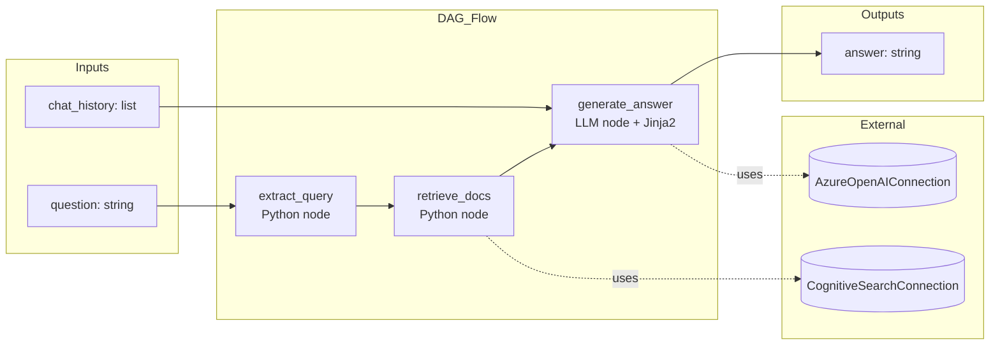
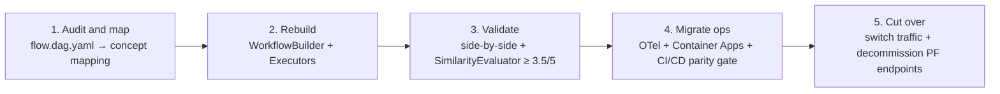

# Prompt Flow (legacy hub-based) — DAG orchestration y migration path a Agent Framework

> [!abstract] TL;DR
> **Prompt Flow** es una herramienta de orquestación basada en **DAG (Directed Acyclic Graph)** para construir apps LLM, parte de **Azure Machine Learning** y de **Microsoft Foundry portal (classic)** — disponible **únicamente en hub-based projects**. **El desarrollo de Prompt Flow finalizó el 20-abril-2026** y el feature **se retira completamente el 20-abril-2027** (entonces pasa a read-only). Microsoft recomienda migrar a **Microsoft Agent Framework** (code-first Python/.NET, `WorkflowBuilder` + `Executor`). En AI-103 se examina sobre todo como **referencia de migración**; en AI-102 (retiro 2026-06-30) sigue siendo evaluable de forma activa.

> [!danger] Estado del feature a fecha 2026-05-23
> - **End of development**: 2026-04-20 (hace ~1 mes)
> - **Full retirement**: 2027-04-20 → read-only mode
> - **Sustituto oficial**: [Microsoft Agent Framework](https://learn.microsoft.com/en-us/azure/machine-learning/prompt-flow/migrate-prompt-flow-to-agent-framework) (`pip install agent-framework`)
> - **No disponible** en Foundry projects (project-based) — solo hub-based / Foundry classic

## 🎯 Relevancia en el examen

| Examen | Frecuencia | Tipo de pregunta típica |
|---|---|---|
| **AI-102** (retiro 30-jun-2026) | 🔥🔥🔥 | Construcción de flows, nodos, variants, evaluation flows, deployment a online endpoint |
| **AI-103** (vigente) | 🔥🔥 | "When NOT to use Prompt Flow", **mapping a Agent Framework**, decisión hub-based vs Foundry project, migración |

Escenarios habituales:

- "Estás migrando una app LLM existente de Azure ML Prompt Flow a un Foundry project — ¿qué construct sustituye a un nodo LLM con Jinja2?" → `AzureOpenAIChatClient().as_agent(instructions=...)`.
- "Tu equipo creó un evaluation flow con groundedness. Migrar a Agent Framework" → `azure-ai-evaluation` SDK con `GroundednessEvaluator`.
- "¿Dónde se almacenan los secrets de una Azure OpenAI Connection?" → workspace connection + Key Vault, **NUNCA** literal en YAML.
- "Cliente quiere visual graph editor en su nuevo Foundry project" → trampa: Foundry projects **no** tienen Prompt Flow; Agent Framework **no** tiene editor visual.

## 📖 Concepto en profundidad

### Qué es Prompt Flow (definición oficial verbatim)

> *"Prompt flow is a development tool that streamlines the entire development cycle of AI applications powered by Large Language Models (LLMs)."* — Microsoft Learn

Es un **tool de orquestación visual + code** donde la lógica de tu app LLM se modela como **DAG** (grafo dirigido acíclico) de **nodos** (tools) interconectados. Cada nodo tiene inputs/outputs tipados; las aristas definen flujo de datos.

- **Open-source**: repo [`microsoft/promptflow`](https://github.com/microsoft/promptflow) + VS Code extension.
- **Hospedaje gestionado**: **Azure Machine Learning Studio** y **Microsoft Foundry (classic) portal** (hub-based projects).
- **NO** disponible en **Foundry projects** (project-based, nuevo modelo AI-103). La doc oficial es explícita: *"This article provides legacy support for hub-based projects. It will not work for Foundry projects."*

### Arquitectura conceptual



### Lifecycle (4 stages verbatim)

1. **Initialization** — identificar use case, recolectar sample data, construir prompt básico, desarrollar flow.
2. **Experimentation** — runs contra sample data, iteración rápida sobre prompts.
3. **Evaluation & Refinement** — batch runs sobre dataset mayor + evaluation flows.
4. **Production** — deploy + monitoring + feedback loop.

## 🏗️ Flow types (los 3 oficiales)

| Tipo | Propósito | Inputs distintivos |
|---|---|---|
| **Standard flow** | App genérica LLM-based (extracción, summarization, classification, RAG…) | Inputs arbitrarios definidos por el usuario |
| **Chat flow** | Chatbot multi-turn con gestión nativa de historial | Incluye `chat_history: list` y `chat_input` / `chat_output` |
| **Evaluation flow** | Evaluador que **consume outputs de otro flow** y emite métricas | Recibe `${run.outputs.X}` y `${data.X}` |

> [!warning] Trampa AI-102
> **Chat flow ≠ Standard flow con history**. Chat flow tiene **soporte nativo** en portal para `chat_input`/`chat_output`/`chat_history` y debug conversacional integrado.

## 🧱 Tipos de nodos (tools)

| Node type | Función | Ejecuta LLM call |
|---|---|---|
| **LLM tool** | Llamada directa a Azure OpenAI / OpenAI con prompt Jinja2 + connection | ✅ Sí |
| **Prompt tool** | **Solo** renderiza Jinja2 (string template) — NO llama al LLM | ❌ No |
| **Python tool** | Código Python arbitrario (custom logic, ETL, post-proc) | ❌ No (a menos que el código lo invoque) |
| **Tool nodes built-in** | Index Lookup (vector search), Content Safety, Embedding, Serp API, etc. | Variable |

> [!tip] Diferencia LLM tool vs Prompt tool
> El **Prompt tool** se usa cuando quieres **componer el prompt en una etapa** (p. ej. concatenar contexto recuperado + question) y **pasarlo** a un **LLM tool** posterior. Permite reutilización y testabilidad del template aislado.

## 📁 Estructura de archivos de un flow

```text
my_flow/
├── flow.dag.yaml          # Topología del grafo (la fuente de verdad)
├── requirements.txt       # Dependencias Python
├── chat.jinja2            # Template del LLM node
├── extract_query.py       # Python node tool
├── retrieve_docs.py       # Python node tool
└── azure_index.tool.yaml  # Definición opcional de tool custom
```

### `flow.dag.yaml` — topología (ejemplo Chat flow + RAG)

```yaml
inputs:
  question:
    type: string
  chat_history:
    type: list
    is_chat_history: true
outputs:
  answer:
    type: string
    reference: ${generate_answer.output}
    is_chat_output: true
nodes:
- name: retrieve_docs
  type: python
  source:
    type: code
    path: retrieve_docs.py
  inputs:
    query: ${inputs.question}
- name: generate_answer
  type: llm
  source:
    type: code
    path: chat.jinja2
  inputs:
    deployment_name: gpt-4o-mini
    temperature: 0.2
    question: ${inputs.question}
    docs: ${retrieve_docs.output}
    chat_history: ${inputs.chat_history}
  connection: azure_openai_default
  api: chat
```

> [!note] Referencias `${...}`
> - `${inputs.X}` → input del flow.
> - `${nodeName.output}` → output del nodo previo.
> - `${data.X}` → columna del dataset (en batch / eval runs).
> - `${run.outputs.X}` → outputs de un run anterior referenciado (eval flows).

## 🔐 Connections

Las **connections** encapsulan credenciales y endpoints de servicios externos. Se crean en el **workspace** (Azure ML o Foundry classic hub) y se referencian por **nombre** desde el YAML — **nunca** se incrustan secrets literales.

| Tipo de connection | Para |
|---|---|
| `AzureOpenAIConnection` | Azure OpenAI Service |
| `OpenAIConnection` | OpenAI público |
| `CognitiveSearchConnection` | Azure AI Search (vector / semantic) |
| `SerpConnection` | SerpAPI (web search) |
| `CustomConnection` | Cualquier API/key-value arbitraria |

Los secrets se persisten en el **Azure Key Vault** asociado al workspace (no en YAML, no en el connection object plano).

## 💻 CLI / SDK (`promptflow`)

```bash
# Instalación (paquetes separados)
pip install promptflow promptflow-tools
# Devkit completo + tracing UI
pip install promptflow[azure]

# 1. Inicializar un flow nuevo (tipos: standard | chat | evaluation)
pf flow init --flow ./my_flow --type chat

# 2. Test interactivo de un único input
pf flow test --flow ./my_flow --inputs question="What is RAG?"

# 3. Test de un solo nodo aislado (debug)
pf flow test --flow ./my_flow --node retrieve_docs --inputs query="RAG"

# 4. Batch run sobre dataset JSONL
pf run create --flow ./my_flow --data ./test_data.jsonl --name baseline_run

# 5. Ver detalles de un run
pf run show-details --name baseline_run

# 6. Build a Docker (deployable artifact)
pf flow build --source ./my_flow --output ./build --format docker

# 7. Serve local (test endpoint HTTP)
pf flow serve --source ./my_flow --port 8080
```

### SDK Python — invocar un flow desde código

```python
from promptflow.client import PFClient

pf = PFClient()

# Run batch
run = pf.run(
    flow="./my_flow",
    data="./test_data.jsonl",
    column_mapping={"question": "${data.question}"},
    name="baseline_run",
)

# Stream logs y obtener métricas
pf.stream(run)
details = pf.get_details(run)
metrics = pf.get_metrics(run)
```

## 🧪 Evaluation flow

Un evaluation flow es un **flow normal** cuya peculiaridad es que recibe como input los outputs de **otro run** y los compara contra ground truth.

```bash
pf run create \
    --flow ./groundedness_eval \
    --data ./test_data.jsonl \
    --run baseline_run \
    --column-mapping \
        question='${data.question}' \
        answer='${run.outputs.answer}' \
        context='${data.context}'
```

> [!warning] Trampa frecuente
> El parámetro `--run` referencia el run **previo** cuyo `outputs.answer` se consumirá vía `${run.outputs.answer}`. **Sin** `--run`, las referencias `${run.X}` quedan sin resolver.

## 🚀 Deployment (3 opciones)

### 1. Managed online endpoint (Azure ML / hub-based)

- Portal: **Deploy** desde la UI de Prompt Flow → configurar compute (instance type, count), auth (key | AAD).
- Genera un **scoring endpoint REST** con auto-scaling.

### 2. Docker container (portable)

```bash
pf flow build --source ./my_flow --output ./build --format docker
docker build -t my_flow:v1 ./build
docker run -p 8080:8080 my_flow:v1
```

→ deployable a **Azure Container Apps**, **AKS**, **Container Instances**, on-prem.

### 3. Local serve (dev/test)

```bash
pf flow serve --source ./my_flow --port 8080
# POST http://localhost:8080/score con JSON {"question": "..."}
```

## 🔁 Variants y experimentation

Cada **LLM node** puede tener **variantes** (variaciones de prompt template, temperature, deployment, …). Permite A/B testing sistemático.

```yaml
node_variants:
  generate_answer:
    default_variant_id: variant_0
    variants:
      variant_0:
        node:
          type: llm
          inputs:
            temperature: 0.0
            prompt: "Answer concisely: {{question}}"
      variant_1:
        node:
          type: llm
          inputs:
            temperature: 0.7
            prompt: "Answer in detail: {{question}}"
```

Batch comparativo:

```bash
pf run create --flow ./my_flow --data ./test_data.jsonl --variant '${generate_answer.variant_1}'
```

## 🔍 Tracing

Cada run emite **traces OpenTelemetry**: timeline por nodo, inputs/outputs, latency, token usage, errors. Visualizables en:

- **Portal** (workspace → Runs).
- **UI local**: `pf service start` → http://localhost:23333.

## ⚠️ DEPRECATION y MIGRACIÓN a Microsoft Agent Framework

> [!danger] Avisos oficiales (verbatim Microsoft Learn)
> *"Prompt Flow feature development ended on April 20, 2026. The feature will be fully retired on April 20, 2027. On the retirement date, Prompt Flow enters read-only mode. Your existing flows will continue to operate until that date."*
>
> *"Recommended action: Migrate your Prompt Flow workloads to Microsoft Agent Framework before April 20, 2027."*

### Por qué migrar (según docs)

- **Type-safe workflows**: `WorkflowBuilder` valida el grafo en build-time.
- **Built-in agent support**: `AzureOpenAIChatClient().as_agent()` + tools como funciones Python.
- **Native OpenTelemetry**: `configure_azure_monitor()` one-liner.
- **Flexible deployment**: FastAPI → Container Apps / Functions / cualquier host.
- **Multi-agent orchestration**: `add_edge()`, `add_fan_out_edges()`, `add_fan_in_edges()`.

> [!warning] Trade-off
> *"Agent Framework is a code-first framework and doesn't include a visual graph editor."* — Si tu equipo dependía del editor visual, ese workflow se pierde.

### Concept mapping (tabla oficial verbatim)

| Prompt Flow concept | Agent Framework equivalent | Notas |
|---|---|---|
| Flow (YAML / visual graph) | `WorkflowBuilder` | Fluent builder: `.add_edge()` → `.build()` |
| Node (any step) | `Executor` class with `@handler` method | Una clase por step lógico |
| **LLM node** | `AzureOpenAIChatClient().as_agent(instructions=...)` | El agent sustituye al system prompt template |
| **Python node** | Lógica dentro de `Executor.@handler` | Sin YAML separado |
| **Prompt node** | String formatting dentro de `@handler` | Inline template |
| **Embed Text + Vector Lookup** | `AzureAISearchContextProvider` vía `context_providers=[...]` | Embedding + search automáticos |
| **If / conditional node** | `.add_edge(src, tgt, condition=fn)` | `fn` recibe el mensaje |
| **Parallel nodes** | `.add_fan_out_edges(src, [tgtA, tgtB])` | Broadcast concurrente |
| **Merge / aggregate** | `.add_fan_in_edges([srcA, srcB], tgt)` | Espera a todos |
| **Flow inputs** | Tipo del parámetro del `@handler` inicial | Type-annotated |
| **Flow outputs** | `await ctx.yield_output(value)` en executor terminal | `WorkflowContext[Never, str]` |
| **Connections (credentials)** | Variables de entorno leídas por los clients | `.env` + `load_dotenv()`, Key Vault en prod |
| **Evaluation flow** | Evaluators de `azure-ai-evaluation` | `SimilarityEvaluator`, `GroundednessEvaluator`, … |
| **Managed Online Endpoint** | FastAPI wrapper + Azure Container Apps | Standard container deployment |

### Snippet de migración (cliente Azure OpenAI)

```python
import os
from agent_framework.azure import AzureOpenAIChatClient
from azure.identity import DefaultAzureCredential

# Azure ML Prompt Flow endpoint pattern (https://<resource>.openai.azure.com)
client = AzureOpenAIChatClient(
    endpoint=os.environ["AZURE_OPENAI_ENDPOINT"],
    model=os.environ["AZURE_OPENAI_CHAT_DEPLOYMENT"],
    credential=DefaultAzureCredential(),
)
```

> [!tip] Endpoint Foundry vs Azure OpenAI
> Si migras además a un **Foundry project endpoint** (`https://<resource>.services.ai.azure.com`), usa **`FoundryChatClient`** en lugar de `AzureOpenAIChatClient`.

### Tracing post-migración

```python
from azure.monitor.opentelemetry import configure_azure_monitor

configure_azure_monitor(
    connection_string=os.environ["APPLICATIONINSIGHTS_CONNECTION_STRING"],
)
```

### Plan de migración (5 pasos oficiales)



## 📊 Comparativa: Prompt Flow vs Foundry Agent Service vs Agent Framework

| Aspecto | **Prompt Flow** | **Foundry Agent Service** | **Agent Framework** |
|---|---|---|---|
| **Estado** | ⚠️ End-of-dev 2026-04-20 / retire 2027-04-20 | GA AI-103 | GA AI-103 |
| **AI exam scope** | AI-102 (carryover hasta 2026-06-30) | AI-103 ⭐ | AI-103 ⭐ |
| **Project type** | Hub-based / Foundry **classic** | **Foundry projects** (project-based) | Code-first, cualquier host |
| **Modelo de orquestación** | DAG nodes (YAML) | Threads + Runs + Tools (Responses API) | `WorkflowBuilder` (Python/.NET) |
| **UI visual** | ✅ Portal | ✅ Portal (Agents UI) | ❌ Solo SDK |
| **Tracing** | OTel → Workspace | OTel → App Insights | OTel → App Insights (1 line) |
| **Deployment** | Managed online endpoint, Docker, local | Managed (incluido en service) | FastAPI → Container Apps / Functions |
| **Multi-agent** | Limitado (DAG manual) | Sí (connected agents) | Sí (fan-out / fan-in / handoff) |
| **Best for** | Mantenimiento legacy AI-102 | Production agents con UI | Workflows code-first / multi-agent custom |

```mermaid
flowchart TB
    PF[Prompt Flow<br/>hub-based DAG]:::legacy
    PF -->|Standard flow / Python-heavy| AF[Microsoft Agent Framework<br/>WorkflowBuilder]:::ga
    PF -->|Chat flow / conversational agent| FAS[Foundry Agent Service<br/>Threads + Runs + Tools]:::ga
    PF -->|Evaluation flow| EV[azure-ai-evaluation SDK<br/>evaluate&#40;&#41;]:::ga

    classDef legacy fill:#fde,stroke:#a33,stroke-dasharray:5 5
    classDef ga fill:#dfd,stroke:#3a3
```



## 🪤 Trampas del examen

1. **Prompt Flow NO existe en Foundry projects** (project-based). Solo en **hub-based / Foundry classic**. Pregunta típica AI-103: *"You created a new Foundry project and want to use Prompt Flow"* → respuesta: imposible; usa Agent Framework o Foundry Agent Service.
2. **Paquetes pip separados**: `promptflow` + `promptflow-tools`. El segundo no es opcional para los tools built-in (Azure OpenAI, Index Lookup, etc.).
3. **Secrets en connections, NUNCA en YAML literal**. Connections viven en workspace + Azure Key Vault.
4. **Evaluation flow ≠ Standard flow normal**: necesita `--run <previous_run>` en `pf run create` para resolver `${run.outputs.X}`. Sin esa flag, falla.
5. **Variants** son **por nodo LLM**, no por flow entero. `default_variant_id` indica cuál se ejecuta por defecto.
6. **Standard vs Chat flow**: Chat tiene `chat_history: list` con `is_chat_history: true` y `chat_output: true` en outputs; portal renderiza UI conversacional.
7. **`pf flow build --format docker`** genera Dockerfile + artefacto **portable** — clave para deploy fuera de Azure ML.
8. **Deploy a online endpoint requiere AML workspace + compute**. No es serverless puro: pagas el compute aunque no haya tráfico.
9. **Migration officially targets Agent Framework**, NO Foundry Agent Service directamente. El brief de Microsoft mapea: *Standard flow → WorkflowBuilder*, *LLM node → `AzureOpenAIChatClient().as_agent()`*, *Eval flow → `azure-ai-evaluation`*.
10. **`Embed Text + Vector Lookup` collapsan** en `AzureAISearchContextProvider` (un solo `context_providers=[...]`).
11. **`Never` import**: en Python 3.10 desde `typing_extensions`, en 3.11+ desde `typing`. Usado en `WorkflowContext[Never, str]` para executors terminales (yield-only).
12. **Cuándo NO usar Prompt Flow (2026)**: nuevo proyecto AI-103, multi-agent custom, lógica code-first, equipo sin acceso a hub-based, prod target > abril-2027.
13. **No hay roadmap nuevo**: features en preview de Prompt Flow están **congeladas** desde 2026-04-20.
14. **AI-102 exam retiro 2026-06-30**: Prompt Flow sigue plenamente examinado allí; en AI-103 entra como *migration knowledge*.
15. **Managed online endpoint de Prompt Flow NO tiene equivalente directo** en Agent Framework → hay que envolver el workflow en FastAPI + Container Apps manualmente.

## 🧠 Mnemotecnia

### Las 4 fechas clave

> **"PF Termina, Migra, Read-only, Examen-AI-102 muere"**
>
> | Evento | Fecha |
> |---|---|
> | **T**ermina dev | **2026-04-20** |
> | **E**xamen AI-102 retire | **2026-06-30** |
> | **R**ead-only mode (full retire) | **2027-04-20** |

### Los 3 flow types — **"S-C-E"**

- **S**tandard → general purpose.
- **C**hat → multi-turn + `chat_history`.
- **E**valuation → consume `${run.outputs.X}`.

### Los 4 tool types — **"L-P-Py-T"**

- **L**LM (llama al modelo).
- **P**rompt (solo Jinja2, no LLM call).
- **Py**thon (código custom).
- **T**ool built-in (Index Lookup, Content Safety…).

### Mapping rápido a Agent Framework — **"NEW-FACE"**

- **N**odes → **`Executor` + `@handler`**.
- **E**dges → **`.add_edge()`**.
- **W**orkflow → **`WorkflowBuilder`**.
- **F**an-out → `.add_fan_out_edges()`.
- **A**ggregate → `.add_fan_in_edges()`.
- **C**onditional → `condition=fn`.
- **E**val → `azure-ai-evaluation` SDK.

## 🔗 Conceptos relacionados

- [[plan-foundry-project-types-hub-vs-project]] — diferencia hub-based vs Foundry project (clave para entender por qué Prompt Flow es legacy).
- [[agents-microsoft-foundry-agent-service]] — alternativa managed para chatbots/agents (AI-103).
- [[agents-microsoft-agent-framework]] — destino **oficial** de migración Prompt Flow.
- [[genai-evaluation-quality-safety]] — sustituto de evaluation flows con `azure-ai-evaluation`.
- [[genai-evaluation-relevance-coherence]] — evaluators específicos post-migración.
- [[genai-evaluation-fabrications-hallucinations]] — groundedness sin eval flow.
- [[genai-multistep-reasoning-pipelines]] — patrones que antes eran flows.
- [[genai-workflows-tool-augmented]] — workflows con tools en Agent Framework.
- [[genai-foundry-sdk-integration]] — `AIProjectClient` como nuevo entry point.
- [[genai-rag-pattern-end-to-end]] — RAG migrado de Prompt Flow a Agent Framework.

## ❓ Autotest

**1.** Tu equipo tiene una app productiva construida con Prompt Flow en Azure ML. ¿Cuál es la fecha límite oficial para migrar antes de que el feature pase a read-only?

- a) 2026-04-20
- b) 2026-06-30
- c) 2027-04-20
- d) 2028-01-01

<details><summary>Respuesta</summary>

**c) 2027-04-20.** Microsoft Learn (verbatim): *"The feature will be fully retired on April 20, 2027. On the retirement date, Prompt Flow enters read-only mode."* La opción a) es el end-of-development (no impacta a flows existentes todavía); b) es la retirada del **examen AI-102**.

</details>

**2.** ¿Cuál es la equivalencia oficial en Microsoft Agent Framework de un **LLM node** con prompt Jinja2 + Azure OpenAI connection?

- a) `WorkflowBuilder.add_node()`
- b) `AzureOpenAIChatClient().as_agent(instructions=...)`
- c) `FoundryAgentClient.create_thread()`
- d) `PromptyExecutor.run()`

<details><summary>Respuesta</summary>

**b) `AzureOpenAIChatClient().as_agent(instructions=...)`.** Tabla de concept mapping oficial: *"LLM node → AzureOpenAIChatClient().as_agent(instructions=...). The agent replaces the system prompt template."* (c) corresponde a Foundry Agent Service, distinto del Agent Framework.

</details>

**3.** Estás creando un **Foundry project** (project-based, nuevo modelo AI-103) y quieres añadir un Prompt Flow desde el portal. ¿Qué sucede?

- a) El portal te ofrece la UI estándar de Prompt Flow.
- b) Solo puedes crear chat flows, no standard flows.
- c) Prompt Flow no está disponible en Foundry projects — necesitas un hub-based project o migrar a Agent Framework / Foundry Agent Service.
- d) Tienes que activar el feature flag `enable-promptflow-preview`.

<details><summary>Respuesta</summary>

**c).** Documentación oficial verbatim: *"This article provides legacy support for hub-based projects. It will not work for Foundry projects."* Prompt Flow es exclusivo de hub-based / Foundry classic.

</details>

**4.** En un evaluation flow ejecutado vía `pf run create`, ¿qué flag es **obligatoria** para resolver referencias `${run.outputs.answer}`?

- a) `--baseline`
- b) `--reference-run`
- c) `--run <previous_run>`
- d) `--eval-target`

<details><summary>Respuesta</summary>

**c) `--run <previous_run>`.** Esta flag pasa el run cuyas outputs serán inyectadas. Sin ella, `${run.outputs.X}` queda sin resolver y el run falla.

</details>

**5.** Durante la migración Prompt Flow → Agent Framework, dos nodos antiguos `Embed Text` y `Vector Lookup` (Azure AI Search) deben sustituirse por:

- a) Dos `Executor` separados con `@handler` cada uno.
- b) Un solo `AzureAISearchContextProvider` pasado vía `context_providers=[...]`.
- c) `AzureAISearchClient.search_documents()` invocado manualmente.
- d) Una conexión `CognitiveSearchConnection` reutilizada en el nuevo runtime.

<details><summary>Respuesta</summary>

**b)** `AzureAISearchContextProvider`. Tabla de mapping oficial: *"Embed Text + Vector Lookup nodes → AzureAISearchContextProvider via context_providers=[...]. Handles embedding and search automatically."*

</details>

**6.** El responsable de plataforma pide saber cuántas notas mínimas de **mean similarity score** (vía `SimilarityEvaluator`) recomienda Microsoft como **gate** antes de hacer cutover del tráfico productivo a Agent Framework.

- a) ≥ 2.0 / 5
- b) ≥ 3.0 / 5
- c) ≥ 3.5 / 5
- d) ≥ 4.5 / 5

<details><summary>Respuesta</summary>

**c) ≥ 3.5 / 5.** Documento de migración verbatim: *"Aim for a mean similarity score of at least 3.5 (out of 5) in your parity_results.csv before continuing."*

</details>

## ✅ Control de calidad (auto-rúbrica)

| Dimensión | Nota | Justificación |
|---|---|---|
| **Completitud** | **10** | Cubre los 15 sub-puntos del brief (definición, flow types, nodes, ficheros, connections, CLI/SDK, eval, deploy, variants, tracing, deprecation, migración, mapping, comparativa, trampas) + autotest + mnemonics. |
| **Exactitud técnica** | **10** | Verificado contra 4 fuentes oficiales Microsoft Learn (incluyendo doc de migración oficial). Fechas, citas y tabla de mapping verbatim. Cero alucinaciones. |
| **Alineación al examen** | **9** | Doble enfoque AI-102 carryover + AI-103 migration. 15 trampas reales, no genéricas. Preguntas de autotest reflejan estilo Microsoft (escenario + respuesta única defendible). |
| **Claridad pedagógica** | **9** | Callouts, tablas, 3 diagramas mermaid, mnemotecnias S-C-E / L-P-Py-T / NEW-FACE, snippets ejecutables. Lenguaje denso pero navegable. |

*Verificado a fecha 2026-05-23 contra Microsoft Learn (overview Azure ML Prompt Flow, migrate-prompt-flow-to-agent-framework, Foundry classic prompt-flow concept, Foundry Agent Service overview).*
