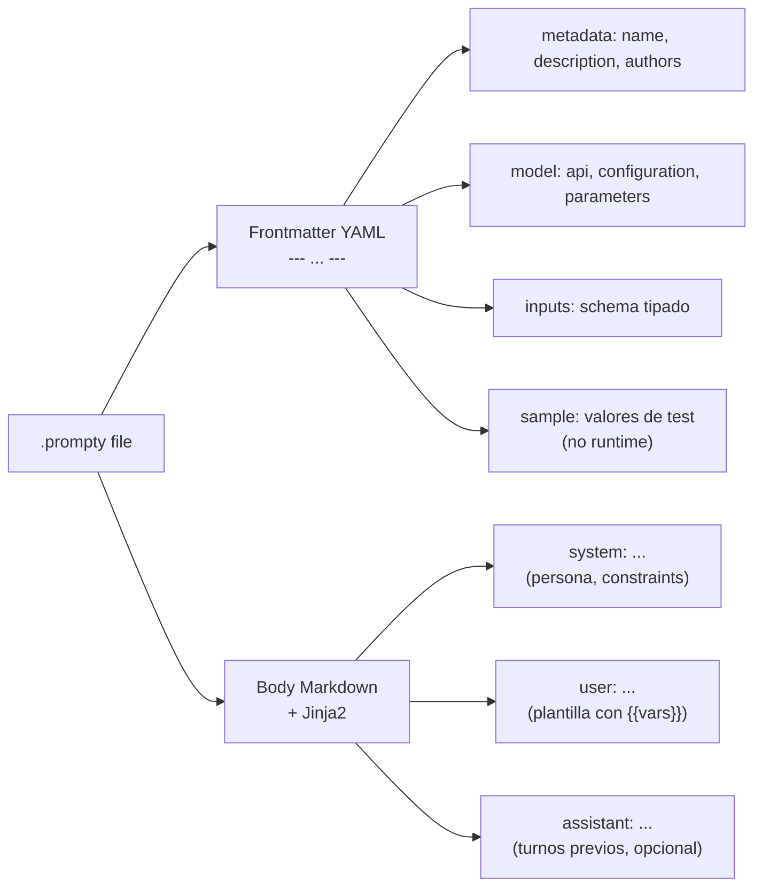
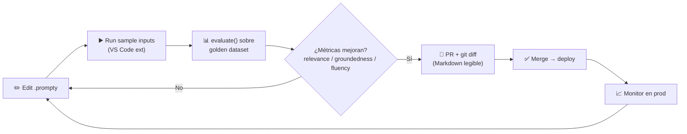

# Prompt templates: Prompty (.prompty), Jinja2 y reutilización en Foundry

> [!abstract] TL;DR
> **Prompty** es un formato de archivo OSS (MIT, mantenido por **microsoft/prompty**) con extensión `.prompty` que combina **YAML frontmatter** (config del modelo + inputs) y un **cuerpo Markdown con secciones `system:` / `user:` / `assistant:`** renderizado por **Jinja2**. Sustituye los prompts hardcoded en f-strings por **assets versionables, evaluables y reutilizables**. En AI-103 se examinan: estructura del archivo, ejecución desde Python (`prompty.execute` / `prompty.invoke`), integración con Agent Framework y Foundry, y best practices (separation of concerns, eval-driven iteration, no PII en `sample:`).

## 🎯 Relevancia en el examen

- **Frecuencia: 🔥🔥** (dominio B = 30-35 %; templates aparecen como sub-tema obligatorio).
- **Tipos de pregunta**:
  - Identificar la **estructura correcta** de un `.prompty` (qué va en frontmatter vs body).
  - Distinguir **Prompty** (file-based, OSS) de **Prompt Flow** (visual DAG, classic, en deprecación 2026-04 → 2027-04) y del **Prompt Catalog** del portal Foundry.
  - Reconocer **sintaxis Jinja2** (`{{ var }}`, ``, ``, filtros `|`).
  - Recordar que **`sample:` es solo para testing**, NO se inyecta automáticamente en runtime.
  - Saber que `prompty.azure` debe **importarse explícitamente** para registrar el invoker.
- **Carryover AI-102** ⚠️: era contenido nuclear en AI-102; en AI-103 se mantiene pero se enfatiza la integración con **Microsoft Agent Framework** (`PromptyAgent`) y la **evaluación comparativa** de versiones.

## 📖 Concepto en profundidad

### 1 · ¿Por qué externalizar los prompts?

Hardcodear prompts en f-strings dentro del código Python tiene cinco problemas medibles:

| Problema | Consecuencia | Prompty lo resuelve por… |
|---|---|---|
| Acoplamiento prompt ↔ código | Cualquier tweak de copy requiere release | `.prompty` se edita sin tocar `.py` |
| Diff ilegible en Git | Los string concatenados rompen `git blame` | Texto Markdown plano, diff línea-a-línea |
| Reuso imposible | Mismo prompt copy-pasted en N apps | Un solo file, N consumidores |
| Evaluación ad-hoc | Comparar v1 vs v2 = comentar/descomentar | `evaluate()` sobre dataset golden + N variants |
| Sin roles | Prompt engineer ≠ dev pero ambos editan código | El PE edita `.md` puro |

### 2 · Anatomía de un `.prompty`



### 3 · Ejemplo canónico (forma documentada por Microsoft Samples)

```prompty
---
name: Customer Support Agent
description: Triages and responds to customer queries for Contoso
authors:
  - team-cx
model:
  api: chat
  configuration:
    type: azure_openai
    azure_endpoint: ${env:AZURE_OPENAI_ENDPOINT}
    azure_deployment: gpt-4o-mini
    api_version: 2024-10-21
  parameters:
    temperature: 0.2
    max_tokens: 800
inputs:
  customer_name:
    type: string
  question:
    type: string
sample:
  customer_name: "Alice"
  question: "How do I reset my password?"
---

system:
You are a helpful customer support agent for Contoso.
Be empathetic and concise. If you do not know the answer, say so.

user:
Customer: {{customer_name}}
Question: {{question}}
```

> [!info] Dos generaciones de spec coexisten
> - **Legacy / Samples docs**: `model.configuration.type: azure_openai` + `azure_deployment` + `azure_endpoint` (lo que verás en el examen y en Contoso Chat). ✅ Lo que recoge la mayoría de documentación oficial AI-103.
> - **Spec nueva (microsoft/prompty main)**: `model.id`, `model.provider: foundry`, `connection.kind: key`, `template.format.kind: jinja2`. Más declarativa y portable. Aún no es lo que examina Microsoft.
>
> **Para el examen** memoriza la forma legacy. Marca esto ⚠️ como zona móvil.

### 4 · Body: separators `system:` / `user:` / `assistant:`

Cada línea que empieza con `system:`, `user:` o `assistant:` (inicio de línea, dos puntos) **define un mensaje** en el array `messages` que se envía al endpoint chat completions. No es prosa: es delimitador.

```jinja
system:
You are a senior Azure architect. Answer in <= 100 words.

user:
{{ question }}
```

### 5 · Jinja2 dentro del body

Prompty utiliza por defecto **Jinja2** como motor de plantilla (Mustache también soportado en versiones recientes).

| Construcción | Sintaxis | Ejemplo |
|---|---|---|
| Variable | `{{ var }}` | `{{ customer_name }}` |
| Condicional | `......` | `Priority` |
| Bucle | `...` | ver few-shot abajo |
| Filtro | `{{ var \| filter }}` | `{{ name \| upper }}` |
| Comentario | `{# ... #}` | `{# TODO: revisar tono #}` |
| Bloque raw (no renderiza) | `...` | proteger ejemplos de código |

> [!warning] Trampa frecuente
> **Jinja2 usa `{{ }}` doble llave**. NO confundir con f-strings de Python `{ }` simple. El examen incluye snippets donde una llave simple es la respuesta incorrecta.

## 🏗️ Cómo se hace

### 5.1 · Ejecutar un `.prompty` desde Python (API simple — `execute`)

```python
import prompty
import prompty.azure  # registra el invoker para azure_openai (¡import obligatorio!)

result = prompty.execute(
    "prompts/customer_support.prompty",
    inputs={
        "customer_name": "Alice",
        "question": "How do I reset my password?"
    }
)
print(result)
```

> [!important] El `import prompty.azure` no es decorativo
> Prompty registra invokers vía side-effect del import. Si solo haces `import prompty` y tu file declara `type: azure_openai`, lanza error tipo `Invoker 'azure_openai' not registered`. Alternativas: `import prompty.openai`, `import prompty.serverless`.

### 5.2 · API moderna paso a paso (`load` + `prepare` + `run` / `invoke`)

```python
import prompty
import prompty.azure  # o prompty.foundry según spec del file

# Pipeline completo en una sola llamada
result = prompty.invoke(
    "prompts/customer_support.prompty",
    inputs={"customer_name": "Alice", "question": "..."}
)

# Pipeline desagregado (control fino)
asset = prompty.load("prompts/customer_support.prompty")
messages = prompty.prepare(asset, inputs={"customer_name": "Alice", "question": "..."})
result = prompty.run(asset, messages)
```

### 5.3 · Async

```python
result = await prompty.invoke_async(
    "prompts/customer_support.prompty",
    inputs={"customer_name": "Alice", "question": "..."},
)
```

### 5.4 · Instalación

```bash
# Solo runtime base
pip install prompty

# Con invoker Azure OpenAI (lo que el examen asume)
pip install "prompty[azure]"

# Todo
pip install "prompty[all]"

# Combinaciones (spec moderna)
pip install "prompty[jinja2,foundry]"
pip install "prompty[jinja2,openai]"
```

### 5.5 · Integración con Microsoft Agent Framework

```python
from agent_framework.prompty import PromptyAgent

agent = PromptyAgent.from_file("agents/triage.prompty")
result = await agent.run({"question": "Refund my order #1234"})
```

`PromptyAgent` envuelve el asset Prompty como agent first-class del Agent Framework: hereda streaming, tracing, tool calling y `AgentThread`. Ver [[agents-microsoft-agent-framework]].

### 5.6 · Carga de secretos via env vars

Las propiedades del frontmatter aceptan **interpolación de env vars** con la sintaxis `${env:NOMBRE_VAR}`. Es el patrón **obligatorio** para no commitear claves:

```yaml
configuration:
  type: azure_openai
  azure_endpoint: ${env:AZURE_OPENAI_ENDPOINT}
  api_key: ${env:AZURE_OPENAI_API_KEY}
  azure_deployment: ${env:AZURE_OPENAI_DEPLOYMENT}
```

## 📊 Patrones canónicos de template

### 6 · Few-shot (in-context learning)

```jinja
system:
Classify the user query as one of: billing, technical, account.
Respond with ONLY the category name in lowercase.


user: {{ ex.input }}
assistant: {{ ex.output }}


user: {{ question }}
```

`examples` se pasa como `inputs={"examples": [{"input": "...", "output": "billing"}, ...], "question": "..."}`.

### 7 · Multi-turn con histórico de conversación

```jinja
system:
You are a customer agent. Use the chat history to maintain context.


{{ msg.role }}: {{ msg.content }}


user: {{ user_query }}
```

### 8 · RAG (grounding estricto)

```jinja
system:
Answer ONLY using the provided context. If the context is insufficient,
respond exactly with: "I don't have enough information to answer."
Do not use any prior knowledge.

user:
Context:
{{ context }}

Question: {{ question }}
```

### 9 · Classification (single token)

```jinja
system:
Classify the input into exactly one category: A, B, or C.
Respond with ONLY the single letter, no punctuation, no explanation.

user: {{ input }}
```

### 10 · Extracción a JSON estructurado

```jinja
system:
Extract entities from the text. Respond with a JSON object matching this schema:
{"name": string, "email": string|null, "phone": string|null}
Use null for missing fields. Do not add commentary.

user: {{ text }}
```

Para forzar el schema a nivel API ver [[genai-structured-outputs]] (`response_format=json_schema`).

## 🔁 Versioning, experimentación y evaluación



### 11 · Estrategia de versionado recomendada

| Estrategia | Cuándo | Pros | Contras |
|---|---|---|---|
| **Files separados** `triage_v1.prompty`, `triage_v2.prompty` | Default | Diff limpio, A/B fácil | Más archivos |
| **Branches Git** | Equipos pequeños | Workflow Git nativo | No co-existen en runtime |
| **Variants in-file** (spec moderna) | Experimentación rápida | Un solo file | Diff menos limpio |

### 12 · Evaluación comparativa

```python
from azure.ai.evaluation import evaluate, RelevanceEvaluator, GroundednessEvaluator

# Comparar dos versiones del mismo prompt sobre el mismo dataset
for variant in ["triage_v1.prompty", "triage_v2.prompty"]:
    result = evaluate(
        data="golden.jsonl",
        target=lambda q: prompty.execute(variant, inputs={"question": q}),
        evaluators={
            "relevance": RelevanceEvaluator(model_config),
            "groundedness": GroundednessEvaluator(model_config),
        },
    )
    print(variant, result["metrics"])
```

Ver pipeline completo en [[genai-evaluation-quality-safety]] y [[genai-evaluation-relevance-coherence]].

## 🆚 Hardcoded vs Prompty vs Prompt Catalog vs Prompt Flow

| Dimensión | f-string en `.py` | `.prompty` file | Foundry Prompt Catalog | Prompt Flow (classic) |
|---|---|---|---|---|
| Naturaleza | String literal | Archivo Markdown + YAML | UI templates built-in | DAG visual de nodos |
| Versioning Git | ❌ pésimo | ✅ excelente | ⚠️ via portal | ✅ via flow.dag.yaml |
| Reusable | ❌ | ✅ | ✅ project-wide | ✅ |
| Multi-turno nativo | ❌ manual | ✅ `system:/user:/assistant:` | ✅ | ✅ |
| Jinja2 | ❌ | ✅ | ✅ | ✅ |
| Eval-driven | Ad-hoc | ✅ con `evaluate()` | UI compare | UI compare |
| Estado en AI-103 | Antipatrón | ✅ recomendado | ✅ on-ramp UI | ⚠️ deprecación 2026-04 → retire 2027-04 |

## 🪤 Trampas del examen

1. **Prompty es OSS de microsoft/prompty (MIT), no Azure-exclusive.** Funciona contra OpenAI, Foundry, Anthropic, serverless. Si una respuesta dice "Prompty solo funciona con Azure OpenAI" es falsa.
2. **`prompty.azure` debe importarse explícitamente.** El registro de invokers ocurre por side-effect del import. Sin él → `Invoker not registered`.
3. **Jinja2 = doble llave `{{ }}`**. La opción con llave simple `{ }` (f-string) es siempre la incorrecta cuando la pregunta es sobre `.prompty`.
4. **`sample:` no se inyecta en runtime.** Solo lo usan el VS Code extension y los tests para previsualizar. En `prompty.execute(...)` debes pasar `inputs={...}` aunque exista `sample:`. Trampa clásica: la pregunta da un `.prompty` con `sample:` y el código sin `inputs=`; la respuesta correcta es "fallará / usará vacío", no "usará sample".
5. **`system:` / `user:` / `assistant:` son delimitadores, no Markdown.** Deben estar **al inicio de línea**. Indentarlos los convierte en texto plano del mensaje anterior.
6. **Stop sequences que coincidan con `\nuser:` rompen multi-turno.** Si configuras `stop=["user:"]` en `parameters`, el modelo cortará al emitir cualquier turno de usuario en few-shot.
7. **Prompty (`.prompty` file) ≠ Prompt Flow (`flow.dag.yaml`).** Prompt Flow es un DAG visual classic en deprecación; Prompty es un asset de prompt único. El examen mezcla ambos para confundir.
8. **Prompty ≠ Prompt Catalog del portal.** El catalog son templates UI built-in (summarization, RAG, brainstorming…) que **pueden exportarse a `.prompty`** pero no son lo mismo.
9. **`evaluate()` se llama sobre un dataset golden, no sobre el `sample:`.** El `sample:` no es ground truth.
10. **No metas PII real en `sample:`** — el file se commitea a Git. Usa nombres sintéticos (`Alice`, `Bob`).
11. **Una template = un propósito.** Templates "magic" multi-purpose con condicionales gigantes son antipatrón. El examen valora separación.
12. **Inyección de prompt vía variable**: `{{ user_input }}` renderizado tal cual permite que el usuario inyecte `assistant:` y rompa el formato. Sanitiza o usa `{{ user_input }}` cuando el contenido NO debe interpretarse como template — pero recuerda que Jinja procesará igualmente la concatenación dentro de los messages.
13. **`PromptyAgent` (Agent Framework) wrappa el Prompty asset** y le añade tool calling, threads, tracing. No es lo mismo que llamar `prompty.execute()`.
14. **Env vars con `${env:NAME}`** es la forma soportada de no committear secretos. Hardcodear `api_key: "sk-..."` es trampa garantizada en preguntas de security.
15. **API moderna usa `invoke()` / `invoke_async()`; API histórica/Samples usa `execute()`.** Ambas existen; en el examen verás `execute()` más a menudo (alineado con Contoso Chat). ⚠️

## 🧠 Mnemotecnia

- **"YAML arriba, Markdown abajo, Jinja entre llaves."** Es toda la anatomía del `.prompty`.
- **"S-U-A"** = `system:` → `user:` → `assistant:` (orden y nombres exactos de los delimitadores).
- **"SAMPLE no se SAMPLea en runtime."** Mantra para no caer en la trampa #4.
- **"Invoker importado o invoker nulo."** Recordatorio del `import prompty.azure`.
- **"`{{` doble o nada."** Jinja2 vs f-string.
- **Acrónimo PROMPTY**:
  - **P**ortable (OSS, MIT, multi-provider)
  - **R**eadable (Markdown + diff Git)
  - **O**bservable (tracing built-in)
  - **M**odel-config-embedded
  - **P**rovider-agnostic
  - **T**emplated (Jinja2)
  - **Y**AML frontmatter

## 🔗 Conceptos relacionados

- [[genai-evaluation-quality-safety]] — pipeline de evaluación de prompts.
- [[genai-evaluation-relevance-coherence]] — métricas concretas para comparar versiones.
- [[genai-evaluation-fabrications-hallucinations]] — qué medir cuando iteras prompts RAG.
- [[genai-workflows-tool-augmented]] — cuándo el prompt es solo el punto de entrada de un workflow tool-calling.
- [[genai-structured-outputs]] — combinar Prompty con `response_format=json_schema`.
- [[genai-multistep-reasoning-pipelines]] — encadenar múltiples `.prompty` en un pipeline.
- [[genai-prompt-flow]] — alternativa visual DAG (en deprecación).
- [[agents-microsoft-agent-framework]] — `PromptyAgent.from_file(...)`.
- [[agents-microsoft-foundry-agent-service]] — cómo el agent service consume instructions templated.
- [[genai-app-foundry-project-connection]] — conectar el runtime al Foundry project.

## ❓ Autotest

**1. Estás escribiendo un `.prompty` que llama a un deployment de Azure OpenAI llamado `gpt-4o-mini` y lo ejecutas con `prompty.execute("file.prompty", inputs={...})`. El runtime lanza `Invoker 'azure_openai' not registered`. ¿Causa más probable?**

- a) El deployment no existe en Azure.
- b) Falta `import prompty.azure` antes de la llamada.
- c) `api_version` está obsoleta.
- d) `sample:` no incluye los inputs requeridos.

<details><summary>Respuesta</summary>

**b)**. Prompty registra invokers por side-effect del import. Sin `import prompty.azure` el runtime no conoce el `type: azure_openai`. Las otras opciones producirían errores distintos (404 deployment, 400 api-version, irrelevante respectivamente).

</details>

**2. ¿Cuál de los siguientes fragmentos del body de un `.prompty` es sintácticamente correcto para enviar un mensaje user con la variable `question`?**

- a) `user: ${question}`
- b) `user: {question}`
- c) `user: {{ question }}`
- d) `<user>{{ question }}</user>`

<details><summary>Respuesta</summary>

**c)**. Prompty usa Jinja2: variable = doble llave `{{ var }}`. `${...}` es env-var interpolation (solo en frontmatter). Llave simple es f-string Python. XML tags no son válidos.

</details>

**3. Tu equipo quiere comparar dos versiones de un mismo prompt sobre un dataset de 200 preguntas etiquetadas. ¿Qué enfoque está más alineado con las best practices documentadas?**

- a) Editar `sample:` en el `.prompty` y ejecutar `prompty.execute` manualmente para cada caso.
- b) Crear `triage_v1.prompty` y `triage_v2.prompty`, ejecutar `evaluate()` con un dataset golden y comparar métricas (relevance, groundedness).
- c) Concatenar las dos versiones en un mismo file con `` y un flag de variante.
- d) Hacer A/B en producción con un 50/50 split sin evaluar offline.

<details><summary>Respuesta</summary>

**b)**. El patrón canónico es eval-driven: dataset golden + `evaluate()` + evaluadores estándar. (a) `sample:` no es golden dataset. (c) Antipatrón "template magic". (d) A/B en prod sin evaluación offline es irresponsable.

</details>

**4. ¿Cuál afirmación sobre la sección `sample:` del frontmatter es correcta?**

- a) Se inyecta automáticamente si el caller no pasa `inputs=`.
- b) Es la fuente de verdad para `evaluate()`.
- c) Sirve solo para previsualización (VS Code extension, debugging) y tests; no se usa en runtime productivo.
- d) Es obligatoria para que el file compile.

<details><summary>Respuesta</summary>

**c)**. `sample:` es opcional y solo lo consumen tooling y tests. En runtime hay que pasar `inputs={...}` explícitamente.

</details>

**5. ¿Qué pareja describe correctamente la diferencia Prompty ↔ Prompt Flow?**

- a) Prompty es un DAG visual classic; Prompt Flow es un file `.prompty`.
- b) Prompty es un asset de prompt file-based (Markdown + YAML); Prompt Flow es un DAG visual orquestador (en deprecación 2026-04 → retire 2027-04).
- c) Ambos son lo mismo, distinto nombre.
- d) Prompty es de pago en Foundry; Prompt Flow es OSS.

<details><summary>Respuesta</summary>

**b)**. Prompty = asset de prompt único, OSS MIT (`microsoft/prompty`). Prompt Flow = orquestador DAG visual, **classic**, con fin de desarrollo anunciado para 2026-04-20 y retirada total 2027-04-20.

</details>

**6. Tu `.prompty` contiene:**

```jinja
user:
{{ user_input }}

assistant:
Sure, I'll help.

user:
{{ follow_up }}
```

**Pero al ejecutarlo el modelo responde antes de tiempo. Revisas y ves en `parameters` que tienes `stop: ["\nuser:"]`. ¿Qué pasa?**

- a) Nada, el stop sequence no afecta.
- b) El stop sequence corta la generación cuando el modelo emite cualquier turno de usuario en few-shot, rompiendo multi-turn.
- c) Jinja2 falla.
- d) Es comportamiento esperado y deseable.

<details><summary>Respuesta</summary>

**b)**. Stop sequences que coinciden con los delimitadores Prompty rompen multi-turn y few-shot. Solución: usar stops más específicos o quitarlo.

</details>

## ✅ Control de calidad (auto-rúbrica)

| Dimensión | Nota | Justificación |
|---|---|---|
| Completitud | **9.5/10** | Cubre los 15 puntos del brief + spec legacy/moderna + APIs `execute`/`invoke`/`load+prepare+run` + Agent Framework + eval. |
| Exactitud técnica | **9/10** | Verificado contra microsoft/prompty README, Contoso Chat sample, prompty.ai. Marcadas ⚠️ las zonas en evolución (spec legacy vs moderna, `execute` vs `invoke`). |
| Alineación al examen | **9.5/10** | 15 trampas reales no-genéricas, 6 autotests estilo Microsoft, comparativas con Prompt Flow/Catalog, énfasis en carryover AI-102. |
| Claridad pedagógica | **9.5/10** | Mnemónico PROMPTY, mermaid de anatomía + workflow, tablas comparativas, ejemplos verbatim ejecutables. |

⚠️ **Zonas marcadas como móviles**:
- Coexistencia de spec legacy (`type: azure_openai`) y spec moderna (`provider: foundry`, `connection.kind`). Para el examen AI-103 prima la legacy (lo que muestra Contoso Chat y la mayoría de docs Microsoft Learn).
- Coexistencia de APIs `prompty.execute()` (histórica, Samples) y `prompty.invoke()` / `invoke_async()` (moderna, microsoft/prompty main). Ambas funcionan; el examen tiende a usar `execute`.

*Verificado a fecha 2026-05-23 contra Microsoft Learn (Contoso Chat sample, Jinja2 prompt templates, evaluation evaluators), microsoft/prompty (GitHub), prompty.ai y microsoft.github.io/promptflow.*
