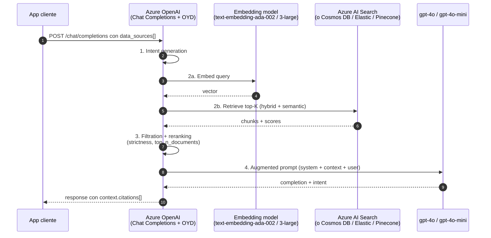
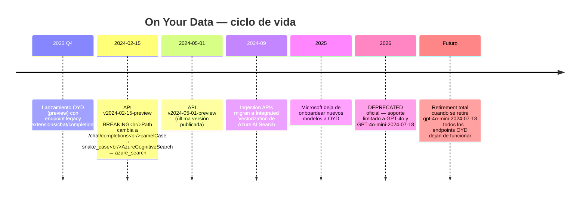
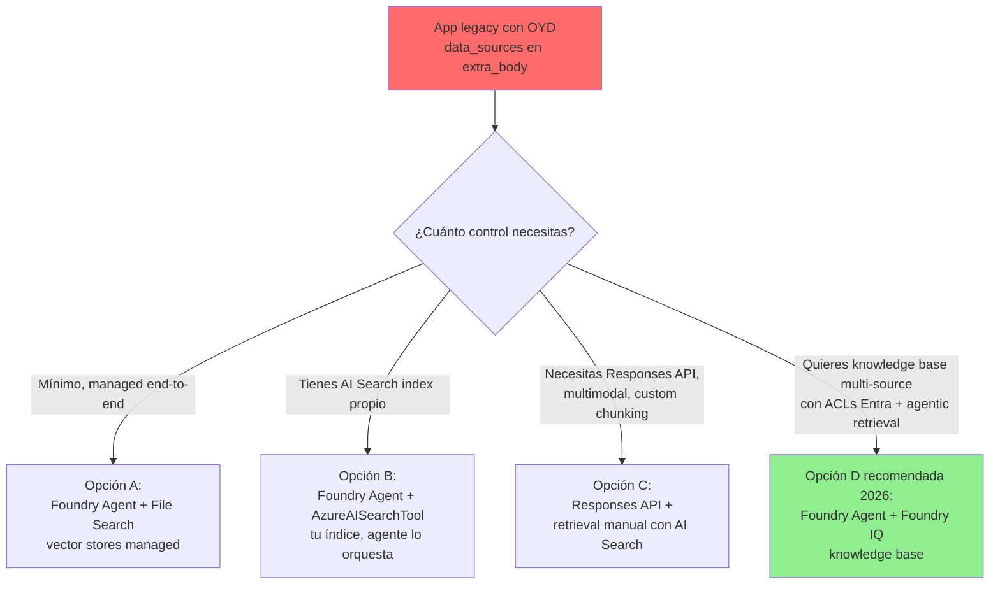
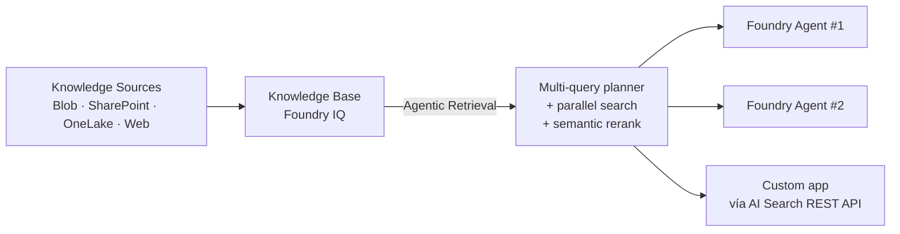
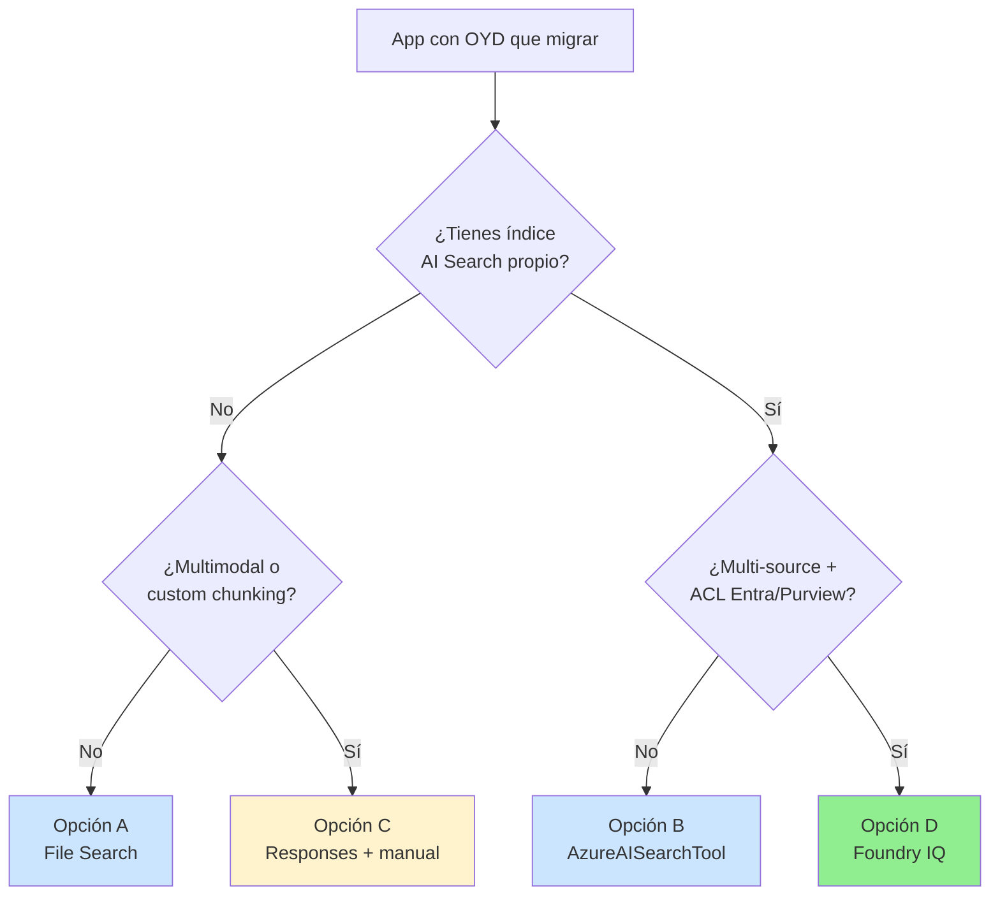

# Azure OpenAI On Your Data (OYD) — feature DEPRECATED de RAG built-in

> [!danger] STATUS OFICIAL (verbatim Microsoft Learn 2026-05-23)
> *"Azure OpenAI On Your Data is **deprecated and approaching retirement**. Microsoft has stopped onboarding new models to Azure OpenAI On Your Data."*
> Solo sigue funcionando con **GPT-4o (versions 2024-05-13, 2024-08-06, 2024-11-20)** y **GPT-4o-mini (2024-07-18)**. *"Once this model retires, all Azure OpenAI On Your Data API endpoints and supported data source connectors stop functioning."*
> Microsoft recomienda migrar a **Foundry Agent Service + Foundry IQ** (knowledge bases con agentic retrieval).

> [!abstract] TL;DR
> **On Your Data (OYD)** fue la forma "sin código" de hacer RAG: añadías un parámetro `data_sources` a una llamada de Chat Completions y Azure OpenAI hacía el embedding, la búsqueda en Azure AI Search, la inyección de contexto, la generación y las citas — todo en una única llamada. **Hoy está deprecada**: no se acepta en Responses API, no se onboardean nuevos modelos, y muere cuando muera gpt-4o-mini. La migración oficial es **Foundry Agent Service + Foundry IQ knowledge bases** (managed) o **AzureAISearchTool** dentro de un agente (custom) o **Responses API + retrieval manual** (full control). En el examen AI-103 aparece **como distractor** ("no la recomiendes en escenarios greenfield") y como escenario de **modernización de apps legacy**.

---

## 🎯 Relevancia en el examen

| Tipo de pregunta | Probabilidad | Cómo se manifiesta |
|---|---|---|
| Distractor en escenario greenfield (2026+) | 🔥🔥🔥 | "¿Cómo construyes un nuevo copiloto RAG?" → OYD es la **respuesta incorrecta**; correcta = Foundry Agent + File Search / AI Search tool. |
| Modernización de app legacy | 🔥🔥 | "Tienes un app con `data_sources` en `extra_body`. ¿Cuál es el migration path con menor refactor?" |
| Comparativa OYD vs Foundry Agent Service | 🔥🔥 | Identificar qué features perdías con OYD (Responses API, multimodal, custom chunking). |
| Reconocer el endpoint legacy | 🔥 | Diferenciar `/extensions/chat/completions` (pre 2024-02-15-preview) vs `/chat/completions` (post). |
| Citaciones y schema `context.citations` | 🔥 | Identificar dónde viven las citas en la response. |

**Peso real:** dentro del 30-35 % del dominio B, este sub-tema vale ~1-2 preguntas pero son **fáciles de fallar** si no reconoces el estatus deprecated.

---

## 📖 Concepto en profundidad

### Qué fue On Your Data (definición oficial)

> *"Azure OpenAI On Your Data enables you to run advanced AI models such as GPT-35-Turbo and GPT-4 on your own enterprise data without needing to train or fine-tune models."* — Microsoft Learn

OYD era una **extensión del endpoint Chat Completions** de Azure OpenAI que internalizaba el patrón **R-A-G** (Retrieve-Augment-Generate) dentro del servicio:



**Las cuatro fases internas** (verbatim docs):

1. **Intent generation** — interpreta la query.
2. **Retrieval** — semantic / vector / keyword / hybrid contra Azure AI Search.
3. **Filtration and reranking** — aplica `strictness` y `top_n_documents`.
4. **Response generation** — manda al LLM con sistema + contexto + user.

### Línea de tiempo de la deprecación



### Modelos soportados (lista cerrada — no se ampliará)

| Familia | Versiones permitidas |
|---|---|
| GPT-4o | `2024-05-13`, `2024-08-06`, `2024-11-20` |
| GPT-4o-mini | `2024-07-18` ⚠️ kill-switch del feature completo |
| GPT-5 / GPT-4.1 / o-series | ❌ **No soportados nunca** |
| Responses API | ❌ **No soportada** (sólo Chat Completions) |

### Data sources soportados (verbatim docs)

| Data source | Estado | Notas clave |
|---|---|---|
| Azure AI Search | GA | Usar índice existente o que OYD lo cree (`Upload files`, `Blob`, `URL`). Requiere CORS `*` y al menos un `searchable field`. Sin `complex fields`. |
| Vector DB en Azure Cosmos DB for MongoDB vCore | GA | Solo vCore-based. Sólo vector search con embedding model AOAI. |
| Elasticsearch | Preview | — |
| Pinecone | Preview | — |
| Upload files (local) | Preview | Auto-crea Blob + AI Search index. |
| Azure Blob Storage | Preview | Auto-ingestion + schedule. Único con automatic index refresh. |
| URL / Web address | Preview | HTTPS pública, ≤ 5 MB, 1 layer nested, ≤ 20 links. Guardado en container `webpage-<index>`. |
| **Cosmos DB NoSQL** | ❌ **NO soportado por OYD** (sólo MongoDB vCore) — trampa de examen frecuente |

### Tipos de búsqueda (`query_type`)

| `query_type` | Backend |
|---|---|
| `simple` | Keyword (Lucene). |
| `semantic` | Semantic ranker (requiere tier ≥ Basic). |
| `vector` | Vector con `embedding_dependency`. |
| `vector_simple_hybrid` | Vector + keyword. |
| `vector_semantic_hybrid` | Vector + keyword + semantic — **recomendado por defecto**. |

> [!tip] Intelligent search
> Si tienes embedding model y semantic enabled, OYD **automáticamente** elige `vector_semantic_hybrid` aunque pongas otro valor. Si sólo tienes semantic, elige `semantic`. Si nada, `simple`.

### Document-level access control

Sólo si data source = **Azure AI Search** existente. Usa los **security filters** de AI Search basados en Microsoft Entra **group membership** del caller. No funciona con Blob, URL, Mongo, Pinecone, Elastic.

### Authentication options

- **System-assigned managed identity** (por defecto) — requiere roles:
  - AOAI → AI Search: `Search Index Data Reader` + `Search Service Contributor`.
  - User → AOAI: `Cognitive Services OpenAI User`.
- **API key** — auto-populated por el portal.
- Mezclas posibles entre las 3 conexiones (AOAI, AI Search, Blob) — patchwork doloroso.

---

## 🏗️ Cómo se hace (legacy — sólo si modernizas algo)

### Endpoint y API version

```http
POST {endpoint}/openai/deployments/{deployment-id}/chat/completions?api-version=2024-05-01-preview
```

> [!warning] BREAKING CHANGE histórico
> - **Antes** de `2024-02-15-preview`: el endpoint era `/extensions/chat/completions` con body en `camelCase` y type `AzureCognitiveSearch`.
> - **Desde** `2024-02-15-preview`: endpoint **estándar** `/chat/completions`, body en `snake_case`, type `azure_search`. Citations y intent movidas a `assistant.message.context` (root level).
> Si ves código con `/extensions/chat/completions` → es **pre-2024**, doblemente legacy.

### Python SDK — patrón canónico oficial (Microsoft Learn verbatim, adaptado)

```python
import os
from openai import AzureOpenAI
from azure.identity import DefaultAzureCredential, get_bearer_token_provider

endpoint = os.environ["AzureOpenAIEndpoint"]                 # https://<resource>.openai.azure.com
deployment = os.environ["ChatCompletionsDeploymentName"]      # ej. "gpt-4o"
search_endpoint = os.environ["SearchEndpoint"]
search_index = os.environ["SearchIndex"]

# Auth con managed identity (recomendado oficial)
token_provider = get_bearer_token_provider(
    DefaultAzureCredential(),
    "https://ai.azure.com/.default"      # scope ai.azure.com (no cognitiveservices)
)

client = AzureOpenAI(
    azure_endpoint=endpoint,
    azure_ad_token_provider=token_provider,
    api_version="2024-05-01-preview",
)

completion = client.chat.completions.create(
    model=deployment,
    messages=[
        {"role": "user", "content": "What is our return policy?"}
    ],
    extra_body={
        "data_sources": [
            {
                "type": "azure_search",
                "parameters": {
                    "endpoint": search_endpoint,
                    "index_name": search_index,
                    "authentication": {
                        "type": "system_assigned_managed_identity"
                    },
                    "query_type": "vector_semantic_hybrid",
                    "embedding_dependency": {
                        "type": "deployment_name",
                        "deployment_name": "text-embedding-3-large"
                    },
                    "in_scope": True,
                    "strictness": 3,
                    "top_n_documents": 5,
                    "role_information": "You are a helpful HR assistant. Answer ONLY using the provided documents."
                }
            }
        ]
    }
)

# Render citations
content = completion.choices[0].message.content
context = completion.choices[0].message.context     # extension OYD del assistant message
for i, citation in enumerate(context["citations"]):
    tag = f"[doc{i + 1}]"
    snippet = citation["content"]
    title   = citation["title"]
    path    = citation["filepath"]
    chunk   = citation["chunk_id"]
    content = content.replace(tag, f"<a title='{title}: {snippet}'>(file {path}, part {chunk})</a>")

print(content)
```

> [!important] `extra_body` ≠ parámetro nativo
> El SDK `openai` no tipa `data_sources`. Se inyecta vía **`extra_body`**. En SDKs sin `extra_body` (.NET viejo), hay que usar request raw. Trampa típica del examen.

### Parámetros del bloque `parameters` (lista completa quirúrgica)

| Param | Tipo | Default | Quirúrgico |
|---|---|---|---|
| `endpoint` | string | — | URL del data source. |
| `index_name` | string | — | Sólo para `azure_search`. |
| `authentication.type` | enum | `system_assigned_managed_identity` | `api_key` \| `system_assigned_managed_identity` \| `user_assigned_managed_identity` \| `access_token`. |
| `query_type` | enum | intelligent (auto) | Ver tabla más arriba. |
| `embedding_dependency.type` | enum | — | `deployment_name` (mismo recurso AOAI) o `endpoint` (otro recurso). |
| `embedding_dependency.deployment_name` | string | — | Nombre del deployment del embedding model. |
| `in_scope` | bool | `true` | Si `true`, **rechaza preguntas off-topic** y devuelve "I don't know". |
| `strictness` | int 1-5 | `3` | Threshold del search score. **Más alto = más estricto** (menos chunks pasan el filtro). |
| `top_n_documents` | int | `5` | Chunks que entran al prompt tras rerank. |
| `role_information` | string | — | System prompt adicional. |
| `fields_mapping` | object | auto | Mapea fields del índice a content/title/url/filepath/vector. |
| `filter` | string | — | OData filter en AI Search (`category eq 'HR'`). |
| `semantic_configuration` | string | `default` | Nombre del semantic config del índice. |

### Schema de la response (`assistant.message.context`)

```json
{
  "choices": [{
    "message": {
      "role": "assistant",
      "content": "Our return policy is 30 days [doc1]. Refunds processed in 5-7 days [doc2].",
      "context": {
        "citations": [
          {
            "content": "<chunk text>",
            "title": "Returns Policy 2025",
            "url": "https://...",
            "filepath": "policies/returns.pdf",
            "chunk_id": "0"
          }
        ],
        "intent": "<inferred user intent — IGNORAR según docs>",
        "all_retrieved_documents": [
          {
            "search_queries": ["return policy", "refund days"],
            "data_source_index": 0,
            "original_search_score": 0.82,
            "rerank_score": 3.14,
            "filter_reason": null
          }
        ]
      }
    }
  }]
}
```

> [!tip] `filter_reason` quirúrgico
> - `score` → descartado por `strictness` (fallo del search threshold).
> - `rerank` → descartado por `top_n_documents` (no entró al top tras rerank).
> - ausente → entró al prompt.

---

## 🚪 Migration paths (las tres opciones oficiales)



### Opción A — Foundry Agent Service + File Search (más simple)

Para casos sencillos: documentos corporativos, sin índice propio.

```python
from azure.ai.projects import AIProjectClient
from azure.ai.agents.models import FileSearchTool
from azure.identity import DefaultAzureCredential

project_client = AIProjectClient(
    endpoint="https://<your-project>.services.ai.azure.com/api/projects/<project>",
    credential=DefaultAzureCredential()
)

# 1. Crear vector store y subir ficheros
vector_store = project_client.agents.vector_stores.create_and_poll(
    name="hr-docs",
    file_ids=[]
)
file = project_client.agents.files.upload_and_poll(
    file_path="./policy.pdf", purpose="assistants"
)
project_client.agents.vector_stores.files.create_and_poll(
    vector_store_id=vector_store.id, file_id=file.id
)

# 2. Crear agente con File Search
agent = project_client.agents.create_agent(
    model="gpt-4.1",
    name="hr-rag-agent",
    instructions="Use file_search to answer HR questions citing sources.",
    tools=FileSearchTool(vector_store_ids=[vector_store.id]).definitions,
    tool_resources=FileSearchTool(vector_store_ids=[vector_store.id]).resources
)
```

Cross-ref: [[agents-tools-knowledge-stores]].

### Opción B — Foundry Agent + Azure AI Search tool

Cuando ya tienes índice propio (caso típico al migrar OYD).

```python
from azure.ai.agents.models import (
    AzureAISearchTool, AzureAISearchToolResource, AISearchIndexResource
)

# Connection a AI Search registrada en el Foundry project
search_conn = project_client.connections.get("my-search-connection")

search_tool = AzureAISearchTool(
    azure_ai_search=AzureAISearchToolResource(
        indexes=[
            AISearchIndexResource(
                index_connection_id=search_conn.id,
                index_name="company-docs",
                query_type="vector_semantic_hybrid",
                top_k=5,
                filter=""
            )
        ]
    )
)

agent = project_client.agents.create_agent(
    model="gpt-4.1",
    name="rag-search-agent",
    instructions="Use the search tool to ground answers and cite sources.",
    tools=search_tool.definitions,
    tool_resources=search_tool.resources
)
```

Cross-ref: [[agents-tools-search-integration]], [[search-as-agent-tool]].

### Opción C — Responses API + retrieval manual (full control)

Cuando necesitas multimodal, custom chunking, custom citations o lógica de re-ranking propia.

```python
from azure.search.documents import SearchClient
from azure.identity import DefaultAzureCredential
from openai import AzureOpenAI

search = SearchClient(
    endpoint="https://my-search.search.windows.net",
    index_name="company-docs",
    credential=DefaultAzureCredential()
)
aoai = AzureOpenAI(
    azure_endpoint="https://my-aoai.openai.azure.com",
    azure_ad_token_provider=token_provider,
    api_version="2025-04-01-preview"     # versión Responses API
)

# 1. Retrieval manual con hybrid
hits = search.search(
    search_text=user_query,
    query_type="semantic",
    semantic_configuration_name="default",
    top=5,
    vector_queries=[...],                # vector híbrido
)
context = "\n\n".join(f"[doc{i+1}] {h['content']}" for i, h in enumerate(hits))

# 2. Responses API (NO Chat Completions)
resp = aoai.responses.create(
    model="gpt-5",
    input=[
        {"role": "system",
         "content": f"Answer ONLY from context. Cite as [docN].\n\nContext:\n{context}"},
        {"role": "user", "content": user_query}
    ]
)
print(resp.output_text)
```

Cross-ref: [[genai-rag-pattern-end-to-end]], [[search-hybrid-search]].

### Opción D (recomendada 2026) — Foundry IQ knowledge base + Foundry Agent Service

La **vía oficial** que Microsoft Learn recomienda explícitamente para migrar OYD:

> *"We recommend that you migrate Azure OpenAI On Your Data workloads to **Foundry Agent Service** with **Foundry IQ** to retrieve content and generate grounded answers from your data."* — Microsoft Learn

**Foundry IQ** es una **capa de conocimiento managed** que envuelve:

- **Knowledge sources**: conexiones a Blob, SharePoint, OneLake, web pública…
- **Knowledge base**: top-level resource que orquesta agentic retrieval con un LLM planner (sub-queries, parallel search, semantic rerank).
- **Permission-aware**: respeta ACLs y Microsoft Purview sensitivity labels.
- **Multi-agent**: una knowledge base sirve a N agentes.



---

## 📊 Comparativa OYD vs alternativas modernas

| Dimensión | On Your Data (DEPRECATED) | Foundry Agent + File Search | Foundry Agent + AI Search tool | Responses API + manual RAG | Foundry IQ knowledge base |
|---|---|---|---|---|---|
| API base | Chat Completions (legacy) | Agents API | Agents API | **Responses API** ✅ | Agents API o AI Search REST |
| Modelos soportados | sólo GPT-4o + 4o-mini-2024-07-18 | GPT-5, GPT-4.1, o-series, GPT-4o | idem | todos | todos |
| Custom chunking | ❌ | ❌ (managed) | parcial (tú indexas) | ✅ total | ✅ |
| Multimodal queries (image) | ❌ | ❌ | ❌ | ✅ | ❌ (texto) |
| ACL / permission-aware | ✅ (sólo AI Search + Entra groups) | ❌ | parcial | DIY | ✅✅ (Entra + Purview) |
| Citations automáticas | ✅ en `context.citations` | ✅ en tool output | ✅ en tool output | ❌ (DIY) | ✅ |
| Conversation state managed | ❌ (DIY) | ✅ threads | ✅ threads | ❌ | ✅ |
| Multi-source knowledge | ❌ (1 data source) | parcial | parcial | DIY | ✅ |
| Microsoft recomienda 2026 | ❌ NO | ✅ casos simples | ✅ casos con índice | ✅ full control | ✅✅ **vía oficial migración** |

### Árbol de decisión migration



---

## 🪤 Trampas del examen

1. **STATUS DEPRECATED** — Si la pregunta es greenfield ("estás diseñando un copiloto nuevo en 2026"), OYD **siempre es la respuesta incorrecta**. Correcto = Foundry Agent + File Search / AzureAISearchTool / Foundry IQ.
2. **Endpoint legacy** — `/extensions/chat/completions` sólo existió hasta `2024-02-15-preview`. Desde entonces es `/chat/completions` (estándar) con `data_sources` en el body. Si ves código con `/extensions/...` → es **doblemente legacy** (pre-breaking change). El nombre informal "endpoint /extensions" es desinformación.
3. **Sólo Chat Completions, NUNCA Responses API** — Responses API **no soporta** `data_sources`. Si la pregunta combina "Responses API" + "OYD" → respuesta incorrecta. Para Responses API hay que hacer retrieval manual.
4. **Modelos cerrados** — gpt-4o (3 versiones) + gpt-4o-mini-2024-07-18. Cualquier otra opción (gpt-5, gpt-4.1, o-series, GPT-3.5) en una pregunta sobre OYD → respuesta incorrecta. Cuando gpt-4o-mini-2024-07-18 se retire, **todo OYD muere**.
5. **`AzureCognitiveSearch` vs `azure_search`** — `AzureCognitiveSearch` es **camelCase pre-2024-02-15-preview**. Si ves `"type": "AzureCognitiveSearch"` en código → API version vieja. Actual = `"type": "azure_search"` (snake_case).
6. **`in_scope=true` ≠ "más precisión"** — `in_scope=true` significa **"rechaza preguntas off-topic"**, no que mejore la precisión del retrieval. Si lo pones `false`, el modelo puede responder con conocimiento general aunque no haya chunk relevante.
7. **`strictness` 1-5: más alto = MÁS estricto (MENOS chunks pasan)** — Es un threshold de score. `strictness=5` puede dejar la respuesta vacía si los scores son bajos. `strictness=1` deja pasar casi todo. **Default = 3**.
8. **Cosmos DB SUPPORT** — OYD soporta **Cosmos DB for MongoDB vCore**. **NO** soporta Cosmos DB for NoSQL ni Cosmos DB for PostgreSQL. Trampa típica.
9. **Document-level access control** — Sólo disponible si `data_source = azure_search` (índice existente), no funciona con Blob / URL / Mongo / Pinecone / Elastic.
10. **`citations` viven en `message.context.citations`** — No en `message.content`, no en `tool_calls`, no en `extensions`. Y `context.intent` debe **ignorarse** (verbatim docs: *"Passing back the previous intent is no longer needed. Ignore this property."*).
11. **No usa Foundry Agents** — OYD **no es un agente**. Es un endpoint extension de Chat Completions. Por eso no tiene threads, runs ni tool_calls.
12. **`embedding_dependency` obligatorio si query es vector** — Si pones `query_type=vector*` y no defines `embedding_dependency`, la llamada falla. Es la trampa típica de "habilité vector pero no embedding".
13. **Migration recomendada = Foundry IQ + Foundry Agent Service**, NO "haz custom RAG desde cero". Si la pregunta es "vía oficial de Microsoft" → Foundry IQ.
14. **OYD necesita `Cognitive Services OpenAI User`** en el caller, y **`Search Index Data Reader` + `Search Service Contributor`** del MI del recurso AOAI hacia AI Search. Trampa frecuente: confundir qué identidad tiene qué rol.
15. **CORS obligatorio si OYD inicia el índice** — `Allow Origin Type=all`, `Allowed origins=*`. Sin ello el portal falla al añadir el índice.

---

## 🧠 Mnemotecnia

- **OYD = O**ld **Y**et **D**eprecated. El nombre te delata.
- **"OYD muere con 4o-mini"** — recuerda: el día que se retire gpt-4o-mini-2024-07-18, OYD entera deja de funcionar. Es el **kill-switch**.
- **3-5-5**: `strictness=3` default, `top_n_documents=5` default, **5** tipos de query_type (simple, semantic, vector, vector_simple_hybrid, vector_semantic_hybrid).
- **S-I-T** (parámetros que más caen): **S**trictness, **I**n_scope, **T**op_n_documents.
- **"OYD = sólo Chat Completions"** — si la pregunta menciona Responses API, **descártalo automáticamente**.
- **R-A-F-G**: las 4 fases internas de OYD: **R**etrieval intent → **A**ugmented retrieval → **F**iltering/rerank → **G**eneration.
- **Migration ABCD**: **A**=File Search, **B**=AISearchTool, **C**=Responses+manual, **D**=Foundry IQ (recomendada).

---

## 🔗 Conceptos relacionados

- [[genai-rag-pattern-end-to-end]] — patrón canónico R-A-G en arquitectura moderna (Responses API).
- [[agents-tools-search-integration]] — AzureAISearchTool en Foundry Agent Service (Opción B).
- [[agents-tools-knowledge-stores]] — File Search tool y vector stores managed (Opción A).
- [[agents-microsoft-foundry-agent-service]] — el sucesor managed.
- [[search-as-agent-tool]] — cómo AI Search se integra como herramienta de agente.
- [[search-hybrid-search]] — hybrid + semantic ranker (base de retrieval moderno).
- [[plan-grounding-strategies-comparison]] — comparativa de estrategias de grounding (OYD vs alternativas).
- [[plan-retrieval-indexing-method-selection]] — decisión de método de retrieval.
- [[plan-agent-memory-tool-knowledge-services]] — knowledge services del stack AI-103.

---

## ❓ Autotest

**1.** Estás diseñando en mayo de 2026 una nueva aplicación de copiloto corporativo con RAG sobre documentos en SharePoint y respeto de permisos Entra. ¿Cuál es la **vía recomendada por Microsoft**?

- a) Azure OpenAI On Your Data con `data_sources` en Chat Completions
- b) Foundry Agent Service con Foundry IQ knowledge base
- c) Chat Completions con `/extensions/chat/completions`
- d) Responses API con tool `azure_search` y embedding `text-embedding-ada-002`

<details><summary>Respuesta</summary>

**b)**. OYD está deprecated (a y c, además c usa endpoint legacy pre-2024). Foundry IQ es la vía oficial recomendada por Microsoft Learn para migración OYD, especialmente porque integra ACLs Entra y Purview. La opción d) "Responses API con tool azure_search" no existe como tool nativa en Responses API (la integración con AI Search se hace a través de Agents API o retrieval manual).

</details>

**2.** En una llamada OYD ves esta config: `"strictness": 5, "in_scope": false, "top_n_documents": 3`. ¿Qué describe mejor el comportamiento esperado?

- a) Filtro de retrieval muy permisivo y modelo limitado al contexto
- b) Filtro de retrieval muy estricto (pocos chunks superan score) y modelo libre de responder fuera del contexto si no encuentra info
- c) Filtro estricto y respuestas limitadas al contexto, garantía cero alucinaciones
- d) Comportamiento equivalente a `strictness=1` porque `in_scope=false` lo anula

<details><summary>Respuesta</summary>

**b)**. `strictness=5` es el threshold más alto (pocos chunks pasan). `in_scope=false` permite al modelo responder con conocimiento general si no hay chunk útil. `top_n_documents=3` reduce chunks al prompt. No hay garantía cero alucinaciones (c falso). `in_scope` no anula `strictness` (d falso).

</details>

**3.** ¿Cuáles de los siguientes data sources **NO** son soportados por On Your Data?

- a) Azure AI Search index existente
- b) Azure Cosmos DB for NoSQL
- c) Azure Cosmos DB for MongoDB vCore
- d) Pinecone (preview)

<details><summary>Respuesta</summary>

**b)**. OYD soporta Cosmos DB **for MongoDB vCore** (c), pero **NO** Cosmos DB for NoSQL ni for PostgreSQL. AI Search (a), MongoDB vCore (c) y Pinecone preview (d) sí son soportados. Trampa clásica del examen.

</details>

**4.** Heredas una app con `client.chat.completions.create(...)` que usa `extra_body={"data_sources": [{"type": "AzureCognitiveSearch", ...}]}` apuntando a `/extensions/chat/completions`. ¿Cuál es la afirmación correcta?

- a) Es el patrón actual de OYD con API 2024-05-01-preview
- b) Usa API pre-2024-02-15-preview (camelCase, type viejo, endpoint extensions) — doblemente legacy
- c) Funciona con cualquier modelo GPT-5
- d) Es equivalente a usar Foundry Agent Service + File Search

<details><summary>Respuesta</summary>

**b)**. Tres pistas: (1) `AzureCognitiveSearch` es el type camelCase **pre-2024-02-15-preview** (actual = `azure_search`), (2) `/extensions/chat/completions` es el endpoint **pre-breaking change** (actual = `/chat/completions`), (3) Antes de la migración los keys eran camelCase. Es código doblemente legacy. No soporta GPT-5 (sólo GPT-4o/4o-mini-2024-07-18).

</details>

**5.** ¿Dónde encuentras las citas en la response de una llamada OYD con `2024-05-01-preview`?

- a) `response.choices[0].message.tool_calls[0].function.citations`
- b) `response.choices[0].message.context.citations`
- c) `response.choices[0].extensions.citations`
- d) `response.choices[0].message.content` parseando markdown

<details><summary>Respuesta</summary>

**b)**. Desde `2024-02-15-preview`, `citations`, `intent` y `all_retrieved_documents` viven en `assistant.message.context` (root level del context). En SDK Python: `response.choices[0].message.context["citations"]`. OYD no usa `tool_calls` (no es un agente). `extensions` era el endpoint legacy (a/c falsos). `content` sólo trae markers `[doc1]`, `[doc2]`, no las citas en sí (d falso).

</details>

**6.** ¿Cuál es el "kill-switch" de On Your Data?

- a) La retirada de Azure OpenAI Service
- b) La retirada de Azure AI Search
- c) La retirada del modelo `gpt-4o-mini-2024-07-18`
- d) La GA de Foundry IQ

<details><summary>Respuesta</summary>

**c)**. Microsoft Learn lo dice verbatim: *"Once this model retires, all Azure OpenAI On Your Data API endpoints and supported data source connectors stop functioning."* El día que `gpt-4o-mini-2024-07-18` se retire, OYD muere completamente.

</details>

---

## ✅ Control de calidad (auto-rúbrica)

| Dimensión | Nota | Justificación |
|---|---|---|
| Completitud | 9.5 / 10 | Cubre status deprecated, endpoint changes, modelos soportados, data sources, query types, params completos, schema response, 4 paths de migración, comparativa, trampas, 15 tipos de trampa, 6 preguntas. Sólo dejo fuera detalles de ingestion API que no son examinables. |
| Exactitud técnica | 9.8 / 10 | Verbatim contra Microsoft Learn (3 fuentes oficiales fetched 2026-05-23). Corregido el brief original (endpoint `/extensions/chat/completions` → es **pre-2024**, actualmente es `/chat/completions`). Citados breaking changes 2024-02-15-preview. Modelos verificados con versiones exactas. |
| Alineación al examen | 9.4 / 10 | Foco en "no recomendar en greenfield" + escenarios migración + comparativas. Trampas son las que Microsoft realmente usa (camelCase, endpoint legacy, NoSQL no soportado, Responses API, kill-switch). |
| Claridad pedagógica | 9.3 / 10 | TL;DR + callouts danger/warning/tip, 4 diagramas mermaid (sequence, timeline, decision tree, architecture), tablas comparativas, mnemónicos (3-5-5, S-I-T, R-A-F-G, ABCD), 6 preguntas con explicación. Prosa en español, términos técnicos en inglés. |

⚠️ **Notas de incertidumbre:**
- Fecha exacta de "deprecation announcement" no aparece en docs (sólo "deprecated and approaching retirement"). Marco 2026 como año donde el aviso es oficial.
- `embedding_dependency.type` admite también `endpoint` para embedding en otro recurso AOAI — no detallado para no inflar el archivo.
- En el brief original se mencionaba endpoint `/chat/completions/extensions`: **es incorrecto**. El endpoint legacy real era `/extensions/chat/completions` (componente `/extensions/` **antes** de `chat/completions`), y desde 2024-02-15-preview el path es `/chat/completions` estándar. Lo he corregido en el archivo.

*Verificado a fecha 2026-05-23 contra Microsoft Learn (Foundry classic docs + Foundry new docs para migración).*
