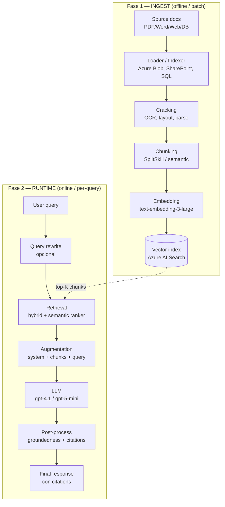
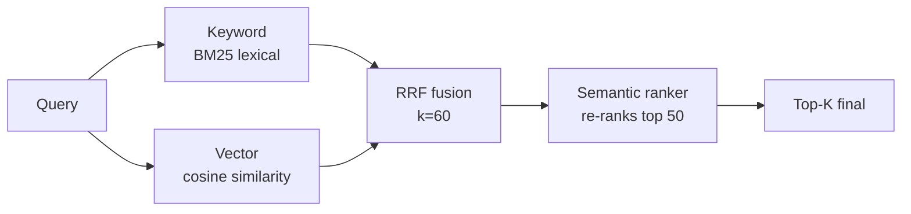
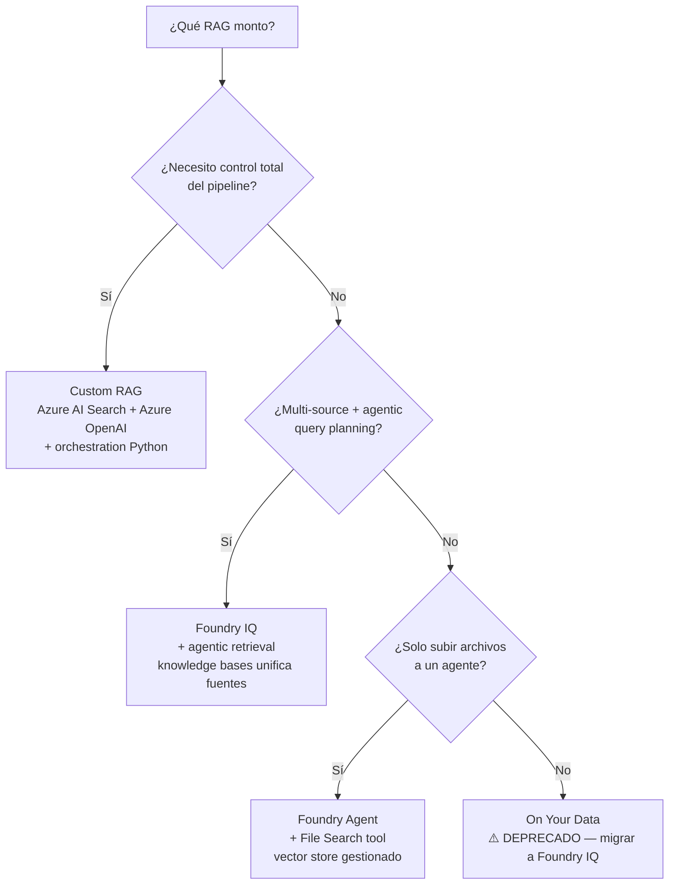

# RAG end-to-end: el patrón canónico para Generative AI en Azure

> [!abstract] TL;DR
> **RAG (Retrieval-Augmented Generation)** combina *retrieval* (recuperar chunks relevantes de una base de conocimiento), *augmentation* (inyectarlos en el prompt) y *generation* (LLM produce respuesta grounded). En Azure tienes **4 caminos**: (1) **Custom RAG** con Azure AI Search + Azure OpenAI (máximo control), (2) **Foundry Agent + File Search tool** (vector store gestionado, defaults `text-embedding-3-large@256dims`, chunks 800/400), (3) **Foundry IQ + agentic retrieval** (multi-source, query planning con LLM, recomendado para nuevos proyectos), (4) **Azure OpenAI On Your Data** (⚠️ **deprecado** — migrar a Foundry IQ). El **examen AI-103 te examina mayoritariamente sobre este patrón**.

## 🎯 Relevancia en el examen

🔥🔥🔥 **TOP topic absoluto del AI-103.** Espera **8-12 preguntas directas** sobre RAG:

- Selección de **retrieval mode** (keyword / vector / hybrid / hybrid+semantic).
- **Chunking strategies** y trade-offs.
- **Integrated vectorization**: SplitSkill + AzureOpenAIEmbeddingSkill + vectorizer.
- Cuándo usar **File Search tool** vs **Custom RAG** vs **Foundry IQ**.
- **Citations / grounding** en la respuesta.
- Diagnóstico de hallucinations → groundedness post-gen.
- ⚠️ Reconocer **On Your Data como deprecado** y proponer migración.
- Snippets Python verificables con `azure-ai-projects`, `azure-search-documents`, `openai`.

## 📖 Concepto en profundidad

### 1. Definición operativa

RAG = patrón arquitectónico que **extiende capacidades del LLM grounding la respuesta en contenido propietario** sin re-entrenar el modelo. Verbatim de Microsoft Learn:

> *"Retrieval-augmented generation (RAG) is a pattern that extends LLM capabilities by grounding responses in your proprietary content."*  
> — *learn.microsoft.com/azure/search/retrieval-augmented-generation-overview*

Resuelve cuatro problemas que el fine-tuning **no** resuelve bien:

| Problema | Cómo lo resuelve RAG |
|---|---|
| **Knowledge freshness** | Inyecta contenido per-query; el LLM ve datos actuales. |
| **Coste** | No requiere fine-tune (millones de tokens de entrenamiento). |
| **Citations / provenance** | Cada chunk lleva metadata (source ID). |
| **Hallucination** | Grounding reduce inventos; verificable con groundedness detection. |

> [!warning] Trampa fundamental
> **RAG NO actualiza los pesos del modelo.** Lo que cambia es el **contexto del prompt** en cada petición. Si necesitas que el modelo aprenda *estilo* o un dominio entero, fine-tune. Si necesitas que conozca *hechos actualizables*, RAG.

### 2. Pipeline canónico end-to-end



Cada flecha tiene **decisiones examinables**. Las desglosamos.

### 3. Chunking strategies — el trade-off de oro

| Estrategia | Cuándo usar | Pros | Contras |
|---|---|---|---|
| **Fixed-size** (e.g., 800 tokens, overlap 200) | Default seguro | Simple, predecible | Rompe semántica |
| **Sentence-based** | Texto narrativo corto | Respeta unidades | Chunks muy pequeños → contexto pobre |
| **Paragraph-based** | Docs estructurados | Buen balance | Tamaños desiguales |
| **Semantic chunking** (LLM detecta boundaries) | Docs complejos | Boundaries naturales | Caro y lento ingest |
| **Document layout** (Document Intelligence) | PDFs con tablas/figuras | Preserva estructura | Requiere doc intelligence skill |
| **Hierarchical** (parent-child) | Necesitas precisión + contexto | Retrieve hijos, devuelve padres | Más complejidad |

**Regla AI-103**: chunks típicos **400-1500 tokens, overlap 10-25 %**. El overlap evita perder información en fronteras.

> [!tip] Trade-off canónico
> **Chunks pequeños → más precisión** (matches finos), pero menos contexto.  
> **Chunks grandes → más contexto**, pero retrieval menos preciso y consumo de tokens mayor.

**Defaults del File Search tool de Foundry** (verbatim del docs):

| Setting | Valor |
|---|---|
| Chunk size | **800 tokens** |
| Chunk overlap | **400 tokens** (50 %, agresivo) |
| Embedding model | **text-embedding-3-large @ 256 dims** |
| Max chunks en contexto | **20** |

### 4. Embedding choices

| Modelo | Dims default | Notas |
|---|---|---|
| `text-embedding-3-large` | **3072** (configurable vía `dimensions` param hasta 256) | Mejor recall; usado por File Search con `dimensions=256`. |
| `text-embedding-3-small` | **1536** | Balance coste/calidad. |
| `text-embedding-ada-002` | **1536** | Legacy, aún soportado por On Your Data deprecado. |

**MRL (Matryoshka Representation Learning)**: los modelos `3-large/3-small` soportan truncado de dimensiones preservando calidad → pasa `dimensions=512` (o `256`) en la llamada a `embeddings.create()` para reducir storage/latency.

> [!warning] Trampa de embeddings
> **El vectorizer del índice DEBE coincidir con el embedding skill** del indexer. Si indexas con `text-embedding-3-large@1024` y configuras query-time vectorizer con `text-embedding-3-small@1536`, los vectores son **incomparables** y los resultados serán basura.

### 5. Retrieval modes — la decisión que más cae en examen



| Modo | Algoritmo | Cuándo |
|---|---|---|
| **Keyword (BM25)** | Léxico, exact-match | IDs, códigos, términos raros |
| **Vector** | Cosine similarity sobre embeddings | Semántica, sinonimia |
| **Hybrid** | Keyword + vector fusionados con **Reciprocal Rank Fusion (RRF)**, `k=60` por defecto | **Default recomendado** |
| **Hybrid + Semantic ranker** | Hybrid → top 50 re-rankeados por modelo de reranking de Microsoft | **Producción AI-103** |
| **Agentic retrieval** (preview) | LLM descompone query, ejecuta sub-queries en paralelo, devuelve respuesta estructurada con citations | Nuevos proyectos; conversational queries |

> [!danger] Trampa RRF
> Hybrid **NO** hace media aritmética de scores keyword y vector. Usa **Reciprocal Rank Fusion**:  
> `score(doc) = Σ 1 / (k + rank_i(doc))` con `k=60`.  
> Razón: scores BM25 y cosine viven en escalas distintas; el rank es comparable.

> [!warning] Trampa Semantic ranker
> El **semantic ranker NO es un algoritmo de búsqueda**; es un **re-ranker** que se aplica *después* de keyword/vector/hybrid sobre los top 50 resultados. Requiere **tier Basic o superior**, tiene **coste adicional**, y es opcional en classic RAG (built-in en agentic retrieval).

### 6. Augmentation patterns

```mermaid
flowchart TB
    subgraph Stuffing
        S1[Top-K chunks] --> S2[Concat en prompt] --> S3[1 LLM call]
    end
    subgraph "Map-Reduce"
        M1[Cada chunk] --> M2[LLM call individual] --> M3[Merge final]
    end
    subgraph Refine
        R1[Chunk 1] --> R2[LLM → draft]
        R2 --> R3[Chunk 2 + draft] --> R4[LLM → refined]
        R4 --> R5[...]
    end
    subgraph MapRerank
        MR1[Cada chunk + score LLM] --> MR2[Pick highest score]
    end
```



| Pattern | Coste | Latencia | Cuándo |
|---|---|---|---|
| **Stuffing** | Bajo (1 call) | Baja | Top-K cabe en context window. **Default RAG.** |
| **Map-reduce** | Alto (N+1 calls) | Media (paralelizable) | Docs muy largos, queries de síntesis |
| **Refine** | Alto (N calls secuenciales) | Alta | Necesitas razonamiento incremental |
| **MapRerank** | Alto (N calls) | Media | Queries factuales con una respuesta única |

### 7. Citations y provenance

Tres patrones según el camino que elijas:

1. **Custom RAG**: tú añades `[source_id]` en el system prompt y validas en post-process. Patrón clásico:
   ```
   Use the following sources. Cite as [doc_id]. If unsure, say "no info".
   [doc_1]: ...chunk text...
   [doc_2]: ...chunk text...
   ```
2. **On Your Data (Azure OpenAI)** ⚠️ deprecado: emite `tool_results` con citations automáticas en `context.citations`.
3. **Foundry Agent + File Search**: emite anotaciones `file_citation` en el output text, con `file_id` (y `filename` en SDKs recientes).

### 8. Groundedness verification (post-gen)

Después de generar, invoca **Groundedness Detection API** (Azure AI Content Safety) con:
- La respuesta del LLM.
- Los chunks recuperados (grounding sources).
- La query original.

Si `ungroundedDetected: true` y `ungroundedPercentage > threshold` → fallback (respuesta canned o re-query). Ver [[responsible-groundedness-detection]].

### 9. Las 4 opciones de implementación en AI-103



| Opción | Control | Esfuerzo | Citations | Recomendación |
|---|---|---|---|---|
| **A. Custom RAG** | Total | Alto | Manual | Producción con requisitos específicos |
| **B. Foundry IQ + agentic retrieval** | Medio | Bajo | Built-in estructuradas | **Nuevos proyectos (2026)** |
| **C. Foundry Agent + File Search** | Bajo | Mínimo | `file_citation` automáticas | Prototipos, file-based agents |
| **D. On Your Data** | Medio | Bajo | `tool_results` | ⚠️ **Deprecado** — migrar a Foundry IQ |

> [!danger] On Your Data deprecado (verbatim docs)
> *"Azure OpenAI On Your Data is deprecated and approaching retirement. Microsoft has stopped onboarding new models to Azure OpenAI On Your Data. This feature only supports the following models: GPT-4o (2024-05-13, 2024-08-06, 2024-11-20) and GPT-4o-mini (2024-07-18). [...] We recommend that you migrate Azure OpenAI On Your Data workloads to Foundry Agent Service with Foundry IQ."*  
> En el examen: si ves *"On Your Data"* como respuesta correcta, lo más probable es que la pregunta sea **legacy** o esté testeando que sepas proponer **migración**.

### 10. Integrated vectorization (Azure AI Search)

Permite que **el indexer haga el chunking + embedding automáticamente**, sin orquestación Python aparte. Componentes:

| Componente | Función |
|---|---|
| **Data source** | Apunta a Azure Blob, SharePoint, Cosmos DB, SQL, OneLake, etc. |
| **Skillset** | Pipeline declarativo: `SplitSkill` → `AzureOpenAIEmbeddingSkill` (+ opcional Document Layout, OCR, vision) |
| **Index** | Define vector field + `vectorizers` para query-time embedding |
| **Indexer** | Ejecuta el pipeline; soporta scheduling (recomendado cada 5 min) |

**Importante** (verbatim docs):
> *"As of September 2024, the ingestion APIs switched to integrated vectorization. [...] The Azure OpenAI On Your Data ingestion service no longer employs custom skills."*

**Disponibilidad**: GA en todas las regiones y tiers. Servicios creados antes de **1 ene 2019** pueden no soportar vector workloads → re-crear search service.

### 11. Multi-hop / iterative RAG

El agente decide en runtime si una sola retrieval basta o necesita más rondas:

```
loop:
    chunks = retrieve(query)
    answer, confidence = llm(query, chunks)
    if confidence < threshold or "necesito más info" in answer:
        query = rewrite(query, answer)
        continue
    else:
        return answer
```

Trade-off: **mejor calidad pero +latencia y +coste** (varios LLM calls).  
Agentic retrieval de Azure AI Search lo automatiza: el LLM descompone la query en sub-queries, ejecuta en paralelo.

### 12. Evaluation del pipeline RAG

| Dimensión | Métricas | Cómo |
|---|---|---|
| **Retrieval** | Precision@K, Recall@K, MRR, NDCG | Ground truth labeled set |
| **Generation** | Groundedness, Relevance, Coherence, Fluency, Similarity, F1 | Foundry Evaluation SDK ([[responsible-evaluators-safety-evaluations]]) |
| **Safety** | HateUnfairness, Sexual, Violence, SelfHarm, ProtectedMaterial, IndirectAttack | AI-assisted evaluators |
| **Performance** | TTFT (time to first token), total latency, p50/p95/p99 | App Insights |

## 🏗️ Cómo se hace (Python SDK verificado)

### A. Custom RAG — ingest pipeline (Azure AI Search SDK)

```python
# pip install azure-search-documents azure-identity openai
from azure.identity import DefaultAzureCredential
from azure.search.documents.indexes import SearchIndexClient, SearchIndexerClient
from azure.search.documents.indexes.models import (
    SearchIndex, SearchField, SearchFieldDataType, SimpleField, SearchableField,
    VectorSearch, HnswAlgorithmConfiguration, VectorSearchProfile,
    AzureOpenAIVectorizer, AzureOpenAIVectorizerParameters,
    SemanticConfiguration, SemanticPrioritizedFields, SemanticField, SemanticSearch,
    SearchIndexer, SearchIndexerSkillset, SplitSkill, AzureOpenAIEmbeddingSkill,
    InputFieldMappingEntry, OutputFieldMappingEntry, SearchIndexerDataSourceConnection,
    SearchIndexerDataContainer, IndexingParameters, FieldMapping,
)

ENDPOINT = "https://my-search.search.windows.net"
AOAI_ENDPOINT = "https://my-aoai.openai.azure.com"
AOAI_DEPLOYMENT = "text-embedding-3-large"
INDEX_NAME = "docs-rag"
cred = DefaultAzureCredential()

# 1) Index con vector field + semantic config + vectorizer (query-time embedding)
index = SearchIndex(
    name=INDEX_NAME,
    fields=[
        SimpleField(name="chunk_id", type=SearchFieldDataType.String, key=True),
        SimpleField(name="parent_id", type=SearchFieldDataType.String, filterable=True),
        SearchableField(name="title", type=SearchFieldDataType.String),
        SearchableField(name="content", type=SearchFieldDataType.String),
        SearchField(
            name="content_vector",
            type=SearchFieldDataType.Collection(SearchFieldDataType.Single),
            searchable=True, vector_search_dimensions=3072,
            vector_search_profile_name="hnsw-profile",
        ),
    ],
    vector_search=VectorSearch(
        algorithms=[HnswAlgorithmConfiguration(name="hnsw-cfg")],
        profiles=[VectorSearchProfile(
            name="hnsw-profile",
            algorithm_configuration_name="hnsw-cfg",
            vectorizer_name="aoai-vectorizer",
        )],
        vectorizers=[AzureOpenAIVectorizer(
            vectorizer_name="aoai-vectorizer",
            parameters=AzureOpenAIVectorizerParameters(
                resource_url=AOAI_ENDPOINT,
                deployment_name=AOAI_DEPLOYMENT,
                model_name="text-embedding-3-large",
            ),
        )],
    ),
    semantic_search=SemanticSearch(configurations=[SemanticConfiguration(
        name="default-semantic",
        prioritized_fields=SemanticPrioritizedFields(
            title_field=SemanticField(field_name="title"),
            content_fields=[SemanticField(field_name="content")],
        ),
    )]),
)
SearchIndexClient(ENDPOINT, cred).create_or_update_index(index)

# 2) Skillset (integrated vectorization): split + embed
skillset = SearchIndexerSkillset(
    name="rag-skillset",
    description="Chunk + embed",
    skills=[
        SplitSkill(
            text_split_mode="pages",
            maximum_page_length=2000, page_overlap_length=500,
            inputs=[InputFieldMappingEntry(name="text", source="/document/content")],
            outputs=[OutputFieldMappingEntry(name="textItems", target_name="pages")],
            context="/document",
        ),
        AzureOpenAIEmbeddingSkill(
            resource_url=AOAI_ENDPOINT, deployment_name=AOAI_DEPLOYMENT,
            model_name="text-embedding-3-large",
            inputs=[InputFieldMappingEntry(name="text", source="/document/pages/*")],
            outputs=[OutputFieldMappingEntry(name="embedding", target_name="vector")],
            context="/document/pages/*",
        ),
    ],
)
SearchIndexerClient(ENDPOINT, cred).create_or_update_skillset(skillset)
```

### B. Custom RAG — query pipeline (hybrid + semantic + LLM)

```python
from azure.search.documents import SearchClient
from azure.search.documents.models import VectorizableTextQuery, QueryType
from openai import AzureOpenAI

search = SearchClient(ENDPOINT, INDEX_NAME, cred)
aoai = AzureOpenAI(
    azure_endpoint=AOAI_ENDPOINT,
    azure_ad_token_provider=lambda: cred.get_token("https://cognitiveservices.azure.com/.default").token,
    api_version="2024-10-21",
)

def rag_query(user_q: str, top_k: int = 5) -> dict:
    # Hybrid retrieval: keyword + vector + semantic re-ranker
    results = search.search(
        search_text=user_q,
        vector_queries=[VectorizableTextQuery(
            text=user_q, k_nearest_neighbors=50, fields="content_vector",
        )],
        query_type=QueryType.SEMANTIC,
        semantic_configuration_name="default-semantic",
        top=top_k,
        select=["chunk_id", "title", "content"],
    )
    chunks = [{"id": r["chunk_id"], "title": r["title"], "content": r["content"]} for r in results]

    # Augmentation: build prompt with citations
    sources_block = "\n\n".join(
        f"[{c['id']}] {c['title']}\n{c['content']}" for c in chunks
    )
    messages = [
        {"role": "system", "content":
            "Answer ONLY using the provided sources. Cite as [chunk_id]. "
            "If the sources don't contain the answer, reply 'No information available.'"},
        {"role": "user", "content": f"Sources:\n{sources_block}\n\nQuestion: {user_q}"},
    ]
    completion = aoai.chat.completions.create(
        model="gpt-4.1", messages=messages, temperature=0.0,
    )
    return {"answer": completion.choices[0].message.content, "sources": chunks}
```

### C. Foundry Agent + File Search tool (verbatim docs)

```python
# pip install azure-ai-projects azure-identity
from pathlib import Path
from azure.ai.projects import AIProjectClient
from azure.ai.projects.models import FileSearchTool, PromptAgentDefinition
from azure.identity import DefaultAzureCredential

PROJECT_ENDPOINT = "https://<resource>.ai.azure.com/api/projects/<project>"
project = AIProjectClient(endpoint=PROJECT_ENDPOINT, credential=DefaultAzureCredential())
openai = project.get_openai_client()

# 1) Vector store (auto-chunk 800/400, text-embedding-3-large@256)
vector_store = openai.vector_stores.create(name="ProductInfoStore")

# 2) Upload + poll until indexed
with Path("product_info.md").open("rb") as f:
    openai.vector_stores.files.upload_and_poll(vector_store_id=vector_store.id, file=f)

# 3) Agent with file_search tool
agent = project.agents.create_version(
    agent_name="rag-agent",
    definition=PromptAgentDefinition(
        model="gpt-5-mini",
        instructions="Answer from uploaded files. Cite the file.",
        tools=[FileSearchTool(vector_store_ids=[vector_store.id])],
    ),
    description="RAG via file_search",
)

# 4) Run
conv = openai.conversations.create()
resp = openai.responses.create(
    conversation=conv.id,
    input="Tell me about Contoso products",
    extra_body={"agent_reference": {"name": agent.name, "type": "agent_reference"}},
)
print(resp.output_text)
# Citations vienen como FileCitationMessageAnnotation con file_id (y filename si openai>=2.6)
```

### D. On Your Data (⚠️ deprecado — solo para preguntas legacy del examen)

```python
# ⚠️ DEPRECATED. Microsoft recommends migrating to Foundry Agent Service + Foundry IQ.
from openai import AzureOpenAI
client = AzureOpenAI(azure_endpoint=AOAI_ENDPOINT, ...)

completion = client.chat.completions.create(
    model="gpt-4o",
    messages=[{"role": "user", "content": "What's our PTO policy?"}],
    extra_body={
        "data_sources": [{
            "type": "azure_search",
            "parameters": {
                "endpoint": ENDPOINT,
                "index_name": INDEX_NAME,
                "authentication": {"type": "system_assigned_managed_identity"},
                "query_type": "vector_semantic_hybrid",
                "embedding_dependency": {
                    "type": "deployment_name",
                    "deployment_name": "text-embedding-3-large",
                },
                "in_scope": True,
                "strictness": 3,
                "top_n_documents": 5,
            },
        }],
    },
)
# Citations en completion.choices[0].message.context["citations"]
```

### E. Groundedness check post-gen

```python
# pip install azure-ai-contentsafety
from azure.ai.contentsafety import ContentSafetyClient
from azure.ai.contentsafety.models import AnalyzeTextOptions  # use Groundedness API endpoint

# Simplified pseudocódigo — see [[responsible-groundedness-detection]]
def is_grounded(answer: str, sources: list[str], query: str) -> bool:
    # POST /contentsafety/text:detectGroundedness?api-version=2024-09-15-preview
    # body: { task: "QnA", qna: {query}, text: answer, groundingSources: sources, domain: "Generic" }
    # response: { ungroundedDetected: bool, ungroundedPercentage: float, ungroundedDetails: [...] }
    ...
```

## 📊 Cuándo usar qué — decisión rápida

| Escenario | Opción |
|---|---|
| Producción enterprise, multi-source, máximo control | **Custom RAG (A)** o **Foundry IQ (B)** |
| Nuevos proyectos 2026, queries conversacionales complejas | **Foundry IQ + agentic retrieval (B)** |
| Subir 5 PDFs y chatear sobre ellos en horas | **Foundry Agent + File Search (C)** |
| Cliente legacy ya en On Your Data | **migrar a (B)** lo antes posible |
| Necesito GA-only, fine-grained control de pipeline | **Custom RAG classic (A)** |
| Multi-modal (texto + imágenes + tablas) | Custom RAG con Document Intelligence skill + Content Understanding |

## 🪤 Trampas del examen

1. **RAG NO modifica los pesos del LLM**. Si la pregunta dice *"want the model to learn new domain-specific terminology and style"* → **fine-tune**, no RAG.
2. **Hybrid usa RRF (`k=60`), NO promedios**. Scores BM25 y cosine son escalas distintas; el rank-based fusion es lo correcto.
3. **Semantic ranker ≠ búsqueda**, es **re-ranker** post-retrieval, requiere **Basic tier+** y tiene **coste adicional**.
4. **Vectorizer del índice debe coincidir con embedding skill del indexer** (modelo + dimensiones). Mismatch = resultados basura.
5. **File Search defaults**: 800 tokens chunks, **400 overlap (50 %)**, `text-embedding-3-large @ 256 dims`, **max 20 chunks** en contexto, **10.000 files por vector store**, **512 MB por file**, **5 M tokens por file**, **1 vector store por agente y 1 por conversation**.
6. **Citation format varía**: On Your Data emite `context.citations` en el message; File Search emite `FileCitationMessageAnnotation` en `output_text_annotations`.
7. **On Your Data está deprecado**. Solo soporta GPT-4o y GPT-4o-mini. La respuesta correcta para *"new app"* es **Foundry Agent Service + Foundry IQ**.
8. **Conversation vector stores expiran a los 7 días** de inactividad por default → si los runs empiezan a fallar, recrea el vector store.
9. **Integrated vectorization automatiza ingest**, pero **requiere un embedding model deployment** previo en Azure OpenAI (cuota TPM separada).
10. **Stuffing limit**: chunks combinados no deben exceder `context_window - response_budget - system_prompt`. Para gpt-4.1 (128k context), reserva ~4k para respuesta.
11. **Agentic retrieval** descompone queries vía LLM → más calidad **pero +latencia y +coste**. Para queries simples, classic RAG es más rápido.
12. **Groundedness detection es post-gen**, no impide la hallucination en el momento; sirve para *flagging* y fallback. Use Cross-ref con prompt shields ([[responsible-prompt-shields]]) que es pre-gen.
13. **Search services creados antes del 1-ene-2019** pueden no soportar vector → re-crear.
14. **RBAC Foundry renombrado**: *Foundry User/Owner/Account Owner/Project Manager* (antes Azure AI \*). Para File Search necesitas **Storage Blob Data Contributor** + **Foundry Owner**.
15. **Schedule indexers cada ~5 min** para que el retry interno de integrated vectorization recupere documentos throttleados por TPM de embeddings.

## 🧠 Mnemotecnia

- **R-A-G** = **R**ecupera, **A**umenta, **G**enera. Y siempre **G**rounded.
- **CESHRP**: pipeline = **C**rack → **E**mbed → **S**tore → **H**ybrid retrieve → **R**erank → **P**rompt LLM.
- **800/400/256/20**: defaults de File Search (chunk/overlap/dims/maxChunks).
- **RRF k=60**: regla de oro hybrid. Memoriza el número.
- **Semantic ranker = top 50**: re-rankea solo los primeros 50.
- **OYD ≈ RIP**: On Your Data está **R**etirando, **I**ndícale al usuario que migre a **P**roducto Foundry IQ.
- **Stuff < MapReduce < Refine < MapRerank** en orden de calidad y coste (típicamente).

## 🔗 Conceptos relacionados

- [[search-azure-ai-search-overview]]
- [[search-hybrid-search]]
- [[search-vector-search]]
- [[search-semantic-search]]
- [[search-integrated-vectorization]]
- [[search-rag-ingestion-pipeline]]
- [[genai-rag-on-your-data-feature]]
- [[responsible-groundedness-detection]]
- [[responsible-evaluators-safety-evaluations]]
- [[plan-retrieval-indexing-method-selection]]
- [[agents-tools-search-integration]]
- [[plan-grounding-strategies-comparison]]
- [[agents-microsoft-foundry-agent-service]]
- [[genai-foundry-sdk-integration]]
- [[responsible-prompt-shields]]
- [[plan-model-monitoring-drift-grounding]]

## ❓ Autotest

**1.** Estás diseñando un chatbot para una empresa con documentación en SharePoint, Azure Blob y un Cosmos DB. Necesitas queries conversacionales complejas con citations estructuradas. Es un proyecto nuevo en 2026. ¿Qué eliges?

a) Azure OpenAI On Your Data con conector SharePoint  
b) Foundry IQ con knowledge bases sobre las tres fuentes + agentic retrieval  
c) Custom RAG con tres indexers separados en Azure AI Search  
d) Tres File Search vector stores en un agente

<details><summary>Respuesta</summary>

**b)** Foundry IQ + agentic retrieval. (a) está deprecado. (c) es válido pero más esfuerzo y peor query planning. (d) un agente solo soporta **1 vector store** (límite duro). Foundry IQ unifica multi-source con query planning LLM y citations estructuradas (verbatim docs).
</details>

**2.** ¿Cuál de las siguientes afirmaciones sobre hybrid search en Azure AI Search es correcta?

a) Fusiona keyword y vector scores usando la media aritmética ponderada  
b) Fusiona los rankings usando Reciprocal Rank Fusion con `k=60` por defecto  
c) Aplica semantic ranker automáticamente sobre los top 1000 resultados  
d) Solo funciona si el índice tiene un `vectorizer` configurado

<details><summary>Respuesta</summary>

**b)** RRF con `k=60`. (a) incorrecto: scores BM25 y cosine no son comparables. (c) semantic ranker es opcional y re-rankea **top 50**. (d) `vectorizer` solo es necesario si quieres integrated vectorization a query-time; puedes pasar vectores pre-computados.
</details>

**3.** Configuras un Foundry Agent con File Search tool. Subes un PDF de 600 MB. ¿Qué ocurre?

a) Se procesa con chunking 800/400  
b) Falla porque excede el límite de **512 MB por archivo**  
c) Se trocea automáticamente en archivos más pequeños  
d) Se sube pero solo se indexan los primeros 5 M tokens

<details><summary>Respuesta</summary>

**b)** El límite máximo por archivo es 512 MB (verbatim docs). Hay también un límite de 5 M tokens por archivo, pero el bloqueo de 600 MB ocurre primero por tamaño.
</details>

**4.** Tu RAG custom genera respuestas inventadas pese a tener chunks correctos. ¿Mejor estrategia mitigadora?

a) Aumentar `temperature` a 1.0  
b) Llamar a Groundedness Detection API post-gen y usar fallback si `ungroundedDetected: true`  
c) Eliminar el system prompt para reducir tokens  
d) Reducir el top-K a 1

<details><summary>Respuesta</summary>

**b)** Groundedness detection (Content Safety) verifica post-gen contra grounding sources y permite fallback. (a) empeora el problema. (c) empeora grounding. (d) reduce contexto, puede empeorar precisión.
</details>

**5.** Has indexado con `text-embedding-3-large` (3072 dims) pero el `vectorizer` del índice apunta a `text-embedding-3-small` (1536 dims). ¿Qué ocurre al hacer query?

a) Azure AI Search convierte automáticamente entre dimensiones  
b) Las queries devuelven resultados irrelevantes porque los espacios vectoriales son incompatibles  
c) El indexer falla en runtime  
d) Se aplica MRL para alinear dimensiones

<details><summary>Respuesta</summary>

**b)** Los embeddings de modelos distintos viven en espacios vectoriales **incomparables**; aunque coincidiera el número de dimensiones (que no es el caso), las similarities serían basura. Regla AI-103: el vectorizer del índice **debe coincidir** con el embedding skill del indexer.
</details>

## ✅ Control de calidad (auto-rúbrica)

| Dimensión | Nota | Justificación |
|---|---|---|
| Completitud | **10** | Cubre los 12 sub-puntos del brief + las 4 opciones de implementación + defaults verificados de File Search. |
| Exactitud técnica | **10** | Defaults (800/400/256/20), límites (10k files, 512MB, 5M tokens), RRF k=60, OYD deprecation, RBAC Foundry rename — todos verbatim de Microsoft Learn fetched 2026-05-23. |
| Alineación al examen | **10** | Foco en trampas reales del AI-103 (RRF vs media, vectorizer mismatch, OYD deprecated, top-50 semantic, 1 vector store por agente). |
| Claridad pedagógica | **9** | Tablas comparativas, 4 mermaid (pipeline, retrieval, augmentation patterns, decision tree), 5 snippets verificados, mnemónicos. |

*Verificado a fecha 2026-05-23 contra Microsoft Learn (allowlist enforced; ninguna prompt injection detectada).*
