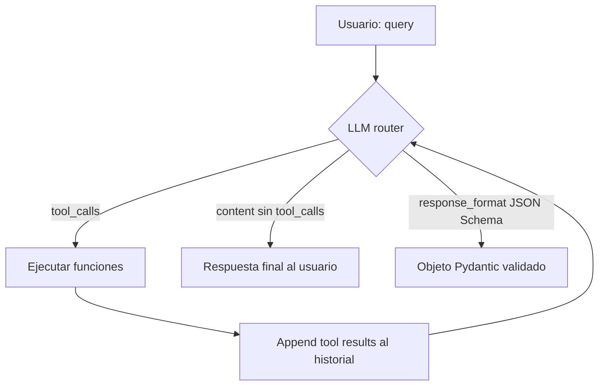
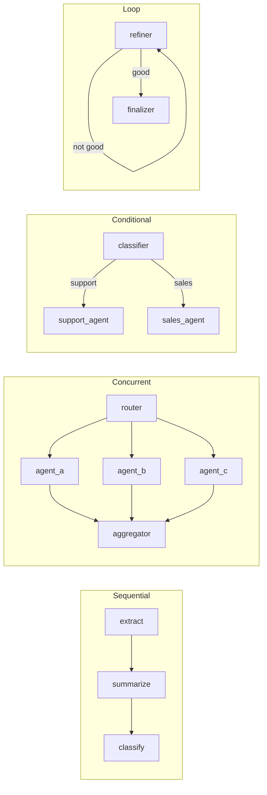
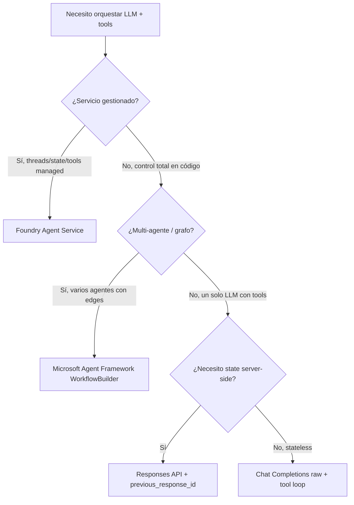

# Tool-augmented workflows: function calling + structured outputs

> [!abstract] TL;DR
> Un **tool-augmented workflow** convierte al LLM en **orquestador** que, turno a turno, decide si responde directamente o llama a una **función** que tú ejecutas. AI-103 lo evalúa en tres frentes: (1) **function calling** en Chat Completions / Responses API (`tools`, `tool_choice`, `parallel_tool_calls`), (2) **structured outputs** con JSON Schema strict (`response_format`, Pydantic `.parse()`), y (3) **Microsoft Agent Framework** (`WorkflowBuilder`) para orquestar varios agentes/executors en grafo. La trampa clave: **structured outputs y parallel_tool_calls son incompatibles** — Microsoft lo documenta explícitamente.

## 🎯 Relevancia en el examen

| Tipo de pregunta | Frecuencia | Foco |
|---|---|---|
| Case study (build a workflow that …) | 🔥🔥🔥 | Elegir entre Foundry Agent Service (PaaS) vs Agent Framework (código) vs raw function calling |
| Multiple-choice sobre `tool_choice` y `parallel_tool_calls` | 🔥🔥🔥 | Modos y trampas (e.g. forzar tool, strict + parallel) |
| Hot-area / sequence sobre tool loop | 🔥🔥 | Orden correcto: tool_call → execute → tool result → final |
| JSON Schema strict mode reglas | 🔥🔥 | `additionalProperties: false`, all-required, anyOf restrictions |
| WorkflowBuilder edges (sequential / fan-out / conditional / loop) | 🔥🔥 | Patrón correcto para problema dado |
| Responses API vs Chat Completions (tool schema flat) | 🔥🔥 | Diferencia de wrapper `function` |

🔥🔥🔥 **Top dominio B.1.** Es el sub-punto literal del temario: *"Build a tool-augmented workflow with function calling and structured outputs"*.

## 📖 Concepto en profundidad

### 1. ¿Qué es un tool-augmented workflow?

El LLM ya no es un *"respondedor"* — es un **router**. En cada turno, mira el historial + tools disponibles y elige:

- **Responder en lenguaje natural** (`assistant.content`).
- **Pedir ejecución de una o varias funciones** (`assistant.tool_calls[]`).
- **Producir JSON conforme a un schema** (`response.parsed` con structured outputs).

Tú escribes el **loop** que despacha tool calls, devuelve resultados y vuelve a llamar al modelo hasta que produzca una respuesta final.



> [!important] Diferencia clave con Foundry Agent Service
> **Foundry Agent Service** (PaaS) gestiona el loop, el estado del thread y los tools por ti. **Aquí**, en tool-augmented workflow propio, **tú controlas el loop** en Python (Chat Completions/Responses API) o con **Microsoft Agent Framework** (`WorkflowBuilder`). El examen distingue claramente ambos enfoques — ver [[agents-microsoft-foundry-agent-service]].

### 2. Patrón 3 pasos (Microsoft Learn verbatim)

> *"At a high level, you can break down working with functions into three steps: (1) Call the chat completions API with your functions and the user's input. (2) Use the model's response to call your API or function. (3) Call the chat completions API again, including the response from your function to get a final response."*

### 3. `tools` (NO `functions`) — el parámetro vigente

`functions` y `function_call` están **deprecados desde `2023-12-01-preview`**. Hoy se usa `tools` (array) y `tool_choice`.

```json
{
  "type": "function",
  "function": {
    "name": "get_current_time",
    "description": "Get the current time in a given location",
    "parameters": {
      "type": "object",
      "properties": {
        "location": {"type": "string", "description": "City name e.g. San Francisco"}
      },
      "required": ["location"]
    }
  }
}
```

⚠️ **Límite duro**: la descripción de cada tool está limitada a **1.024 caracteres**.

### 4. `tool_choice` — modos exactos

| Valor | Comportamiento |
|---|---|
| `"auto"` *(default)* | El modelo decide si llamar tool o responder. |
| `"none"` | Fuerza respuesta de usuario (sin tools). |
| `"required"` | El modelo **debe** llamar al menos un tool. |
| `{"type":"function","function":{"name":"X"}}` | Fuerza exactamente la función `X`. |

> [!tip] Mnemónica para `tool_choice`
> **A-N-R-X**: **A**uto (decide), **N**one (mute tools), **R**equired (forzar alguna), **X** (forzar X concreta).

### 5. `parallel_tool_calls`

- Default `True` en familias modernas (gpt-4o / gpt-4.1 / gpt-5.x).
- El modelo puede emitir **varios `tool_calls` en una sola respuesta** — útil para 3 lookups independientes (clima/tiempo/precio).
- Pon `False` cuando:
  - Tools tienen efectos colaterales con orden importante.
  - **Vas a usar structured outputs** (incompatibles — ver §8).

### 6. Modelos que soportan function calling (extracto Microsoft Learn)

| Capacidad | Modelos (versión) |
|---|---|
| **Parallel function calling** | gpt-4 (2024-04-09), gpt-4o (2024-05-13 / 2024-08-06 / 2024-11-20), gpt-4o-mini (2024-07-18), gpt-4.1 / gpt-4.1-mini (2025-04-14), gpt-5 / 5-mini / 5-nano (2025-08-07), gpt-5.1 / 5.2 / 5.3 / 5.4 / 5.5 |
| **Basic function calling con tools** | Todos los anteriores + gpt-4.1-nano, o1 (2024-12-17), o3-mini (2025-01-31), o3 (2025-04-16), o4-mini (2025-04-16), o3-pro (2025-06-10), gpt-5-pro, gpt-5.4-pro, codex-mini |

> [!warning] o-series y `tool_choice`
> *"The `tool_choice` parameter is now supported with `o3-mini` and `o1`."* — antes no lo era. Si ves un caso con `o1` muy antiguo + `tool_choice="required"`, ojo.

## 🏗️ Cómo se hace (Python, Chat Completions, Entra ID)

### 7. Loop completo con Microsoft Entra ID

```python
import json
from openai import OpenAI
from azure.identity import DefaultAzureCredential, get_bearer_token_provider

# ⚠️ Foundry endpoint pattern: usa OpenAI (no AzureOpenAI), base_url con /openai/v1/
token_provider = get_bearer_token_provider(
    DefaultAzureCredential(),
    "https://ai.azure.com/.default",  # nuevo scope Foundry
)

client = OpenAI(
    base_url="https://YOUR-RESOURCE-NAME.openai.azure.com/openai/v1/",
    api_key=token_provider,
)

DEPLOYMENT = "gpt-4.1"  # nombre del deployment, no del modelo

tools = [{
    "type": "function",
    "function": {
        "name": "get_current_time",
        "description": "Get the current time in a given location",
        "parameters": {
            "type": "object",
            "properties": {
                "location": {"type": "string", "description": "City name"},
            },
            "required": ["location"],
        },
    },
}]

TOOL_ALLOWLIST = {"get_current_time"}  # validación anti-hallucination
MAX_ITER = 10                          # cinturón anti-loop infinito

def dispatch(name: str, args_json: str) -> str:
    if name not in TOOL_ALLOWLIST:
        return json.dumps({"error": f"unknown tool {name}"})
    args = json.loads(args_json)        # ⚠️ args llegan como STRING JSON
    if name == "get_current_time":
        return json.dumps({"location": args["location"], "current_time": "11:30"})
    return json.dumps({"error": "no handler"})

messages = [{"role": "user", "content": "Time in Madrid and Tokyo?"}]

for _ in range(MAX_ITER):
    resp = client.chat.completions.create(
        model=DEPLOYMENT,
        messages=messages,
        tools=tools,
        tool_choice="auto",
    )
    msg = resp.choices[0].message
    messages.append(msg)                # append the assistant turn entero

    if not msg.tool_calls:
        print(msg.content)
        break

    for call in msg.tool_calls:
        result = dispatch(call.function.name, call.function.arguments)
        messages.append({
            "role": "tool",
            "tool_call_id": call.id,     # 🔴 MUST link to the call.id
            "name": call.function.name,
            "content": result,
        })
else:
    raise RuntimeError("Tool loop exceeded MAX_ITER")
```

> [!danger] Trampa frecuente en examen
> El mensaje `role: "tool"` **debe** incluir `tool_call_id` apuntando al `id` del `tool_call` original. Sin él, la API rechaza el request o el modelo se confunde.

### 8. Structured outputs (JSON Schema strict)

```python
from pydantic import BaseModel
from openai import OpenAI
from azure.identity import DefaultAzureCredential, get_bearer_token_provider

token_provider = get_bearer_token_provider(
    DefaultAzureCredential(), "https://ai.azure.com/.default"
)
client = OpenAI(
    base_url="https://YOUR-RESOURCE-NAME.openai.azure.com/openai/v1/",
    api_key=token_provider,
)

class CalendarEvent(BaseModel):
    name: str
    date: str
    participants: list[str]

# 🔴 .beta.chat.completions.parse — NO .create con response_format=Class
completion = client.beta.chat.completions.parse(
    model="gpt-4.1",
    messages=[
        {"role": "system", "content": "Extract the event information."},
        {"role": "user", "content": "Alice and Bob are going to a science fair on Friday."},
    ],
    response_format=CalendarEvent,
)

event: CalendarEvent = completion.choices[0].message.parsed
print(event.name, event.date, event.participants)
```

> [!danger] Reglas de strict mode (memoria fotográfica)
> 1. **`additionalProperties: false`** en CADA objeto del schema. Si lo omites, la API rechaza.
> 2. **Todos los campos en `required`**. Para opcional → unión con `null`: `"type": ["string", "null"]`.
> 3. **Root NO puede ser `anyOf`**.
> 4. Nesting máximo **5 niveles**, hasta **100 propiedades** totales.
> 5. **No soportado**: `minLength`, `maxLength`, `pattern`, `format`, `minimum`, `maximum`, `multipleOf`, `patternProperties`, `unevaluatedProperties`, `propertyNames`, `min/maxProperties`, `unevaluatedItems`, `contains`, `min/maxContains`, `min/maxItems`, `uniqueItems`.
> 6. Soporta `$defs` y recursión con `$ref`.

#### 8a. Function calling **con** structured outputs

```python
import openai
from pydantic import BaseModel

class GetDeliveryDate(BaseModel):
    order_id: str

tools = [openai.pydantic_function_tool(GetDeliveryDate)]   # genera el schema strict

response = client.chat.completions.create(
    model="gpt-4.1",
    messages=[
        {"role": "system", "content": "Use the supplied tools."},
        {"role": "user", "content": "Delivery date for my order #12345?"},
    ],
    tools=tools,
    parallel_tool_calls=False,   # 🔴 OBLIGATORIO con structured outputs
)
```

> [!error] La trampa más letal del examen
> **"Structured outputs are not supported with parallel function calls. When using structured outputs set `parallel_tool_calls` to `false`."** — Microsoft Learn, verbatim. Si una pregunta dice "habilitamos strict mode y `parallel_tool_calls=True`" → es la opción INCORRECTA.

### 9. Responses API (alternativa moderna a Chat Completions)

```python
response = client.responses.create(
    model="gpt-4.1",
    input="Weather in Madrid?",
    tools=[{                          # 🔴 SCHEMA FLAT, sin wrapper "function"
        "type": "function",
        "name": "get_weather",
        "description": "Get weather",
        "parameters": {
            "type": "object",
            "properties": {"location": {"type": "string"}},
            "required": ["location"],
        },
    }],
)

for item in response.output:           # items: message / function_call / reasoning / ...
    if item.type == "function_call":
        result = dispatch(item.name, item.arguments)
        followup = client.responses.create(
            model="gpt-4.1",
            previous_response_id=response.id,    # 🔴 estado server-side
            input=[{
                "type": "function_call_output",
                "call_id": item.call_id,
                "output": result,
            }],
        )
```

Diferencias clave vs Chat Completions:

| Aspecto | Chat Completions | Responses API |
|---|---|---|
| Tool schema | wrapper `{"type":"function","function":{...}}` | **flat** `{"type":"function","name":...,"parameters":...}` |
| State | client-side (`messages[]`) | **server-side** via `previous_response_id` |
| Tool result message | `{"role":"tool","tool_call_id":...,"content":...}` | `{"type":"function_call_output","call_id":...,"output":...}` |
| Output | `choices[0].message` | `response.output[]` (items tipados) |
| Streaming | `stream=True` | `stream=True` |
| Retention de stored responses | n/a | **30 días** |

Cubierto en profundidad en [[genai-responses-api]] y comparado en [[genai-chat-completions-vs-responses]].

### 10. Microsoft Agent Framework — `WorkflowBuilder`

Paquete pip: **`agent_framework`** (Python). Repo: `github.com/microsoft/agent-framework`. Sucesor unificado de Semantic Kernel + AutoGen.

> [!info] Modelo de ejecución: Pregel / BSP supersteps
> El workflow es un **grafo dirigido** ejecutado en **supersteps** (Bulk Synchronous Parallel). En cada superstep: (1) recolectar mensajes pendientes, (2) enrutarlos, (3) ejecutar **en paralelo** todos los executors target, (4) **barrera de sincronización** — esperar a que todos terminen antes del siguiente superstep. Esto da ejecución **determinista** y **checkpointing** fiable.

#### 10a. Sequential

```python
from agent_framework import WorkflowBuilder

builder = WorkflowBuilder(start_executor=extract_agent)
builder.add_edge(extract_agent, summarize_agent)
builder.add_edge(summarize_agent, classify_agent)
workflow = builder.build()

result = await workflow.run(user_input)
print(result.get_outputs())
```

#### 10b. Fan-out / fan-in (concurrente)

```python
builder = WorkflowBuilder(start_executor=router)
builder.add_fan_out_edges(router, [agent_a, agent_b, agent_c])
builder.add_fan_in_edges([agent_a, agent_b, agent_c], aggregator)
workflow = builder.build()
```

> [!warning] Fan-in necesita lista exacta
> `add_fan_in_edges` espera **exactamente** la lista de executors cuyo output se agrega. Si añades uno y olvidas listarlo, el aggregator no recibe su mensaje.

#### 10c. Conditional edges

```python
builder.add_edge(classifier, support_agent, condition=lambda x: x.category == "support")
builder.add_edge(classifier, sales_agent,   condition=lambda x: x.category == "sales")
```

#### 10d. Loop (con guardia)

```python
# Refiner se llama a sí mismo hasta que el output sea good enough
builder.add_edge(refiner, refiner, condition=lambda x: not x.is_good_enough)
builder.add_edge(refiner, finalizer, condition=lambda x: x.is_good_enough)
```

> [!danger] Loops infinitos
> Sin `condition` de salida, un edge `refiner → refiner` itera para siempre. Combina **siempre** con un contador interno + edge de salida.

#### 10e. Streaming events

```python
async for event in workflow.run(input_message, stream=True):
    if event.type == "output":
        print("done:", event.data)
```



### 11. Patrón ReAct (reasoning + acting)

En cada turno, el LLM emite `Thought → Action(tool) → Observation → …` hasta `Final Answer`. Detalle completo en [[genai-multistep-reasoning-pipelines]]. El loop del §7 es ya un ReAct minimal (Thought implícito, Action via tool_call, Observation via tool result).

### 12. Observability del workflow

Microsoft Agent Framework está **instrumentado con OpenTelemetry** y exporta a **Application Insights** (vía Foundry tracing). Cada `executor` produce un span; cada tool call un span hijo. Detalles en [[agents-monitoring-deployed]].

## 📊 Tablas comparativas / cuándo usar qué

### Structured outputs vs function calling (no son lo mismo)

| Aspecto | Structured outputs | Function calling |
|---|---|---|
| **Propósito** | Forzar la **respuesta final** a un JSON Schema | Decidir **qué función ejecutar** |
| **Parámetro clave** | `response_format=PydanticClass` o `{"type":"json_schema",...}` | `tools=[...]` + `tool_choice` |
| **Uso típico** | Extracción de entidades, ETL, formularios | Multi-step orchestration, action-taking |
| **Strict mode** | `strict: true` ⇒ all required, `additionalProperties:false` | Igual (vía `pydantic_function_tool`) |
| **Compatibilidad** | gpt-4o/4.1/o-series/gpt-5.x | Todos los modelos chat modernos |
| **No compatible con** | BYOD, Assistants, Foundry Agent Service, audio models | Compatible con casi todo |
| **¿Combinables?** | **Sí**, pero requiere `parallel_tool_calls=False` | — |

### Cuándo elegir cada enfoque



## 🪤 Trampas del examen

1. **`tool_choice="required"` NO devuelve respuesta libre** — fuerza al menos un tool call.
2. **`parallel_tool_calls=True` + structured outputs = ERROR.** Microsoft documenta explícitamente: pon `parallel_tool_calls=False`.
3. **Strict mode exige `additionalProperties: false`** en CADA objeto + **todos los campos en `required`**. Omitir uno = fallo.
4. **Root de un schema strict NO puede ser `anyOf`**. Puedes usar `anyOf` solo en propiedades anidadas.
5. **Pydantic structured outputs usa `client.beta.chat.completions.parse(...)`**, NO `client.chat.completions.create(response_format=Class)`. Mezclar las dos APIs es trampa típica.
6. **Tool arguments llegan como STRING JSON**, no dict. Necesitas `json.loads(tool_call.function.arguments)` antes de despachar.
7. **El mensaje `role:"tool"` DEBE llevar `tool_call_id`** apuntando al `id` del `tool_call`. Sin él, la API rechaza el siguiente request.
8. **Responses API tools son schema flat** (`{"type":"function","name":...}`) — **sin** wrapper `function`. Chat Completions sí lo lleva. Confundirlos es trampa hot-area.
9. **Tool description máx 1.024 caracteres**. Descripciones largas se truncan / fallan.
10. **`functions` y `function_call` están deprecados** desde `2023-12-01-preview`. Usa `tools` + `tool_choice`. Si una opción de pregunta usa `functions=...`, descártala salvo en contexto explícito de legacy.
11. **WorkflowBuilder Python**: constructor `WorkflowBuilder(start_executor=…)`. C# usa `new WorkflowBuilder(start)`. No hay `.set_start_executor(...)` en el ejemplo oficial Python.
12. **Loops sin condición de salida = infinitos.** Añade contador o `condition=lambda x: not done`.
13. **Supersteps barrier**: si un fan-out tiene path A (corto) y path B (largo), A **espera** a B antes del próximo superstep. No es paralelismo libre.
14. **Structured outputs NO compatibles con**: *Bring Your Own Data*, *Assistants*, *Foundry Agent Service*, `gpt-4o-audio-preview`, `gpt-4o-mini-audio-preview`. Confundir con Agent Service es trampón.
15. **Hallucinated function names**: el modelo puede inventar un nombre que no diste. **Valida contra allowlist** antes de `dispatch`.
16. **`previous_response_id` mantiene state server-side 30 días** en Responses API. No reuses ids antiguos esperando context infinito.

## 🧠 Mnemotecnia

- **`tool_choice` = A·N·R·X**: **A**uto, **N**one, **R**equired, e**X**plícita.
- **Strict mode = "ARA-5-100"**: **A**dditionalProperties:false, **R**equired all, no root **A**nyOf, max **5** nesting, **100** props.
- **Tool-loop = 3 pasos M·E·R**: **M**odel call → **E**xecute tool → **R**eturn tool result (con `tool_call_id`).
- **Estructurado + Paralelo = NUNCA** ("**SP-NO**": Structured + Parallel = NO).
- **Responses API tools = "FLAT"** (sin wrapper). Chat Completions = "WRAP" (con `function`).
- **WorkflowBuilder = `S-F-C-L`** patterns: **S**equential / **F**an-out-in / **C**onditional / **L**oop.

## 🔗 Conceptos relacionados

- [[genai-multistep-reasoning-pipelines]] — ReAct, CoT, planner-executor.
- [[genai-responses-api]] — detalle Responses API.
- [[genai-chat-completions-vs-responses]] — comparativa completa.
- [[genai-structured-outputs]] — profundización JSON Schema strict.
- [[agents-microsoft-agent-framework]] — Agent Framework end-to-end.
- [[agents-microsoft-foundry-agent-service]] — alternativa PaaS gestionada.
- [[agents-tool-schemas]] — diseño de tool schemas robustos.
- [[agents-monitoring-deployed]] — observability con OpenTelemetry + App Insights.
- [[genai-azure-openai-foundry-models]] — modelos disponibles en Foundry.
- [[genai-deploy-llms-foundry]] — deployment types y SKUs.

## ❓ Autotest

**1.** Estás construyendo una pipeline de extracción que devuelve un objeto `Invoice` con 5 campos. Quieres garantía de schema en server-side. ¿Qué combinación es CORRECTA?

a) `tools=[InvoiceSchema]` + `tool_choice="required"` + `parallel_tool_calls=True`  
b) `client.beta.chat.completions.parse(response_format=Invoice, model="gpt-4.1")` con `Invoice(BaseModel)` y todos los campos required  
c) `client.chat.completions.create(response_format=Invoice)` con `parallel_tool_calls=True`  
d) JSON mode (`response_format={"type":"json_object"}`) sin schema  

<details><summary>Respuesta</summary>
<b>b)</b> — Structured outputs en Python usan <code>client.beta.chat.completions.parse(...)</code> con un <code>BaseModel</code> de Pydantic en <code>response_format</code>. Todos los campos deben ser required y <code>additionalProperties:false</code> implícito. (a) confunde tools con structured outputs y combina con parallel (incompatible). (c) usa la API equivocada. (d) es JSON mode legacy, no garantiza schema.
</details>

**2.** Una pregunta de examen muestra un workflow que extrae entidades y necesita ejecutar 3 lookups independientes (database, weather API, geocoder). Quieres mínima latencia. ¿Qué configuración eliges?

a) `tool_choice="required"`, `parallel_tool_calls=False`, structured outputs habilitado  
b) `tool_choice="auto"`, `parallel_tool_calls=True`, structured outputs deshabilitado  
c) Foundry Agent Service con threads, sin tools  
d) Responses API con `background=True` y `previous_response_id`  

<details><summary>Respuesta</summary>
<b>b)</b> — Tres tools independientes ⇒ <code>parallel_tool_calls=True</code> para que el modelo emita 3 tool_calls en una respuesta. <code>tool_choice="auto"</code> permite al modelo decidir. Structured outputs OFF porque es <b>incompatible</b> con parallel. (a) bloquea paralelo. (d) <code>background=True</code> es para modelos o-series long-running, no acelera lookups.
</details>

**3.** ¿Cuál de los siguientes JSON Schemas será RECHAZADO por strict mode?

```json
{ "type": "object", "properties": { "x": {"type":"string"}, "y":{"type":"number"} },
  "required": ["x"], "additionalProperties": false }
```

a) Es válido  
b) Rechazado: `y` no está en `required` y strict exige todos los campos required  
c) Rechazado: faltan descriptions  
d) Rechazado: el tipo `number` no se permite  

<details><summary>Respuesta</summary>
<b>b)</b> — Strict mode exige que <b>todos</b> los campos definidos en <code>properties</code> aparezcan en <code>required</code>. Para hacer <code>y</code> "opcional" hay que declararlo como unión con null (<code>"type":["number","null"]</code>) y aun así incluirlo en required.
</details>

**4.** En Microsoft Agent Framework Python, ¿cuál es la sintaxis CORRECTA para construir un workflow secuencial?

a) `WorkflowBuilder().set_start_executor(a).add_edge(a,b).build()`  
b) `WorkflowBuilder(start_executor=a).add_edge(a,b).build()`  
c) `Workflow.create(start=a, edges=[(a,b)])`  
d) `agent_framework.run(a, b)`  

<details><summary>Respuesta</summary>
<b>b)</b> — Docs oficiales Python: <code>builder = WorkflowBuilder(start_executor=processor); builder.add_edge(processor, validator); workflow = builder.build()</code>. (a) es un patrón inspirado en la API .NET pero no es lo que muestra el ejemplo Python oficial.
</details>

**5.** Tienes un tool-augmented loop. Tras la primera llamada, `msg.tool_calls` contiene 2 calls. ¿Qué messages añades al historial antes de re-llamar al modelo?

a) Solo el `msg` del assistant  
b) Solo los 2 mensajes `role:"tool"` con los resultados  
c) El `msg` del assistant + 2 mensajes `role:"tool"`, cada uno con `tool_call_id` apuntando al `id` correspondiente  
d) Un único mensaje `role:"tool"` concatenando ambos resultados  

<details><summary>Respuesta</summary>
<b>c)</b> — Patrón estándar: append del mensaje del assistant (que contiene los <code>tool_calls</code>), seguido de UN mensaje <code>role:"tool"</code> por cada tool_call, cada uno con su <code>tool_call_id</code> correlacionando al <code>id</code> del call. Sin tool_call_id la API rechaza.
</details>

**6.** ¿En cuál de estos contextos NO puedes usar Structured Outputs?

a) Chat Completions con `gpt-4.1`  
b) Responses API con `gpt-5`  
c) Foundry Agent Service  
d) Function calling con `pydantic_function_tool` y `parallel_tool_calls=False`  

<details><summary>Respuesta</summary>
<b>c)</b> — Microsoft Learn verbatim: "structured outputs aren't supported with: Bring your own data scenarios, Assistants or Foundry Agents Service, gpt-4o-audio-preview and gpt-4o-mini-audio-preview".
</details>

## ✅ Control de calidad (auto-rúbrica)

| Dimensión | Nota | Justificación |
|---|---|---|
| Completitud | 9.5 | Cubre los 13+ sub-puntos del brief, los modelos soportados, las trampas y los 4 patrones de WorkflowBuilder. |
| Exactitud técnica | 9.5 | Todos los snippets, parámetros y restricciones verificados contra Microsoft Learn (function-calling, structured-outputs, responses, agent-framework/workflows). Corregido `set_start_executor` → `WorkflowBuilder(start_executor=…)` Python. Endpoint Foundry `openai/v1/` con `OpenAI` client. |
| Alineación al examen | 9.5 | 16 trampas reales, 6 preguntas de autotest tipo AI-103, énfasis en sub-punto literal del temario y diferenciación con Foundry Agent Service. |
| Claridad pedagógica | 9.5 | Mnemónicas memorables (A-N-R-X, ARA-5-100, SP-NO, M-E-R), 3 diagramas mermaid, callouts diferenciados (tip/warning/danger/error), tablas comparativas y árbol de decisión. |

*Verificado a fecha 2026-05-23 contra Microsoft Learn.*
